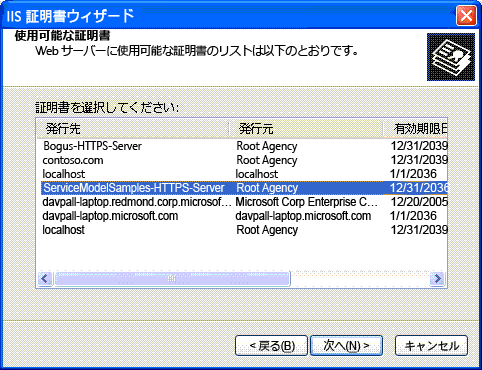

# <a name="internet-information-services-iis-server-certificate-installation-instructions"></a>インターネット インフォメーション サービス (IIS) サーバー証明書インストール手順
インターネット インフォメーション サービス (IIS) と安全に通信するこのサンプルを実行するには、サーバー証明書を作成してインストールする必要があります。  
  
## <a name="step-1-creating-certificates"></a>手順 1. 証明書の作成  
 使用しているコンピューター用の証明書を作成するには、管理特権を使用して Visual Studio コマンド プロンプトを開き、Setup.bat を実行します。Setup.bat は IIS と安全に通信する各サンプルに含まれています。 このバッチ ファイルを実行する前に、Makecert.exe を含むフォルダがパスに含まれていることを確認します。 Setup.bat で証明書の作成に使用されるコマンドは、次のとおりです。  
  
```  
makecert -sr LocalMachine -ss My -n CN=ServiceModelSamples-HTTPS-Server -sky exchange -sk ServiceModelSamples-HTTPS-Key  
```  
  
## <a name="step-2-installing-certificates"></a>手順 2. 証明書のインストール  
 先ほど作成した証明書をインストールするために必要な手順は、使用している IIS のバージョンによって異なります。  
  
#### <a name="to-install-iis-on-iis-51-windows-xp-and-iis-60-windows-server-2003"></a>IIS 5.1 (Windows XP) および IIS 6.0 (Windows Server 2003) に証明書をインストールするには  
  
1.  インターネット インフォメーション サービス マネージャー MMC スナップインを開きます。  
  
2.  既定の Web サイトを右クリックし **プロパティ**です。  
  
3.  選択、**ディレクトリ セキュリティ**タブです。  
  
4.  クリックして、**サーバー証明書**ボタンをクリックします。 Web サーバー証明書ウィザードが起動します。  
  
5.  ウィザードの指示に従います。 証明書を割り当てるオプションを選択します。 表示される証明書の一覧から ServiceModelSamples-HTTPS-Server 証明書を選択します。  
  
       
  
6.  サービスへのアクセスをテストします。ブラウザに HTTPS アドレス「https://localhost/servicemodelsamples/service.svc」を入力します。  
  
#### <a name="if-ssl-was-previously-configured-by-using-httpcfgexe"></a>Httpcfg.exe であらかじめ SSL が構成されている場合  
  
1.  Makecert.exe を使用 (または Setup.bat を実行) して、サーバー証明書を作成します。  
  
2.  IIS マネージャを実行し、前の手順に従って証明書をインストールします。  
  
3.  クライアント プログラムに次のコード行を追加します。  
  
> [!IMPORTANT]
>  このコードが必要になるのは、Makecert.exe によって作成された証明書などをテストする場合のみです。 製品版のコードには、お勧めしません。  
  
```  
PermissiveCertificatePolicy.Enact("CN=ServiceModelSamples-HTTPS-Server");  
```  
  
#### <a name="to-install-iis-on-iis-70-windows-vista-and-windows-server-2008"></a>IIS 7.0 (Windows Vista および Windows Server 2008) に証明書をインストールするには  
  
1.  **開始** メニューのをクリックして**実行**、入力**inetmgr**を開くには、インターネット インフォメーション サービス (IIS) MMC スナップイン。  
  
2.  右クリックし、**既定の Web サイト**選択**バインドを編集しています.**  
  
3.  クリックして、**追加**のボタン、**サイト バインド** ダイアログ ボックス。  
  
4.  選択**HTTPS**から、**型**ドロップダウン リスト。  
  
5.  選択、 **ServiceModelSamples HTTPS サーバー**から、 **SSL 証明書**ドロップダウン リストをクリック**OK**です。  
  
6.  サービスへのアクセスをテストします。ブラウザに HTTPS アドレス「https://localhost/servicemodelsamples/service.svc」を入力します。  
  
> [!NOTE]
>  先ほどインストールしたテスト証明書は信頼された証明書ではないので、この証明書でセキュリティ保護されたローカル Web アドレスを参照した場合、Internet Explorer のセキュリティ警告がさらに発生する場合があります。  
  
## <a name="removing-certificates"></a>証明書の削除  
  
-   前に説明したようにインターネット インフォメーション サービス マネージャーを使用しますが、証明書またはバインディングを追加するのではなく削除します。  
  
-   次のコマンドを使用して、コンピューターの証明書を削除します。  
  
    ```  
    httpcfg delete ssl -i 0.0.0.0:443  
    ```
