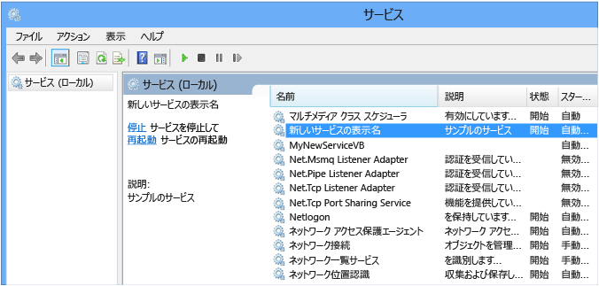

# <a name="walkthrough-creating-a-windows-service-application-in-the-component-designer"></a><span data-ttu-id="e1abd-102">チュートリアル: コンポーネント デザイナーによる Windows サービス アプリケーションの作成</span><span class="sxs-lookup"><span data-stu-id="e1abd-102">Walkthrough: Creating a Windows Service Application in the Component Designer</span></span>
<span data-ttu-id="e1abd-103">この記事では、イベント ログにメッセージを書き込む単純な Windows サービス アプリケーションを Visual Studio で作成する方法を示します。</span><span class="sxs-lookup"><span data-stu-id="e1abd-103">This article demonstrates how to create a simple Windows Service application in Visual Studio that writes messages to an event log.</span></span> <span data-ttu-id="e1abd-104">サービスを作成して使用するために実行する基本的な手順は次のとおりです。</span><span class="sxs-lookup"><span data-stu-id="e1abd-104">Here are the basic steps that you perform to create and use your service:</span></span>  
  
1.  <span data-ttu-id="e1abd-105">[サービスの作成](#BK_CreateProject) Windows Service **プロジェクト テンプレートを使用して** を行い、構成します。</span><span class="sxs-lookup"><span data-stu-id="e1abd-105">[Creating a Service](#BK_CreateProject) by using the **Windows Service** project template, and configure it.</span></span> <span data-ttu-id="e1abd-106">このテンプレートは、<xref:System.ServiceProcess.ServiceBase?displayProperty=nameWithType> を継承するクラスを作成し、基本的なサービス コードの多く (サービスを開始するコードなど) を記述します。</span><span class="sxs-lookup"><span data-stu-id="e1abd-106">This template creates a class for you that inherits from <xref:System.ServiceProcess.ServiceBase?displayProperty=nameWithType> and writes much of the basic service code, such as the code to start the service.</span></span>  
  
2.  <span data-ttu-id="e1abd-107">[サービスへの機能追加](#BK_WriteCode) プロシージャと <xref:System.ServiceProcess.ServiceBase.OnStart%2A> プロシージャの <xref:System.ServiceProcess.ServiceBase.OnStop%2A> を行い、再定義する他のすべてのメソッドを上書きします。</span><span class="sxs-lookup"><span data-stu-id="e1abd-107">[Adding Features to the Service](#BK_WriteCode) for the <xref:System.ServiceProcess.ServiceBase.OnStart%2A> and <xref:System.ServiceProcess.ServiceBase.OnStop%2A> procedures, and override any other methods that you want to redefine.</span></span>  
  
3.  <span data-ttu-id="e1abd-108">[サービスの状態の設定](#BK_SetStatus)。</span><span class="sxs-lookup"><span data-stu-id="e1abd-108">[Setting Service Status](#BK_SetStatus).</span></span> <span data-ttu-id="e1abd-109">既定では、<xref:System.ServiceProcess.ServiceBase?displayProperty=nameWithType> で作成されたサービスは、利用可能な状態フラグのサブセットだけを実装します。</span><span class="sxs-lookup"><span data-stu-id="e1abd-109">By default, services created with <xref:System.ServiceProcess.ServiceBase?displayProperty=nameWithType> implement only a subset of the available status flags.</span></span> <span data-ttu-id="e1abd-110">サービスの開始、一時停止、または停止に時間がかかる場合は、[保留の開始] または [保留の停止] などの状態値を実装し、操作の実行中であることを示すことができます。</span><span class="sxs-lookup"><span data-stu-id="e1abd-110">If your service takes a long time to start up, pause, or stop, you can implement status values such as Start Pending or Stop Pending to indicate that it's working on an operation.</span></span>  
  
4.  <span data-ttu-id="e1abd-111">[サービスへのインストーラーの追加](#BK_AddInstallers) を行います。</span><span class="sxs-lookup"><span data-stu-id="e1abd-111">[Adding Installers to the Service](#BK_AddInstallers) for your service application.</span></span>  
  
5.  <span data-ttu-id="e1abd-112">(省略可能) [スタートアップ パラメーターの設定](#BK_StartupParameters)を行い、既定の起動時の引数を指定して、ユーザーがサービスを手動で開始するときに既定の設定を上書きできるようにします。</span><span class="sxs-lookup"><span data-stu-id="e1abd-112">(Optional) [Set Startup Parameters](#BK_StartupParameters), specify default startup arguments, and enable users to override default settings when they start your service manually.</span></span>  
  
6.  <span data-ttu-id="e1abd-113">[サービスの構築](#BK_Build)。</span><span class="sxs-lookup"><span data-stu-id="e1abd-113">[Building the Service](#BK_Build).</span></span>  
  
7.  <span data-ttu-id="e1abd-114">[サービスのインストール](#BK_Install) を行います。</span><span class="sxs-lookup"><span data-stu-id="e1abd-114">[Installing the Service](#BK_Install) on the local machine.</span></span>  
  
8.  <span data-ttu-id="e1abd-115">Windows サービス コントロール マネージャーにアクセスし、 [サービスの開始および実行](#BK_StartService)。</span><span class="sxs-lookup"><span data-stu-id="e1abd-115">Access the Windows Service Control Manager and [Starting and Running the Service](#BK_StartService).</span></span>  
  
9. <span data-ttu-id="e1abd-116">[Windows サービスのアンインストール](#BK_Uninstall)。</span><span class="sxs-lookup"><span data-stu-id="e1abd-116">[Uninstalling a Windows Service](#BK_Uninstall).</span></span>  
  
> [!WARNING]
>  <span data-ttu-id="e1abd-117">このチュートリアルで必要な Windows サービスのプロジェクト テンプレートは、Visual Studio Express Edition では使用できません。</span><span class="sxs-lookup"><span data-stu-id="e1abd-117">The Windows Services project template that is required for this walkthrough is not available in the Express edition of Visual Studio.</span></span>  
  
 [!INCLUDE[note_settings_general](../../../includes/note-settings-general-md.md)]  
  
<a name="BK_CreateProject"></a>   
## <a name="creating-a-service"></a><span data-ttu-id="e1abd-118">サービスの作成</span><span class="sxs-lookup"><span data-stu-id="e1abd-118">Creating a Service</span></span>  
 <span data-ttu-id="e1abd-119">最初に、プロジェクトを作成し、サービスが正しく機能するために必要な値を設定します。</span><span class="sxs-lookup"><span data-stu-id="e1abd-119">To begin, you create the project and set values that are required for the service to function correctly.</span></span>  
  
#### <a name="to-create-and-configure-your-service"></a><span data-ttu-id="e1abd-120">サービスを作成して設定するには</span><span class="sxs-lookup"><span data-stu-id="e1abd-120">To create and configure your service</span></span>  
  
1.  <span data-ttu-id="e1abd-121">Visual Studio のメニュー バーで、 **[ファイル]**、 **[新規作成]**、 **[プロジェクト]** の順に選択します。</span><span class="sxs-lookup"><span data-stu-id="e1abd-121">In Visual Studio, on the menu bar, choose **File**, **New**, **Project**.</span></span>  
  
     <span data-ttu-id="e1abd-122">**[新しいプロジェクト]** ダイアログ ボックスが表示されます。</span><span class="sxs-lookup"><span data-stu-id="e1abd-122">The **New Project** dialog box opens.</span></span>  
  
2.  <span data-ttu-id="e1abd-123">Visual Basic や Visual C# のプロジェクト テンプレートの一覧で、 **Windows サービス**を選択し、プロジェクトに「 **MyNewService**」という名前を付けます。</span><span class="sxs-lookup"><span data-stu-id="e1abd-123">In the list of Visual Basic or Visual C# project templates, choose **Windows Service**, and name the project **MyNewService**.</span></span> <span data-ttu-id="e1abd-124">**[OK]** をクリックします。</span><span class="sxs-lookup"><span data-stu-id="e1abd-124">Choose **OK**.</span></span>  
  
     <span data-ttu-id="e1abd-125">プロジェクト テンプレートは、`Service1` を継承する <xref:System.ServiceProcess.ServiceBase?displayProperty=nameWithType> という名前のコンポーネント クラスを自動的に追加します。</span><span class="sxs-lookup"><span data-stu-id="e1abd-125">The project template automatically adds a component class named `Service1` that inherits from <xref:System.ServiceProcess.ServiceBase?displayProperty=nameWithType>.</span></span>  
  
3.  <span data-ttu-id="e1abd-126">**[編集]** メニューで、 **[検索と置換]**、 **[フォルダーを指定して検索]** の順にクリックします (キーボード: Ctrl + Shift + F)。</span><span class="sxs-lookup"><span data-stu-id="e1abd-126">On the **Edit** menu, choose **Find and Replace**, **Find in Files** (Keyboard: Ctrl+Shift+F).</span></span> <span data-ttu-id="e1abd-127">出現するすべての `Service1` を `MyNewService`に変更します。</span><span class="sxs-lookup"><span data-stu-id="e1abd-127">Change all occurrences of `Service1` to `MyNewService`.</span></span> <span data-ttu-id="e1abd-128">Service1.cs、Program.cs、および Service1.Designer.cs (または対応する .vb) にインスタンスがあります。</span><span class="sxs-lookup"><span data-stu-id="e1abd-128">You’ll find instances in Service1.cs, Program.cs, and Service1.Designer.cs (or their .vb equivalents).</span></span>  
  
4.  <span data-ttu-id="e1abd-129">**Service1.cs [Design]** や **Service1.vb [Design]** の **[プロパティ]** ウィンドウで、 <xref:System.ServiceProcess.ServiceBase.ServiceName%2A> の **と** (Name) `Service1` プロパティが **MyNewService**に設定されていない場合は設定します。</span><span class="sxs-lookup"><span data-stu-id="e1abd-129">In the **Properties** window for **Service1.cs [Design]** or **Service1.vb [Design]**, set the <xref:System.ServiceProcess.ServiceBase.ServiceName%2A> and the **(Name)** property for `Service1` to **MyNewService**, if it's not already set.</span></span>  
  
5.  <span data-ttu-id="e1abd-130">ソリューション エクスプローラーで、 **Service1.cs** を **MyNewService.cs**に、または **Service1.vb** を **MyNewService.vb**に変更します。</span><span class="sxs-lookup"><span data-stu-id="e1abd-130">In Solution Explorer, rename **Service1.cs** to **MyNewService.cs**, or **Service1.vb** to **MyNewService.vb**.</span></span>  
  
<a name="BK_WriteCode"></a>   
## <a name="adding-features-to-the-service"></a><span data-ttu-id="e1abd-131">サービスへの機能追加</span><span class="sxs-lookup"><span data-stu-id="e1abd-131">Adding Features to the Service</span></span>  
 <span data-ttu-id="e1abd-132">このセクションでは、Windows サービスにカスタム イベント ログを追加します。</span><span class="sxs-lookup"><span data-stu-id="e1abd-132">In this section, you add a custom event log to the Windows service.</span></span> <span data-ttu-id="e1abd-133">イベント ログは、Windows サービスとまったく関連付けられていません。</span><span class="sxs-lookup"><span data-stu-id="e1abd-133">Event logs are not associated in any way with Windows services.</span></span> <span data-ttu-id="e1abd-134">ここでは、Windows サービスに追加できるコンポーネントの種類の例として、 <xref:System.Diagnostics.EventLog> コンポーネントを使用しています。</span><span class="sxs-lookup"><span data-stu-id="e1abd-134">Here the <xref:System.Diagnostics.EventLog> component is used as an example of the type of component you could add to a Windows service.</span></span>  
  
#### <a name="to-add-custom-event-log-functionality-to-your-service"></a><span data-ttu-id="e1abd-135">サービスにカスタム イベント ログ機能を追加するには</span><span class="sxs-lookup"><span data-stu-id="e1abd-135">To add custom event log functionality to your service</span></span>  
  
1.  <span data-ttu-id="e1abd-136">**ソリューション エクスプローラー**で、 **MyNewService.cs** または **MyNewService.vb**のコンテキスト メニューを開き、 **[デザイナーの表示]** を選択します。</span><span class="sxs-lookup"><span data-stu-id="e1abd-136">In **Solution Explorer**, open the context menu for **MyNewService.cs** or **MyNewService.vb**, and then choose **View Designer**.</span></span>  
  
2.  <span data-ttu-id="e1abd-137">**[ツールボックス]** の **[コンポーネント]** セクションから、 <xref:System.Diagnostics.EventLog> コンポーネントをデザイナーにドラッグします。</span><span class="sxs-lookup"><span data-stu-id="e1abd-137">From the **Components** section of the **Toolbox**, drag an <xref:System.Diagnostics.EventLog> component to the designer.</span></span>  
  
3.  <span data-ttu-id="e1abd-138">**ソリューション エクスプローラー**で、 **MyNewService.cs** または **MyNewService.vb**のコンテキスト メニューを開き、 **[コードの表示]** を選択します。</span><span class="sxs-lookup"><span data-stu-id="e1abd-138">In **Solution Explorer**, open the context menu for **MyNewService.cs** or **MyNewService.vb**, and then choose **View Code**.</span></span>  
  
4.  <span data-ttu-id="e1abd-139">**クラスの、** 変数を宣言している行の直後に、 `MyNewService` eventLog `components` オブジェクトの宣言を追加します。</span><span class="sxs-lookup"><span data-stu-id="e1abd-139">Add a declaration for the **eventLog** object in the `MyNewService` class, right after the line that declares the `components` variable:</span></span>  
  
     [!code-csharp[VbRadconService#16](../../../samples/snippets/csharp/VS_Snippets_VBCSharp/VbRadconService/CS/MyNewService.cs#16)]
     [!code-vb[VbRadconService#16](../../../samples/snippets/visualbasic/VS_Snippets_VBCSharp/VbRadconService/VB/MyNewService.vb#16)]  
  
5.  <span data-ttu-id="e1abd-140">コンストラクターを追加または編集して、カスタム イベント ログを定義します。</span><span class="sxs-lookup"><span data-stu-id="e1abd-140">Add or edit the constructor to define a custom event log:</span></span>  
  
     [!code-csharp[VbRadconService#2](../../../samples/snippets/csharp/VS_Snippets_VBCSharp/VbRadconService/CS/MyNewService.cs#2)]
     [!code-vb[VbRadconService#2](../../../samples/snippets/visualbasic/VS_Snippets_VBCSharp/VbRadconService/VB/MyNewService.vb#2)]  
  
#### <a name="to-define-what-occurs-when-the-service-starts"></a><span data-ttu-id="e1abd-141">サービスの開始時の処理を定義するには</span><span class="sxs-lookup"><span data-stu-id="e1abd-141">To define what occurs when the service starts</span></span>  
  
-   <span data-ttu-id="e1abd-142">コード エディターで、プロジェクトの作成時に自動的にオーバーライドされた <xref:System.ServiceProcess.ServiceBase.OnStart%2A> を見つけ、次のコードに置き換えます。</span><span class="sxs-lookup"><span data-stu-id="e1abd-142">In the Code Editor, locate the <xref:System.ServiceProcess.ServiceBase.OnStart%2A> method that was automatically overridden when you created the project, and replace the code with the following.</span></span> <span data-ttu-id="e1abd-143">これにより、サービスが実行を開始するときに、イベント ログにエントリが追加されます。</span><span class="sxs-lookup"><span data-stu-id="e1abd-143">This adds an entry to the event log when the service starts running:</span></span>  
  
     [!code-csharp[VbRadconService#3](../../../samples/snippets/csharp/VS_Snippets_VBCSharp/VbRadconService/CS/MyNewService.cs#3)]
     [!code-vb[VbRadconService#3](../../../samples/snippets/visualbasic/VS_Snippets_VBCSharp/VbRadconService/VB/MyNewService.vb#3)]  
  
     <span data-ttu-id="e1abd-144">サービス アプリケーションは長期間実行するように設計されているため、通常は、システム内の何かをポーリングまたは監視しています。</span><span class="sxs-lookup"><span data-stu-id="e1abd-144">A service application is designed to be long-running, so it usually polls or monitors something in the system.</span></span> <span data-ttu-id="e1abd-145">この監視は、 <xref:System.ServiceProcess.ServiceBase.OnStart%2A> メソッドで設定します。</span><span class="sxs-lookup"><span data-stu-id="e1abd-145">The monitoring is set up in the <xref:System.ServiceProcess.ServiceBase.OnStart%2A> method.</span></span> <span data-ttu-id="e1abd-146">ただし、 <xref:System.ServiceProcess.ServiceBase.OnStart%2A> は実際には監視を行いません。</span><span class="sxs-lookup"><span data-stu-id="e1abd-146">However, <xref:System.ServiceProcess.ServiceBase.OnStart%2A> doesn’t actually do the monitoring.</span></span> <span data-ttu-id="e1abd-147"><xref:System.ServiceProcess.ServiceBase.OnStart%2A> メソッドは、サービスの操作が開始された後にオペレーティング システムに戻る必要があります。</span><span class="sxs-lookup"><span data-stu-id="e1abd-147">The <xref:System.ServiceProcess.ServiceBase.OnStart%2A> method must return to the operating system after the service's operation has begun.</span></span> <span data-ttu-id="e1abd-148">永久的に続くループやブロックは実行できません。</span><span class="sxs-lookup"><span data-stu-id="e1abd-148">It must not loop forever or block.</span></span> <span data-ttu-id="e1abd-149">単純なポーリング機構を設定するには、<xref:System.Timers.Timer?displayProperty=nameWithType> コンポーネントを次のように使用します。<xref:System.ServiceProcess.ServiceBase.OnStart%2A> メソッドで、コンポーネントのパラメーターを設定してから、<xref:System.Timers.Timer.Enabled%2A> プロパティを `true` に設定します。</span><span class="sxs-lookup"><span data-stu-id="e1abd-149">To set up a simple polling mechanism, you can use the <xref:System.Timers.Timer?displayProperty=nameWithType> component as follows: In the <xref:System.ServiceProcess.ServiceBase.OnStart%2A> method, set parameters on the component, and then set the <xref:System.Timers.Timer.Enabled%2A> property to `true`.</span></span> <span data-ttu-id="e1abd-150">このタイマーによって、コード内で定期的にイベントが発生します。サービスは、イベントが発生するごとに監視を実行できます。</span><span class="sxs-lookup"><span data-stu-id="e1abd-150">The timer raises events in your code periodically, at which time your service could do its monitoring.</span></span> <span data-ttu-id="e1abd-151">このためには、次のコードを使用できます。</span><span class="sxs-lookup"><span data-stu-id="e1abd-151">You can use the following code to do this:</span></span>  
  
    ```csharp  
    // Set up a timer to trigger every minute.  
    System.Timers.Timer timer = new System.Timers.Timer();  
    timer.Interval = 60000; // 60 seconds  
    timer.Elapsed += new System.Timers.ElapsedEventHandler(this.OnTimer);  
    timer.Start();  
    ```  
  
    ```vb  
    ' Set up a timer to trigger every minute.  
    Dim timer As System.Timers.Timer = New System.Timers.Timer()  
    timer.Interval = 60000 ' 60 seconds  
    AddHandler timer.Elapsed, AddressOf Me.OnTimer  
    timer.Start()  
    ```  
     <span data-ttu-id="e1abd-152">クラスにメンバー変数を追加します。</span><span class="sxs-lookup"><span data-stu-id="e1abd-152">Add a member variable to the class.</span></span> <span data-ttu-id="e1abd-153">次のイベント ログに記録するイベントの識別子が格納されます。</span><span class="sxs-lookup"><span data-stu-id="e1abd-153">It will contain the identifier of the next event to write into the event log.</span></span>

    ```csharp
    private int eventId = 1;
    ```

    ```vb
    Private eventId As Integer = 1
    ```

     <span data-ttu-id="e1abd-154">タイマー イベントを処理するコードを追加します。</span><span class="sxs-lookup"><span data-stu-id="e1abd-154">Add code to handle the timer event:</span></span>  
  
    ```csharp  
    public void OnTimer(object sender, System.Timers.ElapsedEventArgs args)  
    {  
        // TODO: Insert monitoring activities here.  
        eventLog1.WriteEntry("Monitoring the System", EventLogEntryType.Information, eventId++);  
    }  
    ```  
  
    ```vb  
    Private Sub OnTimer(sender As Object, e As Timers.ElapsedEventArgs)  
        ' TODO: Insert monitoring activities here.  
        eventLog1.WriteEntry("Monitoring the System", EventLogEntryType.Information, eventId)  
        eventId = eventId + 1  
    End Sub  
    ```  
  
     <span data-ttu-id="e1abd-155">メイン スレッドですべての作業を実行するのではなく、バックグラウンド ワーカー スレッドを使用してタスクを実行する場合があります。</span><span class="sxs-lookup"><span data-stu-id="e1abd-155">You might want to perform tasks by using background worker threads instead of running all your work on the main thread.</span></span> <span data-ttu-id="e1abd-156">例については、<xref:System.ServiceProcess.ServiceBase?displayProperty=nameWithType> のリファレンス ページを参照してください。</span><span class="sxs-lookup"><span data-stu-id="e1abd-156">For an example of this, see the <xref:System.ServiceProcess.ServiceBase?displayProperty=nameWithType> reference page.</span></span>  
  
#### <a name="to-define-what-occurs-when-the-service-is-stopped"></a><span data-ttu-id="e1abd-157">サービスの停止時の処理を定義するには</span><span class="sxs-lookup"><span data-stu-id="e1abd-157">To define what occurs when the service is stopped</span></span>  
  
-   <span data-ttu-id="e1abd-158"><xref:System.ServiceProcess.ServiceBase.OnStop%2A> メソッドのコードを次のコードに置き換えます。</span><span class="sxs-lookup"><span data-stu-id="e1abd-158">Replace the code for the <xref:System.ServiceProcess.ServiceBase.OnStop%2A> method with the following.</span></span> <span data-ttu-id="e1abd-159">これにより、サービスが停止したときに、イベント ログにエントリが追加されます。</span><span class="sxs-lookup"><span data-stu-id="e1abd-159">This adds an entry to the event log when the service is stopped:</span></span>  
  
     [!code-csharp[VbRadconService#4](../../../samples/snippets/csharp/VS_Snippets_VBCSharp/VbRadconService/CS/MyNewService.cs#4)]
     [!code-vb[VbRadconService#4](../../../samples/snippets/visualbasic/VS_Snippets_VBCSharp/VbRadconService/VB/MyNewService.vb#4)]  
  
 <span data-ttu-id="e1abd-160">次のセクションでは、 <xref:System.ServiceProcess.ServiceBase.OnPause%2A>、 <xref:System.ServiceProcess.ServiceBase.OnContinue%2A>、および <xref:System.ServiceProcess.ServiceBase.OnShutdown%2A> の各メソッドをオーバーライドして、コンポーネントの追加の処理を定義できます。</span><span class="sxs-lookup"><span data-stu-id="e1abd-160">In the next section, you can override the <xref:System.ServiceProcess.ServiceBase.OnPause%2A>, <xref:System.ServiceProcess.ServiceBase.OnContinue%2A>, and <xref:System.ServiceProcess.ServiceBase.OnShutdown%2A> methods to define additional processing for your component.</span></span>  
  
#### <a name="to-define-other-actions-for-the-service"></a><span data-ttu-id="e1abd-161">サービスに対して他の処理を定義するには</span><span class="sxs-lookup"><span data-stu-id="e1abd-161">To define other actions for the service</span></span>  
  
-   <span data-ttu-id="e1abd-162">処理するメソッドを見つけ、オーバーライドし、実行する処理を定義します。</span><span class="sxs-lookup"><span data-stu-id="e1abd-162">Locate the method that you want to handle, and override it to define what you want to occur.</span></span>  
  
     <span data-ttu-id="e1abd-163">次のコード例は、 <xref:System.ServiceProcess.ServiceBase.OnContinue%2A> メソッドをオーバーライドする方法を示しています。</span><span class="sxs-lookup"><span data-stu-id="e1abd-163">The following code shows how you can override the <xref:System.ServiceProcess.ServiceBase.OnContinue%2A> method:</span></span>  
  
     [!code-csharp[VbRadconService#5](../../../samples/snippets/csharp/VS_Snippets_VBCSharp/VbRadconService/CS/MyNewService.cs#5)]
     [!code-vb[VbRadconService#5](../../../samples/snippets/visualbasic/VS_Snippets_VBCSharp/VbRadconService/VB/MyNewService.vb#5)]  
  
 <span data-ttu-id="e1abd-164">いくつかのカスタム動作は、Windows サービスが <xref:System.Configuration.Install.Installer> クラスによりインストールされるときに発生する必要があります。</span><span class="sxs-lookup"><span data-stu-id="e1abd-164">Some custom actions have to occur when a Windows service is installed by the <xref:System.Configuration.Install.Installer> class.</span></span> <span data-ttu-id="e1abd-165">Visual Studio は、これらのインストーラーを Windows サービス専用に作成し、プロジェクトに追加できます。</span><span class="sxs-lookup"><span data-stu-id="e1abd-165">Visual Studio can create these installers specifically for a Windows service and add them to your project.</span></span>  
  
<a name="BK_SetStatus"></a>   
## <a name="setting-service-status"></a><span data-ttu-id="e1abd-166">サービスの状態の設定</span><span class="sxs-lookup"><span data-stu-id="e1abd-166">Setting Service Status</span></span>  
 <span data-ttu-id="e1abd-167">サービスは、その状態をサービス コントロール マネージャーに報告します。これによりユーザーは、サービスが正常に機能しているかどうかを確認することができます。</span><span class="sxs-lookup"><span data-stu-id="e1abd-167">Services report their status to the Service Control Manager, so that users can tell whether a service is functioning correctly.</span></span> <span data-ttu-id="e1abd-168">既定では、 <xref:System.ServiceProcess.ServiceBase> を継承するサービスは、[停止]、[一時停止]、[実行中] など、限られた状態設定のセットを報告します。</span><span class="sxs-lookup"><span data-stu-id="e1abd-168">By default, services that inherit from <xref:System.ServiceProcess.ServiceBase> report a limited set of status settings, including Stopped, Paused, and Running.</span></span> <span data-ttu-id="e1abd-169">サービスの開始に若干時間がかかるときは、[保留の開始] 状態を報告すると役立つ場合があります。</span><span class="sxs-lookup"><span data-stu-id="e1abd-169">If a service takes a little while to start up, it might be helpful to report a Start Pending status.</span></span> <span data-ttu-id="e1abd-170">[保留の開始] と [保留の停止] の状態設定は、Windows の [SetServiceStatus 関数](http://msdn.microsoft.com/library/windows/desktop/ms686241.aspx)を呼び出すコードを追加することによって実装することもできます。</span><span class="sxs-lookup"><span data-stu-id="e1abd-170">You can also implement the Start Pending and Stop Pending status settings by adding code that calls into the Windows [SetServiceStatus function](http://msdn.microsoft.com/library/windows/desktop/ms686241.aspx).</span></span>  
  
#### <a name="to-implement-service-pending-status"></a><span data-ttu-id="e1abd-171">サービス保留の状態を実装するには</span><span class="sxs-lookup"><span data-stu-id="e1abd-171">To implement service pending status</span></span>  
  
1.  <span data-ttu-id="e1abd-172">MyNewService.cs ファイルまたは MyNewService.vb ファイルの `using` 名前空間に、`Imports` ステートメントまたは <xref:System.Runtime.InteropServices?displayProperty=nameWithType> 宣言を追加します。</span><span class="sxs-lookup"><span data-stu-id="e1abd-172">Add a `using` statement or `Imports` declaration to the <xref:System.Runtime.InteropServices?displayProperty=nameWithType> namespace in the MyNewService.cs or MyNewService.vb file:</span></span>  
  
    ```csharp  
    using System.Runtime.InteropServices;  
    ```  
  
    ```vb  
    Imports System.Runtime.InteropServices  
    ```  
  
2.  <span data-ttu-id="e1abd-173">MyNewService.cs に次のコードを追加して、 `ServiceState` の値を宣言し、プラットフォーム呼び出しで使用する状態の構造を追加します。</span><span class="sxs-lookup"><span data-stu-id="e1abd-173">Add the following code to MyNewService.cs to declare the `ServiceState` values and to add a structure for the status, which you'll use in a platform invoke call:</span></span>  
  
    ```csharp  
    public enum ServiceState  
      {  
          SERVICE_STOPPED = 0x00000001,  
          SERVICE_START_PENDING = 0x00000002,  
          SERVICE_STOP_PENDING = 0x00000003,  
          SERVICE_RUNNING = 0x00000004,  
          SERVICE_CONTINUE_PENDING = 0x00000005,  
          SERVICE_PAUSE_PENDING = 0x00000006,  
          SERVICE_PAUSED = 0x00000007,  
      }  
  
      [StructLayout(LayoutKind.Sequential)]  
      public struct ServiceStatus  
      {  
          public int dwServiceType;  
          public ServiceState dwCurrentState;  
          public int dwControlsAccepted;  
          public int dwWin32ExitCode;  
          public int dwServiceSpecificExitCode;  
          public int dwCheckPoint;  
          public int dwWaitHint;  
      };  
    ```  
  
    ```vb  
    Public Enum ServiceState  
        SERVICE_STOPPED = 1  
        SERVICE_START_PENDING = 2  
        SERVICE_STOP_PENDING = 3  
        SERVICE_RUNNING = 4  
        SERVICE_CONTINUE_PENDING = 5  
        SERVICE_PAUSE_PENDING = 6  
        SERVICE_PAUSED = 7  
    End Enum  
  
    <StructLayout(LayoutKind.Sequential)>  
    Public Structure ServiceStatus  
        Public dwServiceType As Long  
        Public dwCurrentState As ServiceState  
        Public dwControlsAccepted As Long  
        Public dwWin32ExitCode As Long  
        Public dwServiceSpecificExitCode As Long  
        Public dwCheckPoint As Long  
        Public dwWaitHint As Long  
    End Structure  
    ```  
  
3.  <span data-ttu-id="e1abd-174">`MyNewService` クラスで、プラットフォーム呼び出しを使用して、 [SetServiceStatus 関数](http://msdn.microsoft.com/library/windows/desktop/ms686241.aspx) を宣言します。</span><span class="sxs-lookup"><span data-stu-id="e1abd-174">Now, in the `MyNewService` class, declare the [SetServiceStatus function](http://msdn.microsoft.com/library/windows/desktop/ms686241.aspx) by using platform invoke:</span></span>  
  
    ```csharp  
    [DllImport("advapi32.dll", SetLastError=true)]  
            private static extern bool SetServiceStatus(IntPtr handle, ref ServiceStatus serviceStatus);  
    ```  
  
    ```vb  
    Declare Auto Function SetServiceStatus Lib "advapi32.dll" (ByVal handle As IntPtr, ByRef serviceStatus As ServiceStatus) As Boolean  
    ```  
  
4.  <span data-ttu-id="e1abd-175">[保留の開始] 状態を実装するには、 <xref:System.ServiceProcess.ServiceBase.OnStart%2A> メソッドの先頭に次のコードを追加します。</span><span class="sxs-lookup"><span data-stu-id="e1abd-175">To implement the Start Pending status, add the following code to the beginning of the <xref:System.ServiceProcess.ServiceBase.OnStart%2A> method:</span></span>  
  
    ```csharp  
    // Update the service state to Start Pending.  
    ServiceStatus serviceStatus = new ServiceStatus();  
    serviceStatus.dwCurrentState = ServiceState.SERVICE_START_PENDING;  
    serviceStatus.dwWaitHint = 100000;  
    SetServiceStatus(this.ServiceHandle, ref serviceStatus);  
    ```  
  
    ```vb  
    ' Update the service state to Start Pending.  
    Dim serviceStatus As ServiceStatus = New ServiceStatus()  
    serviceStatus.dwCurrentState = ServiceState.SERVICE_START_PENDING  
    serviceStatus.dwWaitHint = 100000  
    SetServiceStatus(Me.ServiceHandle, serviceStatus)  
    ```  
  
5.  <span data-ttu-id="e1abd-176"><xref:System.ServiceProcess.ServiceBase.OnStart%2A> メソッドの末尾に、状態を [実行中] に設定するコードを追加します。</span><span class="sxs-lookup"><span data-stu-id="e1abd-176">Add code to set the status to Running at the end of the <xref:System.ServiceProcess.ServiceBase.OnStart%2A> method.</span></span>  
  
    ```csharp
    // Update the service state to Running.  
    serviceStatus.dwCurrentState = ServiceState.SERVICE_RUNNING;  
    SetServiceStatus(this.ServiceHandle, ref serviceStatus);  
    ```  
  
    ```vb  
    ' Update the service state to Running.  
    serviceStatus.dwCurrentState = ServiceState.SERVICE_RUNNING  
    SetServiceStatus(Me.ServiceHandle, serviceStatus)  
    ```  
  
6.  <span data-ttu-id="e1abd-177">(省略可能) <xref:System.ServiceProcess.ServiceBase.OnStop%2A> メソッドに対してこの手順を繰り返します。</span><span class="sxs-lookup"><span data-stu-id="e1abd-177">(Optional) Repeat this procedure for the <xref:System.ServiceProcess.ServiceBase.OnStop%2A> method.</span></span>  
  
> [!CAUTION]
>  <span data-ttu-id="e1abd-178">[サービス コントロール マネージャー](http://msdn.microsoft.com/library/windows/desktop/ms685150.aspx)を使用して、`dwWaitHint`と`dwCheckpoint`のメンバー、 [SERVICE_STATUS 構造](http://msdn.microsoft.com/library/windows/desktop/ms685996.aspx)を Windows サービスが起動またはシャット ダウンするまで待機する時間を決定します。</span><span class="sxs-lookup"><span data-stu-id="e1abd-178">The [Service Control Manager](http://msdn.microsoft.com/library/windows/desktop/ms685150.aspx) uses the `dwWaitHint` and `dwCheckpoint` members of the [SERVICE_STATUS structure](http://msdn.microsoft.com/library/windows/desktop/ms685996.aspx) to determine how much time to wait for a Windows Service to start or shut down.</span></span> <span data-ttu-id="e1abd-179">場合、<xref:System.ServiceProcess.ServiceBase.OnStart%2A>と<xref:System.ServiceProcess.ServiceBase.OnStop%2A>メソッドが長時間実行、サービスが呼び出すことによってより多くの時間を要求できます[SetServiceStatus](http://msdn.microsoft.com/library/windows/desktop/ms686241.aspx)インクリメントした再度`dwCheckPoint`値。</span><span class="sxs-lookup"><span data-stu-id="e1abd-179">If your <xref:System.ServiceProcess.ServiceBase.OnStart%2A> and <xref:System.ServiceProcess.ServiceBase.OnStop%2A> methods run long, your service can request more time by calling [SetServiceStatus](http://msdn.microsoft.com/library/windows/desktop/ms686241.aspx) again with an incremented `dwCheckPoint` value.</span></span>  
  
<a name="BK_AddInstallers"></a>   
## <a name="adding-installers-to-the-service"></a><span data-ttu-id="e1abd-180">サービスへのインストーラーの追加</span><span class="sxs-lookup"><span data-stu-id="e1abd-180">Adding Installers to the Service</span></span>  
 <span data-ttu-id="e1abd-181">Windows サービスを実行するには、まず、サービスをインストールする必要があります。これにより、サービスがサービス コントロール マネージャーに登録されます。</span><span class="sxs-lookup"><span data-stu-id="e1abd-181">Before you can run a Windows Service, you need to install it, which registers it with the Service Control Manager.</span></span> <span data-ttu-id="e1abd-182">登録の詳細を処理するインストーラーをプロジェクトに追加できます。</span><span class="sxs-lookup"><span data-stu-id="e1abd-182">You can add installers to your project that handle the registration details.</span></span>  
  
#### <a name="to-create-the-installers-for-your-service"></a><span data-ttu-id="e1abd-183">サービスのインストーラーを作成するには</span><span class="sxs-lookup"><span data-stu-id="e1abd-183">To create the installers for your service</span></span>  
  
1.  <span data-ttu-id="e1abd-184">**ソリューション エクスプローラー**で、 **MyNewService.cs** または **MyNewService.vb**のコンテキスト メニューを開き、 **[デザイナーの表示]** を選択します。</span><span class="sxs-lookup"><span data-stu-id="e1abd-184">In **Solution Explorer**, open the context menu for **MyNewService.cs** or **MyNewService.vb**, and then choose **View Designer**.</span></span>  
  
2.  <span data-ttu-id="e1abd-185">デザイナーの背景をクリックして、サービスの内容ではなくサービス自体を選択します。</span><span class="sxs-lookup"><span data-stu-id="e1abd-185">Click the background of the designer to select the service itself, instead of any of its contents.</span></span>  
  
3.  <span data-ttu-id="e1abd-186">デザイナー ウィンドウのコンテキスト メニューを開き (ポインティング デバイスを使用している場合は、ウィンドウ内を右クリック)、 **[インストーラーの追加]** を選択します。</span><span class="sxs-lookup"><span data-stu-id="e1abd-186">Open the context menu for the designer window (if you’re using a pointing device, right-click inside the window), and then choose **Add Installer**.</span></span>  
  
     <span data-ttu-id="e1abd-187">既定では、2 つのインストーラーを含むコンポーネント クラスがプロジェクトに追加されます。</span><span class="sxs-lookup"><span data-stu-id="e1abd-187">By default, a component class that contains two installers is added to your project.</span></span> <span data-ttu-id="e1abd-188">このコンポーネントは **ProjectInstaller**という名前で、サービス用のインストーラーと、サービスの関連プロセス用のインストーラーを含んでいます。</span><span class="sxs-lookup"><span data-stu-id="e1abd-188">The component is named **ProjectInstaller**, and the installers it contains are the installer for your service and the installer for the service's associated process.</span></span>  
  
4.  <span data-ttu-id="e1abd-189">**[ProjectInstaller]** の **[デザイン]** ビューで、 **[serviceInstaller1]** (Visual C# プロジェクトの場合) または **[ServiceInstaller1]** (Visual Basic プロジェクトの場合) を選択します。</span><span class="sxs-lookup"><span data-stu-id="e1abd-189">In **Design** view for **ProjectInstaller**, choose **serviceInstaller1** for a Visual C# project, or **ServiceInstaller1** for a Visual Basic project.</span></span>  
  
5.  <span data-ttu-id="e1abd-190">**[プロパティ]** ウィンドウで、 <xref:System.ServiceProcess.ServiceInstaller.ServiceName%2A> プロパティが **MyNewService**に設定されていることを確認します。</span><span class="sxs-lookup"><span data-stu-id="e1abd-190">In the **Properties** window, make sure the <xref:System.ServiceProcess.ServiceInstaller.ServiceName%2A> property is set to **MyNewService**.</span></span>  
  
6.  <span data-ttu-id="e1abd-191">**[説明]** プロパティに、「A sample service」などのテキストを設定します。</span><span class="sxs-lookup"><span data-stu-id="e1abd-191">Set the **Description** property to some text, such as "A sample service".</span></span> <span data-ttu-id="e1abd-192">このテキストは [サービス] ウィンドウに表示されます。これによりユーザーは、サービスを識別したり、その用途を理解したりできます。</span><span class="sxs-lookup"><span data-stu-id="e1abd-192">This text appears in the Services window and helps the user identify the service and understand what it’s used for.</span></span>  
  
7.  <span data-ttu-id="e1abd-193"><xref:System.ServiceProcess.ServiceInstaller.DisplayName%2A> プロパティに、[サービス] ウィンドウの **[名前]** 列に表示するテキストを設定します。</span><span class="sxs-lookup"><span data-stu-id="e1abd-193">Set the <xref:System.ServiceProcess.ServiceInstaller.DisplayName%2A> property to the text that you want to appear in the Services window in the **Name** column.</span></span> <span data-ttu-id="e1abd-194">たとえば、「MyNewService Display Name」と入力できます。</span><span class="sxs-lookup"><span data-stu-id="e1abd-194">For example, you can enter "MyNewService Display Name".</span></span> <span data-ttu-id="e1abd-195">この名前は、システムによって使用される (たとえば、 <xref:System.ServiceProcess.ServiceInstaller.ServiceName%2A> コマンドを使用してサービスを開始する場合) 名前である `net start` プロパティとは異なる名前にすることができます。</span><span class="sxs-lookup"><span data-stu-id="e1abd-195">This name can be different from the <xref:System.ServiceProcess.ServiceInstaller.ServiceName%2A> property, which is the name used by the system (for example, when you use the `net start` command to start your service).</span></span>  
  
8.  <span data-ttu-id="e1abd-196"><xref:System.ServiceProcess.ServiceInstaller.StartType%2A> プロパティを <xref:System.ServiceProcess.ServiceStartMode.Automatic> に設定します。</span><span class="sxs-lookup"><span data-stu-id="e1abd-196">Set the <xref:System.ServiceProcess.ServiceInstaller.StartType%2A> property to <xref:System.ServiceProcess.ServiceStartMode.Automatic>.</span></span>  
  
     <span data-ttu-id="e1abd-197"></span><span class="sxs-lookup"><span data-stu-id="e1abd-197"></span></span>  
  
9. <span data-ttu-id="e1abd-198">デザイナーで、 **[serviceProcessInstaller1]** (Visual C# プロジェクトの場合) または **[ServiceProcessInstaller1]** (Visual Basic プロジェクトの場合) を選択します。</span><span class="sxs-lookup"><span data-stu-id="e1abd-198">In the designer, choose **serviceProcessInstaller1** for a Visual C# project, or **ServiceProcessInstaller1** for a Visual Basic project.</span></span> <span data-ttu-id="e1abd-199"><xref:System.ServiceProcess.ServiceProcessInstaller.Account%2A> プロパティを <xref:System.ServiceProcess.ServiceAccount.LocalSystem> に設定します。</span><span class="sxs-lookup"><span data-stu-id="e1abd-199">Set the <xref:System.ServiceProcess.ServiceProcessInstaller.Account%2A> property to <xref:System.ServiceProcess.ServiceAccount.LocalSystem>.</span></span> <span data-ttu-id="e1abd-200">これにより、サービスがインストールされ、ローカル サービス アカウントで実行されます。</span><span class="sxs-lookup"><span data-stu-id="e1abd-200">This will cause the service to be installed and to run on a local service account.</span></span>  
  
    > [!IMPORTANT]
    >  <span data-ttu-id="e1abd-201"><xref:System.ServiceProcess.ServiceAccount.LocalSystem> アカウントには、イベント ログへの書き込みを含む、幅広いアクセス許可が設定されています。</span><span class="sxs-lookup"><span data-stu-id="e1abd-201">The <xref:System.ServiceProcess.ServiceAccount.LocalSystem> account has broad permissions, including the ability to write to the event log.</span></span> <span data-ttu-id="e1abd-202">このアカウントは悪意のあるソフトウェアから攻撃されるリスクが高いため、使用する場合は注意が必要です。</span><span class="sxs-lookup"><span data-stu-id="e1abd-202">Use this account with caution, because it might increase your risk of attacks from malicious software.</span></span> <span data-ttu-id="e1abd-203">その他のタスクについては、ローカル コンピューターで非特権ユーザーとして機能し、リモート サーバーには匿名の資格情報を渡す <xref:System.ServiceProcess.ServiceAccount.LocalService> アカウントの使用を検討してください。</span><span class="sxs-lookup"><span data-stu-id="e1abd-203">For other tasks, consider using the <xref:System.ServiceProcess.ServiceAccount.LocalService> account, which acts as a non-privileged user on the local computer and presents anonymous credentials to any remote server.</span></span> <span data-ttu-id="e1abd-204">この例は、<xref:System.ServiceProcess.ServiceAccount.LocalService> アカウントを使用しようとすると失敗します。これは、イベント ログに書き込むアクセス許可が必要になるためです。</span><span class="sxs-lookup"><span data-stu-id="e1abd-204">This example fails if you try to use the <xref:System.ServiceProcess.ServiceAccount.LocalService> account, because it needs permission to write to the event log.</span></span>  
  
     <span data-ttu-id="e1abd-205">インストーラーについて詳しくは、「 [How to: Add Installers to Your Service Application](../../../docs/framework/windows-services/how-to-add-installers-to-your-service-application.md)」をご覧ください。</span><span class="sxs-lookup"><span data-stu-id="e1abd-205">For more information about installers, see [How to: Add Installers to Your Service Application](../../../docs/framework/windows-services/how-to-add-installers-to-your-service-application.md).</span></span>  
  
<a name="BK_StartupParameters"></a>   
## <a name="set-startup-parameters"></a><span data-ttu-id="e1abd-206">スタートアップ パラメーターの設定</span><span class="sxs-lookup"><span data-stu-id="e1abd-206">Set Startup Parameters</span></span>  
 <span data-ttu-id="e1abd-207">Windows サービスは、その他の実行可能ファイルと同様、コマンド ライン引数、またはスタートアップ パラメーターを受け入れることができます。</span><span class="sxs-lookup"><span data-stu-id="e1abd-207">A Windows Service, like any other executable, can accept command-line arguments, or startup parameters.</span></span> <span data-ttu-id="e1abd-208">スタートアップ パラメーターを処理するコードを追加すると、ユーザーは、Windows のコントロール パネルの [サービス] ウィンドウを使用して、カスタムのスタートアップ パラメーターによりサービスを開始できます。</span><span class="sxs-lookup"><span data-stu-id="e1abd-208">When you add code to process startup parameters, users can start your service with their own custom startup parameters by using the Services window in the Windows Control Panel.</span></span> <span data-ttu-id="e1abd-209">ただし、これらのスタートアップ パラメーターは、次回のサービスの開始時には保持されません。</span><span class="sxs-lookup"><span data-stu-id="e1abd-209">However, these startup parameters are not persisted the next time the service starts.</span></span> <span data-ttu-id="e1abd-210">スタートアップ パラメーターを永続的に設定するために、次の手順で示すようにレジストリに設定することができます。</span><span class="sxs-lookup"><span data-stu-id="e1abd-210">To set startup parameters permanently, you can set them in the registry, as shown in this procedure.</span></span>  
  
> [!NOTE]
>  <span data-ttu-id="e1abd-211">スタートアップ パラメーターを追加するよう決定する前に、これがサービスに情報を渡す最適な方法であるかどうかを検討してください。</span><span class="sxs-lookup"><span data-stu-id="e1abd-211">Before you decide to add startup parameters, consider whether that is the best way to pass information to your service.</span></span> <span data-ttu-id="e1abd-212">スタートアップ パラメーターの使用や解析は簡単であり、ユーザーが簡単にオーバーライドできますが、ドキュメントなしでは検索や使用が困難である可能性があります。</span><span class="sxs-lookup"><span data-stu-id="e1abd-212">Although startup parameters are easy to use and to parse, and users can easily override them, they might be harder for users to discover and use without documentation.</span></span> <span data-ttu-id="e1abd-213">一般的に、サービスに必要なスタートアップ パラメーターが複数ある場合は、代わりにレジストリまたは構成ファイルの使用を検討する必要があります。</span><span class="sxs-lookup"><span data-stu-id="e1abd-213">Generally, if your service requires more than just a few startup parameters, you should consider using the registry or a configuration file instead.</span></span> <span data-ttu-id="e1abd-214">すべての Windows サービスのレジストリのエントリは、HKLM\System\CurrentControlSet\services にあります。</span><span class="sxs-lookup"><span data-stu-id="e1abd-214">Every Windows Service has an entry in the registry under HKLM\System\CurrentControlSet\services.</span></span> <span data-ttu-id="e1abd-215">サービスのキーで、 **Parameters** サブキーを使用して、サービスがアクセスできる情報を格納することができます。</span><span class="sxs-lookup"><span data-stu-id="e1abd-215">Under the service's key, you can use the **Parameters** subkey to store information that your service can access.</span></span> <span data-ttu-id="e1abd-216">その他の種類のプログラムの場合と同じ方法で、Windows サービスに対してアプリケーション構成ファイルを使用することができます。</span><span class="sxs-lookup"><span data-stu-id="e1abd-216">You can use application configuration files for a Windows Service the same way you do for other types of programs.</span></span> <span data-ttu-id="e1abd-217">コード例については、「 <xref:System.Configuration.ConfigurationManager.AppSettings%2A>」を参照してください。</span><span class="sxs-lookup"><span data-stu-id="e1abd-217">For example code, see <xref:System.Configuration.ConfigurationManager.AppSettings%2A>.</span></span>  
  
#### <a name="adding-startup-parameters"></a><span data-ttu-id="e1abd-218">スタートアップ パラメーターの追加</span><span class="sxs-lookup"><span data-stu-id="e1abd-218">Adding startup parameters</span></span>  
  
1.  <span data-ttu-id="e1abd-219">Program.cs または MyNewService.Designer.vb の `Main` メソッドに、コマンド ラインの引数を追加します。</span><span class="sxs-lookup"><span data-stu-id="e1abd-219">In the `Main` method in Program.cs or in MyNewService.Designer.vb, add an argument for the command line:</span></span>  
  
```csharp  
static void Main(string[] args)
{
    ServiceBase[] ServicesToRun = new ServiceBase[] { new MyNewService(args) };
    ServiceBase.Run(ServicesToRun);
}
```  
  
```vb
Shared Sub Main(ByVal cmdArgs() As String)
    Dim ServicesToRun() As System.ServiceProcess.ServiceBase = New System.ServiceProcess.ServiceBase() {New MyNewServiceVB(cmdArgs)}
    System.ServiceProcess.ServiceBase.Run(ServicesToRun)
End Sub
```  
  
2.  <span data-ttu-id="e1abd-220">`MyNewService` コンストラクターを次のように変更します。</span><span class="sxs-lookup"><span data-stu-id="e1abd-220">Change the `MyNewService` constructor as follows:</span></span>  
  
```csharp  
public MyNewService(string[] args)
{
    InitializeComponent();
    string eventSourceName = "MySource";
    string logName = "MyNewLog";
    if (args.Count() > 0) 
    {
        eventSourceName = args[0];
    }
    if (args.Count() > 1)
    {
        logName = args[1];
    }
    eventLog1 = new System.Diagnostics.EventLog();
    if (!System.Diagnostics.EventLog.SourceExists(eventSourceName))
    {
        System.Diagnostics.EventLog.CreateEventSource(eventSourceName, logName);
    }
    eventLog1.Source = eventSourceName;
    eventLog1.Log = logName;        
}
```  
  
```vb  
Public Sub New(ByVal cmdArgs() As String)
    InitializeComponent()
    Dim eventSourceName As String = "MySource"
    Dim logName As String = "MyNewLog"
    If (cmdArgs.Count() > 0) Then
        eventSourceName = cmdArgs(0)
    End If
    If (cmdArgs.Count() > 1) Then
        logName = cmdArgs(1)
    End If
    eventLog1 = New System.Diagnostics.EventLog()
    If (Not System.Diagnostics.EventLog.SourceExists(eventSourceName)) Then
        System.Diagnostics.EventLog.CreateEventSource(eventSourceName, logName)
    End If
    eventLog1.Source = eventSourceName
    eventLog1.Log = logName
End Sub  
```  
  
<span data-ttu-id="e1abd-221">このコードでは、指定したスタートアップ パラメーターに従ってイベント ソースとログ名が設定されるか、引数を指定しなかった場合は既定値が使用されます。</span><span class="sxs-lookup"><span data-stu-id="e1abd-221">This code sets the event source and log name according to the supplied startup parameters, or uses default values if no arguments are supplied.</span></span>  
  
3. <span data-ttu-id="e1abd-222">コマンド ライン引数を指定するには、ProjectInstaller.cs または ProjectInstaller.vb の `ProjectInstaller` クラスに次のコードを追加します。</span><span class="sxs-lookup"><span data-stu-id="e1abd-222">To specify the command-line arguments, add the following code to the `ProjectInstaller` class in ProjectInstaller.cs or ProjectInstaller.vb:</span></span>  
  
```csharp  
protected override void OnBeforeInstall(IDictionary savedState)
{
    string parameter = "MySource1\" \"MyLogFile1";
    Context.Parameters["assemblypath"] = "\"" + Context.Parameters["assemblypath"] + "\" \"" + parameter + "\"";
    base.OnBeforeInstall(savedState);
}
```

```vb  
Protected Overrides Sub OnBeforeInstall(ByVal savedState As IDictionary)
    Dim parameter As String = "MySource1"" ""MyLogFile1"
    Context.Parameters("assemblypath") = """" + Context.Parameters("assemblypath") + """ """ + parameter + """"
    MyBase.OnBeforeInstall(savedState)
End Sub  
```  
  
<span data-ttu-id="e1abd-223">このコードでは、既定のパラメーター値を追加することによって、一般的に Windows サービスの実行可能ファイルへの完全パスが含まれる **ImagePath** レジストリ キーが変更されます。</span><span class="sxs-lookup"><span data-stu-id="e1abd-223">This code modifies the **ImagePath** registry key, which typically contains the full path to the executable for the Windows Service, by adding the default parameter values.</span></span> <span data-ttu-id="e1abd-224">サービスが正しく開始されるためには、パス (およびそれぞれ個々のパラメーター) を囲む引用符が必要です。</span><span class="sxs-lookup"><span data-stu-id="e1abd-224">The quotation marks around the path (and around each individual parameter) are required for the service to start up correctly.</span></span> <span data-ttu-id="e1abd-225">この Windows サービスのスタートアップ パラメーターを変更するために、ユーザーは、 **ImagePath** レジストリ キーで指定されたパラメーターを変更できます。ただし、パラメーターをプログラムによって変更し、ユーザーに対してはわかりやすい方法 (たとえば、管理ユーティリティや構成ユーティリティ) で機能を示すことをお勧めします。</span><span class="sxs-lookup"><span data-stu-id="e1abd-225">To change the startup parameters for this Windows Service, users can change the parameters given in the **ImagePath** registry key, although the better way is to change it programmatically and expose the functionality to users in a friendly way (for example, in a management or configuration utility).</span></span>  
  
<a name="BK_Build"></a>   
## <a name="building-the-service"></a><span data-ttu-id="e1abd-226">サービスの構築</span><span class="sxs-lookup"><span data-stu-id="e1abd-226">Building the Service</span></span>  
  
#### <a name="to-build-your-service-project"></a><span data-ttu-id="e1abd-227">サービス プロジェクトをビルドするには</span><span class="sxs-lookup"><span data-stu-id="e1abd-227">To build your service project</span></span>  
  
1.  <span data-ttu-id="e1abd-228">**ソリューション エクスプローラー**で、プロジェクトのコンテキスト メニューを開き、 **[プロパティ]** を選択します。</span><span class="sxs-lookup"><span data-stu-id="e1abd-228">In **Solution Explorer**, open the context menu for your project, and then choose **Properties**.</span></span> <span data-ttu-id="e1abd-229">プロジェクトのプロパティ ページが表示されます。</span><span class="sxs-lookup"><span data-stu-id="e1abd-229">The property pages for your project  appear.</span></span>  
  
2.  <span data-ttu-id="e1abd-230">[アプリケーション] タブで、 **[スタートアップ オブジェクト]** ボックスの一覧の **[MyNewService.Program]** を選択します。</span><span class="sxs-lookup"><span data-stu-id="e1abd-230">On the Application tab, in the **Startup object** list, choose **MyNewService.Program**.</span></span>  
  
3.  <span data-ttu-id="e1abd-231">**ソリューション エクスプローラー**で、プロジェクトのコンテキスト メニューを開き、 **[ビルド]** を選択してプロジェクトをビルドします (キーボード: Ctrl + Shift + B)。</span><span class="sxs-lookup"><span data-stu-id="e1abd-231">In **Solution Explorer**, open the context menu for your project, and then choose **Build** to build the project (Keyboard: Ctrl+Shift+B).</span></span>  
  
<a name="BK_Install"></a>   
## <a name="installing-the-service"></a><span data-ttu-id="e1abd-232">サービスのインストール</span><span class="sxs-lookup"><span data-stu-id="e1abd-232">Installing the Service</span></span>  
 <span data-ttu-id="e1abd-233">Windows サービスを構築済みであるため、サービスをインストールできます。</span><span class="sxs-lookup"><span data-stu-id="e1abd-233">Now that you've built the Windows service, you can install it.</span></span> <span data-ttu-id="e1abd-234">Windows サービスをインストールするには、インストール先のコンピューターの管理者資格情報が必要です。</span><span class="sxs-lookup"><span data-stu-id="e1abd-234">To install a Windows service, you must have administrative credentials on the computer on which you're installing it.</span></span>  
  
#### <a name="to-install-a-windows-service"></a><span data-ttu-id="e1abd-235">Windows サービスをインストールするには</span><span class="sxs-lookup"><span data-stu-id="e1abd-235">To install a Windows Service</span></span>  
  
1.  <span data-ttu-id="e1abd-236">Windows 7 および Windows Server の **[スタート]** メニューで、 **[Visual Studio ツール]** の **[開発者コマンド プロンプト]** を開きます。</span><span class="sxs-lookup"><span data-stu-id="e1abd-236">In Windows 7 and Windows Server, open the **Developer Command Prompt** under **Visual Studio Tools** in the **Start** menu.</span></span> <span data-ttu-id="e1abd-237">Windows 8 または Windows 8.1 の **[スタート]** 画面で、 **[Visual Studio ツール]** タイルを選択し、管理者資格情報を使用して開発者コマンド プロンプトを実行します。</span><span class="sxs-lookup"><span data-stu-id="e1abd-237">In Windows 8 or Windows 8.1, choose the **Visual Studio Tools** tile on the **Start** screen, and then run Developer Command Prompt with administrative credentials.</span></span> <span data-ttu-id="e1abd-238">(マウスを使用している場合は、 **[開発者コマンド プロンプト]** を右クリックし、 **[管理者として実行]** を選択します)</span><span class="sxs-lookup"><span data-stu-id="e1abd-238">(If you’re using a mouse, right-click on **Developer Command Prompt**, and then choose **Run as Administrator**.)</span></span>  
  
2.  <span data-ttu-id="e1abd-239">コマンド プロンプト ウィンドウで、プロジェクトの出力が格納されているフォルダーに移動します。</span><span class="sxs-lookup"><span data-stu-id="e1abd-239">In the Command Prompt window, navigate to the folder that contains your project's output.</span></span> <span data-ttu-id="e1abd-240">たとえば、ユーザーの [マイ ドキュメント] フォルダーで、Visual Studio 2013\Projects\MyNewService\bin\Debug に移動します。</span><span class="sxs-lookup"><span data-stu-id="e1abd-240">For example, under your My Documents folder, navigate to Visual Studio 2013\Projects\MyNewService\bin\Debug.</span></span>  
  
3.  <span data-ttu-id="e1abd-241">次のコマンドを入力します。</span><span class="sxs-lookup"><span data-stu-id="e1abd-241">Enter the following command:</span></span>  
  
    ```  
    installutil.exe MyNewService.exe  
    ```  
  
     <span data-ttu-id="e1abd-242">サービスが正常にインストールされたら、正常に実行されたことが installutil.exe によって報告されます。</span><span class="sxs-lookup"><span data-stu-id="e1abd-242">If the service installs successfully, installutil.exe will report success.</span></span> <span data-ttu-id="e1abd-243">InstallUtil.exe が見つからなかった場合は、コンピューター上に存在することを確認します。</span><span class="sxs-lookup"><span data-stu-id="e1abd-243">If the system could not find InstallUtil.exe, make sure that it exists on your computer.</span></span> <span data-ttu-id="e1abd-244">このツールは、.NET Framework と共にフォルダー `%WINDIR%\Microsoft.NET\Framework[64]\`*framework_version*にインストールされます。</span><span class="sxs-lookup"><span data-stu-id="e1abd-244">This tool is installed with the .NET Framework to the folder `%WINDIR%\Microsoft.NET\Framework[64]\`*framework_version*.</span></span> <span data-ttu-id="e1abd-245">たとえば、32 ビット版の .NET Framework 4、4.5、4.5.1、および 4.5.2 の既定のパスは、 `C:\Windows\Microsoft.NET\Framework\v4.0.30319\InstallUtil.exe`です。</span><span class="sxs-lookup"><span data-stu-id="e1abd-245">For example, the default path for the 32-bit version of the .NET Framework 4, 4.5, 4.5.1, and 4.5.2 is `C:\Windows\Microsoft.NET\Framework\v4.0.30319\InstallUtil.exe`.</span></span>  
  
     <span data-ttu-id="e1abd-246">installutil.exe のプロセスでエラーが発生する場合は、インストール ログで理由を確認します。</span><span class="sxs-lookup"><span data-stu-id="e1abd-246">If the installutil.exe process reports failure, check the install log to find out why.</span></span> <span data-ttu-id="e1abd-247">既定で、ログはサービスの実行可能ファイルと同じフォルダーにあります。</span><span class="sxs-lookup"><span data-stu-id="e1abd-247">By default the log is in the same folder as the service executable.</span></span> <span data-ttu-id="e1abd-248">インストールが失敗する場合、<xref:System.ComponentModel.RunInstallerAttribute>クラスは、上に存在することはありません、`ProjectInstaller`クラス、またはそうしないと、属性に設定されていない`true`、さもなければ、`ProjectInstaller`クラスがない`public`です。</span><span class="sxs-lookup"><span data-stu-id="e1abd-248">The installation can fail if  the <xref:System.ComponentModel.RunInstallerAttribute> Class is not present on the `ProjectInstaller` class, or else the attribute is not set to `true`, or else the `ProjectInstaller` class is not `public`.</span></span>  
  
     <span data-ttu-id="e1abd-249">詳細については、「 [How to: Install and Uninstall Services](../../../docs/framework/windows-services/how-to-install-and-uninstall-services.md)」を参照してください。</span><span class="sxs-lookup"><span data-stu-id="e1abd-249">For more information, see [How to: Install and Uninstall Services](../../../docs/framework/windows-services/how-to-install-and-uninstall-services.md).</span></span>  
  
<a name="BK_StartService"></a>   
## <a name="starting-and-running-the-service"></a><span data-ttu-id="e1abd-250">サービスの開始および実行</span><span class="sxs-lookup"><span data-stu-id="e1abd-250">Starting and Running the Service</span></span>  
  
#### <a name="to-start-and-stop-your-service"></a><span data-ttu-id="e1abd-251">サービスを開始および停止するには</span><span class="sxs-lookup"><span data-stu-id="e1abd-251">To start and stop your service</span></span>  
  
1.  <span data-ttu-id="e1abd-252">Windows で、 **[スタート]** 画面や **[スタート]** メニューを開き、「 `services.msc`」と入力します。</span><span class="sxs-lookup"><span data-stu-id="e1abd-252">In Windows, open the **Start** screen or **Start** menu, and type `services.msc`.</span></span>  
  
     <span data-ttu-id="e1abd-253">**[サービス]** ウィンドウの一覧に **MyNewService** が表示されます。</span><span class="sxs-lookup"><span data-stu-id="e1abd-253">You should now see **MyNewService** listed in the **Services** window.</span></span>  
  
     <span data-ttu-id="e1abd-254">![[サービス] ウィンドウの MyNewService。] (../../../docs/framework/windows-services/media/windowsservices-serviceswindow.PNG "WindowsServices_ServicesWindow")</span><span class="sxs-lookup"><span data-stu-id="e1abd-254"></span></span>  
  
2.  <span data-ttu-id="e1abd-255">**[サービス]** ウィンドウで、サービスのショートカット メニューを開き、 **[開始]** を選択します。</span><span class="sxs-lookup"><span data-stu-id="e1abd-255">In the **Services** window, open the shortcut menu for your service, and then choose **Start**.</span></span>  
  
3.  <span data-ttu-id="e1abd-256">サービスのショートカット メニューを開き、 **[停止]** を選択します。</span><span class="sxs-lookup"><span data-stu-id="e1abd-256">Open the shortcut menu for the service, and then choose **Stop**.</span></span>  
  
4.  <span data-ttu-id="e1abd-257">(省略可能) コマンド ラインからコマンド `net start``ServiceName` プロシージャの `net stop``ServiceName` を使用することで、サービスを開始および停止できます。</span><span class="sxs-lookup"><span data-stu-id="e1abd-257">(Optional) From the command line, you can use the commands `net start``ServiceName` and `net stop``ServiceName` to start and stop your service.</span></span>  
  
#### <a name="to-verify-the-event-log-output-of-your-service"></a><span data-ttu-id="e1abd-258">サービスのイベント ログ出力を検査するには</span><span class="sxs-lookup"><span data-stu-id="e1abd-258">To verify the event log output of your service</span></span>  
  
1.  <span data-ttu-id="e1abd-259">Visual Studio で、 **サーバー エクスプローラー** を開き (キーボード: Ctrl + Alt + S)、ローカル コンピューターの **[イベント ログ]** ノードにアクセスします。</span><span class="sxs-lookup"><span data-stu-id="e1abd-259">In Visual Studio, open **Server Explorer** (Keyboard: Ctrl+Alt+S), and access the **Event Logs** node for the local computer.</span></span>  
  
2.  <span data-ttu-id="e1abd-260">**MyNewLog** (または、省略可能な手順を使用してコマンド ライン引数を追加した場合は **MyLogFile1**) の一覧を見つけ、展開します。</span><span class="sxs-lookup"><span data-stu-id="e1abd-260">Locate the listing for **MyNewLog** (or **MyLogFile1**, if you used the optional procedure to add command-line arguments) and expand it.</span></span> <span data-ttu-id="e1abd-261">サービスが実行した 2 つの操作 (開始および停止) のエントリが表示されます。</span><span class="sxs-lookup"><span data-stu-id="e1abd-261">You should see entries for the two actions (start and stop) your service has performed.</span></span>  
  
     <span data-ttu-id="e1abd-262">![イベント ビューアーを使用して、イベント ログ エントリを参照してください。] (../../../docs/framework/windows-services/media/windowsservices-eventviewer.PNG "WindowsServices_EventViewer")</span><span class="sxs-lookup"><span data-stu-id="e1abd-262"></span></span>  
  
<a name="BK_Uninstall"></a>   
## <a name="uninstalling-a-windows-service"></a><span data-ttu-id="e1abd-263">Windows サービスのアンインストール</span><span class="sxs-lookup"><span data-stu-id="e1abd-263">Uninstalling a Windows Service</span></span>  
  
#### <a name="to-uninstall-your-service"></a><span data-ttu-id="e1abd-264">サービスをアンインストールするには</span><span class="sxs-lookup"><span data-stu-id="e1abd-264">To uninstall your service</span></span>  
  
1.  <span data-ttu-id="e1abd-265">管理者資格情報を使用して、開発者コマンド プロンプトを開きます。</span><span class="sxs-lookup"><span data-stu-id="e1abd-265">Open a developer command prompt with administrative credentials.</span></span>  
  
2.  <span data-ttu-id="e1abd-266">コマンド プロンプト ウィンドウで、プロジェクトの出力が格納されているフォルダーに移動します。</span><span class="sxs-lookup"><span data-stu-id="e1abd-266">In the Command Prompt window, navigate to the folder that contains your project's output.</span></span> <span data-ttu-id="e1abd-267">たとえば、ユーザーの [マイ ドキュメント] フォルダーで、Visual Studio 2013\Projects\MyNewService\bin\Debug に移動します。</span><span class="sxs-lookup"><span data-stu-id="e1abd-267">For example, under your My Documents folder, navigate to Visual Studio 2013\Projects\MyNewService\bin\Debug.</span></span>  
  
3.  <span data-ttu-id="e1abd-268">次のコマンドを入力します。</span><span class="sxs-lookup"><span data-stu-id="e1abd-268">Enter the following command:</span></span>  
  
    ```  
    installutil.exe /u MyNewService.exe  
    ```  
  
     <span data-ttu-id="e1abd-269">サービスが正常にアンインストールされたら、サービスが正常に削除されたことが installutil.exe によって報告されます。</span><span class="sxs-lookup"><span data-stu-id="e1abd-269">If the service uninstalls successfully, installutil.exe will report that your service was successfully removed.</span></span> <span data-ttu-id="e1abd-270">詳細については、「 [How to: Install and Uninstall Services](../../../docs/framework/windows-services/how-to-install-and-uninstall-services.md)」を参照してください。</span><span class="sxs-lookup"><span data-stu-id="e1abd-270">For more information, see [How to: Install and Uninstall Services](../../../docs/framework/windows-services/how-to-install-and-uninstall-services.md).</span></span>  
  
## <a name="next-steps"></a><span data-ttu-id="e1abd-271">次の手順</span><span class="sxs-lookup"><span data-stu-id="e1abd-271">Next Steps</span></span>  
 <span data-ttu-id="e1abd-272">他のユーザーが Windows サービスのインストールに使用できるスタンドアロン セットアップ プログラムを作成できますが、これには追加の手順が必要になります。</span><span class="sxs-lookup"><span data-stu-id="e1abd-272">You can create a standalone setup program that others can use to install your Windows service, but it requires additional steps.</span></span> <span data-ttu-id="e1abd-273">ClickOnce では Windows サービスがサポートされていないため、発行ウィザードを使用できません。</span><span class="sxs-lookup"><span data-stu-id="e1abd-273">ClickOnce doesn't support Windows services, so you can't use the Publish Wizard.</span></span> <span data-ttu-id="e1abd-274">Microsoft では提供されていませんが、InstallShield のフル ライセンス版を使用できます。</span><span class="sxs-lookup"><span data-stu-id="e1abd-274">You can use a full edition of InstallShield, which Microsoft doesn't provide.</span></span> <span data-ttu-id="e1abd-275">InstallShield について詳しくは、「 [InstallShield Limited Edition](/visualstudio/deployment/installshield-limited-edition)」をご覧ください。</span><span class="sxs-lookup"><span data-stu-id="e1abd-275">For more information about InstallShield, see [InstallShield Limited Edition](/visualstudio/deployment/installshield-limited-edition).</span></span> <span data-ttu-id="e1abd-276">[Windows Installer XML Toolset](http://go.microsoft.com/fwlink/?LinkId=249067) を使用して、Windows サービスのインストーラーを作成することもできます。</span><span class="sxs-lookup"><span data-stu-id="e1abd-276">You can also use the [Windows Installer XML Toolset](http://go.microsoft.com/fwlink/?LinkId=249067) to create an installer for a Windows service.</span></span>  
  
 <span data-ttu-id="e1abd-277">インストールしたサービスにコマンドを送信するための <xref:System.ServiceProcess.ServiceController> コンポーネントの使用法を調べることもできます。</span><span class="sxs-lookup"><span data-stu-id="e1abd-277">You might explore the use of a <xref:System.ServiceProcess.ServiceController> component, which enables you to send commands to the service you have installed.</span></span>  
  
 <span data-ttu-id="e1abd-278">インストーラーを使用すると、アプリケーションの実行時にイベント ログを作成する代わりに、アプリケーションのインストール時にイベント ログを作成できます。</span><span class="sxs-lookup"><span data-stu-id="e1abd-278">You can use an installer to create an event log when the application is installed instead of creating the event log when the application runs.</span></span> <span data-ttu-id="e1abd-279">さらに、イベント ログは、アプリケーションがアンインストールされたときにインストーラーによって削除されます。</span><span class="sxs-lookup"><span data-stu-id="e1abd-279">Additionally, the event log will be deleted by the installer when the application is uninstalled.</span></span> <span data-ttu-id="e1abd-280">詳細については、 <xref:System.Diagnostics.EventLogInstaller> のリファレンス ページを参照してください。</span><span class="sxs-lookup"><span data-stu-id="e1abd-280">For more information, see the <xref:System.Diagnostics.EventLogInstaller> reference page.</span></span>  
  
## <a name="see-also"></a><span data-ttu-id="e1abd-281">関連項目</span><span class="sxs-lookup"><span data-stu-id="e1abd-281">See Also</span></span>  
 [<span data-ttu-id="e1abd-282">Windows サービス アプリケーション</span><span class="sxs-lookup"><span data-stu-id="e1abd-282">Windows Service Applications</span></span>](../../../docs/framework/windows-services/index.md)  
 [<span data-ttu-id="e1abd-283">Windows サービス アプリケーションの概要</span><span class="sxs-lookup"><span data-stu-id="e1abd-283">Introduction to Windows Service Applications</span></span>](../../../docs/framework/windows-services/introduction-to-windows-service-applications.md)  
 [<span data-ttu-id="e1abd-284">方法 : Windows サービス アプリケーションをデバッグする</span><span class="sxs-lookup"><span data-stu-id="e1abd-284">How to: Debug Windows Service Applications</span></span>](../../../docs/framework/windows-services/how-to-debug-windows-service-applications.md)  
 [<span data-ttu-id="e1abd-285">サービス (Windows)</span><span class="sxs-lookup"><span data-stu-id="e1abd-285">Services (Windows)</span></span>](http://msdn.microsoft.com/library/windows/desktop/ms685141.aspx)
