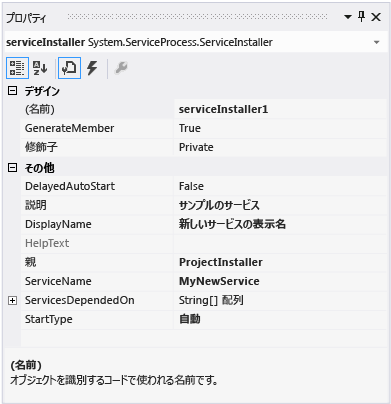
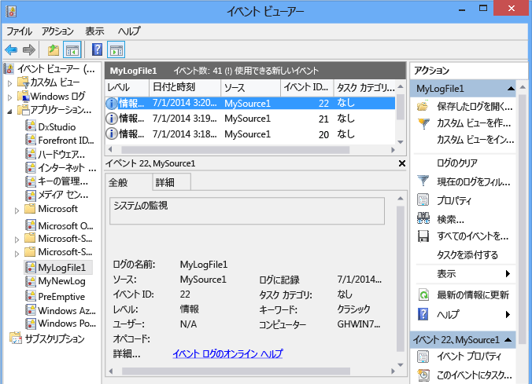

# <a name="walkthrough-creating-a-windows-service-application-in-the-component-designer"></a>チュートリアル: コンポーネント デザイナーによる Windows サービス アプリケーションの作成
この記事では、イベント ログにメッセージを書き込む単純な Windows サービス アプリケーションを Visual Studio で作成する方法を示します。 サービスを作成して使用するために実行する基本的な手順は次のとおりです。  
  
1.  [サービスの作成](#BK_CreateProject) Windows Service **プロジェクト テンプレートを使用して** を行い、構成します。 このテンプレートは、<xref:System.ServiceProcess.ServiceBase?displayProperty=nameWithType> を継承するクラスを作成し、基本的なサービス コードの多く (サービスを開始するコードなど) を記述します。  
  
2.  [サービスへの機能追加](#BK_WriteCode) プロシージャと <xref:System.ServiceProcess.ServiceBase.OnStart%2A> プロシージャの <xref:System.ServiceProcess.ServiceBase.OnStop%2A> を行い、再定義する他のすべてのメソッドを上書きします。  
  
3.  [サービスの状態の設定](#BK_SetStatus)。 既定では、<xref:System.ServiceProcess.ServiceBase?displayProperty=nameWithType> で作成されたサービスは、利用可能な状態フラグのサブセットだけを実装します。 サービスの開始、一時停止、または停止に時間がかかる場合は、[保留の開始] または [保留の停止] などの状態値を実装し、操作の実行中であることを示すことができます。  
  
4.  [サービスへのインストーラーの追加](#BK_AddInstallers) を行います。  
  
5.  (省略可能) [スタートアップ パラメーターの設定](#BK_StartupParameters)を行い、既定の起動時の引数を指定して、ユーザーがサービスを手動で開始するときに既定の設定を上書きできるようにします。  
  
6.  [サービスの構築](#BK_Build)。  
  
7.  [サービスのインストール](#BK_Install) を行います。  
  
8.  Windows サービス コントロール マネージャーにアクセスし、 [サービスの開始および実行](#BK_StartService)。  
  
9. [Windows サービスのアンインストール](#BK_Uninstall)。  
  
> [!WARNING]
>  このチュートリアルで必要な Windows サービスのプロジェクト テンプレートは、Visual Studio Express Edition では使用できません。  
  
 [!INCLUDE[note_settings_general](../../../includes/note-settings-general-md.md)]  
  
<a name="BK_CreateProject"></a>   
## <a name="creating-a-service"></a>サービスの作成  
 最初に、プロジェクトを作成し、サービスが正しく機能するために必要な値を設定します。  
  
#### <a name="to-create-and-configure-your-service"></a>サービスを作成して設定するには  
  
1.  Visual Studio のメニュー バーで、 **[ファイル]**、 **[新規作成]**、 **[プロジェクト]** の順に選択します。  
  
     **[新しいプロジェクト]** ダイアログ ボックスが表示されます。  
  
2.  Visual Basic や Visual C# のプロジェクト テンプレートの一覧で、 **Windows サービス**を選択し、プロジェクトに「 **MyNewService**」という名前を付けます。 **[OK]** をクリックします。  
  
     プロジェクト テンプレートは、`Service1` を継承する <xref:System.ServiceProcess.ServiceBase?displayProperty=nameWithType> という名前のコンポーネント クラスを自動的に追加します。  
  
3.  **[編集]** メニューで、 **[検索と置換]**、 **[フォルダーを指定して検索]** の順にクリックします (キーボード: Ctrl + Shift + F)。 出現するすべての `Service1` を `MyNewService`に変更します。 Service1.cs、Program.cs、および Service1.Designer.cs (または対応する .vb) にインスタンスがあります。  
  
4.  **Service1.cs [Design]** や **Service1.vb [Design]** の **[プロパティ]** ウィンドウで、 <xref:System.ServiceProcess.ServiceBase.ServiceName%2A> の **と** (Name) `Service1` プロパティが **MyNewService**に設定されていない場合は設定します。  
  
5.  ソリューション エクスプローラーで、 **Service1.cs** を **MyNewService.cs**に、または **Service1.vb** を **MyNewService.vb**に変更します。  
  
<a name="BK_WriteCode"></a>   
## <a name="adding-features-to-the-service"></a>サービスへの機能追加  
 このセクションでは、Windows サービスにカスタム イベント ログを追加します。 イベント ログは、Windows サービスとまったく関連付けられていません。 ここでは、Windows サービスに追加できるコンポーネントの種類の例として、 <xref:System.Diagnostics.EventLog> コンポーネントを使用しています。  
  
#### <a name="to-add-custom-event-log-functionality-to-your-service"></a>サービスにカスタム イベント ログ機能を追加するには  
  
1.  **ソリューション エクスプローラー**で、 **MyNewService.cs** または **MyNewService.vb**のコンテキスト メニューを開き、 **[デザイナーの表示]** を選択します。  
  
2.  **[ツールボックス]** の **[コンポーネント]** セクションから、 <xref:System.Diagnostics.EventLog> コンポーネントをデザイナーにドラッグします。  
  
3.  **ソリューション エクスプローラー**で、 **MyNewService.cs** または **MyNewService.vb**のコンテキスト メニューを開き、 **[コードの表示]** を選択します。  
  
4.  **クラスの、** 変数を宣言している行の直後に、 `MyNewService` eventLog `components` オブジェクトの宣言を追加します。  
  
     [!code-csharp[VbRadconService#16](../../../samples/snippets/csharp/VS_Snippets_VBCSharp/VbRadconService/CS/MyNewService.cs#16)]
     [!code-vb[VbRadconService#16](../../../samples/snippets/visualbasic/VS_Snippets_VBCSharp/VbRadconService/VB/MyNewService.vb#16)]  
  
5.  コンストラクターを追加または編集して、カスタム イベント ログを定義します。  
  
     [!code-csharp[VbRadconService#2](../../../samples/snippets/csharp/VS_Snippets_VBCSharp/VbRadconService/CS/MyNewService.cs#2)]
     [!code-vb[VbRadconService#2](../../../samples/snippets/visualbasic/VS_Snippets_VBCSharp/VbRadconService/VB/MyNewService.vb#2)]  
  
#### <a name="to-define-what-occurs-when-the-service-starts"></a>サービスの開始時の処理を定義するには  
  
-   コード エディターで、プロジェクトの作成時に自動的にオーバーライドされた <xref:System.ServiceProcess.ServiceBase.OnStart%2A> を見つけ、次のコードに置き換えます。 これにより、サービスが実行を開始するときに、イベント ログにエントリが追加されます。  
  
     [!code-csharp[VbRadconService#3](../../../samples/snippets/csharp/VS_Snippets_VBCSharp/VbRadconService/CS/MyNewService.cs#3)]
     [!code-vb[VbRadconService#3](../../../samples/snippets/visualbasic/VS_Snippets_VBCSharp/VbRadconService/VB/MyNewService.vb#3)]  
  
     サービス アプリケーションは長期間実行するように設計されているため、通常は、システム内の何かをポーリングまたは監視しています。 この監視は、 <xref:System.ServiceProcess.ServiceBase.OnStart%2A> メソッドで設定します。 ただし、 <xref:System.ServiceProcess.ServiceBase.OnStart%2A> は実際には監視を行いません。 <xref:System.ServiceProcess.ServiceBase.OnStart%2A> メソッドは、サービスの操作が開始された後にオペレーティング システムに戻る必要があります。 永久的に続くループやブロックは実行できません。 単純なポーリング機構を設定するには、<xref:System.Timers.Timer?displayProperty=nameWithType> コンポーネントを次のように使用します。<xref:System.ServiceProcess.ServiceBase.OnStart%2A> メソッドで、コンポーネントのパラメーターを設定してから、<xref:System.Timers.Timer.Enabled%2A> プロパティを `true` に設定します。 このタイマーによって、コード内で定期的にイベントが発生します。サービスは、イベントが発生するごとに監視を実行できます。 このためには、次のコードを使用できます。  
  
    ```csharp  
    // Set up a timer to trigger every minute.  
    System.Timers.Timer timer = new System.Timers.Timer();  
    timer.Interval = 60000; // 60 seconds  
    timer.Elapsed += new System.Timers.ElapsedEventHandler(this.OnTimer);  
    timer.Start();  
    ```  
  
    ```vb  
    ' Set up a timer to trigger every minute.  
    Dim timer As System.Timers.Timer = New System.Timers.Timer()  
    timer.Interval = 60000 ' 60 seconds  
    AddHandler timer.Elapsed, AddressOf Me.OnTimer  
    timer.Start()  
    ```  
     メンバー変数をクラスに追加します。 これには、イベント ログに書き込まれる次のイベントの識別子が格納されます。

    ```csharp
    private int eventId = 1;
    ```

    ```vb
    Private eventId As Integer = 1
    ```

     タイマー イベントを処理するコードを追加します。  
  
    ```csharp  
    public void OnTimer(object sender, System.Timers.ElapsedEventArgs args)  
    {  
        // TODO: Insert monitoring activities here.  
        eventLog1.WriteEntry("Monitoring the System", EventLogEntryType.Information, eventId++);  
    }  
    ```  
  
    ```vb  
    Private Sub OnTimer(sender As Object, e As Timers.ElapsedEventArgs)  
        ' TODO: Insert monitoring activities here.  
        eventLog1.WriteEntry("Monitoring the System", EventLogEntryType.Information, eventId)  
        eventId = eventId + 1  
    End Sub  
    ```  
  
     メイン スレッドですべての作業を実行するのではなく、バックグラウンド ワーカー スレッドを使用してタスクを実行する場合があります。 例については、<xref:System.ServiceProcess.ServiceBase?displayProperty=nameWithType> のリファレンス ページを参照してください。  
  
#### <a name="to-define-what-occurs-when-the-service-is-stopped"></a>サービスの停止時の処理を定義するには  
  
-   <xref:System.ServiceProcess.ServiceBase.OnStop%2A> メソッドのコードを次のコードに置き換えます。 これにより、サービスが停止したときに、イベント ログにエントリが追加されます。  
  
     [!code-csharp[VbRadconService#4](../../../samples/snippets/csharp/VS_Snippets_VBCSharp/VbRadconService/CS/MyNewService.cs#4)]
     [!code-vb[VbRadconService#4](../../../samples/snippets/visualbasic/VS_Snippets_VBCSharp/VbRadconService/VB/MyNewService.vb#4)]  
  
 次のセクションでは、 <xref:System.ServiceProcess.ServiceBase.OnPause%2A>、 <xref:System.ServiceProcess.ServiceBase.OnContinue%2A>、および <xref:System.ServiceProcess.ServiceBase.OnShutdown%2A> の各メソッドをオーバーライドして、コンポーネントの追加の処理を定義できます。  
  
#### <a name="to-define-other-actions-for-the-service"></a>サービスに対して他の処理を定義するには  
  
-   処理するメソッドを見つけ、オーバーライドし、実行する処理を定義します。  
  
     次のコード例は、 <xref:System.ServiceProcess.ServiceBase.OnContinue%2A> メソッドをオーバーライドする方法を示しています。  
  
     [!code-csharp[VbRadconService#5](../../../samples/snippets/csharp/VS_Snippets_VBCSharp/VbRadconService/CS/MyNewService.cs#5)]
     [!code-vb[VbRadconService#5](../../../samples/snippets/visualbasic/VS_Snippets_VBCSharp/VbRadconService/VB/MyNewService.vb#5)]  
  
 いくつかのカスタム動作は、Windows サービスが <xref:System.Configuration.Install.Installer> クラスによりインストールされるときに発生する必要があります。 Visual Studio は、これらのインストーラーを Windows サービス専用に作成し、プロジェクトに追加できます。  
  
<a name="BK_SetStatus"></a>   
## <a name="setting-service-status"></a>サービスの状態の設定  
 サービスは、その状態をサービス コントロール マネージャーに報告します。これによりユーザーは、サービスが正常に機能しているかどうかを確認することができます。 既定では、 <xref:System.ServiceProcess.ServiceBase> を継承するサービスは、[停止]、[一時停止]、[実行中] など、限られた状態設定のセットを報告します。 サービスの開始に若干時間がかかるときは、[保留の開始] 状態を報告すると役立つ場合があります。 [保留の開始] と [保留の停止] の状態設定は、Windows の [SetServiceStatus 関数](http://msdn.microsoft.com/library/windows/desktop/ms686241.aspx)を呼び出すコードを追加することによって実装することもできます。  
  
#### <a name="to-implement-service-pending-status"></a>サービス保留の状態を実装するには  
  
1.  MyNewService.cs ファイルまたは MyNewService.vb ファイルの `using` 名前空間に、`Imports` ステートメントまたは <xref:System.Runtime.InteropServices?displayProperty=nameWithType> 宣言を追加します。  
  
    ```csharp  
    using System.Runtime.InteropServices;  
    ```  
  
    ```vb  
    Imports System.Runtime.InteropServices  
    ```  
  
2.  MyNewService.cs に次のコードを追加して、 `ServiceState` の値を宣言し、プラットフォーム呼び出しで使用する状態の構造を追加します。  
  
    ```csharp  
    public enum ServiceState  
      {  
          SERVICE_STOPPED = 0x00000001,  
          SERVICE_START_PENDING = 0x00000002,  
          SERVICE_STOP_PENDING = 0x00000003,  
          SERVICE_RUNNING = 0x00000004,  
          SERVICE_CONTINUE_PENDING = 0x00000005,  
          SERVICE_PAUSE_PENDING = 0x00000006,  
          SERVICE_PAUSED = 0x00000007,  
      }  
  
      [StructLayout(LayoutKind.Sequential)]  
      public struct ServiceStatus  
      {  
          public int dwServiceType;  
          public ServiceState dwCurrentState;  
          public int dwControlsAccepted;  
          public int dwWin32ExitCode;  
          public int dwServiceSpecificExitCode;  
          public int dwCheckPoint;  
          public int dwWaitHint;  
      };  
    ```  
  
    ```vb  
    Public Enum ServiceState  
        SERVICE_STOPPED = 1  
        SERVICE_START_PENDING = 2  
        SERVICE_STOP_PENDING = 3  
        SERVICE_RUNNING = 4  
        SERVICE_CONTINUE_PENDING = 5  
        SERVICE_PAUSE_PENDING = 6  
        SERVICE_PAUSED = 7  
    End Enum  
  
    <StructLayout(LayoutKind.Sequential)>  
    Public Structure ServiceStatus  
        Public dwServiceType As Long  
        Public dwCurrentState As ServiceState  
        Public dwControlsAccepted As Long  
        Public dwWin32ExitCode As Long  
        Public dwServiceSpecificExitCode As Long  
        Public dwCheckPoint As Long  
        Public dwWaitHint As Long  
    End Structure  
    ```  
  
3.  `MyNewService` クラスで、プラットフォーム呼び出しを使用して、 [SetServiceStatus 関数](http://msdn.microsoft.com/library/windows/desktop/ms686241.aspx) を宣言します。  
  
    ```csharp  
    [DllImport("advapi32.dll", SetLastError=true)]  
            private static extern bool SetServiceStatus(IntPtr handle, ref ServiceStatus serviceStatus);  
    ```  
  
    ```vb  
    Declare Auto Function SetServiceStatus Lib "advapi32.dll" (ByVal handle As IntPtr, ByRef serviceStatus As ServiceStatus) As Boolean  
    ```  
  
4.  [保留の開始] 状態を実装するには、 <xref:System.ServiceProcess.ServiceBase.OnStart%2A> メソッドの先頭に次のコードを追加します。  
  
    ```csharp  
    // Update the service state to Start Pending.  
    ServiceStatus serviceStatus = new ServiceStatus();  
    serviceStatus.dwCurrentState = ServiceState.SERVICE_START_PENDING;  
    serviceStatus.dwWaitHint = 100000;  
    SetServiceStatus(this.ServiceHandle, ref serviceStatus);  
    ```  
  
    ```vb  
    ' Update the service state to Start Pending.  
    Dim serviceStatus As ServiceStatus = New ServiceStatus()  
    serviceStatus.dwCurrentState = ServiceState.SERVICE_START_PENDING  
    serviceStatus.dwWaitHint = 100000  
    SetServiceStatus(Me.ServiceHandle, serviceStatus)  
    ```  
  
5.  <xref:System.ServiceProcess.ServiceBase.OnStart%2A> メソッドの末尾に、状態を [実行中] に設定するコードを追加します。  
  
    ```csharp
    // Update the service state to Running.  
    serviceStatus.dwCurrentState = ServiceState.SERVICE_RUNNING;  
    SetServiceStatus(this.ServiceHandle, ref serviceStatus);  
    ```  
  
    ```vb  
    ' Update the service state to Running.  
    serviceStatus.dwCurrentState = ServiceState.SERVICE_RUNNING  
    SetServiceStatus(Me.ServiceHandle, serviceStatus)  
    ```  
  
6.  (省略可能) <xref:System.ServiceProcess.ServiceBase.OnStop%2A> メソッドに対してこの手順を繰り返します。  
  
> [!CAUTION]
>  [サービス コントロール マネージャー](http://msdn.microsoft.com/library/windows/desktop/ms685150.aspx)は、[SERVICE_STATUS 構造体](http://msdn.microsoft.com/library/windows/desktop/ms685996.aspx)の `dwWaitHint` メンバーと `dwCheckpoint` メンバーを使って、Windows サービスの開始やシャットダウンまでの待機時間を判断します。 <xref:System.ServiceProcess.ServiceBase.OnStart%2A> メソッドと <xref:System.ServiceProcess.ServiceBase.OnStop%2A> メソッドが長時間実行している場合、サービスは、インクリメントした `dwCheckPoint` 値で [SetServiceStatus](http://msdn.microsoft.com/library/windows/desktop/ms686241.aspx) をもう一度呼び出すことによって、追加の時間を要求できます。  
  
<a name="BK_AddInstallers"></a>   
## <a name="adding-installers-to-the-service"></a>サービスへのインストーラーの追加  
 Windows サービスを実行するには、まず、サービスをインストールする必要があります。これにより、サービスがサービス コントロール マネージャーに登録されます。 登録の詳細を処理するインストーラーをプロジェクトに追加できます。  
  
#### <a name="to-create-the-installers-for-your-service"></a>サービスのインストーラーを作成するには  
  
1.  **ソリューション エクスプローラー**で、 **MyNewService.cs** または **MyNewService.vb**のコンテキスト メニューを開き、 **[デザイナーの表示]** を選択します。  
  
2.  デザイナーの背景をクリックして、サービスの内容ではなくサービス自体を選択します。  
  
3.  デザイナー ウィンドウのコンテキスト メニューを開き (ポインティング デバイスを使用している場合は、ウィンドウ内を右クリック)、 **[インストーラーの追加]** を選択します。  
  
     既定では、2 つのインストーラーを含むコンポーネント クラスがプロジェクトに追加されます。 このコンポーネントは **ProjectInstaller**という名前で、サービス用のインストーラーと、サービスの関連プロセス用のインストーラーを含んでいます。  
  
4.  **[ProjectInstaller]** の **[デザイン]** ビューで、 **[serviceInstaller1]** (Visual C# プロジェクトの場合) または **[ServiceInstaller1]** (Visual Basic プロジェクトの場合) を選択します。  
  
5.  **[プロパティ]** ウィンドウで、 <xref:System.ServiceProcess.ServiceInstaller.ServiceName%2A> プロパティが **MyNewService**に設定されていることを確認します。  
  
6.  **[説明]** プロパティに、「A sample service」などのテキストを設定します。 このテキストは [サービス] ウィンドウに表示されます。これによりユーザーは、サービスを識別したり、その用途を理解したりできます。  
  
7.  <xref:System.ServiceProcess.ServiceInstaller.DisplayName%2A> プロパティに、[サービス] ウィンドウの **[名前]** 列に表示するテキストを設定します。 たとえば、「MyNewService Display Name」と入力できます。 この名前は、システムによって使用される (たとえば、 <xref:System.ServiceProcess.ServiceInstaller.ServiceName%2A> コマンドを使用してサービスを開始する場合) 名前である `net start` プロパティとは異なる名前にすることができます。  
  
8.  <xref:System.ServiceProcess.ServiceInstaller.StartType%2A> プロパティを <xref:System.ServiceProcess.ServiceStartMode.Automatic> に設定します。  
  
       
  
9. デザイナーで、 **[serviceProcessInstaller1]** (Visual C# プロジェクトの場合) または **[ServiceProcessInstaller1]** (Visual Basic プロジェクトの場合) を選択します。 <xref:System.ServiceProcess.ServiceProcessInstaller.Account%2A> プロパティを <xref:System.ServiceProcess.ServiceAccount.LocalSystem> に設定します。 これにより、サービスがインストールされ、ローカル サービス アカウントで実行されます。  
  
    > [!IMPORTANT]
    >  <xref:System.ServiceProcess.ServiceAccount.LocalSystem> アカウントには、イベント ログへの書き込みを含む、幅広いアクセス許可が設定されています。 このアカウントは悪意のあるソフトウェアから攻撃されるリスクが高いため、使用する場合は注意が必要です。 その他のタスクについては、ローカル コンピューターで非特権ユーザーとして機能し、リモート サーバーには匿名の資格情報を渡す <xref:System.ServiceProcess.ServiceAccount.LocalService> アカウントの使用を検討してください。 この例は、<xref:System.ServiceProcess.ServiceAccount.LocalService> アカウントを使用しようとすると失敗します。これは、イベント ログに書き込むアクセス許可が必要になるためです。  
  
     インストーラーについて詳しくは、「 [How to: Add Installers to Your Service Application](../../../docs/framework/windows-services/how-to-add-installers-to-your-service-application.md)」をご覧ください。  
  
<a name="BK_StartupParameters"></a>   
## <a name="set-startup-parameters"></a>スタートアップ パラメーターの設定  
 Windows サービスは、その他の実行可能ファイルと同様、コマンド ライン引数、またはスタートアップ パラメーターを受け入れることができます。 スタートアップ パラメーターを処理するコードを追加すると、ユーザーは、Windows のコントロール パネルの [サービス] ウィンドウを使用して、カスタムのスタートアップ パラメーターによりサービスを開始できます。 ただし、これらのスタートアップ パラメーターは、次回のサービスの開始時には保持されません。 スタートアップ パラメーターを永続的に設定するために、次の手順で示すようにレジストリに設定することができます。  
  
> [!NOTE]
>  スタートアップ パラメーターを追加するよう決定する前に、これがサービスに情報を渡す最適な方法であるかどうかを検討してください。 スタートアップ パラメーターの使用や解析は簡単であり、ユーザーが簡単にオーバーライドできますが、ドキュメントなしでは検索や使用が困難である可能性があります。 一般的に、サービスに必要なスタートアップ パラメーターが複数ある場合は、代わりにレジストリまたは構成ファイルの使用を検討する必要があります。 すべての Windows サービスのレジストリのエントリは、HKLM\System\CurrentControlSet\services にあります。 サービスのキーで、 **Parameters** サブキーを使用して、サービスがアクセスできる情報を格納することができます。 その他の種類のプログラムの場合と同じ方法で、Windows サービスに対してアプリケーション構成ファイルを使用することができます。 コード例については、「 <xref:System.Configuration.ConfigurationManager.AppSettings%2A>」を参照してください。  
  
#### <a name="adding-startup-parameters"></a>スタートアップ パラメーターの追加  
  
1.  Program.cs または MyNewService.Designer.vb の `Main` メソッドに、コマンド ラインの引数を追加します。  
  
```csharp  
static void Main(string[] args)
{
    ServiceBase[] ServicesToRun = new ServiceBase[] { new MyNewService(args) };
    ServiceBase.Run(ServicesToRun);
}
```  
  
```vb
Shared Sub Main(ByVal cmdArgs() As String)
    Dim ServicesToRun() As System.ServiceProcess.ServiceBase = New System.ServiceProcess.ServiceBase() {New MyNewServiceVB(cmdArgs)}
    System.ServiceProcess.ServiceBase.Run(ServicesToRun)
End Sub
```  
  
2.  `MyNewService` コンストラクターを次のように変更します。  
  
```csharp  
public MyNewService(string[] args)
{
    InitializeComponent();
    string eventSourceName = "MySource";
    string logName = "MyNewLog";
    if (args.Count() > 0) 
    {
        eventSourceName = args[0];
    }
    if (args.Count() > 1)
    {
        logName = args[1];
    }
    eventLog1 = new System.Diagnostics.EventLog();
    if (!System.Diagnostics.EventLog.SourceExists(eventSourceName))
    {
        System.Diagnostics.EventLog.CreateEventSource(eventSourceName, logName);
    }
    eventLog1.Source = eventSourceName;
    eventLog1.Log = logName;        
}
```  
  
```vb  
Public Sub New(ByVal cmdArgs() As String)
    InitializeComponent()
    Dim eventSourceName As String = "MySource"
    Dim logName As String = "MyNewLog"
    If (cmdArgs.Count() > 0) Then
        eventSourceName = cmdArgs(0)
    End If
    If (cmdArgs.Count() > 1) Then
        logName = cmdArgs(1)
    End If
    eventLog1 = New System.Diagnostics.EventLog()
    If (Not System.Diagnostics.EventLog.SourceExists(eventSourceName)) Then
        System.Diagnostics.EventLog.CreateEventSource(eventSourceName, logName)
    End If
    eventLog1.Source = eventSourceName
    eventLog1.Log = logName
End Sub  
```  
  
このコードでは、指定したスタートアップ パラメーターに従ってイベント ソースとログ名が設定されるか、引数を指定しなかった場合は既定値が使用されます。  
  
3. コマンド ライン引数を指定するには、ProjectInstaller.cs または ProjectInstaller.vb の `ProjectInstaller` クラスに次のコードを追加します。  
  
```csharp  
protected override void OnBeforeInstall(IDictionary savedState)
{
    string parameter = "MySource1\" \"MyLogFile1";
    Context.Parameters["assemblypath"] = "\"" + Context.Parameters["assemblypath"] + "\" \"" + parameter + "\"";
    base.OnBeforeInstall(savedState);
}
```

```vb  
Protected Overrides Sub OnBeforeInstall(ByVal savedState As IDictionary)
    Dim parameter As String = "MySource1"" ""MyLogFile1"
    Context.Parameters("assemblypath") = """" + Context.Parameters("assemblypath") + """ """ + parameter + """"
    MyBase.OnBeforeInstall(savedState)
End Sub  
```  
  
このコードでは、既定のパラメーター値を追加することによって、一般的に Windows サービスの実行可能ファイルへの完全パスが含まれる **ImagePath** レジストリ キーが変更されます。 サービスが正しく開始されるためには、パス (およびそれぞれ個々のパラメーター) を囲む引用符が必要です。 この Windows サービスのスタートアップ パラメーターを変更するために、ユーザーは、 **ImagePath** レジストリ キーで指定されたパラメーターを変更できます。ただし、パラメーターをプログラムによって変更し、ユーザーに対してはわかりやすい方法 (たとえば、管理ユーティリティや構成ユーティリティ) で機能を示すことをお勧めします。  
  
<a name="BK_Build"></a>   
## <a name="building-the-service"></a>サービスの構築  
  
#### <a name="to-build-your-service-project"></a>サービス プロジェクトをビルドするには  
  
1.  **ソリューション エクスプローラー**で、プロジェクトのコンテキスト メニューを開き、 **[プロパティ]** を選択します。 プロジェクトのプロパティ ページが表示されます。  
  
2.  [アプリケーション] タブで、 **[スタートアップ オブジェクト]** ボックスの一覧の **[MyNewService.Program]** を選択します。  
  
3.  **ソリューション エクスプローラー**で、プロジェクトのコンテキスト メニューを開き、 **[ビルド]** を選択してプロジェクトをビルドします (キーボード: Ctrl + Shift + B)。  
  
<a name="BK_Install"></a>   
## <a name="installing-the-service"></a>サービスのインストール  
 Windows サービスを構築済みであるため、サービスをインストールできます。 Windows サービスをインストールするには、インストール先のコンピューターの管理者資格情報が必要です。  
  
#### <a name="to-install-a-windows-service"></a>Windows サービスをインストールするには  
  
1.  Windows 7 および Windows Server の **[スタート]** メニューで、 **[Visual Studio ツール]** の **[開発者コマンド プロンプト]** を開きます。 Windows 8 または Windows 8.1 の **[スタート]** 画面で、 **[Visual Studio ツール]** タイルを選択し、管理者資格情報を使用して開発者コマンド プロンプトを実行します。 (マウスを使用している場合は、 **[開発者コマンド プロンプト]** を右クリックし、 **[管理者として実行]** を選択します)  
  
2.  コマンド プロンプト ウィンドウで、プロジェクトの出力が格納されているフォルダーに移動します。 たとえば、ユーザーの [マイ ドキュメント] フォルダーで、Visual Studio 2013\Projects\MyNewService\bin\Debug に移動します。  
  
3.  次のコマンドを入力します。  
  
    ```  
    installutil.exe MyNewService.exe  
    ```  
  
     サービスが正常にインストールされたら、正常に実行されたことが installutil.exe によって報告されます。 InstallUtil.exe が見つからなかった場合は、コンピューター上に存在することを確認します。 このツールは、.NET Framework と共にフォルダー `%WINDIR%\Microsoft.NET\Framework[64]\`*framework_version*にインストールされます。 たとえば、32 ビット版の .NET Framework 4、4.5、4.5.1、および 4.5.2 の既定のパスは、 `C:\Windows\Microsoft.NET\Framework\v4.0.30319\InstallUtil.exe`です。  
  
     installutil.exe のプロセスでエラーが発生する場合は、インストール ログで理由を確認します。 既定で、ログはサービスの実行可能ファイルと同じフォルダーにあります。 <xref:System.ComponentModel.RunInstallerAttribute> クラスが `ProjectInstaller` クラスにない場合、属性が `true` に設定されていない場合、または `ProjectInstaller` クラスが `public` でない場合は、インストールが失敗することがあります。  
  
     詳細については、「 [How to: Install and Uninstall Services](../../../docs/framework/windows-services/how-to-install-and-uninstall-services.md)」を参照してください。  
  
<a name="BK_StartService"></a>   
## <a name="starting-and-running-the-service"></a>サービスの開始および実行  
  
#### <a name="to-start-and-stop-your-service"></a>サービスを開始および停止するには  
  
1.  Windows で、 **[スタート]** 画面や **[スタート]** メニューを開き、「 `services.msc`」と入力します。  
  
     **[サービス]** ウィンドウの一覧に **MyNewService** が表示されます。  
  
     ![[サービス] ウィンドウの MyNewService。](../../../docs/framework/windows-services/media/windowsservices-serviceswindow.PNG "WindowsServices_ServicesWindow")  
  
2.  **[サービス]** ウィンドウで、サービスのショートカット メニューを開き、 **[開始]** を選択します。  
  
3.  サービスのショートカット メニューを開き、 **[停止]** を選択します。  
  
4.  (省略可能) コマンド ラインからコマンド `net start``ServiceName` プロシージャの `net stop``ServiceName` を使用することで、サービスを開始および停止できます。  
  
#### <a name="to-verify-the-event-log-output-of-your-service"></a>サービスのイベント ログ出力を検査するには  
  
1.  Visual Studio で、 **サーバー エクスプローラー** を開き (キーボード: Ctrl + Alt + S)、ローカル コンピューターの **[イベント ログ]** ノードにアクセスします。  
  
2.  **MyNewLog** (または、省略可能な手順を使用してコマンド ライン引数を追加した場合は **MyLogFile1**) の一覧を見つけ、展開します。 サービスが実行した 2 つの操作 (開始および停止) のエントリが表示されます。  
  
       
  
<a name="BK_Uninstall"></a>   
## <a name="uninstalling-a-windows-service"></a>Windows サービスのアンインストール  
  
#### <a name="to-uninstall-your-service"></a>サービスをアンインストールするには  
  
1.  管理者資格情報を使用して、開発者コマンド プロンプトを開きます。  
  
2.  コマンド プロンプト ウィンドウで、プロジェクトの出力が格納されているフォルダーに移動します。 たとえば、ユーザーの [マイ ドキュメント] フォルダーで、Visual Studio 2013\Projects\MyNewService\bin\Debug に移動します。  
  
3.  次のコマンドを入力します。  
  
    ```  
    installutil.exe /u MyNewService.exe  
    ```  
  
     サービスが正常にアンインストールされたら、サービスが正常に削除されたことが installutil.exe によって報告されます。 詳細については、「 [How to: Install and Uninstall Services](../../../docs/framework/windows-services/how-to-install-and-uninstall-services.md)」を参照してください。  
  
## <a name="next-steps"></a>次の手順  
 他のユーザーが Windows サービスのインストールに使用できるスタンドアロン セットアップ プログラムを作成できますが、これには追加の手順が必要になります。 ClickOnce では Windows サービスがサポートされていないため、発行ウィザードを使用できません。 Microsoft では提供されていませんが、InstallShield のフル ライセンス版を使用できます。 InstallShield について詳しくは、「 [InstallShield Limited Edition](/visualstudio/deployment/installshield-limited-edition)」をご覧ください。 [Windows Installer XML Toolset](http://go.microsoft.com/fwlink/?LinkId=249067) を使用して、Windows サービスのインストーラーを作成することもできます。  
  
 インストールしたサービスにコマンドを送信するための <xref:System.ServiceProcess.ServiceController> コンポーネントの使用法を調べることもできます。  
  
 インストーラーを使用すると、アプリケーションの実行時にイベント ログを作成する代わりに、アプリケーションのインストール時にイベント ログを作成できます。 さらに、イベント ログは、アプリケーションがアンインストールされたときにインストーラーによって削除されます。 詳細については、 <xref:System.Diagnostics.EventLogInstaller> のリファレンス ページを参照してください。  
  
## <a name="see-also"></a>参照  
 [Windows サービス アプリケーション](../../../docs/framework/windows-services/index.md)  
 [Windows サービス アプリケーションの概要](../../../docs/framework/windows-services/introduction-to-windows-service-applications.md)  
 [方法 : Windows サービス アプリケーションをデバッグする](../../../docs/framework/windows-services/how-to-debug-windows-service-applications.md)  
 [サービス (Windows)](http://msdn.microsoft.com/library/windows/desktop/ms685141.aspx)
