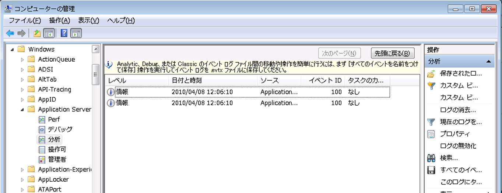

# <a name="configuring-tracking-for-a-workflow"></a>ワークフローの追跡の構成
ワークフローは、次の 3 つの方法で実行できます。  
  
-   <xref:System.ServiceModel.Activities.WorkflowServiceHost> でホストする  
  
-   <xref:System.Activities.WorkflowApplication> として実行する  
  
-   <xref:System.Activities.WorkflowInvoker> を使用して直接実行する  
  
 ワークフローのホスト オプションに応じて、コードまたは構成ファイルによって追跡参加要素を追加できます。 ここでは、追跡参加要素を <xref:System.Activities.WorkflowApplication> および <xref:System.ServiceModel.Activities.WorkflowServiceHost> に追加して追跡を構成する方法、および <xref:System.Activities.WorkflowInvoker> の使用時に追跡を有効にする方法について説明します。  
  
## <a name="configuring-workflow-application-tracking"></a>ワークフロー アプリケーション追跡の構成  
 ワークフローは、<xref:System.Activities.WorkflowApplication> クラスを使用して実行できます。 ここで、追跡参加要素を [!INCLUDE[netfx_current_long](../../../includes/netfx-current-long-md.md)] ワークフロー ホストに追加することで、<xref:System.Activities.WorkflowApplication> ワークフロー アプリケーション用に追跡を構成する方法について説明します。 この場合、ワークフローはワークフロー アプリケーションとして実行されます。 <xref:System.Activities.WorkflowApplication> クラスを使用する自己ホスト型の .exe ファイルであるコードを介して (構成ファイルを使用せずに)、ワークフロー アプリケーションを構成します。 追跡参加要素は <xref:System.Activities.WorkflowApplication> インスタンスの拡張として追加します。 これを行うには、<xref:System.Activities.Tracking.TrackingParticipant> を WorkflowApplication インスタンスの拡張コレクションに追加します。  
  
 ワークフロー アプリケーションの場合、次のコードのように <xref:System.Activities.Tracking.EtwTrackingParticipant> 動作拡張を追加できます。  
  
```csharp  
LogActivity activity = new LogActivity();  
  
WorkflowApplication instance = new WorkflowApplication(activity);  
EtwTrackingParticipant trackingParticipant =  
    new EtwTrackingParticipant  
{  
  
        TrackingProfile = new TrackingProfile  
           {  
               Name = "SampleTrackingProfile",  
               ActivityDefinitionId = "ProcessOrder",  
               Queries = new WorkflowInstanceQuery  
               {  
                  States = { "*" }  
              }  
          }  
       };  
instance.Extensions.Add(trackingParticipant);  
```  
  
### <a name="configuring-workflow-service-tracking"></a>ワークフロー サービス追跡の構成  
 ワークフローでホストされている場合は、WCF サービスとして公開することができます、<xref:System.ServiceModel.Activities.WorkflowServiceHost>サービス ホスト。 <xref:System.ServiceModel.Activities.WorkflowServiceHost> は、ワークフロー ベースのサービスの .NET ServiceHost の特殊な実装です。 ここでは、[!INCLUDE[netfx_current_short](../../../includes/netfx-current-short-md.md)] で実行されている <xref:System.ServiceModel.Activities.WorkflowServiceHost> ワークフロー サービスの追跡を構成する方法について説明します。 Web.config ファイル (Web ホスト サービスの場合) または App.config ファイル (コンソール アプリケーションなどのスタンドアロン アプリケーションでホストされるサービスの場合) を介し、サービス動作を指定して構成するか、またはコードを介し、サービス ホスト用に <xref:System.ServiceModel.Description.ServiceDescription.Behaviors%2A> コレクションに追跡固有の動作を追加して構成できます。  
  
 <xref:System.ServiceModel.WorkflowServiceHost> でホストされるワークフロー サービスの場合、次の例のように、構成ファイル内の &lt;<xref:System.Activities.Tracking.EtwTrackingParticipant>&gt; 要素を使用して `behavior` を追加できます。  
  
```xml  
<behaviors>  
   <serviceBehaviors>  
        <behavior>  
          <etwTracking profileName="Sample Tracking Profile" />  
        </behavior>              
   </serviceBehaviors>  
<behaviors>  
```  
  
 また、<xref:System.ServiceModel.WorkflowServiceHost> でホストされるワークフロー サービスの場合、コードを介して <xref:System.Activities.Tracking.EtwTrackingParticipant> 動作拡張を追加できます。 カスタムの追跡参加要素を追加するには、次のコード例のように、新しい動作拡張を作成し、それを <xref:System.ServiceModel.ServiceHost> に追加します。  
  
> [!NOTE]
>  カスタム追跡参加要素を追加するカスタム動作要素を作成する方法を示すサンプル コードを表示する場合を参照してください。、[追跡](../../../docs/framework/windows-workflow-foundation/samples/tracking.md)サンプルです。  
  
```  
ServiceHost svcHost = new ServiceHost(typeof(WorkflowService), new   
                                 Uri("http://localhost:8001/Sample"));  
EtwTrackingBehavior trackingBehavior =   
    new EtwTrackingBehavior  
    {  
        ProfileName = "Sample Tracking Profile"  
    };  
svcHost.Description.Behaviors.Add(trackingBehavior);  
svcHost.Open();  
```  
  
 追跡参加要素は、動作の拡張としてワークフロー サービス ホストに追加されます。  
  
 以下のサンプル コードは、構成ファイルから追跡プロファイルを読み取る方法の例です。  
  
```  
TrackingProfile GetProfile(string profileName, string displayName)  
        {  
            TrackingProfile trackingProfile = null;  
            TrackingSection trackingSection = (TrackingSection)WebConfigurationManager.GetSection("system.serviceModel/tracking");  
            if (trackingSection == null)   
            {  
                return null;  
            }  
  
            if (profileName == null)   
            {  
                profileName = "";  
            }  
  
            //Find the profile with the specified profile name in the list of profile found in config  
            var match = from p in new List<TrackingProfile>(trackingSection.TrackingProfiles)  
                        where (p.Name == profileName) && ((p.ActivityDefinitionId == displayName) || (p.ActivityDefinitionId == "*"))  
                        select p;  
  
            if (match.Count() == 0)  
            {  
                //return an empty profile  
                trackingProfile = new TrackingProfile()  
                {  
                    ActivityDefinitionId = displayName  
                };  
  
            }  
            else  
            {  
                trackingProfile = match.First();  
            }  
  
            return trackingProfile;  
```  
  
 このサンプル コードは、ワークフロー ホストに追跡プロファイルを追加する方法の例です。  
  
```  
WorkflowServiceHost workflowServiceHost = serviceHostBase as WorkflowServiceHost;  
if (null != workflowServiceHost)  
{  
              string workflowDisplayName = workflowServiceHost.Activity.DisplayName;  
               TrackingProfile trackingProfile = GetProfile(this.profileName, workflowDisplayName);  
                workflowServiceHost.WorkflowExtensions.Add(()  => new EtwTrackingParticipant  {  
               TrackingProfile = trackingProfile  
                        });  
 }  
```  
  
> [!NOTE]
>  追跡プロファイルの詳細についてを参照してください[追跡プロファイル](http://go.microsoft.com/fwlink/?LinkId=201310)です。  
  
### <a name="configuring-tracking-using-workflowinvoker"></a>WorkflowInvoker を使用した追跡の構成  
 <xref:System.Activities.WorkflowInvoker> を使用して実行するワークフローの追跡を構成するには、追跡プロバイダーを拡張として <xref:System.Activities.WorkflowInvoker> インスタンスに追加します。 次のコード例は、[カスタム追跡](../../../docs/framework/windows-workflow-foundation/samples/custom-tracking.md)サンプルです。  
  
```  
WorkflowInvoker invoker = new WorkflowInvoker(BuildSampleWorkflow());  
invoker.Extensions.Add(customTrackingParticipant);  
invoker.Invoke();  
```  
  
### <a name="viewing-tracking-records-in-event-viewer"></a>イベント ビューアーでの追跡レコードの表示  
 WF 実行 - 分析ログとデバッグ ログ - を追跡すると、特に興味深い 2 つのイベント ビューアーのログ記録があります。 Microsoft の下にある両方&#124;Windows&#124;アプリケーション サーバー-アプリケーション ノード。  このセクション含まれるログは、システム全体に影響を及ぼすイベントではなく、1 つのアプリケーションからのイベントを格納します。  
  
 デバッグ トレースのイベントがデバッグ ログに書き込まれます。 イベント ビューアー内の WF のデバッグ トレース イベントを収集するには、デバッグ ログを有効にします。  
  
1.  イベント ビューアーを開くにはクリックして**開始**、順にクリック**を実行します。** [実行] ダイアログ ボックスで、次のように入力します。`eventvwr`です。  
  
2.  イベント ビューアー ダイアログ ボックスで、展開、 **Applications and Services Logs**ノード。  
  
3.  展開して、 **Microsoft**、 **Windows**、および**アプリケーション サーバー-アプリケーション**ノード。  
  
4.  右クリックし、**デバッグ**ノードの下、**アプリケーション サーバー-アプリケーション**ノード、および選択**ログの有効化**です。  
  
5.  トレースが有効になっているアプリケーションを実行して追跡イベントを生成します。  
  
6.  右クリックし、**デバッグ**ノード**を更新します。** トレース イベントが中央ペインに表示されます。  
  
 WF 4 には、追跡レコードを ETW (Event Tracing for Windows) セッションに書き込む追跡参加要素が用意されています。 ETW 追跡参加要素は、追跡レコードを定期受信するように追跡プロファイルで構成されています。  追跡が有効な場合は、エラーの追跡レコードが ETW に出力されます。 ETW 追跡参加要素によって出力される追跡イベントに対応する ETW 追跡イベント (100 ～ 113 の範囲にある) が分析ログに書き込まれます。  
  
 追跡レコードを表示するには、次の手順を実行します。  
  
1.  イベント ビューアーを開くにはクリックして**開始**、順にクリック**を実行します。** [実行] ダイアログ ボックスで、次のように入力します。`eventvwr`です。  
  
2.  イベント ビューアー ダイアログ ボックスで、展開、 **Applications and Services Logs**ノード。  
  
3.  展開して、 **Microsoft**、 **Windows**、および**アプリケーション サーバー-アプリケーション**ノード。  
  
4.  右クリックし、**分析**ノードの下、**アプリケーション サーバー-アプリケーション**ノード、および選択**ログの有効化**です。  
  
5.  追跡が有効になっているアプリケーションを実行して追跡レコードを生成します。  
  
6.  右クリックし、**分析**ノード**を更新します。** 追跡レコードが中央ペインに表示されます。  
  
 イベント ビューアーの追跡イベントを次の図に示します。  
  
   
  
### <a name="registering-an-application-specific-provider-id"></a>アプリケーション固有のプロバイダー ID の登録  
 イベントを特定のアプリケーション ログに書き込む必要がある場合は、次の手順に従って新しいプロバイダー マニフェストを登録します。  
  
1.  アプリケーション構成ファイルでプロバイダー ID を宣言します。  
  
    ```xml  
    <system.serviceModel>  
        <diagnostics etwProviderId="2720e974-9fe9-477a-bb60-81fe3bf91eec"/>  
    </system.serviceModel>  
    ```  
  
2.  マニフェスト ファイルに、%windir%\Microsoft.NET\Framework からコピー\\< 最新バージョンの[!INCLUDE[netfx_current_short](../../../includes/netfx-current-short-md.md)]> \Microsoft.Windows.ApplicationServer.Applications.man 一時的な場所にして変更Microsoft.Windows.ApplicationServer.Applications_Provider1.man  
  
3.  マニフェスト ファイルの GUID を新しい GUID に変更します。  
  
    ```xml  
    <provider name="Microsoft-Windows-Application Server-Applications" guid="{2720e974-9fe9-477a-bb60-81fe3bf91eec}"  
    ```  
  
4.  既定のプロバイダーをアンインストールしない場合は、プロバイダー名を変更します。  
  
    ```xml  
    <provider name="Microsoft-Windows-Application Server-Applications" guid="{2720e974-9fe9-477a-bb60-81fe3bf91eec}"  
    ```  
  
5.  前の手順でプロバイダー名を変更した場合は、マニフェスト ファイルのチャネル名を新しいプロバイダー名に変更します。  
  
    ```xml  
    <channel name="Microsoft-Windows-Application Server-Applications_Provider1/Admin" chid="ADMIN_CHANNEL" symbol="ADMIN_CHANNEL" type="Admin" enabled="false" isolation="Application" message="$(string.MICROSOFT_WINDOWS_APPLICATIONSERVER_APPLICATIONS.channel.ADMIN_CHANNEL.message)" />  
    <channel name="Microsoft-Windows-Application Server-Applications_Provider1/Operational" chid="OPERATIONAL_CHANNEL" symbol="OPERATIONAL_CHANNEL" type="Operational" enabled="false" isolation="Application" message="$(string.MICROSOFT_WINDOWS_APPLICATIONSERVER_APPLICATIONS.channel.OPERATIONAL_CHANNEL.message)" />  
    <channel name="Microsoft-Windows-Application Server-Applications_Provider1/Analytic" chid="ANALYTIC_CHANNEL" symbol="ANALYTIC_CHANNEL" type="Analytic" enabled="false" isolation="Application" message="$(string.MICROSOFT_WINDOWS_APPLICATIONSERVER_APPLICATIONS.channel.ANALYTIC_CHANNEL.message)" />  
    <channel name="Microsoft-Windows-Application Server-Applications_Provider1/Debug" chid="DEBUG_CHANNEL" symbol="DEBUG_CHANNEL" type="Debug" enabled="false" isolation="Application" message="$(string.MICROSOFT_WINDOWS_APPLICATIONSERVER_APPLICATIONS.channel.DEBUG_CHANNEL.message)" />  
    <channel name="Microsoft-Windows-Application Server-Applications_Provider1/Perf" chid="PERF_CHANNEL" symbol="PERF_CHANNEL" type="Analytic" enabled="false" isolation="Application" message="$(string.MICROSOFT_WINDOWS_APPLICATIONSERVER_APPLICATIONS.channel.PERF_CHANNEL.message)" />  
    ```  
  
6.  次の手順に従ってリソース DLL を生成します。  
  
    1.  Windows SDK をインストールします。 Windows SDK には、メッセージ コンパイラが含まれています ([mc.exe](http://go.microsoft.com/fwlink/?LinkId=184606)) およびリソース コンパイラ ([rc.exe](http://go.microsoft.com/fwlink/?LinkId=184605))。  
  
    2.  Windows SDK コマンド プロンプトで、新しいマニフェスト ファイルに対して mc.exe を実行します。  
  
        ```  
        mc.exe Microsoft.Windows.ApplicationServer.Applications_Provider1.man  
        ```  
  
    3.  前の手順で生成されたリソース ファイルに対して rc.exe を実行します。  
  
        ```  
        rc.exe  Microsoft.Windows.ApplicationServer.Applications_Provider1.rc  
        ```  
  
    4.  NewProviderReg.cs という名前の空の cs ファイルを作成します。  
  
    5.  C# コンパイラを使用してリソース DLL を作成します。  
  
        ```  
        csc /target:library /win32res:Microsoft.Windows.ApplicationServer.Applications_Provider1.res NewProviderReg.cs /out:Microsoft.Windows.ApplicationServer.Applications_Provider1.dll  
        ```  
  
    6.  マニフェスト ファイルのリソース dll とメッセージ dll の名前を `Microsoft.Windows.ApplicationServer.Applications.Provider1.man` から新しい dll 名に変更します。  
  
        ```xml  
        <provider name="Microsoft-Windows-Application Server-Applications_Provider1" guid="{2720e974-9fe9-477a-bb60-81fe3bf91eec}" symbol="Microsoft_Windows_ApplicationServer_ApplicationEvents" resourceFileName="<dll directory>\Microsoft.Windows.ApplicationServer.Applications_Provider1.dll" messageFileName="<dll directory>\Microsoft.Windows.ApplicationServer.Applications_Provider1.dll">  
        ```  
  
    7.  使用して[wevtutil](http://go.microsoft.com/fwlink/?LinkId=184608)マニフェストを登録します。  
  
        ```  
        wevtutil im Microsoft.Windows.ApplicationServer.Applications_Provider1.man  
        ```  
  
## <a name="see-also"></a>関連項目  
 [Windows Server App Fabric の監視](http://go.microsoft.com/fwlink/?LinkId=201273)  
 [アプリケーション App Fabric の監視](http://go.microsoft.com/fwlink/?LinkId=201275)
