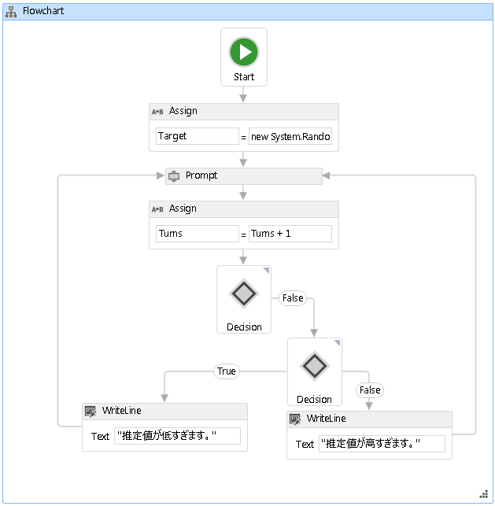

# <a name="how-to-create-a-flowchart-workflow"></a>フローチャート ワークフローを作成する方法
ワークフローは、ビルトイン アクティビティおよびカスタム アクティビティから構築できます。 など、両方の組み込みのアクティビティを使用するワークフローを作成する手順をこのトピックの内容、<xref:System.Activities.Statements.Flowchart>アクティビティ、およびカスタム アクティビティを以前から[する方法: アクティビティを作成](../../../docs/framework/windows-workflow-foundation/how-to-create-an-activity.md)トピックです。 このワークフローは、数値推測ゲームをモデル化しています。  
  
> [!NOTE]
>  チュートリアル入門の各トピックは、前のトピックに応じて異なります。 このトピックの内容を完了する必要があります最初に完了する[する方法: アクティビティを作成する](../../../docs/framework/windows-workflow-foundation/how-to-create-an-activity.md)です。  
  
> [!NOTE]
>  チュートリアルの完成版をダウンロードするには、「 [Windows Workflow Foundation (WF45) - Getting Started Tutorial (Windows Workflow Foundation (WF45) - チュートリアル入門)](http://go.microsoft.com/fwlink/?LinkID=248976)」を参照してください。  
  
### <a name="to-create-the-workflow"></a>ワークフローを作成するには  
  
1.  右クリック**NumberGuessWorkflowActivities**で**ソリューション エクスプ ローラー**選択**追加**、**新しい項目の**します。  
  
2.  **インストール**、**共通項目**ノードで、選択**ワークフロー**です。 選択**アクティビティ**から、**ワークフロー**  ボックスの一覧です。  
  
3.  型`FlowchartNumberGuessWorkflow`に、**名前**ボックスし、をクリックして**追加**です。  
  
4.  ドラッグ、**フローチャート**からアクティビティを**フローチャート**のセクションで、**ツールボックス**上にドロップし、**ここにアクティビティをドロップ**のラベルをワークフロー デザイン サーフェイスです。  
  
### <a name="to-create-the-workflow-variables-and-arguments"></a>ワークフロー変数および引数を作成するには  
  
1.  ダブルクリックして**FlowchartNumberGuessWorkflow.xaml**で**ソリューション エクスプ ローラー**をまだ表示されていない場合、デザイナーでワークフローを表示します。  
  
2.  をクリックして**引数**を表示するワークフロー デザイナーの左下横で、**引数**ウィンドウです。  
  
3.  をクリックして**引数の作成**です。  
  
4.  型`MaxNumber`に、**名前**ボックスで、**で**から、**方向**ドロップダウン リストで、 **Int32** から**引数の型**ドロップダウン リストと、引数を保存するには ENTER キーを押します。  
  
5.  をクリックして**引数の作成**です。  
  
6.  型`Turns`に、**名前**、新しく追加した下にあるボックス`MaxNumber`引数で、**アウト**から、**方向**selectドロップダウンリスト**Int32**から、**引数の型**ドロップダウン リストとし、ENTER キーを押します。  
  
7.  をクリックして**引数**を閉じる、アクティビティ デザイナーの左下横で、**引数**ウィンドウです。  
  
8.  をクリックして**変数**を表示するワークフロー デザイナーの左下横で、**変数**ウィンドウです。  
  
9. をクリックして**変数を作成**です。  
  
    > [!TIP]
    >  ない場合は**変数の作成**ボックスが表示されたら、をクリックして、<xref:System.Activities.Statements.Flowchart>それを選択するには、ワークフロー デザイナー画面上のアクティビティ。  
  
10. 型`Guess`に、**名前**ボックスで、 **Int32**から、**変数型**ドロップダウン リスト、および、変数を保存するには ENTER キーを押します。  
  
11. をクリックして**変数を作成**です。  
  
12. 型`Target`に、**名前**ボックスで、 **Int32**から、**変数型**ドロップダウン リスト、および、変数を保存するには ENTER キーを押します。  
  
13. をクリックして**変数**を閉じる、アクティビティ デザイナーの左下横で、**変数**ウィンドウです。  
  
### <a name="to-add-the-workflow-activities"></a>ワークフロー アクティビティを追加するには  
  
1.  ドラッグ、**割り当てる**からアクティビティを**プリミティブ**のセクションで、**ツールボックス**上に置きます、**開始**の上部にあるノード、フローチャート。 ときに、**割り当てる**アクティビティが、**開始**ノード、囲む 3 つの三角形が表示されます、**開始**ノード。 削除、**割り当てる**すぐ下にある三角形でのアクティビティ、**開始**ノード。 これは、2 つの項目を一緒にリンクし、指定、**割り当てる**アクティビティがフローチャート内の最初のアクティビティとして。  
  
    > [!NOTE]
    >  アクティビティは、開始ノードに手動でリンクすることにより、ワークフローの開始アクティビティとして指定することもできます。 これを行うには、マウス ポインター、**開始**ノード上にマウスがときに表示される四角形の 1 つをクリックして、**開始**ノード、およびドラッグして、接続して、目的のアクティビティに線の 1 つにドロップ表示される四角形。 指定することも、アクティビティを it を右クリックし、選択の開始アクティビティとして**開始ノードとして設定**です。  
  
2.  型`Target`に、**に**ボックスおよびに次の式、 **c# 式を入力**または**VB の式を入力**ボックス。  
  
    ```vb  
    New System.Random().Next(1, MaxNumber + 1)  
    ```  
  
    ```csharp  
    new System.Random().Next(1, MaxNumber + 1)  
    ```  
  
    > [!TIP]
    >  場合、**ツールボックス**ウィンドウが表示されない場合、選択**ツールボックス**から、**ビュー**メニュー。  
  
3.  ドラッグ、**プロンプト**からアクティビティを**NumberGuessWorkflowActivities**のセクションで、**ツールボックス**、下にドロップして、**割り当てる**アクティビティ前のステップ、および接続、**プロンプト**アクティビティを**割り当てる**アクティビティ。 2 つのアクティビティを接続する方法は 3 種類あります。 最初の方法がドロップするときに接続するには、**プロンプト**ワークフローのアクティビティをします。 ドラッグする、**プロンプト**アクティビティをワークフロー上にマウス ポインター、**割り当てる**アクティビティのときに表示される 4 つの三角形の 1 つにドロップし、**プロンプト**アクティビティが、**割り当てる**アクティビティ。 2 番目の方法は、削除する、**プロンプト**アクティビティ、ワークフローの希望する位置。 次に、マウス ポインター、**割り当てる**アクティビティと下に表示される四角形の 1 つドラッグ、**プロンプト**アクティビティ。 線を接続するように、マウスをドラッグ、**割り当てる**アクティビティの四角形のいずれかに接続する、**プロンプト**アクティビティ、およびマウス ボタンを離します。 3 番目の方法にドラッグすることではなく点を除いて、最初の方法とよく似ています、**プロンプト**からアクティビティを**ツールボックス**、ワークフロー デザイン サーフェイス上の場所からドラッグして、上にマウスポインター**割り当てる**アクティビティ、および表示される三角形の 1 つにドロップします。  
  
4.  **プロパティ ウィンドウ**の**プロンプト**アクティビティで、「`"EnterGuess"`に引用符を含む、 **BookmarkName**プロパティ値ボックスです。 型`Guess`に、**結果**プロパティの値のボックスとに次の式を入力、**テキスト**プロパティ ボックス。  
  
    ```vb  
    "Please enter a number between 1 and " & MaxNumber  
    ```  
  
    ```csharp  
    "Please enter a number between 1 and " + MaxNumber  
    ```  
  
    > [!TIP]
    >  場合、**プロパティ ウィンドウ**が表示されていない select**プロパティ ウィンドウ**から、**ビュー**メニュー。  
  
5.  ドラッグ、**割り当てる**からアクティビティを**プリミティブ**のセクションで、**ツールボックス**下に、前の手順で説明する方法のいずれかを使用し接続**プロンプト**アクティビティ。  
  
6.  型`Turns`に、**に**ボックスおよび`Turns + 1`に、 **c# 式を入力**または**VB の式を入力**ボックス。  
  
7.  ドラッグ、 **FlowDecision**から、**フローチャート**のセクションで、**ツールボックス**下に接続し、**割り当てる**アクティビティ。 **プロパティ ウィンドウ**、次の式を入力、**条件**プロパティ値ボックスです。  
  
    ```vb  
    Guess = Target  
    ```  
  
    ```csharp  
    Guess == Target  
    ```  
  
8.  別のドラッグ**FlowDecision**からアクティビティを**ツールボックス**つ目の下にドロップします。 というラベルが付いた四角形からドラッグして 2 つのアクティビティを接続**False**上**FlowDecision** 、2 つ目の上部にある四角形をアクティビティ**FlowDecision**アクティビティ。  
  
    > [!TIP]
    >  表示されない場合、 **True**と**False**ラベル、 **FlowDecision**、マウス ポインター、 **FlowDecision**です。  
  
9. 2 つ目のクリックして**FlowDecision**アクティビティを選択します。 **プロパティ ウィンドウ**、次の式を入力、**条件**プロパティ値ボックスです。  
  
    ```
    Guess < Target  
    ```  
  
10. 2 つをドラッグして**WriteLine**からアクティビティを**プリミティブ**のセクションで、**ツールボックス**ようにサイド バイ サイドで 2 つの下にドロップして**FlowDecision**アクティビティ。 接続、 **True**下部のアクション**FlowDecision**を最も左アクティビティ**WriteLine**アクティビティ、および**False**アクションを右端**WriteLine**アクティビティ。  
  
11. 最も左クリックして**WriteLine**アクティビティを選択し、次の式を入力、**テキスト**プロパティ値ボックスに、**プロパティ ウィンドウ**します。  
  
    ```
    "Your guess is too low."  
    ```  
  
12. 接続、 **WriteLine**の左側に、**プロンプト**上にあるアクティビティ。  
  
13. 最も右クリックして**WriteLine**アクティビティを選択し、次の式を入力、**テキスト**プロパティ値ボックスに、**プロパティ ウィンドウ**します。  
  
    ```
    "Your guess is too high."  
    ```  
  
14. 接続、 **WriteLine**の右側にあるアクティビティ、**プロンプト**その上アクティビティ。  
  
     次の例は完成したワークフローを示しています。  
  
       
  
### <a name="to-build-the-workflow"></a>ワークフローをビルドするには  
  
1.  Ctrl キーと Shift キーを押しながら B キーを押して、ソリューションをビルドします。  
  
     ワークフローを実行する方法については、次のトピックをご覧ください。[する方法: ワークフローを実行する](../../../docs/framework/windows-workflow-foundation/how-to-run-a-workflow.md)です。 既に完了している場合、[する方法: ワークフローを実行する](../../../docs/framework/windows-workflow-foundation/how-to-run-a-workflow.md)ステップのワークフローとは異なるスタイルと共に、この手順でフローチャート ワークフローを使用して実行してに進んで、[アプリケーションをビルドして実行](../../../docs/framework/windows-workflow-foundation/how-to-run-a-workflow.md#BKMK_ToRunTheApplication)のセクション[する方法: ワークフローを実行する](../../../docs/framework/windows-workflow-foundation/how-to-run-a-workflow.md)です。  
  
## <a name="see-also"></a>関連項目  
 <xref:System.Activities.Statements.Flowchart>  
 <xref:System.Activities.Statements.FlowDecision>  
 [Windows Workflow Foundation プログラミング](../../../docs/framework/windows-workflow-foundation/programming.md)  
 [ワークフローの設計](../../../docs/framework/windows-workflow-foundation/designing-workflows.md)  
 [チュートリアル入門](../../../docs/framework/windows-workflow-foundation/getting-started-tutorial.md)  
 [アクティビティを作成する方法](../../../docs/framework/windows-workflow-foundation/how-to-create-an-activity.md)  
 [ワークフローを実行する方法](../../../docs/framework/windows-workflow-foundation/how-to-run-a-workflow.md)
