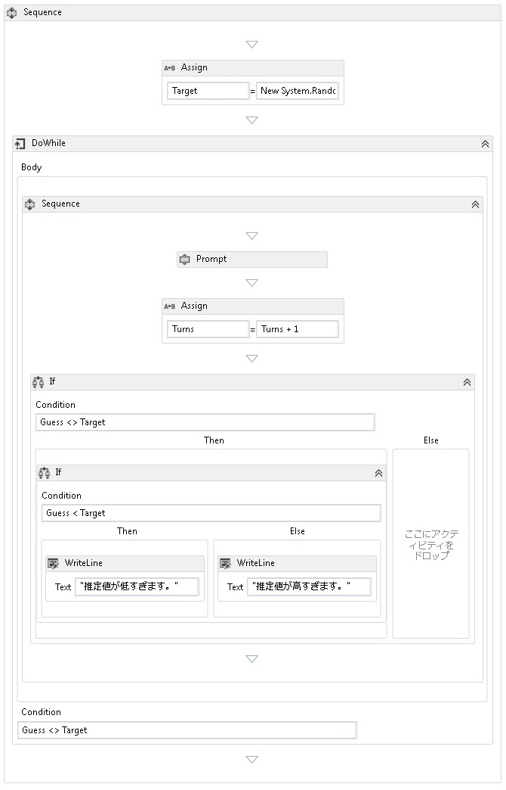

# <a name="how-to-create-a-sequential-workflow"></a>シーケンシャル ワークフローを作成する方法
ワークフローは、ビルトイン アクティビティおよびカスタム アクティビティから構築できます。 など、両方の組み込みのアクティビティを使用するワークフローを作成する手順をこのトピックの内容、<xref:System.Activities.Statements.Sequence>アクティビティ、およびカスタム アクティビティを以前から[する方法: アクティビティを作成](../../../docs/framework/windows-workflow-foundation/how-to-create-an-activity.md)トピックです。 このワークフローは、数値推測ゲームをモデル化しています。  
  
> [!NOTE]
>  チュートリアル入門の各トピックは、前のトピックに応じて異なります。 このトピックの内容を完了する必要があります最初に完了する[する方法: アクティビティを作成する](../../../docs/framework/windows-workflow-foundation/how-to-create-an-activity.md)です。  
  
> [!NOTE]
>  チュートリアルの完成版をダウンロードするには、「 [Windows Workflow Foundation (WF45) - Getting Started Tutorial (Windows Workflow Foundation (WF45) - チュートリアル入門)](http://go.microsoft.com/fwlink/?LinkID=248976)」を参照してください。  
  
### <a name="to-create-the-workflow"></a>ワークフローを作成するには  
  
1.  右クリック**NumberGuessWorkflowActivities**で**ソリューション エクスプ ローラー**選択**追加**、**新しい項目の**します。  
  
2.  **インストール**、**共通項目**ノードで、選択**ワークフロー**です。 選択**アクティビティ**から、**ワークフロー**  ボックスの一覧です。  
  
3.  型`SequentialNumberGuessWorkflow`に、**名前**ボックスし、をクリックして**追加**です。  
  
4.  ドラッグ、**シーケンス**からアクティビティを**制御フロー**のセクションで、**ツールボックス**上にドロップし、**ここにアクティビティをドロップ**のラベルをワークフロー デザイン サーフェイスです。  
  
### <a name="to-create-the-workflow-variables-and-arguments"></a>ワークフロー変数および引数を作成するには  
  
1.  ダブルクリックして**SequentialNumberGuessWorkflow.xaml**で**ソリューション エクスプ ローラー**をまだ表示されていない場合、デザイナーでワークフローを表示します。  
  
2.  をクリックして**引数**を表示するワークフロー デザイナーの左下横で、**引数**ウィンドウです。  
  
3.  をクリックして**引数の作成**です。  
  
4.  型`MaxNumber`に、**名前**ボックスで、**で**から、**方向**ドロップダウン リストで、 **Int32** から**引数の型**ドロップダウン リストと、引数を保存するには ENTER キーを押します。  
  
5.  をクリックして**引数の作成**です。  
  
6.  型`Turns`に、**名前**、新しく追加した下にあるボックス`MaxNumber`引数で、**アウト**から、**方向**selectドロップダウンリスト**Int32**から、**引数の型**ドロップダウン リストとし、ENTER キーを押します。  
  
7.  をクリックして**引数**を閉じる、アクティビティ デザイナーの左下横で、**引数**ウィンドウです。  
  
8.  をクリックして**変数**を表示するワークフロー デザイナーの左下横で、**変数**ウィンドウです。  
  
9. をクリックして**変数を作成**です。  
  
    > [!TIP]
    >  ない場合は**変数の作成**ボックスが表示されたら、をクリックして、**シーケンス**をオンに、ワークフロー デザイナー画面上のアクティビティ。  
  
10. 型`Guess`に、**名前**ボックスで、 **Int32**から、**変数型**ドロップダウン リスト、および、変数を保存するには ENTER キーを押します。  
  
11. をクリックして**変数を作成**です。  
  
12. 型`Target`に、**名前**ボックスで、 **Int32**から、**変数型**ドロップダウン リスト、および、変数を保存するには ENTER キーを押します。  
  
13. をクリックして**変数**を閉じる、アクティビティ デザイナーの左下横で、**変数**ウィンドウです。  
  
### <a name="to-add-the-workflow-activities"></a>ワークフロー アクティビティを追加するには  
  
1.  ドラッグ、**割り当てる**からアクティビティを**プリミティブ**のセクションで、**ツールボックス**上にドロップし、**シーケンス**アクティビティ。 型`Target`に、**に**ボックスおよびに次の式、 **c# 式を入力**または**VB の式を入力**ボックス。  
  
    ```vb  
    New System.Random().Next(1, MaxNumber + 1)  
    ```  
  
    ```csharp  
    new System.Random().Next(1, MaxNumber + 1)  
    ```  
  
    > [!TIP]
    >  場合、**ツールボックス**ウィンドウが表示されない場合、選択**ツールボックス**から、**ビュー**メニュー。  
  
2.  ドラッグ、 **DoWhile**からアクティビティを**制御フロー**のセクションで、**ツールボックス**下に、ワークフロー上にドロップし、**割り当てる**アクティビティ。  
  
3.  次の式を入力、 **DoWhile**アクティビティの**条件**プロパティ値ボックスです。  
  
    ```vb  
    Guess <> Target  
    ```  
  
    ```csharp  
    Guess != Target  
    ```  
  
     <xref:System.Activities.Statements.DoWhile> アクティビティはその子アクティビティを実行し、その <xref:System.Activities.Statements.DoWhile.Condition%2A> を評価します。 <xref:System.Activities.Statements.DoWhile.Condition%2A> が `True` と評価される場合、<xref:System.Activities.Statements.DoWhile> 内のアクティビティが再度実行されます。 この例では、ユーザーの推定値が評価され、推定値が正しいと判断されるまで <xref:System.Activities.Statements.DoWhile> が続行されます。  
  
4.  ドラッグ、**プロンプト**からアクティビティを**NumberGuessWorkflowActivities**のセクションで、**ツールボックス**内にドロップし、 **DoWhile**アクティビティ前の手順です。  
  
5.  **プロパティ ウィンドウ**、型`"EnterGuess"`に引用符を含む、 **BookmarkName**プロパティ値ボックス、**プロンプト**アクティビティ。 型`Guess`に、**結果**プロパティの値のボックスとに次の式を入力、**テキスト**プロパティ ボックス。  
  
    ```vb  
    "Please enter a number between 1 and " & MaxNumber  
    ```  
  
    ```csharp  
    "Please enter a number between 1 and " + MaxNumber  
    ```  
  
    > [!TIP]
    >  場合、**プロパティ ウィンドウ**が表示されていない select**プロパティ ウィンドウ**から、**ビュー**メニュー。  
  
6.  ドラッグ、**割り当てる**からアクティビティを**プリミティブ**のセクションで、**ツールボックス**内にドロップし、 **DoWhile**アクティビティの後になるように、**プロンプト**アクティビティ。  
  
    > [!NOTE]
    >  ドロップすると、**割り当てる**アクティビティ、ワークフロー デザイナーが自動的に追加する方法に注意してください、**シーケンス**両方を含むアクティビティ、**プロンプト**アクティビティと新しく追加されました。**割り当てる**アクティビティ。  
  
7.  型`Turns`に、**に**ボックスおよび`Turns + 1`に、 **c# 式を入力**または**VB の式を入力**ボックス。  
  
8.  ドラッグ、**場合**からアクティビティを**制御フロー**のセクションで、**ツールボックス**内にドロップし、**シーケンス**アクティビティの後になるように、新しく追加された**割り当てる**アクティビティ。  
  
9. 次の式を入力、**場合**アクティビティの**条件**プロパティ値ボックスです。  
  
    ```vb  
    Guess <> Target  
    ```  
  
    ```csharp  
    Guess != Target  
    ```  
  
10. 別のドラッグ**場合**からアクティビティ、**制御フロー**のセクションで、**ツールボックス**内にドロップし、**し**最初のセクション**場合**アクティビティ。  
  
11. 新しく追加された次の式を入力**場合**アクティビティの**条件**プロパティ値ボックスです。  
  
    ```
    Guess < Target  
    ```  
  
12. 2 つをドラッグして**WriteLine**からアクティビティを**プリミティブ**のセクション、**ツールボックス**が 1 つになるようにドロップして、**し**のセクション新しく追加された**場合**、もう 1 つでは、 **Else**セクションです。  
  
13. クリックして、 **WriteLine**内のアクティビティ、**し**して選択し、セクションし、次の式を入力、**テキスト**プロパティ値ボックスです。  
  
    ```vb  
    "Your guess is too low."  
    ```  
  
14. クリックして、 **WriteLine**内のアクティビティ、 **Else**して選択し、セクションし、次の式を入力、**テキスト**プロパティ値ボックスです。  
  
    ```vb  
    "Your guess is too high."  
    ```  
  
     次の例は完成したワークフローを示しています。  
  
       
  
### <a name="to-build-the-workflow"></a>ワークフローをビルドするには  
  
1.  Ctrl キーと Shift キーを押しながら B キーを押して、ソリューションをビルドします。  
  
     ワークフローを実行する方法については、次のトピックをご覧ください。[する方法: ワークフローを実行する](../../../docs/framework/windows-workflow-foundation/how-to-run-a-workflow.md)です。 既に完了している場合、[する方法: ワークフローを実行する](../../../docs/framework/windows-workflow-foundation/how-to-run-a-workflow.md)ステップのワークフローとは異なるスタイルと共に、この手順を使用したシーケンシャル ワークフローを使用して実行してに進んで、[アプリケーションをビルドして実行](../../../docs/framework/windows-workflow-foundation/how-to-run-a-workflow.md#BKMK_ToRunTheApplication)のセクション[する方法: ワークフローを実行する](../../../docs/framework/windows-workflow-foundation/how-to-run-a-workflow.md)です。  
  
## <a name="see-also"></a>関連項目  
 <xref:System.Activities.Statements.Flowchart>  
 <xref:System.Activities.Statements.FlowDecision>  
 [Windows Workflow Foundation プログラミング](../../../docs/framework/windows-workflow-foundation/programming.md)  
 [ワークフローの設計](../../../docs/framework/windows-workflow-foundation/designing-workflows.md)  
 [チュートリアル入門](../../../docs/framework/windows-workflow-foundation/getting-started-tutorial.md)  
 [アクティビティを作成する方法](../../../docs/framework/windows-workflow-foundation/how-to-create-an-activity.md)  
 [ワークフローを実行する方法](../../../docs/framework/windows-workflow-foundation/how-to-run-a-workflow.md)
