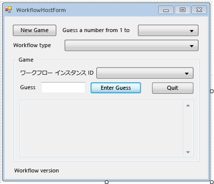

# <a name="how-to-create-and-run-a-long-running-workflow"></a>長時間にわたって実行されるワークフローを作成して実行する方法
Windows Workflow Foundation (WF) のサーバーの全体の機能の 1 つは、永続化して、データベースへのアイドル状態のワークフローをアンロードするランタイムの機能です。 手順に[する方法: ワークフローを実行する](../../../docs/framework/windows-workflow-foundation/how-to-run-a-workflow.md)コンソール アプリケーションを使用してワークフローのホスティングの基礎を示しました。 ワークフローの開始、ワークフロー ライフサイクル ハンドラー、およびブックマークの再開の例を紹介しました。 ワークフローの永続化を効果的に説明するためには、複数のワークフロー インスタンスの開始と再開をサポートするより複雑なワークフロー ホストが必要です。 チュートリアルのこの手順では、複数のワークフロー インスタンスの開始と再開およびワークフローの永続化をサポートする Windows フォーム ホスト アプリケーションを作成する方法について説明します。また、この手順は、以降の手順で説明する追跡やバージョン管理などの高度な機能の基礎となります。  
  
> [!NOTE]
>  このチュートリアルの手順と後続のステップから次の 3 つすべてのワークフロー型を使用して[する方法: ワークフローを作成](../../../docs/framework/windows-workflow-foundation/how-to-create-a-workflow.md)です。 3 種類すべてを完了しなかった場合は、ステップの完成版をダウンロードできます[Windows Workflow Foundation (WF45) - チュートリアル入門](http://go.microsoft.com/fwlink/?LinkID=248976)です。  
  
> [!NOTE]
>  完成版をダウンロードまたはチュートリアルのビデオ チュートリアルを表示を参照してください。 [Windows Workflow Foundation (WF45) - チュートリアル入門](http://go.microsoft.com/fwlink/?LinkID=248976)です。  
  
## <a name="in-this-topic"></a>このトピックの内容  
  
-   [永続性データベースを作成するには](../../../docs/framework/windows-workflow-foundation/how-to-create-and-run-a-long-running-workflow.md#BKMK_CreatePersistenceDatabase)  
  
-   [DurableInstancing アセンブリへの参照を追加するには](../../../docs/framework/windows-workflow-foundation/how-to-create-and-run-a-long-running-workflow.md#BKMK_AddReference)  
  
-   [ワークフロー ホスト フォームを作成するには](../../../docs/framework/windows-workflow-foundation/how-to-create-and-run-a-long-running-workflow.md#BKMK_CreateForm)  
  
-   [プロパティと、フォームのヘルパー メソッドを追加するには](../../../docs/framework/windows-workflow-foundation/how-to-create-and-run-a-long-running-workflow.md#BKMK_AddHelperMethods)  
  
-   [インスタンス ストア、ワークフロー ライフ サイクル ハンドラー、および拡張機能を構成するには](../../../docs/framework/windows-workflow-foundation/how-to-create-and-run-a-long-running-workflow.md#BKMK_ConfigureWorkflowApplication)  
  
-   [開始して、複数のワークフロー型の再開を有効にするには](../../../docs/framework/windows-workflow-foundation/how-to-create-and-run-a-long-running-workflow.md#BKMK_WorkflowVersionMap)  
  
-   [新しいワークフローを開始するには](../../../docs/framework/windows-workflow-foundation/how-to-create-and-run-a-long-running-workflow.md#BKMK_StartWorkflow)  
  
-   [ワークフローを再開するには](../../../docs/framework/windows-workflow-foundation/how-to-create-and-run-a-long-running-workflow.md#BKMK_ResumeWorkflow)  
  
-   [ワークフローを中断する](../../../docs/framework/windows-workflow-foundation/how-to-create-and-run-a-long-running-workflow.md#BKMK_TerminateWorkflow)  
  
-   [ビルドおよびアプリケーションを実行するには](../../../docs/framework/windows-workflow-foundation/how-to-create-and-run-a-long-running-workflow.md#BKMK_BuildAndRun)  
  
###  <a name="BKMK_CreatePersistenceDatabase"></a> 永続性データベースを作成するには  
  
1.  SQL Server Management Studio を開き、たとえば、ローカル サーバーに接続 **. \SQLEXPRESS**です。 右クリックし、**データベース**ノードをクリックし、ローカル サーバーは、**新しいデータベース**です。 新しいデータベースの名前を付けます**WF45GettingStartedTutorial**は、その他のすべての値を使用し、選択**OK**です。  
  
    > [!NOTE]
    >  あることを確認してください。 **Create Database**データベースを作成する前に、ローカル サーバーに対する権限。  
  
2.  選択**開く**、**ファイル**から、**ファイル**メニュー。 次のフォルダーに移動します: `C:\Windows\Microsoft.NET\Framework\4.0.30319\sql\en`。  
  
     次の 2 つのファイルを選択し、クリックして**開く**です。  
  
    -   SqlWorkflowInstanceStoreLogic.sql  
  
    -   SqlWorkflowInstanceStoreSchema.sql  
  
3.  選択**SqlWorkflowInstanceStoreSchema.sql**から、**ウィンドウ**メニュー。 いることを確認**WF45GettingStartedTutorial**でが選択されている、**利用可能なデータベース**ドロップダウンをクリックし、選択**Execute**から、**クエリ**メニュー。  
  
4.  選択**SqlWorkflowInstanceStoreLogic.sql**から、**ウィンドウ**メニュー。 いることを確認**WF45GettingStartedTutorial**でが選択されている、**利用可能なデータベース**ドロップダウンをクリックし、選択**Execute**から、**クエリ**メニュー。  
  
    > [!WARNING]
    >  前の 2 つの手順を正しい順序で実行することが重要です。 クエリが正しい順序で実行されないと、エラーが発生し、永続性データベースは正しく構成されません。  
  
###  <a name="BKMK_AddReference"></a> DurableInstancing アセンブリへの参照を追加するには  
  
1.  右クリック**NumberGuessWorkflowHost**で**ソリューション エクスプ ローラー**選択**参照の追加**です。  
  
2.  選択**アセンブリ**から、**参照の追加**リスト、および型`DurableInstancing`に、**アセンブリの検索**ボックス。 これにより、アセンブリがフィルター処理され、目的の参照を簡単に選択できます。  
  
3.  横にあるチェック ボックスをオン**お**と**System.Runtime.DurableInstancing**から、**検索結果**一覧、およびをクリックして**OK**です。  
  
###  <a name="BKMK_CreateForm"></a> ワークフロー ホスト フォームを作成するには  
  
> [!NOTE]
>  この手順では、フォームを手動で追加して構成する方法について説明します。 必要に応じて、チュートリアルのソリューション ファイルをダウンロードし、完成したフォームをプロジェクトに追加できます。 チュートリアル ファイルをダウンロードするを参照してください。 [Windows Workflow Foundation (WF45) - チュートリアル入門](http://go.microsoft.com/fwlink/?LinkID=248976)です。 右クリックし、ファイルがダウンロードされると、 **NumberGuessWorkflowHost**選択**参照の追加**です。 参照を追加**System.Windows.Forms**と**System.Drawing**です。 新しいフォームを追加する場合、これらの参照が自動的に追加されます、**追加**、**新しい項目の** メニューがフォームをインポートするときに手動で追加する必要があります。 参照が追加されるを右クリックし**NumberGuessWorkflowHost**で**ソリューション エクスプ ローラー**選択**追加**、**既存項目の**します。 参照、 `Form` select、プロジェクト ファイル内のフォルダー **WorkflowHostForm.cs** (または**WorkflowHostForm.vb**)、をクリックして**追加**です。 フォームをインポートするかどうかは、次のセクションでは、下を省略できます[プロパティと、フォームのヘルパー メソッドを追加する](../../../docs/framework/windows-workflow-foundation/how-to-create-and-run-a-long-running-workflow.md#BKMK_AddHelperMethods)です。  
  
1.  右クリック**NumberGuessWorkflowHost**で**ソリューション エクスプ ローラー**選択**追加**、**新しい項目の**します。  
  
2.  **インストール済み**テンプレート リストで、選択**Windows フォーム**、型`WorkflowHostForm`で、**名前**ボックスし、をクリックして**追加**です。  
  
3.  フォームの次のプロパティを構成します。  
  
    |プロパティ|値|  
    |--------------|-----------|  
    |FormBorderStyle|FixedSingle|  
    |MaximizeBox|False|  
    |サイズ|400, 420|  
  
4.  次のコントロールを指定された順序でフォームに追加し、指示に従ってプロパティを構成します。  
  
    |コントロール|プロパティ: 値|  
    |-------------|---------------------|  
    |**Button**|名前: NewGame<br /><br /> 場所: 13、13<br /><br /> サイズ: 75, 23<br /><br /> 新しいゲームのテキスト:|  
    |**Label**|場所: 94、18<br /><br /> 1 から番号を推測するテキスト。|  
    |**ComboBox**|名前: NumberRange<br /><br /> DropDownStyle: DropDownList<br /><br /> 項目: 10、100、1000<br /><br /> 場所: 228、12<br /><br /> サイズ: 143、21|  
    |**Label**|場所: 13、43<br /><br /> ワークフロー型のテキスト:|  
    |**ComboBox**|名前: WorkflowType<br /><br /> DropDownStyle: DropDownList<br /><br /> 項目: StateMachineNumberGuessWorkflow、FlowchartNumberGuessWorkflow、SequentialNumberGuessWorkflow<br /><br /> 場所: 94、40<br /><br /> サイズ: 277、21|  
    |**Label**|名前: WorkflowVersion<br /><br /> 場所: 13、362<br /><br /> ワークフロー バージョンのテキスト:|  
    |**GroupBox**|場所: 13、67<br /><br /> サイズ: 358、287<br /><br /> テキスト: ゲーム|  
  
    > [!NOTE]
    >  次のコントロールを追加するときに、GroupBox にそれらを配置します。  
  
    |コントロール|プロパティ: 値|  
    |-------------|---------------------|  
    |**Label**|場所: 7、20<br /><br /> Text: ワークフロー インスタンス Id|  
    |**ComboBox**|名前: InstanceId<br /><br /> DropDownStyle: DropDownList<br /><br /> 場所: 121、17<br /><br /> サイズ: 227、21|  
    |**Label**|場所: 7、47<br /><br /> テキスト: 推測|  
    |**TextBox**|名前: 推測<br /><br /> 場所: 50、44<br /><br /> サイズ: 65, 20|  
    |**Button**|名前: EnterGuess<br /><br /> 場所: 121、42<br /><br /> サイズ: 75, 23<br /><br /> 推定値を入力するテキスト。|  
    |**Button**|名前: QuitGame<br /><br /> 場所: 274、42<br /><br /> サイズ: 75, 23<br /><br /> テキスト: 終了|  
    |**TextBox**|名前: WorkflowStatus<br /><br /> 場所: 10、73<br /><br /> Multiline: True<br /><br /> 読み取り専用: True<br /><br /> スクロール バー: 垂直<br /><br /> サイズ: 338、208|  
  
5.  設定、 **AcceptButton**にフォームのプロパティ**EnterGuess**です。  
  
 次の例は完成したフォームを示しています。  
  
   
  
###  <a name="BKMK_AddHelperMethods"></a> プロパティと、フォームのヘルパー メソッドを追加するには  
 このセクションの手順では、フォーム クラスに、数値推測ワークフローの実行と再開をサポートするようフォームの UI を構成するプロパティとヘルパー メソッドを追加します。  
  
1.  右クリック**WorkflowHostForm**で**ソリューション エクスプ ローラー**選択**コードの表示**です。  
  
2.  次の `using` (または `Imports`) ステートメントを、他の `using` (または `Imports`) ステートメントを含むファイルの先頭に追加します。  
  
    ```vb  
    Imports System.Windows.Forms  
    Imports System.Activities.DurableInstancing  
    Imports System.Activities  
    Imports System.Data.SqlClient  
    Imports System.IO  
    ```  
  
    ```csharp  
    using System.Windows.Forms;  
    using System.Activities.DurableInstancing;  
    using System.Activities;  
    using System.Data.SqlClient;  
    using System.IO;  
    ```  
  
3.  次のメンバー宣言を追加、 **WorkflowHostForm**クラスです。  
  
    ```vb  
    Const connectionString = "Server=.\SQLEXPRESS;Initial Catalog=WF45GettingStartedTutorial;Integrated Security=SSPI"  
    Dim store As SqlWorkflowInstanceStore  
    Dim WorkflowStarting As Boolean  
    ```  
  
    ```csharp  
    const string connectionString = "Server=.\\SQLEXPRESS;Initial Catalog=WF45GettingStartedTutorial;Integrated Security=SSPI";  
    SqlWorkflowInstanceStore store;  
    bool WorkflowStarting;  
    ```  
  
    > [!NOTE]
    >  接続文字列が異なる場合は、使用しているデータベースを参照するように `connectionString` を更新してください。  
  
4.  `WorkflowInstanceId` プロパティを `WorkflowFormHost` クラスに追加します。  
  
    ```vb  
    Public ReadOnly Property WorkflowInstanceId() As Guid  
        Get  
            If InstanceId.SelectedIndex = -1 Then  
                Return Guid.Empty  
            Else  
                Return New Guid(InstanceId.SelectedItem.ToString())  
            End If  
        End Get  
    End Property  
    ```  
  
    ```csharp  
    public Guid WorkflowInstanceId  
    {  
        get  
        {  
            return InstanceId.SelectedIndex == -1 ? Guid.Empty : (Guid)InstanceId.SelectedItem;  
        }  
    }  
    ```  
  
     `InstanceId`コンボ ボックスは、永続化されたワークフロー インスタンス id の一覧を表示し、`WorkflowInstanceId`プロパティは、現在選択されているワークフローを返します。  
  
5.  フォームの `Load` イベントのハンドラーを追加します。 切り替えて、ハンドラーを追加する**デザイン ビュー** 、フォームをクリックして、**イベント**の上部にあるアイコン、**プロパティ**ウィンドウ、およびダブルクリック**ロード**.  
  
    ```vb  
    Private Sub WorkflowHostForm_Load(sender As Object, e As EventArgs) Handles Me.Load  
  
    End Sub  
    ```  
  
    ```csharp  
    private void WorkflowHostForm_Load(object sender, EventArgs e)  
    {  
  
    }  
    ```  
  
6.  `WorkflowHostForm_Load` に次のコードを追加します。  
  
    ```vb  
    'Initialize the store and configure it so that it can be used for  
    'multiple WorkflowApplication instances.  
    store = New SqlWorkflowInstanceStore(connectionString)  
    WorkflowApplication.CreateDefaultInstanceOwner(store, Nothing, WorkflowIdentityFilter.Any)  
  
    'Set default ComboBox selections.  
    NumberRange.SelectedIndex = 0  
    WorkflowType.SelectedIndex = 0  
  
    ListPersistedWorkflows()  
    ```  
  
    ```csharp  
    // Initialize the store and configure it so that it can be used for  
    // multiple WorkflowApplication instances.  
    store = new SqlWorkflowInstanceStore(connectionString);  
    WorkflowApplication.CreateDefaultInstanceOwner(store, null, WorkflowIdentityFilter.Any);  
  
    // Set default ComboBox selections.  
    NumberRange.SelectedIndex = 0;  
    WorkflowType.SelectedIndex = 0;  
  
    ListPersistedWorkflows();  
    ```  
  
     フォームの読み込み時に、`SqlWorkflowInstanceStore` が構成され、範囲とワークフローの種類のコンボ ボックスが既定値に設定されます。さらに、永続化されたワークフロー インスタンスが `InstanceId` コンボ ボックスに追加されます。  
  
7.  `SelectedIndexChanged` の `InstanceId` ハンドラーを追加します。 切り替えて、ハンドラーを追加する**デザイン ビュー** 、フォームの選択、`InstanceId`コンボ ボックスで、をクリックして、**イベント**の上部にあるアイコン、**プロパティ**ウィンドウとダブルクリックして**SelectedIndexChanged**です。  
  
    ```vb  
    Private Sub InstanceId_SelectedIndexChanged(sender As Object, e As EventArgs) Handles InstanceId.SelectedIndexChanged  
  
    End Sub  
    ```  
  
    ```csharp  
    private void InstanceId_SelectedIndexChanged(object sender, EventArgs e)  
    {  
  
    }  
    ```  
  
8.  `InstanceId_SelectedIndexChanged` に次のコードを追加します。 ユーザーがコンボ ボックスを使用してワークフローを選択するたびに、このハンドラーによってステータス ウィンドウが更新されます。  
  
    ```vb  
    If InstanceId.SelectedIndex = -1 Then  
        Return  
    End If  
  
    'Clear the status window.  
    WorkflowStatus.Clear()  
  
    'Get the workflow version and display it.  
    'If the workflow is just starting then this info will not  
    'be available in the persistence store so do not try and retrieve it.  
    If Not WorkflowStarting Then  
        Dim instance As WorkflowApplicationInstance = _  
            WorkflowApplication.GetInstance(WorkflowInstanceId, store)  
  
        WorkflowVersion.Text = _  
            WorkflowVersionMap.GetIdentityDescription(instance.DefinitionIdentity)  
  
        'Unload the instance.  
        instance.Abandon()  
    End If  
    ```  
  
    ```csharp  
    if (InstanceId.SelectedIndex == -1)  
    {  
        return;  
    }  
  
    // Clear the status window.  
    WorkflowStatus.Clear();  
  
    // Get the workflow version and display it.  
    // If the workflow is just starting then this info will not  
    // be available in the persistence store so do not try and retrieve it.  
    if (!WorkflowStarting)  
    {  
        WorkflowApplicationInstance instance =  
            WorkflowApplication.GetInstance(this.WorkflowInstanceId, store);  
  
        WorkflowVersion.Text =  
            WorkflowVersionMap.GetIdentityDescription(instance.DefinitionIdentity);  
  
        // Unload the instance.  
        instance.Abandon();  
    }  
    ```  
  
9. 次の `ListPersistedWorkflows` メソッドをフォーム クラスに追加します。  
  
    ```vb  
    Private Sub ListPersistedWorkflows()  
        Using localCon As New SqlConnection(connectionString)  
            Dim localCmd As String = _  
                "Select [InstanceId] from [System.Activities.DurableInstancing].[Instances] Order By [CreationTime]"  
  
            Dim cmd As SqlCommand = localCon.CreateCommand()  
            cmd.CommandText = localCmd  
            localCon.Open()  
            Using reader As SqlDataReader = cmd.ExecuteReader(CommandBehavior.CloseConnection)  
  
                While (reader.Read())  
                    'Get the InstanceId of the persisted Workflow.  
                    Dim id As Guid = Guid.Parse(reader(0).ToString())  
                    InstanceId.Items.Add(id)  
                End While  
            End Using  
        End Using  
    End Sub  
    ```  
  
    ```csharp  
    using (SqlConnection localCon = new SqlConnection(connectionString))  
    {  
        string localCmd =  
            "Select [InstanceId] from [System.Activities.DurableInstancing].[Instances] Order By [CreationTime]";  
  
        SqlCommand cmd = localCon.CreateCommand();  
        cmd.CommandText = localCmd;  
        localCon.Open();  
        using (SqlDataReader reader = cmd.ExecuteReader(CommandBehavior.CloseConnection))  
        {  
            while (reader.Read())  
            {  
                // Get the InstanceId of the persisted Workflow  
                Guid id = Guid.Parse(reader[0].ToString());  
                InstanceId.Items.Add(id);  
            }  
        }  
    }  
    ```  
  
     `ListPersistedWorkflows` は、永続化されたワークフロー インスタンスのインスタンス ストアに対してクエリを実行し、`cboInstanceId` コンボ ボックスにインスタンス ID を追加します。  
  
10. 次の `UpdateStatus` メソッドと対応するデリゲートをフォーム クラスに追加します。 このメソッドは、現在実行中のワークフローのステータスでフォーム上のステータス ウィンドウを更新します。  
  
    ```vb  
    Private Delegate Sub UpdateStatusDelegate(msg As String)  
    Public Sub UpdateStatus(msg As String)  
        'We may be on a different thread so we need to  
        'make this call using BeginInvoke.  
        If InvokeRequired Then  
            BeginInvoke(New UpdateStatusDelegate(AddressOf UpdateStatus), msg)  
        Else  
            If Not msg.EndsWith(vbCrLf) Then  
                msg = msg & vbCrLf  
            End If  
  
            WorkflowStatus.AppendText(msg)  
  
            'Ensure that the newly added status is visible.  
            WorkflowStatus.SelectionStart = WorkflowStatus.Text.Length  
            WorkflowStatus.ScrollToCaret()  
        End If  
    End Sub  
    ```  
  
    ```csharp  
    private delegate void UpdateStatusDelegate(string msg);  
    public void UpdateStatus(string msg)  
    {  
        // We may be on a different thread so we need to  
        // make this call using BeginInvoke.  
        if (InvokeRequired)  
        {  
            BeginInvoke(new UpdateStatusDelegate(UpdateStatus), msg);  
        }  
        else  
        {  
            if (!msg.EndsWith("\r\n"))  
            {  
                msg += "\r\n";  
            }  
            WorkflowStatus.AppendText(msg);  
  
            WorkflowStatus.SelectionStart = WorkflowStatus.Text.Length;  
            WorkflowStatus.ScrollToCaret();  
        }  
    }  
    ```  
  
11. 次の `GameOver` メソッドと対応するデリゲートをフォーム クラスに追加します。 このメソッドは、完了したワークフローのインスタンス id を削除することで、フォームの UI を更新、ワークフローが完了したらから、 **InstanceId**コンボ ボックス。  
  
    ```vb  
    Private Delegate Sub GameOverDelegate()  
    Private Sub GameOver()  
        If InvokeRequired Then  
            BeginInvoke(New GameOverDelegate(AddressOf GameOver))  
        Else  
            'Remove this instance from the InstanceId combo box.  
            InstanceId.Items.Remove(InstanceId.SelectedItem)  
            InstanceId.SelectedIndex = -1  
        End If  
    End Sub  
    ```  
  
    ```csharp  
    private delegate void GameOverDelegate();  
    private void GameOver()  
    {  
        if (InvokeRequired)  
        {  
            BeginInvoke(new GameOverDelegate(GameOver));  
        }  
        else  
        {  
            // Remove this instance from the combo box  
            InstanceId.Items.Remove(InstanceId.SelectedItem);  
            InstanceId.SelectedIndex = -1;  
        }  
    }  
    ```  
  
###  <a name="BKMK_ConfigureWorkflowApplication"></a> インスタンス ストア、ワークフロー ライフ サイクル ハンドラー、および拡張機能を構成するには  
  
1.  フォーム クラスに `ConfigureWorkflowApplication` メソッドを追加します。  
  
    ```vb  
    Private Sub ConfigureWorkflowApplication(wfApp As WorkflowApplication)  
  
    End Sub  
    ```  
  
    ```csharp  
    private void ConfigureWorkflowApplication(WorkflowApplication wfApp)  
    {      
    }  
    ```  
  
     このメソッドは `WorkflowApplication` を構成し、目的の拡張機能を追加して、ワークフロー ライフサイクル イベントのハンドラーを追加します。  
  
2.  `ConfigureWorkflowApplication` で、`SqlWorkflowInstanceStore` の `WorkflowApplication` を指定します。  
  
    ```vb  
    'Configure the persistence store.  
    wfApp.InstanceStore = store  
    ```  
  
    ```csharp  
    // Configure the persistence store.  
    wfApp.InstanceStore = store;  
    ```  
  
3.  次に、`StringWriter` インスタンスを作成して `Extensions` の `WorkflowApplication` コレクションに追加します。 ときに、`StringWriter`は追加、拡張機能をすべてキャプチャされます`WriteLine`アクティビティの出力。 ワークフローがアイドル状態になると、`WriteLine` の出力を `StringWriter` から抽出してフォームに表示できます。  
  
    ```vb  
    'Add a StringWriter to the extensions. This captures the output  
    'from the WriteLine activities so we can display it in the form.  
    Dim sw As New StringWriter()  
    wfApp.Extensions.Add(sw)  
    ```  
  
    ```csharp  
    // Add a StringWriter to the extensions. This captures the output  
    // from the WriteLine activities so we can display it in the form.  
    StringWriter sw = new StringWriter();  
    wfApp.Extensions.Add(sw);  
    ```  
  
4.  `Completed` イベントの次のハンドラーを追加します。 ワークフローが正常に完了すると、数値を推測するための順番の数がステータス ウィンドウに表示されます。 ワークフローが終了すると、終了の原因となった例外情報が表示されます。 ハンドラーの末尾で、`GameOver` メソッドが呼び出され、完了したワークフローがワークフローの一覧から削除されます。  
  
    ```vb  
    wfApp.Completed = _  
        Sub(e As WorkflowApplicationCompletedEventArgs)  
            If e.CompletionState = ActivityInstanceState.Faulted Then  
                UpdateStatus(String.Format("Workflow Terminated. Exception: {0}" & vbCrLf & "{1}", _  
                    e.TerminationException.GetType().FullName, _  
                    e.TerminationException.Message))  
            ElseIf e.CompletionState = ActivityInstanceState.Canceled Then  
                UpdateStatus("Workflow Canceled.")  
            Else  
                Dim Turns As Integer = Convert.ToInt32(e.Outputs("Turns"))  
                UpdateStatus(String.Format("Congratulations, you guessed the number in {0} turns.", Turns))  
            End If  
            GameOver()  
        End Sub  
    ```  
  
    ```csharp  
    wfApp.Completed = delegate(WorkflowApplicationCompletedEventArgs e)  
    {  
        if (e.CompletionState == ActivityInstanceState.Faulted)  
        {  
            UpdateStatus(string.Format("Workflow Terminated. Exception: {0}\r\n{1}",  
                e.TerminationException.GetType().FullName,  
                e.TerminationException.Message));  
        }  
        else if (e.CompletionState == ActivityInstanceState.Canceled)  
        {  
            UpdateStatus("Workflow Canceled.");  
        }  
        else  
        {  
            int Turns = Convert.ToInt32(e.Outputs["Turns"]);  
            UpdateStatus(string.Format("Congratulations, you guessed the number in {0} turns.", Turns));  
        }  
        GameOver();  
    };  
    ```  
  
5.  次の `Aborted` ハンドラーと `OnUnhandledException` ハンドラーを追加します。 `GameOver` メソッドが `Aborted` ハンドラーから呼び出されることはありません。これは、ワークフロー インスタンスが中止された場合、そのインスタンスは終了せず、後で再開することができるためです。  
  
    ```vb  
    wfApp.Aborted = _  
        Sub(e As WorkflowApplicationAbortedEventArgs)  
            UpdateStatus(String.Format("Workflow Aborted. Exception: {0}" & vbCrLf & "{1}", _  
                e.Reason.GetType().FullName, _  
                e.Reason.Message))  
        End Sub  
  
    wfApp.OnUnhandledException = _  
        Function(e As WorkflowApplicationUnhandledExceptionEventArgs)  
            UpdateStatus(String.Format("Unhandled Exception: {0}" & vbCrLf & "{1}", _  
                e.UnhandledException.GetType().FullName, _  
                e.UnhandledException.Message))  
            GameOver()  
            Return UnhandledExceptionAction.Terminate  
        End Function  
    ```  
  
    ```csharp  
    wfApp.Aborted = delegate(WorkflowApplicationAbortedEventArgs e)  
    {  
        UpdateStatus(string.Format("Workflow Aborted. Exception: {0}\r\n{1}",  
                e.Reason.GetType().FullName,  
                e.Reason.Message));  
    };  
  
    wfApp.OnUnhandledException = delegate(WorkflowApplicationUnhandledExceptionEventArgs e)  
    {  
        UpdateStatus(string.Format("Unhandled Exception: {0}\r\n{1}",  
                e.UnhandledException.GetType().FullName,  
                e.UnhandledException.Message));  
        GameOver();  
        return UnhandledExceptionAction.Terminate;  
    };  
    ```  
  
6.  次の `PersistableIdle` ハンドラーを追加します。 このハンドラーは、追加された `StringWriter` 拡張機能を取得し、`WriteLine` アクティビティからの出力を抽出して、ステータス ウィンドウに表示します。  
  
    ```vb  
    wfApp.PersistableIdle = _  
        Function(e As WorkflowApplicationIdleEventArgs)  
            'Send the current WriteLine outputs to the status window.  
            Dim writers = e.GetInstanceExtensions(Of StringWriter)()  
            For Each writer In writers  
                UpdateStatus(writer.ToString())  
            Next  
            Return PersistableIdleAction.Unload  
        End Function  
    ```  
  
    ```csharp  
    wfApp.PersistableIdle = delegate(WorkflowApplicationIdleEventArgs e)  
    {  
        // Send the current WriteLine outputs to the status window.  
        var writers = e.GetInstanceExtensions<StringWriter>();  
        foreach (var writer in writers)  
        {  
            UpdateStatus(writer.ToString());  
        }  
        return PersistableIdleAction.Unload;  
    };  
    ```  
  
     <xref:System.Activities.PersistableIdleAction> 列挙体には、<xref:System.Activities.PersistableIdleAction.None>、<xref:System.Activities.PersistableIdleAction.Persist>、および <xref:System.Activities.PersistableIdleAction.Unload> の 3 つの値があります。 <xref:System.Activities.PersistableIdleAction.Persist> により、ワークフローは永続化されますが、ワークフローがアンロードされることはありません。 <xref:System.Activities.PersistableIdleAction.Unload> により、ワーク フローが永続化され、アンロードされます。  
  
     完成した `ConfigureWorkflowApplication` メソッドは次のようになります。  
  
    ```vb  
    Private Sub ConfigureWorkflowApplication(wfApp As WorkflowApplication)  
        'Configure the persistence store.  
        wfApp.InstanceStore = store  
  
        'Add a StringWriter to the extensions. This captures the output  
        'from the WriteLine activities so we can display it in the form.  
        Dim sw As New StringWriter()  
        wfApp.Extensions.Add(sw)  
  
        wfApp.Completed = _  
            Sub(e As WorkflowApplicationCompletedEventArgs)  
                If e.CompletionState = ActivityInstanceState.Faulted Then  
                    UpdateStatus(String.Format("Workflow Terminated. Exception: {0}" & vbCrLf & "{1}", _  
                        e.TerminationException.GetType().FullName, _  
                        e.TerminationException.Message))  
                ElseIf e.CompletionState = ActivityInstanceState.Canceled Then  
                    UpdateStatus("Workflow Canceled.")  
                Else  
                    Dim Turns As Integer = Convert.ToInt32(e.Outputs("Turns"))  
                    UpdateStatus(String.Format("Congratulations, you guessed the number in {0} turns.", Turns))  
                End If  
                GameOver()  
            End Sub  
  
        wfApp.Aborted = _  
            Sub(e As WorkflowApplicationAbortedEventArgs)  
                UpdateStatus(String.Format("Workflow Aborted. Exception: {0}" & vbCrLf & "{1}", _  
                    e.Reason.GetType().FullName, _  
                    e.Reason.Message))  
            End Sub  
  
        wfApp.OnUnhandledException = _  
            Function(e As WorkflowApplicationUnhandledExceptionEventArgs)  
                UpdateStatus(String.Format("Unhandled Exception: {0}" & vbCrLf & "{1}", _  
                    e.UnhandledException.GetType().FullName, _  
                    e.UnhandledException.Message))  
                GameOver()  
                Return UnhandledExceptionAction.Terminate  
            End Function  
  
        wfApp.PersistableIdle = _  
            Function(e As WorkflowApplicationIdleEventArgs)  
                'Send the current WriteLine outputs to the status window.  
                Dim writers = e.GetInstanceExtensions(Of StringWriter)()  
                For Each writer In writers  
                    UpdateStatus(writer.ToString())  
                Next  
                Return PersistableIdleAction.Unload  
            End Function  
    End Sub  
    ```  
  
    ```csharp  
    private void ConfigureWorkflowApplication(WorkflowApplication wfApp)  
    {  
        // Configure the persistence store.  
        wfApp.InstanceStore = store;  
  
        // Add a StringWriter to the extensions. This captures the output  
        // from the WriteLine activities so we can display it in the form.  
        StringWriter sw = new StringWriter();  
        wfApp.Extensions.Add(sw);  
  
        wfApp.Completed = delegate(WorkflowApplicationCompletedEventArgs e)  
        {  
            if (e.CompletionState == ActivityInstanceState.Faulted)  
            {  
                UpdateStatus(string.Format("Workflow Terminated. Exception: {0}\r\n{1}",  
                    e.TerminationException.GetType().FullName,  
                    e.TerminationException.Message));  
            }  
            else if (e.CompletionState == ActivityInstanceState.Canceled)  
            {  
                UpdateStatus("Workflow Canceled.");  
            }  
            else  
            {  
                int Turns = Convert.ToInt32(e.Outputs["Turns"]);  
                UpdateStatus(string.Format("Congratulations, you guessed the number in {0} turns.", Turns));  
            }  
            GameOver();  
        };  
  
        wfApp.Aborted = delegate(WorkflowApplicationAbortedEventArgs e)  
        {  
            UpdateStatus(string.Format("Workflow Aborted. Exception: {0}\r\n{1}",  
                    e.Reason.GetType().FullName,  
                    e.Reason.Message));  
        };  
  
        wfApp.OnUnhandledException = delegate(WorkflowApplicationUnhandledExceptionEventArgs e)  
        {  
            UpdateStatus(string.Format("Unhandled Exception: {0}\r\n{1}",  
                    e.UnhandledException.GetType().FullName,  
                    e.UnhandledException.Message));  
            GameOver();  
            return UnhandledExceptionAction.Terminate;  
        };  
  
        wfApp.PersistableIdle = delegate(WorkflowApplicationIdleEventArgs e)  
        {  
            // Send the current WriteLine outputs to the status window.  
            var writers = e.GetInstanceExtensions<StringWriter>();  
            foreach (var writer in writers)  
            {  
                UpdateStatus(writer.ToString());  
            }  
            return PersistableIdleAction.Unload;  
        };  
    }  
    ```  
  
###  <a name="BKMK_WorkflowVersionMap"></a> 開始して、複数のワークフロー型の再開を有効にするには  
 ワークフロー インスタンスを再開するには、ホストはワークフロー定義を指定する必要があります。 このチュートリアルには 3 種類のワークフローがあり、以降の手順では、これらの種類の複数のバージョンを指定します。 `WorkflowIdentity` を使用すると、ホスト アプリケーションは、識別情報を永続化されたワークフロー インスタンスに関連付けることができます。 このセクションの手順では、永続化されたワークフロー インスタンスから対応するワークフロー定義へのワークフロー ID のマッピングに役立つユーティリティ クラスの作成方法を示します。 [!INCLUDE[crabout](../../../includes/crabout-md.md)] `WorkflowIdentity` バージョン管理を参照してください[を使用して WorkflowIdentity と Versioning](../../../docs/framework/windows-workflow-foundation/using-workflowidentity-and-versioning.md)です。  
  
1.  右クリック**NumberGuessWorkflowHost**で**ソリューション エクスプ ローラー**選択**追加**、**クラス**です。 型`WorkflowVersionMap`に、**名前**ボックスし、をクリックして**追加**です。  
  
2.  次の `using` または `Imports` ステートメントを、他の `using` または `Imports` ステートメントを含むファイルの先頭に追加します。  
  
    ```vb  
    Imports NumberGuessWorkflowActivities  
    Imports System.Activities  
    ```  
  
    ```csharp  
    using NumberGuessWorkflowActivities;  
    using System.Activities;  
    ```  
  
3.  `WorkflowVersionMap` クラス宣言を次の宣言に置き換えます。  
  
    ```vb  
    Public Module WorkflowVersionMap  
        Dim map As Dictionary(Of WorkflowIdentity, Activity)  
  
        'Current version identities.  
        Public StateMachineNumberGuessIdentity As WorkflowIdentity  
        Public FlowchartNumberGuessIdentity As WorkflowIdentity  
        Public SequentialNumberGuessIdentity As WorkflowIdentity  
  
        Sub New()  
            map = New Dictionary(Of WorkflowIdentity, Activity)  
  
            'Add the current workflow version identities.  
            StateMachineNumberGuessIdentity = New WorkflowIdentity With  
            {  
                .Name = "StateMachineNumberGuessWorkflow",  
                .Version = New Version(1, 0, 0, 0)  
            }  
  
            FlowchartNumberGuessIdentity = New WorkflowIdentity With  
            {  
                .Name = "FlowchartNumberGuessWorkflow",  
                .Version = New Version(1, 0, 0, 0)  
            }  
  
            SequentialNumberGuessIdentity = New WorkflowIdentity With  
            {  
                .Name = "SequentialNumberGuessWorkflow",  
                .Version = New Version(1, 0, 0, 0)  
            }  
  
            map.Add(StateMachineNumberGuessIdentity, New StateMachineNumberGuessWorkflow())  
            map.Add(FlowchartNumberGuessIdentity, New FlowchartNumberGuessWorkflow())  
            map.Add(SequentialNumberGuessIdentity, New SequentialNumberGuessWorkflow())  
        End Sub  
  
        Public Function GetWorkflowDefinition(identity As WorkflowIdentity) As Activity  
            Return map(identity)  
        End Function  
  
        Public Function GetIdentityDescription(identity As WorkflowIdentity) As String  
            Return identity.ToString()  
        End Function  
    End Module  
    ```  
  
    ```csharp  
    public static class WorkflowVersionMap  
    {  
        static Dictionary<WorkflowIdentity, Activity> map;  
  
        // Current version identities.  
        static public WorkflowIdentity StateMachineNumberGuessIdentity;  
        static public WorkflowIdentity FlowchartNumberGuessIdentity;  
        static public WorkflowIdentity SequentialNumberGuessIdentity;  
  
        static WorkflowVersionMap()  
        {  
            map = new Dictionary<WorkflowIdentity, Activity>();  
  
            // Add the current workflow version identities.  
            StateMachineNumberGuessIdentity = new WorkflowIdentity  
            {  
                Name = "StateMachineNumberGuessWorkflow",  
                Version = new Version(1, 0, 0, 0)  
            };  
  
            FlowchartNumberGuessIdentity = new WorkflowIdentity  
            {  
                Name = "FlowchartNumberGuessWorkflow",  
                Version = new Version(1, 0, 0, 0)  
            };  
  
            SequentialNumberGuessIdentity = new WorkflowIdentity  
            {  
                Name = "SequentialNumberGuessWorkflow",  
                Version = new Version(1, 0, 0, 0)  
            };  
  
            map.Add(StateMachineNumberGuessIdentity, new StateMachineNumberGuessWorkflow());  
            map.Add(FlowchartNumberGuessIdentity, new FlowchartNumberGuessWorkflow());  
            map.Add(SequentialNumberGuessIdentity, new SequentialNumberGuessWorkflow());  
        }  
  
        public static Activity GetWorkflowDefinition(WorkflowIdentity identity)  
        {  
            return map[identity];  
        }  
  
        public static string GetIdentityDescription(WorkflowIdentity identity)  
        {          
            return identity.ToString();  
       }  
    }  
    ```  
  
     `WorkflowVersionMap` は、このチュートリアルの 3 つのワークフロー定義にマップされる 3 つのワークフロー ID を格納しており、以降のセクションでワークフローが開始および再開されるときに使用されます。  
  
###  <a name="BKMK_StartWorkflow"></a> 新しいワークフローを開始するには  
  
1.  `Click` の `NewGame` ハンドラーを追加します。 切り替えて、ハンドラーを追加する**デザイン ビュー**をダブルクリックして、フォームの`NewGame`します。 `NewGame_Click` ハンドラーが追加され、ビューがフォームのコード ビューに切り替わります。 ユーザーがこのボタンをクリックするたびに、新しいワークフローが開始されます。  
  
    ```vb  
    Private Sub NewGame_Click(sender As Object, e As EventArgs) Handles NewGame.Click  
  
    End Sub  
    ```  
  
    ```csharp  
    private void NewGame_Click(object sender, EventArgs e)  
    {  
  
    }  
    ```  
  
2.  Click ハンドラーに次のコードを追加します。 このコードにより、引数名によってキー指定された、ワークフローの入力引数のディクショナリが作成されます。 このディクショナリには、範囲のコンボ ボックスから取得したランダムに生成された数値の範囲を含む 1 つのエントリがあります。  
  
    ```vb  
    Dim inputs As New Dictionary(Of String, Object)()  
    inputs.Add("MaxNumber", Convert.ToInt32(NumberRange.SelectedItem))  
    ```  
  
    ```csharp  
    var inputs = new Dictionary<string, object>();  
    inputs.Add("MaxNumber", Convert.ToInt32(NumberRange.SelectedItem));  
    ```  
  
3.  次に、ワークフローを開始する次のコードを追加します。 選択されたワークフローの種類に対応する `WorkflowIdentity` とワークフロー定義が `WorkflowVersionMap` ヘルパー クラスを使用して取得されます。 さらに、新しい `WorkflowApplication` インスタンスを作成するには、ワークフロー定義、`WorkflowIdentity`、および入力引数のディクショナリを使用します。  
  
    ```vb  
    Dim identity As WorkflowIdentity = Nothing  
    Select Case WorkflowType.SelectedItem.ToString()  
        Case "SequentialNumberGuessWorkflow"  
            identity = WorkflowVersionMap.SequentialNumberGuessIdentity  
  
        Case "StateMachineNumberGuessWorkflow"  
            identity = WorkflowVersionMap.StateMachineNumberGuessIdentity  
  
        Case "FlowchartNumberGuessWorkflow"  
            identity = WorkflowVersionMap.FlowchartNumberGuessIdentity  
    End Select  
  
    Dim wf As Activity = WorkflowVersionMap.GetWorkflowDefinition(identity)  
  
    Dim wfApp = New WorkflowApplication(wf, inputs, identity)  
    ```  
  
    ```csharp  
    WorkflowIdentity identity = null;  
    switch (WorkflowType.SelectedItem.ToString())  
    {  
        case "SequentialNumberGuessWorkflow":  
            identity = WorkflowVersionMap.SequentialNumberGuessIdentity;  
            break;  
  
        case "StateMachineNumberGuessWorkflow":  
            identity = WorkflowVersionMap.StateMachineNumberGuessIdentity;  
            break;  
  
        case "FlowchartNumberGuessWorkflow":  
            identity = WorkflowVersionMap.FlowchartNumberGuessIdentity;  
            break;  
    };  
  
    Activity wf = WorkflowVersionMap.GetWorkflowDefinition(identity);  
  
    WorkflowApplication wfApp = new WorkflowApplication(wf, inputs, identity);  
    ```  
  
4.  次に、ワークフローの一覧にワークフローを追加し、フォーム上にワークフローのバージョン情報を表示する次のコードを追加します。  
  
    ```vb  
    'Add the workflow to the list and display the version information.  
    WorkflowStarting = True  
    InstanceId.SelectedIndex = InstanceId.Items.Add(wfApp.Id)  
    WorkflowVersion.Text = identity.ToString()  
    WorkflowStarting = False  
    ```  
  
    ```csharp  
    // Add the workflow to the list and display the version information.  
    WorkflowStarting = true;  
    InstanceId.SelectedIndex = InstanceId.Items.Add(wfApp.Id);  
    WorkflowVersion.Text = identity.ToString();  
    WorkflowStarting = false;  
    ```  
  
5.  `ConfigureWorkflowApplication` を呼び出して、この `WorkflowApplication` インスタンスのインスタンス ストア、拡張機能、およびワークフロー ライフサイクル ハンドラーを構成します。  
  
    ```vb  
    'Configure the instance store, extensions, and   
    'workflow lifecycle handlers.  
    ConfigureWorkflowApplication(wfApp)  
    ```  
  
    ```csharp  
    // Configure the instance store, extensions, and   
    // workflow lifecycle handlers.  
    ConfigureWorkflowApplication(wfApp);  
    ```  
  
6.  最後に、`Run` を呼び出します。  
  
    ```vb  
    'Start the workflow.  
    wfApp.Run()  
    ```  
  
    ```  
    // Start the workflow.  
    wfApp.Run();  
    ```  
  
     完成した `NewGame_Click` ハンドラーは次のようになります。  
  
    ```vb  
    Private Sub NewGame_Click(sender As Object, e As EventArgs) Handles NewGame.Click  
        'Start a new workflow.  
        Dim inputs As New Dictionary(Of String, Object)()  
        inputs.Add("MaxNumber", Convert.ToInt32(NumberRange.SelectedItem))  
  
        Dim identity As WorkflowIdentity = Nothing  
        Select Case WorkflowType.SelectedItem.ToString()  
            Case "SequentialNumberGuessWorkflow"  
                identity = WorkflowVersionMap.SequentialNumberGuessIdentity  
  
            Case "StateMachineNumberGuessWorkflow"  
                identity = WorkflowVersionMap.StateMachineNumberGuessIdentity  
  
            Case "FlowchartNumberGuessWorkflow"  
                identity = WorkflowVersionMap.FlowchartNumberGuessIdentity  
        End Select  
  
        Dim wf As Activity = WorkflowVersionMap.GetWorkflowDefinition(identity)  
  
        Dim wfApp = New WorkflowApplication(wf, inputs, identity)  
  
        'Add the workflow to the list and display the version information.  
        WorkflowStarting = True  
        InstanceId.SelectedIndex = InstanceId.Items.Add(wfApp.Id)  
        WorkflowVersion.Text = identity.ToString()  
        WorkflowStarting = False  
  
        'Configure the instance store, extensions, and   
        'workflow lifecycle handlers.  
        ConfigureWorkflowApplication(wfApp)  
  
        'Start the workflow.  
        wfApp.Run()  
    End Sub  
    ```  
  
    ```csharp  
    private void NewGame_Click(object sender, EventArgs e)  
    {  
        var inputs = new Dictionary<string, object>();  
        inputs.Add("MaxNumber", Convert.ToInt32(NumberRange.SelectedItem));  
  
        WorkflowIdentity identity = null;  
        switch (WorkflowType.SelectedItem.ToString())  
        {  
            case "SequentialNumberGuessWorkflow":  
                identity = WorkflowVersionMap.SequentialNumberGuessIdentity;  
                break;  
  
            case "StateMachineNumberGuessWorkflow":  
                identity = WorkflowVersionMap.StateMachineNumberGuessIdentity;  
                break;  
  
            case "FlowchartNumberGuessWorkflow":  
                identity = WorkflowVersionMap.FlowchartNumberGuessIdentity;  
                break;  
        };  
  
        Activity wf = WorkflowVersionMap.GetWorkflowDefinition(identity);  
  
        WorkflowApplication wfApp = new WorkflowApplication(wf, inputs, identity);  
  
        // Add the workflow to the list and display the version information.  
        WorkflowStarting = true;  
        InstanceId.SelectedIndex = InstanceId.Items.Add(wfApp.Id);  
        WorkflowVersion.Text = identity.ToString();  
        WorkflowStarting = false;  
  
        // Configure the instance store, extensions, and   
        // workflow lifecycle handlers.  
        ConfigureWorkflowApplication(wfApp);  
  
        // Start the workflow.  
        wfApp.Run();  
    }  
    ```  
  
###  <a name="BKMK_ResumeWorkflow"></a> ワークフローを再開するには  
  
1.  `Click` の `EnterGuess` ハンドラーを追加します。 切り替えて、ハンドラーを追加する**デザイン ビュー**をダブルクリックして、フォームの`EnterGuess`します。 ユーザーがこのボタンをクリックするたびに、ワークフローが再開されます。  
  
    ```vb  
    Private Sub EnterGuess_Click(sender As Object, e As EventArgs) Handles EnterGuess.Click  
  
    End Sub  
    ```  
  
    ```csharp  
    private void EnterGuess_Click(object sender, EventArgs e)  
    {  
  
    }  
    ```  
  
2.  ワークフローがワークフローの一覧で選択され、ユーザーの推定値が有効であることを確認するために、次のコードを追加します。  
  
    ```vb  
    If WorkflowInstanceId = Guid.Empty Then  
        MessageBox.Show("Please select a workflow.")  
        Return  
    End If  
  
    Dim userGuess As Integer  
    If Not Int32.TryParse(Guess.Text, userGuess) Then  
        MessageBox.Show("Please enter an integer.")  
        Guess.SelectAll()  
        Guess.Focus()  
        Return  
    End If  
    ```  
  
    ```csharp  
    if (WorkflowInstanceId == Guid.Empty)  
    {  
        MessageBox.Show("Please select a workflow.");  
        return;  
    }  
  
    int guess;  
    if (!Int32.TryParse(Guess.Text, out guess))  
    {  
        MessageBox.Show("Please enter an integer.");  
        Guess.SelectAll();  
        Guess.Focus();  
        return;  
    }  
    ```  
  
3.  次に、永続化されたワークフロー インスタンスの `WorkflowApplicationInstance` を取得します。 `WorkflowApplicationInstance` は、ワークフロー定義にまだ関連付けられていない永続化されたワークフロー インスタンスを表します。 `DefinitionIdentity` の `WorkflowApplicationInstance` には、永続化されたワークフロー インスタンスの `WorkflowIdentity` が含まれます。 このチュートリアルでは、`WorkflowVersionMap` を適切なワークフロー定義にマップするために、`WorkflowIdentity` ユーティリティ クラスが使用されます。 ワークフロー定義が取得されると、`WorkflowApplication` が、適切なワークフロー定義を使用して作成されます。  
  
    ```vb  
    Dim instance As WorkflowApplicationInstance = _  
        WorkflowApplication.GetInstance(WorkflowInstanceId, store)  
  
    'Use the persisted WorkflowIdentity to retrieve the correct workflow  
    'definition from the dictionary.  
    Dim wf As Activity = _  
        WorkflowVersionMap.GetWorkflowDefinition(instance.DefinitionIdentity)  
  
    'Associate the WorkflowApplication with the correct definition  
    Dim wfApp As WorkflowApplication = _  
        New WorkflowApplication(wf, instance.DefinitionIdentity)  
    ```  
  
    ```csharp  
    WorkflowApplicationInstance instance =  
        WorkflowApplication.GetInstance(WorkflowInstanceId, store);  
  
    // Use the persisted WorkflowIdentity to retrieve the correct workflow  
    // definition from the dictionary.  
    Activity wf =  
        WorkflowVersionMap.GetWorkflowDefinition(instance.DefinitionIdentity);  
  
    // Associate the WorkflowApplication with the correct definition  
    WorkflowApplication wfApp =  
        new WorkflowApplication(wf, instance.DefinitionIdentity);  
    ```  
  
4.  `WorkflowApplication` が作成されたら、`ConfigureWorkflowApplication` を呼び出してインスタンス ストア、ワークフロー ライフサイクル ハンドラー、および拡張機能を構成します。 これらの手順は、新しい `WorkflowApplication` が作成されるたびに行う必要があります。また、ワークフロー インスタンスが `WorkflowApplication` に読み込まれる前に行う必要があります。 ワークフローは、読み込まれた後、ユーザーの推定値を使用して再開されます。  
  
    ```vb  
    'Configure the extensions and lifecycle handlers.  
    'Do this before the instance is loaded. Once the instance is  
    'loaded it is too late to add extensions.  
    ConfigureWorkflowApplication(wfApp)  
  
    'Load the workflow.  
    wfApp.Load(instance)  
  
    'Resume the workflow.  
    wfApp.ResumeBookmark("EnterGuess", userGuess)  
    ```  
  
    ```csharp  
    // Configure the extensions and lifecycle handlers.  
    // Do this before the instance is loaded. Once the instance is  
    // loaded it is too late to add extensions.  
    ConfigureWorkflowApplication(wfApp);  
  
    // Load the workflow.  
    wfApp.Load(instance);  
  
    // Resume the workflow.  
    wfApp.ResumeBookmark("EnterGuess", guess);  
    ```  
  
5.  最後に、Guess テキスト ボックスをクリアして、別の推定値を受け取るようにフォームを準備します。  
  
    ```vb  
    'Clear the Guess textbox.  
    Guess.Clear()  
    Guess.Focus()  
    ```  
  
    ```csharp  
    // Clear the Guess textbox.  
    Guess.Clear();  
    Guess.Focus();  
    ```  
  
     完成した `EnterGuess_Click` ハンドラーは次のようになります。  
  
    ```vb  
    Private Sub EnterGuess_Click(sender As Object, e As EventArgs) Handles EnterGuess.Click  
        If WorkflowInstanceId = Guid.Empty Then  
            MessageBox.Show("Please select a workflow.")  
            Return  
        End If  
  
        Dim userGuess As Integer  
        If Not Int32.TryParse(Guess.Text, userGuess) Then  
            MessageBox.Show("Please enter an integer.")  
            Guess.SelectAll()  
            Guess.Focus()  
            Return  
        End If  
  
        Dim instance As WorkflowApplicationInstance = _  
            WorkflowApplication.GetInstance(WorkflowInstanceId, store)  
  
        'Use the persisted WorkflowIdentity to retrieve the correct workflow  
        'definition from the dictionary.  
        Dim wf As Activity = _  
            WorkflowVersionMap.GetWorkflowDefinition(instance.DefinitionIdentity)  
  
        'Associate the WorkflowApplication with the correct definition  
        Dim wfApp As WorkflowApplication = _  
            New WorkflowApplication(wf, instance.DefinitionIdentity)  
  
        'Configure the extensions and lifecycle handlers.  
        'Do this before the instance is loaded. Once the instance is  
        'loaded it is too late to add extensions.  
        ConfigureWorkflowApplication(wfApp)  
  
        'Load the workflow.  
        wfApp.Load(instance)  
  
        'Resume the workflow.  
        wfApp.ResumeBookmark("EnterGuess", userGuess)  
  
        'Clear the Guess textbox.  
        Guess.Clear()  
        Guess.Focus()  
    End Sub  
    ```  
  
    ```csharp  
    private void EnterGuess_Click(object sender, EventArgs e)  
    {  
        if (WorkflowInstanceId == Guid.Empty)  
        {  
            MessageBox.Show("Please select a workflow.");  
            return;  
        }  
  
        int guess;  
        if (!Int32.TryParse(Guess.Text, out guess))  
        {  
            MessageBox.Show("Please enter an integer.");  
            Guess.SelectAll();  
            Guess.Focus();  
            return;  
        }  
  
        WorkflowApplicationInstance instance =  
            WorkflowApplication.GetInstance(WorkflowInstanceId, store);  
  
        // Use the persisted WorkflowIdentity to retrieve the correct workflow  
        // definition from the dictionary.  
        Activity wf =  
            WorkflowVersionMap.GetWorkflowDefinition(instance.DefinitionIdentity);  
  
        // Associate the WorkflowApplication with the correct definition  
        WorkflowApplication wfApp =  
            new WorkflowApplication(wf, instance.DefinitionIdentity);  
  
        // Configure the extensions and lifecycle handlers.  
        // Do this before the instance is loaded. Once the instance is  
        // loaded it is too late to add extensions.  
        ConfigureWorkflowApplication(wfApp);  
  
        // Load the workflow.  
        wfApp.Load(instance);  
  
        // Resume the workflow.  
        wfApp.ResumeBookmark("EnterGuess", guess);  
  
        // Clear the Guess textbox.  
        Guess.Clear();  
        Guess.Focus();  
    }  
    ```  
  
###  <a name="BKMK_TerminateWorkflow"></a> ワークフローを中断する  
  
1.  `Click` の `QuitGame` ハンドラーを追加します。 切り替えて、ハンドラーを追加する**デザイン ビュー**をダブルクリックして、フォームの`QuitGame`します。 ユーザーがこのボタンをクリックするたびに、現在選択されているワークフローが終了します。  
  
    ```vb  
    Private Sub QuitGame_Click(sender As Object, e As EventArgs) Handles QuitGame.Click  
  
    End Sub  
    ```  
  
    ```csharp  
    private void QuitGame_Click(object sender, EventArgs e)  
    {  
  
    }  
    ```  
  
2.  次のコードを `QuitGame_Click` ハンドラーに追加します。 このコードは、まず、ワークフローの一覧でワークフローが選択されているかどうかを確認します。 その後、永続化されたインスタンスが `WorkflowApplicationInstance` に読み込まれ、`DefinitionIdentity` を使用して適切なワークフロー定義を判断し、`WorkflowApplication` を初期化します。 次に、拡張機能とワークフロー ライフサイクル ハンドラーは、`ConfigureWorkflowApplication` の呼び出しによって構成されます。 `WorkflowApplication` は構成された後に読み込まれ、その後 `Terminate` によって呼び出されます。  
  
    ```vb  
    If WorkflowInstanceId = Guid.Empty Then  
        MessageBox.Show("Please select a workflow.")  
        Return  
    End If  
  
    Dim instance As WorkflowApplicationInstance = _  
        WorkflowApplication.GetInstance(WorkflowInstanceId, store)  
  
    'Use the persisted WorkflowIdentity to retrieve the correct workflow  
    'definition from the dictionary.  
    Dim wf As Activity = WorkflowVersionMap.GetWorkflowDefinition(instance.DefinitionIdentity)  
  
    'Associate the WorkflowApplication with the correct definition.  
    Dim wfApp As WorkflowApplication = _  
        New WorkflowApplication(wf, instance.DefinitionIdentity)  
  
    'Configure the extensions and lifecycle handlers.  
    ConfigureWorkflowApplication(wfApp)  
  
    'Load the workflow.  
    wfApp.Load(instance)  
  
    'Terminate the workflow.  
    wfApp.Terminate("User resigns.")  
    ```  
  
    ```csharp  
    if (WorkflowInstanceId == Guid.Empty)  
    {  
        MessageBox.Show("Please select a workflow.");  
        return;  
    }  
  
    WorkflowApplicationInstance instance =  
        WorkflowApplication.GetInstance(WorkflowInstanceId, store);  
  
    // Use the persisted WorkflowIdentity to retrieve the correct workflow  
    // definition from the dictionary.  
    Activity wf = WorkflowVersionMap.GetWorkflowDefinition(instance.DefinitionIdentity);  
  
    // Associate the WorkflowApplication with the correct definition  
    WorkflowApplication wfApp =  
        new WorkflowApplication(wf, instance.DefinitionIdentity);  
  
    // Configure the extensions and lifecycle handlers  
    ConfigureWorkflowApplication(wfApp);  
  
    // Load the workflow.  
    wfApp.Load(instance);  
  
    // Terminate the workflow.  
    wfApp.Terminate("User resigns.");  
    ```  
  
###  <a name="BKMK_BuildAndRun"></a> ビルドおよびアプリケーションを実行するには  
  
1.  ダブルクリックして**Program.cs** (または**Module1.vb**) で**ソリューション エクスプ ローラー**コードを表示します。  
  
2.  次の `using` (または `Imports`) ステートメントを、他の `using` (または `Imports`) ステートメントを含むファイルの先頭に追加します。  
  
    ```vb  
    Imports System.Windows.Forms  
    ```  
  
    ```csharp  
    using System.Windows.Forms;  
    ```  
  
3.  削除するか、既存のワークフローをホストからコードをコメントに[する方法: ワークフローを実行する](../../../docs/framework/windows-workflow-foundation/how-to-run-a-workflow.md)、し、次のコードに置き換えます。  
  
    ```vb  
    Sub Main()  
        Application.EnableVisualStyles()  
        Application.Run(New WorkflowHostForm())  
    End Sub  
    ```  
  
    ```csharp  
    static void Main(string[] args)  
    {  
        Application.EnableVisualStyles();  
        Application.Run(new WorkflowHostForm());  
    }  
    ```  
  
4.  右クリック**NumberGuessWorkflowHost**で**ソリューション エクスプ ローラー**選択**プロパティ**です。 **アプリケーション**タブで、指定**Windows アプリケーション**の**出力の種類**です。 この手順は省略可能ですが、省略した場合は、フォームに加えてコンソール ウィンドウが表示されます。  
  
5.  Ctrl キーと Shift キーを押しながら B キーを押してアプリケーションをビルドします。  
  
6.  いることを確認**NumberGuessWorkflowHost**がスタートアップ アプリケーションとして設定し、Ctrl + f5 キーを押してアプリケーションを起動します。  
  
7.  推測ゲームを開始、およびをクリックするワークフローの種類の範囲を選択して**新しいゲーム**です。 推定値を入力、**推測**ボックスし、をクリックして**移動**推定値を送信します。 `WriteLine` アクティビティからの出力がフォームに表示されることに注意してください。  
  
8.  異なるワークフローの種類と数値の範囲を使用して複数のワークフローを開始、いくつかの推定値を入力およびからを選択して、ワークフローの間で切り替える、**ワークフロー インスタンス Id**  ボックスの一覧です。  
  
     新しいワークフローに切り替えると、前の推定値とワークフローの進行状況はステータス ウィンドウに表示されません。 ステータスが利用できない理由は、ステータスがキャプチャされず、どこにも保存されないためです。 チュートリアルでは、次の手順で[する方法: カスタム追跡参加要素を作成](../../../docs/framework/windows-workflow-foundation/how-to-create-a-custom-tracking-participant.md)、この情報を保存するカスタム追跡参加要素を作成します。
