# <a name="windows-workflow-foundation-4-performance"></a>Windows Workflow Foundation 4 のパフォーマンス
Dustin Metzgar  
  
 Wenlong Dong  
  
 Microsoft Corporation、2010 年 9 月  
  
 Microsoft[!INCLUDE[netfx40_long](../../../includes/netfx40-long-md.md)]パフォーマンスに多大な投資の Windows Workflow Foundation (WF) のメジャー リビジョンが含まれています。  この新しいリビジョンでは、.NET Framework 3.0 および [!INCLUDE[wf1](../../../includes/wf1-md.md)] の一部として提供されている [!INCLUDE[netfx35_short](../../../includes/netfx35-short-md.md)] の以前のバージョンからデザインが大幅に変更されています。 プログラミング モデル、ランタイム、およびパフォーマンスと操作性が大幅に向上するツールの基本機能に基づいて再設計されています。 このトピックでは、これらのリビジョンの重要なパフォーマンス上の特徴を説明し、以前のバージョンと比較します。  
  
 WF3 と WF4 を比較すると、個々のワークフロー コンポーネントのパフォーマンスが桁違いに向上しています。  これにより、手動コーディングの [!INCLUDE[indigo1](../../../includes/indigo1-md.md)] サービスと [!INCLUDE[indigo2](../../../includes/indigo2-md.md)] ワークフロー サービスとのギャップが微小になります。  WF4 でワークフローの待機時間は大幅に短縮されました。  永続化のパフォーマンスは 2.5 ～ 3.0 倍向上しています。  ワークフロー追跡による状態監視のオーバーヘッドも格段に短縮されました。  これらの要因はアプリケーション内で WF4 に移行する、または WF4 を導入する理由として説得力があります。  
  
## <a name="terminology"></a>用語  
 [!INCLUDE[wf1](../../../includes/wf1-md.md)] で導入された [!INCLUDE[netfx40_short](../../../includes/netfx40-short-md.md)] のバージョンは、このトピックではこれから WF4 と呼びます。  [!INCLUDE[wf1](../../../includes/wf1-md.md)] は .NET 3.0 で導入され、[!INCLUDE[netfx35_short](../../../includes/netfx35-short-md.md)] SP1 でいくつかの小さな変更がありました。 また、以後 [!INCLUDE[netfx35_short](../../../includes/netfx35-short-md.md)] バージョンの Workflow Foundation を WF3 と呼びます。 WF3 は WF4 と共に [!INCLUDE[netfx40_short](../../../includes/netfx40-short-md.md)] に付属しています。 [!INCLUDE[crabout](../../../includes/crabout-md.md)] WF4 に移行する WF3 の成果物を参照してください: [Windows Workflow Foundation 4 移行のガイドライン](http://go.microsoft.com/fwlink/?LinkID=153313)  
  
 [!INCLUDE[indigo1](../../../includes/indigo1-md.md)] は、サービス指向のアプリケーションを構築するための Microsoft の統一プログラミング モデルです。 当初は WF3 と共に .NET 3.0 の一部として導入されましたが、現在では [!INCLUDE[dnprdnshort](../../../includes/dnprdnshort-md.md)] の重要なコンポーネントになっています。  
  
 Windows Server AppFabric はインターネット インフォメーション サービス (IIS) 上で実行する Web アプリケーションおよび複合アプリケーションの構築、拡張、および管理を容易にする一連の統合テクノロジです。 監視およびサービスとワークフローの管理を行うためのツールを提供します。 [!INCLUDE[crdefault](../../../includes/crdefault-md.md)] [Windows Server AppFabric](http://msdn.microsoft.com/windowsserver/ee695849.aspx)  
  
## <a name="goals"></a>目的  
 このトピックの目的は、WF4 のパフォーマンス特性のさまざまな状況での測定データを示し、 WF4 と WF3 を詳細に比較して、新しいリビジョンでの大幅な機能強化について説明することです。 この記事のシナリオとデータは WF4 と WF3 のさまざまな側面の基本的なコストを定量化しています。 このデータは WF4 のパフォーマンス特性を理解するうえで役立ちます。また、WF3 から WF4 への移行計画または WF4 を使用したアプリケーション開発に役立つことがあります。 ただし、この記事に記載されているデータから結論を導き出す場合には注意が必要です。 複合ワークフロー アプリケーションのパフォーマンスは、ワークフローの実装方法や異なるコンポーネントの統合方法に大きく依存します。 アプリケーションのパフォーマンス特性を確認するには、各アプリケーションを測定する必要があります。  
  
## <a name="overview-of-wf4-performance-enhancements"></a>WF4 のパフォーマンスの強化の概要  
 WF4 は慎重に設計され、高いパフォーマンスとスケーラビリティが実装されています。これらについて、次のセクションで説明します。  
  
### <a name="wf-runtime"></a>WF ランタイム  
 [!INCLUDE[wf1](../../../includes/wf1-md.md)] ランタイムの中核は、ワークフロー内のアクティビティを実行する非同期スケジューラです。 非同期スケジューラはアクティビティに高パフォーマンスで予測可能な実行環境を提供します。 この環境には実行、継続、完了、キャンセル、例外に関する明確に定義されたコントラクトと予測可能なスレッド モデルがあります。  
  
 WF4 ランタイムのスケジューラは WF3 のスケジューラより効率的です。 [!INCLUDE[indigo2](../../../includes/indigo2-md.md)] と同じ I/O スレッド プールを利用し、バッチ作業項目をきわめて効率的に実行します。 内部作業項目のスケジューラ キューは一般的な使用パターンに合わせて最適化されています。 また、WF4 ランタイムは同期およびイベント処理のロジックを最小限に抑えたきわめてコンパクトな方法で実行状態を管理するのに対し、WF3 は大規模なイベントの登録と呼び出しに依存して状態遷移のための複雑な同期を実行します。  
  
### <a name="data-storage-and-flow"></a>データの格納とフロー  
 WF3 では、アクティビティに関連付けられたデータは <xref:System.Windows.DependencyProperty> 型によって実装される依存関係プロパティを使用してモデル化されます。 依存関係プロパティのパターンには、Windows Presentation Foundation (WPF) が導入されました。 通常、このパターンはデータ バインディングなどの UI 機能の簡単な操作をサポートするための高度な柔軟性を備えています。 ただし、パターンを使用するには、ワークフロー定義にプロパティを静的フィールドとして定義する必要があります。 [!INCLUDE[wf1](../../../includes/wf1-md.md)] ランタイムがプロパティ値を設定または取得するたびに、高負荷の検索ロジックが実行されます。  
  
 WF4 では、明確なデータ スコープ設定ロジックを使用することでワークフロー内のデータ処理方法が大幅に向上しています。 WF4 は、変数と引数という 2 つの異なる概念を使用して、アクティビティに保存されたデータとアクティビティ境界間を移動するデータを区別します。 "で/Out または InOut"引数および変数の明確な階層スコープを使用すると、アクティビティのデータの使用法の複雑さが大幅に短縮されましたし、データの有効期間のスコープが自動的に設定します。 アクティビティには、引数によって表されるシグネチャが適切に定義されています。 アクティビティを検査するだけで、予想される受け取りデータとアクティビティの実行結果として生成されるデータを知ることができます。  
  
 アクティビティは、WF3 ではワークフローの作成時に初期化されますが、 WF4 では実行時にのみ初期化されます。 これにより、新規ワークフローのインスタンスの作成時に初期化/非初期化を行わずにアクティビティのライフサイクルを簡素化できるため、実行が効率化されます。  
  
### <a name="control-flow"></a>制御フロー  
 他のプログラミング言語と同様、[!INCLUDE[wf1](../../../includes/wf1-md.md)] はシーケンス、ループ、分岐などのパターンに関する一連の制御フロー アクティビティを導入することによりワークフロー定義の制御フローをサポートします。 WF3 では、同じアクティビティを再実行する必要がある場合に、新規の <xref:System.Workflow.ComponentModel.ActivityExecutionContext> を作成し、<xref:System.Runtime.Serialization.Formatters.Binary.BinaryFormatter> に基づく高負荷のシリアル化および逆シリアル化ロジックでアクティビティを複製します。 通常、反復制御フローはアクティビティを順次実行する場合より時間がかかります。  
  
 WF4 の処理方法はまったく異なります。 WF4 ではアクティビティ テンプレートを取得し、新規の ActivityInstance オブジェクトを作成してスケジューラ キューに追加します。 このプロセスは明示的にオブジェクトを作成するだけなので、きわめて低負荷です。  
  
### <a name="asynchronous-programming"></a>非同期プログラミング  
 通常、I/O や分散コンピューティング処理などの実行時間の長いブロッキング操作に非同期プログラミングを使用することにより、アプリケーションのパフォーマンスとスケーラビリティは向上します。 WF4 は基本アクティビティ型 <xref:System.Activities.AsyncCodeActivity>、<xref:System.Activities.AsyncCodeActivity%601> で非同期をサポートします。 ランタイムは非同期アクティビティをネイティブに認識するため、非同期操作が保留状態の場合にインスタンスを自動的に非永続化ゾーンに配置できます。 カスタム アクティビティをこれらの型から派生させることで、ワークフローのスケジューラ スレッドを保持したり、並行して実行される可能性があるすべてのアクティビティをブロックしたりすることなく、非同期操作を実行できます。  
  
### <a name="messaging"></a>メッセージング  
 当初、WF3 のメッセージングのサポートは、外部イベントまたは Web サービスの呼び出しによるきわめて限定的なものでした。 .Net 3.5 では、[!INCLUDE[indigo2](../../../includes/indigo2-md.md)] および [!INCLUDE[indigo2](../../../includes/indigo2-md.md)] を使用して、ワークフローを <xref:System.Workflow.Activities.SendActivity> クライアントとして実装したり、<xref:System.Workflow.Activities.ReceiveActivity> サービスとして公開することができるようになりました。 WF4 では、[!INCLUDE[indigo2](../../../includes/indigo2-md.md)] メッセージング ロジックを WF に密接に統合することで、ワークフローベースのメッセージング プログラミングの概念がさらに強化されました。  
  
 .Net 4 の [!INCLUDE[indigo2](../../../includes/indigo2-md.md)] で提供されている統合メッセージ処理パイプラインにより、WF4 サービスのパフォーマンスとスケーラビリティは WF3 と比べて大幅に向上しています。 WF4 ではメッセージング プログラミングのサポートも強化され、複雑なメッセージ交換パターン (MEP) をモデル化できます。 開発者は、型指定されたサービス コントラクトを使用することで、プログラミングを簡素化できます。また、型指定されないサービス コントラクトを使用することで、シリアル化のコストをなくしてパフォーマンスを向上させることができます。 WF4 の <xref:System.ServiceModel.Activities.SendMessageChannelCache> クラスを使用したクライアント側チャネルのキャッシュのサポートにより、少ない手間で短時間にアプリケーションを作成できます。 [!INCLUDE[crdefault](../../../includes/crdefault-md.md)] [Send アクティビティのレベルのキャッシュ共有を変更する](../../../docs/framework/wcf/feature-details/changing-the-cache-sharing-levels-for-send-activities.md)です。  
  
### <a name="declarative-programming"></a>宣言型プログラミング  
 WF4 にはビジネス プロセスおよびサービスをモデル化するための単純明快な宣言型プログラミング フレームワークがあります。 このプログラミング モデルは、完全な宣言型のアクティビティの作成をサポートし、コードの記述をなくしてワークフローの作成を大幅に簡素化します。 [!INCLUDE[netfx40_short](../../../includes/netfx40-short-md.md)] では、XAML ベースの宣言型プログラミング フレームワークが 1 つのアセンブリ System.Xaml.dll に統合され、WPF と WF の両方をサポートします。  
  
 WF4 では、XAML で完全な宣言型の記述を行い、ワークフローの定義全体を XML マークアップに定義して、.NET を使用して作成したアクティビティや型を参照できます。 WF3 の XOML 形式の場合、この操作をカスタム分離コード ロジックなしで行うことは困難です。 .Net 4 の新しい XAML スタックではワークフローの成果物をシリアル化/逆シリアル化する際のパフォーマンスがはるかに向上し、宣言型プログラミングの魅力と信頼性を増しています。  
  
### <a name="workflow-designer"></a>ワークフロー デザイナー  
 WF4 の完全な宣言型プログラミングのサポートでは、大規模なワークフローのデザイン時のパフォーマンスに関して、より高い要件を明示的に指定します。 WF4 のワークフロー デザイナーは、WF3 のワークフロー デザイナーと比べて大規模なワークフローのスケーラビリティがはるかに向上しています。 UI 仮想化のサポートにより、WF4 のデザイナーは 1,000 のアクティビティがある大規模なワークフローを数秒で簡単に読み込むことができますが、WF3 のデザイナーは数百のアクティビティがあるワークフローを読み込むこともほぼ不可能です。  
  
## <a name="component-level-performance-comparisons"></a>コンポーネント レベルのパフォーマンス比較  
 このセクションでは、WF3 ワークフローと WF4 ワークフローの個別のアクティビティを直接比較したデータについて説明します。  永続性などの主要分野は、個々のアクティビティのコンポーネントよりパフォーマンスに重大な影響をもたらします。  それでも、WF4 ではコンポーネントが手動コーディングによる調整ロジックと比肩するほど高速になっているため、個別コンポーネントのパフォーマンスの向上は重要です。  これの例は、次のセクションで説明:「サービス構成シナリオです」。  
  
### <a name="environment-setup"></a>環境の設定  
 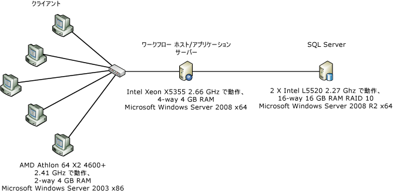  
  
 上の図は、コンポーネント レベルのパフォーマンス測定に使用するコンピューター構成を示しています。 1 台のサーバーと 5 台のクライアントを 1 つの 1 Gbps イーサネット ネットワーク インターフェイスで接続します。 測定を簡素化するため、サーバーは Windows Server 2008 x86 を実行するデュアル プロセッサ/クアッド コア サーバーの 1 つのコアを使用する構成にします。 システムの CPU 利用状況はほぼ 100% で推移します。  
  
### <a name="test-details"></a>テストの詳細  
 WF3 <xref:System.Workflow.Activities.CodeActivity> は WF3 ワークフローで使用可能な最も単純なアクティビティであると考えられます。  アクティビティは、ワークフローのプログラマがカスタム コードを配置できる分離コード内のメソッドを呼び出します。  WF4 には、同様の機能を提供する WF3 の <xref:System.Workflow.Activities.CodeActivity> に直接匹敵する機能はありません。  WF4 の <xref:System.Activities.CodeActivity> 基本クラスは WF3 の <xref:System.Workflow.Activities.CodeActivity> とは関連がありません。  ワークフロー作成者には、カスタム アクティビティを作成し、XAML のみのワークフローを構築することをお勧めします。  以下のテストでは、WF4 ワークフローで `Comment` という名前のアクティビティが空の <xref:System.Workflow.Activities.CodeActivity> の代わりに使用されます。  `Comment` アクティビティのコードを次に示します。  
  
```  
[ContentProperty("Body")]  
    public sealed class Comment : CodeActivity  
    {  
        public Comment()  
            : base()  
        {  
        }  
  
        [DefaultValue(null)]  
        public Activity Body  
        {  
            get;  
            set;  
        }  
  
        protected override void Execute(CodeActivityContext context)  
        {  
        }  
    }  
```  
  
### <a name="empty-workflow"></a>空のワークフロー  
 このテストでは、子アクティビティがないシーケンス ワークフローを使用します。  
  
### <a name="single-activity"></a>1 つのアクティビティ  
 ワークフローは子アクティビティを 1 つ含むシーケンス ワークフローです。  アクティビティは、WF3 の場合はコードなしの <xref:System.Workflow.Activities.CodeActivity>、WF4 の場合は `Comment` アクティビティです。  
  
### <a name="while-with-1000-iterations"></a>While の 1,000 回反復  
 このシーケンス ワークフローには 1 つの <xref:System.Activities.Statements.While> アクティビティが含まれ、ループ内に何も処理しない 1 つの子アクティビティを含みます。  
  
### <a name="replicator-compared-to-parallelforeach"></a>Replicator と ParallelForEach の比較  
 WF3 の <xref:System.Workflow.Activities.ReplicatorActivity> には順次実行モードと並列実行モードがあります。  順次モードのアクティビティのパフォーマンスは <xref:System.Workflow.Activities.WhileActivity> と同様です。  並列実行で特に便利なアクティビティは <xref:System.Workflow.Activities.ReplicatorActivity> です。  このアクティビティに類似した WF4 のアクティビティは <xref:System.Activities.Statements.ParallelForEach%601> です。  
  
 次の図は、このテストに使用するワークフローを示しています。 左側が WF3 ワークフロー、右側が WF4 ワークフローです。  
  
 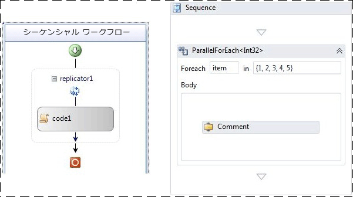  
  
### <a name="sequential-workflow-with-five-activities"></a>5 つのアクティビティがあるシーケンシャル ワークフロー  
 このテストは、複数のアクティビティを順番に実行した場合の効果を示すことを目的としています。  シーケンス内には 5 つのアクティビティがあります。  
  
### <a name="transaction-scope"></a>トランザクション スコープ  
 トランザクション スコープ テストはその他のテストと若干異なり、反復のたびに新しいワークフロー インスタンスを作成するのではなく、  ワークフローは処理のない 1 つのアクティビティを含む <xref:System.Activities.Statements.TransactionScope> アクティビティを含む while ループで構造化されます。  while ループで 50 回反復するバッチを 1 回実行するたびに 1 つの操作としてカウントされます。  
  
### <a name="compensation"></a>補正  
 WF3 ワークフローには `WorkScope` という名前の補正可能アクティビティが 1 つあります。  このアクティビティは単純に <xref:System.Workflow.ComponentModel.ICompensatableActivity> インターフェイスを実装します。  
  
```  
class WorkScope :   
        CompositeActivity, ICompensatableActivity  
    {  
        public WorkScope() : base() { }  
  
        public WorkScope(string name)  
        {  
            this.Name = name;  
        }  
  
        public ActivityExecutionStatus Compensate(  
            ActivityExecutionContext executionContext)  
        {  
            return ActivityExecutionStatus.Closed;  
        }  
    }  
```  
  
 エラー ハンドラーは `WorkScope` アクティビティをターゲットにします。WF4 ワークフローも同様に単純です。  <xref:System.Activities.Statements.CompensableActivity> には本文と補正ハンドラーがあります。  明示的な補正はシーケンスの次に来ます。  本文アクティビティと補正ハンドラー アクティビティはどちらも空の実装です。  
  
```  
public sealed class CompensableActivityEmptyCompensation : CodeActivity  
    {  
        public CompensableActivityEmptyCompensation()  
            : base() { }  
  
        public Activity Body { get; set; }  
  
        protected override void Execute(CodeActivityContext context) { }  
    }  
    public sealed class CompensableActivityEmptyBody : CodeActivity  
    {  
        public CompensableActivityEmptyBody()  
            : base() { }  
  
        public Activity Body { get; set; }  
  
        protected override void Execute(CodeActivityContext context) { }  
    }  
```  
  
 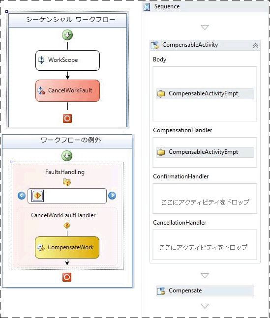  
  
 図 2 – WF3 (左) と WF4 (右) の基本的な補正ワークフロー  
  
### <a name="performance-test-results"></a>パフォーマンスのテスト結果  
 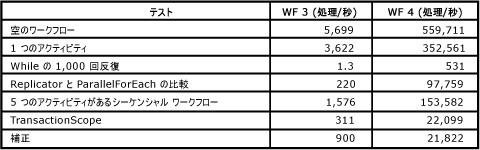  
  
 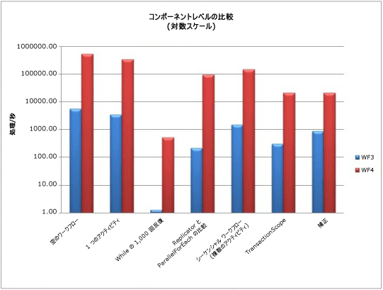  
  
 トランザクション スコープ テスト以外のすべてのテストは 1 秒あたりのワークフローで測定されます。  上で説明したように、[!INCLUDE[wf1](../../../includes/wf1-md.md)] ランタイムのパフォーマンスは全体的に向上しました。while ループのような同じアクティビティの複数の実行を必要とする分野では特に向上が顕著でした。  
  
## <a name="service-composition-scenario"></a>サービス構成シナリオ  
 前のセクション「コンポーネント レベルのパフォーマンス比較」で示すようには、WF3 と WF4 のオーバーヘッドが大幅に削減がありました。  [!INCLUDE[indigo2](../../../includes/indigo2-md.md)] ワークフロー サービスは手動でコーディングした [!INCLUDE[indigo2](../../../includes/indigo2-md.md)] サービスにほぼ匹敵するパフォーマンスを実現し、[!INCLUDE[wf1](../../../includes/wf1-md.md)] ランタイムのあらゆる利点を備えています。  このテスト シナリオでは、[!INCLUDE[indigo2](../../../includes/indigo2-md.md)] サービスと WF4 の [!INCLUDE[indigo2](../../../includes/indigo2-md.md)] ワークフロー サービスを比較します。  
  
### <a name="online-store-service"></a>オンライン ストア サービス  
 Windows Workflow Foundation の強みの 1 つは、いくつかのサービスを使用してプロセスを作成する機能です。  この例として、2 つのサービスの呼び出しを調整して発注するオンライン ストア サービスがあります。  まず、注文検証サービスを使用して注文を検証します。  次に、ウェアハウス サービスを使用して注文を受け付けます。  
  
 注文検証サービスとウェアハウス サービスの 2 つのバックエンド サービスは両方のテストで不変です。  変更する部分は、調整を行うオンライン ストア サービスです。  1 つのケースでは、サービスを [!INCLUDE[indigo2](../../../includes/indigo2-md.md)] サービスとして手動でコーディングします。  もう 1 つのケースでは、サービスを WF4 の [!INCLUDE[indigo2](../../../includes/indigo2-md.md)] ワークフロー サービスとして記述します。 追跡や永続化などの [!INCLUDE[wf1](../../../includes/wf1-md.md)] 固有の機能はこのテストでは無効にします。  
  
### <a name="environment"></a>環境  
   
  
 クライアントは複数のコンピューターから HTTP 経由でオンライン ストア サービスを要求します。  1 台のコンピューターで 3 つのサービスのすべてをホストします。  オンライン ストア サービスとバックエンド サービスの間にあるトランスポート層は TCP または HTTP です。  1 秒あたりの操作は、オンライン ストア サービスに対する `PurchaseOrder` の呼び出しが完了した件数に基づいて測定されます。  チャネル プールは WF4 で導入された新機能です。  このテスト チャネル プールの [!INCLUDE[indigo2](../../../includes/indigo2-md.md)] の部分は標準では提供されていないため、オンライン ストア サービスでは単純なプール手法の手動コーディングによる実装を使用しました。  
  
### <a name="performance"></a>パフォーマンス  
 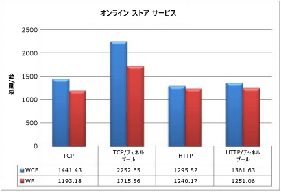  
  
 チャネル プールなしでバックエンド TCP サービスに接続した場合、[!INCLUDE[wf1](../../../includes/wf1-md.md)] サービスはスループットに 17.2% 影響します。  チャネル プールを使用した場合、スループットは 23.8% 低下します。  HTTP では影響ははるかに小さく、プールなしの場合で 4.3%、プールを使用した場合で 8.1% の影響があります。  HTTP を使用する場合はチャネル プールのメリットがきわめて少ないことも重要な点です。  
  
 このテストでは、手動でコーディングした [!INCLUDE[indigo2](../../../includes/indigo2-md.md)] サービスと比べると WF4 ランタイムにオーバーヘッドがありますが、これは最悪の場合のシナリオと考えることができます。  このテストの 2 つのバックエンド サービスはほとんど処理を行いません。  実際のエンド ツー エンドのシナリオでは、これらのサービスでデータベースの呼び出しなどの高負荷の操作を行うため、トランスポート層のパフォーマンスへの影響の重要性は低下します。  また、WF4 で提供されている機能の長所により、Workflow Foundation はオーケストレーション サービスの作成に有効な選択肢になります。  
  
## <a name="key-performance-considerations"></a>パフォーマンスに関する重要な考慮事項  
 WF4 では、このセクションの相互運用機能以外の機能分野は WF3 から大幅に変更されています。  この変更はワークフロー アプリケーションのデザインおよびパフォーマンスに影響します。  
  
#### <a name="workflow-activation-latency"></a>ワークフローのアクティブ化にかかる待機時間  
 [!INCLUDE[indigo2](../../../includes/indigo2-md.md)] ワークフロー サービス アプリケーションでは、ブロックが発生する可能性があるため、新規ワークフローの開始または既存ワークフローの読み込みにかかる待機時間は重要です。  このテスト ケースでは、一般的なシナリオで WF3 XOML ホストを WF4 XAMLX ホストと比較して測定します。  
  
##### <a name="environment-setup"></a>環境の設定  
 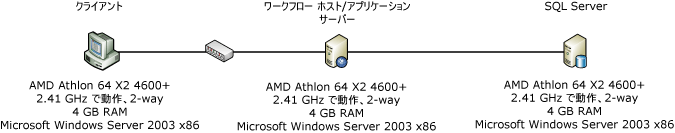  
  
##### <a name="test-setup"></a>テストの設定  
 このシナリオでは、クライアント コンピューターはコンテキスト ベースの相関関係を使用して [!INCLUDE[indigo2](../../../includes/indigo2-md.md)] ワークフロー サービスに接続します。  コンテキスト相関関係は特殊なコンテキスト バインドを必要とし、コンテキスト ヘッダーまたはクッキーを使用してメッセージを適切なワークフロー インスタンスに関連付けます。  相関 ID がメッセージ ヘッダーに存在するため、メッセージ本文を解析する必要がないというパフォーマンス上の利点があります。 [!INCLUDE[crabout](../../../includes/crabout-md.md)] コンテキスト相関関係を参照してください[コンテキスト交換の相関関係](../../../docs/framework/wcf/feature-details/context-exchange-correlation.md)  
  
 サービスは要求を行う新しいワークフローを作成し、ワークフローの実行にかかった時間が待機時間の測定に含まれないように、すぐに応答を送信します。  WF3 のワークフローは XOML と分離コードで構成され、WF4 のワークフローは全体が XAML で構成されます。  WF4 のワークフローは次のようになります。  
  
 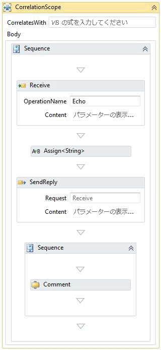  
  
 <xref:System.ServiceModel.Activities.Receive> アクティビティはワークフロー インスタンスを作成します。  受信メッセージに渡した値は応答メッセージにエコーされます。  応答の後のシーケンスにはワークフローの残りの部分が含まれます。  前の例では 1 つの Comment アクティビティのみを示しました。  ワークフローの複雑さをシミュレーションするには、Comment アクティビティの数を変更します。  comment アクティビティは何も処理しない WF3 の <xref:System.Workflow.Activities.CodeActivity> と同等です。 [!INCLUDE[crabout](../../../includes/crabout-md.md)] comment アクティビティでは、この記事の前半「コンポーネント レベルのパフォーマンス比較」を参照してください。  
  
##### <a name="test-results"></a>テスト結果  
 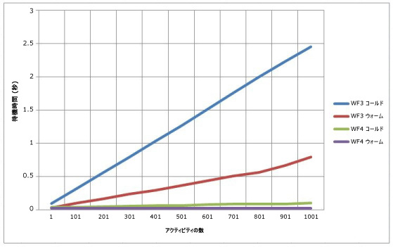  
  
 図 3 – WCF ワークフロー サービスのコールド待機時間とウォーム待機時間  
  
 上の図のコールドは、特定ワークフローに既存の <xref:System.ServiceModel.WorkflowServiceHost> が存在しない場合を示します。  つまり、コールド待機時間は、ワークフローが初めて使用され、XOML または XAML をコンパイルする必要がある場合の待機時間です。  ウォーム待機時間は、ワークフロー型が既にコンパイル済みの場合に新規ワークフロー インスタンスを作成する時間です。  WF4 ではワークフローの複雑さによって大きな差は生じませんが、WF3 ではワークフローの複雑さに応じて時間がかかります。  
  
#### <a name="correlation-throughput"></a>相関スループット  
 WF4 では新しいコンテンツ ベースの相関関係機能が導入されました。  WF3 ではコンテキスト ベースの相関関係のみが提供されていました。  コンテキスト ベースの相関関係は特定の [!INCLUDE[indigo2](../../../includes/indigo2-md.md)] チャネル バインドに対してのみ実行可能です。  チャネル バインドを使用する際に、ワークフロー ID がメッセージ ヘッダーに挿入されます。  WF3 ランタイムでは、ID 以外でワークフローを識別することはできません。コンテンツ ベースの相関関係と共に、ワークフローの作成者が関連する一部のアカウント番号や顧客 id。 のようなデータから相関関係キーを作成できます[!INCLUDE[crabout](../../../includes/crabout-md.md)]コンテンツ ベースの相関関係を参照してください[コンテンツ ベースの相関関係](../../../docs/framework/wcf/feature-details/content-based-correlation.md)です。  
  
 コンテキスト ベースの相関関係には、相関関係キーがメッセージ ヘッダーに存在するというパフォーマンス上の利点があります。  逆シリアル化やメッセージのコピーを行わずに相関関係キーをメッセージから読み取ることができます。  コンテンツ ベースの相関関係では、相関関係キーはメッセージ本文に格納されます。  キーの検索には XPath 式を使用します。  この余分な処理のコストは、メッセージのサイズ、本文のキーの深さ、キーの数によって決まります。  このテストでは、コンテキスト ベースの相関関係とコンテンツ ベースの相関関係を比較し、複数のキーを使用した場合のパフォーマンス低下を示します。  
  
#### <a name="environment-setup"></a>環境の設定  
   
  
#### <a name="test-setup"></a>テストの設定  
 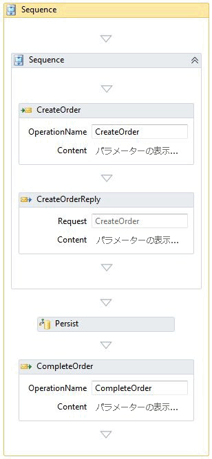  
  
 前に示したワークフローは、以下の「永続化」セクションで使用されているものと同じです。  永続化なしの相関関係テストでは、ランタイムに永続化プロバイダーがインストールされていません。  相関関係は CreateOrder と CompleteOrder の 2 か所で発生します。  
  
#### <a name="test-results"></a>テスト結果  
 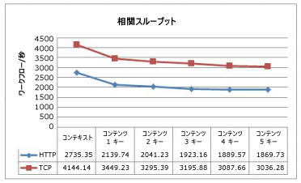  
  
 この図は、コンテンツ ベースの相関関係で使用するキーの数が増えた場合のパフォーマンスの低下を示しています。  TCP と HTTP の曲線の類似性は、これらのプロトコルに関連するオーバーヘッドを示しています。  
  
#### <a name="correlation-with-persistence"></a>永続化を伴う相関関係  
 永続化されたワークフローでは、コンテンツ ベースの相関関係からの CPU 圧迫はワークフロー ランタイムから SQL データベースに移行します。  SQL 永続化プロバイダー内のストアド プロシージャは、適切なワークフローを検索するためにキーの照合作業を実行します。  
  
 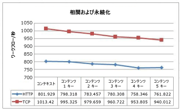  
  
 コンテキスト ベースの相関関係は、コンテンツ ベースの相関関係よりも高速です。  ただし、永続化の方が相関関係よりパフォーマンスへの影響が大きいため、違いはあまり顕著ではありません。  
  
### <a name="complex-workflow-throughput"></a>複合ワークフローのスループット  
 ワークフローの複雑さを測定する要素はアクティビティの数だけではありません。  複合アクティビティに複数の子が含まれ、その子も複合アクティビティである場合があります。  入れ子のレベルの数が増えるほど、現在実行中の状態になり得るアクティビティの数と変数の数も増えます。  このテストでは、複合ワークフローを実行する場合の WF3 と WF4 のスループットを比較します。  
  
### <a name="test-setup"></a>テストの設定  
 これらのテストは、4 GB の RAM を搭載した Intel Xeon X5355 @ 2.66 GHz 4 ウェイのコンピューターで Windows Server 2008 x64 を使用して実行されました。  テスト コードは、CPU 使用率が 100% に達するように、1 コアあたり 1 つのスレッドを使用する 1 つのプロセスで実行します。  
  
 このテスト用に生成されたワークフローには、各シーケンスのアクティビティの深さと数という 2 つの主な変数があります。  各深さレベルには Parallel アクティビティ、while ループ、判断、割り当て、シーケンスが含まれます。  下図の WF4 のデザイナーは、トップレベルのフローチャートを示しています。  各フローチャートのアクティビティはメイン フローチャートと相似しています。  深さがテストのパラメーターに制限されるこのワークフローを図示する場合、フラクタルを考慮すると役立つことがあります。  
  
 特定のテストのアクティビティの数は、1 シーケンスあたりのアクティビティの深さと数によって決まります。  WF4 のテストのアクティビティの数は、次の数式によって計算します。  
  
   
  
 WF3 のテストには追加シーケンスがあるため、アクティビティの数を計算する数式が多少異なります。  
  
   
  
 d は 1 シーケンスあたりのアクティビティの深さ、a は 1 シーケンスあたりのアクティビティの数を表します。  これらの数式では、最初の定数 × a はシーケンスの数を表し、2 番目の定数は現在のレベルのアクティビティの静的な数を表します。  各フローチャートに 3 つのフローチャート子アクティビティがあります。  ボトム レベルの深さのフローチャートは空で、それ以外のレベルにはメイン フローチャートのコピーがあります。  各テスト バリエーションのワークフロー定義内のアクティビティの数を次の表に示します。  
  
 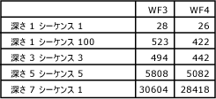  
  
 ワークフロー定義内のアクティビティの数は、各深さレベルに従って急激に増加します。  ただし、特定のワークフロー インスタンスで実行されるパスは判断ポイントごとに 1 つのみであるため、実際のアクティビティのごく小規模なサブセットのみが実行されます。  
  
 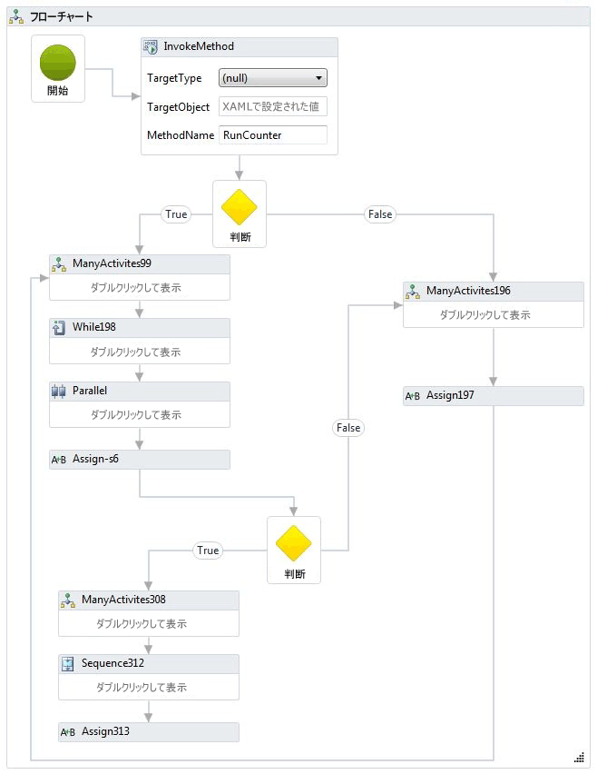  
  
 同等のワークフローが WF3 用にも作成されました。 WF3 デザイナーは入れ子ではなく、ワークフロー全体をデザイン領域に表示するので、このトピックの表示内容としては大きすぎます。 ワークフローのスニペットを以下に示します。  
  
 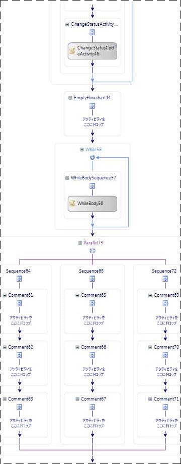  
  
 入れ子の極端なケースを実行するため、このテストの一部となるもう 1 つのワークフローでは 100 回入れ子になったシーケンスを使用します。  最も内側のシーケンスには 1 つの `Comment` または <xref:System.Workflow.Activities.CodeActivity> があります。  
  
 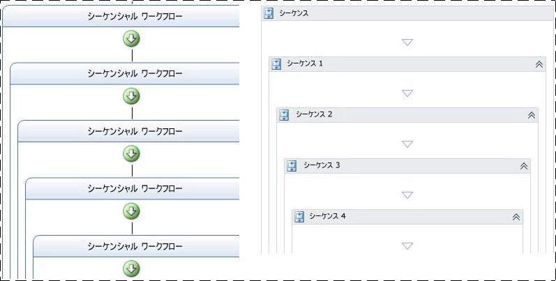  
  
 追跡および永続化はこのテストに含まれません。  
  
### <a name="test-results"></a>テスト結果  
 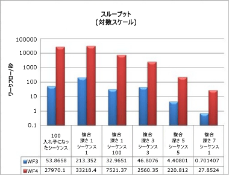  
  
 アクティビティの深さと数が多い複合ワークフローの場合でも、パフォーマンス結果は前述した他のスループット数値と整合しています。  WF4 のスループットは桁違いに高速なため、対数スケールで比較する必要があります。  
  
### <a name="memory"></a>メモリ  
 Windows Workflow Foundation のメモリ オーバーヘッドは、2 つの重要な要素であるワークフローの複雑さとワークフロー定義の数で測定されます。  メモリの測定は Windows 7 の 64 ビット ワークステーションで行われました。  ワーキング セット パフォーマンス カウンターを監視する、Environment.WorkingSet をポーリングまたはから VMMap などのツールを使用してなどの測定値を取得する方法はたくさんあります[VMMap](http://technet.microsoft.com/sysinternals/dd535533.aspx)です。 ここでは複数の方法を組み合わせて各テストの結果を取得し、検証しました。  
  
### <a name="workflow-complexity-test"></a>ワークフローの複雑さテスト  
 ワークフローの複雑さテストでは、ワークフローの複雑さに基づいてワーキング セットの違いを測定します。  前のセクションで使用した複合ワークフローの他に、1 つのアクティビティ ワークフローと 1,000 のアクティビティがあるシーケンスという 2 つの基本ケースを取り入れるための新しいバリエーションを追加します。  これらのテストでは、ワークフローを初期化し、1 分間の単一シリアル ループ内で完了するまで実行します。  各テスト バリエーションを 3 回実行し、その平均データを記録しました。  
  
 新しい 2 つの基本テストには次のようなワークフローがあります。  
  
 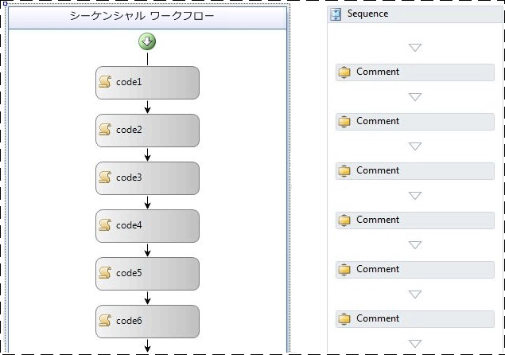  
  
 前の WF3 のワークフローでは、空の <xref:System.Workflow.Activities.CodeActivity> アクティビティを使用しています。  前の WF4 ワークフローでは `Comment` アクティビティを使用しています。  `Comment` アクティビティについては前の「コンポーネント レベルのパフォーマンス比較」で説明しました。  
  
 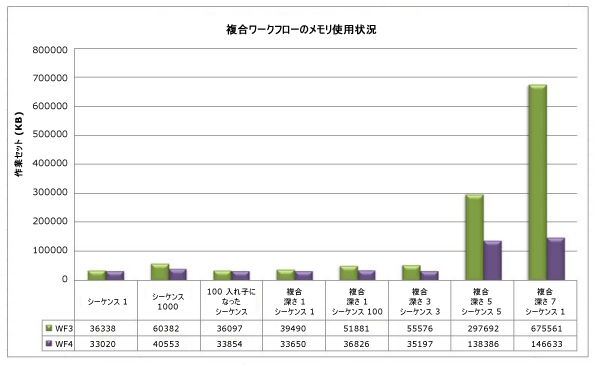  
  
 この図で注目すべき明白な傾向の 1 つは、WF3 および WF4 のいずれの場合も入れ子がメモリ使用量に与える影響が比較的小さいことです。  メモリに最も重大な影響をもたらす要因はワークフロー内のアクティビティの数です。  シーケンス 1,000、複合深さ 5 シーケンス 5、複合深さ 7 シーケンス 1 (バリエーションあり) の各データから、アクティビティの数が千単位になるとメモリ使用量の増加が顕著になることが明らかです。  最大 29 K のアクティビティが存在する極端なケース (深さ 7 シーケンス 1) では、WF4 のメモリ使用量は WF3 より約 79% 少なくなっています。  
  
### <a name="multiple-workflow-definitions-test"></a>複数のワークフロー定義のテスト  
 ワークフロー定義ごとのメモリの測定は、WF3 と WF4 でワークフローのホスティングに使用できるオプションが原因で 2 つの異なるテストに分かれています。  このテストでは、ワークフローの複雑さテストと異なり、指定されたワークフローのインスタンス化と実行を定義ごとに 1 回だけ行います。  これは、ワークフロー定義とそのホストは AppDomain の有効期間中はメモリ内に保持されるためです。  指定されたワークフロー インスタンスの実行によって使用されたメモリは、ガベージ コレクション中にクリーンアップする必要があります。  WF4 の移行ガイドラインに、ホスト オプションの詳細が記載されています。 [!INCLUDE[crdefault](../../../includes/crdefault-md.md)] [WF 移行のクックブック: ワークフロー ホスティング](http://go.microsoft.com/fwlink/?LinkID=153313)です。  
  
 ワークフロー定義テスト用に多数のワークフロー定義を作成するには、いくつかの方法があります。  たとえば、コード生成を使用して、名前以外は同一の 1,000 のワークフローを作成し、各ワークフローを個別のファイルに保存します。  この方法はコンソール ホストのテストで使用しました。  WF3 では、ワークフロー定義の実行に <xref:System.Workflow.Runtime.WorkflowRuntime> クラスを使用します。  WF4 は <xref:System.Activities.WorkflowApplication> を使用して単一ワークフローのインスタンスを作成するか、直接 <xref:System.Activities.WorkflowInvoker> を使用してアクティビティがメソッドに呼び出された場合のように実行できます。  <xref:System.Activities.WorkflowApplication> は単一ワークフローのインスタンスのホストで、<xref:System.Workflow.Runtime.WorkflowRuntime> に類似した機能を持つため、このテストで使用しました。  
  
 IIS でワークフローをホストする場合、<xref:System.Web.Hosting.VirtualPathProvider> を使用することで、すべての XAMLX または XOML ファイルを生成するのではなく、新しい <xref:System.ServiceModel.WorkflowServiceHost> を作成することができます。  <xref:System.Web.Hosting.VirtualPathProvider>受信要求を処理し、応答ファイルのある、"仮想"データベースから読み込まれたしたりできる、この場合、その場で生成します。  したがって、1,000 個の物理ファイルを作成する必要はありません。  
  
 コンソール テストで使用したワークフロー定義はアクティビティが 1 つの単純なシーケンシャル ワークフローです。  1 つのアクティビティは、WF3 の場合は空の <xref:System.Workflow.Activities.CodeActivity>、WF4 の場合は `Comment` アクティビティでした。  IIS でホストするケースでは、メッセージの受信で開始し、応答の送信で終了するワークフローを使用しました。  
  
 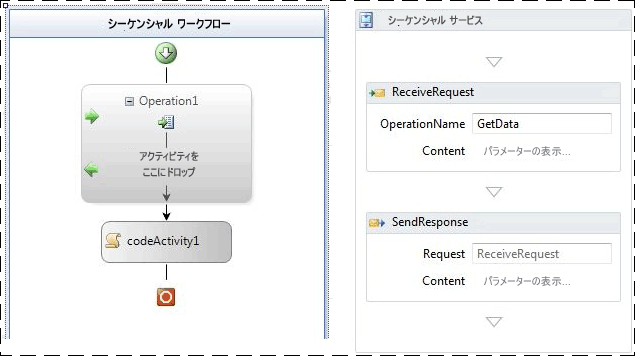  
  
 図 4 - ReceiveActivity を使用した WF3 ワークフローと要求/応答パターンを使用した WF4 ワークフロー  
  
 次の表に、1 つのワークフロー定義と 1,001 の定義との間のワーキング セットのデルタを示します。  
  
|ホスト オプション|WF3 のワーキング セット デルタ|WF4 のワーキング セット デルタ|  
|---------------------|---------------------------|---------------------------|  
|コンソール アプリケーションでホストされるワークフロー|18 MB|9 MB|  
|IIS でホストされるワークフロー サービス|446 MB|364 MB|  
  
 IIS のホスト ワークフロー定義の方がメモリ使用量がはるかに多いのは、<xref:System.ServiceModel.WorkflowServiceHost>、詳細な [!INCLUDE[indigo2](../../../includes/indigo2-md.md)] サービス成果物、およびホストに関連付けられているメッセージ処理ロジックが原因です。  
  
 WF3 のコンソール ホストでは、ワークフローは XOML ではなくコードで実装されています。  WF4 では既定で XAML を使用します。  XAML は埋め込みリソースとしてアセンブリに格納され、実行時にコンパイルされてワークフローの実装を提供します。  このプロセスにはある程度のオーバーヘッドが伴います。  WF3 と WF4 を公正に比較するため、XAML ではなくコード化されたワークフローを使用しました。  WF4 ワークフローの例を次に示します。  
  
```  
public class Workflow1 : Activity  
{  
    protected override Func<Activity> Implementation  
    {  
        get  
        {  
            return new Func<Activity>(() =>  
            {  
                return new Sequence  
                {  
                    Activities = {  
                        new Comment()  
                    }  
                };  
            });  
        }  
        set  
        {  
            base.Implementation = value;  
        }  
    }  
}  
```  
  
 その他にもメモリ消費量に影響を与えるさまざまな要因があります。 すべてのマネージ プログラムに対しても同じアドバイスが当てはまります。  IIS ホスト環境では、ワークフロー定義に対して作成された <xref:System.ServiceModel.WorkflowServiceHost> オブジェクトはアプリケーション プールがリサイクルされるまでメモリに保持されます。  拡張を書き込むときは、この点に注意してください。  また、「グローバル」変数 (ワークフロー全体をスコープの変数) を回避し、可能な限り、変数のスコープを制限することをお勧めします。  
  
## <a name="workflow-runtime-services"></a>ワークフロー ランタイムのサービス  
  
### <a name="persistence"></a>永続性  
 WF3 と WF4 には SQL 永続化プロバイダーが付属しています。  WF3 の SQL 永続化プロバイダーはワークフロー インスタンスをシリアル化して BLOB に格納する単純な実装です。  そのため、このプロバイダーのパフォーマンスはワークフロー インスタンスのサイズに大きく依存します。  WF3 では、前述したさまざまな理由からインスタンスのサイズは大きくなる可能性があります。  シリアル化されたインスタンスをデータベースに格納するとワークフローの状態を視認できないため、多くの場合に顧客は既定の SQL 永続化プロバイダーを使用しません。  ワークフロー ID が不明な場合、特定のワークフローを探すには、永続化された各インスタンスを逆シリアル化して内容を確認する必要があります。  多くの開発者は、この不都合を解消するために独自の永続化プロバイダーを作成することを選択します。  
  
 WF4 の SQL 永続化プロバイダーでは、この問題の一部に対処することを試みました。  永続化テーブルは、アクティブなブックマークや昇格可能なプロパティなどの一定の情報を公開します。  WF4 の新しいコンテンツ ベースの相関関係機能は WF3 の SQL 永続化手法では適切に機能せず、永続化されたワークフロー インスタンスの構成に変更が生じます。  これにより永続化プロバイダーの処理が複雑化し、データベースに余分な負荷がかかります。  
  
### <a name="environment-setup"></a>環境の設定  
   
  
### <a name="test-setup"></a>テストの設定  
 機能セットを向上させ、同時実行処理の設定を改善した場合でも、WF4 の SQL 永続化プロバイダーは WF3 のプロバイダーより高速です。  このことを示すため、WF3 と WF4 で同じ操作をする 2 つのワークフローの比較を次に示します。  
  
 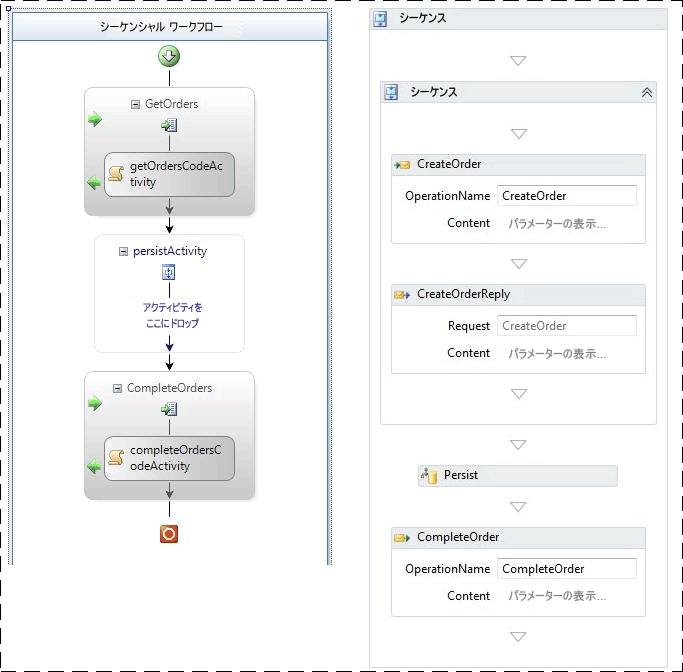  
  
 図 5 – WF3 の永続化ワークフロー (左側) と WF4 の永続化ワークフロー (右側)  
  
 2 つのワークフローは、いずれも受信したメッセージによって作成されます。  最初に応答を送信すると、ワークフローが永続化されます。  WF3 の場合は、空の <xref:System.Workflow.ComponentModel.TransactionScopeActivity> を使用して永続化を開始します。  同じは WF3 で「保持を閉じる」アクティビティとしてマークすることによって行うことも  2 番目の、関連付けられたメッセージによってワークフローを完了します。  ワークフローは永続化されますが、アンロードされません。  
  
### <a name="test-results"></a>テスト結果  
 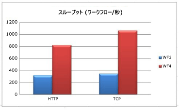  
  
 クライアントと中間層とのトランスポートが HTTP の場合、WF4 の永続化ではパフォーマンスが 2.6 倍向上し、  TCP トランスポートの場合では 3.0 倍向上しています。  いずれの場合も、中間層の CPU 使用率は 98% 以上です。  WF4 の方がスループットが高い理由はワークフロー ランタイムが高速であるためです。  シリアル化されたインスタンスのサイズはどちらの場合も小さく、ここでは大きな要因になりません。  
  
 このテストでは、WF3 と WF4 の両方のワークフローに、永続化するときを明示的に示すアクティビティを使用します。  この方法にはワークフローをアンロードせずに永続化できるという利点があります。  WF3 では <xref:System.ServiceModel.Activities.Description.WorkflowIdleBehavior.TimeToUnload%2A> 機能を使用して永続化することもできますが、この機能はワークフロー インスタンスをメモリからアンロードします。  WF3 では、特定の時点でワークフローが永続化されていることを確認する場合、ワークフロー定義を変更するか、ワークフロー インスタンスをアンロードして再読み込みする必要があります。  WF4 の新機能 <xref:System.ServiceModel.Activities.Description.WorkflowIdleBehavior.TimeToPersist%2A> を使用すると、アンロードせずに永続化することができます。  この機能ではワークフロー インスタンスをアイドル状態で永続化することが可能で、<xref:System.ServiceModel.Activities.Description.WorkflowIdleBehavior.TimeToUnload%2A> のしきい値に達するか、実行が再開されるまでワークフロー インスタンスがメモリに保持されます。  
  
 WF4 の SQL 永続化プロバイダーはデータベース層でより多くの作業を実行することに注意してください。  SQL データベースはボトルネックになる可能性があるため、CPU およびディスクの使用量を監視することが重要です。  ワークフロー アプリケーションのパフォーマンス テストを行う場合、必ず SQL データベースから次のパフォーマンス カウンターを含めてください。  
  
-   PhysicalDisk\\% のディスク読み取り時間  
  
-   PhysicalDisk\\ディスク時間の割合  
  
-   PhysicalDisk\\% のディスクの書き込み時間  
  
-   PhysicalDisk\\% の平均Disk Queue Length  
  
-   PhysicalDisk\Avg.Disk Read Queue Length  
  
-   PhysicalDisk\Avg.Disk Write Queue Length  
  
-   PhysicalDisk\Current Disk Queue Length  
  
-   プロセッサ情報\\プロセッサ時間の割合  
  
-   SQLServer:Latches\Average Latch Wait Time (ms)  
  
-   SQLServer:Latches\Latch Waits/sec  
  
### <a name="tracking"></a>追跡  
 ワークフロー追跡機能を使用して、ワークフローの進行状況を管理できます。  追跡イベントに含まれる情報は追跡プロファイルによって決まります。  追跡プロファイルが複雑になるほど、追跡の負荷が大きくなります。  
  
 WF3 には SQL ベースの追跡サービスが付属しています。  このサービスはバッチ モードと非バッチ モードで動作します。  非バッチ モードでは、イベントの追跡はデータベースに直接書き込まれます。  バッチ モードでは、追跡イベントは同じバッチ内にワークフロー インスタンスの状態として収集されます。  バッチ モードは多様なワークフロー デザインを高パフォーマンスで処理します。  ただし、ワークフローが永続化せずに多数のアクティビティを実行し、そのアクティビティを追跡する場合、バッチ処理によってパフォーマンスが低下する可能性があります。  このような状態は一般にループで発生するので、大規模なループに永続化ポイントを含めることが最善の回避策になります。  ループに永続化ポイントを導入することによってもパフォーマンスが低下する可能性があるので、両者のコストを測定してバランスを考慮することが重要です。  
  
 WF4 には SQL 追跡サービスは付属していません。  SQL データベースへの追跡情報の記録は [!INCLUDE[dnprdnshort](../../../includes/dnprdnshort-md.md)] に組み込むよりもアプリケーション サーバーから処理する方が適しているため、 SQL 追跡は AppFabric によって処理するようになりました。  WF4 の標準追跡プロバイダーは Event Tracing for Windows (ETW) に基づいています。  
  
 ETW は Windows に組み込まれた、カーネル レベルの待機時間が短いイベント システムです。  このシステムは、実際に使用したときにのみイベント追跡のコストが発生するようにすることが可能なプロバイダー/コンシューマー モデルを使用しています。  プロセッサ、ディスク、メモリ、ネットワーク使用量などのカーネル イベント以外にも、多くのアプリケーションが ETW を利用しています。  ETW イベントは、イベントをアプリケーションに応じてカスタマイズできるという点でパフォーマンス カウンターより高機能です。  イベントにワークフロー ID や情報メッセージなどのテキストを含めることができます。  また、すべてのイベントをキャプチャするより一定のイベントのサブセットを使用した方がパフォーマンスへの影響が少ないため、イベントはビットマスクを使用して分類されています。  
  
 追跡に SQL ではなく ETW を使用する方法には次の利点があります。  
  
-   追跡イベントの収集を別のプロセスに分離できます。  これによりイベントの記録方法の柔軟性が高まります。  
  
-   ETW の追跡イベントは [!INCLUDE[indigo2](../../../includes/indigo2-md.md)] ETW イベントまたは SQL Server やカーネル プロバイダーなどのその他の ETW プロバイダーと容易に組み合わせることができます。  
  
-   ワークフローの作成者は、WF3 の SQL 追跡サービスのバッチ モードなど、特定の追跡の実装を改良するためにワークフローを変更する必要がありません。  
  
-   管理者はホスト プロセスをリサイクルすることなく追跡をオンまたはオフにできます。  
  
 ETW による追跡にはパフォーマンス上の利点と同時に欠点もあります。  システムが極度のリソース圧迫にさらされると、ETW イベントは失われる可能性があります。  イベントの処理は通常のプログラムの実行をブロックすることを目的としていないため、すべての ETW イベントがサブスクライバーにブロードキャストされることは保証されません。  そのため、ETW 追跡は状態監視に適していますが、監査には適しません。  
  
 WF4 には SQL 追跡プロバイダーはありませんが、AppFabric に SQL 追跡プロバイダーがあります。  AppFabric の SQL 追跡では、クイック挿入用にイベントをバッチ処理して SQL テーブルに書き込む Windows サービスを使用して、ETW イベントに定期受信します。  別のジョブでこのテーブルからデータを排出し、形式を変更して AppFabric ダッシュボードに表示可能なレポート テーブルに格納します。  追跡イベントのバッチは元になるワークフローとは独立して処理されるため、永続化ポイントを待機せずに記録されます。  
  
 ETW イベントの記録には logman や xperf などのツールを使用できます。  小規模な ETL ファイルは xperfview などのツールで表示できます。または、tracerpt を使用して XML などのわかりやすい形式に変換することもできます。  WF3 では、SQL データベースなしで追跡イベントを取得する唯一の方法は、カスタム追跡サービスを作成することです。 [!INCLUDE[crabout](../../../includes/crabout-md.md)] ETW を参照してください[WCF サービスと Event Tracing for Windows](../../../docs/framework/wcf/samples/wcf-services-and-event-tracing-for-windows.md)と[Event Tracing for Windows](http://msdn.microsoft.com/library/ff190903.aspx\))です。  
  
 ワークフロー追跡を有効にした場合のパフォーマンスへの影響の程度はさまざまです。  次のベンチマークでは、logman ツールを使用し、ETW 追跡イベントを使用してそのイベントを ETL ファイルに記録します。  AppFabric の SQL 追跡のコストについてはこの記事の対象外です。  このベンチマークには AppFabric でも使用される基本的な追跡プロファイルが示されています。  状態監視イベントのみを追跡した場合のコストも含まれています。  これらのイベントは問題をトラブルシューティングし、システムの平均スループットを確認するために役立ちます。  
  
### <a name="environment-setup"></a>環境の設定  
   
  
### <a name="test-results"></a>テスト結果  
 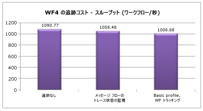  
  
 状態監視はスループットに約 3% の影響をもたらしています。  基本プロファイルのコストは約 8% です。  
  
## <a name="interop"></a>Interop  
 WF4 では [!INCLUDE[wf1](../../../includes/wf1-md.md)] をほぼ全面的に変更しているため、WF3 のワークフローおよびアクティビティは WF4 とは直接互換性がありません。  Windows Workflow Foundation を早期採用して多くのお客様には、WF3 の社内またはサード パーティ製のワークフロー定義とカスタム アクティビティがあります。  WF4 への移行を簡素化するには、Interop アクティビティを使用する方法があります。この方法により WF4 ワークフロー内から WF3 アクティビティを実行できます。  <xref:System.Activities.Statements.Interop> アクティビティは必要な場合にのみ使用することをお勧めします。 [!INCLUDE[crabout](../../../includes/crabout-md.md)] wf4 への移行、 [WF4 の移行のガイドライン](http://go.microsoft.com/fwlink/?LinkID=153313)です。  
  
### <a name="environment-setup"></a>環境の設定  
   
  
### <a name="test-results"></a>テスト結果  
 次の表に、シーケンスに 5 つのアクティビティを含むワークフローのさまざまな構成での実行結果を示します。  
  
|テスト|スループット (ワークフロー/秒)|  
|----------|-----------------------------------|  
|WF3 ランタイムの WF3 シーケンス|1,576|  
|Interop を使用した WF4 ランタイムの WF3 シーケンス|2,745|  
|WF4 シーケンス|153,582|  
  
 Interop を使用した場合の方が直接 WF3 を使用した場合よりパフォーマンスが顕著に高くなっていますが、  WF4 アクティビティと比較した場合、パフォーマンスの向上はごくわずかです。  
  
## <a name="summary"></a>まとめ  
 WF4 のパフォーマンスに対する多大な投資は多くの重要な面で成果をもたらしました。  個々のワークフロー コンポーネントのパフォーマンスは、[!INCLUDE[wf1](../../../includes/wf1-md.md)] ランタイムが効率的になることにより、WF4 が WF3 と比較して数百倍高速になる場合があります。  待機時間の数値も大幅に向上しています。  [!INCLUDE[wf1](../../../includes/wf1-md.md)] を使用することによる利点を考慮すると、手動コーディングの [!INCLUDE[indigo2](../../../includes/indigo2-md.md)] オーケストレーション サービスと比べて、[!INCLUDE[wf1](../../../includes/wf1-md.md)] を使用した場合のパフォーマンスの低下はごく些細です。  永続化のパフォーマンスは 2.5 ～ 3.0 倍向上しています。  ワークフロー追跡による状態監視のオーバーヘッドもごくわずかになりました。  WF3 から WF4 への移行を検討する場合の包括的な移行ガイドも提供されています。  これらのあらゆる要素を考慮すると、WF4 は複雑なアプリケーションの作成において魅力的な選択肢です。  
  
## <a name="acknowledgements"></a>謝辞  
 次の寄稿者および校閲者の方々のご協力に感謝します。  
  
-   Leon Welicki、Microsoft Corporation  
  
-   Ryszard Kwiecinski、Microsoft Corporation  
  
-   Emil Velinov、Microsoft Corporation  
  
-   Nate Talbert、Microsoft Corporation  
  
-   Bob Schmidt、Microsoft Corporation  
  
-   Stefan Batres、Microsoft Corporation
