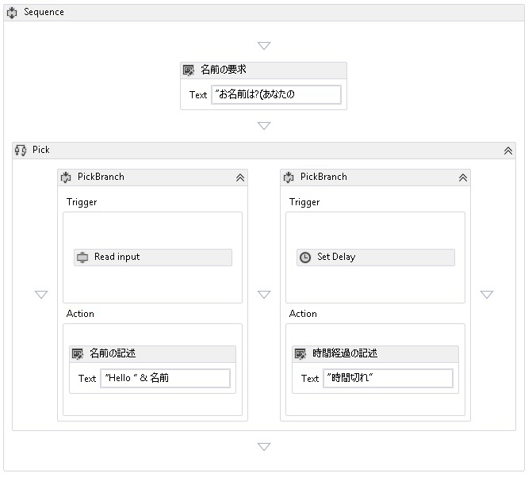

# <a name="pick-activity"></a><span data-ttu-id="971d3-102">Pick アクティビティ</span><span class="sxs-lookup"><span data-stu-id="971d3-102">Pick Activity</span></span>
<span data-ttu-id="971d3-103"><xref:System.Activities.Statements.Pick> アクティビティを使用すると、イベント トリガー セットとそれに続く対応するハンドラーのモデル化が単純になります。</span><span class="sxs-lookup"><span data-stu-id="971d3-103">The <xref:System.Activities.Statements.Pick> activity simplifies the modeling of a set of event triggers followed by their corresponding handlers.</span></span>  <span data-ttu-id="971d3-104"><xref:System.Activities.Statements.Pick> アクティビティには、<xref:System.Activities.Statements.PickBranch> アクティビティのコレクションが含まれます。各 <xref:System.Activities.Statements.PickBranch> は <xref:System.Activities.Statements.PickBranch.Trigger%2A> アクティビティと <xref:System.Activities.Statements.PickBranch.Action%2A> アクティビティの組み合わせです。</span><span class="sxs-lookup"><span data-stu-id="971d3-104">A <xref:System.Activities.Statements.Pick> activity contains a collection of <xref:System.Activities.Statements.PickBranch> activities, where each <xref:System.Activities.Statements.PickBranch> is a pairing between a <xref:System.Activities.Statements.PickBranch.Trigger%2A> activity and an <xref:System.Activities.Statements.PickBranch.Action%2A> activity.</span></span>  <span data-ttu-id="971d3-105">実行時に、すべての分岐のトリガーが並行して実行されます。</span><span class="sxs-lookup"><span data-stu-id="971d3-105">At execution time, the triggers for all branches are executed in parallel.</span></span>  <span data-ttu-id="971d3-106">1 つのトリガーが完了すると、対応するアクションが実行され、その他すべてのトリガーが取り消されます。</span><span class="sxs-lookup"><span data-stu-id="971d3-106">When one trigger completes, then its corresponding action is executed, and all other triggers are canceled.</span></span>  <span data-ttu-id="971d3-107">[!INCLUDE[netfx_current_short](../../../includes/netfx-current-short-md.md)] の <xref:System.Activities.Statements.Pick> アクティビティの動作は [!INCLUDE[netfx35_short](../../../includes/netfx35-short-md.md)] の <xref:System.Workflow.Activities.ListenActivity> アクティビティに似ています。</span><span class="sxs-lookup"><span data-stu-id="971d3-107">The behavior of the [!INCLUDE[netfx_current_short](../../../includes/netfx-current-short-md.md)]<xref:System.Activities.Statements.Pick> activity is similar to the [!INCLUDE[netfx35_short](../../../includes/netfx35-short-md.md)]<xref:System.Workflow.Activities.ListenActivity> activity.</span></span>  
  
 <span data-ttu-id="971d3-108">次の「[Pick アクティビティの使用](../../../docs/framework/windows-workflow-foundation/samples/using-the-pick-activity.md)」に含まれる SDK サンプルのスクリーンショットは、2 つの分岐がある Pick アクティビティを示しています。</span><span class="sxs-lookup"><span data-stu-id="971d3-108">The following screenshot from the [Using the Pick Activity](../../../docs/framework/windows-workflow-foundation/samples/using-the-pick-activity.md) SDK sample shows a Pick activity with two branches.</span></span>  <span data-ttu-id="971d3-109">1 つ目の分岐には **Read input** というトリガーがあります。これはコマンド ラインから入力を読み取るカスタム アクティビティです。</span><span class="sxs-lookup"><span data-stu-id="971d3-109">One branch has a trigger called **Read input**, a custom activity that reads input from the command line.</span></span> <span data-ttu-id="971d3-110">2 つ目の分岐には <xref:System.Activities.Statements.Delay> アクティビティ トリガーがあります。</span><span class="sxs-lookup"><span data-stu-id="971d3-110">The second branch has a <xref:System.Activities.Statements.Delay> activity trigger.</span></span> <span data-ttu-id="971d3-111">場合、 **Read input**アクティビティが受信する前にデータ、<xref:System.Activities.Statements.Delay>アクティビティが終了したら、<xref:System.Activities.Statements.Delay>遅延がキャンセルされ、応答メッセージは、コンソールに書き込まれます。</span><span class="sxs-lookup"><span data-stu-id="971d3-111">If the **Read input** activity receives data before the <xref:System.Activities.Statements.Delay> activity finishes, <xref:System.Activities.Statements.Delay> Delay will be canceled and a greeting will be written to the console.</span></span>  <span data-ttu-id="971d3-112">それ以外の場合、**Read input** が割り当て時間内にデータを受信しないときは、アクティビティは取り消され、タイムアウト メッセージがコンソールに書き込まれます。</span><span class="sxs-lookup"><span data-stu-id="971d3-112">Otherwise, if the **Read input** activity does not receive data in the allotted time, then it will be canceled and a timeout message will be written to the console.</span></span>  <span data-ttu-id="971d3-113">これは、任意のアクションにタイムアウトを追加するために使用される一般的なパターンです。</span><span class="sxs-lookup"><span data-stu-id="971d3-113">This is a common pattern used to add a timeout to any action.</span></span>  
  
 <span data-ttu-id="971d3-114"></span><span class="sxs-lookup"><span data-stu-id="971d3-114"></span></span>  
  
## <a name="best-practices"></a><span data-ttu-id="971d3-115">ベスト プラクティス</span><span class="sxs-lookup"><span data-stu-id="971d3-115">Best practices</span></span>  
 <span data-ttu-id="971d3-116">Pick を使用する場合、実行する分岐は、トリガーが最初に完了する分岐です。</span><span class="sxs-lookup"><span data-stu-id="971d3-116">When using Pick, the branch that executes is the branch whose trigger completes first.</span></span>  <span data-ttu-id="971d3-117">概念的には、すべてのトリガーは並行して実行され、1 つのトリガーがロジックの大部分を実行してから、他のトリガーが完了したために実行が取り消されることがあります。</span><span class="sxs-lookup"><span data-stu-id="971d3-117">Conceptually, all triggers execute in parallel, and one trigger may have executed the majority of its logic before it is canceled by the completion of another trigger.</span></span>  <span data-ttu-id="971d3-118">この点に留意すると、Pick アクティビティを使用する場合に従う一般的なガイドラインは、トリガーを単一のイベントの代表として扱い、できるだけ少ないロジックを含めることです。</span><span class="sxs-lookup"><span data-stu-id="971d3-118">With this in mind, a general guideline to follow when using the Pick activity is to treat the trigger as representing a single event, and to put as little logic as possible into it.</span></span>  <span data-ttu-id="971d3-119">理想的には、トリガーにはイベントを受信するために必要なロジックのみを含め、そのイベントのすべての処理を分岐のアクションに含めます。</span><span class="sxs-lookup"><span data-stu-id="971d3-119">Ideally, the trigger should contain just enough logic to receive an event, and all the processing of that event should go into the action of the branch.</span></span>  <span data-ttu-id="971d3-120">この方法で、トリガーの実行の重複を最小限に抑えることができます。</span><span class="sxs-lookup"><span data-stu-id="971d3-120">This method minimizes the amount of overlap between the execution of the triggers.</span></span>  <span data-ttu-id="971d3-121">たとえば、2 つのトリガーを含む <xref:System.Activities.Statements.Pick> があるとします。各トリガーには <xref:System.ServiceModel.Activities.Receive> アクティビティとそれに続いて追加のロジックが含まれます。</span><span class="sxs-lookup"><span data-stu-id="971d3-121">For example, consider a <xref:System.Activities.Statements.Pick> with two triggers, where each trigger contains a <xref:System.ServiceModel.Activities.Receive> activity followed by additional logic.</span></span>  <span data-ttu-id="971d3-122">追加のロジックによってアイドル ポイントが発生する場合、両方の <xref:System.ServiceModel.Activities.Receive> は正常に完了する可能性があります。</span><span class="sxs-lookup"><span data-stu-id="971d3-122">If the additional logic introduces an idle point, then there is the possibility of both <xref:System.ServiceModel.Activities.Receive> activities completing successfully.</span></span>  <span data-ttu-id="971d3-123">1 つのトリガーが完全に完了し、もう 1 つのトリガーは部分的に完了します。</span><span class="sxs-lookup"><span data-stu-id="971d3-123">One trigger will fully complete, while another will partially complete.</span></span>  <span data-ttu-id="971d3-124">一部のシナリオでは、メッセージを受け入れてから、その処理を部分的に完了することは許容されません。</span><span class="sxs-lookup"><span data-stu-id="971d3-124">In some scenarios, accepting a message, and then partially completing the processing of it is unacceptable.</span></span>  <span data-ttu-id="971d3-125">したがって、<xref:System.ServiceModel.Activities.Receive> や <xref:System.ServiceModel.Activities.SendReply> など、WF のビルトイン メッセージング アクティビティを使用する場合、一般的には <xref:System.ServiceModel.Activities.Receive> がトリガーに使用されますが、可能な限り <xref:System.ServiceModel.Activities.SendReply> や他のロジックをアクションに含める必要があります。</span><span class="sxs-lookup"><span data-stu-id="971d3-125">Therefore, when using WF built-in messaging activities such as <xref:System.ServiceModel.Activities.Receive> and <xref:System.ServiceModel.Activities.SendReply>, while <xref:System.ServiceModel.Activities.Receive> is commonly used in the trigger, <xref:System.ServiceModel.Activities.SendReply> and other logic should be put in the action whenever possible.</span></span>  
  
## <a name="using-the-pick-activity-in-the-designer"></a><span data-ttu-id="971d3-126">デザイナーでの Pick アクティビティの使用</span><span class="sxs-lookup"><span data-stu-id="971d3-126">Using the Pick activity in the designer</span></span>  
 <span data-ttu-id="971d3-127">デザイナーで Pick を使用するには、ツールボックスで **[Pick]** と **[PickBranch]** を見つけます。</span><span class="sxs-lookup"><span data-stu-id="971d3-127">To use Pick in the designer, find **Pick** and **PickBranch** in the toolbox.</span></span>  <span data-ttu-id="971d3-128">**[Pick]** をキャンバスにドラッグ アンド ドロップします。</span><span class="sxs-lookup"><span data-stu-id="971d3-128">Drag and drop **Pick** onto the canvas.</span></span>  <span data-ttu-id="971d3-129">既定では、デザイナーに新しく追加された **Pick** アクティビティには 2 つの分岐があります。</span><span class="sxs-lookup"><span data-stu-id="971d3-129">By default, a new **Pick** Activity in the designer will contain two branches.</span></span>  <span data-ttu-id="971d3-130">新しい分岐を追加するには、**PickBranch** アクティビティを既存の分岐の横にドラッグ アンド ドロップします。</span><span class="sxs-lookup"><span data-stu-id="971d3-130">To add additional branches, drag the **PickBranch** activity and drop it next to existing branches.</span></span> <span data-ttu-id="971d3-131">アクティビティは、任意の **PickBranch** の **[Trigger]** 領域または **[Action]** 領域の **Pick** アクティビティにドロップできます。</span><span class="sxs-lookup"><span data-stu-id="971d3-131">Activities can be dropped onto the **Pick** Activity into either the **Trigger** area or the **Action** area of any **PickBranch**.</span></span>  
  
## <a name="using-the-pick-activity-in-code"></a><span data-ttu-id="971d3-132">コードでの Pick アクティビティの使用</span><span class="sxs-lookup"><span data-stu-id="971d3-132">Using the Pick Activity in code</span></span>  
 <span data-ttu-id="971d3-133"><xref:System.Activities.Statements.Pick> アクティビティを使用するには、<xref:System.Activities.Statements.Pick.Branches%2A> アクティビティで <xref:System.Activities.Statements.PickBranch> コレクションを設定します。</span><span class="sxs-lookup"><span data-stu-id="971d3-133">The <xref:System.Activities.Statements.Pick> activity is used by populating its <xref:System.Activities.Statements.Pick.Branches%2A> collection with <xref:System.Activities.Statements.PickBranch> activities.</span></span> <span data-ttu-id="971d3-134"><xref:System.Activities.Statements.PickBranch> アクティビティには、それぞれ <xref:System.Activities.Statements.PickBranch.Trigger%2A> 型の <xref:System.Activities.Activity> プロパティがあります。</span><span class="sxs-lookup"><span data-stu-id="971d3-134">The <xref:System.Activities.Statements.PickBranch> activities each have a <xref:System.Activities.Statements.PickBranch.Trigger%2A> property of type <xref:System.Activities.Activity>.</span></span> <span data-ttu-id="971d3-135">指定したアクティビティの実行が完了すると、<xref:System.Activities.Statements.PickBranch.Action%2A> が実行されます。</span><span class="sxs-lookup"><span data-stu-id="971d3-135">When the specified activity completes execution, the <xref:System.Activities.Statements.PickBranch.Action%2A> executes.</span></span>  
  
 <span data-ttu-id="971d3-136">次のコードは、<xref:System.Activities.Statements.Pick> アクティビティを使用して、コンソールからの入力を読み取るアクティビティのタイムアウトを実装する方法の例です。</span><span class="sxs-lookup"><span data-stu-id="971d3-136">The following code example demonstrates how to use a <xref:System.Activities.Statements.Pick> activity to implement a timeout for an activity that reads a line from the console.</span></span>  
  
```csharp  
Sequence body = new Sequence()  
{  
    Variables = { name },  
    Activities =   
   {  
       new System.Activities.Statements.Pick  
        {  
           Branches =   
           {  
               new PickBranch  
               {  
                   Trigger = new ReadLine  
                   {  
                      Result = name,  
                      BookmarkName = "name"  
                   },  
                   Action = new WriteLine   
                   {   
                       Text = ExpressionServices.Convert<string>(ctx => "Hello " +   
                           name.Get(ctx))   
                   }  
               },  
               new PickBranch  
               {  
                   Trigger = new Delay  
                   {  
                      Duration = new TimeSpan(0, 0, 5)  
                   },  
                   Action = new WriteLine  
                   {  
                      Text = "Time is up."  
                   }  
               }  
           }  
       }  
   }  
};  
```  
  
```xaml  
<Sequence xmlns="http://schemas.microsoft.com/netfx/2009/xaml/activities" xmlns:x="http://schemas.microsoft.com/winfx/2006/xaml">  
  <Sequence.Variables>  
    <Variable x:TypeArguments="x:String" Name="username" />  
  </Sequence.Variables>  
  <Pick>  
    <PickBranch>  
      <PickBranch.Trigger>  
        <ReadLine BookmarkName="name" Result="username" />  
      </PickBranch.Trigger>  
      <WriteLine>[String.Concat("Hello ", username)]</WriteLine>  
    </PickBranch>  
    <PickBranch>  
      <PickBranch.Trigger>  
        <Delay>00:00:05</Delay>  
      </PickBranch.Trigger>  
      <WriteLine>Time is up.</WriteLine>  
    </PickBranch>  
  </Pick>  
</Sequence>  
```
