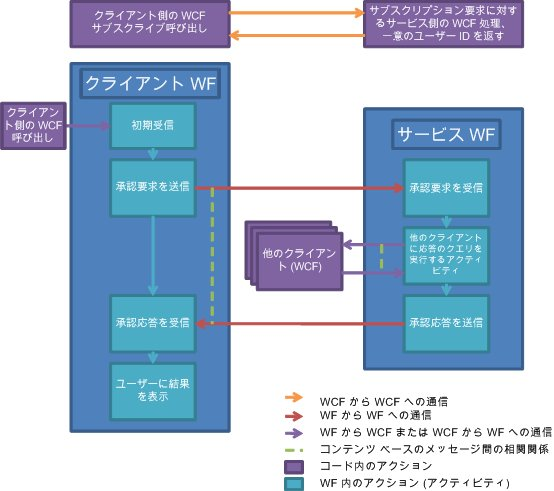

# ドキュメント承認プロセス
このサンプルでは、同時に多くの Windows Workflow Foundation (WF) や Windows Communication Foundation (WCF) の機能の使用を示します。 ドキュメント承認プロセスのシナリオを実装する方法を示します。 クライアント アプリケーションでは、承認の必要なドキュメントを送信したり、ドキュメントを承認したりすることができます。 クライアント間の通信を促進したり承認プロセスのルールを適用したりするための承認マネージャー アプリケーションも用意されています。 この承認プロセスは、複数の種類の承認を実行できるワークフローで、 単一承認、定足数承認 (承認者全体のパーセンテージ)、および複合承認 (定足数承認と単一承認のシーケンスから成る承認) を得るためのアクティビティが用意されています。  
  
> [!IMPORTANT]
>  サンプルは、既にコンピューターにインストールされている場合があります。 続行する前に、次の (既定の) ディレクトリを確認してください。  
>   
>  `<InstallDrive>:\WF_WCF_Samples`  
>   
>  このディレクトリが存在しない場合に、 [Windows Communication Foundation (WCF) および .NET Framework 4 向けの Windows Workflow Foundation (WF) サンプル](http://go.microsoft.com/fwlink/?LinkId=150780)すべて Windows Communication Foundation (WCF) をダウンロードして[!INCLUDE[wf1](../../../../includes/wf1-md.md)]サンプルです。 このサンプルは、次のディレクトリに格納されます。  
>   
>  `<InstallDrive>:\WF_WCF_Samples\WF\Application\DocumentApprovalProcess`  
  
## サンプルの詳細  
 次の図は、ドキュメント承認プロセスのワークフローを表しています。  
  
   
  
 クライアントから見た場合、承認プロセスは次のように機能します。  
  
1.  クライアントが承認プロセス システムに定期受信します。  
  
2.  WCF クライアントは、承認マネージャー アプリケーションによってホストされる WCF サービスに送信します。  
  
3.  一意のユーザー ID がクライアントに返されます。 これで、クライアントが承認プロセスに参加できるようになります。  
  
4.  プロセスに参加したクライアントは、単一、定足数、または複合の承認プロセスを使用して、承認の必要なドキュメントを送信できます。  
  
5.  クライアントのインターフェイスにあるボタンをクリックすると、クライアントのワークフロー サービス ホストでワークフロー インスタンスが開始されます。  
  
6.  ワークフローが承認マネージャー アプリケーションに承認要求を送信します。  
  
7.  ワークフロー マネージャーの側でも、承認プロセスを表すワークフローが開始されます。  
  
8.  マネージャーの承認ワークフローが実行されると、結果がクライアントに返されます。  
  
9. 結果がクライアントに表示されます。  
  
10. クライアントは、いつでも承認要求を受信してその要求に応答できます。  
  
11. クライアントでホストされる WCF サービスは、承認マネージャー アプリケーションから承認要求を受信できます。  
  
12. ドキュメントの情報がレビューのためにクライアントに表示されます。  
  
13. ユーザーは、そのドキュメントを承認することも却下することもできます。  
  
14. WCF クライアントを使用すると、承認マネージャー アプリケーションへの承認応答を送信します。  
  
 承認マネージャー アプリケーションから見た場合、承認プロセスは次のように機能します。  
  
1.  クライアントが承認プロセス システムへの参加を要求します。  
  
2.  承認マネージャーの WCF サービスは、承認プロセス システムの一部として要求を受信します。  
  
3.  クライアントに対して一意の ID が生成され、 ユーザー情報がデータベースに格納されます。  
  
4.  一意の ID がユーザーに返されます。  
  
5.  承認要求が受信されます。 承認マネージャーが承認プロセスを実行します。  
  
6.  承認要求が承認マネージャーによって受信されると、新しいワークフローが開始されます。  
  
7.  要求の種類 (単一、定足数、または複合) に応じて異なるアクティビティが実行されます。  
  
8.  相関関係を持つ Send アクティビティと Receive アクティビティを使用して、承認要求がレビューのためにクライアントに送信され、応答が受信されます。  
  
9. 承認プロセス ワークフローの結果がクライアントに送信されます。  
  
## サンプルの使用  
  
##### データベースを設定するには  
  
1.  管理者特権で開いた [!INCLUDE[vs2010](../../../../includes/vs2010-md.md)] コマンド プロンプトから、この DocumentApprovalProcess フォルダーへ移動して、Setup.cmd を実行します。  
  
##### アプリケーションを設定するには  
  
1.  [!INCLUDE[vs2010](../../../../includes/vs2010-md.md)] を使用して、DocumentApprovalProcess.sln ソリューション ファイルを開きます。  
  
2.  ソリューションをビルドするには、Ctrl キーと Shift キーを押しながら B キーを押します。  
  
3.  実行するには、ソリューションで ApprovalManager プロジェクトを右クリックして、承認マネージャー アプリケーションを起動して、**ソリューション エクスプ ローラー**をクリックすると、**デバッグ**->**開始**右クリック メニューから新しいインスタンス。  
  
     準備完了のメッセージが表示されるまで待ちます。  
  
##### 単一承認のシナリオを実行するには  
  
1.  管理者のアクセス許可を使用してコマンド プロンプトを開きます。  
  
2.  ソリューションが含まれているディレクトリに移動します。  
  
3.  ApprovalClient\Bin\Debug フォルダーに移動して、ApprovalClient.exe のインスタンスを 2 つ実行します。  
  
4.  をクリックして**検出**、まで待ってから、**サブスクライブ**ボタンが有効にします。  
  
5.  ユーザー名を入力し、をクリックして**サブスクライブ**です。 一方のクライアントに対しては "`UserType1`" を使用し、もう一方のクライアントに対しては "`UserType2`" を使用します。  
  
6.  `UserType1` クライアントで、ドロップ ダウン メニューから単一承認を選択し、ドキュメントの名前と内容を入力します。 をクリックして**要求の承認**です。  
  
7.  `UserType2` クライアントに承認待ちのドキュメントが表示されます。 選択し、**承認**または**拒否**です。 `UserType1` クライアントに結果が表示されます。  
  
##### 定足数承認のシナリオを実行するには  
  
1.  管理者のアクセス許可を使用してコマンド プロンプトを開きます。  
  
2.  ソリューションが含まれているディレクトリに移動します。  
  
3.  ApprovalClient\Bin\Debug フォルダーに移動して、ApprovalClient.exe のインスタンスを 3 つ実行します。  
  
4.  をクリックして**検出**、まで待ってから、**サブスクライブ**ボタンが有効にします。  
  
5.  ユーザー名を入力し、をクリックして**サブスクライブ**です。 1 つのクライアントに対しては "`UserType1`" を使用し、残りの 2 つのクライアントに対しては "`UserType2`" を使用します。  
  
6.  `UserType1` クライアントで、ドロップ ダウン メニューから定足数承認を選択し、ドキュメントの名前と内容を入力します。 をクリックして**要求の承認**です。 これにより、2 つの `UserType2` クライアントが、ドキュメントを承認または却下するように要求されます。 両方の `UserType2` クライアントが応答する必要がありますが、いずれか一方のクライアントが承認すればドキュメントは承認されます。  
  
7.  2 つの `UserType2` クライアントに承認待ちのドキュメントが表示されます。 選択し、**承認**または**拒否**です。 `UserType1` クライアントに結果が表示されます。  
  
##### 複合承認のシナリオを実行するには  
  
1.  管理者のアクセス許可を使用してコマンド プロンプトを開きます。  
  
2.  ソリューションが含まれているディレクトリに移動します。  
  
3.  ApprovalClient\Bin\Debug フォルダーに移動して、ApprovalClient.exe のインスタンスを 4 つ実行します。  
  
4.  をクリックして**検出**、まで待ってから、**サブスクライブ**ボタンが有効にします。  
  
5.  ユーザー名を入力し、をクリックして**サブスクライブ**です。 1 つのクライアントに対して "`UserType1`" を、2 つのクライアントに対して "`UserType2`" を、最後のクライアントに対して "`UserType3`" を使用します。  
  
6.  `UserType1` クライアントで、ドロップ ダウン メニューから単一承認を選択し、ドキュメントの名前と内容を入力します。 をクリックして**要求の承認**です。  
  
7.  2 つの `UserType2` クライアントに承認待ちのドキュメントが表示されます。 選択し、**承認**にドキュメントを渡す、`UserType3`クライアント。  
  
     ドキュメントは、最初の `UserType2` クライアントの定足数によって承認されると `UserType3` クライアントに渡されます。  
  
8.  `UserType3` クライアントでドキュメントを承認または却下します。 `UserType1` クライアントに結果が表示されます。  
  
##### クリーンアップするには  
  
1.  [!INCLUDE[vs2010](../../../../includes/vs2010-md.md)] コマンド プロンプトで、DocumentApprovalProcess フォルダーに移動して Cleanup.cmd を実行します。