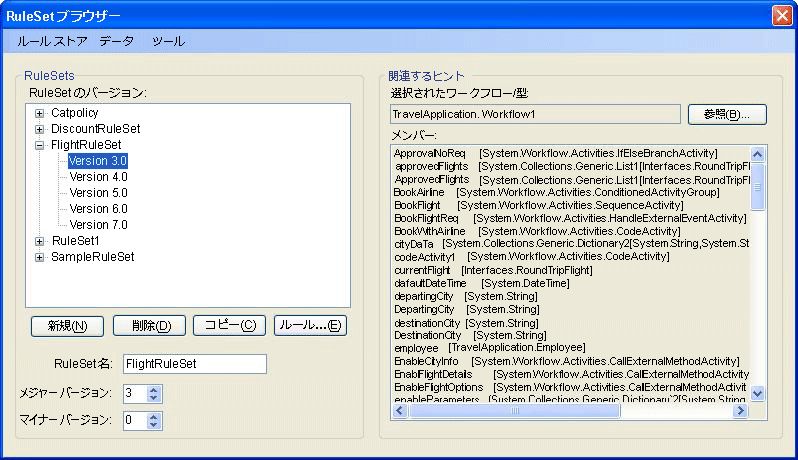
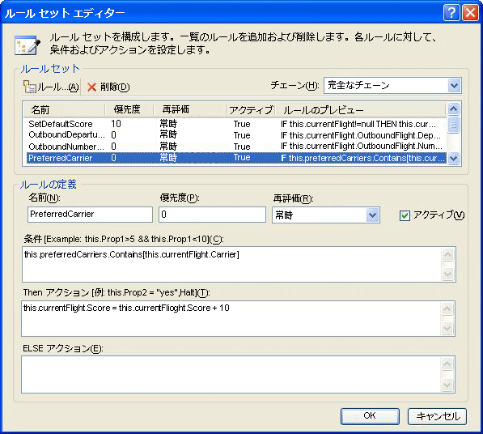
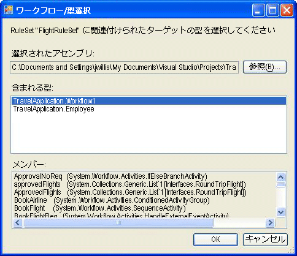
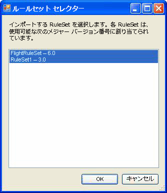

# <a name="external-ruleset-toolkit"></a><span data-ttu-id="ea191-102">External RuleSet Toolkit</span><span class="sxs-lookup"><span data-stu-id="ea191-102">External Ruleset Toolkit</span></span>
<span data-ttu-id="ea191-103">通常、ワークフロー アプリケーション内でルールが使用される場合は、そのルールはアセンブリの一部です。</span><span class="sxs-lookup"><span data-stu-id="ea191-103">Normally when rules are used within a workflow application, the rules are part of the assembly.</span></span> <span data-ttu-id="ea191-104">場合によっては、ワークフロー アセンブリのリビルドや配置を行わずに RuleSet を更新できるように、RuleSet をアセンブリとは別に管理することもあります。</span><span class="sxs-lookup"><span data-stu-id="ea191-104">In some scenarios, you may want to maintain the RuleSets separately from the assembly so that they can be updated without rebuilding and deploying the workflow assembly.</span></span> <span data-ttu-id="ea191-105">このサンプルでは、RuleSet をデータベース内で管理および編集し、実行時にそれらの RuleSet にワークフローからアクセスできるようにしています。</span><span class="sxs-lookup"><span data-stu-id="ea191-105">This sample allows you to manage and edit RuleSets in a database and access those RuleSets from a workflow at runtime.</span></span> <span data-ttu-id="ea191-106">その結果、実行中のワークフロー インスタンスに、RuleSet への変更を自動的に組み込むことができます。</span><span class="sxs-lookup"><span data-stu-id="ea191-106">This enables running workflow instances to automatically incorporate RuleSet changes.</span></span>  
  
 <span data-ttu-id="ea191-107">この External RuleSet Toolkit サンプルには、RuleSet のバージョンをデータベース内で管理および編集するために使用できる Windows フォーム ベースのツールが含まれています。</span><span class="sxs-lookup"><span data-stu-id="ea191-107">The External RuleSet Toolkit sample contains a Windows Forms-based tool that you can use to manage and edit RuleSet versions in a database.</span></span> <span data-ttu-id="ea191-108">また、このようなルールを実行するためのアクティビティとホスト サービスも含まれます。</span><span class="sxs-lookup"><span data-stu-id="ea191-108">It also includes an activity and a host service for executing those rules.</span></span>  
  
> [!NOTE]
>  <span data-ttu-id="ea191-109">このサンプルが必要です[Microsoft SQL Server](http://go.microsoft.com/fwlink/?LinkId=96181)です。</span><span class="sxs-lookup"><span data-stu-id="ea191-109">This sample requires [Microsoft SQL Server](http://go.microsoft.com/fwlink/?LinkId=96181).</span></span>  
  
 [!INCLUDE[vsprvsext](../../../../includes/vsprvsext-md.md)]<span data-ttu-id="ea191-110"> には、Windows WF (Workflow Foundation) の一部として RuleSet エディタが用意されています。</span><span class="sxs-lookup"><span data-stu-id="ea191-110"> provides a RuleSet editor as part of the Windows Workflow Foundation (WF).</span></span> <span data-ttu-id="ea191-111">このエディタは、ワークフロー内の `Policy` アクティビティをダブルクリックすると起動できます。これにより、定義済みの RuleSet オブジェクトが、ワークフローに関連付けられている .rules ファイルにシリアル化されます (`Policy` アクティビティにより、ワークフローに対して RuleSet インスタンスが実行されます)。</span><span class="sxs-lookup"><span data-stu-id="ea191-111">You can start this editor by double-clicking the `Policy` activity in a workflow; it serializes the defined RuleSet object to the .rules file associated with the workflow (a `Policy` activity runs a RuleSet instance against the workflow).</span></span> <span data-ttu-id="ea191-112">.rules ファイルは、ワークフロー プロジェクトをビルドするときに、リソースとしてアセンブリにコンパイルされます。</span><span class="sxs-lookup"><span data-stu-id="ea191-112">The .rules file is compiled into the assembly as a resource when you build the workflow project.</span></span>  
  
 <span data-ttu-id="ea191-113">このサンプルは、次のコンポーネントで構成されています。</span><span class="sxs-lookup"><span data-stu-id="ea191-113">The components of this sample include:</span></span>  
  
-   <span data-ttu-id="ea191-114">RuleSet のバージョンをデータベース内で編集および管理するために使用できる RuleSet グラフィカル ユーザー インターフェイス ツール。</span><span class="sxs-lookup"><span data-stu-id="ea191-114">A RuleSet graphical user interface tool that you can use to edit and manage RuleSet versions in the database.</span></span>  
  
-   <span data-ttu-id="ea191-115">ホスト アプリケーション上で構成され、データベースから RuleSet にアクセスする RuleSet サービス。</span><span class="sxs-lookup"><span data-stu-id="ea191-115">A RuleSet service that is configured on the host application and accesses RuleSets from the database.</span></span>  
  
-   <span data-ttu-id="ea191-116">RuleSet サービスから RuleSet を要求し、その RuleSet をワークフローに対して実行する `ExternalPolicy` アクティビティ。</span><span class="sxs-lookup"><span data-stu-id="ea191-116">An `ExternalPolicy` activity that requests a RuleSet from the RuleSet service and runs the RuleSet against the workflow.</span></span>  
  
 <span data-ttu-id="ea191-117">これらのコンポーネントの相互関係を図 1 に示します。</span><span class="sxs-lookup"><span data-stu-id="ea191-117">The interaction of the components is shown in Figure 1.</span></span> <span data-ttu-id="ea191-118">図の後で各コンポーネントについて説明します。</span><span class="sxs-lookup"><span data-stu-id="ea191-118">The sections that follow describe each component.</span></span>  
  
 <span data-ttu-id="ea191-119"></span><span class="sxs-lookup"><span data-stu-id="ea191-119"></span></span>  
  
 <span data-ttu-id="ea191-120">図 1: サンプルの概要</span><span class="sxs-lookup"><span data-stu-id="ea191-120">Figure 1: Sample Overview</span></span>  
  
> [!IMPORTANT]
>  <span data-ttu-id="ea191-121">サンプルは、既にコンピューターにインストールされている場合があります。</span><span class="sxs-lookup"><span data-stu-id="ea191-121">The samples may already be installed on your machine.</span></span> <span data-ttu-id="ea191-122">続行する前に、次の (既定の) ディレクトリを確認してください。</span><span class="sxs-lookup"><span data-stu-id="ea191-122">Check for the following (default) directory before continuing.</span></span>  
>   
>  `<InstallDrive>:\WF_WCF_Samples`  
>   
>  <span data-ttu-id="ea191-123">このディレクトリが存在しない場合は、「 [.NET Framework 4 向けの Windows Communication Foundation (WCF) および Windows Workflow Foundation (WF) のサンプル](http://go.microsoft.com/fwlink/?LinkId=150780) 」にアクセスして、 [!INCLUDE[indigo1](../../../../includes/indigo1-md.md)] および [!INCLUDE[wf1](../../../../includes/wf1-md.md)] のサンプルをすべてダウンロードしてください。</span><span class="sxs-lookup"><span data-stu-id="ea191-123">If this directory does not exist, go to [Windows Communication Foundation (WCF) and Windows Workflow Foundation (WF) Samples for .NET Framework 4](http://go.microsoft.com/fwlink/?LinkId=150780) to download all [!INCLUDE[indigo1](../../../../includes/indigo1-md.md)] and [!INCLUDE[wf1](../../../../includes/wf1-md.md)] samples.</span></span> <span data-ttu-id="ea191-124">このサンプルは、次のディレクトリに格納されます。</span><span class="sxs-lookup"><span data-stu-id="ea191-124">This sample is located in the following directory.</span></span>  
>   
>  `<InstallDrive>:\WF_WCF_Samples\WF\Scenario\ExternalRuleSetToolKit`  
  
## <a name="ruleset-tool"></a><span data-ttu-id="ea191-125">RuleSet ツール</span><span class="sxs-lookup"><span data-stu-id="ea191-125">RuleSet Tool</span></span>  
 <span data-ttu-id="ea191-126">RuleSet ツールのスクリーンショットを図 2 に示します。</span><span class="sxs-lookup"><span data-stu-id="ea191-126">A screen shot of the RuleSet tool is shown in Figure 2.</span></span> <span data-ttu-id="ea191-127">**ルール ストア**] メニューの [使用可能な Ruleset をデータベースから読み込むし、変更済みの Ruleset をストアに保存することができます。</span><span class="sxs-lookup"><span data-stu-id="ea191-127">From the **Rule Store** menu, you can load the available RuleSets from the database and save modified RuleSets back to the store.</span></span> <span data-ttu-id="ea191-128">RuleSet データベースのデータベース接続文字列は、アプリケーション構成ファイルで指定されます。</span><span class="sxs-lookup"><span data-stu-id="ea191-128">An application configuration file provides a database connection string for the RuleSet database.</span></span> <span data-ttu-id="ea191-129">ツールを起動すると、構成済みのデータベースから自動的に RuleSet が読み込まれます。</span><span class="sxs-lookup"><span data-stu-id="ea191-129">When you start the tool, it automatically loads the RuleSets from the configured database.</span></span>  
  
 <span data-ttu-id="ea191-130"></span><span class="sxs-lookup"><span data-stu-id="ea191-130"></span></span>  
  
 <span data-ttu-id="ea191-131">図 2: RuleSet ブラウザ</span><span class="sxs-lookup"><span data-stu-id="ea191-131">Figure 2: RuleSet Browser</span></span>  
  
 <span data-ttu-id="ea191-132">RuleSet ツールでは、RuleSet にメジャー バージョン番号とマイナー バージョン番号を割り当てます。これにより、複数のバージョンを同時に管理および保存できます (ツールには、バージョン管理機能以外に、ロックなどの構成管理機能は用意されていません)。</span><span class="sxs-lookup"><span data-stu-id="ea191-132">The RuleSet tool applies major and minor version numbers to the RuleSets, allowing you to simultaneously maintain and store multiple versions (the tool provides no locking or other configuration management features in addition to the versioning capability).</span></span> <span data-ttu-id="ea191-133">このツールを使用して、新しいバージョンの RuleSet を作成したり、既存のバージョンを削除したりできます。</span><span class="sxs-lookup"><span data-stu-id="ea191-133">Using the tool, you can create new RuleSet versions or delete existing versions.</span></span> <span data-ttu-id="ea191-134">クリックすると、**新規**ツールは、新しいルール セット名を作成し、バージョン 1.0 を適用します。</span><span class="sxs-lookup"><span data-stu-id="ea191-134">When you click **New**, the tool creates a new RuleSet name and applies version 1.0.</span></span> <span data-ttu-id="ea191-135">バージョンをコピーすると、含まれているルールを含め、選択した RuleSet バージョンのコピーが作成されて、新しい一意のバージョン番号が割り当てられます。</span><span class="sxs-lookup"><span data-stu-id="ea191-135">When you copy a version, the tool creates a copy of the selected RuleSet version, including the contained rules, and assigns new, unique version numbers.</span></span> <span data-ttu-id="ea191-136">これらのバージョン番号は、既存の RuleSet のバージョン番号を基に割り当てられます。</span><span class="sxs-lookup"><span data-stu-id="ea191-136">These version numbers are based on the version numbers of existing RuleSets.</span></span> <span data-ttu-id="ea191-137">RuleSet 名とバージョン番号は、フォーム上の対応するフィールドを使用して変更できます。</span><span class="sxs-lookup"><span data-stu-id="ea191-137">You can change the RuleSet name and version numbers using the associated fields on the form.</span></span>  
  
 <span data-ttu-id="ea191-138">クリックすると、**規則の編集**図 3 に示すように、RuleSet エディタが起動します。</span><span class="sxs-lookup"><span data-stu-id="ea191-138">When you click **Edit Rules**, the RuleSet editor starts, as shown in Figure 3.</span></span>  
  
 <span data-ttu-id="ea191-139"></span><span class="sxs-lookup"><span data-stu-id="ea191-139"></span></span>  
  
 <span data-ttu-id="ea191-140">図 3: RuleSet エディタ</span><span class="sxs-lookup"><span data-stu-id="ea191-140">Figure 3: RuleSet Editor</span></span>  
  
 <span data-ttu-id="ea191-141">これは、Windows Workflow Foundation [!INCLUDE[vsprvs](../../../../includes/vsprvs-md.md)] アドインの一部であるエディタ ダイアログのホストを変更したものです。</span><span class="sxs-lookup"><span data-stu-id="ea191-141">This is a re-hosting of the editor dialog that is part of the Windows Workflow Foundation [!INCLUDE[vsprvs](../../../../includes/vsprvs-md.md)] add-in.</span></span> <span data-ttu-id="ea191-142">そのため、Intellisense サポートを含めて、同等の機能が用意されています。</span><span class="sxs-lookup"><span data-stu-id="ea191-142">It provides the same functionality, including Intellisense support.</span></span> <span data-ttu-id="ea191-143">ツール内で RuleSet に関連付けられているターゲットの種類 (ワークフローなど) に対して作成されるため、ルールクリックすると**参照**ツールのメイン ダイアログ ボックスで、 **Workflow/type Selector**図 4 に示すように、ダイアログが表示されます。</span><span class="sxs-lookup"><span data-stu-id="ea191-143">The rules are authored against a target type (such as a workflow) that is associated with the RuleSet in the tool; when you click **Browse** in the main tool dialog, the **Workflow/Type Selector** dialog appears, as shown in Figure 4.</span></span>  
  
 <span data-ttu-id="ea191-144"></span><span class="sxs-lookup"><span data-stu-id="ea191-144"></span></span>  
  
 <span data-ttu-id="ea191-145">図 4: UI-Workflow/Type Selector</span><span class="sxs-lookup"><span data-stu-id="ea191-145">Figure 4: Workflow/Type Selector</span></span>  
  
 <span data-ttu-id="ea191-146">使用することができます、 **Workflow/type Selector**アセンブリとそのアセンブリ内の特定の型を指定するためのダイアログ。</span><span class="sxs-lookup"><span data-stu-id="ea191-146">You can use the **Workflow/Type Selector** dialog to specify an assembly and a specific type within that assembly.</span></span> <span data-ttu-id="ea191-147">ルールの作成 (および実行) は、この型に対して行います。</span><span class="sxs-lookup"><span data-stu-id="ea191-147">This type is the target type against which the rules are authored (and run).</span></span> <span data-ttu-id="ea191-148">多くの場合、対象となる型は、ワークフロー型または他の任意のアクティビティ型です。</span><span class="sxs-lookup"><span data-stu-id="ea191-148">In many cases, the target type is a workflow or some other activity type.</span></span> <span data-ttu-id="ea191-149">ただし、RuleSet は任意の .NET 型に対して実行できます。</span><span class="sxs-lookup"><span data-stu-id="ea191-149">However, you can run a RuleSet against any .NET type.</span></span>  
  
 <span data-ttu-id="ea191-150">アセンブリ ファイルと、型へのパス`name are stored with the`では、データベースで RuleSet ように RuleSet をデータベースから取得するときにツールをしようとするターゲットの種類を自動的に読み込みます。</span><span class="sxs-lookup"><span data-stu-id="ea191-150">The path to the assembly file and the type `name are stored with the` RuleSet in the database, so that when the RuleSet is retrieved from the database, the tool attempts to automatically load the target type.</span></span>  
  
 <span data-ttu-id="ea191-151">クリックすると**OK**で、 **Workflow/type Selector**ダイアログ ボックスで、対象の型が、ルールによって参照されるすべてのメンバーを持つようにするため、ルール セットに対して選択した種類を検証します。</span><span class="sxs-lookup"><span data-stu-id="ea191-151">When you click **OK** in the **Workflow/Type Selector** dialog, it validates the selected type against the RuleSet, to ensure that the target type has all the members referenced by the rules.</span></span> <span data-ttu-id="ea191-152">エラーが表示されます、**妥当性確認エラー**ダイアログ (図 5 を参照してください)。</span><span class="sxs-lookup"><span data-stu-id="ea191-152">Errors are shown in a **Validation Errors** dialog (see Figure 5).</span></span> <span data-ttu-id="ea191-153">エラーに関係なく変更を続行するかをクリックすることもできます**キャンセル**です。</span><span class="sxs-lookup"><span data-stu-id="ea191-153">You can choose to continue with the change despite the errors, or click **Cancel**.</span></span> <span data-ttu-id="ea191-154">**ツール**ツールのメイン ダイアログで、メニューをクリックして**検証**対象アクティビティに対して RuleSet のバージョンを再検証します。</span><span class="sxs-lookup"><span data-stu-id="ea191-154">From the **Tools** menu in the main tool dialog, you can click **Validate** to re-validate the RuleSet version against the target activity.</span></span>  
  
 <span data-ttu-id="ea191-155"></span><span class="sxs-lookup"><span data-stu-id="ea191-155"></span></span>  
  
 <span data-ttu-id="ea191-156">図 5: Validation Errors</span><span class="sxs-lookup"><span data-stu-id="ea191-156">Figure 5: Validation Errors</span></span>  
  
 <span data-ttu-id="ea191-157">**データ** メニューのツールには、インポートおよび Ruleset をエクスポートすることができます。</span><span class="sxs-lookup"><span data-stu-id="ea191-157">From the **Data** menu in the tool, you can import and export RuleSets.</span></span> <span data-ttu-id="ea191-158">クリックすると、**インポート**ファイルの選択ダイアログが表示されたら、.rules ファイルを選択できます。</span><span class="sxs-lookup"><span data-stu-id="ea191-158">When you click **Import**, a file-chooser dialog appears, from which you can select a .rules file.</span></span> <span data-ttu-id="ea191-159">このファイルが [!INCLUDE[vsprvs](../../../../includes/vsprvs-md.md)] で最初に作成されているかどうかはわかりません。</span><span class="sxs-lookup"><span data-stu-id="ea191-159">This may or may not be a file initially created in [!INCLUDE[vsprvs](../../../../includes/vsprvs-md.md)].</span></span> <span data-ttu-id="ea191-160">.rules ファイルは、条件のコレクションと RuleSet のコレクションを含む、シリアル化された `RuleDefinitions` インスタンスを保持します。</span><span class="sxs-lookup"><span data-stu-id="ea191-160">The .rules file should contain a serialized `RuleDefinitions` instance that contains a collection of conditions and a collection of RuleSets.</span></span> <span data-ttu-id="ea191-161">このツールでは条件のコレクションは使用されませんが、`RuleDefinitions` 環境とのやり取りのために [!INCLUDE[vsprvs](../../../../includes/vsprvs-md.md)] .rules 形式が使用されます。</span><span class="sxs-lookup"><span data-stu-id="ea191-161">The tool does not use the conditions collection, but it does use the `RuleDefinitions` .rules format to allow interaction with the [!INCLUDE[vsprvs](../../../../includes/vsprvs-md.md)] environment.</span></span>  
  
 <span data-ttu-id="ea191-162">.Rules ファイルを選択した後、 **RuleSet Selector** (図 6 を参照してください) ダイアログが表示されます。</span><span class="sxs-lookup"><span data-stu-id="ea191-162">After selecting a .rules file, a **RuleSet Selector** dialog appears (see Figure 6).</span></span> <span data-ttu-id="ea191-163">このダイアログ ボックスを使用して、インポートするファイルから RuleSet を選択できます (既定では、すべての RuleSet が指定されます)。</span><span class="sxs-lookup"><span data-stu-id="ea191-163">You can use the dialog to select the RuleSets from the file that you want to import (the default specifies all RuleSets).</span></span> <span data-ttu-id="ea191-164">WF プロジェクト内の RuleSet のバージョンはアセンブリのバージョンと同じであるため、.rules ファイル内の RuleSet にはバージョン番号がありません。</span><span class="sxs-lookup"><span data-stu-id="ea191-164">RuleSets in the .rules file do not have version numbers, because their versioning within a WF project is the same as the version of the assembly.</span></span> <span data-ttu-id="ea191-165">インポート処理中に、ツールを自動的に割り当てます、次へ 使用可能なメジャー バージョン番号 (これはインポート後に変更できます)。割り当てられたバージョン番号を確認することができます、 **RuleSet Selector**  ボックスの一覧です。</span><span class="sxs-lookup"><span data-stu-id="ea191-165">During the importing process, the tool automatically assigns the next available major version number (which you can change after importing); you can see the assigned version numbers in the **RuleSet Selector** list.</span></span>  
  
 <span data-ttu-id="ea191-166">ツールでは、インポートする RuleSet ごとに、RuleSet で使用されるメンバに基づいて、.rules ファイルの場所の下に bin\Debug フォルダー (存在する場合) から関連付けられている型が検索されます。</span><span class="sxs-lookup"><span data-stu-id="ea191-166">For each RuleSet it imports, the tool attempts to locate the associated type from the bin\Debug folder under the location of the .rules file (if it exists), based on the members used in the RuleSet.</span></span> <span data-ttu-id="ea191-167">一致する型が複数見つかった場合は、.rules ファイル名と型名の対応関係に基づいて型が選択されます (たとえば、`Workflow1` 型は Workflow1.rules に対応します)。</span><span class="sxs-lookup"><span data-stu-id="ea191-167">If the tool finds multiple matching types, it attempts to choose a type based on a match between the .rules file name and the type name (for example, the `Workflow1` type corresponds to Workflow1.rules).</span></span> <span data-ttu-id="ea191-168">対応関係が複数存在する場合は、型を選択するように求められます。</span><span class="sxs-lookup"><span data-stu-id="ea191-168">If multiple matches exist, you are prompted to select the type.</span></span> <span data-ttu-id="ea191-169">かどうかには、この自動識別機構が一致するアセンブリまたは型の検索に失敗しをクリックしてインポートした後**参照**ツールのメイン ダイアログに関連付けられている型に移動します。</span><span class="sxs-lookup"><span data-stu-id="ea191-169">If this auto-identification mechanism fails to locate a matching assembly or type, then after importing you can click **Browse** on the main tool dialog to navigate to the associated type.</span></span>  
  
 <span data-ttu-id="ea191-170"></span><span class="sxs-lookup"><span data-stu-id="ea191-170"></span></span>  
  
 <span data-ttu-id="ea191-171">図 6: RuleSet Selector</span><span class="sxs-lookup"><span data-stu-id="ea191-171">Figure 6: RuleSet Selector</span></span>  
  
 <span data-ttu-id="ea191-172">クリックすると、**データ エクスポート**ツールのメイン メニューから、 **RuleSet Selector**ダイアログが再度表示されます、エクスポートする必要がありますをデータベースから Ruleset を判断できます。</span><span class="sxs-lookup"><span data-stu-id="ea191-172">When you click **Data-Export** from the main tool menu, the **RuleSet Selector** dialog appears again, from which you can determine the RuleSets from the database that should be exported.</span></span> <span data-ttu-id="ea191-173">クリックすると、 **OK**、**ファイルを保存**ダイアログが表示されたら、エクスポートした .rules ファイルの場所と名前を指定できます。</span><span class="sxs-lookup"><span data-stu-id="ea191-173">When you click **OK**, a **Save File** dialog appears, in which you can specify the name and location of the resulting .rules file.</span></span> <span data-ttu-id="ea191-174">.rules ファイルではバージョン情報が保持されないため、特定の RuleSet 名を持つ RuleSet バージョンを 1 つだけ選択することができます。</span><span class="sxs-lookup"><span data-stu-id="ea191-174">Because the .rules file does not contain version information, you can only select one RuleSet version with a given RuleSet name.</span></span>  
  
## <a name="policyfromservice-activity"></a><span data-ttu-id="ea191-175">PolicyFromService アクティビティ</span><span class="sxs-lookup"><span data-stu-id="ea191-175">PolicyFromService Activity</span></span>  
 <span data-ttu-id="ea191-176">`PolicyFromService` アクティビティのコードは単純です。</span><span class="sxs-lookup"><span data-stu-id="ea191-176">The code for the `PolicyFromService` activity is straightforward.</span></span> <span data-ttu-id="ea191-177">このコードの動作は、WF で提供される `Policy` アクティビティによく似ていますが、.rules ファイルから対象の RuleSet を取得するのではなく、ホスト サービスを呼び出して RuleSet のインスタンスを取得します。</span><span class="sxs-lookup"><span data-stu-id="ea191-177">It works much like the `Policy` activity provided with WF, but instead of retrieving the target RuleSet from the .rules file, it calls a host service to obtain the RuleSet instance.</span></span> <span data-ttu-id="ea191-178">その後、ルートのワークフロー アクティビティ インスタンスに対して RuleSet を実行します。</span><span class="sxs-lookup"><span data-stu-id="ea191-178">It then runs the RuleSet against the root workflow activity instance.</span></span>  
  
 <span data-ttu-id="ea191-179">ワークフロー内でこのアクティビティを使用するには、ワークフロー プロジェクトから `PolicyActivities` アセンブリおよび `RuleSetService` アセンブリへの参照を追加します。</span><span class="sxs-lookup"><span data-stu-id="ea191-179">To use the activity in a workflow, add a reference to the `PolicyActivities` and `RuleSetService` assemblies from your workflow project.</span></span> <span data-ttu-id="ea191-180">ツールボックスにアクティビティを追加する方法については、このトピックの最後にある手順を参照してください。</span><span class="sxs-lookup"><span data-stu-id="ea191-180">See the procedure at the end of this topic for a discussion of how to add the activity to the toolbox.</span></span>  
  
 <span data-ttu-id="ea191-181">ワークフロー内にアクティビティを配置したら、実行する RuleSet の名前を指定する必要があります。</span><span class="sxs-lookup"><span data-stu-id="ea191-181">After placing the activity in your workflow, you must provide the name of the RuleSet to be run.</span></span> <span data-ttu-id="ea191-182">この名前は、リテラル値として入力することも、他のアクティビティのワークフロー変数やプロパティにバインドすることもできます。</span><span class="sxs-lookup"><span data-stu-id="ea191-182">You can enter the name as a literal value, or bind to a workflow variable or property of another activity.</span></span> <span data-ttu-id="ea191-183">必要に応じて、実行する特定の RuleSet のバージョン番号を入力できます。</span><span class="sxs-lookup"><span data-stu-id="ea191-183">Optionally, you can enter version numbers for the specific RuleSet that should be run.</span></span> <span data-ttu-id="ea191-184">メジャー バージョン番号とマイナー バージョン番号を既定値の 0 のままにしておくと、データベース内の最新のバージョン番号が自動的にアクティビティに指定されます。</span><span class="sxs-lookup"><span data-stu-id="ea191-184">If you leave the default value of 0 for the major and minor version numbers, the latest version number in the database is automatically provided for the activity.</span></span>  
  
## <a name="ruleset-service"></a><span data-ttu-id="ea191-185">ルールセット サービス</span><span class="sxs-lookup"><span data-stu-id="ea191-185">RuleSet Service</span></span>  
 <span data-ttu-id="ea191-186">このサービスには、指定された RuleSet のバージョンをデータベースから取得し、呼び出し元のアクティビティに返す役割があります。</span><span class="sxs-lookup"><span data-stu-id="ea191-186">The service is responsible for retrieving the specified RuleSet version from the database and returning it to the calling activity.</span></span> <span data-ttu-id="ea191-187">既に説明したように、`GetRuleSet` の呼び出しで渡されるメジャー バージョンとマイナー バージョンの値がどちらも 0 の場合は、最新のバージョンが取得されます。</span><span class="sxs-lookup"><span data-stu-id="ea191-187">As previously discussed, if the major and minor version values passed in the `GetRuleSet` call are both 0, the service retrieves the latest version.</span></span> <span data-ttu-id="ea191-188">現時点では、RuleSet の定義と RuleSet インスタンスはキャッシュされず、RuleSet のバージョンに "配置済み" というマークを付けて実行中の RuleSet と区別する機能もありません。</span><span class="sxs-lookup"><span data-stu-id="ea191-188">At this point, there is no caching of RuleSet definitions or instances; similarly, there are no features for marking RuleSet versions as "deployed" to differentiate them from in-progress RuleSets.</span></span>  
  
 <span data-ttu-id="ea191-189">サービスからアクセスされるデータベースは、アプリケーション構成ファイルを使用してホストで構成する必要があります。</span><span class="sxs-lookup"><span data-stu-id="ea191-189">The database to be accessed by the service should be configured on the host using an application configuration file.</span></span>  
  
#### <a name="to-run-the-tool"></a><span data-ttu-id="ea191-190">ツールを実行するには</span><span class="sxs-lookup"><span data-stu-id="ea191-190">To run the tool</span></span>  
  
1.  <span data-ttu-id="ea191-191">ツールとサービスで使用される RuleSet テーブルを設定するフォルダには Setup.sql ファイルがあります。</span><span class="sxs-lookup"><span data-stu-id="ea191-191">The folder that sets up the RuleSet table used by the tool and the service contains a Setup.sql file.</span></span> <span data-ttu-id="ea191-192">Setup.cmd バッチ ファイルを実行して SQL Express 上に Rules データベースを作成して RuleSet テーブルを設定します。</span><span class="sxs-lookup"><span data-stu-id="ea191-192">You can run the Setup.cmd batch file to create the Rules database on SQL Express and to set up the RuleSet table.</span></span>  
  
2.  <span data-ttu-id="ea191-193">このバッチ ファイルまたは Setup.sql を編集して、SQL Express を使用しないように指定した場合、または `Rules` 以外の名前のデータベースにテーブルを配置するように指定した場合は、RuleSet ツールのアプリケーション構成ファイルと `UsageSample` プロジェクトを同じ情報で編集する必要があります。</span><span class="sxs-lookup"><span data-stu-id="ea191-193">If you edit the batch file or Setup.sql and specify not to use SQL Express or to place the table in a database named something other than `Rules`, the application configuration files in the RuleSet tool and `UsageSample` projects should be edited with the same information.</span></span>  
  
3.  <span data-ttu-id="ea191-194">Setup.sql スクリプトを実行したら、`ExternalRuleSetToolkit` ソリューションをビルドし、その後 ExternalRuleSetTool プロジェクトから RuleSet ツールを起動できます。</span><span class="sxs-lookup"><span data-stu-id="ea191-194">After you run the Setup.sql script, you can build the `ExternalRuleSetToolkit` solution and then launch the RuleSet tool from the ExternalRuleSetTool project.</span></span>  
  
4.  <span data-ttu-id="ea191-195">`RuleSetToolkitUsageSample` のシーケンシャル ワークフロー コンソール アプリケーション ソリューションにはサンプル ワークフローが含まれています。</span><span class="sxs-lookup"><span data-stu-id="ea191-195">The `RuleSetToolkitUsageSample` Sequential Workflow Console Application solution includes a sample workflow.</span></span> <span data-ttu-id="ea191-196">このワークフローは、`PolicyFromService` アクティビティ、および `orderValue` と `discount` の 2 つの変数で構成されており、対象の RuleSet はこれらに対して実行されます。</span><span class="sxs-lookup"><span data-stu-id="ea191-196">The workflow consists of a `PolicyFromService` activity and two variables, `orderValue` and `discount`, against which the target RuleSet runs.</span></span>  
  
5.  <span data-ttu-id="ea191-197">サンプルを使用するには `RuleSetToolkitUsageSample` ソリューションをビルドします。</span><span class="sxs-lookup"><span data-stu-id="ea191-197">To use the sample, build the `RuleSetToolkitUsageSample` solution.</span></span> <span data-ttu-id="ea191-198">RuleSet ツールのメイン メニューからクリックして**データ インポート**し、RuleSetToolkitUsageSample フォルダー内の DiscountRuleSet.rules ファイルをポイントします。</span><span class="sxs-lookup"><span data-stu-id="ea191-198">Then from the RuleSet tool main menu, click **Data-Import** and point to the DiscountRuleSet.rules file in the RuleSetToolkitUsageSample folder.</span></span> <span data-ttu-id="ea191-199">クリックして、**ルール ストアの保存**インポートした RuleSet をデータベースに保存するメニュー オプション。</span><span class="sxs-lookup"><span data-stu-id="ea191-199">Click the **Rule Store-Save** menu option to save the imported RuleSet to the database.</span></span>  
  
6.  <span data-ttu-id="ea191-200">`PolicyActivities` アセンブリがサンプル ワークフロー プロジェクトから参照されているため、`PolicyFromService` アクティビティがワークフロー内に表示されます。</span><span class="sxs-lookup"><span data-stu-id="ea191-200">Because the `PolicyActivities` assembly is referenced from the sample workflow project, the `PolicyFromService` activity appears in the workflow.</span></span> <span data-ttu-id="ea191-201">ただし、既定ではツールボックスに表示されません。</span><span class="sxs-lookup"><span data-stu-id="ea191-201">It does not, however, appear in the toolbox by default.</span></span> <span data-ttu-id="ea191-202">ツールボックスに追加するには、次の手順を実行します。</span><span class="sxs-lookup"><span data-stu-id="ea191-202">To add it to the toolbox, do the following:</span></span>  
  
    -   <span data-ttu-id="ea191-203">ツールボックスを右クリックし **アイテムの選択**(しばらくかかる場合があります)。</span><span class="sxs-lookup"><span data-stu-id="ea191-203">Right-click the toolbox and select **Choose Items** (this may take a while).</span></span>  
  
    -   <span data-ttu-id="ea191-204">ときに、**ツールボックス アイテムの選択**ダイアログが表示されたら、をクリックして、**アクティビティ**タブです。</span><span class="sxs-lookup"><span data-stu-id="ea191-204">When the **Choose Toolbox Items** dialog appears, click the **Activities** tab.</span></span>  
  
    -   <span data-ttu-id="ea191-205">参照、`PolicyActivities`内のアセンブリ、`ExternalRuleSetToolkit`ソリューションとクリック**開く**です。</span><span class="sxs-lookup"><span data-stu-id="ea191-205">Browse to the `PolicyActivities` assembly in the `ExternalRuleSetToolkit` solution and click **Open**.</span></span>  
  
    -   <span data-ttu-id="ea191-206">いることを確認、`PolicyFromService`でアクティビティが選択されて、**ツールボックス アイテムの選択**クリックしてダイアログ**OK**です。</span><span class="sxs-lookup"><span data-stu-id="ea191-206">Ensure that the `PolicyFromService` activity is selected in the **Choose Toolbox Items** dialog and then click **OK**.</span></span>  
  
    -   <span data-ttu-id="ea191-207">ツールボックスにアクティビティが表示されます、 **RuleSetToolkitUsageSample Components**カテゴリ。</span><span class="sxs-lookup"><span data-stu-id="ea191-207">The activity should now appear in the toolbox in the **RuleSetToolkitUsageSample Components** category.</span></span>  
  
7.  <span data-ttu-id="ea191-208">RuleSet サービスは、Program.cs 内の次のステートメントを使用して既にコンソール アプリケーション ホストで構成されています。</span><span class="sxs-lookup"><span data-stu-id="ea191-208">The RuleSet service is already configured on the console application host using the following statement in Program.cs.</span></span>  
  
    ```  
    workflowRuntime.AddService(new RuleSetService());  
    ```  
  
8.  <span data-ttu-id="ea191-209">構成ファイルを使用して、ホストでこのサービスを構成することもできます。詳細については、SDK のドキュメントを参照してください。</span><span class="sxs-lookup"><span data-stu-id="ea191-209">You can also configure the service on the host using a configuration file; see the SDK documentation for details.</span></span>  
  
9. <span data-ttu-id="ea191-210">アプリケーション構成ファイルがワークフロー プロジェクトに追加され、サービスが使用するデータベース接続文字列が指定されます。</span><span class="sxs-lookup"><span data-stu-id="ea191-210">An application configuration file is added to the workflow project to specify the connection string for the database to be used by the service.</span></span> <span data-ttu-id="ea191-211">この接続文字列は、RuleSet テーブルを含むデータベースを指す、RuleSet ツールが使用する接続文字列と同一である必要があります。</span><span class="sxs-lookup"><span data-stu-id="ea191-211">This should be the same connection string used by the RuleSet tool, which points to the database that contains the RuleSet table.</span></span>  
  
10. <span data-ttu-id="ea191-212">これで、`RuleSetToolkitUsageSample` プロジェクトを他のワークフロー コンソール アプリケーションと同様に実行できるようになります。</span><span class="sxs-lookup"><span data-stu-id="ea191-212">You can now run the `RuleSetToolkitUsageSample` project as you would any other workflow console application.</span></span> <span data-ttu-id="ea191-213">[!INCLUDE[vsprvs](../../../../includes/vsprvs-md.md)] 内で F5 キーまたは Ctrl + F5 キーを押すか、直接 RuleSetToolkitUsageSample.exe ファイルを実行します。</span><span class="sxs-lookup"><span data-stu-id="ea191-213">Press F5 or Ctrl+F5 within [!INCLUDE[vsprvs](../../../../includes/vsprvs-md.md)] or run the RuleSetToolkitUsageSample.exe file directly.</span></span>  
  
    > [!NOTE]
    >  <span data-ttu-id="ea191-214">RuleSet ツールは使用方法サンプルのアセンブリを読み込んでいるため、使用方法サンプルを再コンパイルするには RuleSet ツールを閉じる必要があります。</span><span class="sxs-lookup"><span data-stu-id="ea191-214">You must close the RuleSet tool to recompile the usage sample, because the tool loads the usage sample assembly.</span></span>