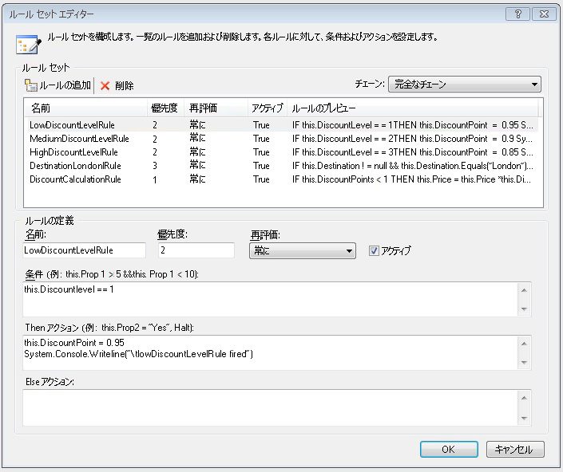
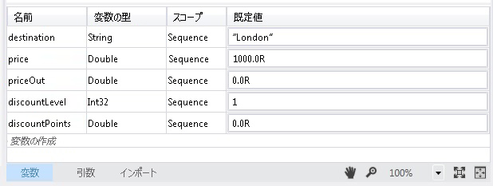
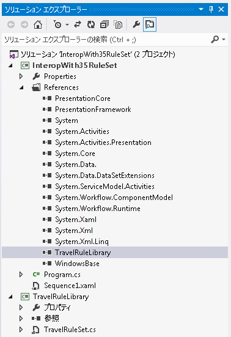
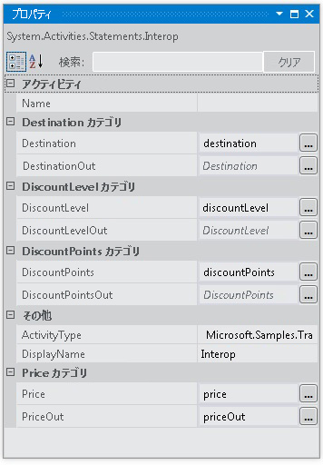

# <a name="interop-with-35-rule-set"></a><span data-ttu-id="2babb-102">3.5 ルール セットとの相互運用</span><span class="sxs-lookup"><span data-stu-id="2babb-102">Interop with 3.5 Rule Set</span></span>
<span data-ttu-id="2babb-103">このサンプルでの使用、<xref:System.Activities.Statements.Interop>アクティビティのカスタム アクティビティと統合する[!INCLUDE[netfx35_short](../../../../includes/netfx35-short-md.md)]を使用して<!--zz <xref:System.Workflow.Activities.Policy> -->`System.Workflow.Activities.Policy`とルール。</span><span class="sxs-lookup"><span data-stu-id="2babb-103">This sample demonstrates the use of the <xref:System.Activities.Statements.Interop> activity to integrate with a custom activity in [!INCLUDE[netfx35_short](../../../../includes/netfx35-short-md.md)] using <!--zz <xref:System.Workflow.Activities.Policy> --> `System.Workflow.Activities.Policy` and rules.</span></span> <span data-ttu-id="2babb-104">このサンプルでは、カスタム アクティビティで公開されている依存プロパティに [!INCLUDE[netfx_current_long](../../../../includes/netfx-current-long-md.md)] 変数をバインドすることで、カスタム アクティビティにデータを渡します。</span><span class="sxs-lookup"><span data-stu-id="2babb-104">It passes data to the custom activity by binding [!INCLUDE[netfx_current_long](../../../../includes/netfx-current-long-md.md)] variables to the dependency properties exposed by the custom activity.</span></span>  
  
## <a name="requirements"></a><span data-ttu-id="2babb-105">要件</span><span class="sxs-lookup"><span data-stu-id="2babb-105">Requirements</span></span>  
  
1.  [!INCLUDE[vs_current_long](../../../../includes/vs-current-long-md.md)]  
  
2.  [!INCLUDE[netfx_current_long](../../../../includes/netfx-current-long-md.md)]  
  
3.  [!INCLUDE[netfx35_long](../../../../includes/netfx35-long-md.md)]  
  
## <a name="demonstrates"></a><span data-ttu-id="2babb-106">使用例</span><span class="sxs-lookup"><span data-stu-id="2babb-106">Demonstrates</span></span>  
 <span data-ttu-id="2babb-107"><xref:System.Activities.Statements.Interop> アクティビティ、 <!--zz <xref:System.Workflow.Activities.Policy> --> `System.Workflow.Activities.Policy`でアクティビティ[!INCLUDE[netfx35_short](../../../../includes/netfx35-short-md.md)]依存関係プロパティを持つ</span><span class="sxs-lookup"><span data-stu-id="2babb-107"><xref:System.Activities.Statements.Interop> activity, <!--zz <xref:System.Workflow.Activities.Policy> --> `System.Workflow.Activities.Policy` activity in [!INCLUDE[netfx35_short](../../../../includes/netfx35-short-md.md)] with dependency properties</span></span>  
  
## <a name="discussion"></a><span data-ttu-id="2babb-108">説明</span><span class="sxs-lookup"><span data-stu-id="2babb-108">Discussion</span></span>  
 <span data-ttu-id="2babb-109">このサンプルでは、[!INCLUDE[netfx35_short](../../../../includes/netfx35-short-md.md)] アクティビティと統合するための統合シナリオの 1 つを示します。</span><span class="sxs-lookup"><span data-stu-id="2babb-109">The sample demonstrates one of the integration scenarios for integrating with a [!INCLUDE[netfx35_short](../../../../includes/netfx35-short-md.md)] activity.</span></span> <span data-ttu-id="2babb-110">このサンプルが含まれています、[!INCLUDE[netfx35_short](../../../../includes/netfx35-short-md.md)]を呼び出すカスタム アクティビティ、 <!--zz <xref:System.Workflow.Activities.Policy> --> `System.Workflow.Activities.Policy`アクティビティ。</span><span class="sxs-lookup"><span data-stu-id="2babb-110">This sample includes a [!INCLUDE[netfx35_short](../../../../includes/netfx35-short-md.md)] custom activity that invokes a <!--zz <xref:System.Workflow.Activities.Policy> --> `System.Workflow.Activities.Policy` activity.</span></span>  
  
## <a name="travelrulelibrary"></a><span data-ttu-id="2babb-111">TravelRuleLibrary</span><span class="sxs-lookup"><span data-stu-id="2babb-111">TravelRuleLibrary</span></span>  
 <span data-ttu-id="2babb-112">デザイナーで TravelRuleSet.cs を開くと、次のようにポリシー アクティビティを含むカスタムのシーケンシャル アクティビティが示されます。</span><span class="sxs-lookup"><span data-stu-id="2babb-112">Opening TravelRuleSet.cs in the designer shows a custom sequential activity that contains a Policy activity as follows</span></span>  
  
 <span data-ttu-id="2babb-113"></span><span class="sxs-lookup"><span data-stu-id="2babb-113"></span></span>  
  
 <span data-ttu-id="2babb-114">ダブルクリックして、 **DiscountPolicy**ポリシー アクティビティをルールを検証します。</span><span class="sxs-lookup"><span data-stu-id="2babb-114">Double-click the **DiscountPolicy** policy activity to examine the rules.</span></span> <span data-ttu-id="2babb-115">ルール エディターが表示され、ルールが表示されます。</span><span class="sxs-lookup"><span data-stu-id="2babb-115">The Rules editor appears to show the rules.</span></span>  
  
 <span data-ttu-id="2babb-116"></span><span class="sxs-lookup"><span data-stu-id="2babb-116"></span></span>  
  
 <span data-ttu-id="2babb-117">右クリックし、 **DiscountPolicy**アクティビティを選択、**コードの表示**コード側 c# コードをこのアクティビティと共に使用するにはオプションです。</span><span class="sxs-lookup"><span data-stu-id="2babb-117">Right-click the **DiscountPolicy** activity and select the **View Code** option to examine the code-beside C# code that goes with this activity.</span></span> <span data-ttu-id="2babb-118">`DiscountLevel` の依存関係プロパティの設定を確認します。</span><span class="sxs-lookup"><span data-stu-id="2babb-118">Observe the dependency property setting for `DiscountLevel`.</span></span> <span data-ttu-id="2babb-119">これは、<xref:System.Activities.Argument> の [!INCLUDE[netfx_current_short](../../../../includes/netfx-current-short-md.md)] と同じです。</span><span class="sxs-lookup"><span data-stu-id="2babb-119">This is equivalent to an <xref:System.Activities.Argument> in [!INCLUDE[netfx_current_short](../../../../includes/netfx-current-short-md.md)].</span></span>  
  
```  
public static DependencyProperty DiscountLevelProperty = DependencyProperty.Register("DiscountLevel", typeof(int), typeof(TravelRuleSet));  
  
[DescriptionAttribute("DiscountLevel")]  
[CategoryAttribute("DiscountLevel Category")]  
[BrowsableAttribute(true)]  
[DesignerSerializationVisibilityAttribute(DesignerSerializationVisibility.Visible)]  
public int DiscountLevel  
{  
   get  
   {  
return ((int)base.GetValue(TravelRuleSet.DiscountLevelProperty)));  
   }  
   set  
   {  
base.SetValue(TravelRuleSet.DiscountLevelProperty, value);  
   }  
}  
```  
  
## <a name="interopwith35ruleset"></a><span data-ttu-id="2babb-120">InteropWith35RuleSet</span><span class="sxs-lookup"><span data-stu-id="2babb-120">InteropWith35RuleSet</span></span>  
 <span data-ttu-id="2babb-121">これは、[!INCLUDE[netfx_current_short](../../../../includes/netfx-current-short-md.md)] アクティビティを使用して、TravelRuleLibrary プロジェクトで作成されたカスタム ルール セットと統合する <xref:System.Activities.Statements.Interop> シーケンシャル ワークフロー プロジェクトです。</span><span class="sxs-lookup"><span data-stu-id="2babb-121">This is a [!INCLUDE[netfx_current_short](../../../../includes/netfx-current-short-md.md)] sequential workflow project that uses the <xref:System.Activities.Statements.Interop> activity to integrate with the custom rule set created in the TravelRuleLibrary project.</span></span> <span data-ttu-id="2babb-122">変数は、次のように最上位レベルの <xref:System.Activities.Statements.Sequence> で作成されます。</span><span class="sxs-lookup"><span data-stu-id="2babb-122">Variables are created on the top-level <xref:System.Activities.Statements.Sequence> as follows.</span></span>  
  
 <span data-ttu-id="2babb-123"></span><span class="sxs-lookup"><span data-stu-id="2babb-123"></span></span>  
  
 <span data-ttu-id="2babb-124"></span><span class="sxs-lookup"><span data-stu-id="2babb-124"></span></span>  
  
 <span data-ttu-id="2babb-125">最後に、<xref:System.Activities.Statements.Interop> アクティビティは、TravelRuleSet と統合するために使用されます。</span><span class="sxs-lookup"><span data-stu-id="2babb-125">Lastly, the <xref:System.Activities.Statements.Interop> activity is used to integrate with the TravelRuleSet.</span></span> <span data-ttu-id="2babb-126"><xref:System.Activities.Statements.Sequence> で事前に宣言された変数は、依存プロパティにバインドするために使用されます。</span><span class="sxs-lookup"><span data-stu-id="2babb-126">The variables that were declared earlier on the <xref:System.Activities.Statements.Sequence> are used to bind to the dependency properties.</span></span>  
  
 <span data-ttu-id="2babb-127"></span><span class="sxs-lookup"><span data-stu-id="2babb-127"></span></span>  
  
 <span data-ttu-id="2babb-128"></span><span class="sxs-lookup"><span data-stu-id="2babb-128"></span></span>  
  
 <span data-ttu-id="2babb-129"></span><span class="sxs-lookup"><span data-stu-id="2babb-129"></span></span>  
  
> [!IMPORTANT]
>  <span data-ttu-id="2babb-130">サンプルは、既にコンピューターにインストールされている場合があります。</span><span class="sxs-lookup"><span data-stu-id="2babb-130">The samples may already be installed on your machine.</span></span> <span data-ttu-id="2babb-131">続行する前に、次の (既定の) ディレクトリを確認してください。</span><span class="sxs-lookup"><span data-stu-id="2babb-131">Check for the following (default) directory before continuing.</span></span>  
>   
>  `<InstallDrive>:\WF_WCF_Samples`  
>   
>  <span data-ttu-id="2babb-132">このディレクトリが存在しない場合に、 [Windows Communication Foundation (WCF) および .NET Framework 4 向けの Windows Workflow Foundation (WF) サンプル](http://go.microsoft.com/fwlink/?LinkId=150780)すべて Windows Communication Foundation (WCF) をダウンロードして[!INCLUDE[wf1](../../../../includes/wf1-md.md)]サンプルです。</span><span class="sxs-lookup"><span data-stu-id="2babb-132">If this directory does not exist, go to [Windows Communication Foundation (WCF) and Windows Workflow Foundation (WF) Samples for .NET Framework 4](http://go.microsoft.com/fwlink/?LinkId=150780) to download all Windows Communication Foundation (WCF) and [!INCLUDE[wf1](../../../../includes/wf1-md.md)] samples.</span></span> <span data-ttu-id="2babb-133">このサンプルは、次のディレクトリに格納されます。</span><span class="sxs-lookup"><span data-stu-id="2babb-133">This sample is located in the following directory.</span></span>  
>   
>  `<InstallDrive>:\WF_WCF_Samples\WF\Basic\Built-InActivities\InteropWith35RuleSet`
