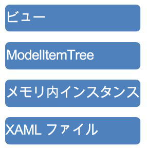

# <a name="programming-model-item-tree"></a>モデル アイテム ツリーのプログラミング
このサンプルでは、移動、<xref:System.Activities.Presentation.Model.ModelItem>宣言型データ バインディング Windows Presentation Foundation (WPF) ツリー ビューを使用しています。  
  
## <a name="sample-details"></a>サンプルの詳細  
 <xref:System.Activities.Presentation.Model.ModelItem> ツリーは、編集する基のインスタンスに関するデータを公開するために [!INCLUDE[wfd1](../../../../includes/wfd1-md.md)] のインフラストラクチャで使用される抽象表現です。 次の図は、[!INCLUDE[wfd2](../../../../includes/wfd2-md.md)]のインフラストラクチャのさまざまな層を表しています。  
  
   
  
 <xref:System.Activities.Presentation.Model.ModelItem> は、基になる値へのポインターと、<xref:System.Activities.Presentation.Model.ModelProperty> オブジェクトのコレクションで構成されています。 <xref:System.Activities.Presentation.Model.ModelProperty> オブジェクトはさらに、プロパティの名前や型などのデータと、また別の <xref:System.Activities.Presentation.Model.ModelItem> である値へのポインターで構成されています。 <xref:System.Activities.Presentation.Model.ModelItem> から返される一部の <xref:System.Activities.Presentation.Model.ModelProperty> に対しては、ツリー ビューに正しく表示されるように操作するために値コンバーターが使用されます。 このサンプルでは、次の例のような命令構文を使用して <xref:System.Activities.Presentation.Model.ModelItem> ツリーを命令型プログラミングで操作する方法を示します。  
  
```csharp  
ModelItem mi = wd.Context.Services.GetService<ModelService>().Root;  
ModelProperty mp = mi.Properties["Activities"];  
mp.Collection.Add(new Persist());  
ModelItem justAdded = mp.Collection.Last();  
justAdded.Properties["DisplayName"].SetValue("new name");  
```  
  
#### <a name="to-use-this-sample"></a>このサンプルを使用するには  
  
1.  [!INCLUDE[vs2010](../../../../includes/vs2010-md.md)] で ProgrammingModelItemTree.sln ソリューションを開きます。  
  
2.  選択して、ソリューションをビルド**ソリューションのビルド**から、**ビルド**メニュー。  
  
3.  F5 キーを押してアプリケーションを実行します。 [!INCLUDE[avalon2](../../../../includes/avalon2-md.md)] フォームが表示されます。  
  
4.  をクリックして、 **Load WF**を読み込む ボタン、<xref:System.Activities.Presentation.Model.ModelItem>ツリー ビューにバインドします。  
  
5.  クリックすると、 **Change Model Item Tree**ボタンがツリーに項目を追加し、プロパティを設定するには、上記のコードを実行します。  
  
> [!IMPORTANT]
>  サンプルは、既にコンピューターにインストールされている場合があります。 続行する前に、次の (既定の) ディレクトリを確認してください。  
>   
>  `<InstallDrive>:\WF_WCF_Samples`  
>   
>  このディレクトリが存在しない場合に、 [Windows Communication Foundation (WCF) および .NET Framework 4 向けの Windows Workflow Foundation (WF) サンプル](http://go.microsoft.com/fwlink/?LinkId=150780)すべて Windows Communication Foundation (WCF) をダウンロードして[!INCLUDE[wf1](../../../../includes/wf1-md.md)]サンプルです。 このサンプルは、次のディレクトリに格納されます。  
>   
>  `<InstallDrive>:\WF_WCF_Samples\WF\Basic\Designer\ProgrammingModelItemTree`  
  
## <a name="see-also"></a>関連項目  
 <xref:System.Windows.Data.IValueConverter>
