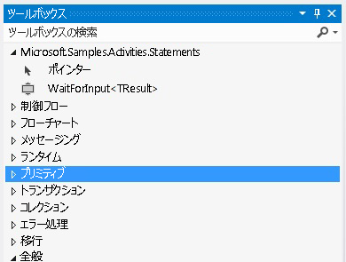

# 入力アクティビティの待機
このサンプルでは、ワークフローに名前付きブックマークを作成する方法を示します。 Windows Workflow Foundation (WF) では、宣言型ブックマークを作成するアクティビティは用意されていません。 そのため、ワークフローにブックマークを作成する場合は、ブックマークを作成するカスタム アクティビティを記述する必要があります。 このサンプルで定義される `WaitForInput` アクティビティはこの機能を提供します。そのため、ユーザーはワークフロー内で宣言によってブックマークを作成できます。  
  
## このサンプルのプロジェクト  
  
|**プロジェクト名**|**説明**|**メイン ファイルします。**|  
|-|-|-|  
|WaitForInput|`WaitForInput` アクティビティとそのデザイナーが含まれます。|WaitForInput.cs   `WaitForInput` アクティビティ定義。|  
|||WaitForInputDesigner.xaml   `WaitForInput` アクティビティのカスタム デザイナー。|  
|||TypeToFirstGenericArgumentConverter.cs   デザイナーでアクティビティのジェネリック型を更新するために使用される WPF 型コンバーター。|  
|WaitForInputTestClient|ワークフロー デザイナーで、複数の WaitForInput アクティビティを使用してワークフローを構成および実行するサンプル クライアント アプリケーション。|Sequence1.xaml   `WaitForInput` アクティビティを使用するシーケンシャル ワークフロー。|  
|||Program.cs   Sequence1.xaml で定義されているワークフローのインスタンスを実行します。|  
  
## WaitForInput アクティビティ  
 `WaitForInput` アクティビティは、ワークフローに名前付きブックマークを作成します。 ブックマークはシグナルを待機し、構成された型のデータを受信します。 ブックマークが再開されると、ワークフローに渡されたデータを `Result` プロパティで使用できるようになります。  
  
 `WaitForInput` アクティビティは、<xref:System.Activities.NativeActivity> クラスを介してのみアクセスできるブックマークを作成する必要があるため、<xref:System.Activities.NativeActivityContext> クラスから派生します。  
  
 このアクティビティには、デザイナーをバインドするための属性、更新可能なジェネリック引数機能を追加するための属性、および既定のジェネリック型を文字列に設定するための属性が割り当てられます。 また、このアクティビティには、次の表に示す引数があります。  
  
|**Name**|**Type**|**説明**|  
|-|-|-|  
|TResult|ジェネリック引数 (TResult)|ブックマークの型。 これは再開時にブックマークに渡されるデータの型です。|  
|BookmarkName|InArgument\<文字列 >|ブックマークの名前。|  
|結果|InArgument\<TResult >|ブックマークが再開されたときにアクティビティに渡されるデータ。|  
  
## WaitForInput アクティビティ デザイナー  
 `WaitForInput` アクティビティ デザイナーは、WaitForInputDesigner.xaml ファイルで実装されます。 `WaitForInput` アクティビティとそのデザイナーは、同じアセンブリに格納されます。 次の図は、アセンブリと同じ名前を持つカテゴリ内のツールボックスに含まれる `WaitForInput` アクティビティを示しています。  
  
   
  
 次の図は、`WaitForInput` デザイナーを示しています。 `WaitForInput` アクティビティは非常に基本的なアクティビティであるため、そのすべての引数をデザイナー サーフェイスで直接設定できます。  
  
   
  
#### このサンプルを使用するには  
  
1.  [!INCLUDE[vs2010](../../../../includes/vs2010-md.md)] を使用して、WaitForInput.sln ファイルを開きます。  
  
2.  ソリューションをビルドするには、Ctrl キーと Shift キーを押しながら B キーを押します。  
  
3.  サンプルをデバッグなしで開始するには、Ctrl キーを押しながら F5 キーを押します。  
  
> [!IMPORTANT]
>  サンプルは、既にコンピューターにインストールされている場合があります。 続行する前に、次の (既定の) ディレクトリを確認してください。  
>   
>  `<InstallDrive>:\WF_WCF_Samples`  
>   
>  このディレクトリが存在しない場合に、 [Windows Communication Foundation (WCF) および .NET Framework 4 向けの Windows Workflow Foundation (WF) サンプル](http://go.microsoft.com/fwlink/?LinkId=150780)すべて Windows Communication Foundation (WCF) をダウンロードして[!INCLUDE[wf1](../../../../includes/wf1-md.md)]サンプルです。 このサンプルは、次のディレクトリに格納されます。  
>   
>  `<InstallDrive>:\WF_WCF_Samples\WF\Scenario\ActivityLibrary\WaitForInput`