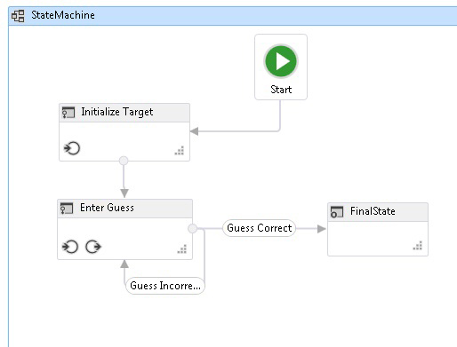
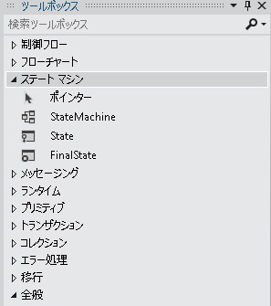

# ステート マシン ワークフロー
ステート マシンは、プログラムの開発に関する、よく知られたパラダイムの 1 つです。 <xref:System.Activities.Statements.StateMachine> アクティビティを、<xref:System.Activities.Statements.State>、<xref:System.Activities.Statements.Transition> および他のアクティビティと共に使用することで、ステート マシン ワークフロー プログラムをビルドできます。 このトピックでは、ステート マシン ワークフローの概要について説明します。  
  
## ステート マシン ワークフローの概要  
 ステート マシン ワークフローで使用するモデル化スタイルでは、ワークフローをイベント ドリブン型にモデル化します。 <xref:System.Activities.Statements.StateMachine> アクティビティは、ステート マシンのロジックを構成する状態および遷移を含んでおり、何かのアクティビティを使用する任意の場所で使用できます。 ステート マシン ランタイムには、次に示すいくつかのクラスがあります。  
  
-   <xref:System.Activities.Statements.StateMachine>  
  
-   <xref:System.Activities.Statements.State>  
  
-   <xref:System.Activities.Statements.Transition>  
  
 ステート マシン ワークフローを作成するときは、<xref:System.Activities.Statements.StateMachine> アクティビティに状態が追加され、状態間のフローのコントロールには遷移が使用されます。 次のスクリーン ショットから、[チュートリアル入門](../../../docs/framework/windows-workflow-foundation/getting-started-tutorial.md)ステップ[する方法: ステート マシン ワークフローを作成する](../../../docs/framework/windows-workflow-foundation/how-to-create-a-state-machine-workflow.md)、3 つの状態と遷移の 3 つのステート マシン ワークフローを示しています。 **ターゲットの初期化**初期状態であり、ワークフローの最初の状態を表します。 これから伸びる線によって指定される、**開始**ノード。 ワークフローの最後の状態の名前は**FinalState**、ワークフローが完了した時点を表します。  
  
   
  
 ステート マシン ワークフローには、初期状態が 1 つのみ、および最終状態が少なくとも 1 つ必要です。 最終状態以外の各状態には、遷移が少なくとも 1 つ必要です。 以降のセクションでは、状態および遷移の作成と構成について説明します。  
  
## 状態の作成および構成  
 <xref:System.Activities.Statements.State> はステート マシンの状態を表します。 追加する、<xref:System.Activities.Statements.State>をワークフローにドラッグ、**状態**からアクティビティ デザイナー、**ステート マシン**のセクション、**ツールボックス**上にドロップし、 <xref:System.Activities.Statements.StateMachine>上のアクティビティ、[!INCLUDE[wfd1](../../../includes/wfd1-md.md)]画面。  
  
   
  
 として状態を構成する、**の初期状態**、状態を右クリックし **初期状態として設定**です。 さらに、現在の初期状態がない場合は、初期状態で指定できるから線をドラッグ、**開始**目的の状態にワークフローの上部にあるノード。 ときに、<xref:System.Activities.Statements.StateMachine>アクティビティがワークフロー デザイナーにドロップされる、という名前の初期状態で事前に構成されて**State1**です。 ステート マシン ワークフローには初期状態が 1 つのみ必要です。  
  
 ステート マシンを終了させる状態を表す状態は、最終状態と呼ばれます。 最終状態とは、<xref:System.Activities.Statements.State.IsFinal%2A> プロパティが `true` に設定され、<xref:System.Activities.Statements.State.Exit%2A> のアクティビティを持たず、そこから発生する遷移がない状態です。 ワークフローに最終状態を追加するには、ドラッグ、 **FinalState**からアクティビティ デザイナー、**ステート マシン**のセクションで、**ツールボックス**上にドロップし、<xref:System.Activities.Statements.StateMachine>上のアクティビティ[!INCLUDE[wfd1](../../../includes/wfd1-md.md)]画面。 ステート マシン ワークフローには最終ステートが少なくとも 1 つ必要です。  
  
### エントリおよび終了アクションの構成  
 状態には、<xref:System.Activities.Statements.State.Entry%2A> アクションおよび <xref:System.Activities.Statements.State.Exit%2A> アクションを設定できます (最終状態として構成された状態にはエントリ アクションを 1 つのみ設定できます)。 ワークフロー インスタンスが、ある状態に入ると、エントリ アクションのあらゆるアクティビティが実行されます。 エントリ アクションが完了すると、状態の遷移のトリガーがスケジュールされます。 別のステートへの遷移が確認されると、状態遷移が同じ状態に戻ったとしても、終了アクションのアクティビティが実行されます。 終了のアクションが完了すると、遷移のアクションのアクティビティが実行され、その新しい状態が遷移され、エントリ アクションがスケジュールされます。  
  
> [!NOTE]
>  ステート マシン ワークフローをデバッグするときは、ステート マシン ワークフロー内のルート ステート マシンのアクティビティおよび状態にブレークポイントを設定できます。 ブレークポイントを設定できる対象は、状態内または遷移内の任意のアクティビティです。遷移に対して直接設定することはできません。  
  
## 遷移の作成および構成  
 最終状態以外のすべての状態には遷移が少なくとも 1 つ必要です。遷移がなくてよいのは最終状態のみです。 遷移は、状態マシン ワークフローに状態を追加した後に追加されます。または、状態をドロップしたときに作成されます。  
  
 追加する、<xref:System.Activities.Statements.State>ドラッグの 1 つのステップの遷移を作成して、**状態**からアクティビティを**ステート マシン**のセクションで、**ツールボックス**内の別の状態の上にマウス ポインターとワークフロー デザイナーです。 ドラッグされている <xref:System.Activities.Statements.State> が別の <xref:System.Activities.Statements.State> の上にある場合、もう一方の <xref:System.Activities.Statements.State> の周囲に 4 つの三角形が表示されます。 <xref:System.Activities.Statements.State> を 4 つの三角形のいずれかにドロップすると、ステート マシンに追加され、遷移元の <xref:System.Activities.Statements.State> からドロップされた遷移先の <xref:System.Activities.Statements.State> に遷移が作成されます。 詳細については、次を参照してください。 [Transition アクティビティ デザイナー](/visualstudio/workflow-designer/transition-activity-designer)です。  
  
 状態の追加後に遷移を作成する方法は 2 つあります。 1 つ目は、ワークフロー デザイナー サーフェスから状態をドラッグして既存の状態の上に置き、ドロップ ポイントのいずれかにドロップする方法です。 これは、前のセクションで説明した方法によく似ています。 もう 1 つは、マウス ポインターを目的のソースの状態の上に置き、線を適切な目的の状態にドラッグする方法です。  
  
> [!NOTE]
>  ステート マシンの 1 つの状態では、ワークフロー デザイナーを使用して作成された遷移を最大 76 個まで含めることができます。 デザイナー以外で作成されたワークフローの状態の遷移に関する制限は、システム リソースによってのみ制限されます。  
  
 遷移は <xref:System.Activities.Statements.Transition.Trigger%2A>、<xref:System.Activities.Statements.Transition.Condition%2A>、および <xref:System.Activities.Statements.Transition.Action%2A> を持つことができます。 遷移の <xref:System.Activities.Statements.Transition.Trigger%2A> は、遷移のソース状態の <xref:System.Activities.Statements.State.Entry%2A> アクションが完了するときにスケジュールされます。 通常 <xref:System.Activities.Statements.Transition.Trigger%2A> は、ある種のイベント発生を待つアクティビティですが、その他のアクティビティであっても、または何もアクティビティがなくてもかまいません。 <xref:System.Activities.Statements.Transition.Trigger%2A> のアクティビティが完了したら、<xref:System.Activities.Statements.Transition.Condition%2A> がある場合は評価されます。 <xref:System.Activities.Statements.Transition.Trigger%2A> のアクティビティがない場合、<xref:System.Activities.Statements.Transition.Condition%2A> は直ちに評価されます。 条件が `false` になる場合、遷移はキャンセルされ、その状態からのすべての遷移の <xref:System.Activities.Statements.Transition.Trigger%2A> アクティビティは再スケジュールされます。 現在の遷移と同じソースの状態を共有する他の遷移がある場合、<xref:System.Activities.Statements.Transition.Trigger%2A> のアクションもキャンセルされて、再スケジュールされます。 <xref:System.Activities.Statements.Transition.Condition%2A> が `true` である場合、または条件がない場合、ソース状態の <xref:System.Activities.Statements.State.Exit%2A> のアクションが実行され、遷移の <xref:System.Activities.Statements.Transition.Action%2A> が実行されます。 ときに、<xref:System.Activities.Statements.Transition.Action%2A>が完了したら、コントロールに渡して、**ターゲット**状態  
  
 共通トリガーを共有する遷移は、共有トリガー遷移と呼ばれます。 共有トリガー遷移グループに含まれる遷移は、いずれも同じトリガーを使用しますが、それぞれの <xref:System.Activities.Statements.Transition.Condition%2A> およびアクションは一意です。 遷移に追加のアクションを追加して共有遷移を作成するには、目的の遷移の始点を表す円をクリックし、目的の状態にドラッグします。 新しい遷移では最初の遷移と同じトリガーが共有されますが、その条件とアクションは一意になります。 共有遷移できますも作成することから、遷移デザイナー内をクリックして**共有トリガー遷移の追加**から目的のターゲットの状態をクリックして、遷移デザイナーの下部にある、 **接続に使用可能な状態**ドロップダウンします。  
  
> [!NOTE]
>  遷移の <xref:System.Activities.Statements.Transition.Condition%2A> が `False` と評価された場合 (またはトリガーを共有する遷移すべての状態が `False` と評価された場合)、遷移は行われず、その状態からのすべての遷移のすべてのトリガーが再スケジュールされます。  
  
 ステート マシン ワークフローを作成する方法の詳細については、次を参照してください[する方法: ステート マシン ワークフローを作成する](../../../docs/framework/windows-workflow-foundation/how-to-create-a-state-machine-workflow.md)、 [StateMachine アクティビティ デザイナー](/visualstudio/workflow-designer/statemachine-activity-designer)、[ステート アクティビティ デザイナー](/visualstudio/workflow-designer/state-activity-designer)、。[FinalState アクティビティ デザイナー](/visualstudio/workflow-designer/finalstate-activity-designer)、および[アクティビティ デザイナーの遷移](/visualstudio/workflow-designer/transition-activity-designer)です。  
  
## ステート マシン用語  
 このセクションでは、このトピック全体で使用しているステート マシン用語の定義を示します。  
  
 状態  
 ステート マシンを構成する基本単位。 1 つのステート マシンは、任意の特定の時点において 1 つの状態をとることができます。  
  
 エントリ アクション  
 状態に入るときに実行されるアクティビティです。  
  
 終了アクション  
 状態を終了するときに実行されるアクティビティです。  
  
 切り替え効果  
 2 つの状態を結ぶ、方向を持った関係。あるステート マシンが特定の種類のイベントの発生に対して行う応答全体を表します。  
  
 共有遷移  
 1 つ以上の別の遷移と同じソースの状態およびトリガーを共有する遷移。一意の条件とアクションを持ちます。  
  
 トリガー  
 遷移を発生させるトリガー アクティビティです。  
  
 状態  
 1 つの制約。トリガーが発生した後でその遷移が完了するためには、条件が `true` になる必要があります。  
  
 遷移アクション  
 特定の遷移を実行するときに実行されるアクティビティです。  
  
 条件付き遷移  
 明示的な条件付きの遷移です。  
  
 自己遷移  
 ある状態から、それと同じ状態に遷移する遷移です。  
  
 初期状態  
 ステート マシンの開始ポイントを示す状態です。  
  
 最終状態  
 ステート マシンの完了を示す状態です。  
  
## 関連項目  
 [方法: ステート マシン ワークフローを作成する](../../../docs/framework/windows-workflow-foundation/how-to-create-a-state-machine-workflow.md)  
 [StateMachine アクティビティ デザイナー](/visualstudio/workflow-designer/statemachine-activity-designer)  
 [State アクティビティ デザイナー](/visualstudio/workflow-designer/state-activity-designer)  
 [FinalState アクティビティ デザイナー](/visualstudio/workflow-designer/finalstate-activity-designer)  
 [Transition アクティビティ デザイナー](/visualstudio/workflow-designer/transition-activity-designer)
