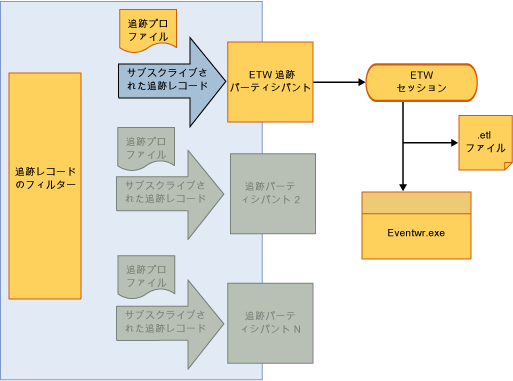

# <a name="tracking-participants"></a>追跡参加要素
追跡参加要素は、ワークフロー開発者が <xref:System.Activities.Tracking.InteropTrackingRecord.TrackingRecord%2A> オブジェクトにアクセスし、そのオブジェクトを処理する機能拡張ポイントです。 [!INCLUDE[netfx_current_long](../../../includes/netfx-current-long-md.md)] には、追跡レコードを Event Tracing for Windows (ETW) イベントとして書き込む標準の追跡参加要素が含まれています。 これで要件が満たされない場合は、カスタムの追跡参加要素を作成することもできます。  
  
## <a name="tracking-participants"></a>追跡参加要素  
 追跡インフラストラクチャを使用すると、送信の追跡レコードにフィルターを適用して、参加要素からレコードのサブセットに定期受信できるようになります。 フィルターを適用するメカニズムは、追跡プロファイルを通して行われます。  
  
 [!INCLUDE[wf](../../../includes/wf-md.md)] の [!INCLUDE[netfx_current_short](../../../includes/netfx-current-short-md.md)] には、追跡レコードを ETW セッションに書き込む追跡参加要素が用意されています。 参加要素は、追跡固有の動作を構成ファイルに追加することによって、ワークフロー サービスで構成されます。 ETW 追跡参加要素を有効にすると、追跡レコードをイベント ビューアーで表示できます。 ETW ベースの追跡用の SDK のサンプルを使用すると、ETW ベースの追跡参加要素を使用した WF の追跡を理解するうえで便利です。  
  
## <a name="etw-tracking-participant"></a>ETW 追跡参加要素  
 [!INCLUDE[netfx_current_short](../../../includes/netfx-current-short-md.md)] には、追跡レコードを ETW セッションに書き込む ETW 追跡参加要素が含まれています。 これは、アプリケーションのパフォーマンスやサーバーのスループットに与える影響を最小限に抑えたまま、非常に効率的な方法で実行されます。 標準の ETW 追跡参加要素を使用する利点は、受信する追跡レコードを他のアプリケーションや Windows イベント ビューアーのシステム ログで表示できることです。  
  
 次の例に示すように、標準の ETW 追跡参加要素は Web.config ファイルで構成されます。  
  
```xml  
<configuration>  
  <system.web>  
    <compilation debug="true" targetFramework="4.0" />  
  </system.web>  
  <system.serviceModel>  
    <behaviors>  
      <serviceBehaviors>  
        <behavior>  
          <etwTracking profileName="Sample Tracking Profile"/>  
        </behavior>  
      </serviceBehaviors>  
    </behaviors>  
   <tracking>  
      <profiles>  
        <trackingProfile name="Sample Tracking Profile">  
        ….  
       </trackingProfile>  
      </profiles>  
    </tracking>  
  </system.serviceModel>  
</configuration>  
```  
  
> [!NOTE]
>  `trackingProfile` または `<etwTracking/>` のように `<etwTracking profileName=""/>` の名前が指定されていない場合、[!INCLUDE[netfx_current_short](../../../includes/netfx-current-short-md.md)] と一緒にインストールされている Machine.config ファイルにある既定の追跡プロファイルが使用されます。  
  
 Machine.config ファイルでは、既定の追跡プロファイルはワークフロー インスタンスのレコードとエラーに定期受信されています。  
  
 ETW では、イベントはプロバイダー ID を使用して ETW セッションに書き込まれます。 ETW 追跡参加要素が追跡レコードを ETW に書き込むのに使用するプロバイダー ID は、Web.config ファイルの診断セクション (`<system.serviceModel><diagnostics>` の下) に定義されます。 既定では、プロバイダー ID が指定されていない場合、次の例に示すように ETW 追跡参加要素は既定のプロバイダー ID を使用します。  
  
```xml  
<system.serviceModel>  
        <diagnostics etwProviderId="52A3165D-4AD9-405C-B1E8-7D9A257EAC9F" />  
```  
  
 次の図は、ETW 追跡参加要素を使用した追跡データ フローを示しています。 追跡データは、ETW セッションに到達すると、さまざまな方法でアクセスできます。 これらのイベントにアクセスする最も便利な方法の 1 つはイベント ビューアーを使用することです。イベント ビューアーは、アプリケーションやサービスのログを表示して追跡する Windows の一般的なツールです。  
  
   
  
## <a name="tracking-participant-event-data"></a>追跡参加要素のイベント データ  
 追跡参加要素は、追跡レコードごとに 1 つのイベントという形式で、ETW セッションに追跡イベント データをシリアル化します。  イベントは、100 ～ 199 までの範囲内の ID を使用して識別されます。 追跡イベントの定義については、追跡参加要素によって生成されたレコードを参照してください、[追跡イベントのリファレンス](../../../docs/framework/windows-workflow-foundation/tracking-events-reference.md)トピックです。  
  
 ETW イベントのサイズは、ETW バッファーのサイズまたは ETW イベントの最大ペイロードのいずれか小さいほうの値に制限されます。 イベントのサイズが ETW のどちらかの制限を超えると、イベントが切り捨てられ、任意の方法でその内容が削除されます。 変数、引数、注釈、およびカスタム データは選択的に削除されません。 切り捨てが発生する場合は、イベント サイズが ETW の制限を超える原因となった値にかかわらず、これらのすべてが切り捨てられます。  削除されたデータは、`<item>..<item>` で置き換えられます。  
  
 複雑な型変数、引数、およびカスタム データ項目は、使用して ETW イベント レコードにシリアル化、 [NetDataContractSerializer クラス](http://go.microsoft.com/fwlink/?LinkId=177537)です。 このクラスでは、シリアル化された XML ストリームに CRL 型情報が含まれます。  
  
 ETW の制限によってペイロード データが切り捨てられると、ETW セッションに送信される追跡レコードの重複が生じる可能性があります。 このような状況は、複数のセッションがイベントをリッスンしており、セッションがそのイベントに対して異なるペイロードの制限を持っている場合に発生します。  
  
 セッションの制限が緩い場合、そのイベントが切り捨てられる可能性があります。 あるセッションのイベントが切り捨てられ、ETW の参加要素がイベントの送信を 1 回再試行する場合、ETW 追跡参加要素はイベントをリッスンしているセッション数を把握していません。 このような場合、より大きなペイロード サイズを受け入れるように設定されているセッションがそのイベントを 2 回取得します (切り捨てられていないイベントと切り捨てられたイベント)。 すべての ETW セッションが同じバッファー サイズの制限を持つように設定すると、重複を防ぐことができます。  
  
## <a name="accessing-tracking-data-from-an-etw-participant-in-the-event-viewer"></a>イベント ビューアーでの ETW 追跡参加要素の追跡データへのアクセス  
 ETW 追跡参加要素によって ETW セッションに書き込まれたイベントは、イベント ビューアーからアクセスできます (既定のプロバイダー ID を使用している場合)。 これによって、ワークフローが出力した追跡レコードをすぐに表示できます。  
  
> [!NOTE]
>  ETW セッションに出力された追跡レコード イベントでは、100 ～ 199 の範囲のイベント ID を使用します。  
  
#### <a name="to-enable-viewing-the-tracking-records-in-event-viewer"></a>イベント ビューアーで追跡レコードの表示を有効にするには  
  
1.  イベント ビューアー (EVENTVWR.EXE) を起動します。  
  
2.  選択**イベント ビューアー、アプリケーションとサービス ログ、Microsoft、Windows、アプリケーション サーバー-アプリケーション**です。  
  
3.  右クリックし、いることを確認**ビュー、分析およびデバッグ ログ**が選択されています。 有効でない場合は、ログを選択するとログの横にチェック マークが表示されます。 これが表示されます、**分析**、 **Perf**、および**デバッグ**ログ。  
  
4.  右クリックし、**分析**ログに記録し、**ログの有効化**です。 ログは %SystemRoot%\System32\Winevt\Logs\Microsoft-Windows-Application Server-Applications%4Analytic.etl ファイルに含まれます。  
  
## <a name="custom-tracking-participant"></a>カスタムの追跡参加要素  
 追跡参加要素 API では、ワークフロー ランタイムが出力する追跡レコードを処理するためのカスタム ロジックを含めることが可能なユーザー指定の追跡参加要素を使用して、追跡ランタイムを拡張できます。 カスタムの追跡参加要素を作成するためには、開発者が `Track` クラスの <xref:System.Activities.Tracking.TrackingParticipant> メソッドを実装する必要があります。 このメソッドは、ワークフロー ランタイムによって追跡レコードが出力されるときに呼び出されます。  
  
 追跡参加要素は <xref:System.Activities.Tracking.TrackingParticipant> クラスから派生します。 システムによって提供される <xref:System.Activities.Tracking.EtwTrackingParticipant> は、受信する追跡レコードごとに Event Tracking for Windows (ETW) イベントを出力します。 カスタムの追跡参加要素を作成するには、<xref:System.Activities.Tracking.TrackingParticipant> の派生クラスを作成します。 基本的な追跡機能を提供するには、<xref:System.Activities.Tracking.TrackingParticipant.Track%2A> をオーバーライドします。 <xref:System.Activities.Tracking.TrackingParticipant.Track%2A> は、ランタイムによって追跡レコードが送信されるときに呼び出され、必要な方法で処理できます。 次の例では、すべての追跡レコードをコンソール ウィンドウに出力するカスタムの追跡参加要素クラスを定義します。 また、<xref:System.Activities.Tracking.TrackingParticipant> および `BeginTrack` メソッドを使用して、非同期で追跡レコードを処理する `EndTrack` オブジェクトを実装することもできます。  
  
```csharp  
class ConsoleTrackingParticipant : TrackingParticipant  
{  
    protected override void Track(TrackingRecord record, TimeSpan timeout)  
    {  
        if (record != null)  
        {  
            Console.WriteLine("=================================");  
            Console.WriteLine(record);  
        }  
    }  
}  
```  
  
 特定の追跡参加要素を使用するには、次の例に示すように、追跡するワークフロー インスタンスに追跡参加要素を登録します。  
  
```csharp  
myInstance.Extensions.Add(new ConsoleTrackingParticipant());  
```  
  
 次の例では、<xref:System.Activities.Statements.Sequence> アクティビティを含む <xref:System.Activities.Statements.WriteLine> アクティビティから成るワークフローを作成します。 `ConsoleTrackingParticipant` が拡張機能に追加され、ワークフローが呼び出されます。  
  
```csharp  
Activity activity= new Sequence()  
{  
    Activities =  
    {  
        new WriteLine()  
        {  
            Text = "Hello World."  
        }  
    }  
};  
  
WorkflowApplication instance = new WorkflowApplication(activity);  
  
instance.Extensions.Add(new ConsoleTrackingParticipant());  
  instance.Completed = delegate(WorkflowApplicationCompletedEventArgs e)  
            {  
                Console.WriteLine("workflow instance completed, Id = " + instance.Id);  
                resetEvent.Set();  
            };  
            instance.Run();  
            Console.ReadLine();  
```  
  
## <a name="see-also"></a>関連項目  
 [Windows Server App Fabric の監視](http://go.microsoft.com/fwlink/?LinkId=201273)  
 [アプリケーション App Fabric の監視](http://go.microsoft.com/fwlink/?LinkId=201275)
