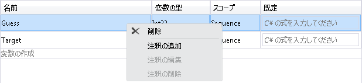
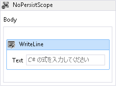
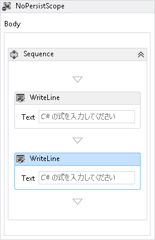
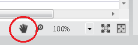
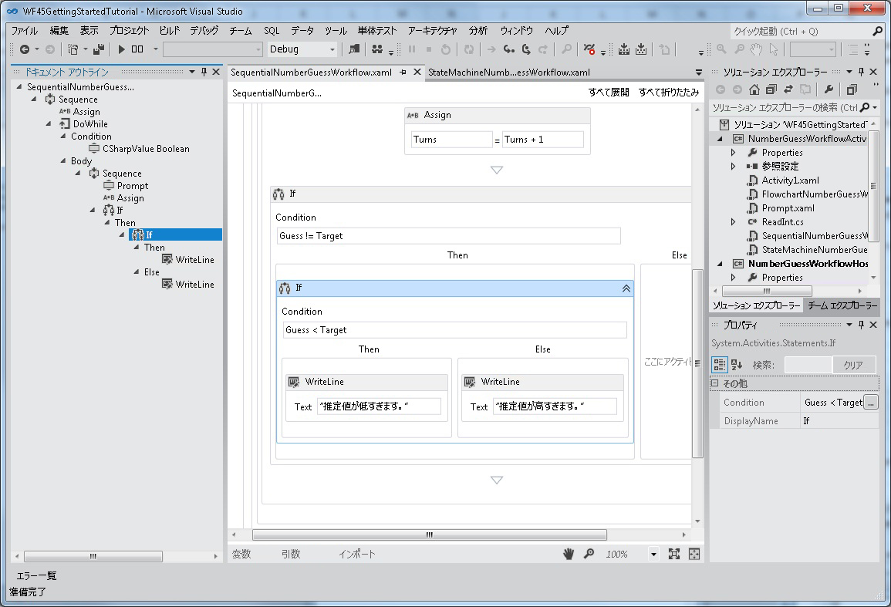
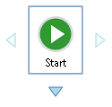
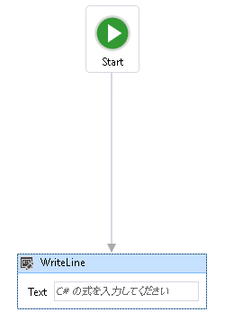

# <a name="what39s-new-in-windows-workflow-foundation-in-net-45"></a><span data-ttu-id="ddce3-102">どのような &#39; .NET 4.5 での Windows Workflow Foundation の新機能として s</span><span class="sxs-lookup"><span data-stu-id="ddce3-102">What&#39;s New in Windows Workflow Foundation in .NET 4.5</span></span>
[!INCLUDE[wf](../../../includes/wf-md.md)]<span data-ttu-id="ddce3-103"> の [!INCLUDE[net_v45](../../../includes/net-v45-md.md)] では、新しいアクティビティ、デザイナー機能、ワークフロー開発モデルなどの多くの新機能が導入されました。</span><span class="sxs-lookup"><span data-stu-id="ddce3-103"> in [!INCLUDE[net_v45](../../../includes/net-v45-md.md)] introduces many new features, such as new activities, designer capabilities, and workflow development models.</span></span> <span data-ttu-id="ddce3-104">[!INCLUDE[net_v45](../../../includes/net-v45-md.md)] で導入された新しいワークフロー機能の多くは、ホストを変更したワークフロー デザイナーでサポートされています (ただし、すべての機能がサポートされているわけではありません)。</span><span class="sxs-lookup"><span data-stu-id="ddce3-104">Many, but not all, of the new workflow features introduced in [!INCLUDE[net_v45](../../../includes/net-v45-md.md)] are supported in the re-hosted workflow designer.</span></span> [!INCLUDE[crabout](../../../includes/crabout-md.md)]<span data-ttu-id="ddce3-105">サポートされている新機能を参照してください[、再ホストされたワークフロー デザイナーで新しい Workflow Foundation 4.5 機能のサポート](../../../docs/framework/windows-workflow-foundation/wf-features-in-the-rehosted-workflow-designer.md)です。</span><span class="sxs-lookup"><span data-stu-id="ddce3-105"> the new features that are supported, see [Support for New Workflow Foundation 4.5 Features in the Rehosted Workflow Designer](../../../docs/framework/windows-workflow-foundation/wf-features-in-the-rehosted-workflow-designer.md).</span></span> [!INCLUDE[crabout](../../../includes/crabout-md.md)]<span data-ttu-id="ddce3-106">.NET 3.0 を移行して、最新バージョンを使用する .NET 3.5 ワークフロー アプリケーションを参照してください。[移行ガイダンス](../../../docs/framework/windows-workflow-foundation/migration-guidance.md)です。</span><span class="sxs-lookup"><span data-stu-id="ddce3-106"> migrating .NET 3.0 and .NET 3.5 workflow applications to use the latest version, see [Migration Guidance](../../../docs/framework/windows-workflow-foundation/migration-guidance.md).</span></span> <span data-ttu-id="ddce3-107">ここでは、[!INCLUDE[net_v45](../../../includes/net-v45-md.md)] で導入された新しいワークフロー機能の概要について説明します。</span><span class="sxs-lookup"><span data-stu-id="ddce3-107">This topic provides an overview of the new workflow features introduced in [!INCLUDE[net_v45](../../../includes/net-v45-md.md)].</span></span>  
  
> [!WARNING]
>  <span data-ttu-id="ddce3-108">[!INCLUDE[wf2](../../../includes/wf2-md.md)] で導入された新しい [!INCLUDE[net_v45](../../../includes/net-v45-md.md)] 機能は、以前のバージョンのフレームワークを対象とするプロジェクトには使用できません。</span><span class="sxs-lookup"><span data-stu-id="ddce3-108">The new [!INCLUDE[wf2](../../../includes/wf2-md.md)] features introduced in [!INCLUDE[net_v45](../../../includes/net-v45-md.md)] are not available for projects that target previous versions of the framework.</span></span> <span data-ttu-id="ddce3-109">[!INCLUDE[net_v45](../../../includes/net-v45-md.md)] を対象とするプロジェクトの対象を以前のバージョンのフレームワークに変更すると、いくつかの問題が発生する場合があります。</span><span class="sxs-lookup"><span data-stu-id="ddce3-109">If a project that targets [!INCLUDE[net_v45](../../../includes/net-v45-md.md)] is re-targeted to a previous version of the framework, several issues can occur.</span></span>  
>   
>  -   <span data-ttu-id="ddce3-110">C# 式は、メッセージに、デザイナーで置き換えられます**値が XAML で設定された**です。</span><span class="sxs-lookup"><span data-stu-id="ddce3-110">C# expressions will be replaced in the designer with the message **Value was set in XAML**.</span></span>  
> -   <span data-ttu-id="ddce3-111">次のエラーを含む、多くのビルド エラーが発生します。</span><span class="sxs-lookup"><span data-stu-id="ddce3-111">Many build errors will occur, including the following error.</span></span>  
>   
>  <span data-ttu-id="ddce3-112">**ファイルの形式は、現在のターゲット フレームワークと互換性がありません。ファイル形式を変換するにはファイルを明示的に保存してください。ファイルを保存してデザイナーを閉じて後、このエラー メッセージは表示されなくなりました。**</span><span class="sxs-lookup"><span data-stu-id="ddce3-112">**The file format is not compatible with current targeting framework. To convert the file format, please explicitly save the file. This error message will go away after you save the file and reopen the designer.**</span></span>  
  
##  <a name="BKMK_Versioning"></a><span data-ttu-id="ddce3-113">ワークフローのバージョン管理</span><span class="sxs-lookup"><span data-stu-id="ddce3-113">Workflow Versioning</span></span>  
 [!INCLUDE[net_v45](../../../includes/net-v45-md.md)]<span data-ttu-id="ddce3-114"> では、新しい <xref:System.Activities.WorkflowIdentity> クラスに基づいて、いくつかの新しいバージョン管理機能が導入されました。</span><span class="sxs-lookup"><span data-stu-id="ddce3-114"> introduced several new versioning features based around the new <xref:System.Activities.WorkflowIdentity> class.</span></span> <span data-ttu-id="ddce3-115"><xref:System.Activities.WorkflowIdentity> には、ワークフロー アプリケーションの作成者向けに、永続化されたワークフロー インスタンスをその定義でマップするメカニズムが備わっています。</span><span class="sxs-lookup"><span data-stu-id="ddce3-115"><xref:System.Activities.WorkflowIdentity> provides workflow application authors a mechanism for mapping a persisted workflow instance with its definition.</span></span>  
  
-   <span data-ttu-id="ddce3-116"><xref:System.Activities.WorkflowApplication> ホスティングを使用する開発者は、<xref:System.Activities.WorkflowIdentity> を使用して、ワークフローの複数のバージョンを同時にホストできます。</span><span class="sxs-lookup"><span data-stu-id="ddce3-116">Developers using <xref:System.Activities.WorkflowApplication> hosting can use <xref:System.Activities.WorkflowIdentity> to enable hosting multiple versions of a workflow side-by-side.</span></span> <span data-ttu-id="ddce3-117">永続化されたワークフロー インスタンスは新しい <xref:System.Activities.WorkflowApplicationInstance> クラスを使用して読み込むことができ、ホストは <xref:System.Activities.WorkflowApplicationInstance.DefinitionIdentity%2A> を使用して、<xref:System.Activities.WorkflowApplication> のインスタンス化時に適切なバージョンのワークフロー定義を提供できます。</span><span class="sxs-lookup"><span data-stu-id="ddce3-117">Persisted workflow instances can be loaded using the new <xref:System.Activities.WorkflowApplicationInstance> class, and then the <xref:System.Activities.WorkflowApplicationInstance.DefinitionIdentity%2A> can be used by the host to provide the correct version of the workflow definition when instantiating the <xref:System.Activities.WorkflowApplication>.</span></span> <span data-ttu-id="ddce3-118">詳細については、次を参照してください。[を使用して WorkflowIdentity と Versioning](../../../docs/framework/windows-workflow-foundation/using-workflowidentity-and-versioning.md)と[する方法: 複数のバージョンのホストはワークフロー サイド バイ サイドの](../../../docs/framework/windows-workflow-foundation/how-to-host-multiple-versions-of-a-workflow-side-by-side.md)します。</span><span class="sxs-lookup"><span data-stu-id="ddce3-118">For more information, see [Using WorkflowIdentity and Versioning](../../../docs/framework/windows-workflow-foundation/using-workflowidentity-and-versioning.md) and [How to: Host Multiple Versions of a Workflow Side-by-Side](../../../docs/framework/windows-workflow-foundation/how-to-host-multiple-versions-of-a-workflow-side-by-side.md).</span></span>  
  
-   <span data-ttu-id="ddce3-119">現在、<xref:System.ServiceModel.WorkflowServiceHost> は複数のバージョンのホストです。</span><span class="sxs-lookup"><span data-stu-id="ddce3-119"><xref:System.ServiceModel.WorkflowServiceHost> is now a multi-version host.</span></span> <span data-ttu-id="ddce3-120">ワークフロー サービスの新しいバージョンを配置すると、新しいインスタンスが新しいサービスを使用して作成されますが、既存のインスタンスは以前のバージョンを使用して完了します。</span><span class="sxs-lookup"><span data-stu-id="ddce3-120">When a new version of a workflow service is deployed, new instances are created using the new service, but existing instances complete using the previous version.</span></span> <span data-ttu-id="ddce3-121">詳細については、次を参照してください。 [WorkflowServiceHost でサイド バイ サイドのバージョン管理](../../../docs/framework/wcf/feature-details/side-by-side-versioning-in-workflowservicehost.md)です。</span><span class="sxs-lookup"><span data-stu-id="ddce3-121">For more information, see [Side by Side Versioning in WorkflowServiceHost](../../../docs/framework/wcf/feature-details/side-by-side-versioning-in-workflowservicehost.md).</span></span>  
  
-   <span data-ttu-id="ddce3-122">永続化されたワークフロー インスタンスの定義を更新するためのメカニズムを提供する動的更新が導入されました。</span><span class="sxs-lookup"><span data-stu-id="ddce3-122">Dynamic update is introduced which provides a mechanism for updating the definition of a persisted workflow instance.</span></span> <span data-ttu-id="ddce3-123">詳細については、次を参照してください。[動的更新](../../../docs/framework/windows-workflow-foundation/dynamic-update.md)と[する方法: を実行しているワークフロー インスタンスの定義を更新](../../../docs/framework/windows-workflow-foundation/how-to-update-the-definition-of-a-running-workflow-instance.md)です。</span><span class="sxs-lookup"><span data-stu-id="ddce3-123">For more information, see [Dynamic Update](../../../docs/framework/windows-workflow-foundation/dynamic-update.md) and [How to: Update the Definition of a Running Workflow Instance](../../../docs/framework/windows-workflow-foundation/how-to-update-the-definition-of-a-running-workflow-instance.md).</span></span>  
  
-   <span data-ttu-id="ddce3-124">SqlWorkflowInstanceStoreSchemaUpgrade.sql データベース スクリプトは、[!INCLUDE[netfx40_short](../../../includes/netfx40-short-md.md)] データベース スクリプトを使用して作成された永続性データベースを更新するために用意されています。</span><span class="sxs-lookup"><span data-stu-id="ddce3-124">A SqlWorkflowInstanceStoreSchemaUpgrade.sql database script is provided to upgrade persistence databases created using the [!INCLUDE[netfx40_short](../../../includes/netfx40-short-md.md)] database scripts.</span></span> <span data-ttu-id="ddce3-125">このスクリプトは、[!INCLUDE[netfx40_short](../../../includes/netfx40-short-md.md)] で導入された新しいバージョン管理機能をサポートするように [!INCLUDE[net_v45](../../../includes/net-v45-md.md)] 永続性データベースを更新します。</span><span class="sxs-lookup"><span data-stu-id="ddce3-125">This script updates [!INCLUDE[netfx40_short](../../../includes/netfx40-short-md.md)] persistence databases to support the new versioning capabilities introduced in [!INCLUDE[net_v45](../../../includes/net-v45-md.md)].</span></span> <span data-ttu-id="ddce3-126">データベースで永続化されたワークフロー インスタンスは、既定のバージョン番号が付与されるため、side-by-side 実行および動的更新に参加できるようになります。</span><span class="sxs-lookup"><span data-stu-id="ddce3-126">The persisted workflow instances in the database are given default versioning values, and can participate in side-by-side execution and dynamic update.</span></span> [!INCLUDE[crdefault](../../../includes/crdefault-md.md)]<span data-ttu-id="ddce3-127">[ワークフローのバージョン管理をサポートするために .NET Framework 4 永続性データベースをアップグレードする](../../../docs/framework/windows-workflow-foundation/using-workflowidentity-and-versioning.md#UpdatingWF4PersistenceDatabases)です。</span><span class="sxs-lookup"><span data-stu-id="ddce3-127"> [Upgrading .NET Framework 4 Persistence Databases to Support Workflow Versioning](../../../docs/framework/windows-workflow-foundation/using-workflowidentity-and-versioning.md#UpdatingWF4PersistenceDatabases).</span></span>  
  
##  <a name="BKMK_NewActivities"></a><span data-ttu-id="ddce3-128">アクティビティ</span><span class="sxs-lookup"><span data-stu-id="ddce3-128">Activities</span></span>  
 <span data-ttu-id="ddce3-129">組み込みのアクティビティ ライブラリには、既存のアクティビティ用の新しいアクティビティと新しい機能が含まれています。</span><span class="sxs-lookup"><span data-stu-id="ddce3-129">The built-in activity library contains new activities and new features for existing activities.</span></span>  
  
###  <a name="BKMK_NoPersistScope"></a><span data-ttu-id="ddce3-130">Nopersistscope</span><span class="sxs-lookup"><span data-stu-id="ddce3-130">NoPersist Scope</span></span>  
 <span data-ttu-id="ddce3-131"><xref:System.Activities.Statements.NoPersistScope> は、NoPersistScope の子アクティビティの実行時にワークフローが永続化されないようにする新しいコンテナー アクティビティです。</span><span class="sxs-lookup"><span data-stu-id="ddce3-131"><xref:System.Activities.Statements.NoPersistScope> is a new container activity that prevents a workflow from being persisted when the NoPersistScope’s child activities are executing.</span></span> <span data-ttu-id="ddce3-132">これは、ワークフローがファイル ハンドルなどのコンピューター固有のリソースを使用している場合、データベース トランザクション中など、ワークフローの永続化が適切でないシナリオで役立ちます。</span><span class="sxs-lookup"><span data-stu-id="ddce3-132">This is useful in scenarios where it is not appropriate for the workflow to be persisted, such as when the workflow is using machine-specific resources such as file handles, or during database transactions.</span></span> <span data-ttu-id="ddce3-133">以前のバージョンでは、アクティビティ実行中に永続化されないようにするために、<xref:System.Activities.NativeActivity> を使用したカスタム <xref:System.Activities.NoPersistHandle> が必要でした。</span><span class="sxs-lookup"><span data-stu-id="ddce3-133">Previously, to prevent persistence from occurring during an activity's execution, a custom <xref:System.Activities.NativeActivity> that used a <xref:System.Activities.NoPersistHandle> was required.</span></span>  
  
###  <a name="BKMK_NewFlowchartCapabilities"></a><span data-ttu-id="ddce3-134">フローチャートの新機能</span><span class="sxs-lookup"><span data-stu-id="ddce3-134">New Flowchart Capabilities</span></span>  
 <span data-ttu-id="ddce3-135">[!INCLUDE[net_v45](../../../includes/net-v45-md.md)] 用に更新されたフローチャートには、次の新機能があります。</span><span class="sxs-lookup"><span data-stu-id="ddce3-135">Flowcharts are updated for [!INCLUDE[net_v45](../../../includes/net-v45-md.md)] and have the following new capabilities:</span></span>  
  
-   <span data-ttu-id="ddce3-136">`DisplayName` アクティビティまたは <xref:System.Activities.Statements.FlowSwitch%601> アクティビティの <xref:System.Activities.Statements.FlowDecision> プロパティは編集できます。</span><span class="sxs-lookup"><span data-stu-id="ddce3-136">The `DisplayName` property of a <xref:System.Activities.Statements.FlowSwitch%601> or <xref:System.Activities.Statements.FlowDecision> activity is editable.</span></span> <span data-ttu-id="ddce3-137">これにより、アクティビティ デザイナーではアクティビティの目的に関する詳細な情報を表示できます。</span><span class="sxs-lookup"><span data-stu-id="ddce3-137">This will let the activity designer show more information about the activity's purpose.</span></span>  
  
-   <span data-ttu-id="ddce3-138">フローチャートには <xref:System.Activities.Statements.Flowchart.ValidateUnconnectedNodes%2A> という新しいプロパティがあります。このプロパティの既定値は `False` です。</span><span class="sxs-lookup"><span data-stu-id="ddce3-138">Flowcharts have a new property called <xref:System.Activities.Statements.Flowchart.ValidateUnconnectedNodes%2A>; the default for this property is `False`.</span></span> <span data-ttu-id="ddce3-139">このプロパティを `True` に設定すると、接続されていないフローチャート ノードでは検証エラーが発生します。</span><span class="sxs-lookup"><span data-stu-id="ddce3-139">If this property is set to `True`, then unconnected flowchart nodes will produce validation errors.</span></span>  
  
## <a name="support-for-partial-trust"></a><span data-ttu-id="ddce3-140">部分信頼のサポート</span><span class="sxs-lookup"><span data-stu-id="ddce3-140">Support for Partial Trust</span></span>  
 <span data-ttu-id="ddce3-141">[!INCLUDE[netfx40_long](../../../includes/netfx40-long-md.md)] のワークフローでは、完全に信頼されたアプリケーション ドメインが必要でした。</span><span class="sxs-lookup"><span data-stu-id="ddce3-141">Workflows in [!INCLUDE[netfx40_long](../../../includes/netfx40-long-md.md)] required a fully trusted application domain.</span></span> <span data-ttu-id="ddce3-142">[!INCLUDE[net_v45](../../../includes/net-v45-md.md)] では、ワークフローを部分信頼環境で動作させることができます。</span><span class="sxs-lookup"><span data-stu-id="ddce3-142">In [!INCLUDE[net_v45](../../../includes/net-v45-md.md)], workflows can operate in a partial trust environment.</span></span> <span data-ttu-id="ddce3-143">部分信頼環境では、サード パーティのコンポーネントは、ホストのリソースに対するフル アクセスを許可しなくても使用できます。</span><span class="sxs-lookup"><span data-stu-id="ddce3-143">In a partial trust environment, third-party components can be used without granting them full access to the resources of the host.</span></span> <span data-ttu-id="ddce3-144">部分信頼でのワークフローの実行に関する問題は次のとおりです。</span><span class="sxs-lookup"><span data-stu-id="ddce3-144">Some concerns about running workflows in partial trust are as follows:</span></span>  
  
1.  <span data-ttu-id="ddce3-145">部分信頼環境では、<xref:System.Activities.Statements.Interop> アクティビティに含まれるレガシ コンポーネント (規則など) を使用することはできません。</span><span class="sxs-lookup"><span data-stu-id="ddce3-145">Using legacy components (including Rules) contained in the <xref:System.Activities.Statements.Interop> activity is not supported under partial trust.</span></span>  
  
2.  <span data-ttu-id="ddce3-146"><xref:System.ServiceModel.WorkflowServiceHost> において部分信頼でワークフローを実行することはできません。</span><span class="sxs-lookup"><span data-stu-id="ddce3-146">Running workflows in partial trust in <xref:System.ServiceModel.WorkflowServiceHost> is not supported.</span></span>  
  
3.  <span data-ttu-id="ddce3-147">部分信頼シナリオで例外を永続化すると、セキュリティ上の脅威になる可能性があります。</span><span class="sxs-lookup"><span data-stu-id="ddce3-147">Persisting exceptions in a partial-trust scenario is a potential security threat.</span></span> <span data-ttu-id="ddce3-148">例外の永続化を無効にするには、例外が永続化されないように <xref:System.Activities.ExceptionPersistenceExtension> 型の拡張機能をプロジェクトに追加する必要があります。</span><span class="sxs-lookup"><span data-stu-id="ddce3-148">To disable persisting of exceptions, an extension of type <xref:System.Activities.ExceptionPersistenceExtension> must be added to the project in order to opt out of persisting exceptions.</span></span> <span data-ttu-id="ddce3-149">この型を実装する方法を示したコード例を次に示します。</span><span class="sxs-lookup"><span data-stu-id="ddce3-149">The following code example demonstrates how to implement this type.</span></span>  
  
    ```  
    public class ExceptionPersistenceExtension   
    {  
        public ExceptionPersistenceExtension()   
        {   
            this.PersistExceptions = false;   
        }   
        public bool PersistExceptions { get; set; }   
    }  
    ```  
  
     <span data-ttu-id="ddce3-150">例外がシリアル化されない場合は、例外が <xref:System.Activities.Statements.NoPersistScope> 内で使用されていることを確認してください。</span><span class="sxs-lookup"><span data-stu-id="ddce3-150">If exceptions are not to be serialized, ensure that exceptions are used within a <xref:System.Activities.Statements.NoPersistScope>.</span></span>  
  
4.  <span data-ttu-id="ddce3-151">アクティビティの作成者は、<xref:System.Activities.Activity.CacheMetadata%2A> をオーバーライドして、ワークフロー ランタイムが型に対してリフレクションを自動的に実行しないようにする必要があります。</span><span class="sxs-lookup"><span data-stu-id="ddce3-151">Activity authors should override <xref:System.Activities.Activity.CacheMetadata%2A> to avoid having the workflow runtime automatically execute reflection against the type.</span></span> <span data-ttu-id="ddce3-152">引数と子アクティビティには null 以外を指定する必要があり、<xref:System.Activities.ActivityMetadata.Bind%2A> は明示的に呼び出す必要があります。</span><span class="sxs-lookup"><span data-stu-id="ddce3-152">Arguments and child activities must be non-null, and <xref:System.Activities.ActivityMetadata.Bind%2A> must be called explicitly.</span></span> <span data-ttu-id="ddce3-153">オーバーライドの詳細については<xref:System.Activities.Activity.CacheMetadata%2A>を参照してください[CacheMetadata を使用してデータを公開する](../../../docs/framework/windows-workflow-foundation/exposing-data-with-cachemetadata.md)です。</span><span class="sxs-lookup"><span data-stu-id="ddce3-153">For more information on overriding <xref:System.Activities.Activity.CacheMetadata%2A>, see [Exposing data with CacheMetadata](../../../docs/framework/windows-workflow-foundation/exposing-data-with-cachemetadata.md).</span></span> <span data-ttu-id="ddce3-154">ある型の引数のインスタンスも、`internal`または**プライベート**で明示的に作成する必要があります<xref:System.Activities.Activity.CacheMetadata%2A>リフレクションによって作成されないようにします。</span><span class="sxs-lookup"><span data-stu-id="ddce3-154">Also, instances of arguments that are of a type that is `internal` or **private** must be explicitly created in  <xref:System.Activities.Activity.CacheMetadata%2A> to avoid being created by reflection.</span></span>  
  
5.  <span data-ttu-id="ddce3-155">型は、シリアル化に <xref:System.Runtime.Serialization.ISerializable> または <xref:System.SerializableAttribute> を使用しません。シリアル化する型では、<xref:System.Runtime.Serialization.DataContractSerializer> をサポートする必要があります。</span><span class="sxs-lookup"><span data-stu-id="ddce3-155">Types will not use <xref:System.Runtime.Serialization.ISerializable> or <xref:System.SerializableAttribute> for serialization; types that are to be serialized must support <xref:System.Runtime.Serialization.DataContractSerializer>.</span></span>  
  
6.  <span data-ttu-id="ddce3-156"><xref:System.Activities.Expressions.LambdaValue%601> を使用する式は <xref:System.Security.Permissions.ReflectionPermissionAttribute.RestrictedMemberAccess%2A> を必要とするため、部分信頼では動作しません。</span><span class="sxs-lookup"><span data-stu-id="ddce3-156">Expressions that use <xref:System.Activities.Expressions.LambdaValue%601> require <xref:System.Security.Permissions.ReflectionPermissionAttribute.RestrictedMemberAccess%2A>, and thus will not work under partial trust.</span></span> <span data-ttu-id="ddce3-157"><xref:System.Activities.Expressions.LambdaValue%601> を使用するワークフローでは、これらの式を、<xref:System.Activities.CodeActivity%601> から派生するアクティビティと置き換える必要があります。</span><span class="sxs-lookup"><span data-stu-id="ddce3-157">Workflows that use <xref:System.Activities.Expressions.LambdaValue%601> should replace those expressions with activities that derive from <xref:System.Activities.CodeActivity%601>.</span></span> <span data-ttu-id="ddce3-158">」を参照してください。</span><span class="sxs-lookup"><span data-stu-id="ddce3-158">.</span></span>  
  
7.  <span data-ttu-id="ddce3-159">部分信頼では、<xref:System.Activities.XamlIntegration.TextExpressionCompiler> または Visual Basic でホストされているコンパイラを使用して式をコンパイルすることはできませんが、以前コンパイルされた式を実行することはできます。</span><span class="sxs-lookup"><span data-stu-id="ddce3-159">Expressions cannot be compiled using <xref:System.Activities.XamlIntegration.TextExpressionCompiler> or the Visual Basic hosted compiler in partial trust, but previously compiled expressions can be run.</span></span>  
  
8.  <span data-ttu-id="ddce3-160">使用する 1 つのアセンブリ[レベル 2 の透過性](http://aka.ms/Level2Transparency)では使用できません[!INCLUDE[netfx40_short](../../../includes/netfx40-short-md.md)]、[!INCLUDE[netfx_current_short](../../../includes/netfx-current-short-md.md)]完全な信頼でと[!INCLUDE[netfx_current_short](../../../includes/netfx-current-short-md.md)]部分的な信頼でします。</span><span class="sxs-lookup"><span data-stu-id="ddce3-160">A single assembly that uses [Level 2 Transparency](http://aka.ms/Level2Transparency) cannot be used in [!INCLUDE[netfx40_short](../../../includes/netfx40-short-md.md)], [!INCLUDE[netfx_current_short](../../../includes/netfx-current-short-md.md)] in full trust, and [!INCLUDE[netfx_current_short](../../../includes/netfx-current-short-md.md)] in partial trust.</span></span>  
  
##  <a name="BKMK_NewDesignerCapabilites"></a><span data-ttu-id="ddce3-161">デザイナーの新機能</span><span class="sxs-lookup"><span data-stu-id="ddce3-161">New Designer Capabilities</span></span>  
  
###  <a name="BKMK_DesignerSearch"></a><span data-ttu-id="ddce3-162">デザイナーでの検索</span><span class="sxs-lookup"><span data-stu-id="ddce3-162">Designer Search</span></span>  
 <span data-ttu-id="ddce3-163">より大規模なワークフローを管理しやすくするために、キーワードでワークフローを検索できるようになりました。</span><span class="sxs-lookup"><span data-stu-id="ddce3-163">To make larger workflows more manageable, workflows can now be searched by keyword.</span></span> <span data-ttu-id="ddce3-164">この機能は [!INCLUDE[vs_current_short](../../../includes/vs-current-short-md.md)] でのみ使用できます。つまり、再ホストされたデザイナーでは使用できません。</span><span class="sxs-lookup"><span data-stu-id="ddce3-164">This feature is only available in [!INCLUDE[vs_current_short](../../../includes/vs-current-short-md.md)]; this feature is not available in a rehosted designer.</span></span> <span data-ttu-id="ddce3-165">利用できる検索機能には 2 種類あります。</span><span class="sxs-lookup"><span data-stu-id="ddce3-165">There are two kinds of searches available:</span></span>  
  
-   <span data-ttu-id="ddce3-166">クイック検索、いずれかを使用して開始**Ctrl + F**または**編集**、**検索し、置換**、**クイック検索**です。</span><span class="sxs-lookup"><span data-stu-id="ddce3-166">Quick Find, initiated with either **Ctrl+F** or **Edit**, **Find and Replace**, **Quick Find**.</span></span>  
  
-   <span data-ttu-id="ddce3-167">ファイルでは、検索するかを使用して開始**Ctrl + Shift + F**または**編集**、**検索し、置換**、**ファイル内の検索**です。</span><span class="sxs-lookup"><span data-stu-id="ddce3-167">Find in Files, initiated with either **Ctrl+Shift+F** or **Edit**, **Find and Replace**, **Find in Files**.</span></span>  
  
 <span data-ttu-id="ddce3-168">置換はサポートされていません。</span><span class="sxs-lookup"><span data-stu-id="ddce3-168">Note that Replace is not supported.</span></span>  
  
####  <a name="BKMK_QuickFind"></a><span data-ttu-id="ddce3-169">[クイック検索]</span><span class="sxs-lookup"><span data-stu-id="ddce3-169">Quick Find</span></span>  
 <span data-ttu-id="ddce3-170">ワークフロー内で検索されるキーワードは、次のデザイナー項目に一致します。</span><span class="sxs-lookup"><span data-stu-id="ddce3-170">Keywords searched in workflows will match the following designer items:</span></span>  
  
-   <span data-ttu-id="ddce3-171"><xref:System.Activities.Activity> オブジェクト、<xref:System.Activities.Statements.FlowNode> オブジェクト、<xref:System.Activities.Statements.State> オブジェクト、<xref:System.Activities.Statements.Transition> オブジェクト、およびその他のカスタム フロー制御項目のプロパティ。</span><span class="sxs-lookup"><span data-stu-id="ddce3-171">Properties of <xref:System.Activities.Activity> objects, <xref:System.Activities.Statements.FlowNode> objects, <xref:System.Activities.Statements.State> objects, <xref:System.Activities.Statements.Transition> objects, and other custom flow-control items.</span></span>  
  
-   <span data-ttu-id="ddce3-172">変数</span><span class="sxs-lookup"><span data-stu-id="ddce3-172">Variables</span></span>  
  
-   <span data-ttu-id="ddce3-173">引数</span><span class="sxs-lookup"><span data-stu-id="ddce3-173">Arguments</span></span>  
  
-   <span data-ttu-id="ddce3-174">式</span><span class="sxs-lookup"><span data-stu-id="ddce3-174">Expressions</span></span>  
  
 <span data-ttu-id="ddce3-175">クイック検索はデザイナーの <xref:System.Activities.Presentation.Model.ModelItem> ツリーで実行されます。</span><span class="sxs-lookup"><span data-stu-id="ddce3-175">Quick Find is performed on the designer's <xref:System.Activities.Presentation.Model.ModelItem> tree.</span></span> <span data-ttu-id="ddce3-176">クイック検索は、ワークフロー定義にインポートされた名前空間を検索しません。</span><span class="sxs-lookup"><span data-stu-id="ddce3-176">Quick Find will not locate namespaces imported in the workflow definition.</span></span>  
  
####  <a name="BKMK_FindInFiles"></a><span data-ttu-id="ddce3-177">ファイル内の検索します。</span><span class="sxs-lookup"><span data-stu-id="ddce3-177">Find in Files</span></span>  
 <span data-ttu-id="ddce3-178">ワークフロー内で検索されるキーワードは、ワークフロー ファイルの実際のコンテンツに一致します。</span><span class="sxs-lookup"><span data-stu-id="ddce3-178">Keywords searched in workflows will match the actual content of the workflow files.</span></span> <span data-ttu-id="ddce3-179">検索結果は Visual Studio の検索結果ビュー ペインに表示されます。</span><span class="sxs-lookup"><span data-stu-id="ddce3-179">The search results will be shown in Visual Studio Find Results view pane.</span></span> <span data-ttu-id="ddce3-180">結果の項目をダブルクリックすると、ワークフロー デザイナーで一致を含むアクティビティに移動します。</span><span class="sxs-lookup"><span data-stu-id="ddce3-180">Double-clicking the result item will navigate to the activity which contains the match in workflow designer.</span></span>  
  
###  <a name="BKMK_VariableDeleteContextMenu"></a><span data-ttu-id="ddce3-181">変数デザイナーと引数デザイナーのコンテキスト メニュー項目を削除します。</span><span class="sxs-lookup"><span data-stu-id="ddce3-181">Delete context menu item in variable and argument designer</span></span>  
 <span data-ttu-id="ddce3-182">[!INCLUDE[netfx40_short](../../../includes/netfx40-short-md.md)] では、変数および引数を削除できるのは、デザイナーでキーボードを使用した場合のみでした。</span><span class="sxs-lookup"><span data-stu-id="ddce3-182">In [!INCLUDE[netfx40_short](../../../includes/netfx40-short-md.md)], variables and arguments could only be deleted in the designer using the keyboard.</span></span> <span data-ttu-id="ddce3-183">[!INCLUDE[net_v45](../../../includes/net-v45-md.md)] 以降では、コンテキスト メニューを使用して変数および引数を削除できます。</span><span class="sxs-lookup"><span data-stu-id="ddce3-183">Starting with [!INCLUDE[net_v45](../../../includes/net-v45-md.md)], variables and arguments can be deleted using the context menu.</span></span>  
  
 <span data-ttu-id="ddce3-184">変数デザイナーと引数デザイナーのコンテキスト メニューを次のスクリーンショットに示しています。</span><span class="sxs-lookup"><span data-stu-id="ddce3-184">The following screenshot shows the variable and argument designer context menu.</span></span>  
  
 <span data-ttu-id="ddce3-185"></span><span class="sxs-lookup"><span data-stu-id="ddce3-185"></span></span>  
  
###  <a name="BKMK_AutoSurround"></a><span data-ttu-id="ddce3-186">シーケンスでの自動囲い込み</span><span class="sxs-lookup"><span data-stu-id="ddce3-186">Auto-surround with Sequence</span></span>  
 <span data-ttu-id="ddce3-187">ワークフローまたは特定のコンテナー アクティビティ (<xref:System.Activities.Statements.NoPersistScope> など) には Body アクティビティを 1 つしか含めることができないため、2 つ目のアクティビティを追加するには、開発者が最初のアクティビティを削除し、<xref:System.Activities.Statements.Sequence> アクティビティを追加してから、シーケンス アクティビティに両方のアクティビティを追加する必要がありました。</span><span class="sxs-lookup"><span data-stu-id="ddce3-187">Since a workflow or certain container activities (such as <xref:System.Activities.Statements.NoPersistScope>) can only contain a single body activity, adding a second activity required the developer to delete the first activity, add a <xref:System.Activities.Statements.Sequence> activity, and then add both activities to the sequence activity.</span></span> <span data-ttu-id="ddce3-188">[!INCLUDE[net_v45](../../../includes/net-v45-md.md)] 以降では、デザイナー画面に 2 つ目のアクティビティを追加すると、`Sequence` アクティビティが自動的に作成され、両方のアクティビティがラップされます。</span><span class="sxs-lookup"><span data-stu-id="ddce3-188">Starting with [!INCLUDE[net_v45](../../../includes/net-v45-md.md)], when adding a second activity to the designer surface, a `Sequence` activity will be automatically created to wrap both activities.</span></span>  
  
 <span data-ttu-id="ddce3-189">次のスクリーンショットは、`WriteLine` の `Body` 内の `NoPersistScope` アクティビティを示しています。</span><span class="sxs-lookup"><span data-stu-id="ddce3-189">The following screenshot shows a `WriteLine` activity in the `Body` of a `NoPersistScope`.</span></span>  
  
 <span data-ttu-id="ddce3-190"></span><span class="sxs-lookup"><span data-stu-id="ddce3-190"></span></span>  
  
 <span data-ttu-id="ddce3-191">次のスクリーンショットは、2 つ目の `Sequence` を 1 つ目の下にドロップしたときに `Body` 内に自動的に作成された `WriteLine` アクティビティを示しています。</span><span class="sxs-lookup"><span data-stu-id="ddce3-191">The following screenshot shows the automatically created `Sequence` activity in the `Body` when a second `WriteLine` is dropped below the first.</span></span>  
  
 <span data-ttu-id="ddce3-192"></span><span class="sxs-lookup"><span data-stu-id="ddce3-192"></span></span>  
  
###  <a name="BKMK_PanMode"></a><span data-ttu-id="ddce3-193">パン モード</span><span class="sxs-lookup"><span data-stu-id="ddce3-193">Pan Mode</span></span>  
 <span data-ttu-id="ddce3-194">デザイナーで大規模なワークフロー内をより簡単に移動するには、パン モードを有効にすると、開発者は、スクロール バーを使用する必要なく、ワークフローの表示される部分をクリックおよびドラッグして移動できるようになります。</span><span class="sxs-lookup"><span data-stu-id="ddce3-194">To more easily navigate a large workflow in the designer, pan mode can be enabled, allowing the developer to click and drag to move the visible portion of the workflow, rather than needing to use the scroll bars.</span></span> <span data-ttu-id="ddce3-195">パン モードをアクティブ化するボタンは、デザイナーの右下隅にあります。</span><span class="sxs-lookup"><span data-stu-id="ddce3-195">The button to activate pan mode is in the lower right corner of the designer.</span></span>  
  
 <span data-ttu-id="ddce3-196">次のスクリーンショットは、ワークフロー デザイナーの右下隅にあるパン ボタンを示しています。</span><span class="sxs-lookup"><span data-stu-id="ddce3-196">The following screenshot shows the pan button which is located at the bottom right corner of the workflow designer.</span></span>  
  
 <span data-ttu-id="ddce3-197">![ワークフロー デザイナーで [パン] ボタン](../../../docs/framework/windows-workflow-foundation/media/panbutton.png "PanButton")</span><span class="sxs-lookup"><span data-stu-id="ddce3-197"></span></span>  
  
 <span data-ttu-id="ddce3-198">マウスの中央ボタンまたは Space キーを使用して、ワークフロー デザイナーをパンすることもできます。</span><span class="sxs-lookup"><span data-stu-id="ddce3-198">The middle mouse button or space bar can also be used to pan the workflow designer.</span></span>  
  
###  <a name="BKMK_MultiSelect"></a><span data-ttu-id="ddce3-199">複数選択</span><span class="sxs-lookup"><span data-stu-id="ddce3-199">Multi-select</span></span>  
 <span data-ttu-id="ddce3-200">複数のアクティビティを同時に選択できます。これを行うには、複数のアクティビティを囲むようにドラッグするか (パン モードが無効な場合)、Ctrl キーを押したまま目的のアクティビティを 1 つずつクリックします。</span><span class="sxs-lookup"><span data-stu-id="ddce3-200">Multiple activities can be selected at one time, either by dragging a rectangle around them (when pan mode is not enabled), or by holding down Ctrl and click the desired activities one by one.</span></span>  
  
 <span data-ttu-id="ddce3-201">選択した複数のアクティビティは、デザイナー内でドラッグ アンド ドロップすることも、コンテキスト メニューを使用して操作することもできます。</span><span class="sxs-lookup"><span data-stu-id="ddce3-201">Multiple activity selections can also be dragged and dropped within the designer, and can also be interacted with using the context menu.</span></span>  
  
###  <a name="BKMK_DocumentOutline"></a><span data-ttu-id="ddce3-202">ワークフロー項目のアウトライン表示</span><span class="sxs-lookup"><span data-stu-id="ddce3-202">Outline view of workflow items</span></span>  
 <span data-ttu-id="ddce3-203">階層ワークフローを移動しやすくするため、ワークフローのコンポーネントはツリー スタイルのアウトライン表示で示されます。</span><span class="sxs-lookup"><span data-stu-id="ddce3-203">In order to make hierarchical workflows easier to navigate, components of a workflow are shown in a tree-style outline view.</span></span> <span data-ttu-id="ddce3-204">アウトライン表示で、 **ドキュメント アウトライン**ビュー。</span><span class="sxs-lookup"><span data-stu-id="ddce3-204">The outline view is displayed in the **Document Outline** view.</span></span> <span data-ttu-id="ddce3-205">上部のメニューから、このビューを開くには**ビュー**、**その他のウィンドウ**、 **ドキュメント アウトライン**、または Ctrl W キーと u ですキーを押します。</span><span class="sxs-lookup"><span data-stu-id="ddce3-205">To open this view, from the top menu, select **View**, **Other Windows**, **Document Outline**, or press Ctrl W,U.</span></span> <span data-ttu-id="ddce3-206">アウトライン表示でノードをクリックすると、ワークフロー デザイナーの対応するアクティビティに移動し、アウトライン表示が更新されて、デザイナーで選択されているアクティビティが表示されます。</span><span class="sxs-lookup"><span data-stu-id="ddce3-206">Clicking on a node in outline view will navigate to the corresponding activity in the workflow designer, and the outline view will be updated to show activities that are selected in the designer.</span></span>  
  
 <span data-ttu-id="ddce3-207">完了済みワークフローからの次のスクリーン ショット、[チュートリアル入門](../../../docs/framework/windows-workflow-foundation/getting-started-tutorial.md)シーケンシャル ワークフローにより、アウトライン表示を示しています。</span><span class="sxs-lookup"><span data-stu-id="ddce3-207">The following screenshot of the completed workflow from the [Getting Started Tutorial](../../../docs/framework/windows-workflow-foundation/getting-started-tutorial.md) shows the outline view with a sequential workflow.</span></span>  
  
 <span data-ttu-id="ddce3-208"></span><span class="sxs-lookup"><span data-stu-id="ddce3-208"></span></span>  
  
###  <a name="BKMK_CSharpExpressions"></a><span data-ttu-id="ddce3-209">C# 式</span><span class="sxs-lookup"><span data-stu-id="ddce3-209">C# Expressions</span></span>  
 <span data-ttu-id="ddce3-210">[!INCLUDE[net_v45](../../../includes/net-v45-md.md)] より前のバージョンでは、ワークフロー内のすべての式を Visual Basic のみで記述できました。</span><span class="sxs-lookup"><span data-stu-id="ddce3-210">Prior to [!INCLUDE[net_v45](../../../includes/net-v45-md.md)], all expressions in workflows could only be written in Visual Basic.</span></span> <span data-ttu-id="ddce3-211">[!INCLUDE[net_v45](../../../includes/net-v45-md.md)] では、Visual Basic の式は Visual Basic で作成されたプロジェクトでのみ使用されます。</span><span class="sxs-lookup"><span data-stu-id="ddce3-211">In [!INCLUDE[net_v45](../../../includes/net-v45-md.md)], Visual Basic expressions are only used for projects created using Visual Basic.</span></span> <span data-ttu-id="ddce3-212">Visual C# プロジェクトでは、式に C# が使用されるようになりました。</span><span class="sxs-lookup"><span data-stu-id="ddce3-212">Visual C# projects now use C# for expressions.</span></span> <span data-ttu-id="ddce3-213">文法強調表示や Intellisense などの機能を備えた、フル機能の C# 式エディターが用意されています。</span><span class="sxs-lookup"><span data-stu-id="ddce3-213">A fully functional C# expression editor is provided which capabilities such as grammar highlighting and intellisense.</span></span> <span data-ttu-id="ddce3-214">以前のバージョンで作成された、Visual Basic の式を使用する C# ワークフロー プロジェクトは引き続き動作します。</span><span class="sxs-lookup"><span data-stu-id="ddce3-214">C# workflow projects created in previous versions that use Visual Basic expressions will continue to work.</span></span>  
  
 <span data-ttu-id="ddce3-215">C# の式はデザイン時に検証されます。</span><span class="sxs-lookup"><span data-stu-id="ddce3-215">C# expressions are validated at design-time.</span></span> <span data-ttu-id="ddce3-216">C# 式のエラーは赤い波下線でマークされます。</span><span class="sxs-lookup"><span data-stu-id="ddce3-216">Errors in C# expressions will be marked with a red wavy underline.</span></span>  
  
 [!INCLUDE[crabout](../../../includes/crabout-md.md)]<span data-ttu-id="ddce3-217">C# 式を参照してください[c# 式](../../../docs/framework/windows-workflow-foundation/csharp-expressions.md)です。</span><span class="sxs-lookup"><span data-stu-id="ddce3-217"> C# expressions, see [C# Expressions](../../../docs/framework/windows-workflow-foundation/csharp-expressions.md).</span></span>  
  
###  <a name="BKMK_Visibility"></a><span data-ttu-id="ddce3-218">シェル バーおよびヘッダーの可視性の詳細に制御項目</span><span class="sxs-lookup"><span data-stu-id="ddce3-218">More control of visibility of shell bar and header items</span></span>  
 <span data-ttu-id="ddce3-219">再ホストされたデザイナーでは、標準 UI コントロールの中に、特定のワークフローにとって意味がないものもあれば、無効になっているものもあります。</span><span class="sxs-lookup"><span data-stu-id="ddce3-219">In a rehosted designer, some of the standard UI controls may not have meaning for a given workflow, and may be turned off.</span></span> <span data-ttu-id="ddce3-220">[!INCLUDE[netfx40_short](../../../includes/netfx40-short-md.md)] では、このカスタマイズがデザイナーの下部のシェル バーのみでサポートされています。</span><span class="sxs-lookup"><span data-stu-id="ddce3-220">In [!INCLUDE[netfx40_short](../../../includes/netfx40-short-md.md)], this customization is only supported by the shell bar at the bottom of the designer.</span></span> <span data-ttu-id="ddce3-221">[!INCLUDE[net_v45](../../../includes/net-v45-md.md)] では、デザイナーの上部にあるシェルのヘッダー項目の表示は、適切な <xref:System.Activities.Presentation.View.DesignerView.WorkflowShellHeaderItemsVisibility%2A> 値で <xref:System.Activities.Presentation.View.ShellHeaderItemsVisibility> を設定することにより調整できます。</span><span class="sxs-lookup"><span data-stu-id="ddce3-221">In [!INCLUDE[net_v45](../../../includes/net-v45-md.md)], the visibility of shell header items at the top of the designer can be adjusted by setting <xref:System.Activities.Presentation.View.DesignerView.WorkflowShellHeaderItemsVisibility%2A> with the appropriate <xref:System.Activities.Presentation.View.ShellHeaderItemsVisibility> value.</span></span>  
  
###  <a name="BKMK_AutoConnect"></a><span data-ttu-id="ddce3-222">自動接続と自動挿入フローチャートおよびステート マシン ワークフロー</span><span class="sxs-lookup"><span data-stu-id="ddce3-222">Auto-connect and auto-insert in Flowchart and State Machine workflows</span></span>  
 <span data-ttu-id="ddce3-223">[!INCLUDE[netfx40_short](../../../includes/netfx40-short-md.md)] では、フローチャート ワークフロー内のノード間の接続は手動で追加する必要がありました。</span><span class="sxs-lookup"><span data-stu-id="ddce3-223">In [!INCLUDE[netfx40_short](../../../includes/netfx40-short-md.md)], connections between nodes in a Flowchart workflow had to be added manually.</span></span> <span data-ttu-id="ddce3-224">[!INCLUDE[net_v45](../../../includes/net-v45-md.md)] では、フローチャート ノードとステート マシン ノードに自動接続ポイントがあり、これらのポイントは、アクティビティをツールボックスからデザイナー画面上にドラッグすると表示されます。</span><span class="sxs-lookup"><span data-stu-id="ddce3-224">In [!INCLUDE[net_v45](../../../includes/net-v45-md.md)], Flowchart and State Machine nodes have auto-connect points that become visible when an activity is dragged from the toolbox onto the designer surface.</span></span> <span data-ttu-id="ddce3-225">アクティビティをこれらのポイントのうち 1 つにドロップすると、アクティビティが必要な接続と共に自動的に追加されます。</span><span class="sxs-lookup"><span data-stu-id="ddce3-225">Dropping an activity on one of these points automatically adds the activity along with the necessary connection.</span></span>  
  
 <span data-ttu-id="ddce3-226">次のスクリーンショットは、アクティビティがツールボックスからドラッグされるときに表示されるアタッチ ポイントを示します。</span><span class="sxs-lookup"><span data-stu-id="ddce3-226">The following screenshot shows the attachment points that become visible when an activity is dragged from the toolbox.</span></span>  
  
 <span data-ttu-id="ddce3-227"></span><span class="sxs-lookup"><span data-stu-id="ddce3-227"></span></span>  
  
 <span data-ttu-id="ddce3-228">アクティビティは、フローチャート ノードと状態の間の接続にドラッグすることで、その他 2 つのノード間にノードを自動挿入することもできます。</span><span class="sxs-lookup"><span data-stu-id="ddce3-228">Activities can also be dragged onto connections between flowchart nodes and states to auto-insert the node between two other nodes.</span></span> <span data-ttu-id="ddce3-229">次のスクリーンショットは、アクティビティをツールボックスからドラッグ アンド ドロップできる、強調表示された接続線を示しています。</span><span class="sxs-lookup"><span data-stu-id="ddce3-229">The following screenshot shows the highlighted connecting line where activities can be dragged from the toolbox and dropped.</span></span>  
  
 <span data-ttu-id="ddce3-230"></span><span class="sxs-lookup"><span data-stu-id="ddce3-230"></span></span>  
  
###  <a name="BKMK_Annotations"></a><span data-ttu-id="ddce3-231">デザイナー注釈</span><span class="sxs-lookup"><span data-stu-id="ddce3-231">Designer Annotations</span></span>  
 <span data-ttu-id="ddce3-232">より大規模なワークフローの開発を容易にするため、デザイン プロセスを追跡できるよう注釈の追加がサポートされるようになりました。</span><span class="sxs-lookup"><span data-stu-id="ddce3-232">To facilitate developing larger workflows, the designer now supports adding annotations to help keep track of the design process.</span></span> <span data-ttu-id="ddce3-233">注釈は、アクティビティ、状態、フローチャート ノード、変数、および引数に追加できます。</span><span class="sxs-lookup"><span data-stu-id="ddce3-233">Annotation can be added to activities, states, flowchart nodes, variables and arguments.</span></span> <span data-ttu-id="ddce3-234">次のスクリーンショットは、デザイナーに注釈を追加するためのコンテキスト メニューを示しています。</span><span class="sxs-lookup"><span data-stu-id="ddce3-234">The following screenshot shows the context menu used to add annotations to the designer.</span></span>  
  
 <span data-ttu-id="ddce3-235"></span><span class="sxs-lookup"><span data-stu-id="ddce3-235"></span></span>  
  
### <a name="debugging-states"></a><span data-ttu-id="ddce3-236">デバッグ状態</span><span class="sxs-lookup"><span data-stu-id="ddce3-236">Debugging states</span></span>  
 <span data-ttu-id="ddce3-237">[!INCLUDE[netfx40_short](../../../includes/netfx40-short-md.md)] では、アクティビティ以外の要素は、実行の単位ではないため、デバッグ ブレークポイントがサポートされていませんでした。</span><span class="sxs-lookup"><span data-stu-id="ddce3-237">In [!INCLUDE[netfx40_short](../../../includes/netfx40-short-md.md)], non-activity elements could not support debug breakpoints since they were not units of execution.</span></span> <span data-ttu-id="ddce3-238">このリリースでは、<xref:System.Activities.Statements.State> オブジェクトにブレークポイントを追加する機能が用意されています。</span><span class="sxs-lookup"><span data-stu-id="ddce3-238">This release provides a mechanism for adding breakpoints to <xref:System.Activities.Statements.State> objects.</span></span> <span data-ttu-id="ddce3-239">ブレークポイントを <xref:System.Activities.Statements.State> に設定した場合、そのエントリ アクティビティまたはトリガーがスケジュールされる前に、状態が遷移すると実行が停止します。</span><span class="sxs-lookup"><span data-stu-id="ddce3-239">When a breakpoint is set on a <xref:System.Activities.Statements.State>, execution will break when the state is transitioned to, before its entry activities or triggers are scheduled.</span></span>  
  
###  <a name="BKMK_ActivityDelegates"></a><span data-ttu-id="ddce3-240">定義し、デザイナーでの ActivityDelegate オブジェクトの使用</span><span class="sxs-lookup"><span data-stu-id="ddce3-240">Define and consume ActivityDelegate objects in the designer</span></span>  
 <span data-ttu-id="ddce3-241">[!INCLUDE[netfx40_short](../../../includes/netfx40-short-md.md)] のアクティビティでは、<xref:System.Activities.ActivityDelegate> オブジェクトを使用して、ワークフローの他の部分がワークフローの実行と対話できる実行ポイントを公開していましたが、通常、これらの実行ポイントを使用するには相当な量のコードが必要でした。</span><span class="sxs-lookup"><span data-stu-id="ddce3-241">Activities in [!INCLUDE[netfx40_short](../../../includes/netfx40-short-md.md)] used <xref:System.Activities.ActivityDelegate> objects to expose execution points where other parts of the workflow could interact with a workflow's execution, but using these execution points usually required a fair amount of code.</span></span> <span data-ttu-id="ddce3-242">このリリースでは、開発者はワークフロー デザイナーを使用してアクティビティ デリゲートを定義および使用できます。</span><span class="sxs-lookup"><span data-stu-id="ddce3-242">In this release, developers can define and consume activity delegates using the workflow designer.</span></span> <span data-ttu-id="ddce3-243">詳細については、次を参照してください。[する方法: 定義およびワークフロー デザイナーでアクティビティ デリゲートを使用する](/visualstudio/workflow-designer/how-to-define-and-consume-activity-delegates-in-the-workflow-designer)です。</span><span class="sxs-lookup"><span data-stu-id="ddce3-243">For more information, see [How to: Define and consume activity delegates in the Workflow Designer](/visualstudio/workflow-designer/how-to-define-and-consume-activity-delegates-in-the-workflow-designer).</span></span>  
  
###  <a name="BKMK_BuildTimeValidation"></a><span data-ttu-id="ddce3-244">ビルド時の検証</span><span class="sxs-lookup"><span data-stu-id="ddce3-244">Build-time validation</span></span>  
 <span data-ttu-id="ddce3-245">[!INCLUDE[netfx40_short](../../../includes/netfx40-short-md.md)] では、ワークフローの検証エラーが、ワークフロー プロジェクトのビルド中のビルド エラーとして数えられていませんでした。</span><span class="sxs-lookup"><span data-stu-id="ddce3-245">In [!INCLUDE[netfx40_short](../../../includes/netfx40-short-md.md)], workflow validation errors weren’t counted as build errors during the build of a workflow project.</span></span> <span data-ttu-id="ddce3-246">つまり、ワークフローの検証エラーが発生した場合でも、ワークフロー プロジェクトのビルドは成功している可能性があります。</span><span class="sxs-lookup"><span data-stu-id="ddce3-246">This meant that building a workflow project could succeed even when there were workflow validation errors.</span></span> <span data-ttu-id="ddce3-247">[!INCLUDE[net_v45](../../../includes/net-v45-md.md)] では、ワークフローの検証エラーが発生するとビルドは失敗します。</span><span class="sxs-lookup"><span data-stu-id="ddce3-247">In [!INCLUDE[net_v45](../../../includes/net-v45-md.md)], workflow validation errors cause the build to fail.</span></span>  
  
###  <a name="BKMK_DesignTimeValidation"></a><span data-ttu-id="ddce3-248">デザイン時バック グラウンド検証</span><span class="sxs-lookup"><span data-stu-id="ddce3-248">Design-time background validation</span></span>  
 <span data-ttu-id="ddce3-249">[!INCLUDE[netfx40_short](../../../includes/netfx40-short-md.md)] では、ワークフローがフォアグラウンド プロセスとして検証されていました。これにより、複雑な検証プロセスや時間のかかる検証プロセスでは UI が応答を停止する可能性がありました。</span><span class="sxs-lookup"><span data-stu-id="ddce3-249">In [!INCLUDE[netfx40_short](../../../includes/netfx40-short-md.md)], workflows were validated as a foreground process, which could potentially hang the UI during complex or time-consuming validation processes.</span></span> <span data-ttu-id="ddce3-250">現在、ワークフローの検証はバックグラウンド スレッドで実行されるため、UI がブロックされることはありません。</span><span class="sxs-lookup"><span data-stu-id="ddce3-250">Workflow validation now takes place on a background thread, so that the UI is not blocked.</span></span>  
  
###  <a name="BKMK_ViewState"></a><span data-ttu-id="ddce3-251">XAML ファイルで別の場所にあるビューステートします。</span><span class="sxs-lookup"><span data-stu-id="ddce3-251">View state located in a separate location in XAML files</span></span>  
 <span data-ttu-id="ddce3-252">[!INCLUDE[netfx40_short](../../../includes/netfx40-short-md.md)] では、ワークフローのビューステート情報は、多くの異なる場所にある XAML ファイルに保存されていました。</span><span class="sxs-lookup"><span data-stu-id="ddce3-252">In [!INCLUDE[netfx40_short](../../../includes/netfx40-short-md.md)], the view state information for a workflow is stored across the XAML file in many different locations.</span></span> <span data-ttu-id="ddce3-253">これは、XAML を直接読み取ったり、ビューステート情報を削除するコードを記述したりする開発者にとっては不便です。</span><span class="sxs-lookup"><span data-stu-id="ddce3-253">This is inconvenient for developers who want to read XAML directly, or write code to remove the view state information.</span></span> <span data-ttu-id="ddce3-254">[!INCLUDE[net_v45](../../../includes/net-v45-md.md)]、XAML ファイルのビュー状態情報は、XAML ファイル内の個別の要素としてシリアル化します。</span><span class="sxs-lookup"><span data-stu-id="ddce3-254">In [!INCLUDE[net_v45](../../../includes/net-v45-md.md)], the view state information in the XAML file is serialized as a separate element in the XAML file.</span></span>  <span data-ttu-id="ddce3-255">開発者ことが簡単を探し、アクティビティ、ビュー状態情報を編集ビュー ステートを完全に削除します。</span><span class="sxs-lookup"><span data-stu-id="ddce3-255">Developers can easily locate and edit the view state information of an activity, or remove the view state altogether.</span></span>  
  
###  <a name="BKMK_ExpressionExtensibility"></a><span data-ttu-id="ddce3-256">式の拡張性</span><span class="sxs-lookup"><span data-stu-id="ddce3-256">Expression extensibility</span></span>  
 <span data-ttu-id="ddce3-257">[!INCLUDE[net_v45](../../../includes/net-v45-md.md)] では、開発者が、ワークフロー デザイナーにプラグインできる、独自の式および式作成操作を作成できるようになります。</span><span class="sxs-lookup"><span data-stu-id="ddce3-257">In [!INCLUDE[net_v45](../../../includes/net-v45-md.md)], we provide a way for developers to create their own expression and expression authoring experience that can be plugged into the workflow designer.</span></span>  
  
###  <a name="BKMK_BackwardCompatRehostedDesigner"></a><span data-ttu-id="ddce3-258">再ホストされたデザイナーでの Workflow 4.5 機能のオプトイン</span><span class="sxs-lookup"><span data-stu-id="ddce3-258">Opt-in for Workflow 4.5 features in rehosted designer</span></span>  
 <span data-ttu-id="ddce3-259">下位互換性を維持するために、再ホストされたデザイナーでは、[!INCLUDE[net_v45](../../../includes/net-v45-md.md)] に含まれる新機能の一部が既定で有効になっていません。</span><span class="sxs-lookup"><span data-stu-id="ddce3-259">To preserve backward compatibility, some new features included in [!INCLUDE[net_v45](../../../includes/net-v45-md.md)] are not enabled by default in the rehosted designer.</span></span> <span data-ttu-id="ddce3-260">これは、再ホストされたデザイナーを使用する既存のアプリケーションが、最新バージョンに更新することで壊れないようにするためです。</span><span class="sxs-lookup"><span data-stu-id="ddce3-260">This is to ensure that existing applications that use the rehosted designer are not broken by updating to the latest version.</span></span> <span data-ttu-id="ddce3-261">再ホストされたデザイナーで新機能を有効にするには、<xref:System.Activities.Presentation.DesignerConfigurationService.TargetFrameworkName%2A> を ".NET Framework 4.5" に設定するか、<xref:System.Activities.Presentation.DesignerConfigurationService> の各メンバーを設定して各機能を有効にします。</span><span class="sxs-lookup"><span data-stu-id="ddce3-261">To enable new features in the rehosted designer, either set <xref:System.Activities.Presentation.DesignerConfigurationService.TargetFrameworkName%2A> to ".NET Framework 4.5", or set individual members of <xref:System.Activities.Presentation.DesignerConfigurationService> to enable individual features.</span></span>  
  
##  <a name="BKMK_NewWFModels"></a><span data-ttu-id="ddce3-262">新しいワークフロー開発モデル</span><span class="sxs-lookup"><span data-stu-id="ddce3-262">New Workflow Development Models</span></span>  
 <span data-ttu-id="ddce3-263">このリリースには、フローチャートおよびシーケンシャル ワークフロー開発モデルに加えて、ステート マシンのワークフロー、およびコントラクト優先ワークフロー サービスが含まれています。</span><span class="sxs-lookup"><span data-stu-id="ddce3-263">In addition to flowchart and sequential workflow development models, this release includes State Machine workflows, and contract-first workflow services.</span></span>  
  
###  <a name="BKMK_StateMachine"></a><span data-ttu-id="ddce3-264">ステート マシン ワークフロー</span><span class="sxs-lookup"><span data-stu-id="ddce3-264">State machine workflows</span></span>  
 <span data-ttu-id="ddce3-265">ステート マシン ワークフローは、.NET Framework 4 バージョン 4.0.1 の一部として導入された、 [Microsoft .NET Framework 4 Platform Update 1](http://go.microsoft.com/fwlink/?LinkID=215092)です。</span><span class="sxs-lookup"><span data-stu-id="ddce3-265">State machine workflows were introduced as part of the .NET Framework 4, version 4.0.1 in the [Microsoft .NET Framework 4 Platform Update 1](http://go.microsoft.com/fwlink/?LinkID=215092).</span></span> <span data-ttu-id="ddce3-266">この更新プログラムには、開発者がステート マシンのワークフローを作成できるようにする、いくつかの新しいクラスとアクティビティが含まれていました。</span><span class="sxs-lookup"><span data-stu-id="ddce3-266">This update included several new classes and activities which allowed developers to create state machine workflows.</span></span> <span data-ttu-id="ddce3-267">これらのクラスおよびアクティビティは [!INCLUDE[net_v45](../../../includes/net-v45-md.md)] 用に更新されました。</span><span class="sxs-lookup"><span data-stu-id="ddce3-267">These classes and activities have been updated for [!INCLUDE[net_v45](../../../includes/net-v45-md.md)].</span></span> <span data-ttu-id="ddce3-268">更新プログラムには次のものが含まれています。</span><span class="sxs-lookup"><span data-stu-id="ddce3-268">Updates include:</span></span>  
  
1.  <span data-ttu-id="ddce3-269">状態にブレークポイントを設定する機能。</span><span class="sxs-lookup"><span data-stu-id="ddce3-269">The ability to set breakpoints on states</span></span>  
  
2.  <span data-ttu-id="ddce3-270">ワークフロー デザイナーで遷移をコピーして貼り付ける機能。</span><span class="sxs-lookup"><span data-stu-id="ddce3-270">The ability to copy and paste transitions in the workflow designer</span></span>  
  
3.  <span data-ttu-id="ddce3-271">トリガーを共有する遷移の作成に対するデザイナーのサポート。</span><span class="sxs-lookup"><span data-stu-id="ddce3-271">Designer support for shared trigger transition creation</span></span>  
  
4.  <span data-ttu-id="ddce3-272">ステート マシンのワークフロー作成に使用するアクティビティ (<xref:System.Activities.Statements.StateMachine><xref:System.Activities.Statements.State>、<xref:System.Activities.Statements.Transition> など)。</span><span class="sxs-lookup"><span data-stu-id="ddce3-272">Activities used to create State Machine workflows, including: <xref:System.Activities.Statements.StateMachine>, <xref:System.Activities.Statements.State>, and <xref:System.Activities.Statements.Transition></span></span>  
  
 <span data-ttu-id="ddce3-273">次のスクリーン ショットから完成したステート マシン ワークフローを示しています、[チュートリアル入門](../../../docs/framework/windows-workflow-foundation/getting-started-tutorial.md)ステップ[する方法: ステート マシン ワークフローを作成する](../../../docs/framework/windows-workflow-foundation/how-to-create-a-state-machine-workflow.md)です。</span><span class="sxs-lookup"><span data-stu-id="ddce3-273">The following screenshot shows the completed state machine workflow from the [Getting Started Tutorial](../../../docs/framework/windows-workflow-foundation/getting-started-tutorial.md) step [How to: Create a State Machine Workflow](../../../docs/framework/windows-workflow-foundation/how-to-create-a-state-machine-workflow.md).</span></span>  
  
 <span data-ttu-id="ddce3-274"></span><span class="sxs-lookup"><span data-stu-id="ddce3-274"></span></span>  
  
 <span data-ttu-id="ddce3-275">ステート マシン ワークフローを作成する方法の詳細については、次を参照してください。[ステート マシン ワークフロー](../../../docs/framework/windows-workflow-foundation/state-machine-workflows.md)です。</span><span class="sxs-lookup"><span data-stu-id="ddce3-275">For more information on creating state machine workflows, see [State Machine Workflows](../../../docs/framework/windows-workflow-foundation/state-machine-workflows.md).</span></span>  
  
###  <a name="BKMK_ContractFirst"></a><span data-ttu-id="ddce3-276">コントラクト優先ワークフローの開発</span><span class="sxs-lookup"><span data-stu-id="ddce3-276">Contract-first workflow development</span></span>  
 <span data-ttu-id="ddce3-277">コントラクト優先ワークフローの開発ツールにより、開発者はコード優先のコントラクトを設計することができ、その後、[!INCLUDE[vs_current_short](../../../includes/vs-current-short-md.md)] で数回クリックするだけで、各操作を表すアクティビティ テンプレートをツールボックス内に自動的に生成できます。</span><span class="sxs-lookup"><span data-stu-id="ddce3-277">The contract-first workflow development tool allows the developer to design a contract in code first, then, with a few clicks in [!INCLUDE[vs_current_short](../../../includes/vs-current-short-md.md)], automatically generate an activity template in the toolbox representing each operation.</span></span> <span data-ttu-id="ddce3-278">これらのアクティビティは、コントラクトで定義された操作を実装するワークフローを作成するために使用されます。</span><span class="sxs-lookup"><span data-stu-id="ddce3-278">These activities are then used to create a workflow that implements the operations defined by the contract.</span></span> <span data-ttu-id="ddce3-279">ワークフロー デザイナーは、ワークフロー サービスを検証し、これらの操作が実装され、ワークフローの署名がコントラクトの署名と一致することを確認します。</span><span class="sxs-lookup"><span data-stu-id="ddce3-279">The workflow designer will validate the workflow service to ensure that these operations are implemented and the signature of the workflow matches the contract signature.</span></span> <span data-ttu-id="ddce3-280">また、開発者は、ワークフロー サービスを、実装済みコントラクトのコレクションと関連付けることもできます。</span><span class="sxs-lookup"><span data-stu-id="ddce3-280">The developer can also associate a workflow service with a collection of implemented contracts.</span></span> <span data-ttu-id="ddce3-281">コントラクト優先ワークフロー サービスの開発の詳細については、次を参照してください。[する方法: 既存のサービス コントラクトを使用するワークフロー サービスを作成する](../../../docs/framework/windows-workflow-foundation/how-to-create-a-workflow-service-that-consumes-an-existing-service-contract.md)です。</span><span class="sxs-lookup"><span data-stu-id="ddce3-281">For more information on contract-first workflow service development, see [How to: Create a workflow service that consumes an existing service contract](../../../docs/framework/windows-workflow-foundation/how-to-create-a-workflow-service-that-consumes-an-existing-service-contract.md).</span></span>
