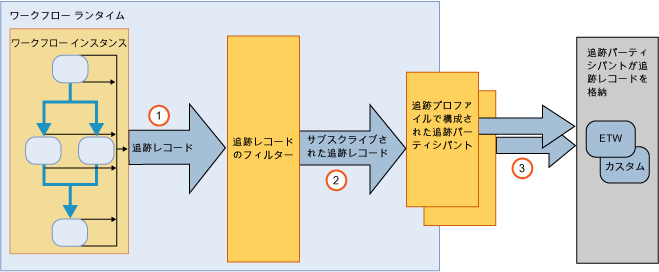

# ワークフロー追跡とトレース
Windows ワークフロー追跡は、ワークフローの実行を確認できるように設計された [!INCLUDE[netfx_current_long](../../../includes/netfx-current-long-md.md)] の機能です。 また、ワークフロー インスタンスの実行を追跡できる追跡インフラストラクチャが用意されています。 WF 追跡インフラストラクチャはワークフローを透過的にインストルメント化し、実行中の主要イベントを反映してレコードを出力します。 この機能はすべての [!INCLUDE[netfx_current_short](../../../includes/netfx-current-short-md.md)] ワークフローから既定で使用できます。 [!INCLUDE[netfx_current_long](../../../includes/netfx-current-long-md.md)] ワークフローで追跡を実行するために変更は必要ありません。 必要なのは、受信する追跡データの量を決定することのみです。 ワークフロー インスタンスが開始または完了すると、追跡レコードの処理が出力されます。 また、追跡によって、ワークフロー変数に関連付けられたビジネス関連データを抽出することもできます。 たとえば、ワークフローが注文処理システムを表している場合、注文 ID と共に <xref:System.Activities.Tracking.TrackingRecord> オブジェクトを抽出できます。 一般的に、WF 追跡機能を有効にすると、ワークフローの実行から診断またはビジネス分析データにアクセスしやすくなります。  
  
 これらの追跡コンポーネントは、[!INCLUDE[vstecwinfx](../../../includes/vstecwinfx-md.md)] の追跡サービスと同等です。 [!INCLUDE[netfx_current_short](../../../includes/netfx-current-short-md.md)] では、WF 追跡機能のパフォーマンスが改善され、プログラミング モデルが簡略化されました。 追跡ランタイムがワークフロー インスタンスをインストルメント化し、ワークフローのライフ サイクル、ワークフロー アクティビティ、およびカスタム イベント関連のイベントを出力します。  
  
 Windows Server App Fabric は、WCF とワーク フロー サービスの実行を監視することもできます。 詳細については、次を参照してください[Windows Server App Fabric の監視](http://go.microsoft.com/fwlink/?LinkId=201273)と[Windows Server AppFabric によるアプリケーションの監視。](http://go.microsoft.com/fwlink/?LinkId=201287)  
  
 ワークフロー ランタイムの問題を解決するには、診断ワークフロー追跡を有効にします。 詳細については、次を参照してください。[ワークフロー トレース](../../../docs/framework/windows-workflow-foundation/workflow-tracing.md)です。  
  
 プログラミング モデルを理解するには、追跡インフラストラクチャの主要コンポーネントに関するトピックの説明を参照してください。  
  
-   <xref:System.Activities.Tracking.TrackingRecord> オブジェクトは、ワークフロー ランタイムから取得します。 詳細については、次を参照してください。[追跡レコード](../../../docs/framework/windows-workflow-foundation/tracking-records.md)です。  
  
-   <xref:System.Activities.Tracking.TrackingParticipant> オブジェクトは <xref:System.Activities.Tracking.TrackingRecord> オブジェクトに定期受信します。 追跡参加要素には、<xref:System.Activities.Tracking.TrackingRecord> オブジェクトのペイロードを処理するロジックがありません (たとえば、ファイルに書き込むことができるなど)。 詳細については、次を参照してください。[追跡参加要素](../../../docs/framework/windows-workflow-foundation/tracking-participants.md)です。  
  
-   <xref:System.Activities.Tracking.TrackingProfile> オブジェクトは、ワークフロー インスタンスから出力された追跡レコードをフィルター処理します。 詳細については、次を参照してください。[追跡プロファイル](../../../docs/framework/windows-workflow-foundation/tracking-profiles.md)です。  
  
## ワークフロー追跡インフラストラクチャ  
 ワークフロー追跡インフラストラクチャは、パブリッシュおよび定期受信のパラダイムに従っています。 ワークフロー インスタンスは追跡レコードのパブリッシャーですが、追跡レコードのサブスクライバーはワークフローに対する拡張として登録されます。 <xref:System.Activities.Tracking.TrackingRecord> オブジェクトに定期受信するこれらの拡張は、追跡参加要素と呼ばれます。 追跡参加要素は、<xref:System.Activities.Tracking.TrackingRecord> オブジェクトにアクセスし、そのための書き込み方法にかかわらず処理する機能拡張ポイントです。 追跡インフラストラクチャを使用すると、送信の追跡レコードにフィルターを適用して、参加要素からレコードのサブセットに定期受信できるようになります。 このフィルター機構は追跡プロファイル ファイルによって実現します。  
  
 追跡インフラストラクチャの概要図を次に示します。  
  
   
  
## このセクションの内容  
 [追跡レコード](../../../docs/framework/windows-workflow-foundation/tracking-records.md)  
 ワークフロー ランタイムが出力する追跡レコードについて説明します。  
  
 [追跡プロファイル](../../../docs/framework/windows-workflow-foundation/tracking-profiles.md)  
 追跡プロファイルを使用する方法について説明します。  
  
 [追跡参加要素](../../../docs/framework/windows-workflow-foundation/tracking-participants.md)  
 システム標準の追跡参加要素を使用する方法またはカスタムの追跡参加要素を作成する方法について説明します。  
  
 [ワークフローの追跡の構成](../../../docs/framework/windows-workflow-foundation/configuring-tracking-for-a-workflow.md)  
 ワークフローの追跡を構成する方法について説明します。  
  
 [ワークフロー トレース](../../../docs/framework/windows-workflow-foundation/workflow-tracing.md)  
 ワークフローのデバッグ追跡を有効にする 2 つの方法について説明します。  
  
 [トレースを使用したワークフロー実行時間の決定](../../../docs/framework/windows-workflow-foundation/determining-workflow-execution-duration-using-tracing.md)  
 トレース メッセージを使用してワークフローの実行時間を決定する方法を説明します。  
  
## 関連項目  
 [SQL 追跡](../../../docs/framework/windows-workflow-foundation/samples/sql-tracking.md)
