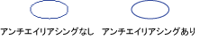

# 直線と曲線のアンチエイリアシング
使用すると[!INCLUDE[ndptecgdiplus](../../../../includes/ndptecgdiplus-md.md)]線を描画するには、開始点と、1 行の終了点を提供するが、行に個々 のピクセルに関する情報を指定する必要はありません。 [!INCLUDE[ndptecgdiplus](../../../../includes/ndptecgdiplus-md.md)] どのピクセルはオンにする特定のディスプレイ デバイスで、行の表示を決定するディスプレイ ドライバー ソフトウェアと連携して動作します。  
  
## エイリアス  
 (4, 2) のポイントからは点 (16, 10) に移動するまっすぐ赤い線を検討してください。 座標系では、左上隅の原点とメジャーの単位がピクセルであることを想定しています。 X 軸がダウンして、右、y 軸を指していると想定されます。 次の図は、色付きの背景に描画される赤色の線の拡大表示を示します。  
  
   
  
 行を表示するために使用される赤いピクセルは不透明です。 行には、部分的に透明はありません。 この種類の行の表示は、行、ギザギザと行では、階段します。 この手法を表す線、階段のエイリアスと呼びます階段は、理論上の行のエイリアスです。  
  
## アンチエイリアシング  
 不透明なピクセルおよび半透明なピクセルを使用して行を表示するためのより高度な手法が含まれます。 ピクセルが、純粋な赤に設定または赤の背景色をブレンド、閉じる方法によっては行にします。 この種類のレンダリングのアンチエイリアシングと人間の目がより滑らかとして認識するための行の結果します。 次の図は、アンチ エイリアス処理された行を生成するためにバック グラウンドで特定のピクセルを統合する方法を示します。  
  
   
  
 スムージングとも呼ばれます (アンチエイリアシング) は、曲線にも適用できます。 次の図は、平滑化された楕円の拡大表示を示します。  
  
   
  
 次の図は、実際のサイズ、1 回 (アンチエイリアシング) と 1 回 (アンチエイリアシング) で同じ楕円を示します。  
  
   
  
 直線と曲線のアンチエイリアシングの使用を描画するには、インスタンスを作成する、<xref:System.Drawing.Graphics>クラスし、設定、<xref:System.Drawing.Graphics.SmoothingMode%2A>プロパティを<xref:System.Drawing.Drawing2D.SmoothingMode.AntiAlias>または<xref:System.Drawing.Drawing2D.SmoothingMode.HighQuality>です。 描画メソッドの 1 つを同じに呼び出して<xref:System.Drawing.Graphics>クラスです。  
  
 [!code-csharp[LinesCurvesAndShapes#81](../../../../samples/snippets/csharp/VS_Snippets_Winforms/LinesCurvesAndShapes/CS/Class1.cs#81)]
 [!code-vb[LinesCurvesAndShapes#81](../../../../samples/snippets/visualbasic/VS_Snippets_Winforms/LinesCurvesAndShapes/VB/Class1.vb#81)]  
  
## 関連項目  
 <xref:System.Drawing.Drawing2D.SmoothingMode?displayProperty=nameWithType>  
 [直線、曲線、および図形](../../../../docs/framework/winforms/advanced/lines-curves-and-shapes.md)  
 [方法: テキストでのアンチエイリアシングの使用](../../../../docs/framework/winforms/advanced/how-to-use-antialiasing-with-text.md)
