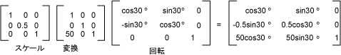

# グローバル変換とローカル変換
グローバル変換によって描画されたすべての項目に適用される変換とは、指定された<xref:System.Drawing.Graphics>オブジェクト。 これに対し、ローカルの変換は、描画する特定の項目に適用される変換です。  
  
## グローバル変換  
 グローバル変換を作成するには、構築、<xref:System.Drawing.Graphics>オブジェクト、および操作し、その<xref:System.Drawing.Graphics.Transform%2A>プロパティです。 <xref:System.Drawing.Graphics.Transform%2A>プロパティは、<xref:System.Drawing.Drawing2D.Matrix>オブジェクト、アフィン変換の任意のシーケンスを保持できるようにします。 格納されている、変換、<xref:System.Drawing.Graphics.Transform%2A>プロパティはワールド変換と呼ばれます。 <xref:System.Drawing.Graphics>クラス複合のワールド変換を作成するためのいくつかのメソッドを提供します。 <xref:System.Drawing.Graphics.MultiplyTransform%2A>、 <xref:System.Drawing.Graphics.RotateTransform%2A>、 <xref:System.Drawing.Graphics.ScaleTransform%2A>、および<xref:System.Drawing.Graphics.TranslateTransform%2A>です。 次の例は 2 回楕円を描画: ワールド変換と後に 1 回作成する前に一度だけです。 変換は 0.5 の y 方向のスケーリング 50 単位の x 方向の平行移動し、30 度を回転します。  
  
 [!code-csharp[System.Drawing.CoordinateSystems#21](../../../../samples/snippets/csharp/VS_Snippets_Winforms/System.Drawing.CoordinateSystems/CS/Class1.cs#21)]
 [!code-vb[System.Drawing.CoordinateSystems#21](../../../../samples/snippets/visualbasic/VS_Snippets_Winforms/System.Drawing.CoordinateSystems/VB/Class1.vb#21)]  
  
 次の図は、変換に関係する、マトリックスを示します。  
  
   
  
> [!NOTE]
>  上記の例では、クライアント領域の左上隅にある座標系の原点を基点楕円を回転します。 これには、回転の中心楕円異なる結果が生成されます。  
  
## ローカル変換  
 描画する特定の項目にローカルの変換が適用されます。 たとえば、<xref:System.Drawing.Drawing2D.GraphicsPath>オブジェクトには、<xref:System.Drawing.Drawing2D.GraphicsPath.Transform%2A>メソッドを使用すると、そのパスのデータ ポイントに変換します。 次の例では、変換なしを含む四角形と回転変換を使用したパスを描画します。 (ワールド変換がないことを想定)。  
  
 [!code-csharp[System.Drawing.CoordinateSystems#22](../../../../samples/snippets/csharp/VS_Snippets_Winforms/System.Drawing.CoordinateSystems/CS/Class1.cs#22)]
 [!code-vb[System.Drawing.CoordinateSystems#22](../../../../samples/snippets/visualbasic/VS_Snippets_Winforms/System.Drawing.CoordinateSystems/VB/Class1.vb#22)]  
  
 ワールド変換と、さまざまな結果を実現するためにローカルの変換を組み合わせることができます。 たとえば、座標系を変更して、ローカルの変換を使用して回転新しい座標系で描画されるオブジェクトを拡大/縮小するワールド変換を使用することができます。  
  
 クライアント領域の左端から配信元の 200 ピクセルとクライアント領域の上部から 150 ピクセルを持つ座標系たいとします。 さらに、ピクセル、権限、および上向きの y 軸を指している x 軸に単位にすることを想定しています。 既定の座標システムでは、水平軸に沿って、リフレクションを実行する必要があります、下向き、y 軸があります。 次の図は、このようなリフレクションのマトリックスを示します。  
  
   
  
 次に、右側に翻訳 200 単位と 150 の単位を実行する必要があると仮定します。  
  
 次の例は、上記で説明したのワールド変換を設定して、座標系を確立、<xref:System.Drawing.Graphics>オブジェクト。  
  
 [!code-csharp[System.Drawing.CoordinateSystems#23](../../../../samples/snippets/csharp/VS_Snippets_Winforms/System.Drawing.CoordinateSystems/CS/Class1.cs#23)]
 [!code-vb[System.Drawing.CoordinateSystems#23](../../../../samples/snippets/visualbasic/VS_Snippets_Winforms/System.Drawing.CoordinateSystems/VB/Class1.vb#23)]  
  
 (前の例の最後に配置)、次のコードでは、新しい座標系の原点の左下隅で 1 つの四角形で構成されるパスを作成します。 四角形は、ローカルの変換なしで 1 回、および変換をローカルに 1 回入力されます。 ローカルの変換係数 30 ° 回転を続けて 2 で水平方向のスケーリングで構成されます。  
  
 [!code-csharp[System.Drawing.CoordinateSystems#24](../../../../samples/snippets/csharp/VS_Snippets_Winforms/System.Drawing.CoordinateSystems/CS/Class1.cs#24)]
 [!code-vb[System.Drawing.CoordinateSystems#24](../../../../samples/snippets/visualbasic/VS_Snippets_Winforms/System.Drawing.CoordinateSystems/VB/Class1.vb#24)]  
  
 次の図は、新しい座標系と 2 つの四角形を示します。  
  
   
  
## 関連項目  
 [座標系と変換](../../../../docs/framework/winforms/advanced/coordinate-systems-and-transformations.md)  
 [マネージ GDI+ での変換の使用](../../../../docs/framework/winforms/advanced/using-transformations-in-managed-gdi.md)
