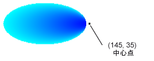

# 方法 : パス グラデーションを作成する
<xref:System.Drawing.Drawing2D.PathGradientBrush>クラスでは、徐々 に変化する色に図形を塗りつぶす方法をカスタマイズすることができます。 たとえば、パスの中央の 1 つの色とパスの境界に別の色を指定できます。 別の色は、各パスの境界上にある点も指定できます。  
  
> [!NOTE]
>  [!INCLUDE[ndptecgdiplus](../../../../includes/ndptecgdiplus-md.md)]、一連の直線と曲線で保持されている場合、パスを<xref:System.Drawing.Drawing2D.GraphicsPath>オブジェクト。 詳細については[!INCLUDE[ndptecgdiplus](../../../../includes/ndptecgdiplus-md.md)]、パスを参照してください[GDI + でのグラフィックス パス](../../../../docs/framework/winforms/advanced/graphics-paths-in-gdi.md)と[図面のパスの作成および](../../../../docs/framework/winforms/advanced/constructing-and-drawing-paths.md)です。  
  
### パス グラデーションを使用して、省略記号を入力するには  
  
-   次の例では、パス グラデーション ブラシで楕円を塗りつぶします。 中心の色を青に設定され、境界の色がアクアに設定されます。 次の図は、塗りつぶされた楕円を示します。  
  
       
  
     既定では、パス グラデーション ブラシは、パスの境界の外側には拡張されません。 パスの境界を越える図形を塗りつぶすパス グラデーション ブラシを使用する場合、パスの外側、画面の領域は埋められません。  
  
     次の図に変更する場合の対処、<xref:System.Drawing.Graphics.FillEllipse%2A>で次のコードを呼び出す`e.Graphics.FillRectangle(pthGrBrush, 0, 10, 200, 40)`です。  
  
       
  
     [!code-csharp[System.Drawing.UsingaGradientBrush#11](../../../../samples/snippets/csharp/VS_Snippets_Winforms/System.Drawing.UsingaGradientBrush/CS/Class1.cs#11)]
     [!code-vb[System.Drawing.UsingaGradientBrush#11](../../../../samples/snippets/visualbasic/VS_Snippets_Winforms/System.Drawing.UsingaGradientBrush/VB/Class1.vb#11)]  
  
     前のコード例が、Windows フォームで使用するために設計されていて、必要があります、 <xref:System.Windows.Forms.PaintEventArgs> e、これは、パラメーターの<xref:System.Windows.Forms.PaintEventHandler>します。  
  
### 境界でポイントを指定するには  
  
-   次の例では、星型のパスからパス グラデーション ブラシを構築します。 コード セット、<xref:System.Drawing.Drawing2D.PathGradientBrush.CenterColor%2A>赤に星の重心で色を設定するプロパティです。 コードを設定してから、<xref:System.Drawing.Drawing2D.PathGradientBrush.SurroundColors%2A>プロパティをさまざまな色を指定する (に格納されている、`colors`配列) 内の個々 の時点で、`points`配列。 最後のコード ステートメントは、パス グラデーション ブラシで星型のパスを設定します。  
  
     [!code-csharp[System.Drawing.UsingaGradientBrush#12](../../../../samples/snippets/csharp/VS_Snippets_Winforms/System.Drawing.UsingaGradientBrush/CS/Class1.cs#12)]
     [!code-vb[System.Drawing.UsingaGradientBrush#12](../../../../samples/snippets/visualbasic/VS_Snippets_Winforms/System.Drawing.UsingaGradientBrush/VB/Class1.vb#12)]  
  
-   次の例がパス グラデーションなしを描画する<xref:System.Drawing.Drawing2D.GraphicsPath>コード内のオブジェクト。 特定<xref:System.Drawing.Drawing2D.PathGradientBrush.%23ctor%2A>コンス トラクターの例では、点の配列を受け取りますは必要ありません、<xref:System.Drawing.Drawing2D.GraphicsPath>オブジェクト。 また、<xref:System.Drawing.Drawing2D.PathGradientBrush>パスではなく、四角形の塗りつぶしに使用します。 四角形は、ブラシを定義するブラシで描画四角形の一部がないようにするために使用する閉じたパスよりも大きくなります。 次の図は、四角形 (点線) およびパス グラデーション ブラシで描画された四角形の部分を示します。  
  
       
  
     [!code-csharp[System.Drawing.UsingaGradientBrush#13](../../../../samples/snippets/csharp/VS_Snippets_Winforms/System.Drawing.UsingaGradientBrush/CS/Class1.cs#13)]
     [!code-vb[System.Drawing.UsingaGradientBrush#13](../../../../samples/snippets/visualbasic/VS_Snippets_Winforms/System.Drawing.UsingaGradientBrush/VB/Class1.vb#13)]  
  
### パス グラデーションをカスタマイズするには  
  
-   パス グラデーション ブラシをカスタマイズする方法の 1 つは設定をその<xref:System.Drawing.Drawing2D.PathGradientBrush.FocusScales%2A>プロパティです。 フォーカス スケールでは、メインのパスの内側にある内部のパスを指定します。 中心点にのみではなく、内部パスの内側、中心の色がどこからでも表示されます。  
  
     次の例では、楕円のパスに基づくパス グラデーション ブラシを作成します。 コードは、境界の色を青を設定、アクア、中心の色に設定し、パス グラデーション ブラシを使用して、楕円のパスを入力します。  
  
     次に、コードは、パス グラデーション ブラシのフォーカスのスケールを設定します。 0.3、x フォーカス スケールが設定され、0.8 に y フォーカス スケールが設定されています。 コードの呼び出し、<xref:System.Drawing.Graphics.TranslateTransform%2A>のメソッド、<xref:System.Drawing.Graphics>オブジェクトを後続の呼び出し<xref:System.Drawing.Graphics.FillPath%2A>最初の省略記号の右側に配置される楕円を塗りつぶします。  
  
     フォーカス スケールの効果を表示するには、メインの省略記号とその中心を共有する小さな楕円を想像してください。 小さな (内部) 楕円は、メインの楕円 0.3 の要因によって、垂直方向に 0.8 の係数 (その中心) 水平方向に拡張です。 外部の楕円の境界から内側の楕円の境界を移動すると、色が徐々 に変化青からアクアにします。 ように内部の楕円の境界から移動するには、共有センター水色の色のままにします。  
  
     以下のコードの出力を次の図に示します。 左側の楕円は、中心点にのみアクアです。 右側の省略記号は、内側のパス内のどこからでもアクアです。  
  
   
  
 [!code-csharp[System.Drawing.UsingaGradientBrush#14](../../../../samples/snippets/csharp/VS_Snippets_Winforms/System.Drawing.UsingaGradientBrush/CS/Class1.cs#14)]
 [!code-vb[System.Drawing.UsingaGradientBrush#14](../../../../samples/snippets/visualbasic/VS_Snippets_Winforms/System.Drawing.UsingaGradientBrush/VB/Class1.vb#14)]  
  
### 補間を使用してカスタマイズするには  
  
-   パス グラデーション ブラシをカスタマイズする別の方法では、補間の位置の配列と interpolation 色の配列を指定します。  
  
     次の例では、三角形に基づくパス グラデーション ブラシを作成します。 コード セット、 <xref:System.Drawing.Drawing2D.PathGradientBrush.InterpolationColors%2A> interpolation 色 (濃い緑、アクア、青) の配列と補間の位置 (0, 0.25, 1) の配列を指定するパス グラデーション ブラシのプロパティです。 三角形の境界からの中心点に移動すると、色が徐々 に変化濃い緑から水色に、青にアクアからです。 青に濃い緑からの距離の 25% で、濃い緑からアクアへの変更が行われます。  
  
     次の図は、カスタム パス グラデーション ブラシと塗りつぶされた三角形を示します。  
  
       
  
     [!code-csharp[System.Drawing.UsingaGradientBrush#15](../../../../samples/snippets/csharp/VS_Snippets_Winforms/System.Drawing.UsingaGradientBrush/CS/Class1.cs#15)]
     [!code-vb[System.Drawing.UsingaGradientBrush#15](../../../../samples/snippets/visualbasic/VS_Snippets_Winforms/System.Drawing.UsingaGradientBrush/VB/Class1.vb#15)]  
  
### 中心点を設定するには  
  
-   既定では、パス グラデーション ブラシの中心点は、ブラシを構築するために使用されるパスの重心でです。 中心点の場所を変更するには設定して、<xref:System.Drawing.Drawing2D.PathGradientBrush.CenterPoint%2A>のプロパティ、<xref:System.Drawing.Drawing2D.PathGradientBrush>クラスです。  
  
     次の例では、楕円に基づくパス グラデーション ブラシを作成します。 楕円の中心 (70、35) に設定されているパス グラデーション ブラシの中心点が、(120, 40)。  
  
     [!code-csharp[System.Drawing.UsingaGradientBrush#16](../../../../samples/snippets/csharp/VS_Snippets_Winforms/System.Drawing.UsingaGradientBrush/CS/Class1.cs#16)]
     [!code-vb[System.Drawing.UsingaGradientBrush#16](../../../../samples/snippets/visualbasic/VS_Snippets_Winforms/System.Drawing.UsingaGradientBrush/VB/Class1.vb#16)]  
  
     次の図は、塗りつぶされた楕円およびパス グラデーション ブラシの中心点を示します。  
  
       
  
-   ブラシを構築するために使用されたパスの外側の場所にパス グラデーション ブラシの中心点を設定できます。 次の例を設定する呼び出しが置き換えられます、<xref:System.Drawing.Drawing2D.PathGradientBrush.CenterPoint%2A>前述のコードでのプロパティです。  
  
     [!code-csharp[System.Drawing.UsingaGradientBrush#17](../../../../samples/snippets/csharp/VS_Snippets_Winforms/System.Drawing.UsingaGradientBrush/CS/Class1.cs#17)]
     [!code-vb[System.Drawing.UsingaGradientBrush#17](../../../../samples/snippets/visualbasic/VS_Snippets_Winforms/System.Drawing.UsingaGradientBrush/VB/Class1.vb#17)]  
  
     次の図は、この変更により、出力を示します。  
  
       
  
     前の図では、楕円の右端にあるポイントは純粋な青 (ただし、これらは非常に類似) グラデーションの色は、塗りつぶしの色が純粋な青 (0, 0, 255) をするとポイント (145, 35) に到達してかのように配置されます。 塗りつぶしに到達しないが、(145, 35) ため、そのパス内でのみパス グラデーション ブラシを描画します。  
  
## コードのコンパイル  
 前の例は、Windows フォームで使用する用に設計され、必要な<xref:System.Windows.Forms.PaintEventArgs>`e`はのパラメーターである、<xref:System.Windows.Forms.Control.Paint>イベント ハンドラー。  
  
## 関連項目  
 [グラデーション ブラシを使用した図形の塗りつぶし](../../../../docs/framework/winforms/advanced/using-a-gradient-brush-to-fill-shapes.md)
