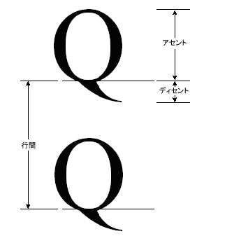

# 方法 : フォント メトリックを取得する
<xref:System.Drawing.FontFamily>クラスがファミリ/スタイルの特定の組み合わせに対するさまざまなメトリックを取得する次のメソッドを提供します。  
  
-   <xref:System.Drawing.FontFamily.GetEmHeight%2A>(FontStyle)  
  
-   <xref:System.Drawing.FontFamily.GetCellAscent%2A>(FontStyle)  
  
-   <xref:System.Drawing.FontFamily.GetCellDescent%2A>(FontStyle)  
  
-   <xref:System.Drawing.FontFamily.GetLineSpacing%2A>(FontStyle)  
  
 これらのメソッドによって返される数値をフォント デザイン単位でのサイズと、特定のユニットの独立したに<xref:System.Drawing.Font>オブジェクト。  
  
 次の図は、さまざまな指標を示します。  
  
   
  
## 例  
 次の例では、Arial フォント ファミリの標準のスタイルのメトリックを表示します。 コードでも作成、 <xref:System.Drawing.Font> 16 ピクセルのサイズと、その特定のピクセル単位のメトリックが表示されます (Arial ファミリに基づく) オブジェクト<xref:System.Drawing.Font>オブジェクト。  
  
 次の図は、コード例の出力を示します。  
  
   
  
 前の図では出力の最初の 2 つの行に注意してください。 <xref:System.Drawing.Font>オブジェクトは、16 のサイズを返しますと<xref:System.Drawing.FontFamily>オブジェクトは、em 高の 2,048 を返します。 これら 2 つの数値 (16 と 2,048) は、キーをフォント デザイン単位と、単位 (この場合はピクセル) の間の変換、<xref:System.Drawing.Font>オブジェクト。  
  
 たとえば、次のようにアセントをデザイン単位からピクセルに変換できます。  
  
   
  
 次のコードを配置テキスト垂直方向に設定して、<xref:System.Drawing.PointF.Y%2A>のデータ メンバー、<xref:System.Drawing.PointF>オブジェクト。 Y 座標が増加して`font.Height`テキストの改行します。 <xref:System.Drawing.Font.Height%2A>のプロパティ、<xref:System.Drawing.Font>オブジェクトは、その特定の行間 (ピクセル単位) でを返します<xref:System.Drawing.Font>オブジェクト。 この例では、によって返される数<xref:System.Drawing.Font.Height%2A>は 19 です。 これが行間隔をピクセル単位に変換することによって得られる数値 (整数に切り上げられます) と同じであることに注意してください。  
  
 Em 高 (サイズまたは em サイズとも呼ばれます) がアセントと降下の合計ではないことに注意してください。 アセントと降下の合計には、セルの高さが呼び出されます。 内部の先頭から引いたセルの高さは、em の高さと同じです。 セルの高さと外部の先頭には、線の間隔と同じです。  
  
 [!code-csharp[System.Drawing.FontsAndText#71](../../../../samples/snippets/csharp/VS_Snippets_Winforms/System.Drawing.FontsAndText/CS/Class1.cs#71)]
 [!code-vb[System.Drawing.FontsAndText#71](../../../../samples/snippets/visualbasic/VS_Snippets_Winforms/System.Drawing.FontsAndText/VB/Class1.vb#71)]  
  
## コードのコンパイル  
 前の例は、Windows フォームで使用するために設計されていて、<xref:System.Windows.Forms.PaintEventHandler> のパラメーターである <xref:System.Windows.Forms.PaintEventArgs> `e` を必要とします。  
  
## 関連項目  
 [Windows フォームにおけるグラフィックスと描画](../../../../docs/framework/winforms/advanced/graphics-and-drawing-in-windows-forms.md)  
 [フォントとテキストの使用](../../../../docs/framework/winforms/advanced/using-fonts-and-text.md)
