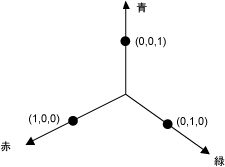
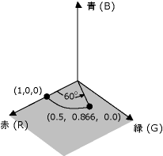
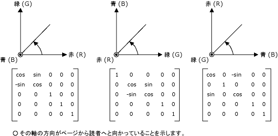
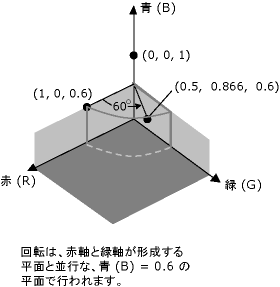

# 方法 : 色を回転させる
4 次元の色領域の回転は、視覚化するが困難です。 おやすくをいずれかの色要素を固定に同意することにより回転を視覚化します。 たとえば、アルファ コンポーネントを 1 に固定の (完全に不透明) を保持することに同意します。 次の図に示すように赤、緑、および青の軸を持つ 3 次元のカラー スペースを視覚化できます。  
  
   
  
 色は、3-D 空間内のポイントと考えることができます。 たとえば、領域で、ポイント (1, 0, 0) は色が赤を表し領域で、ポイント (0, 1, 0) が緑色の色を表します。  
  
 次の図は、(1, 0, 0) の色を回転する意味を示します、赤、緑の平面に 60 度の角度をします。 赤、緑の平面に平行な平面の回転は、青の軸を中心に回転と考えることができます。  
  
   
  
 次の図は、各 (赤、緑、青) の 3 つの座標の軸の回転を実行するカラー行列を初期化する方法を示します。  
  
   
  
## 例  
 次の例は、イメージを 1 つのすべての色 (1, 0, 0.6) は、青軸を中心 60 度回転を適用します。 回転の角度は赤、緑の平面に並列では、平面内をスイープします。  
  
 次の図は、左側と右側の色の回転後イメージの元のイメージを示します。  
  
   
  
 次の図は、次のコードで実行される色の回転の視覚エフェクトを示します。  
  
   
  
 [!code-csharp[System.Drawing.RotateColors#1](../../../../samples/snippets/csharp/VS_Snippets_Winforms/System.Drawing.RotateColors/CS/Form1.cs#1)]
 [!code-vb[System.Drawing.RotateColors#1](../../../../samples/snippets/visualbasic/VS_Snippets_Winforms/System.Drawing.RotateColors/VB/Form1.vb#1)]  
  
## コードのコンパイル  
 前の例は、Windows フォームで使用するために設計されていて、<xref:System.Windows.Forms.PaintEventArgs> イベント ハンドラーのパラメーターである `e`<xref:System.Windows.Forms.Control.Paint> を必要とします。 置き換える`RotationInput.bmp`イメージのファイル名と、システム上で有効なパスを使用します。  
  
## 関連項目  
 <xref:System.Drawing.Imaging.ColorMatrix>  
 <xref:System.Drawing.Imaging.ImageAttributes>  
 [Windows フォームにおけるグラフィックスと描画](../../../../docs/framework/winforms/advanced/graphics-and-drawing-in-windows-forms.md)  
 [イメージの色の変更](../../../../docs/framework/winforms/advanced/recoloring-images.md)
