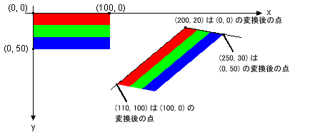

# 方法 : イメージを回転、反転、および傾斜させる
回転、反転、および元のイメージの左、右、上および左下コーナーの終点を指定することによって、イメージを傾けることができます。 次の 3 つのターゲット ポイントでは、元の四角形の画像を指定した平行四辺形にマップされるアフィン変換を決定します。  
  
## 例  
 たとえば、元のイメージが四角形の左上隅が (0, 0)、右上隅にある (100, 0)、および左下隅にある (0, 50)。 3 つの点を次のようにターゲット ポイントにマップするものとします。  
  
|元のポイント|コピー先のポイント|  
|--------------------|-----------------------|  
|左上隅 (0, 0)|(200, 20)|  
|右 (100, 0)|(110, 100)|  
|左下 (0, 50)|(250, 30)|  
  
 次の図は、元のイメージと平行四辺形にマップされているイメージを示します。 元のイメージがされて傾斜、反映、回転、および変換します。 元のイメージの上端に沿って、x 軸を実行している行にマップされている (200, 20) と (110, 100)。 元のイメージの左側に y 軸を実行している行にマップされている (200, 20) と (250, 30)。  
  
   
  
 次の図は、写真のイメージに適用されるような変換を示します。  
  
   
  
 次の図は、同じ変換をメタファイルに適用します。  
  
   
  
 次の例では、最初の図に示すようにイメージを生成します。  
  
 [!code-csharp[System.Drawing.WorkingWithImages#61](../../../../samples/snippets/csharp/VS_Snippets_Winforms/System.Drawing.WorkingWithImages/CS/Class1.cs#61)]
 [!code-vb[System.Drawing.WorkingWithImages#61](../../../../samples/snippets/visualbasic/VS_Snippets_Winforms/System.Drawing.WorkingWithImages/VB/Class1.vb#61)]  
  
## コードのコンパイル  
 前の例は、Windows フォームで使用するために設計されていて、<xref:System.Windows.Forms.PaintEventArgs> イベント ハンドラーのパラメーターである `e`<xref:System.Windows.Forms.Control.Paint> を必要とします。 必ず置き換えて`Stripes.bmp`をシステム上で有効であるイメージへのパス。  
  
## 関連項目  
 [イメージ、ビットマップ、アイコン、およびメタファイルの操作](../../../../docs/framework/winforms/advanced/working-with-images-bitmaps-icons-and-metafiles.md)
