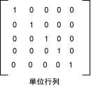

# 方法 : カラー行列を使用して単一色を変換する
[!INCLUDE[ndptecgdiplus](../../../../includes/ndptecgdiplus-md.md)] 提供、<xref:System.Drawing.Image>と<xref:System.Drawing.Bitmap>を格納して、画像を操作するためのクラスです。 <xref:System.Drawing.Image> および<xref:System.Drawing.Bitmap>オブジェクトに格納する 32 ビット数値として各ピクセルの色: 赤、緑、青、および alpha にそれぞれ 8 ビットです。 4 つのコンポーネントのそれぞれは、0 ~ 255 の輝度がないと 255 は最大の輝度を表す、0 から番号です。 アルファ コンポーネントは、色の透明度を指定します。 0 は完全に透過的であり、255 は完全に不透明です。  
  
 カラー ベクターは、(赤、緑、青、alpha) 形式の 4 タプルです。 たとえば、色ベクトル (0、255, 0, 255) が存在せず、赤または青、緑を輝度が完全では不透明な色を表します。  
  
 色を表すための別の規則は、最大の輝度番号 1 を使用します。 その規則を使用して、前の段落で説明されている色で表されます (0、1, 0, 1) のベクトル。 [!INCLUDE[ndptecgdiplus](../../../../includes/ndptecgdiplus-md.md)] 色の変換を実行するときは、最大の輝度を 1 の規則を使用します。  
  
 4 × 4 行列によって色ベクトルを乗算することによって、カラー ベクターに (回転、スケーリング、および、like) の線形変換を適用できます。 ただし、線形変換を実行するのに 4 × 4 行列を使用することはできません。 各色ベクター ダミー 5 番目の座標 (たとえば、番号 1) を追加する場合は、線形変換および変換の任意の組み合わせを適用する 5 × 5 マトリックスを使用できます。 続いて平行線形変換の変換は、アフィン変換と呼ばれます。  
  
 たとえば、色 (0.2、0.0、0.4, 1.0) で起動して次の変換を適用するとします。  
  
1.  赤の成分倍精度浮動小数点  
  
2.  赤、緑、および青のコンポーネントを 0.2 を追加します。  
  
 次行列乗算では、変換のペアを順に実行します。  
  
   
  
 カラー行列の要素は、行と列 (0 から始まる) インデックス付けられます。 たとえば、5 番目の行およびマトリックス M の 3 列目のエントリは、M [4] [2] で表されます。  
  
 5 × 5 単位行列で、次の図に示す) は、対角線上の 1 と 0 それ以外の場所がします。 単位行列でカラー ベクトルを乗算する場合、色のベクターは変更されません。 カラー変換の行列を形成する便利な方法では、単位行列で開始し、少しの変更を必要な変換を生成します。  
  
   
  
 マトリックスと変換の詳細については、次を参照してください。[座標系と変換](../../../../docs/framework/winforms/advanced/coordinate-systems-and-transformations.md)です。  
  
## 例  
 次の例は、1 つのすべての色 (0.2、0.0、0.4, 1.0) は、前の段落で説明した変換を適用するイメージ。  
  
 次の図は、右側の左側に元のイメージと変換後のイメージを示します。  
  
   
  
 次の例のコードでは、次の手順を使用して、色の変更を実行します。  
  
1.  初期化、<xref:System.Drawing.Imaging.ColorMatrix>オブジェクト。  
  
2.  作成、<xref:System.Drawing.Imaging.ImageAttributes>オブジェクトを渡す、<xref:System.Drawing.Imaging.ColorMatrix>オブジェクトを<xref:System.Drawing.Imaging.ImageAttributes.SetColorMatrix%2A>のメソッド、<xref:System.Drawing.Imaging.ImageAttributes>オブジェクト。  
  
3.  渡す、<xref:System.Drawing.Imaging.ImageAttributes>オブジェクトを<xref:System.Drawing.Graphics.DrawImage%2A>のメソッド、<xref:System.Drawing.Graphics>オブジェクト。  
  
 [!code-csharp[System.Drawing.RecoloringImages#21](../../../../samples/snippets/csharp/VS_Snippets_Winforms/System.Drawing.RecoloringImages/CS/Class1.cs#21)]
 [!code-vb[System.Drawing.RecoloringImages#21](../../../../samples/snippets/visualbasic/VS_Snippets_Winforms/System.Drawing.RecoloringImages/VB/Class1.vb#21)]  
  
## コードのコンパイル  
 前の例は、Windows フォームで使用するために設計されていて、<xref:System.Windows.Forms.Control.Paint> イベント ハンドラーのパラメーターである <xref:System.Windows.Forms.PaintEventArgs> `e` を必要とします。  
  
## 関連項目  
 [イメージの色の変更](../../../../docs/framework/winforms/advanced/recoloring-images.md)  
 [座標系と変換](../../../../docs/framework/winforms/advanced/coordinate-systems-and-transformations.md)
