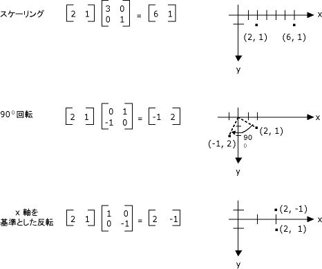
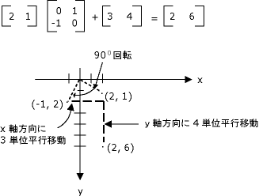
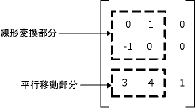

# 変換の行列表現
M × n マトリックスは、一連の数字が m 個の行と n 個の列に配置します。 次の図は、いくつかのマトリックスを示します。  
  
   
  
 個々 の要素を追加することで、同じサイズの 2 つの行列を作成できます。 次の図は、マトリックスの追加の 2 つの例を示します。  
  
   
  
 M × n 行列を乗算するためには、n × p 行列によってと、結果は m × p 行列。 1 番目の行列内の列の数は、2 番目の行列内の行の数と同じである必要があります。 たとえば、4 × 2 マトリックスは、4 × 3 マトリックスを生成するために 2 × 3 行列を掛けることができます。  
  
 平面と行およびマトリックスの列内のポイントは、ベクターと考えることができます。 たとえば、(2, 5) は、2 つのコンポーネントを持つベクトルと (3, 7, 1) は、3 つのコンポーネントを持つベクトル。 2 つのベクトルのドット積の定義は次のとおりです。  
  
 (a、b) • (c、d) = ac + bd  
  
 (a、b、c) • (d、e、f) = ad + する + cf  
  
 たとえばのドット積 (2, 3) と (5, 4) は (2)(5) + (3)(4) = 22。 (2, 5, 1) とのドット積と (4, 3, 1) が (2)(4) + (5)(3) + (1)(1) = 24。 2 つのベクトルのドット積は番号、別のベクトルであることに注意してください。 ドット積を計算できるは、2 つのベクトルのコンポーネントの数が同じ場合だけにも注意してください。  
  
 Let A(i, j) には、i 番目の行と jth 列の行列 A にエントリがあります。 たとえば、A (3, 2) の 3 番目の行と 2 番目の列の行列 A エントリです。 たとえば、A、B、および C は、マトリックス、および AB C. を =C のエントリは、次のように計算されます。  
  
 C (i, j) = (A の行 i) • (B の列 j)  
  
 次の図は、行列乗算のいくつかの例を示します。  
  
   
  
 1 x 2 行列平面上のポイントの場合は、2 × 2 の行列で乗算そのポイントを変換することができます。 次の図は、点 (2, 1) に適用されるいくつかの変換を示します。  
  
   
  
 すべての前の図に示すように、変換は、線形変換です。 変換など、他の特定の変換を使用して、線形ではありません、2 × 2 の行列で乗算では表現できません。 場合を考えます最初に、点 (2, 1)、90 ° 回転して、x 軸方向の 3 つの単位を変換および y 方向の 4 つの単位を変換します。 行列加算続けて行列乗算を使用して、これを行うことができます。  
  
   
  
 翻訳 (1 x 2 行列の追加) を続けて線形変換 (2 × 2 の行列で乗算) は、アフィン変換と呼ばれます。 マトリックス (1 つは線形) および変換用の 1 つのペアのアフィン変換を格納する代わりに 3 × 3 行列変換全体を格納を開始します。 この作業をするためには、平面内のポイントをダミー サード座標で 1 × 3 行列に格納する必要があります。 通常の手法はすべて 3 番目の座標を 1 にします。 たとえば、ポイント (2, 1) は、[2 1 1] マトリックスで表されます。 次の図に、アフィン変換 (90 度回転させます。 x 軸方向に 3 単位、y 方向の 4 つの単位に変換) で 1 つ 3 × 3 行列の乗算で表されます。  
  
   
  
 前の例では、点 (2, 1) は、ポイント (2, 6) にマップされます。 3 × 3 行列の 3 番目の列に数値 0, 0, 1 が含まれていることを注意してください。 アフィン変換の 3 × 3 行列の場合と常になります。 重要な数値は、列 1 および 2 の 6 つの番号です。 マトリックスの左上の 2 × 2 部分は、変換の線形の一部を表し、3 番目の行の最初の 2 つのエントリが平行移動を表します。  
  
   
  
 [!INCLUDE[ndptecgdiplus](../../../../includes/ndptecgdiplus-md.md)]でアフィン変換を格納することができます、<xref:System.Drawing.Drawing2D.Matrix>オブジェクト。 表すアフィン変換行列の 3 番目の列は常にあるため (0, 0, 1) を構築するとき、最初の 2 つの列で 6 つの数字のみを指定する、<xref:System.Drawing.Drawing2D.Matrix>オブジェクト。 ステートメント`Matrix myMatrix = new Matrix(0, 1, -1, 0, 3, 4)`前の図に示すように、マトリックスを構築します。  
  
## 複合変換  
 複合変換とは、変換後、その他の 1 つのシーケンスです。 マトリックスおよび次の一覧内の変換を考慮してください。  
  
|||  
|-|-|  
|行列 A|90 度回転します。|  
|マトリックス B|X 軸方向の 2 倍の拡大縮小します。|  
|マトリックス C|Y 方向の 3 つの単位に変換します。|  
  
 かどうかはまず、点 (2, 1): [2 1 1] マトリックスで表される — しを a、B、C、点 (2, 1) が使用される順番で 3 つの変換し、します。  
  
 [2 1 1]ABC = [-2 5 1]  
  
 はなく 3 つの独立した行列に複合変換の 3 つの部分を格納は、A を掛けることができますを複合変換全体を格納する 1 つの 3 倍 3 行列を取得するには、同時に、B、および C です。 たとえば、ABC D. を =D を掛けたポイントが A、B、C を掛けたポイントと同じ結果を提供し、  
  
 [2 1 1]D = [-2 5 1]  
  
 次の図に、A、B、C および D のマトリックス  
  
   
  
 複合変換の行列を個々 の変換行列を乗算することによって作成できますが、ファクトは 1 つのアフィン変換の任意のシーケンスを格納できることを意味<xref:System.Drawing.Drawing2D.Matrix>オブジェクト。  
  
> [!CAUTION]
>  複合変換の順序が重要です。 一般に、回転してから、スケールを設定し、変換が同じではありません、スケーリング、回転、しに変換します。 同様に、行列乗算の順序が重要です。 一般に、ABC はいない BAC と同じです。  
  
 <xref:System.Drawing.Drawing2D.Matrix>クラスが複合変換を作成するためのいくつかのメソッドを提供します。 <xref:System.Drawing.Drawing2D.Matrix.Multiply%2A>、 <xref:System.Drawing.Drawing2D.Matrix.Rotate%2A>、 <xref:System.Drawing.Drawing2D.Matrix.RotateAt%2A>、 <xref:System.Drawing.Drawing2D.Matrix.Scale%2A>、 <xref:System.Drawing.Drawing2D.Matrix.Shear%2A>、および<xref:System.Drawing.Drawing2D.Matrix.Translate%2A>です。 次の例では、回転角度 (30) し、y 方向の 2 倍のスケールを設定し、x 軸方向に 5 単位に変換する複合変換の行列を作成します。  
  
 [!code-csharp[System.Drawing.CoordinateSystems#11](../../../../samples/snippets/csharp/VS_Snippets_Winforms/System.Drawing.CoordinateSystems/CS/Class1.cs#11)]
 [!code-vb[System.Drawing.CoordinateSystems#11](../../../../samples/snippets/visualbasic/VS_Snippets_Winforms/System.Drawing.CoordinateSystems/VB/Class1.vb#11)]  
  
 次の図は、マトリックスを示します。  
  
   
  
## 関連項目  
 [座標系と変換](../../../../docs/framework/winforms/advanced/coordinate-systems-and-transformations.md)  
 [マネージ GDI+ での変換の使用](../../../../docs/framework/winforms/advanced/using-transformations-in-managed-gdi.md)
