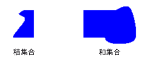
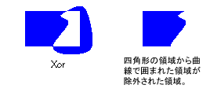

# GDI+ での領域
領域は、出力デバイスの表示領域の一部です。 領域には、単純な (1 つの四角形) または複合型 (多角形と閉じた曲線の組み合わせ) を指定できます。 次の図は、2 つの領域を示します: 四角形は、1 つ構築され、パスから構築されました。  
  
   
  
## 領域の使用  
 クリッピング頻繁に使用され、ヒット テスト領域にします。 クリッピングでは、更新する必要がある部分では通常、表示領域の特定の領域に描画を制限します。 ヒット テストするには、マウス ボタンが押されたときにカーソルが、画面の特定の領域にするかどうかを判断するチェックが含まれます。  
  
 四角形またはパスから地域を構築できます。 既存の領域を組み合わせることによって、複雑な領域を作成することもできます。 <xref:System.Drawing.Region>クラスは領域を結合するための次のメソッドを提供します。 <xref:System.Drawing.Region.Intersect%2A>、 <xref:System.Drawing.Region.Union%2A>、 <xref:System.Drawing.Region.Xor%2A>、 <xref:System.Drawing.Region.Exclude%2A>、および<xref:System.Drawing.Region.Complement%2A>です。  
  
 2 つのリージョンの積集合は、両方の地域に属しているすべての点のセットです。 共用体は、1 つまたはもう一方または両方の地域に属しているすべての点のセットです。 領域の補完は、すべてのポイントの領域に含まれていないセットです。 次の図は、積集合と前の図に示すように 2 つのリージョンの和集合を示します。  
  
   
  
 <xref:System.Drawing.Region.Xor%2A>地域のペアに適用される方法に属する 1 つの領域、または両方が、他のすべてのポイントを格納する領域を生成します。 <xref:System.Drawing.Region.Exclude%2A>地域のペアに適用される方法は 2 つ目の領域に含まれていない最初の領域内のすべてのポイントを含む領域を生成します。 次の図に、適用することに起因する地域、<xref:System.Drawing.Region.Xor%2A>と<xref:System.Drawing.Region.Exclude%2A>メソッドをこのトピックの冒頭に示した 2 つの領域。  
  
   
  
 領域を塗りつぶす必要があります、<xref:System.Drawing.Graphics>オブジェクト、<xref:System.Drawing.Brush>オブジェクト、および<xref:System.Drawing.Region>オブジェクト。 <xref:System.Drawing.Graphics>オブジェクトは、提供、<xref:System.Drawing.Graphics.FillRegion%2A>メソッド、および<xref:System.Drawing.Brush>オブジェクトは、塗りつぶし、色やパターンなどの属性を格納します。 次の例では、純色で領域を塗りつぶします。  
  
 [!code-csharp[LinesCurvesAndShapes#61](../../../../samples/snippets/csharp/VS_Snippets_Winforms/LinesCurvesAndShapes/CS/Class1.cs#61)]
 [!code-vb[LinesCurvesAndShapes#61](../../../../samples/snippets/visualbasic/VS_Snippets_Winforms/LinesCurvesAndShapes/VB/Class1.vb#61)]  
  
## 関連項目  
 <xref:System.Drawing.Region?displayProperty=nameWithType>  
 [直線、曲線、および図形](../../../../docs/framework/winforms/advanced/lines-curves-and-shapes.md)  
 [領域の使用](../../../../docs/framework/winforms/advanced/using-regions.md)
