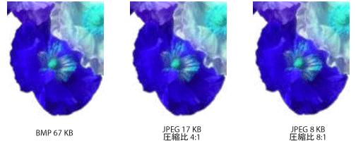

# ビットマップの種類
ビットマップは、ピクセルの四角形の配列に各ピクセルの色を指定するビットの配列です。 各ピクセルのビット数では、そのピクセルに割り当てることのできる色の数を決定します。 たとえば、各ピクセルが 4 ビットで表されている場合、指定されたピクセル割り当てることができる 16 色のいずれか (2 ^4 = 16)。 次の表は、指定したビット数で表されるピクセルに割り当てることのできる色の数のいくつかの例を示します。  
  
|ピクセルあたりのビット数|ピクセルに割り当てることのできる色の数|  
|--------------------|------------------------------------------------------|  
|1|2^1 = 2|  
|2|2^2 = 4|  
|4|2^4 = 16|  
|8|2^8 = 256|  
|16|2^16 = 65,536|  
|24|2^24 = 16,777,216|  
  
 通常、ビットマップを格納するディスク ファイルには、配列にビット/ピクセル、行ごとのピクセル数や行数の数などの情報を格納する 1 つまたは複数の情報ブロックが含まれます。 このようなファイルは、カラー テーブル (カラー パレットとも呼ばれます) を含めることも可能性があります。 カラー テーブルは、ビットマップ内の数値を特定の色にマップします。 次の図は、そのビットマップと色のテーブルと拡大したイメージを示します。 各ピクセルが 4 ビットの数字で表されるため、2 ^ カラー テーブル内の 4 = 16 色です。 24 ビット数で表される、テーブル内の各色: 赤の 8 ビット、8 ビット、緑、青の 8 ビットです。 数値が 16 進数 (基数 16) 形式で表示されます: A = 10、B = 11, C = 12、D = 13, E = 14、F 15 を = です。  
  
   
  
 行 3、イメージの列 5 のピクセルを見てください。 ビットマップ内の対応する数値は 1 です。 カラー テーブルによるとため、ピクセルは赤で色が赤が 1 を表すことにします。 ビットマップの一番上の行のすべてのエントリは 3 です。 カラー テーブルよる 3 に相当青、イメージの先頭の行にあるすべてのピクセルは青色ようにします。  
  
> [!NOTE]
>  一部のビットマップはボトムアップ形式で格納されています。ビットマップの最初の行番号は、イメージの一番下の行のピクセルに対応します。  
  
 カラー テーブルにインデックスを格納するビットマップは、パレット インデックス付きのビットマップと呼ばれます。 不要であるビットマップのカラー テーブルが必要です。 たとえば、ビットマップは、24 ビット/ピクセルを使用している場合そのビットマップできますに格納するインデックスではなく、カラー自体カラー テーブル。 次の図は、カラー テーブルを使用するのではなく直接色 (24 ビット/ピクセル) を格納するビットマップを示します。 図には、対応するイメージの拡大表示も示しています。 ビットマップで ffffff は白、ff0000 は赤、00ff00 は緑、および 0000ff は青です。  
  
   
  
## 画像ファイル  
 ディスク ファイルにビットマップを保存するための多くの標準の形式があります。 [!INCLUDE[ndptecgdiplus](../../../../includes/ndptecgdiplus-md.md)] グラフィックス ファイルの次の段落で説明する形式をサポートします。  
  
### BMP  
 BMP は、デバイスやアプリケーションに依存しないイメージを格納する、Windows で使用される標準的な形式です。 指定した BMP ファイル (1、4、8、15、24、32、または 64) をピクセルあたりのビット数は、ファイルのヘッダーで指定されます。 24 ビット/ピクセルの BMP ファイルは、共通です。 BMP 通常は圧縮されず、ファイル、そのため、転送に適してがインターネット経由でします。  
  
### グラフィックス インターチェンジ形式 (GIF)  
 GIF は、Web ページに表示される画像の一般的な形式です。 Gif 画像は、直線の描画、純色のブロックを使用し、色の間で境界が鮮明な画像の適切に動作します。 Gif 圧縮されますが、圧縮プロセスの情報が失われることはありません。圧縮解除されたイメージは、元と同じではまったくです。 イメージが表示される任意の Web ページの背景色を保持するように透明として GIF 内の 1 つの色を指定できます。 アニメーション GIF を形成する 1 つのファイルは、一連の GIF 画像を格納できます。 Gif 画像は、256 色に制限されることは済むように、ピクセルあたり最大で 8 ビットを保存します。  
  
### Joint Photographic Experts Group (JPEG)  
 JPEG は、スキャンした写真などの自然なシーンに有効な圧縮スキームです。 圧縮処理で一部の情報が失われることが多くの場合、損失は人間の目に比較的長いはありません。 Jpeg は、以上 1,600万色を表示できるように 24 ビット/ピクセルを格納します。 透明度やアニメーション、jpeg 形式はサポートされません。  
  
 JPEG 画像の圧縮のレベルは構成可能ですが、情報の詳細が失われる発生する圧縮レベルを高く (より小さいファイル)。 多くの場合、20:1 の圧縮比率は、人間の目が元から区別するが困難を検索するイメージを生成します。 次の図は、BMP イメージとその BMP イメージから圧縮された 2 つの JPEG 画像を示します。 最初の JPEG 4:1 の圧縮比率があり、2 番目の JPEG 約 8:1 の圧縮比率。  
  
   
  
 JPEG 圧縮はせず、直線の描画、純色のブロックの適切に動作して、境界をシャープな。 次の図は、と共に、2 つの Jpeg、GIF、BMP を示します。 Jpeg、GIF、BMP から圧縮されました。 圧縮比率は 4:1、GIF、4:1 の小さい JPEG 大きい JPEG の 8:3。 GIF、線、に沿って鮮明な境界を維持するが、境界をぼかす Jpeg 傾向があることに注意してください。  
  
   
  
 JPEG は、圧縮スキームであり、ファイル形式ではありません。 JPEG ファイル インターチェンジ形形式 (JFIF) は、一般的な用途を格納して、JPEG スキームによって圧縮されたイメージを転送するファイル形式です。 Web ブラウザーで表示される JFIF ファイルは、.jpg 拡張機能を使用します。  
  
### Exchangeable Image File (EXIF)  
 EXIF は、デジタル カメラでキャプチャした写真に使用されるファイル形式です。 EXIF ファイルには、JPEG の仕様に圧縮されたイメージが含まれています。 EXIF ファイルには、写真に関する情報も含まれています (表示された撮影日、シャッター速度、露出時間など) と (製造元、モデル、およびなど) のカメラに関する情報。  
  
### ポータブル ネットワーク グラフィックス (PNG)  
 PNG 形式は GIF 形式の利点の多くが保持されますが、GIF のもの以外の機能も提供します。 GIF ファイルと同様に、PNG ファイルは、情報の損失なしで圧縮されます。 PNG ファイルは、8、24、または 48 ビット/ピクセルや 1、2、4、8 のグレースケールまたは 16 ビット/ピクセルの色を格納できます。 これに対し、GIF ファイルでは、1 つだけ、2、4、または 8 ビット/ピクセルを使用できます。 PNG ファイルは、背景色とブレンドされますピクセルの色を程度を指定する、各ピクセルのアルファ値も格納できます。  
  
 Png GIF を徐々 にイメージを表示するには、その機能に (つまり、として、イメージの向上の概数を表示するが到着すると、ネットワーク接続経由で)。 PNG ファイルは、ディスプレイ デバイスのさまざまなに正確にイメージを表示することができるように、ガンマ補正と色補正の情報を含めることができます。  
  
### タグ イメージ ファイルの形式 (TIFF)  
 TIFF は、さまざまなプラットフォームとイメージ処理アプリケーションでサポートされている柔軟性と拡張性の高い形式です。 TIFF ファイルでは、ピクセルあたりのビット数の任意の数を含むイメージを格納することができます、さまざまな圧縮アルゴリズムを使用できます。 いくつかのイメージは、1 つ、複数のページの TIFF ファイルに格納できます。 (スキャナーの種類、ホスト コンピューター、型の圧縮、向き、1 つのピクセルのサンプル) のイメージに関連する情報をファイルに格納し、タグを使用して配置します。 TIFF 形式は、必要に応じて、承認および新しいタグの追加によって拡張できます。  
  
## 関連項目  
 <xref:System.Drawing.Image?displayProperty=nameWithType>  
 <xref:System.Drawing.Bitmap?displayProperty=nameWithType>  
 <xref:System.Drawing.Imaging.PixelFormat?displayProperty=nameWithType>  
 [イメージ、ビットマップ、メタファイル](../../../../docs/framework/winforms/advanced/images-bitmaps-and-metafiles.md)  
 [イメージ、ビットマップ、アイコン、およびメタファイルの操作](../../../../docs/framework/winforms/advanced/working-with-images-bitmaps-icons-and-metafiles.md)
