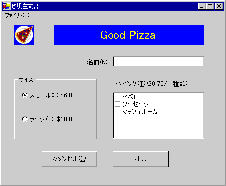

# <a name="walkthrough-creating-an-accessible-windows-based-application"></a>チュートリアル : ユーザー補助対応の Windows ベースのアプリケーションの作成
ユーザー補助に対応するアプリケーションを作成することは、ビジネスに重要な影響を与えます。 多くの政府は、ソフトウェアの購入に関するユーザー補助の規制があります。 Certified for Windows ロゴには、ユーザー補助に関する要件が含まれています。 米国だけでも 3000 万人 (その多くは潜在的な顧客) が、ソフトウェアのアクセシビリティ機能によって影響を受けると推定されています。  
  
 このチュートリアルにより、Certified for Windows ロゴの 5 つのユーザー補助機能の要件に対応します。 これらの要件によると、ユーザー補助機能を持つアプリケーションとは、次のようなアプリケーションです。  
  
-   コントロール パネルのサイズ、色、フォント、および入力設定をサポートします。 ユーザーがコントロール パネルの設定を変更すると、メニュー バー、タイトル バー、罫線、およびステータス バーはすべてサイズが変更されます。 このアプリケーションでは、コントロールまたはコードに追加の変更は必要ありません。  
  
-   ハイ コントラスト モードをサポートします。  
  
-   すべての機能に対して文書化されたキーボード アクセスを提供します。  
  
-   キーボード フォーカスの場所を視覚的およびプログラムで公開します。  
  
-   サウンドだけで重要な情報を伝達しないようにします。  
  
 詳細については、「[ユーザー補助アプリケーションのデザイン リソース](/visualstudio/ide/reference/resources-for-designing-accessible-applications)」を参照してください。  
  
 さまざまなキーボード レイアウトをサポートする方法については、「[推奨される国際対応アプリケーション開発手順](../../../../docs/standard/globalization-localization/best-practices-for-developing-world-ready-apps.md)」を参照してください。  
  
## <a name="creating-the-project"></a>プロジェクトの作成  
 このチュートリアルでは、ピザの注文を受け取るためのアプリケーションのユーザー インターフェイスを作成します。 顧客の名前のための <xref:System.Windows.Forms.TextBox>、ピザのサイズを選択する <xref:System.Windows.Forms.RadioButton> グループ、トッピングを選択するための <xref:System.Windows.Forms.CheckedListBox>、[注文] と [キャンセル] のラベルの付いた 2 つのボタン コントロール、および [終了] コマンドのあるメニューで構成されます。  
  
 ユーザーが、顧客の名前、ピザのサイズ、および希望のトッピングを入力します。 ユーザーが [注文] ボタンをクリックすると、メッセージ ボックスに注文の概要と値段が表示され、コントロールがクリアされて次の注文のために準備します。 ユーザーが [キャンセル] ボタンをクリックすると、コントロールがクリアされて、次の注文のための準備ができた状態になります。 ユーザーが [終了] メニュー項目をクリックすると、プログラムを閉じます。  
  
 このチュートリアルの重点は、販売注文システムのコードではなく、ユーザー インターフェイスのユーザー補助機能です。 このチュートリアルは、ボタン、オプション ボタン、テキスト ボックス、およびラベルなど、頻繁に使用されるいくつかのコントロールのユーザー補助機能を示します。  
  
#### <a name="to-begin-making-the-application"></a>アプリケーションの作成を開始するには  
  
-   Visual Basic または Visual c# では、新しい Windows アプリケーションを作成します。 プロジェクトに **PizzaOrder** という名前を付けます。 (詳細については、「[ソリューションとプロジェクトの作成](/visualstudio/ide/creating-solutions-and-projects)」を参照。)  
  
## <a name="adding-the-controls-to-the-form"></a>フォームへのコントロールの追加  
 フォームにコントロールを追加するときは、ユーザー補助に対応したアプリケーション作成のガイドラインに従うよう注意してください。  
  
-   <xref:System.Windows.Forms.Control.AccessibleDescription%2A> プロパティと <xref:System.Windows.Forms.Control.AccessibleName%2A> プロパティを設定します。 この例では、<xref:System.Windows.Forms.Control.AccessibleRole%2A> の既定の設定で十分です。 アクセシビリティのプロパティの詳細については「[Windows フォーム上のコントロールのユーザー補助情報の提供](../../../../docs/framework/winforms/controls/providing-accessibility-information-for-controls-on-a-windows-form.md)」を参照してください。  
  
-   フォント サイズを 10 ポイント以上に設定します。  
  
    > [!NOTE]
    >  開始するときに、フォームのフォント サイズを 10 に設定すると、その後フォームに追加されるすべてのコントロールのフォント サイズが 10 になります。  
  
-   TextBox コントロールを説明するラベル コントロールが、タブ オーダーで TextBox コントロールのすぐ前になるようにします。  
  
-   "&"の文字を使用して、ユーザーが移動する先のコントロールの <xref:System.Windows.Forms.Control.Text%2A> プロパティにアクセス キーを追加します。  
  
-   "&"の文字を使用して、ユーザーが移動する先のコントロールに先行するラベルの <xref:System.Windows.Forms.Control.Text%2A> プロパティにアクセス キーを追加します。 ラベルの <xref:System.Windows.Forms.Label.UseMnemonic%2A> プロパティを `true` に設定し、ユーザーがアクセス キーを押したときに、フォーカスがタブ オーダーで次のコントロールに設定されるようにします。  
  
-   アクセス キーをすべてのメニュー項目に追加します。  
  
#### <a name="to-make-your-windows-application-accessible"></a>Windows アプリケーションをユーザー補助に対応させるには  
  
-   フォームにコントロールを追加し、以下に示すように、プロパティを設定します。 フォームにコントロールを配置する方法のモデルについては、表の最後の画像を参照してください。  
  
    |オブジェクト|プロパティ|値|  
    |------------|--------------|-----------|  
    |Form1|AccessibleDescription|オーダー フォーム|  
    ||AccessibleName|オーダー フォーム|  
    ||フォント サイズ|10|  
    ||テキスト|ピザ オーダー フォーム|  
    |PictureBox|名前|ロゴ|  
    ||AccessibleDescription|ピザのスライス|  
    ||AccessibleName|会社のロゴ|  
    ||イメージ|任意のアイコンまたはビットマップ|  
    |ラベル|名前|companyLabel|  
    ||テキスト|おいしいピザ|  
    ||TabIndex|1|  
    ||AccessibleDescription|会社名|  
    ||AccessibleName|会社名|  
    ||背景色|青|  
    ||前景色|黄|  
    ||Font Size|18|  
    |ラベル|名前|customerLabel|  
    ||テキスト|名前(&N)|  
    ||TabIndex|2|  
    ||AccessibleDescription|顧客名のラベル|  
    ||AccessibleName|顧客名のラベル|  
    ||UseMnemonic|True|  
    |TextBox|名前|CustomerName|  
    ||テキスト|(なし)|  
    ||TabIndex|3|  
    ||AccessibleDescription|顧客名|  
    ||AccessibleName|顧客名|  
    |GroupBox|名前|sizeOptions|  
    ||AccessibleDescription|ピザのサイズ オプション|  
    ||AccessibleName|ピザのサイズ オプション|  
    ||テキスト|ピザのサイズ|  
    ||TabIndex|4|  
    |RadioButton|名前|smallPizza|  
    ||テキスト|スモール(&S) $6.00|  
    ||チェック済み|True|  
    ||TabIndex|0|  
    ||AccessibleDescription|Small pizza|  
    ||AccessibleName|Small pizza|  
    |RadioButton|名前|largePizza|  
    ||テキスト|ラージ(&L) $10.00|  
    ||TabIndex|1|  
    ||AccessibleDescription|ラージ サイズのピザ|  
    ||AccessibleName|ラージ サイズのピザ|  
    |ラベル|名前|toppingsLabel|  
    ||テキスト|トッピング(&T) (1 つ $0.75)|  
    ||TabIndex|5|  
    ||AccessibleDescription|トッピング ラベル|  
    ||AccessibleName|トッピング ラベル|  
    ||UseMnemonic|True|  
    |CheckedListBox|名前|トッピング|  
    ||TabIndex|6|  
    ||AccessibleDescription|選択可能なトッピング|  
    ||AccessibleName|選択可能なトッピング|  
    ||項目|ペペロニ、ソーセージ、マッシュルーム|  
    |ボタン|名前|順序|  
    ||テキスト|順序(&O)|  
    ||TabIndex|7|  
    ||AccessibleDescription|注文の合計|  
    ||AccessibleName|注文の合計|  
    |ボタン|名前|cancel|  
    ||テキスト|キャンセル(&C)|  
    ||TabIndex|9|  
    ||AccessibleDescription|注文のキャンセル|  
    ||AccessibleName|注文のキャンセル|  
    |MainMenu|名前|theMainMenu|  
    |MenuItem|名前|fileCommands|  
    ||テキスト|ファイル(&F)|  
    |MenuItem|名前|exitApp|  
    ||テキスト|終了(&X)|  
  
       
フォームは次のようになります。  
  
## <a name="supporting-high-contrast-mode"></a>ハイ コントラスト モードのサポート  
 ハイコントラスト モードとは、視覚的に障碍のあるユーザーの役に立つ対照的な色とフォント サイズを使用して、読みやすさを向上する Windows のシステム設定です。 <xref:System.Windows.Forms.SystemInformation.HighContrast%2A>ハイ コントラスト モードが設定されているかどうかを決定するプロパティを提供します。  
  
 SystemInformation.HighContrast が `true` の場合、アプリケーションは次のようになります  
  
-   システムの配色を使用して、すべてのユーザー インターフェイス要素を表示します。  
  
-   色で伝達される情報を、視覚的手掛かりまたはサウンドで伝達します。 たとえば、特定のリスト項目が赤いフォントを使用して強調表示されている場合に、フォントに太字を追加することで、項目が強調されていることをユーザーが色以外の手掛かりで確認できます。  
  
-   テキストの背後にあるイメージやパターンを省略します。  
  
 アプリケーションが開始し、システム イベント <xref:Microsoft.Win32.SystemEvents.UserPreferenceChanged> に応答する際、アプリケーションで <xref:System.Windows.Forms.SystemInformation.HighContrast%2A> の設定を確認する必要があります。 <xref:Microsoft.Win32.SystemEvents.UserPreferenceChanged> イベントは、<xref:System.Windows.Forms.SystemInformation.HighContrast%2A> の値が変更されるたびに発生します。  
  
 この例のアプリケーションでは、色のシステム設定を使用していない唯一の要素は `lblCompanyName` です。 <xref:System.Drawing.SystemColors>クラスを使用してラベルの色の設定をユーザーが選択したシステム カラーに変更します。  
  
#### <a name="to-enable-high-contrast-mode-in-an-effective-way"></a>効果的な方法でハイ コントラスト モードを有効にするには  
  
1.  ラベルの色をシステム カラーを設定するメソッドを作成します。  
  
    ```  
    ' Visual Basic  
    Private Sub SetColorScheme()  
       If SystemInformation.HighContrast Then  
          companyLabel.BackColor = SystemColors.Window  
          companyLabel.ForeColor = SystemColors.WindowText  
       Else  
          companyLabel.BackColor = Color.Blue  
          companyLabel.ForeColor = Color.Yellow  
       End If  
    End Sub  
  
    // C#  
    private void SetColorScheme()  
    {  
       if (SystemInformation.HighContrast)  
       {  
          companyLabel.BackColor = SystemColors.Window;  
          companyLabel.ForeColor = SystemColors.WindowText;  
       }  
       else  
       {  
          companyLabel.BackColor = Color.Blue;  
          companyLabel.ForeColor = Color.Yellow;  
       }  
    }  
    ```  
  
2.  フォームのコンストラクターで `SetColorScheme` プロシージャを呼び出します (Visual Basic では `Public Sub New()`、Visual C# では `public class Form1`)。 Visual Basic でコンストラクターにアクセスするには、**Windows フォーム デザイナーで生成されたコード**というラベルが付いた領域を展開する必要があります。  
  
    ```  
    ' Visual Basic   
    Public Sub New()  
       MyBase.New()  
       InitializeComponent()  
       SetColorScheme()  
    End Sub  
  
    // C#  
    public Form1()  
    {  
       InitializeComponent();  
       SetColorScheme();  
    }  
    ```  
  
3.  適切なシグネチャを持つイベント プロシージャを作成して、<xref:Microsoft.Win32.SystemEvents.UserPreferenceChanged> イベントに対応します。  
  
    ```  
    ' Visual Basic  
    Protected Sub UserPreferenceChanged(ByVal sender As Object, _  
    ByVal e As Microsoft.Win32.UserPreferenceChangedEventArgs)  
       SetColorScheme()  
    End Sub  
  
    // C#  
    public void UserPreferenceChanged(object sender,   
    Microsoft.Win32.UserPreferenceChangedEventArgs e)  
    {  
       SetColorScheme();  
    }  
    ```  
  
4.  `InitializeComponents` への呼び出しの後でコードをフォームのコンストラクターに追加して、イベント プロシージャをシステム イベントにフックします。 このメソッドは `SetColorScheme` プロシージャを呼び出します。  
  
    ```  
    ' Visual Basic  
    Public Sub New()  
       MyBase.New()  
       InitializeComponent()  
       SetColorScheme()  
       AddHandler Microsoft.Win32.SystemEvents.UserPreferenceChanged, _  
          AddressOf Me.UserPreferenceChanged  
    End Sub  
  
    // C#  
    public Form1()  
    {  
       InitializeComponent();  
       SetColorScheme();  
       Microsoft.Win32.SystemEvents.UserPreferenceChanged   
          += new Microsoft.Win32.UserPreferenceChangedEventHandler(  
          this.UserPreferenceChanged);  
    }  
    ```  
  
5.  基本クラスの <xref:System.Windows.Forms.Control.Dispose%2A> メソッドへの呼び出しの前に、フォームの <xref:System.Windows.Forms.Control.Dispose%2A> メソッドにコードを追加して、アプリケーションの終了時にイベントを解放します。 Visual Basic で <xref:System.Windows.Forms.Control.Dispose%2A> メソッドにアクセスするには、「Windows フォーム デザイナーで生成されたコード」というラベルが付いた領域を展開する必要があります。  
  
    > [!NOTE]
    >  システム イベントのコードが、メイン アプリケーションとは別のスレッドを実行します。 イベントを解放しないと、プログラムが終了した後でも、イベントにフックするコードが実行されます。  
  
    ```  
    ' Visual Basic  
    Protected Overloads Overrides Sub Dispose(ByVal disposing As Boolean)  
       If disposing Then  
          If Not (components Is Nothing) Then  
             components.Dispose()  
          End If  
       End If  
       RemoveHandler Microsoft.Win32.SystemEvents.UserPreferenceChanged, _  
          AddressOf Me.UserPreferenceChanged  
       MyBase.Dispose(disposing)  
    End Sub  
  
    // C#  
    protected override void Dispose( bool disposing )  
    {  
       if( disposing )  
       {  
          if (components != null)   
          {  
             components.Dispose();  
          }  
       }  
       Microsoft.Win32.SystemEvents.UserPreferenceChanged   
          -= new Microsoft.Win32.UserPreferenceChangedEventHandler(  
          this.UserPreferenceChanged);  
       base.Dispose( disposing );  
    }  
    ```  
  
6.  F5 キーを押してアプリケーションを実行します。  
  
## <a name="conveying-important-information-by-means-other-than-sound"></a>サウンド以外の方法で重要な情報を伝達する  
 このアプリケーションでは、サウンドだけで伝達される情報はありません。 アプリケーションでサウンドを使用する場合は、別の方法もで情報を提供する必要があります。  
  
#### <a name="to-supply-information-by-some-other-means-than-sound"></a>サウンド以外の方法で情報を提供するには  
  
1.  Windows API 関数 FlashWindow を使用して、タイトル バーをフラッシュさせます。 Windows API 関数を呼び出す方法の例は、「[チュートリアル: Windows API の呼び出し](~/docs/visual-basic/programming-guide/com-interop/walkthrough-calling-windows-apis.md)」を参照してください。  
  
    > [!NOTE]
    >  ユーザーが Windows SoundSentry サービスを有効にして、コンピューターの内蔵スピーカーを通じてシステム サウンドが再生されるときにウィンドウをフラッシュさせていることがあります。  
  
2.  ユーザーがそれに応答できるように、非モーダル ウィンドウで重要な情報を表示します。  
  
3.  キーボード フォーカスを取得するメッセージ ボックスを表示します。 ユーザーが入力しているときは、このメソッドは回避します。  
  
4.  タスクバーの状態通知領域に状態インジケーターを表示します。 詳細については、「[Windows フォームの NotifyIcon コンポーネントによるタスクバーへのアプリケーション アイコンの追加](../../../../docs/framework/winforms/controls/app-icons-to-the-taskbar-with-wf-notifyicon.md)」を参照してください。  
  
## <a name="testing-the-application"></a>アプリケーションのテスト  
 アプリケーションを配置する前に、実装したユーザー補助機能をテストする必要があります。  
  
#### <a name="to-test-accessibility-features"></a>ユーザー補助機能をテストするには  
  
1.  キーボード アクセスをテストするには、マウスを外し、キーボードのみを使用して各機能のユーザー インターフェイスを移動します。 キーボードのみを使用してすべてのタスクが実行できることを確認します。  
  
2.  ハイ コントラストのサポートをテストするには、コントロール パネルの [ユーザー補助のオプション] アイコンを選択します。 [表示] タブをクリックし、[ハイ コントラストを使用する] チェック ボックスを選択します。 色とフォントの変更が反映されることを確認するために、すべてのユーザー インターフェイス要素を移動します。 また、テキストの背景に描画されるイメージやパターンが省略されていることを確認します。  
  
    > [!NOTE]
    >  Windows NT 4 では、コントロール パネルにユーザー補助機能オプション アイコンがありません。 したがって、SystemInformation.HighContrast の設定変更のこの手順は、Windows NT 4 では機能しません。  
  
3.  その他のツールは、アプリケーションのユーザー補助機能をテストするためにすぐに使用できます。  
  
4.  キーボード フォーカスを公開することをテストするには、拡大鏡を実行します。 (拡大鏡を開くには、**[スタート]** メニューをクリックし、**[すべてのプログラム]**、**[アクセサリ]**、**[アクセシビリティ]** の順でポイントして、**[拡大鏡]** をクリックします)。 キーボードの [Tab] キーとマウスの両方を使用して、ユーザー インターフェイスを移動します。 すべての操作が**拡大鏡**で正常に追跡されることを確認します。  
  
5.  画面要素の公開をテストするには、検査を実行し、マウスと TAB キーの両方を使用して、各要素に到達します。 [検査] ウィンドウの名前、状態、ロール、場所、および値のフィールドに表示される情報が UI 内の各オブジェクトについて、ユーザーにとって意味があることを確認します。
