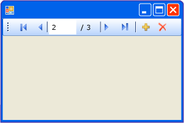

# BindingNavigator コントロールの概要 (Windows フォーム)
<xref:System.Windows.Forms.BindingNavigator> コントロールを使用して、ユーザーが Windows フォームでデータを検索して変更するための標準化された手段を作成できます。 <xref:System.Windows.Forms.BindingNavigator> を <xref:System.Windows.Forms.BindingSource> コンポーネントと共に頻繁に使用して、ユーザーがフォームのデータ レコードを移動して、レコードと対話できるようにします。  
  
## BindingNavigator のしくみ  
 データの追加、データの削除、およびデータの移動という一般的なデータ関連の操作のほとんどで、<xref:System.Windows.Forms.BindingNavigator> コントロールは一連の <xref:System.Windows.Forms.ToolStripItem> オブジェクトを持つ <xref:System.Windows.Forms.ToolStrip> で構成されます。 既定では、<xref:System.Windows.Forms.BindingNavigator> コントロールにこれらの標準のボタンが含まれています。 次のスクリーン ショットは、フォーム上の <xref:System.Windows.Forms.BindingNavigator> コントロールを示します。  
  
   
  
 コントロールの一覧と機能の説明を次の表に示します。  
  
|コントロール|関数|  
|-------------|--------------|  
|<xref:System.Windows.Forms.BindingNavigator.AddNewItem%2A> ボタン|基になるデータ ソースに新しい行を挿入します。|  
|<xref:System.Windows.Forms.BindingNavigator.DeleteItem%2A> ボタン|基になるデータ ソースから現在の行を削除します。|  
|<xref:System.Windows.Forms.BindingNavigator.MoveFirstItem%2A> ボタン|基になるデータ ソースの最初の項目に移動します。|  
|<xref:System.Windows.Forms.BindingNavigator.MoveLastItem%2A> ボタン|基になるデータ ソースの最後の項目に移動します。|  
|<xref:System.Windows.Forms.BindingNavigator.MoveNextItem%2A> ボタン|基になるデータ ソースの次の項目に移動します。|  
|<xref:System.Windows.Forms.BindingNavigator.MovePreviousItem%2A> ボタン|基になるデータ ソースの前の項目に移動します。|  
|<xref:System.Windows.Forms.BindingNavigator.PositionItem%2A> テキスト ボックス|基になるデータ ソース内の現在の位置を返します。|  
|<xref:System.Windows.Forms.BindingNavigator.CountItem%2A> テキスト ボックス|基になるデータ ソースの項目の総数を返します。|  
  
 このコレクションの各コントロールに対して、同じ機能をプログラムで提供する <xref:System.Windows.Forms.BindingSource> コンポーネントの対応するメンバーが存在します。 たとえば、<xref:System.Windows.Forms.BindingNavigator.MoveFirstItem%2A> ボタンは <xref:System.Windows.Forms.BindingSource> コンポーネントの <xref:System.Windows.Forms.BindingSource.MoveFirst%2A> メソッドに対応し、<xref:System.Windows.Forms.BindingNavigator.DeleteItem%2A> ボタンは <xref:System.Windows.Forms.BindingSource.RemoveCurrent%2A> メソッドに対応します。  
  
 既定のボタンがアプリケーションに適していない場合、またはその他の種類の機能をサポートするために追加のボタンを必要とする場合は、独自の <xref:System.Windows.Forms.ToolStrip> ボタンを指定できます。 「[方法 : Windows フォーム BindingNavigator コントロールに [Load]、[Save]、[Cancel] の各ボタンを追加する](../../../../docs/framework/winforms/controls/load-save-and-cancel-bindingnavigator.md)」も参照してください。  
  
## 関連項目  
 <xref:System.Windows.Forms.BindingNavigator>  
 <xref:System.Windows.Forms.BindingSource>  
 [BindingNavigator コントロール](../../../../docs/framework/winforms/controls/bindingnavigator-control-windows-forms.md)
