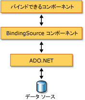

# BindingSource コンポーネントの概要
<xref:System.Windows.Forms.BindingSource> コンポーネントは、基になるデータ ソースにコントロールをバインドするプロセスを簡略化するように設計されています。 <xref:System.Windows.Forms.BindingSource> コンポーネントは、他のコントロールのバインド先となるパイプおよびデータ ソースの両方の働きをします。 このコンポーネントは、フォームのデータ接続を抽象化し、基になるデータ リストにコマンドを渡します。 また、コンポーネントに直接データを追加することにより、コンポーネント自体がデータ ソースとして機能するようにすることができます。  
  
## 媒介手段としての BindingSource コンポーネント  
 <xref:System.Windows.Forms.BindingSource> コンポーネントは、フォーム上のコントロールの一部またはすべてのデータ ソースとして機能します。 Visual Studio で、<xref:System.Windows.Forms.BindingSource>のコントロールにバインドすることができます、`DataBindings`からアクセス可能なプロパティ、**プロパティ**ウィンドウです。 「[方法 : デザイナーを使用して Windows フォーム コントロールを BindingSource コンポーネントにバインドする](../../../../docs/framework/winforms/controls/bind-wf-controls-with-the-bindingsource.md)」も参照してください。  
  
 <xref:System.Windows.Forms.BindingSource> コンポーネントは、単純なデータ ソース (オブジェクトの 1 つのプロパティや、<xref:System.Collections.ArrayList> のような基本的なコレクションなど) と複雑なデータ ソース (データベース テーブルなど) の両方にバインドできます。 <xref:System.Windows.Forms.BindingSource> コンポーネントは、バインディングおよび現在位置管理サービスを提供する媒介手段として機能します。 デザイン時や実行時には、<xref:System.Windows.Forms.BindingSource.DataSource%2A> プロパティと <xref:System.Windows.Forms.BindingSource.DataMember%2A> プロパティをそれぞれデータベースとテーブルに設定して <xref:System.Windows.Forms.BindingSource> コンポーネントを複雑なデータ ソースにバインドできます。 既存のデータ バインディング アーキテクチャにおける <xref:System.Windows.Forms.BindingSource> コンポーネントの位置づけを次の図に示します。  
  
   
  
> [!NOTE]
>  デザイン時には、特定のアクション (データ ウィンドウから空白のフォームへのデータベース テーブルのドラッグなど) によって <xref:System.Windows.Forms.BindingSource> コンポーネントが作成され、基になるデータ ソースにバインドされ、データ バインディングに対応したコントロールが追加されます。これらはすべて 1 つの操作によって実行されます。 「[Visual Studio でのデータへの Windows フォーム コントロールのバインド](/visualstudio/data-tools/bind-windows-forms-controls-to-data-in-visual-studio)」も参照してください。  
  
## データソースとしての BindingSource コンポーネント  
 最初にバインド先のリストを指定せずに <xref:System.Windows.Forms.BindingSource> コンポーネントに項目を追加し始めると、このコンポーネントはリスト形式のデータ ソースとして動作し、追加した項目を受け入れます。  
  
 また、<xref:System.Windows.Forms.BindingSource.AddingNew> イベントを使用して、カスタムの "AddNew" 機能を提供するコードを記述することもできます。このイベントは、<xref:System.Windows.Forms.BindingSource.AddNew%2A> メソッドが呼び出された時点で、リストに項目が追加される前に発生します。 詳細については、「[BindingSource コンポーネント アーキテクチャ](../../../../docs/framework/winforms/controls/bindingsource-component-architecture.md)」を参照してください。  
  
## ナビゲーション  
 フォーム上でデータのナビゲーションを実行する必要のあるユーザーに対しては、<xref:System.Windows.Forms.BindingNavigator> コンポーネントが <xref:System.Windows.Forms.BindingSource> コンポーネントと連携することにより、データのナビゲーションと操作が提供されます。 詳細については、「[BindingNavigator コントロール](../../../../docs/framework/winforms/controls/bindingnavigator-control-windows-forms.md)」を参照してください。  
  
## データの操作  
 <xref:System.Windows.Forms.BindingSource> は、すべてのバインディングの <xref:System.Windows.Forms.CurrencyManager> として動作するため、データ ソースに関する現在位置情報へのアクセスを提供します。 基になるデータへのアクセスおよび操作のために <xref:System.Windows.Forms.BindingSource> コンポーネントが提供するメンバーを次の表に示します。  
  
|メンバー|説明|  
|------------|-----------------|  
|<xref:System.Windows.Forms.BindingSource.Current%2A> プロパティ|データソースの現在の項目を取得します。|  
|<xref:System.Windows.Forms.BindingSource.Position%2A> プロパティ|基になるリストでの現在の位置を取得または設定します。|  
|<xref:System.Windows.Forms.BindingSource.List%2A> プロパティ|<xref:System.Windows.Forms.BindingSource.DataSource%2A> と <xref:System.Windows.Forms.BindingSource.DataMember%2A> の評価であるリストを取得します。 <xref:System.Windows.Forms.BindingSource.DataMember%2A> が設定されていないときは、<xref:System.Windows.Forms.BindingSource.DataSource%2A> によって指定されたリストを返します。|  
|<xref:System.Windows.Forms.BindingSource.Insert%2A> メソッド|リスト内の指定されたインデックス位置に項目を挿入します。|  
|<xref:System.Windows.Forms.BindingSource.RemoveCurrent%2A> メソッド|リストから現在の項目を削除します。|  
|<xref:System.Windows.Forms.BindingSource.EndEdit%2A> メソッド|基になるデータ ソースに保留中の変更を適用します。|  
|<xref:System.Windows.Forms.BindingSource.CancelEdit%2A> メソッド|現在の編集操作をキャンセルします。|  
|<xref:System.Windows.Forms.BindingSource.AddNew%2A> メソッド|基になるリストに新しい項目を追加します。 データ ソースが <xref:System.ComponentModel.IBindingList> を実装しており、<xref:System.Windows.Forms.BindingSource.AddingNew> イベントから項目が返された場合は、その項目を追加します。 それ以外の場合、リストの <xref:System.ComponentModel.IBindingList.AddNew%2A> メソッドに要求が渡されます。 基になるリストが <xref:System.ComponentModel.IBindingList> でない場合は、既定のパブリック コンストラクターを使用して項目が自動的に作成されます。|  
  
## 並べ替えとフィルター処理  
 通常、一定の順序で並べられた、またはフィルター処理されたデータ ソースのビューを使用します。 <xref:System.Windows.Forms.BindingSource> コンポーネント データ ソースが提供するメンバーを次の表に示します。  
  
|メンバー|説明|  
|------------|-----------------|  
|<xref:System.Windows.Forms.BindingSource.Sort%2A> プロパティ|データ ソースが <xref:System.ComponentModel.IBindingList> である場合は、並べ替えに使用する列名と並べ替え順序情報を取得または設定します。 データ ソースが <xref:System.ComponentModel.IBindingListView> であり、高度な並べ替えをサポートしている場合は、並べ替えに使用する複数の列名と並べ替え順序情報を取得します。|  
|<xref:System.Windows.Forms.BindingSource.Filter%2A> プロパティ|データ ソースが <xref:System.ComponentModel.IBindingListView> である場合は、表示する行のフィルター処理に使用する式を取得または設定します。|  
  
## 関連項目  
 <xref:System.Windows.Forms.BindingSource>  
 <xref:System.Windows.Forms.BindingNavigator>  
 [BindingSource コンポーネント アーキテクチャ](../../../../docs/framework/winforms/controls/bindingsource-component-architecture.md)  
 [BindingSource コンポーネント](../../../../docs/framework/winforms/controls/bindingsource-component.md)  
 [BindingNavigator コントロール](../../../../docs/framework/winforms/controls/bindingnavigator-control-windows-forms.md)  
 [Windows フォームでのデータ バインディング](../../../../docs/framework/winforms/windows-forms-data-binding.md)  
 [Windows フォームで使用するコントロール](../../../../docs/framework/winforms/controls/controls-to-use-on-windows-forms.md)
