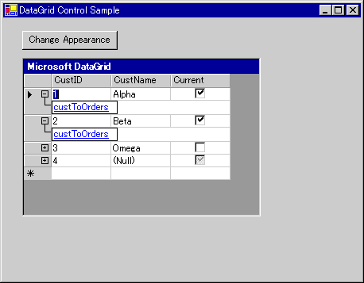

# DataGrid コントロールの概要 (Windows フォーム)
> [!NOTE]
>  <xref:System.Windows.Forms.DataGridView> コントロールは、<xref:System.Windows.Forms.DataGrid> コントロールに代わると共に追加の機能を提供します。ただし、<xref:System.Windows.Forms.DataGrid> コントロールは、下位互換性を保つ目的および将来使用する目的で保持されます。 詳細については、「[Windows フォームの DataGridView コントロールと DataGrid コントロールの違いについて](../../../../docs/framework/winforms/controls/differences-between-the-windows-forms-datagridview-and-datagrid-controls.md)」を参照してください。  
  
 Windows フォーム <xref:System.Windows.Forms.DataGrid> コントロールは、一連の行と列のデータを表示します。 最も簡単なケースは、リレーションシップを含まない 1 つのテーブルを持つデータ ソースにグリッドがバインドされている場合です。 その場合は、スプレッドシートのように、単純な行と列でデータが表示されます。 その他のコントロールへのデータ バインディングの詳細については、「[データ連結と Windows フォーム](../../../../docs/framework/winforms/data-binding-and-windows-forms.md)」を参照してください。  
  
 <xref:System.Windows.Forms.DataGrid> が複数の関連するテーブルを持つデータにバインドされ、グリッドでナビゲーションが有効な場合は、グリッドの行ごとに展開コントロールが表示されます。 展開コントロールでは、ユーザーは、親テーブルから子テーブルに移動できます。 ノードをクリックすると子テーブルが表示され、[戻る] ボタンをクリックすると、元の親テーブルが表示されます。 この方法では、グリッドはテーブル間の階層リレーションシップを表示します。  
  
 次のスクリーン ショットは、複数のテーブルのデータにバインドされた DataGrid を示しています。  
  
   
複数のテーブルを持つデータにバインドされた DataGrid  
  
 <xref:System.Windows.Forms.DataGrid> はデータセットのユーザー インターフェイス、関連するテーブル間のナビゲーション、および豊富な書式設定および編集機能を提供することができます。  
  
 データの表示と操作は別の機能です。コントロールはユーザー インターフェイスを処理し、データの更新は Windows フォームのデータ バインディング アーキテクチャおよび [!INCLUDE[dnprdnshort](../../../../includes/dnprdnshort-md.md)] データ プロバイダーによって処理されます。 このため、同じデータ ソースにバインドされる複数のコントロールが同期状態を保ちます。  
  
> [!NOTE]
>  Visual Basic 6.0 の DataGrid コントロールに慣れている場合、Windows フォームの <xref:System.Windows.Forms.DataGrid> コントロールには大きな違いがあります。  
  
 グリッドが <xref:System.Data.DataSet> にバインドされると、列と行が自動的に作成、書式設定、および入力されます。 詳細については、「[Data Binding and Windows Forms](../../../../docs/framework/winforms/data-binding-and-windows-forms.md)」 (データ連結と Windows フォーム) を参照してください。 <xref:System.Windows.Forms.DataGrid> コントロールの生成に従い、ニーズに応じて列と行を追加、削除、再配置、および書式設定できます。  
  
## コントロールへのデータのバインド  
 <xref:System.Windows.Forms.DataGrid> コントロールが機能するために、デザイン時に <xref:System.Windows.Forms.DataGrid.DataSource%2A> プロパティと <xref:System.Windows.Forms.DataGrid.DataMember%2A> プロパティを使用して、または実行時に <xref:System.Windows.Forms.DataGrid.SetDataBinding%2A> メソッドを使用してデータ ソースにバインドする必要があります。 このバインディングは、<xref:System.Windows.Forms.DataGrid> を <xref:System.Data.DataSet> や <xref:System.Data.DataTable> などのインスタンス化されたデータ ソース オブジェクトにポイントします。 <xref:System.Windows.Forms.DataGrid> コントロールは、データ上で実行されるアクションの結果を表示します。 ほとんどのデータに固有の動作は、<xref:System.Windows.Forms.DataGrid> によってではなく、データ ソースによって実行されます。  
  
 バインドされたデータセット内のデータが任意のメカニズムにより更新された場合に、<xref:System.Windows.Forms.DataGrid> コントロールが変更を反映します。 データ グリッド、表のスタイル、および列のスタイルがある場合、`ReadOnly`プロパティに設定`false`、を通じて、データセット内のデータを更新することができます、<xref:System.Windows.Forms.DataGrid>コントロール。  
  
 <xref:System.Windows.Forms.DataGrid> には、一度に 1 つのテーブルのみを表示できます。 テーブル間で親子のリレーションシップが定義される場合、ユーザーが関連するテーブルの間で移動して、<xref:System.Windows.Forms.DataGrid> コントロールで表示されるテーブルを選択できます。 バインディングについては、<xref:System.Windows.Forms.DataGrid>コントロールを[!INCLUDE[vstecado](../../../../includes/vstecado-md.md)]デザイン時または実行時に、データ ソースを参照してください[する方法: Windows フォーム DataGrid コントロールをデータ ソースにバインド](../../../../docs/framework/winforms/controls/how-to-bind-the-windows-forms-datagrid-control-to-a-data-source.md)です。  
  
 <xref:System.Windows.Forms.DataGrid> の有効なデータ ソースには、次が含まれます。  
  
-   <xref:System.Data.DataTable> クラス  
  
-   <xref:System.Data.DataView> クラス  
  
-   <xref:System.Data.DataSet> クラス  
  
-   <xref:System.Data.DataViewManager> クラス  
  
 ソースがデータセットの場合、データセットは、フォーム内のオブジェクト、または XML Web サービスによってフォームに渡されるオブジェクトの可能性があります。 型指定されたか、型指定されていないデータセットにバインドできます。  
  
 配列内の要素など、構造内のオブジェクトがパブリック プロパティを公開する場合は、<xref:System.Windows.Forms.DataGrid> コントロールを追加の構造にバインドすることもできます。 グリッドには、構造内の要素のすべてのパブリック プロパティが表示されます。 たとえば、<xref:System.Windows.Forms.DataGrid> コントロールを顧客オブジェクトの配列にバインドする場合、グリッドにこれらの顧客オブジェクトのすべてのパブリック プロパティが表示されます。 場合によっては、構造にバインドすることができますが、結果としてバインドされている構造が、実際のアプリケーションを持たない可能性があることを意味します。 たとえば、整数の配列にバインドできますが、`Integer` データ型はパブリック プロパティをサポートしないため、グリッドがすべてのデータを表示できません。  
  
 要素がパブリック プロパティを公開する場合は、次の構造にバインドできます。  
  
-   <xref:System.Collections.IList> インターフェイスを実装するコンポーネント。 これには 1 次元の配列が含まれます。  
  
-   <xref:System.ComponentModel.IListSource> インターフェイスを実装するコンポーネント。  
  
-   <xref:System.ComponentModel.IBindingList> インターフェイスを実装するコンポーネント。  
  
 使用できるデータ ソースの詳細については、「[Windows フォームがサポートするデータ ソース](../../../../docs/framework/winforms/data-sources-supported-by-windows-forms.md)」を参照してください。  
  
## グリッドの表示  
 <xref:System.Windows.Forms.DataGrid> コントロールの一般的な使い方は、データセットからデータの 1 つのテーブルを表示します。 ただし、関連テーブルを含む複数のテーブルを表示するためにコントロールを使用できます。 グリッドの表示は、データ ソースに応じて自動的に調整されます。 さまざまな構成で表示される内容を次の表に示します。  
  
|データ セットの内容|表示される内容|  
|--------------------------|-----------------------|  
|1 つのテーブル。|テーブルがグリッドに表示されます。|  
|複数のテーブル。|グリッドに、ユーザーが移動して表示するテーブルを検索できるツリー ビューを表示できます。|  
|複数の関連テーブル。|グリッドに、テーブルを選択するツリー ビューを表示でき、グリッドに親テーブルを表示するよう指定することもできます。 親テーブル内のレコードでは、ユーザーが関連する子の行に移動できます。|  
  
> [!NOTE]
>  データセットのテーブルは、<xref:System.Data.DataRelation> を使用して関連付けられます。  参照してください[ハイパーリンク"http://msdn.microsoft.com/library/dbwcse3d(v=vs.110)"データセットのリレーションシップ](http://msdn.microsoft.com/library/dbwcse3d\(v=vs.110\))または[データセットのリレーションシップ](http://msdn.microsoft.com/library/dbwcse3d\(v=vs.120\))です。  
  
 <xref:System.Windows.Forms.DataGrid> コントロールがテーブルに表示され、<xref:System.Windows.Forms.DataGrid.AllowSorting%2A> プロパティが `true` に設定される場合、データは列ヘッダーをクリックして再度並べ替えることができます。 ユーザーは行の追加やセルの編集も実行できます。  
  
 一連のテーブル間のリレーションシップは、ナビゲーションの親/子構造体を使用してユーザーに表示されます。 親テーブルは最高レベルのデータ、および子テーブルは、親テーブルの個別の一覧から派生した個々 のデータ テーブルです。 展開コントロールは、子テーブルを含む各親の行に表示されます。 展開コントロールをクリックすると、子テーブルへの Web のようなリンクの一覧が生成されます。 ユーザーがリンクを選択すると、子テーブルが表示されます。 親行の表示/非表示のアイコン () をクリックすると、親テーブルに関する情報が非表示になるか、または、ユーザーが以前非表示にしている場合は再表示します。 ユーザーは、戻るボタンをクリックして、前に表示されていたテーブルに移動することができます。  
  
## 列と行  
 <xref:System.Windows.Forms.DataGrid> は、<xref:System.Windows.Forms.DataGrid> コントロールの <xref:System.Windows.Forms.DataGrid.TableStyles%2A> プロパティに含まれる <xref:System.Windows.Forms.DataGridTableStyle> オブジェクトのコレクションから構成されます。 テーブルのスタイルには、<xref:System.Windows.Forms.DataGridTableStyle> の <xref:System.Windows.Forms.DataGridTableStyle.GridColumnStyles%2A> プロパティに含まれる <xref:System.Windows.Forms.DataGridColumnStyle> オブジェクトのコレクションが含まれる可能性があります。 編集することができます、<xref:System.Windows.Forms.DataGrid.TableStyles%2A>と<xref:System.Windows.Forms.DataGridTableStyle.GridColumnStyles%2A>プロパティからアクセスできるコレクション エディターを使用して、**プロパティ**ウィンドウです。  
  
 <xref:System.Windows.Forms.DataGrid> コントロールに関連付けられている任意の <xref:System.Windows.Forms.DataGridTableStyle> は <xref:System.Windows.Forms.GridTableStylesCollection> によってアクセスできます。 <xref:System.Windows.Forms.GridTableStylesCollection> は、<xref:System.Windows.Forms.DataGridTableStyle> コレクション エディターを使用してデザイナーで編集することも、<xref:System.Windows.Forms.DataGrid> コントロールの <xref:System.Windows.Forms.DataGrid.TableStyles%2A> プロパティからプログラムで編集することもできます。  
  
   
DataGrid コントロールに含まれるオブジェクトを次の図に示します。  
  
 テーブルのスタイルおよび列のスタイルは、`MappingName` プロパティを適切な <xref:System.Data.DataTable.TableName%2A> プロパティと <xref:System.Data.DataColumn.ColumnName%2A> プロパティに設定することで <xref:System.Data.DataTable> オブジェクトおよび <xref:System.Data.DataColumn> オブジェクトと同期されます。 列のスタイルを持たない <xref:System.Windows.Forms.DataGridTableStyle> が、有効なデータ ソースにバインドされた <xref:System.Windows.Forms.DataGrid> コントロールに追加され、テーブルのスタイルの <xref:System.Windows.Forms.DataGridTableStyle.MappingName%2A> プロパティが有効な <xref:System.Data.DataTable.TableName%2A> プロパティに設定される場合に、<xref:System.Windows.Forms.DataGridColumnStyle> オブジェクトのコレクションが、そのテーブルのスタイルに対して作成されます。 <xref:System.Data.DataTable> の <xref:System.Data.DataTable.Columns%2A> のコレクションで見つかった各 <xref:System.Data.DataColumn> に対して、対応する <xref:System.Windows.Forms.DataGridColumnStyle> が <xref:System.Windows.Forms.GridColumnStylesCollection> に追加されます。 <xref:System.Windows.Forms.GridColumnStylesCollection> は、<xref:System.Windows.Forms.DataGridTableStyle> の <xref:System.Windows.Forms.DataGridTableStyle.GridColumnStyles%2A> プロパティによりアクセスされます。 <xref:System.Windows.Forms.GridColumnStylesCollection> で <xref:System.Windows.Forms.GridColumnStylesCollection.Add%2A> メソッドまたは <xref:System.Windows.Forms.GridColumnStylesCollection.Remove%2A> メソッドを使用して、列をグリッドに追加または削除できます。 詳細については、「[方法 : Windows フォーム DataGrid コントロールにテーブルと列を追加する](../../../../docs/framework/winforms/controls/how-to-add-tables-and-columns-to-the-windows-forms-datagrid-control.md)」および「[方法 : Windows フォーム DataGrid コントロールの列を削除するまたは非表示にする](../../../../docs/framework/winforms/controls/how-to-delete-or-hide-columns-in-the-windows-forms-datagrid-control.md)」を参照してください。  
  
 列の型のコレクションは、豊富な書式設定と編集機能を持つ <xref:System.Windows.Forms.DataGridColumnStyle> クラスを拡張します。 すべての列の型は、<xref:System.Windows.Forms.DataGridColumnStyle> 基底クラスから継承します。 作成されるクラスは、<xref:System.Web.UI.WebControls.DataGridColumn> の基底である <xref:System.Data.DataColumn> の <xref:System.Data.DataColumn.DataType%2A> プロパティに依存します。 たとえば、<xref:System.Data.DataColumn.DataType%2A> プロパティが <xref:System.Boolean> に設定された <xref:System.Data.DataColumn> は、<xref:System.Windows.Forms.DataGridBoolColumn> に関連付けられます。 各列の型に関する説明を次の表に示します。  
  
|列の型|説明|  
|-----------------|-----------------|  
|<xref:System.Windows.Forms.DataGridTextBoxColumn>|書式設定された文字列、または書式設定されていない文字列としてデータを受け入れて表示します。 編集機能は、単純な <xref:System.Windows.Forms.TextBox> 内のデータを編集する場合と同じです。 <xref:System.Windows.Forms.DataGridColumnStyle> から継承します。|  
|<xref:System.Windows.Forms.DataGridBoolColumn>|`true`、`false`、および null 値を受け入れて表示します。 <xref:System.Windows.Forms.DataGridColumnStyle> から継承します。|  
  
 列の右端をダブルクリックすると、完全キャプションと最も幅の広いエントリを表示するよう列のサイズを変更します。  
  
## テーブルのスタイルおよび列のスタイル  
 <xref:System.Windows.Forms.DataGrid> コントロールの既定の形式が確立されると、すぐに、データ グリッド内に特定のテーブルが表示される場合に使用される色をカスタマイズすることができます。  
  
 これは、<xref:System.Windows.Forms.DataGridTableStyle> クラスのインスタンスを作成することによって実行されます。 テーブルのスタイルは、<xref:System.Windows.Forms.DataGrid> コントロール自体の既定の書式設定とは異なる特定のテーブルの書式設定を指定します。 各テーブルは、定義されたテーブルのスタイルを一度に 1 つのみ持つことができます。  
  
 場合によっては、特定の列の外観を、特定のデータ テーブルの列の残りの部分と異なるものにすることが望ましい場合があります。 <xref:System.Windows.Forms.DataGridTableStyle.GridColumnStyles%2A> プロパティを使用して、カスタマイズされた一連の列のスタイルを作成することができます。  
  
 列のスタイルは、表のスタイルがデータ テーブルに関連するのと同じように、データセット内の列に関連します。 各テーブルに一度に 1 つの表のスタイルのみ定義できるように、各列も、特定のテーブルのスタイルで一度に 1 つの列のスタイルのみ定義できます。 このリレーションシップは、列の <xref:System.Windows.Forms.DataGridColumnStyle.MappingName%2A> プロパティで定義されます。  
  
 を列のスタイルを追加せず、テーブルのスタイルを作成した Visual Studio は、フォームおよびグリッドが実行時に作成されるときに、既定の列スタイルを追加します。 ただし、テーブルのスタイルを作成して、列のスタイルを追加する、Visual Studio は列スタイルは作成されません。 また、列のスタイルを定義し、マッピングの名前に割り当てて、グリッドに表示する列を持つようにする必要があります。  
  
 列のスタイルに列を割り当てることでデータ グリッドに含まれる列を指定し、列に割り当てられた列のスタイルがないため、グリッドに表示されていないデータセットのデータの列を含めることができます。 ただし、データセットにデータ列が含まれているため、表示されていないデータをプログラムで編集できます。  
  
> [!NOTE]
>  一般に、表のスタイルをテーブル スタイルのコレクションに追加する前に、列のスタイルを作成し、列のスタイルのコレクションに追加します。 コレクションに空のテーブルのスタイルを追加すると、列のスタイルが自動的に生成されます。 その結果、重複する <xref:System.Windows.Forms.DataGridColumnStyle.MappingName%2A> 値を持つ新しい列のスタイルを列のスタイルのコレクションに追加しようとする場合に例外がスローされます。  
>   
>  多くの列の中で 1 つのだけ列を微調整することが望ましい場合があります。たとえば、50 の列がデータセットに含まれていて、そのうち 49 のみが必要だとします。 この場合は、プログラムでの 49 個の列をそれぞれプログラムで追加するより、50 のすべての列をインポートし、1 つをプログラムで削除する方が簡単です。  
  
## 書式設定  
 <xref:System.Windows.Forms.DataGrid> コントロールに適用できる書式設定には、罫線のスタイル、グリッド線のスタイル、フォント、caption プロパティ、データの配置、および行の間の背景色を交互に変える設定が含まれます。 詳細については、「[方法 : Windows フォーム DataGrid コントロールの書式を設定する](../../../../docs/framework/winforms/controls/how-to-format-the-windows-forms-datagrid-control.md)」を参照してください。  
  
## イベント  
 <xref:System.Windows.Forms.Control.MouseDown>、<xref:System.Windows.Forms.Control.Enter>、および <xref:System.Windows.Forms.DataGrid.Scroll> などの一般的なコントロール イベントのほかに、<xref:System.Windows.Forms.DataGrid> コントロールはグリッド内の編集と移動に関連付けられたイベントをサポートします。 <xref:System.Windows.Forms.DataGrid.CurrentCell%2A> プロパティは、どのセルが選択されるか決定します。 <xref:System.Windows.Forms.DataGrid.CurrentCellChanged> イベントは、ユーザーが新しいセルに移動するときに発生します。 ユーザーが親子のリレーションを使用して新しいテーブルに移動するときに、<xref:System.Windows.Forms.DataGrid.Navigate> イベントが発生します。 <xref:System.Windows.Forms.DataGrid.BackButtonClick> イベントは、ユーザーが子テーブルを表示している場合にユーザーが [戻る] ボタンをクリックすると発生し、<xref:System.Windows.Forms.DataGrid.ShowParentDetailsButtonClick> イベントは、親行の表示/非表示のアイコンをクリックすると発生します。  
  
## 関連項目  
 [DataGrid コントロール](../../../../docs/framework/winforms/controls/datagrid-control-windows-forms.md)  
 [方法: データ ソースに Windows フォーム DataGrid コントロールをバインドする](../../../../docs/framework/winforms/controls/how-to-bind-the-windows-forms-datagrid-control-to-a-data-source.md)  
 [方法: Windows フォーム DataGrid コントロールにテーブルと列を追加する](../../../../docs/framework/winforms/controls/how-to-add-tables-and-columns-to-the-windows-forms-datagrid-control.md)  
 [方法: Windows フォーム DataGrid コントロールの列を削除するまたは非表示にする](../../../../docs/framework/winforms/controls/how-to-delete-or-hide-columns-in-the-windows-forms-datagrid-control.md)  
 [方法: Windows フォーム DataGrid コントロールの書式を設定する](../../../../docs/framework/winforms/controls/how-to-format-the-windows-forms-datagrid-control.md)
