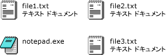

# <a name="how-to-enable-tile-view-in-a-windows-forms-listview-control"></a>方法 : Windows フォーム ListView コントロールの "並べて表示" ビューを有効にする
<xref:System.Windows.Forms.ListView> コントロールの並べて表示ビュー機能を使用すると、グラフィカルな情報とテキスト情報をバランスよく表示できます。 並べて表示ビューの項目で表示されるテキスト情報は、詳細ビュー用に定義されている列情報と同じ情報です。 並べて表示ビューは、<xref:System.Windows.Forms.ListView> コントロールのグループ化機能または挿入マーク機能のいずれかと組み合わせて使用できます。  
  
 並べて表示ビューでは、サイズが 32 × 32 ピクセルのアイコンと数行のテキストが次の画像のように使用されます。  
  
   
並べて表示ビューのアイコンとテキスト  
  
 並べて表示ビューを有効にするには、<xref:System.Windows.Forms.ListView.View%2A> プロパティを <xref:System.Windows.Forms.View.Tile> に設定します。 <xref:System.Windows.Forms.ListView.TileSize%2A> プロパティを設定するとタイトルのサイズを調整できます。また、<xref:System.Windows.Forms.ListView.Columns%2A> コレクションを調整すると、タイルに表示されるテキストの行数を指定できます。  
  
> [!NOTE]
>  並べて表示ビューを [!INCLUDE[WinXpFamily](../../../../includes/winxpfamily-md.md)] で使用できるのは、アプリケーションから <xref:System.Windows.Forms.Application.EnableVisualStyles%2A?displayProperty=nameWithType> メソッドを呼び出した場合だけです。 旧バージョンのオペレーティング システムでは、並べて表示ビューに関するコードがすべて無効になり、<xref:System.Windows.Forms.ListView> コントロールは大きなアイコンのビューで表示されます。 詳細については、「<xref:System.Windows.Forms.ListView.View%2A?displayProperty=nameWithType>」を参照してください。  
  
### <a name="to-set-tile-view-programmatically"></a>プログラムによって並べて表示ビューを設定するには  
  
1.  <xref:System.Windows.Forms.ListView> コントロールの <xref:System.Windows.Forms.View> 列挙体を使用します。  
  
    ```vb  
    ListView1.View = View.Tile  
    ```  
  
    ```csharp  
    listView1.View = View.Tile;  
    ```  
  
## <a name="example"></a>例  
 次の完全なコード例は、タイルに表示するテキストを 3 行に変更した並べて表示ビューを示しています。 行の折り返しが発生しないようにタイルのサイズを調整しました。  
  
 [!code-cpp[System.Windows.Forms.ListView.Tiling#1](../../../../samples/snippets/cpp/VS_Snippets_Winforms/System.Windows.Forms.ListView.Tiling/CPP/listviewtilingexample.cpp#1)]
 [!code-csharp[System.Windows.Forms.ListView.Tiling#1](../../../../samples/snippets/csharp/VS_Snippets_Winforms/System.Windows.Forms.ListView.Tiling/CS/listviewtilingexample.cs#1)]
 [!code-vb[System.Windows.Forms.ListView.Tiling#1](../../../../samples/snippets/visualbasic/VS_Snippets_Winforms/System.Windows.Forms.ListView.Tiling/VB/listviewtilingexample.vb#1)]  
  
## <a name="compiling-the-code"></a>コードのコンパイル  
 この例で必要な要素は次のとおりです。  
  
-   System アセンブリおよび System.Windows.Forms アセンブリへの参照。  
  
-   book.ico という名前のアイコン ファイルは、実行可能ファイルと同じディレクトリにあります。  
  
 コマンドラインからこの例を Visual Basic または Visual c# のビルドについては、次を参照してください。[コマンドラインからのビルド](~/docs/visual-basic/reference/command-line-compiler/building-from-the-command-line.md)または[コマンド ライン ビルドで csc.exe](~/docs/csharp/language-reference/compiler-options/command-line-building-with-csc-exe.md)です。 また、コードを新しいプロジェクトに貼り付けることにより、 [!INCLUDE[vsprvs](../../../../includes/vsprvs-md.md)] でこの例をビルドすることもできます。  また、「 [方法: 完成した Windows フォーム コードの例を Visual Studio を使ってコンパイルして実行する](http://msdn.microsoft.com/library/Bb129228\(v=vs.110\))」も参照してください。  
  
## <a name="see-also"></a>関連項目  
 <xref:System.Windows.Forms.ListView>  
 <xref:System.Windows.Forms.ListView.TileSize%2A>  
 [ListView コントロール](../../../../docs/framework/winforms/controls/listview-control-windows-forms.md)  
 [ListView コントロールの概要](../../../../docs/framework/winforms/controls/listview-control-overview-windows-forms.md)  
 [Windows XP の機能と Windows フォーム コントロール](http://msdn.microsoft.com/library/bc7fab94-fce9-4bf1-a8ad-a5837c91c3c0)
