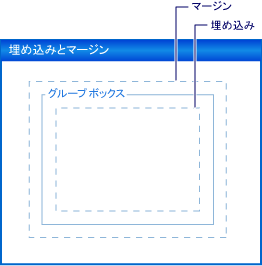

# チュートリアル : Padding、Margin、および AutoSize プロパティを使用した Windows フォーム コントロールのレイアウト
フォーム上のコントロールを正確に配置することは、多くのアプリケーションで優先度の高い作業です。 **Windows フォーム デザイナー**これを実現するさまざまなレイアウト ツールを提供します。 最も重要な 3 つが、 <xref:System.Windows.Forms.Control.Margin%2A>、 <xref:System.Windows.Forms.Control.Padding%2A>、および<xref:System.Windows.Forms.Control.AutoSize%2A>プロパティで、すべての Windows フォーム コントロール上に存在します。  
  
 <xref:System.Windows.Forms.Control.Margin%2A> プロパティは、その他のコントロールで、コントロールの枠線からの指定された距離を保持するコントロールの周囲のスペースを定義します。  
  
 <xref:System.Windows.Forms.Control.Padding%2A> プロパティは、コントロールの内容 (<xref:System.Windows.Forms.Control.Text%2A> プロパティの値など) で、コントロールの枠線からの指定した距離を保持するコントロールの内部のスペースを定義します。  
  
 次の図は、コントロールの <xref:System.Windows.Forms.Control.Padding%2A> プロパティと <xref:System.Windows.Forms.Control.Margin%2A> プロパティを示しています。  
  
   
  
 <xref:System.Windows.Forms.Control.AutoSize%2A>プロパティ、コントロールの内容を自動的にサイズに通知します。 これは、サイズは変更されませんが元の値より小さくなる自体<xref:System.Windows.Forms.Control.Size%2A>プロパティ、およびそれがの値のアカウントがその<xref:System.Windows.Forms.Control.Padding%2A>プロパティです。  
  
 このチュートリアルでは、以下のタスクを行います。  
  
-   Windows フォーム プロジェクトの作成  
  
-   コントロールのマージンの設定  
  
-   コントロールの余白を設定  
  
-   自動的に、コントロールのサイズ変更  
  
 終了すると、これらの重要なレイアウト機能が果たす役割について理解できます。  
  
> [!NOTE]
>  実際に画面に表示されるダイアログ ボックスとメニュー コマンドは、アクティブな設定またはエディションによっては、ヘルプの説明と異なる場合があります。 設定を変更するには、 **[ツール]** メニューの **[設定のインポートとエクスポート]** をクリックします。 詳細については、「[Visual Studio での開発設定のカスタマイズ](http://msdn.microsoft.com/library/22c4debb-4e31-47a8-8f19-16f328d7dcd3)」を参照してください。  
  
## 必須コンポーネント  
 このチュートリアルを完了するための要件は次のとおりです。  
  
-   作成し、Visual Studio がインストールされているコンピューターで Windows フォーム アプリケーション プロジェクトを実行できる十分なアクセスを許可します。  
  
## プロジェクトの作成  
 最初にプロジェクトを作成し、フォームを設定します。  
  
#### プロジェクトを作成するには  
  
1.  作成、 **Windows アプリケーション**というプロジェクト`LayoutExample`です。 詳細については、次を参照してください。[する方法: Windows アプリケーション プロジェクトを作成](http://msdn.microsoft.com/library/b2f93fed-c635-4705-8d0e-cf079a264efa)です。  
  
2.  フォームを選択、 **Windows フォーム デザイナー**です。  
  
## コントロールのマージンの設定  
 使用して、コントロールの間で既定の間隔を設定することができます、<xref:System.Windows.Forms.Control.Margin%2A>プロパティです。 コントロールを移動するときに別のコントロールに十分な数を閉じるには、2 つのコントロールの余白を示すスナップ線が表示されます。 移動中のコントロールは、余白で定義された距離にもスナップされます。  
  
#### Margin プロパティを使用して、フォーム上のコントロールを配置するには  
  
1.  2 つをドラッグして<xref:System.Windows.Forms.Button>から制御、**ツールボックス**フォーム上にします。  
  
2.  いずれかを選択、<xref:System.Windows.Forms.Button>を制御し、ほぼに触れることまで、その他の近くに移動します。  
  
     それらの間に表示されるスナップ線を観察します。 この距離は、2 つのコントロールの<xref:System.Windows.Forms.Control.Margin%2A>値。 移動中のコントロールは、この距離にスナップされます。 詳細については、「[チュートリアル: Windows フォームを使用するスナップ線上のコントロールの配置](../../../../docs/framework/winforms/controls/walkthrough-arranging-controls-on-windows-forms-using-snaplines.md)です。  
  
3.  変更、<xref:System.Windows.Forms.Control.Margin%2A>を展開して、コントロールのいずれかのプロパティ、<xref:System.Windows.Forms.Control.Margin%2A>内のエントリ、**プロパティ**ウィンドウと設定、 <xref:System.Windows.Forms.Padding.All%2A> 20 プロパティです。  
  
4.  いずれかを選択、<xref:System.Windows.Forms.Button>を制御し、もう一方の近くに移動します。  
  
     スナップ線を定義する、余白の値の合計が長いと、コントロールが他のコントロールから、広範囲にスナップされます。  
  
5.  変更、<xref:System.Windows.Forms.Control.Margin%2A>を展開して選択したコントロールのプロパティ、<xref:System.Windows.Forms.Control.Margin%2A>内のエントリ、**プロパティ**ウィンドウと設定、 <xref:System.Windows.Forms.Padding.Top%2A> 5 プロパティです。  
  
6.  その他のコントロールの下の選択したコントロールを移動し、スナップ線が短いことを確認します。 選択したコントロールを他のコントロールの左側に移動し、スナップ線が手順 4. で計測された値を保持することを確認します。  
  
7.  側面のそれぞれを設定することができます、<xref:System.Windows.Forms.Control.Margin%2A>プロパティ、 <xref:System.Windows.Forms.Padding.Left%2A>、 <xref:System.Windows.Forms.Padding.Top%2A>、 <xref:System.Windows.Forms.Padding.Right%2A>、 <xref:System.Windows.Forms.Padding.Bottom%2A>、別の値に設定できるはすべてに同じ値を<xref:System.Windows.Forms.Padding.All%2A>プロパティです。  
  
## コントロールの余白を設定  
 アプリケーションに必要な正確なレイアウトを実現するために、コントロールが子コントロールを含む多くの場合。 親コントロールの境界線に子コントロールの境界線の近接度を指定する場合は、使用、親コントロールの<xref:System.Windows.Forms.Control.Padding%2A>と共に子コントロールのプロパティ<xref:System.Windows.Forms.Control.Margin%2A>プロパティです。 <xref:System.Windows.Forms.Control.Padding%2A>コントロールのコンテンツの近接度を制御するプロパティを使用しても (たとえば、<xref:System.Windows.Forms.Button>コントロールの<xref:System.Windows.Forms.Control.Text%2A>プロパティ)、境界線をします。  
  
#### 埋め込みを使用して、フォーム上のコントロールを配置するには  
  
1.  ドラッグ、<xref:System.Windows.Forms.Button>から制御、**ツールボックス**フォーム上にします。  
  
2.  <xref:System.Windows.Forms.Button> コントロールの <xref:System.Windows.Forms.Control.AutoSize%2A> プロパティの値を `true` に変更します。  
  
3.  変更、<xref:System.Windows.Forms.Control.Padding%2A>プロパティを展開して、<xref:System.Windows.Forms.Control.Padding%2A>内のエントリ、**プロパティ**ウィンドウと設定、 <xref:System.Windows.Forms.Padding.All%2A> 5 プロパティです。  
  
     コントロールを拡張する場合、新しい余白の領域を確保します。  
  
4.  ドラッグ、<xref:System.Windows.Forms.GroupBox>から制御、**ツールボックス**フォーム上にします。 ドラッグ、<xref:System.Windows.Forms.Button>から制御、**ツールボックス**に、<xref:System.Windows.Forms.GroupBox>コントロール。 位置、<xref:System.Windows.Forms.Button>の右下隅と揃えるためにの制御、<xref:System.Windows.Forms.GroupBox>コントロール。  
  
     として表示されるスナップ線を観察、<xref:System.Windows.Forms.Button>下と右の境界線のコントロールが近づく、<xref:System.Windows.Forms.GroupBox>コントロール。 これらのスナップ線に対応している、<xref:System.Windows.Forms.Control.Margin%2A>のプロパティ、<xref:System.Windows.Forms.Button>です。  
  
5.  変更、<xref:System.Windows.Forms.GroupBox>コントロールの<xref:System.Windows.Forms.Control.Padding%2A>プロパティを展開して、<xref:System.Windows.Forms.Control.Padding%2A>内のエントリ、**プロパティ**ウィンドウと設定、 <xref:System.Windows.Forms.Padding.All%2A> 20 プロパティです。  
  
6.  選択、<xref:System.Windows.Forms.Button>内の制御、<xref:System.Windows.Forms.GroupBox>を制御しの中央に移動、<xref:System.Windows.Forms.GroupBox>です。  
  
     枠線から遠隔地にスナップ線が表示される、<xref:System.Windows.Forms.GroupBox>コントロール。 この距離は、の<xref:System.Windows.Forms.Button>コントロールの<xref:System.Windows.Forms.Control.Margin%2A>プロパティおよび<xref:System.Windows.Forms.GroupBox>コントロールの<xref:System.Windows.Forms.Control.Padding%2A>プロパティです。  
  
## 自動的に、コントロールのサイズ変更  
 一部のアプリケーションでコントロールのサイズはできません、同じ実行時にデザイン時と同じ。 テキスト、<xref:System.Windows.Forms.Button>コントロール、たとえば、考慮できる、データベースからとその長さは事前にわかっていません。  
  
 ときに、<xref:System.Windows.Forms.Control.AutoSize%2A>プロパティに設定されている`true`、そのコンテンツへのコントロールのサイズがします。 詳細については、次を参照してください。 [AutoSize プロパティの概要](../../../../docs/framework/winforms/controls/autosize-property-overview.md)です。  
  
#### AutoSize プロパティを使用して、フォーム上のコントロールを配置するには  
  
1.  ドラッグ、<xref:System.Windows.Forms.Button>から制御、**ツールボックス**フォーム上にします。  
  
2.  <xref:System.Windows.Forms.Button> コントロールの <xref:System.Windows.Forms.Control.AutoSize%2A> プロパティの値を `true` に変更します。  
  
3.  変更、<xref:System.Windows.Forms.Button>コントロールの<xref:System.Windows.Forms.Control.Text%2A>プロパティを"**このボタンには、Text プロパティの長い文字列**"。  
  
     変更をコミットする場合、<xref:System.Windows.Forms.Button>コントロールの新しいテキストが収まるようにサイズを変更します。  
  
4.  別のドラッグ<xref:System.Windows.Forms.Button>から制御、**ツールボックス**フォーム上にします。  
  
5.  変更、<xref:System.Windows.Forms.Button>コントロールの<xref:System.Windows.Forms.Control.Text%2A>プロパティを"**このボタンには、Text プロパティの長い文字列**"。  
  
     変更をコミットする場合、<xref:System.Windows.Forms.Button>コントロール サイズ変更されない自体、およびテキストは、コントロールの右端で切り詰められます。  
  
6.  変更、<xref:System.Windows.Forms.Control.Padding%2A>プロパティを展開して、<xref:System.Windows.Forms.Control.Padding%2A>内のエントリ、**プロパティ**ウィンドウと設定、 <xref:System.Windows.Forms.Padding.All%2A> 5 プロパティです。  
  
     コントロールの内部のテキストは、すべての 4 辺にクリップされます。  
  
7.  変更、<xref:System.Windows.Forms.Button>コントロールの<xref:System.Windows.Forms.Control.AutoSize%2A>プロパティを`true`です。  
  
     <xref:System.Windows.Forms.Button>コントロールのサイズは、文字列全体が含まれます。 テキストの周辺の余白が追加されても、原因、<xref:System.Windows.Forms.Button>コントロールをすべて次の 4 つの方向に展開します。  
  
8.  ドラッグ、<xref:System.Windows.Forms.Button>から制御、**ツールボックス**フォーム上にします。 フォームの右下隅近くに配置します。  
  
9. <xref:System.Windows.Forms.Button> コントロールの <xref:System.Windows.Forms.Control.AutoSize%2A> プロパティの値を `true` に変更します。  
  
10. 設定、<xref:System.Windows.Forms.Button>コントロールの<xref:System.Windows.Forms.Control.Anchor%2A>プロパティを<xref:System.Windows.Forms.AnchorStyles.Right>、<xref:System.Windows.Forms.AnchorStyles.Bottom>です。  
  
11. 変更、<xref:System.Windows.Forms.Button>コントロールの<xref:System.Windows.Forms.Control.Text%2A>プロパティを"**このボタンには、Text プロパティの長い文字列**"。  
  
     変更をコミットする場合、<xref:System.Windows.Forms.Button>コントロールは左方向サイズ変更します。 自動サイズ変更が反対の方向にコントロールのサイズを大きく一般に、その<xref:System.Windows.Forms.Control.Anchor%2A>プロパティの設定。  
  
## AutoSize と AutoSizeMode プロパティ  
 一部のコントロールのサポート、`AutoSizeMode`プロパティ、コントロールの自動サイズ変更動作をより詳細に制御できます。  
  
#### AutoSizeMode プロパティを使用するには  
  
1.  ドラッグ、<xref:System.Windows.Forms.Panel>から制御、**ツールボックス**フォーム上にします。  
  
2.  値を設定、<xref:System.Windows.Forms.Panel>コントロールの<xref:System.Windows.Forms.Control.AutoSize%2A>プロパティを`true`です。  
  
3.  ドラッグ、<xref:System.Windows.Forms.Button>から制御、**ツールボックス**に、<xref:System.Windows.Forms.Panel>コントロール。  
  
4.  場所、<xref:System.Windows.Forms.Button>の右下隅のコントロール、<xref:System.Windows.Forms.Panel>コントロール。  
  
5.  選択、<xref:System.Windows.Forms.Panel>を制御し、右下のサイズ変更ハンドルを取得します。 サイズ変更、<xref:System.Windows.Forms.Panel>コントロールを大きくしたり小さくします。  
  
    > [!NOTE]
    >  サイズを変更する自由に、<xref:System.Windows.Forms.Panel>コントロールがサイズを調整できないことの位置よりも小さい、<xref:System.Windows.Forms.Button>コントロールの右下隅です。 この動作は、の既定値で指定された、`AutoSizeMode`プロパティである<xref:System.Windows.Forms.AutoSizeMode.GrowOnly>です。  
  
6.  値を設定、<xref:System.Windows.Forms.Panel>コントロールの`AutoSizeMode`プロパティを<xref:System.Windows.Forms.AutoSizeMode.GrowAndShrink>です。  
  
     <xref:System.Windows.Forms.Panel>コントロールのサイズを囲むように、<xref:System.Windows.Forms.Button>コントロール。 サイズを変更することはできません、<xref:System.Windows.Forms.Panel>コントロール。  
  
7.  ドラッグ、<xref:System.Windows.Forms.Button>コントロールの左上隅に向かって、<xref:System.Windows.Forms.Panel>コントロール。  
  
     <xref:System.Windows.Forms.Panel>コントロール サイズを変更し、<xref:System.Windows.Forms.Button>コントロールの新しい位置。  
  
## 次の手順  
 Windows フォーム アプリケーションでのコントロールの配置の他の多くのレイアウト機能があります。 一部の操作を試すの組み合わせを次に示します。  
  
-   フォームを使用して、ビルド、<xref:System.Windows.Forms.TableLayoutPanel>コントロール。 詳細については、「[チュートリアル: Windows を使用して、TableLayoutPanel をフォーム上コントロールの配置](../../../../docs/framework/winforms/controls/walkthrough-arranging-controls-on-windows-forms-using-a-tablelayoutpanel.md)です。 値を変更してみてください、<xref:System.Windows.Forms.TableLayoutPanel>コントロールの<xref:System.Windows.Forms.Control.Padding%2A>プロパティだけでなく<xref:System.Windows.Forms.Control.Margin%2A>コントロールの子コントロールのプロパティです。  
  
-   同じ実験を使用して、再試行してください、<xref:System.Windows.Forms.FlowLayoutPanel>コントロール。 詳細については、「[チュートリアル: Windows を使用して、FlowLayoutPanel をフォーム上コントロールの配置](../../../../docs/framework/winforms/controls/walkthrough-arranging-controls-on-windows-forms-using-a-flowlayoutpanel.md)です。  
  
-   実験で子コントロールのドッキングと、<xref:System.Windows.Forms.Panel>コントロール。 <xref:System.Windows.Forms.Control.Padding%2A>プロパティは、の一般的な実現、<xref:System.Windows.Forms.ScrollableControl.DockPadding%2A>プロパティ、およびを満たすことができる自分でこれは大文字と小文字子コントロールを配置することにより、<xref:System.Windows.Forms.Panel>コントロールおよび子コントロールの設定<xref:System.Windows.Forms.Control.Dock%2A>プロパティを<xref:System.Windows.Forms.DockStyle.Fill>. 設定、<xref:System.Windows.Forms.Panel>コントロールの<xref:System.Windows.Forms.Control.Padding%2A>プロパティをさまざまな値変化を確認します。  
  
## 関連項目  
 <xref:System.Windows.Forms.Control.AutoSize%2A>  
 <xref:System.Windows.Forms.ScrollableControl.DockPadding%2A>  
 <xref:System.Windows.Forms.Control.Margin%2A>  
 <xref:System.Windows.Forms.Control.Padding%2A>  
 [AutoSize プロパティの概要](../../../../docs/framework/winforms/controls/autosize-property-overview.md)  
 [チュートリアル: TableLayoutPanel を使用した Windows フォーム上のコントロールの配置](../../../../docs/framework/winforms/controls/walkthrough-arranging-controls-on-windows-forms-using-a-tablelayoutpanel.md)  
 [チュートリアル: FlowLayoutPanel を使用した Windows フォーム上のコントロールの配置](../../../../docs/framework/winforms/controls/walkthrough-arranging-controls-on-windows-forms-using-a-flowlayoutpanel.md)  
 [チュートリアル: スナップ線を使用した Windows フォーム上のコントロールの配置](../../../../docs/framework/winforms/controls/walkthrough-arranging-controls-on-windows-forms-using-snaplines.md)
