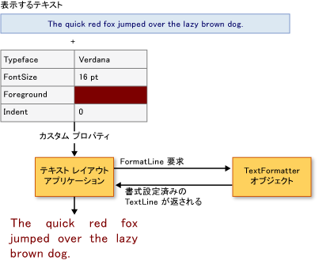

# テキストの高度な書式設定
[!INCLUDE[TLA#tla_wpf](../../../../includes/tlasharptla-wpf-md.md)] には、アプリケーションにテキストを含めるための信頼性の高い一連の [!INCLUDE[TLA#tla_api#plural](../../../../includes/tlasharptla-apisharpplural-md.md)] が用意されています。  <xref:System.Windows.Controls.TextBlock> などのレイアウトおよび[!INCLUDE[TLA#tla_ui](../../../../includes/tlasharptla-ui-md.md)] [!INCLUDE[TLA2#tla_api#plural](../../../../includes/tla2sharptla-apisharpplural-md.md)] は、テキスト表示において最も共通して一般的に使用される要素を提供します。  <xref:System.Windows.Media.GlyphRunDrawing> や <xref:System.Windows.Media.FormattedText> などの描画 [!INCLUDE[TLA2#tla_api#plural](../../../../includes/tla2sharptla-apisharpplural-md.md)] では、書式設定されたテキストを描画に含めることができます。  最も高度なレベルでは、[!INCLUDE[TLA2#tla_wpf](../../../../includes/tla2sharptla-wpf-md.md)] により、テキスト ストアの管理、テキスト ランの書式設定の管理、埋め込みオブジェクトの管理などの、テキスト表示のあらゆる面の制御を行う拡張性のあるテキスト書式設定エンジンが提供されます。  
  
 ここでは、[!INCLUDE[TLA2#tla_wpf](../../../../includes/tla2sharptla-wpf-md.md)] におけるテキスト書式設定の概要を説明します。  特に、クライアントの実装と [!INCLUDE[TLA2#tla_wpf](../../../../includes/tla2sharptla-wpf-md.md)] のテキスト書式設定エンジンの使用を重点的に説明します。  
  
> [!NOTE]
>  このドキュメント内のすべてのコード例は、[テキストの高度な書式設定のサンプル](http://go.microsoft.com/fwlink/?LinkID=159965)にあります。  
  
 [!INCLUDE[autoOutline](../Token/autoOutline_md.md)]  
  
   
## 必要条件  
 ここでは、テキスト表示に使用する高いレベルの [!INCLUDE[TLA2#tla_api#plural](../../../../includes/tla2sharptla-apisharpplural-md.md)] に精通していることを前提として説明を進めます。  ほとんどのユーザーの場合、ここで説明する [!INCLUDE[TLA2#tla_api#plural](../../../../includes/tla2sharptla-apisharpplural-md.md)] の高度なテキスト書式設定は必要ありません。  別のテキスト [!INCLUDE[TLA2#tla_api#plural](../../../../includes/tla2sharptla-apisharpplural-md.md)] の概要については、「[WPF のドキュメント](../../../../docs/framework/wpf/advanced/documents-in-wpf.md)」を参照してください。  
  
   
## テキストの高度な書式設定  
 [!INCLUDE[TLA2#tla_wpf](../../../../includes/tla2sharptla-wpf-md.md)] のテキスト レイアウトおよび [!INCLUDE[TLA2#tla_ui](../../../../includes/tla2sharptla-ui-md.md)] コントロールは、アプリケーションに書式設定されたテキストを簡単に含めることができる書式設定プロパティを提供します。  これらのコントロールは、テキストの書体、サイズ、色などのテキスト表示を処理するためのさまざまなプロパティを公開します。  通常の場合は、これらのコントロールでアプリケーション内のテキスト表示の大半を処理できます。  ただし、一部の高度な処理の場合、テキスト表示に加えてテキスト保存のコントロールも必要となります。  [!INCLUDE[TLA2#tla_wpf](../../../../includes/tla2sharptla-wpf-md.md)] では拡張可能なテキスト書式設定エンジンを使用できます。  
  
 [!INCLUDE[TLA2#tla_wpf](../../../../includes/tla2sharptla-wpf-md.md)] の高度なテキスト書式設定機能は、テキスト書式設定エンジン、テキスト ストア、テキスト ラン、および書式設定プロパティで構成されています。  テキスト書式設定エンジンである <xref:System.Windows.Media.TextFormatting.TextFormatter> により、表示用のテキスト行が作成されます。  これは、行書式設定プロセスを開始し、テキスト フォーマッタの <xref:System.Windows.Media.TextFormatting.TextFormatter.FormatLine%2A> を呼び出すことにより実行されます。  テキスト フォーマッタは、テキスト ストアの <xref:System.Windows.Media.TextFormatting.TextSource.GetTextRun%2A> メソッドを呼び出すことにより、そのストアからテキスト ランを取得します。  次に、テキスト フォーマッタにより <xref:System.Windows.Media.TextFormatting.TextRun> オブジェクトから <xref:System.Windows.Media.TextFormatting.TextLine> オブジェクトが作成され、検査または表示用にアプリケーションに渡されます。  
  
   
## テキスト フォーマッタの使用  
 <xref:System.Windows.Media.TextFormatting.TextFormatter> は [!INCLUDE[TLA2#tla_wpf](../../../../includes/tla2sharptla-wpf-md.md)] のテキスト書式設定エンジンであり、テキスト行の書式指定および改行のサービスを提供します。  テキスト フォーマッタは異なるテキスト文字形式および段落スタイルを処理でき、国際的なテキスト レイアウトがサポートされています。  
  
 従来のテキスト [!INCLUDE[TLA#tla_api](../../../../includes/tlasharptla-api-md.md)] とは異なり、<xref:System.Windows.Media.TextFormatting.TextFormatter> は一連のコールバック メソッドを使用して、テキスト レイアウト クライアントと対話します。  このテキスト フォーマッタを使用するには、クライアントが <xref:System.Windows.Media.TextFormatting.TextSource> クラスの実装にこれらのメソッドを提供している必要があります。  クライアント アプリケーションと <xref:System.Windows.Media.TextFormatting.TextFormatter> の間のテキスト レイアウトの対話を次の図に示します。  
  
   
アプリケーションと TextFormatter の対話  
  
 テキスト フォーマッタは、<xref:System.Windows.Media.TextFormatting.TextSource> の実装であるテキスト ストアから書式設定されたテキスト行を取得するために使用されます。  これは、最初に <xref:System.Windows.Media.TextFormatting.TextFormatter.Create%2A> メソッドを使用してテキスト フォーマッタのインスタンスを作成することにより実行されます。  このメソッドによりテキスト フォーマッタのインスタンスが作成され、行の最大高と最大幅が設定されます。  テキスト フォーマッタのインスタンスが作成されると直ちに、<xref:System.Windows.Media.TextFormatting.TextFormatter.FormatLine%2A> メソッドを呼び出すことにより、行作成プロセスが開始されます。  <xref:System.Windows.Media.TextFormatting.TextFormatter> によりテキストのソースが呼び戻され、行を形成する一続きのテキストの、テキストと書式設定パラメーターが取得されます。  
  
 次の例では、テキスト ストアを書式設定するプロセスを示します。  <xref:System.Windows.Media.TextFormatting.TextFormatter> オブジェクトを使用してテキスト ストアからテキスト行が取得され、<xref:System.Windows.Media.DrawingContext> に描画するテキスト行が書式設定されます。  
  
 [!code-csharp[TextFormatterExample#100](../../../../samples/snippets/csharp/VS_Snippets_Wpf/TextFormatterExample/CSharp/Window1.xaml.cs#100)]
 [!code-vb[TextFormatterExample#100](../../../../samples/snippets/visualbasic/VS_Snippets_Wpf/TextFormatterExample/VisualBasic/Window1.xaml.vb#100)]  
  
   
## クライアント テキスト ストアの実装  
 テキスト書式設定エンジンを拡張する場合は、テキスト ストアをすべての面で実装および管理する必要があります。  これは単純な作業ではありません。  テキスト ストアの役割は、テキスト ランのプロパティ、段落プロパティ、埋め込みオブジェクト、およびその他の類似したコンテンツを追跡することです。  また、テキスト ストアは、<xref:System.Windows.Media.TextFormatting.TextLine> オブジェクトを作成するときにテキスト フォーマッタが使用する、個々の <xref:System.Windows.Media.TextFormatting.TextRun> オブジェクトをテキスト フォーマッタに提供します。  
  
 テキスト ストアの仮想化を処理する場合は、テキスト ストアが <xref:System.Windows.Media.TextFormatting.TextSource> から派生している必要があります。  <xref:System.Windows.Media.TextFormatting.TextSource> では、テキスト フォーマッタがテキスト ストアからテキスト ランを取得するために使用するメソッドが定義されています。  <xref:System.Windows.Media.TextFormatting.TextSource.GetTextRun%2A> は、行の書式設定に使用されるテキスト ランを取得するためにテキスト フォーマッタが使用するメソッドです。  次のいずれかの条件が発生するまで、<xref:System.Windows.Media.TextFormatting.TextSource.GetTextRun%2A> はテキスト フォーマッタによって繰り返し呼び出されます。  
  
-   <xref:System.Windows.Media.TextFormatting.TextEndOfLine> またはサブクラスが返された場合。  
  
-   テキスト ランの累積幅が、テキスト フォーマッタを作成する呼び出し、またはテキスト フォーマッタの <xref:System.Windows.Media.TextFormatting.TextFormatter.FormatLine%2A> メソッドのいずれかに指定されている行の最大幅を超えた場合。  
  
-   "CF"、"LF"、または "CRLF" などの [!INCLUDE[TLA#tla_unicode](../../../../includes/tlasharptla-unicode-md.md)] 改行シーケンスが返された場合。  
  
   
## テキスト ランの提供  
 テキスト フォーマッタとテキスト ストアの間の対話は、テキスト書式設定プロセスにおける中核となります。  <xref:System.Windows.Media.TextFormatting.TextSource> を実装することにより、テキスト フォーマッタに <xref:System.Windows.Media.TextFormatting.TextRun> オブジェクトおよびテキスト ランの書式設定に使用されるプロパティが提供されます。  この対話は、テキスト フォーマッタによって呼び出される <xref:System.Windows.Media.TextFormatting.TextSource.GetTextRun%2A> メソッドによって処理されます。  
  
 定義済みの <xref:System.Windows.Media.TextFormatting.TextRun> オブジェクトの一部を次の表に示します。  
  
|TextRun 型|使用方法|  
|---------------|----------|  
|<xref:System.Windows.Media.TextFormatting.TextCharacters>|テキスト フォーマッタに文字グリフの表示を戻すために使用される、特殊なテキスト ランです。|  
|<xref:System.Windows.Media.TextFormatting.TextEmbeddedObject>|ボタン、テキスト内の画像などの、測定、ヒット テスト、描画がすべて実行されるコンテンツを提供するために使用される、特殊なテキスト ランです。|  
|<xref:System.Windows.Media.TextFormatting.TextEndOfLine>|行の終わりを示すために使用される、特殊なテキスト ランです。|  
|<xref:System.Windows.Media.TextFormatting.TextEndOfParagraph>|段落の終わりを示すために使用される、特殊なテキスト ランです。|  
|<xref:System.Windows.Media.TextFormatting.TextEndOfSegment>|前の <xref:System.Windows.Media.TextFormatting.TextModifier> 実行の影響を受けるスコープを終了する場合のように、セグメントの終わりを示すために使用される特殊なテキスト ランです。|  
|<xref:System.Windows.Media.TextFormatting.TextHidden>|隠し文字の範囲を示すために使用される特殊なテキスト ランです。|  
|<xref:System.Windows.Media.TextFormatting.TextModifier>|スコープ内のテキスト ランのプロパティを変更するために使用される、特殊なテキスト ランです。  この範囲は、次に一致する <xref:System.Windows.Media.TextFormatting.TextEndOfSegment> のテキスト ラン、または次の <xref:System.Windows.Media.TextFormatting.TextEndOfParagraph> まで拡張されます。|  
  
 定義済みの <xref:System.Windows.Media.TextFormatting.TextRun> オブジェクトは、すべてサブクラス化できます。  これにより、カスタム データを含むテキスト ランをテキスト ソースからテキスト フォーマッタに提供できます。  
  
 <xref:System.Windows.Media.TextFormatting.TextSource.GetTextRun%2A> メソッドの例を次に示します。  このテキスト ストアは、次のテキスト フォーマッタに <xref:System.Windows.Media.TextFormatting.TextRun> オブジェクトを返して処理を行います。  
  
 [!code-csharp[TextFormatterExample#101](../../../../samples/snippets/csharp/VS_Snippets_Wpf/TextFormatterExample/CSharp/CustomTextSource.cs#101)]
 [!code-vb[TextFormatterExample#101](../../../../samples/snippets/visualbasic/VS_Snippets_Wpf/TextFormatterExample/VisualBasic/CustomTextSource.vb#101)]  
  
> [!NOTE]
>  この例では、テキスト ストアによりすべてのテキストに対して同じテキスト プロパティが提供されます。  高度なテキスト ストアの場合、個々の文字に異なるプロパティを持たせるために、それぞれのテキスト ストア の範囲管理を実装する必要があります。  
  
   
## 書式設定プロパティの指定  
 <xref:System.Windows.Media.TextFormatting.TextRun> オブジェクトは、テキスト ストアによって提供されるプロパティを使用して書式設定されます。  このようなプロパティには、<xref:System.Windows.Media.TextFormatting.TextParagraphProperties> と <xref:System.Windows.Media.TextFormatting.TextRunProperties> の 2 つの型があります。  <xref:System.Windows.Media.TextFormatting.TextParagraphProperties> は、<xref:System.Windows.TextAlignment> や <xref:System.Windows.FlowDirection> などの、段落の包括的なプロパティを処理します。  <xref:System.Windows.Media.TextFormatting.TextRunProperties> は、前景ブラシ、<xref:System.Windows.Media.Typeface>、およびフォント サイズなどの、段落内のそれぞれのテキスト ランで異なるプロパティです。  カスタム段落プロパティ型およびカスタム テキスト ラン プロパティ型を実装するには、アプリケーションでそれぞれ <xref:System.Windows.Media.TextFormatting.TextParagraphProperties> および <xref:System.Windows.Media.TextFormatting.TextRunProperties> から派生するクラスを作成する必要があります。  
  
## 参照  
 [WPF のタイポグラフィ](../../../../docs/framework/wpf/advanced/typography-in-wpf.md)   
 [WPF のドキュメント](../../../../docs/framework/wpf/advanced/documents-in-wpf.md)