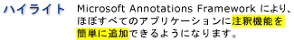
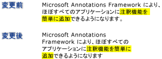

# 注釈の概要
用紙にメモやコメントを書くことは普通の行為であり、人はそれを当たり前のことと思っています。 そのようなメモやコメントが "注釈" です。注釈をドキュメントに追加することで情報に目印を付け、興味のある内容を強調表示し、後で参照します。 印刷したドキュメントにメモを書くことは簡単で一般的な行為ですが、電子ドキュメントに個人的なコメントを追加する機能は利用できるとしても一般的に非常に限定されています。  
  
 このトピックでは、一般的な種類の注釈について取り上げます (特に付箋やハイライトについて)。また、[!INCLUDE[TLA#tla_caf](../../../../includes/tlasharptla-caf-md.md)] では、[!INCLUDE[TLA#tla_wpf](../../../../includes/tlasharptla-wpf-md.md)] ドキュメント表示コントロールを使用し、アプリケーションでそのような種類の注釈を便利に利用できます。  [!INCLUDE[TLA2#tla_wpf](../../../../includes/tla2sharptla-wpf-md.md)]注釈をサポートするドキュメント表示コントロールを含める<xref:System.Windows.Controls.FlowDocumentReader>と<xref:System.Windows.Controls.FlowDocumentScrollViewer>から派生したコントロールにも、<xref:System.Windows.Controls.Primitives.DocumentViewerBase>など<xref:System.Windows.Controls.DocumentViewer>と<xref:System.Windows.Controls.FlowDocumentPageViewer>です。  
  
  
   
## 付箋  
 典型的な付箋とは、色の付いた小さな紙切れに情報を記入し、書類に "貼り付ける" というものです。 デジタル付箋は電子ドキュメントのために同様の機能を提供しますが、さまざまなコンテンツを追加できるという柔軟性があります。タイプしたテキスト、手書きのメモ ([!INCLUDE[TLA#tla_tpc](../../../../includes/tlasharptla-tpc-md.md)] の "インク" ストロークなど)、Web リンクなどです。  
  
 次の図では、蛍光ペン、テキスト付箋、インク付箋で注釈を付けていることを確認できます。  
  
   
  
 次は、アプリケーションで注釈サポートを有効にするためのメソッドのサンプルです。  
  
 [!code-csharp[DocViewerAnnotationsXml#DocViewXmlStartAnnotations](../../../../samples/snippets/csharp/VS_Snippets_Wpf/DocViewerAnnotationsXml/CSharp/Window1.xaml.cs#docviewxmlstartannotations)]
 [!code-vb[DocViewerAnnotationsXml#DocViewXmlStartAnnotations](../../../../samples/snippets/visualbasic/VS_Snippets_Wpf/DocViewerAnnotationsXml/visualbasic/window1.xaml.vb#docviewxmlstartannotations)]  
  
   
## 強調表示  
 書面であれば、下線を引いたり、蛍光ペンでなぞったり、ドキュメント内の単語を囲んだり、余白に目印や注釈を付けたりするなど、さまざまな方法で書き込みを行い、興味のある項目を目立たせることができます。  [!INCLUDE[TLA#tla_caf](../../../../includes/tlasharptla-caf-md.md)] の注釈の強調表示にも同様の機能があります。[!INCLUDE[TLA2#tla_wpf](../../../../includes/tla2sharptla-wpf-md.md)] ドキュメント表示コントロールに表示される情報に書き込むことができます。  
  
 次の図は、注釈の強調表示のサンプルです。  
  
   
  
 ユーザーは通常、まずいくつかのテキストまたは、目的の項目を選択し、表示するを右クリックして注釈を作成、<xref:System.Windows.Controls.ContextMenu>注釈オプション。  次の例は、[!INCLUDE[TLA#tla_xaml](../../../../includes/tlasharptla-xaml-md.md)]宣言に使用できる、<xref:System.Windows.Controls.ContextMenu>ルーティングのコマンドを作成して注釈を管理ユーザーがアクセスできるとします。  
  
 [!code-xaml[DocViewerAnnotationsXps#CreateDeleteAnnotations](../../../../samples/snippets/csharp/VS_Snippets_Wpf/DocViewerAnnotationsXps/CSharp/Window1.xaml#createdeleteannotations)]  
  
   
## データの固定  
 [!INCLUDE[TLA2#tla_caf](../../../../includes/tla2sharptla-caf-md.md)] は、表示レイアウトの特定の位置に注釈を結び付けるだけでなく、ユーザーが選択するデータに注釈を固定します。 そのため、スクロールしたり、表示ウィンドウのサイズを変更したりするなど、ドキュメントの表示が変わっても、注釈はそれが固定されているデータにとどまります。 たとえば、次の図をご覧ください。選択したテキストが蛍光ペンでなぞられています。 ドキュメントの表示が変わると (スクロール、サイズ変更、拡大/縮小、その他の移動)、蛍光ペンは元のデータ選択と一緒に移動します。  
  
   
  
   
## 注釈と注釈付きオブジェクトを照合する  
 注釈とそれに対応する注釈付きオブジェクトを照合できます。 たとえば、コメント ウィンドウが付いている単純なドキュメント リーダー アプリケーションを想像してください。 そのコメント ウィンドウにはリスト ボックスがあり、そのリスト ボックスに、ドキュメントに固定されている注釈の一覧からのテキストが表示されます。 リスト ボックスの項目を選択すると、それに対応する注釈オブジェクトが固定されている段落がドキュメントに表示されます。  
  
 次の例を見ると、コメント ウィンドウとして機能するそのようなリスト ボックスのイベント ハンドラーの実装方法がわかります。  
  
 [!code-csharp[FlowDocumentAnnotatedViewer#Handler](../../../../samples/snippets/csharp/VS_Snippets_Wpf/FlowDocumentAnnotatedViewer/CSharp/Window1.xaml.cs#handler)]
 [!code-vb[FlowDocumentAnnotatedViewer#Handler](../../../../samples/snippets/visualbasic/VS_Snippets_Wpf/FlowDocumentAnnotatedViewer/visualbasic/window1.xaml.vb#handler)]  
  
 他のシナリオ例としては、電子メールを利用し、ドキュメント リーダー間で注釈や付箋を交換できるアプリケーションがあります。 そのような機能を利用すると、交換された注釈を含むページにドキュメント リーダーで移動できます。  
  
## 参照  
 <xref:System.Windows.Controls.Primitives.DocumentViewerBase>  
 <xref:System.Windows.Controls.DocumentViewer>  
 <xref:System.Windows.Controls.FlowDocumentPageViewer>  
 <xref:System.Windows.Controls.FlowDocumentScrollViewer>  
 <xref:System.Windows.Controls.FlowDocumentReader>  
 <xref:System.Windows.Annotations.IAnchorInfo>  
 [注釈スキーマ](../../../../docs/framework/wpf/advanced/annotations-schema.md)  
 [ContextMenu の概要](../../../../docs/framework/wpf/controls/contextmenu-overview.md)  
 [コマンド実行の概要](../../../../docs/framework/wpf/advanced/commanding-overview.md)  
 [フロー ドキュメントの概要](../../../../docs/framework/wpf/advanced/flow-document-overview.md)  
 [方法: メニュー アイテムにコマンドを追加する](http://msdn.microsoft.com/en-us/013d68a0-5373-4a68-bd91-5de574307370)
