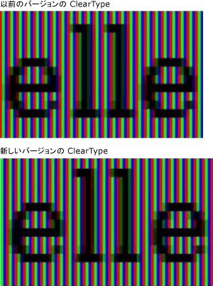
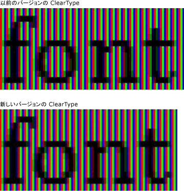
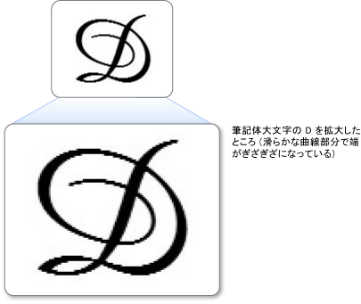
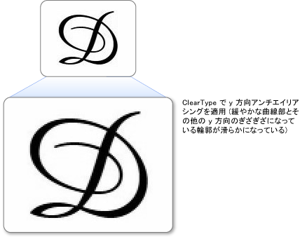

# ClearType の概要
このトピックでは、[!INCLUDE[TLA#tla_winclient](../../../../includes/tlasharptla-winclient-md.md)] の [!INCLUDE[TLA#tla_ct](../../../../includes/tlasharptla-ct-md.md)] テクノロジの概要について説明します。  
  
  
   
## テクノロジの概要  
 [!INCLUDE[TLA2#tla_ct](../../../../includes/tla2sharptla-ct-md.md)] は、ラップトップや Pocket PC の画面、フラット パネル モニターなど、既存の LCD (液晶ディスプレイ) でのテキストの読みやすさを向上させるために [!INCLUDE[TLA#tla_ms](../../../../includes/tlasharptla-ms-md.md)] が開発したソフトウェア テクノロジです。  [!INCLUDE[TLA2#tla_ct](../../../../includes/tla2sharptla-ct-md.md)] は、LCD 画面の各ピクセル内の個々の垂直カラー ストライプ要素にアクセスすることによって機能します。 [!INCLUDE[TLA2#tla_ct](../../../../includes/tla2sharptla-ct-md.md)] が開発されるまでは、コンピューターで表示可能な最小の詳細レベルは 1 ピクセルでしたが、[!INCLUDE[TLA2#tla_ct](../../../../includes/tla2sharptla-ct-md.md)] を LCD モニターで実行することで、テキストの各部分の幅が 1 ピクセルより小さくても表示できるようになりました。 解像度が上がるとテキスト表示の微細部の鮮明度が高くなるため、長時間にわたって読んでも苦になりません。  
  
 [!INCLUDE[TLA#tla_winclient](../../../../includes/tlasharptla-winclient-md.md)] で利用可能な [!INCLUDE[TLA2#tla_ct](../../../../includes/tla2sharptla-ct-md.md)] は、[!INCLUDE[TLA#tla_gdi](../../../../includes/tlasharptla-gdi-md.md)] に含まれるバージョンにいくつかの改良を加えた最新世代の [!INCLUDE[TLA2#tla_ct](../../../../includes/tla2sharptla-ct-md.md)] です。  
  
   
## サブピクセル ポジショニング  
 [!INCLUDE[TLA2#tla_ct](../../../../includes/tla2sharptla-ct-md.md)] の以前のバージョンから大きく改善された点の 1 つに、サブピクセル ポジショニングの使用があります。 [!INCLUDE[TLA2#tla_gdi](../../../../includes/tla2sharptla-gdi-md.md)] に含まれている [!INCLUDE[TLA2#tla_ct](../../../../includes/tla2sharptla-ct-md.md)] 実装とは異なり、[!INCLUDE[TLA#tla_winclient](../../../../includes/tlasharptla-winclient-md.md)] の [!INCLUDE[TLA2#tla_ct](../../../../includes/tla2sharptla-ct-md.md)] では、ピクセルの境界から開始するグリフだけでなく、ピクセルの途中から開始するグリフも表示できます。 グリフの配置の解像度が上がることにより、グリフの間隔や比率の正確さや一貫性が増します。  
  
 次の 2 つの例は、サブピクセル ポジショニングを使用した場合にサブピクセル境界でグリフを開始できることを示しています。 左側の例は、サブピクセル ポジショニングが採用されていない、以前のバージョンの [!INCLUDE[TLA2#tla_ct](../../../../includes/tla2sharptla-ct-md.md)] レンダラーを使用してレンダリングしたものです。 右側の例は、新しいバージョンの [!INCLUDE[TLA2#tla_ct](../../../../includes/tla2sharptla-ct-md.md)] レンダラーで、サブピクセル ポジショニングを使用してレンダリングしたものです。 右側のイメージの **e** と **l** が、それぞれ異なるサブピクセルから開始しているために若干異なってレンダリングされていることに注意してください。 グリフ イメージはハイ コントラストであるため、テキストを標準サイズで画面に表示したときは、この違いはわかりません。 これは、[!INCLUDE[TLA2#tla_ct](../../../../includes/tla2sharptla-ct-md.md)] に組み込まれている高度なカラー フィルター処理によってのみ実現します。  
  
   
ClearType の以前のバージョンと新しいバージョンを使用して表示されるテキスト  
  
 次の 2 つの例では、以前のバージョンの [!INCLUDE[TLA2#tla_ct](../../../../includes/tla2sharptla-ct-md.md)] レンダラーでの出力と新バージョンの [!INCLUDE[TLA2#tla_ct](../../../../includes/tla2sharptla-ct-md.md)] レンダラーの出力を比較しています。 右側に示したサブピクセル ポジショニングでは、画面上の文字の間隔が大きく改善されています。特に、サブピクセル 1 個とピクセル 1 個の差がグリフの幅に占める割合の大きい、小さなサイズの場合によくわかります。 2 番目のイメージの方が、文字の間隔が均等に近くなっています。 サブピクセル ポジショニングによるさまざまなメリットがテキスト画面全体の外観に及ぼす効果は大幅に増加しましたが、これは [!INCLUDE[TLA2#tla_ct](../../../../includes/tla2sharptla-ct-md.md)] テクノロジが大きく進歩したことを表しています。  
  
   
ClearType の以前のバージョンと新しいバージョンを使用したテキスト  
  
   
## Y 方向のアンチエイリアシング  
 [!INCLUDE[TLA#tla_winclient](../../../../includes/tlasharptla-winclient-md.md)] の [!INCLUDE[TLA2#tla_ct](../../../../includes/tla2sharptla-ct-md.md)] のもう 1 つの改善点は、y 方向のアンチエイリアシングです。 y 方向のアンチエイリアシングを行わない [!INCLUDE[TLA2#tla_gdi](../../../../includes/tla2sharptla-gdi-md.md)] の [!INCLUDE[TLA2#tla_ct](../../../../includes/tla2sharptla-ct-md.md)] では、x 軸上では高い解像度を得られますが、y 軸上では解像度が低くなります。 緩やかな曲線部分の上下では、境界がギザギザになって読みにくくなります。  
  
 次の例では、y 方向のアンチエイリアシングを使用しない場合の効果を示します。 この場合、文字の上下で境界がギザギザになっていることがよくわかります。  
  
   
緩やかな曲線上にギザギザした境界が付いたテキスト  
  
 [!INCLUDE[TLA#tla_winclient](../../../../includes/tlasharptla-winclient-md.md)] の [!INCLUDE[TLA2#tla_ct](../../../../includes/tla2sharptla-ct-md.md)] には、ギザギザした境界を滑らかにする y 方向レベルのアンチエイリアシング機能があります。 これは、東アジア言語を読みやすくするために特に重要です。これらの言語の表意文字では、緩やかな曲線の量が水平方向と垂直方向でほぼ同じであるからです。  
  
 次の例では、y 方向のアンチエイリアシングの効果を示します。 この場合、文字の上下の曲線が滑らかに表示されています。  
  
   
ClearType の y 方向アンチエイリアシングを適用したテキスト  
  
   
## ハードウェアの高速化  
 [!INCLUDE[TLA#tla_winclient](../../../../includes/tlasharptla-winclient-md.md)] の [!INCLUDE[TLA2#tla_ct](../../../../includes/tla2sharptla-ct-md.md)] は、ハードウェア アクセラレーションを利用してパフォーマンスを向上させ、CPU の負荷および必要なシステム メモリを削減します。 グラフィックス カードのピクセル シェーダーおよびビデオ メモリを使用することにより、[!INCLUDE[TLA2#tla_ct](../../../../includes/tla2sharptla-ct-md.md)] では特にアニメーション使用時のテキストのレンダリングが速くなります。  
  
 [!INCLUDE[TLA#tla_winclient](../../../../includes/tlasharptla-winclient-md.md)] の [!INCLUDE[TLA2#tla_ct](../../../../includes/tla2sharptla-ct-md.md)] によって、システム全体の [!INCLUDE[TLA2#tla_ct](../../../../includes/tla2sharptla-ct-md.md)] 設定が変更されることはありません。 [!INCLUDE[TLA#tla_mswin](../../../../includes/tlasharptla-mswin-md.md)] の [!INCLUDE[TLA2#tla_ct](../../../../includes/tla2sharptla-ct-md.md)] を無効にすると、[!INCLUDE[TLA#tla_winclient](../../../../includes/tlasharptla-winclient-md.md)] のアンチエイリアシングがグレースケール モードに設定されます。 また、[!INCLUDE[TLA#tla_winclient](../../../../includes/tlasharptla-winclient-md.md)] の [!INCLUDE[TLA2#tla_ct](../../../../includes/tla2sharptla-ct-md.md)] によって、[ClearType Tuner PowerToy](http://www.microsoft.com/typography/ClearTypePowerToy.mspx) の設定が変更されることはありません。  
  
 [!INCLUDE[TLA#tla_winclient](../../../../includes/tlasharptla-winclient-md.md)] のアーキテクチャ設計における決定事項の 1 つに、解像度に依存しないレイアウトによる高解像度 DPI モニターのサポート向上があります。高解像度モニターの普及は進みつつあるからです。 この決定を受けて、[!INCLUDE[TLA#tla_winclient](../../../../includes/tlasharptla-winclient-md.md)] ではエイリアス化されたテキスト レンダリングや、一部の東アジア言語フォントのビットマップをサポートしないことになりました。これらはどちらも解像度に依存するためです。  
  
   
## 詳細情報  
 [ClearType の情報](http://www.microsoft.com/typography/ClearTypeInfo.mspx)  
  
 [ClearType Tuner PowerToy](http://www.microsoft.com/typography/ClearTypePowerToy.mspx)  
  
## 関連項目  
 [ClearType レジストリの設定](../../../../docs/framework/wpf/advanced/cleartype-registry-settings.md)
