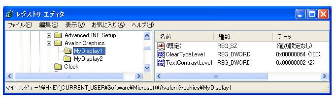
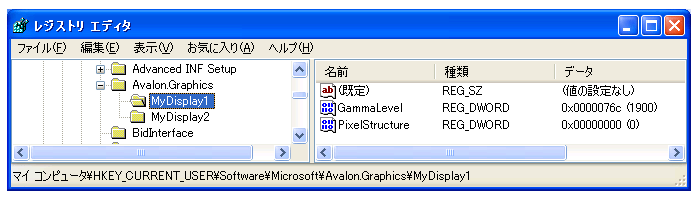

# ClearType レジストリの設定
このトピックの概要を説明する、 [!INCLUDE[TLA2#tla_winclient](../../../../includes/tla2sharptla-winclient-md.md)] [!INCLUDE[TLA#tla_ct](../../../../includes/tlasharptla-ct-md.md)]によって使用されているレジストリ設定[!INCLUDE[TLA2#tla_winclient](../../../../includes/tla2sharptla-winclient-md.md)]アプリケーションです。  
  
  
   
## テクノロジの概要  
 [!INCLUDE[TLA2#tla_winclient](../../../../includes/tla2sharptla-winclient-md.md)] ディスプレイ デバイスを使用するテキストを表示するアプリケーション[!INCLUDE[TLA2#tla_ct](../../../../includes/tla2sharptla-ct-md.md)]機能強化された閲覧エクスペリエンスを提供します。 [!INCLUDE[TLA2#tla_ct](../../../../includes/tla2sharptla-ct-md.md)] は、ラップトップや Pocket PC の画面、フラット パネル モニターなど、既存の LCD (液晶ディスプレイ) でのテキストの読みやすさを向上させるために [!INCLUDE[TLA#tla_ms](../../../../includes/tlasharptla-ms-md.md)] が開発したソフトウェア テクノロジです。 [!INCLUDE[TLA2#tla_ct](../../../../includes/tla2sharptla-ct-md.md)] は、LCD 画面の各ピクセル内の個々の垂直カラー ストライプ要素にアクセスすることによって機能します。 詳細については[!INCLUDE[TLA2#tla_ct](../../../../includes/tla2sharptla-ct-md.md)]を参照してください[ClearType 概要](../../../../docs/framework/wpf/advanced/cleartype-overview.md)です。  
  
 表示されるテキストを[!INCLUDE[TLA2#tla_ct](../../../../includes/tla2sharptla-ct-md.md)]さまざまな表示のデバイスで表示したときに大幅に異なる表示されることができます。 たとえば、モニターの数が少ない実装青、緑、赤の順序でカラー ストライプ要素ではなく、一般的な赤、緑、青 ( [!INCLUDE[TLA#tla_rgb](../../../../includes/tlasharptla-rgb-md.md)]) 順序。  
  
 表示されるテキストを[!INCLUDE[TLA2#tla_ct](../../../../includes/tla2sharptla-ct-md.md)]色の感度のレベルで表示したときに大幅に異なるも表示できます。 他の人よりも色のわずかな違いを見分ける能力に長けている人もいます。  
  
 このような場合は、の各[!INCLUDE[TLA2#tla_ct](../../../../includes/tla2sharptla-ct-md.md)]機能が最もごとに読みを提供するために変更する必要があります。  
  
   
## レジストリ設定  
 [!INCLUDE[TLA2#tla_winclient](../../../../includes/tla2sharptla-winclient-md.md)] 制御するための 4 つのレジストリ設定の指定[!INCLUDE[TLA2#tla_ct](../../../../includes/tla2sharptla-ct-md.md)]機能。  
  
|設定|説明|  
|-------------|-----------------|  
|[!INCLUDE[TLA2#tla_ct](../../../../includes/tla2sharptla-ct-md.md)] レベル|レベルを示します[!INCLUDE[TLA2#tla_ct](../../../../includes/tla2sharptla-ct-md.md)]わかりやすくするための色します。|  
|ガンマ レベル|ディスプレイ デバイスのピクセル カラー コンポーネントのレベルを示します。|  
|ピクセル構造|ディスプレイ デバイスのピクセルの配置を示します。|  
|テキストのコントラスト レベル|表示されるテキストのコントラストのレベルを示します。|  
  
 これらの設定は、識別されたを参照する方法を知っている外部構成ユーティリティによってアクセスできる[!INCLUDE[TLA2#tla_winclient](../../../../includes/tla2sharptla-winclient-md.md)][!INCLUDE[TLA2#tla_ct](../../../../includes/tla2sharptla-ct-md.md)]レジストリ設定します。 これらの設定は、[!INCLUDE[TLA#tla_mswin](../../../../includes/tlasharptla-mswin-md.md)] レジストリ エディターを使用して値に直接アクセスして作成または変更することもできます。  
  
 場合、 [!INCLUDE[TLA2#tla_winclient](../../../../includes/tla2sharptla-winclient-md.md)] [!INCLUDE[TLA2#tla_ct](../../../../includes/tla2sharptla-ct-md.md)]レジストリ設定されていません (既定の状態) である、[!INCLUDE[TLA2#tla_winclient](../../../../includes/tla2sharptla-winclient-md.md)]アプリケーション クエリ、[!INCLUDE[TLA#tla_mswin](../../../../includes/tlasharptla-mswin-md.md)]フォント スムージング設定のシステム パラメーターの情報です。  
  
> [!NOTE]
>  デバイスの表示名を列挙する方法の詳細については、次を参照してください。、 `SystemParametersInfo` [!INCLUDE[TLA2#tla_win32](../../../../includes/tla2sharptla-win32-md.md)]関数。  
  
   
## ClearType レベル  
 [!INCLUDE[TLA2#tla_ct](../../../../includes/tla2sharptla-ct-md.md)]レベルでは、色と小文字の区別と、1 つの認識に基づいてテキストのレンダリングを調整することができます。 一部のユーザーでは、テキストのレンダリングを使用する[!INCLUDE[TLA2#tla_ct](../../../../includes/tla2sharptla-ct-md.md)]最上位のレベルは生成されませんが最も読みです。  
  
 [!INCLUDE[TLA2#tla_ct](../../../../includes/tla2sharptla-ct-md.md)]レベルは、0 から 100 の範囲の整数値。 既定のレベルは 100、つまり[!INCLUDE[TLA2#tla_ct](../../../../includes/tla2sharptla-ct-md.md)]ディスプレイ デバイスのカラー ストライプ要素の最大の機能を使用しています。 ただし、[!INCLUDE[TLA2#tla_ct](../../../../includes/tla2sharptla-ct-md.md)]レベル 0 は、[グレースケール] としてテキストを描画します。 設定して、[!INCLUDE[TLA2#tla_ct](../../../../includes/tla2sharptla-ct-md.md)]レベル 0 ~ 100 の任意の場所を作成できます中間レベルが適切に個々 の色の感度をします。  
  
### レジストリ設定  
 レジストリ設定の場所、[!INCLUDE[TLA2#tla_ct](../../../../includes/tla2sharptla-ct-md.md)]レベルは、特定のディスプレイ デバイス名に対応する個々 のユーザー設定。  
  
 `HKEY_CURRENT_USER\SOFTWARE\Microsoft\Avalon.Graphics\<displayName>`  
  
 各デバイス名で、ユーザーの`ClearTypeLevel`DWORD 値を定義します。 次のスクリーン ショットのレジストリ エディターの設定を示しています、[!INCLUDE[TLA2#tla_ct](../../../../includes/tla2sharptla-ct-md.md)]レベル。  
  
   
  
> [!NOTE]
>  [!INCLUDE[TLA2#tla_winclient](../../../../includes/tla2sharptla-winclient-md.md)] アプリケーションとそうでないか 2 つのモードのいずれかのテキストのレンダリング[!INCLUDE[TLA2#tla_ct](../../../../includes/tla2sharptla-ct-md.md)]です。 なしのテキストを表示する際に[!INCLUDE[TLA2#tla_ct](../../../../includes/tla2sharptla-ct-md.md)]グレースケールのレンダリングと呼びます。  
  
   
## ガンマ レベル  
 ガンマ レベルとは、ピクセル値と輝度間の非線形リレーションシップのことです。 ガンマ レベル設定は、ディスプレイ デバイスの物理特性に対応する必要があります。対応していない場合、レンダリング出力にゆがみが発生する場合があります。 たとえば、テキストの表示が広すぎたり狭すぎたりする場合や、色縁がグリフの縦線の端に表示される場合などがあります。  
  
 ガンマ レベルは、1000 から 2200 の範囲の整数値です。 既定のレベルは 1900 です。  
  
### レジストリ設定  
 ガンマ レベルのレジストリ設定は、特定のディスプレイ デバイス名に対応するローカル マシン設定の場所にあります。  
  
 `HKEY_LOCAL_MACHINE\SOFTWARE\Microsoft\Avalon.Graphics\<displayName>`  
  
 各デバイス名で、ユーザーの`GammaLevel`DWORD 値を定義します。 次のスクリーンショットは、ガンマ レベルのレジストリ エディターの設定を示しています。  
  
   
  
   
## ピクセル構造  
 ピクセル構造は、ディスプレイ デバイスを構成するピクセルの種類を示します。 ピクセル構造は、次の 3 種類のいずれかとして定義されます。  
  
|型|[値]|説明|  
|----------|-----------|-----------------|  
|フラット|0|ディスプレイ デバイスにピクセル構造がありません。 つまり、各色の光源がピクセル領域に均等に拡散しています。これは、グレースケール レンダリングと呼ばれます。 標準のディスプレイ デバイスはこのようにして機能します。 [!INCLUDE[TLA2#tla_ct](../../../../includes/tla2sharptla-ct-md.md)] はレンダリングされたテキストに適用されません。|  
|RGB|1|ディスプレイ デバイスのピクセルは、赤、緑、青の順の 3 つのストライプで構成されます。 [!INCLUDE[TLA2#tla_ct](../../../../includes/tla2sharptla-ct-md.md)] がレンダリングされたテキストに適用されます。|  
|BGR|2|ディスプレイ デバイスのピクセルは、青、緑、赤の順の 3 つのストライプで構成されます。 [!INCLUDE[TLA2#tla_ct](../../../../includes/tla2sharptla-ct-md.md)] がレンダリングされたテキストに適用されます。 順序が RGB の場合の逆であることに注目してください。|  
  
 ピクセル構造は、0 から 2 の範囲の整数値に対応します。 既定のレベルは 0 です。これは、フラット ピクセル構造を表します。  
  
> [!NOTE]
>  デバイスの表示名を列挙する方法の詳細については、次を参照してください。、 `EnumDisplayDevices` [!INCLUDE[TLA2#tla_win32](../../../../includes/tla2sharptla-win32-md.md)]関数。  
  
### レジストリ設定  
 ピクセル構造のレジストリ設定は、特定のディスプレイ デバイス名に対応するローカル マシン設定の場所にあります。  
  
 `HKEY_LOCAL_MACHINE\SOFTWARE\Microsoft\Avalon.Graphics\<displayName>`  
  
 各デバイス名で、ユーザーの`PixelStructure`DWORD 値を定義します。 次のスクリーンショットは、ピクセル構造のレジストリ エディターの設定を示しています。  
  
   
  
   
## テキストのコントラスト レベル  
 テキストのコントラスト レベルを設定すると、グリフの縦線の幅に基づいてテキストのレンダリングを調整できます。 テキストのコントラスト レベルは 0 から 6 の範囲の整数値です。整数値を大きくすると、縦線の幅が広くなります。 既定のレベルは 1 です。  
  
### レジストリ設定  
 テキストのコントラスト レベルのレジストリ設定は、特定のディスプレイ デバイス名に対応する個々のユーザー設定の場所にあります。  
  
 `HKEY_CURRENT_USER\Software\Microsoft\Avalon.Graphics\<displayName>`  
  
 各デバイス名で、ユーザーの`TextContrastLevel`DWORD 値を定義します。 次のスクリーンショットは、テキストのコントラスト レベルのレジストリ エディターの設定を示しています。  
  
   
  
## 関連項目  
 [ClearType の概要](../../../../docs/framework/wpf/advanced/cleartype-overview.md)  
 [ClearType アンチエイリアシング](https://msdn.microsoft.com/library/dd183433(v=vs.85).aspx)
