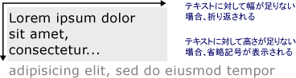

# 書式設定されたテキストの描画Drawing Formatted Text
このトピックの機能の概要を示します、<xref:System.Windows.Media.FormattedText>オブジェクト。This topic provides an overview of the features of the <xref:System.Windows.Media.FormattedText> object. このオブジェクトは、[!INCLUDE[TLA#tla_winclient](../../../../includes/tlasharptla-winclient-md.md)] アプリケーションでのテキストの描画に対する低レベルの制御を提供します。This object provides low-level control for drawing text in [!INCLUDE[TLA#tla_winclient](../../../../includes/tlasharptla-winclient-md.md)] applications.  
  
  
## テクノロジの概要Technology Overview  
 <xref:System.Windows.Media.FormattedText>オブジェクトでは、これで、テキスト内の各文字形式指定できる個別に、複数行のテキストを描画することができます。The <xref:System.Windows.Media.FormattedText> object allows you to draw multi-line text, in which each character in the text can be individually formatted. 複数の書式が適用されたテキストを次の例に示します。The following example shows text that has several formats applied to it.  
  
   
FormattedText オブジェクトを使用して表示されるテキストDisplayed text using FormattedText method  
  
> [!NOTE]
>  [!INCLUDE[TLA#tla_win32](../../../../includes/tlasharptla-win32-md.md)] API から移行する開発者のために、「[Win32 の移行](#win32_migration)」の表に [!INCLUDE[TLA#tla_win32](../../../../includes/tlasharptla-win32-md.md)] DrawText フラグと [!INCLUDE[TLA#tla_winclient](../../../../includes/tlasharptla-winclient-md.md)] におけるほぼ同等のものを示します。For those developers migrating from the [!INCLUDE[TLA#tla_win32](../../../../includes/tlasharptla-win32-md.md)] API, the table in the [Win32 Migration](#win32_migration) section lists the [!INCLUDE[TLA#tla_win32](../../../../includes/tlasharptla-win32-md.md)] DrawText flags and the approximate equivalent in [!INCLUDE[TLA#tla_winclient](../../../../includes/tlasharptla-winclient-md.md)].  
  
### 書式設定されたテキストを使用する理由Reasons for Using Formatted Text  
 [!INCLUDE[TLA2#tla_winclient](../../../../includes/tla2sharptla-winclient-md.md)] には画面にテキストを描画するための複数のコントロールが含まれています。 includes multiple controls for drawing text to the screen. 各コントロールは異なるシナリオを対象にしており、それぞれに一連の機能と制限があります。Each control is targeted to a different scenario and has its own list of features and limitations. 一般に、<xref:System.Windows.Controls.TextBlock>制限付きのテキストのサポートが必要な場合、簡単な文など、要素を使用する必要があります、[!INCLUDE[TLA#tla_ui](../../../../includes/tlasharptla-ui-md.md)]です。In general, the <xref:System.Windows.Controls.TextBlock> element should be used when limited text support is required, such as a brief sentence in a [!INCLUDE[TLA#tla_ui](../../../../includes/tlasharptla-ui-md.md)]. <xref:System.Windows.Controls.Label>最小限のテキストのサポートが必要な場合に使用できます。<xref:System.Windows.Controls.Label> can be used when minimal text support is required. 詳細については、「[WPF のドキュメント](../../../../docs/framework/wpf/advanced/documents-in-wpf.md)」を参照してください。For more information, see [Documents in WPF](../../../../docs/framework/wpf/advanced/documents-in-wpf.md).  
  
 <xref:System.Windows.Media.FormattedText>オブジェクトが書式設定機能よりも大きい値のテキストを提供[!INCLUDE[TLA#tla_winclient](../../../../includes/tlasharptla-winclient-md.md)]テキスト コントロールとテキスト装飾的な要素として使用する場合に役に立ちます。The <xref:System.Windows.Media.FormattedText> object provides greater text formatting features than [!INCLUDE[TLA#tla_winclient](../../../../includes/tlasharptla-winclient-md.md)] text controls, and can be useful in cases where you want to use text as a decorative element. 詳細については、後の「[書式設定されたテキストのジオメトリへの変換](#converting_formatted_text)」を参照してください。For more information, see the following section [Converting Formatted Text to a Geometry](#converting_formatted_text).  
  
 さらに、<xref:System.Windows.Media.FormattedText>オブジェクトはテキスト指向の作成に役立つ<xref:System.Windows.Media.DrawingVisual>-派生オブジェクト。In addition, the <xref:System.Windows.Media.FormattedText> object is useful for creating text-oriented <xref:System.Windows.Media.DrawingVisual>-derived objects. <xref:System.Windows.Media.DrawingVisual>図形、画像、またはテキストを表示するために使用される軽量の描画クラスです。<xref:System.Windows.Media.DrawingVisual> is a lightweight drawing class that is used to render shapes, images, or text. 詳細については、「[DrawingVisuals を使用したヒット テストのサンプル](http://go.microsoft.com/fwlink/?LinkID=159994)」を参照してください。For more information, see [Hit Test Using DrawingVisuals Sample](http://go.microsoft.com/fwlink/?LinkID=159994).  
  
## FormattedText オブジェクトの使用Using the FormattedText Object  
 書式設定されたテキストを作成するには、<xref:System.Windows.Media.FormattedText.%23ctor%2A>コンス トラクターを作成する、<xref:System.Windows.Media.FormattedText>オブジェクト。To create formatted text, call the <xref:System.Windows.Media.FormattedText.%23ctor%2A> constructor to create a <xref:System.Windows.Media.FormattedText> object. 最初の書式設定済みテキスト文字列を作成したら、書式スタイルの範囲を適用できます。Once you have created the initial formatted text string, you can apply a range of formatting styles.  
  
 使用して、<xref:System.Windows.Media.FormattedText.MaxTextWidth%2A>幅を指定するテキストを制約するプロパティです。Use the <xref:System.Windows.Media.FormattedText.MaxTextWidth%2A> property to constrain the text to a specific width. テキストは、指定された幅を超えないように自動的に折り返されます。The text will automatically wrap to avoid exceeding the specified width. 使用して、<xref:System.Windows.Media.FormattedText.MaxTextHeight%2A>高さを指定するテキストを制約するプロパティです。Use the <xref:System.Windows.Media.FormattedText.MaxTextHeight%2A> property to constrain the text to a specific height. テキストは、指定された高さを超えた部分に省略記号 "…" を表示します。The text will display an ellipsis, "…" for the text that exceeds the specified height.  
  
   
折り返しと省略記号を示す表示テキストDisplayed text showing wordwrapping and ellipsis  
  
 複数の書式スタイルを 1 つ以上の文字に適用できます。You can apply multiple formatting styles to one or more characters. たとえば、両方を呼び出す可能性があります、<xref:System.Windows.Media.FormattedText.SetFontSize%2A>と<xref:System.Windows.Media.FormattedText.SetForegroundBrush%2A>テキスト内の最初の 5 文字の書式を変更する方法です。For example, you could call both the <xref:System.Windows.Media.FormattedText.SetFontSize%2A> and <xref:System.Windows.Media.FormattedText.SetForegroundBrush%2A> methods to change the formatting of the first five characters in the text.  
  
 次のコード例を作成、<xref:System.Windows.Media.FormattedText>オブジェクトをテキストにいくつかの書式スタイルを適用します。The following code example creates a <xref:System.Windows.Media.FormattedText> object and then applies several formatting styles to the text.  
  
 [!code-csharp[FormattedTextSnippets#FormattedTextSnippets1](../../../../samples/snippets/csharp/VS_Snippets_Wpf/FormattedTextSnippets/CSharp/Window1.xaml.cs#formattedtextsnippets1)]
 [!code-vb[FormattedTextSnippets#FormattedTextSnippets1](../../../../samples/snippets/visualbasic/VS_Snippets_Wpf/FormattedTextSnippets/visualbasic/window1.xaml.vb#formattedtextsnippets1)]  
  
### フォント サイズの単位Font Size Unit of Measure  
 場合は、他の文字列オブジェクトと同様に[!INCLUDE[TLA#tla_winclient](../../../../includes/tlasharptla-winclient-md.md)]、アプリケーション、<xref:System.Windows.Media.FormattedText>オブジェクトがメジャーの単位としてデバイスに依存しないピクセルを使用します。As with other text objects in [!INCLUDE[TLA#tla_winclient](../../../../includes/tlasharptla-winclient-md.md)] applications, the <xref:System.Windows.Media.FormattedText> object uses device-independent pixels as the unit of measure. ただし、ほとんどの [!INCLUDE[TLA#tla_win32](../../../../includes/tlasharptla-win32-md.md)] アプリケーションでは、単位としてポイントが使用されます。However, most [!INCLUDE[TLA#tla_win32](../../../../includes/tlasharptla-win32-md.md)] applications use points as the unit of measure. [!INCLUDE[TLA#tla_winclient](../../../../includes/tlasharptla-winclient-md.md)] アプリケーションでポイント単位の表示テキストを使用する場合は、[!INCLUDE[TLA#tla_dipixel#plural](../../../../includes/tlasharptla-dipixelsharpplural-md.md)] をポイントに変換する必要があります。If you want to use display text in units of points in [!INCLUDE[TLA#tla_winclient](../../../../includes/tlasharptla-winclient-md.md)] applications, you need to convert [!INCLUDE[TLA#tla_dipixel#plural](../../../../includes/tlasharptla-dipixelsharpplural-md.md)] to points. この変換を実行する方法を次のコード例に示します。The following code example shows how to perform this conversion.  
  
 [!code-csharp[FormattedTextSnippets#FormattedTextSnippets2](../../../../samples/snippets/csharp/VS_Snippets_Wpf/FormattedTextSnippets/CSharp/Window1.xaml.cs#formattedtextsnippets2)]
 [!code-vb[FormattedTextSnippets#FormattedTextSnippets2](../../../../samples/snippets/visualbasic/VS_Snippets_Wpf/FormattedTextSnippets/visualbasic/window1.xaml.vb#formattedtextsnippets2)]  
  
   
### 書式設定されたテキストのジオメトリへの変換Converting Formatted Text to a Geometry  
 書式設定されたテキストに変換することができます<xref:System.Windows.Media.Geometry>オブジェクト、他の種類の視覚的に関心のテキストを作成することができます。You can convert formatted text into <xref:System.Windows.Media.Geometry> objects, allowing you to create other types of visually interesting text. たとえば、作成した、<xref:System.Windows.Media.Geometry>テキスト文字列のアウトラインに基づいてオブジェクト。For example, you could create a <xref:System.Windows.Media.Geometry> object based on the outline of a text string.  
  
   
線形グラデーション ブラシを使用するテキスト アウトラインText outline using a linear gradient brush  
  
 変換されたテキストのストローク、塗りつぶし、強調表示を変更して、人の目をひく視覚効果を作成するいくつかの方法を次の例に示します。The following examples illustrate several ways of creating interesting visual effects by modifying the stroke, fill, and highlight of converted text.  
  
   
ストロークと塗りつぶしを別々の色に設定した例Example of setting stroke and fill to different colors  
  
   
ストロークに適用したイメージ ブラシの例Example of an image brush applied to the stroke  
  
   
ストロークと強調表示に適用したイメージ ブラシの例Example of an image brush applied to the stroke and highlight  
  
 テキストに変換するときに、<xref:System.Windows.Media.Geometry>オブジェクト、文字のコレクションではなくなりました: テキスト文字列内の文字を変更することはできません。When text is converted to a <xref:System.Windows.Media.Geometry> object, it is no longer a collection of characters—you cannot modify the characters in the text string. ただし、変換されたテキストのストロークおよび塗りつぶしのプロパティを変更することで、テキストの外観を変えることができます。However, you can affect the appearance of the converted text by modifying its stroke and fill properties. ストロークは、変換したテキストのアウトラインを参照します。塗りつぶしは、変換したテキストのアウトラインの内側の領域を参照します。The stroke refers to the outline of the converted text; the fill refers to the area inside the outline of the converted text. 詳細については、「[方法: 中抜きの文字列を作成する](../../../../docs/framework/wpf/advanced/how-to-create-outlined-text.md)」を参照してください。For more information, see [Create Outlined Text](../../../../docs/framework/wpf/advanced/how-to-create-outlined-text.md).  
  
 書式設定されたテキストを変換することも、<xref:System.Windows.Media.PathGeometry>オブジェクト、およびテキストを強調表示のオブジェクトを使用します。You can also convert formatted text to a <xref:System.Windows.Media.PathGeometry> object, and use the object for highlighting the text. アニメーションを適用するなど、<xref:System.Windows.Media.PathGeometry>オブジェクトのアニメーションの書式設定テキスト アウトラインに依存できるようにします。For example, you could apply an animation to the <xref:System.Windows.Media.PathGeometry> object so that the animation follows the outline of the formatted text.  
  
 次の例では、書式設定されたテキストに変換されている、<xref:System.Windows.Media.PathGeometry>オブジェクト。The following example shows formatted text that has been converted to a <xref:System.Windows.Media.PathGeometry> object. アニメーション化された楕円は、レンダリングされたテキストのストロークのパスに従います。An animated ellipse follows the path of the strokes of the rendered text.  
  
   
テキストのパス ジオメトリに続く球Sphere following the path geometry of text  
  
 詳細については、「[How to: Create a PathGeometry Animation for Text](http://msdn.microsoft.com/library/29f8051e-798a-463f-a926-a099a99e9c67)」(方法: テキストの PathGeometry アニメーションを作成する) を参照してください。For more information, see [How to: Create a PathGeometry Animation for Text](http://msdn.microsoft.com/library/29f8051e-798a-463f-a926-a099a99e9c67).  
  
 その他の興味深い使用の書式設定されたテキストを作成するに変換された後、<xref:System.Windows.Media.PathGeometry>オブジェクト。You can create other interesting uses for formatted text once it has been converted to a <xref:System.Windows.Media.PathGeometry> object. たとえば、ビデオをクリップしてテキスト内に表示することができます。For example, you can clip video to display inside it.  
  
   
テキストのパス ジオメトリに表示されるビデオVideo displaying in the path geometry of text  
  
   
## Win32 の移行Win32 Migration  
 機能<xref:System.Windows.Media.FormattedText>テキストを描画するための機能に似ていますが、 [!INCLUDE[TLA#tla_win32](../../../../includes/tlasharptla-win32-md.md)] DrawText 関数。The features of <xref:System.Windows.Media.FormattedText> for drawing text are similar to the features of the [!INCLUDE[TLA#tla_win32](../../../../includes/tlasharptla-win32-md.md)] DrawText function. [!INCLUDE[TLA#tla_win32](../../../../includes/tlasharptla-win32-md.md)] API から移行する開発者のために、[!INCLUDE[TLA#tla_win32](../../../../includes/tlasharptla-win32-md.md)] DrawText フラグと [!INCLUDE[TLA#tla_winclient](../../../../includes/tlasharptla-winclient-md.md)] におけるほぼ同等のものを次の表に示します。For those developers migrating from the [!INCLUDE[TLA#tla_win32](../../../../includes/tlasharptla-win32-md.md)] API, the following table lists the [!INCLUDE[TLA#tla_win32](../../../../includes/tlasharptla-win32-md.md)] DrawText flags and the approximate equivalent in [!INCLUDE[TLA#tla_winclient](../../../../includes/tlasharptla-winclient-md.md)].  
  
|DrawText フラグDrawText flag|同等の WPF 操作WPF equivalent|メモNotes|  
|-------------------|--------------------|-----------|  
|DT_BOTTOMDT_BOTTOM|<xref:System.Windows.Media.FormattedText.Height%2A>|使用して、<xref:System.Windows.Media.FormattedText.Height%2A>プロパティを適切なコンピューティング[!INCLUDE[TLA#tla_win32](../../../../includes/tlasharptla-win32-md.md)]方向の位置。Use the <xref:System.Windows.Media.FormattedText.Height%2A> property to compute an appropriate [!INCLUDE[TLA#tla_win32](../../../../includes/tlasharptla-win32-md.md)] DrawText 'y' position.|  
|DT_CALCRECTDT_CALCRECT|<xref:System.Windows.Media.FormattedText.Height%2A>, <xref:System.Windows.Media.FormattedText.Width%2A><xref:System.Windows.Media.FormattedText.Height%2A>, <xref:System.Windows.Media.FormattedText.Width%2A>|使用して、<xref:System.Windows.Media.FormattedText.Height%2A>と<xref:System.Windows.Media.FormattedText.Width%2A>プロパティを出力四角形を計算します。Use the <xref:System.Windows.Media.FormattedText.Height%2A> and <xref:System.Windows.Media.FormattedText.Width%2A> properties to calculate the output rectangle.|  
|DT_CENTERDT_CENTER|<xref:System.Windows.Media.FormattedText.TextAlignment%2A>|使用して、<xref:System.Windows.Media.FormattedText.TextAlignment%2A>プロパティ値を設定して<xref:System.Windows.TextAlignment.Center>です。Use the <xref:System.Windows.Media.FormattedText.TextAlignment%2A> property with the value set to <xref:System.Windows.TextAlignment.Center>.|  
|DT_EDITCONTROLDT_EDITCONTROL|なしNone|不要。Not required. スペースの幅および最後の行のレンダリングは、フレームワークのエディット コントロールと同じです。Space width and last line rendering are the same as in the framework edit control.|  
|DT_END_ELLIPSISDT_END_ELLIPSIS|<xref:System.Windows.Media.FormattedText.Trimming%2A>|使用して、 <xref:System.Windows.Media.FormattedText.Trimming%2A> 、値を持つプロパティ<xref:System.Windows.TextTrimming.CharacterEllipsis>です。Use the <xref:System.Windows.Media.FormattedText.Trimming%2A> property with the value <xref:System.Windows.TextTrimming.CharacterEllipsis>.   使用して<xref:System.Windows.TextTrimming.WordEllipsis>を取得する[!INCLUDE[TLA#tla_win32](../../../../includes/tlasharptla-win32-md.md)]DT_END_ELLIPSIS DT_WORD_ELIPSIS で省略記号を終了する — この場合、文字の省略記号のみが発生した 1 行に収まらないいる単語のです。Use <xref:System.Windows.TextTrimming.WordEllipsis> to get [!INCLUDE[TLA#tla_win32](../../../../includes/tlasharptla-win32-md.md)] DT_END_ELLIPSIS with DT_WORD_ELIPSIS end ellipsis—in this case, character ellipsis only occurs on words that do not fit on a single line.|  
|DT_EXPAND_TABSDT_EXPAND_TABS|なしNone|不要。Not required. タブは自動的に全角 4 文字分ごとに展開されます。これは、言語非依存文字の約 8 文字分の幅です。Tabs are automatically expanded to stops every 4 ems, which is approximately the width of 8 language-independent characters.|  
|DT_EXTERNALLEADINGDT_EXTERNALLEADING|なしNone|不要。Not required. 外部レディングは、常に行間隔に含まれます。External leading is always included in line spacing. 使用して、<xref:System.Windows.Media.FormattedText.LineHeight%2A>ユーザー定義の行間を作成するプロパティです。Use the <xref:System.Windows.Media.FormattedText.LineHeight%2A> property to create user-defined line spacing.|  
|DT_HIDEPREFIXDT_HIDEPREFIX|なしNone|サポートされていません。Not supported. 作成する前に、文字列から '&' を削除、<xref:System.Windows.Media.FormattedText>オブジェクト。Remove the '&' from the string before constructing the <xref:System.Windows.Media.FormattedText> object.|  
|DT_LEFTDT_LEFT|<xref:System.Windows.Media.FormattedText.TextAlignment%2A>|これは、テキストの配置の既定値です。This is the default text alignment. 使用して、<xref:System.Windows.Media.FormattedText.TextAlignment%2A>プロパティ値を設定して<xref:System.Windows.TextAlignment.Left>です。Use the <xref:System.Windows.Media.FormattedText.TextAlignment%2A> property with the value set to <xref:System.Windows.TextAlignment.Left>. (WPF のみ)。(WPF only)|  
|DT_MODIFYSTRINGDT_MODIFYSTRING|なしNone|サポートされていません。Not supported.|  
|DT_NOCLIPDT_NOCLIP|<xref:System.Windows.Media.Visual.VisualClip%2A>|クリッピングは自動的には行われません。Clipping does not happen automatically. クリップのテキストにする場合は、使用、<xref:System.Windows.Media.Visual.VisualClip%2A>プロパティです。If you want to clip text, use the <xref:System.Windows.Media.Visual.VisualClip%2A> property.|  
|DT_NOFULLWIDTHCHARBREAKDT_NOFULLWIDTHCHARBREAK|なしNone|サポートされていません。Not supported.|  
|DT_NOPREFIXDT_NOPREFIX|なしNone|不要。Not required. 文字列内の '&' 文字は、常に通常の文字として扱われます。The '&' character in strings is always treated as a normal character.|  
|DT_PATHELLIPSISDT_PATHELLIPSIS|なしNone|使用して、 <xref:System.Windows.Media.FormattedText.Trimming%2A> 、値を持つプロパティ<xref:System.Windows.TextTrimming.WordEllipsis>です。Use the <xref:System.Windows.Media.FormattedText.Trimming%2A> property with the value <xref:System.Windows.TextTrimming.WordEllipsis>.|  
|DT_PREFIXDT_PREFIX|なしNone|サポートされていません。Not supported. アクセラレータ キーまたはリンクなどのテキストのアンダー スコアを使用する場合を使用して、<xref:System.Windows.Media.FormattedText.SetTextDecorations%2A>メソッドです。If you want to use underscores for text, such as an accelerator key or link, use the <xref:System.Windows.Media.FormattedText.SetTextDecorations%2A> method.|  
|DT_PREFIXONLYDT_PREFIXONLY|なしNone|サポートされていません。Not supported.|  
|DT_RIGHTDT_RIGHT|<xref:System.Windows.Media.FormattedText.TextAlignment%2A>|使用して、<xref:System.Windows.Media.FormattedText.TextAlignment%2A>プロパティ値を設定して<xref:System.Windows.TextAlignment.Right>です。Use the <xref:System.Windows.Media.FormattedText.TextAlignment%2A> property with the value set to <xref:System.Windows.TextAlignment.Right>. (WPF のみ)。(WPF only)|  
|DT_RTLREADINGDT_RTLREADING|<xref:System.Windows.Media.FormattedText.FlowDirection%2A>|<xref:System.Windows.Media.FormattedText.FlowDirection%2A> プロパティを <xref:System.Windows.FlowDirection.RightToLeft> に設定します。Set the <xref:System.Windows.Media.FormattedText.FlowDirection%2A> property to <xref:System.Windows.FlowDirection.RightToLeft>.|  
|DT_SINGLELINEDT_SINGLELINE|なしNone|不要。Not required. <xref:System.Windows.Media.FormattedText>オブジェクトは、1 行のコントロールとして動作しますが場合を除き、いずれか、<xref:System.Windows.Media.FormattedText.MaxTextWidth%2A>プロパティを設定またはテキストには、キャリッジ リターン/ライン フィード (CR/LF) が含まれています。<xref:System.Windows.Media.FormattedText> objects behave as a single line control, unless either the <xref:System.Windows.Media.FormattedText.MaxTextWidth%2A> property is set or the text contains a carriage return/line feed (CR/LF).|  
|DT_TABSTOPDT_TABSTOP|なしNone|ユーザー定義のタブ位置はサポートされていません。No support for user-defined tab stop positions.|  
|DT_TOPDT_TOP|<xref:System.Windows.Media.FormattedText.Height%2A>|不要。Not required. 上端揃えが既定値です。Top justification is the default. その他の垂直方向の位置指定値を使用して定義することができます、<xref:System.Windows.Media.FormattedText.Height%2A>プロパティを適切なコンピューティング[!INCLUDE[TLA#tla_win32](../../../../includes/tlasharptla-win32-md.md)]方向の位置。Other vertical positioning values can be defined by using the <xref:System.Windows.Media.FormattedText.Height%2A> property to compute an appropriate [!INCLUDE[TLA#tla_win32](../../../../includes/tlasharptla-win32-md.md)] DrawText 'y' position.|  
|DT_VCENTERDT_VCENTER|<xref:System.Windows.Media.FormattedText.Height%2A>|使用して、<xref:System.Windows.Media.FormattedText.Height%2A>プロパティを適切なコンピューティング[!INCLUDE[TLA#tla_win32](../../../../includes/tlasharptla-win32-md.md)]方向の位置。Use the <xref:System.Windows.Media.FormattedText.Height%2A> property to compute an appropriate [!INCLUDE[TLA#tla_win32](../../../../includes/tlasharptla-win32-md.md)] DrawText 'y' position.|  
|DT_WORDBREAKDT_WORDBREAK|なしNone|不要。Not required. 単語区切り処理が自動的に行われます<xref:System.Windows.Media.FormattedText>オブジェクト。Word breaking happens automatically with <xref:System.Windows.Media.FormattedText> objects. 無効にすることはできません。You cannot disable it.|  
|DT_WORD_ELLIPSISDT_WORD_ELLIPSIS|<xref:System.Windows.Media.FormattedText.Trimming%2A>|使用して、 <xref:System.Windows.Media.FormattedText.Trimming%2A> 、値を持つプロパティ<xref:System.Windows.TextTrimming.WordEllipsis>です。Use the <xref:System.Windows.Media.FormattedText.Trimming%2A> property with the value <xref:System.Windows.TextTrimming.WordEllipsis>.|  
  
## 参照See Also  
 <xref:System.Windows.Media.FormattedText>  
 [WPF のドキュメントDocuments in WPF](../../../../docs/framework/wpf/advanced/documents-in-wpf.md)  
 [WPF のタイポグラフィTypography in WPF](../../../../docs/framework/wpf/advanced/typography-in-wpf.md)  
 [中抜きの文字列を作成するCreate Outlined Text](../../../../docs/framework/wpf/advanced/how-to-create-outlined-text.md)  
 [方法: テキストの PathGeometry アニメーションを作成するHow to: Create a PathGeometry Animation for Text](http://msdn.microsoft.com/library/29f8051e-798a-463f-a926-a099a99e9c67)
