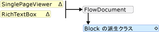
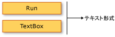

# フロー ドキュメントの概要
フロー ドキュメントは、表示と読みやすさを最適化するように設計されたドキュメントです。 フロー ドキュメントは、1 つの定義済みのレイアウトに設定するのではなく、ウィンドウのサイズ、デバイスの解像度、省略可能なユーザー設定など、ランタイム変数に基づいてコンテンツを動的に調整したりリフローしたりします。 また、フロー ドキュメントは、改ページ位置の自動修正や列などの高度なドキュメント機能を提供します。 ここでは、フロー ドキュメントの概要およびフロー ドキュメントの作成方法について説明します。  
  

  
   
## フロー ドキュメントとは  
 フロー ドキュメントは、ウィンドウ サイズ、デバイスの解像度、およびその他の環境変数に応じて "コンテンツをリフロー" するために設計されています。 また、フロー ドキュメントには、検索、読みやすさを最適化するモードの表示、およびフォントのサイズと外観を変更する機能を含むさまざまな組み込み機能があります。 フロー ドキュメントは、主なドキュメントの使用シナリオが読みやすさである場合に最適です。 これに対し、固定ドキュメントは、静的なプレゼンテーションを行うように設計されています。 ソース コンテンツの再現性が重要である場合は、固定ドキュメントが便利です。 参照してください[WPF のドキュメントの](../../../../docs/framework/wpf/advanced/documents-in-wpf.md)異なる種類のドキュメントについての詳細。  
  
 さまざまなサイズの複数のウィンドウで表示されるサンプルのフロー ドキュメントを次の図に示します。 表示領域が変わると、コンテンツはスペースを最大限に利用できるようにリフローされます。  
  
   
  
 上のイメージに示すように、フロー コンテンツには、段落、リスト、イメージなどの多くのコンポーネントを含めることができます。 これらのコンポーネントは、マークアップでの要素と手続き型コードでのオブジェクトに対応します。 後でこれらのクラスの詳細の移動お、[フロー関連のクラス](#flow_related_classes)この概要のセクションです。 ここでは、太字のテキストと、一覧の段落で構成されるフロー ドキュメントを作成する単純なコード例を次に示します。
  
 [!code-xaml[FlowOvwSnippets_snip#SimpleFlowExampleWholePage](../../../../samples/snippets/csharp/VS_Snippets_Wpf/FlowOvwSnippets_snip/CS/SimpleFlowExample.xaml#simpleflowexamplewholepage)]  
  
 [!code-csharp[FlowOvwSnippets_procedural_snip#SimpleFlowCodeOnlyExampleWholePage](../../../../samples/snippets/csharp/VS_Snippets_Wpf/FlowOvwSnippets_procedural_snip/CSharp/SimpleFlowExample.cs#simpleflowcodeonlyexamplewholepage)]
 [!code-vb[FlowOvwSnippets_procedural_snip#SimpleFlowCodeOnlyExampleWholePage](../../../../samples/snippets/visualbasic/VS_Snippets_Wpf/FlowOvwSnippets_procedural_snip/VisualBasic/SimpleFlowExample.vb#simpleflowcodeonlyexamplewholepage)]  
  
 次の図は、このコード スニペットの結果を示したものです。  
  
   
  
 この例では、<xref:System.Windows.Controls.FlowDocumentReader>フロー コンテンツをホストするコントロールを使用します。 参照してください[フロー ドキュメントの種類](#flow_document_types)フロー コンテンツ コントロールのホストについての詳細。 <xref:System.Windows.Documents.Paragraph>、 <xref:System.Windows.Documents.List>、 <xref:System.Windows.Documents.ListItem>、および<xref:System.Windows.Documents.Bold>マークアップ内での順番に基づいて、コンテンツの書式設定を制御に使用される要素。 たとえば、<xref:System.Windows.Documents.Bold>要素は複数の段落のテキストの一部のみです。 その結果、テキストのその部分だけが太字です。 HTML を使用したことがある場合、これは慣れ親しまれているでしょう。  
  
 上の図で強調表示されている、としては、フロー ドキュメントに組み込まれているいくつかの機能があります。
  
-   検索: ユーザーがドキュメント全体のフルテキスト検索を実行できるようにします。  
  
-   表示モード: ユーザーは、単一ページ (一度に 1 ページ) 表示モード、一度に 2 ページ (読書形式) 表示モード、および連続したスクロール (ボトムレス) 表示モードなど、各自に適切な表示モードを選択できます。  これらの表示モードの詳細については、次を参照してください。<xref:System.Windows.Controls.FlowDocumentReaderViewingMode>です。  
  
-   ページ ナビゲーション コントロール: ドキュメントの表示モードでページを使用する場合、ページ ナビゲーション コントロールには、次のページへのジャンプ用ボタン (下向き矢印)、前のページへのジャンプ用ボタン (上向き矢印)、および現在のページ番号と総ページ数のインジケーターが含まれます。 ページ間の移動は、キーボードの方向キーを使用して行うこともできます。  
  
-   ズーム: ユーザーはプラスまたはマイナス ボタンをクリックして、ズーム レベルを上げたり下げたりできます。 ズーム コントロールには、ズーム レベルの調整用スライダーも含まれます。 詳細については、「<xref:System.Windows.Controls.FlowDocumentReader.Zoom%2A>」を参照してください。  
  
 これらの機能は、フロー コンテンツをホストするために使用されるコントロールに基づいて変更できます。 次のセクションでは、さまざまなコントロールについて説明します。  
  
   
## フロー ドキュメントの種類  
 フロー ドキュメント コンテンツの表示、およびそれがどのように表示されるかは、どのようなオブジェクトがフロー コンテンツをホストするために使用されるかに依存します。 フロー コンテンツの表示をサポートする 4 つのコントロールがあります: <xref:System.Windows.Controls.FlowDocumentReader>、 <xref:System.Windows.Controls.FlowDocumentPageViewer>、 <xref:System.Windows.Controls.RichTextBox>、および<xref:System.Windows.Controls.FlowDocumentScrollViewer>です。 これらのコントロールについて、以下に簡単に説明します。  
  
 **注:** <xref:System.Windows.Documents.FlowDocument>を使用するこれらのコントロールの表示のために直接フロー コンテンツをホストする、必要な<xref:System.Windows.Documents.FlowDocument>フロー コンテンツをホストしているを有効にします。  
  
### FlowDocumentReader  
 <xref:System.Windows.Controls.FlowDocumentReader> ユーザーが単一ページ (ページに-を-時) の表示モードの 2 つのページに-を-時点 (読書形式) 表示モード、および連続スクロール (ボトムレス) 表示モードなど、さまざまな表示モードを動的に選択できるようにする機能が含まれます。 これらの表示モードの詳細については、次を参照してください。<xref:System.Windows.Controls.FlowDocumentReaderViewingMode>です。 動的に表示モードを切り替えることが必要がない場合<xref:System.Windows.Controls.FlowDocumentPageViewer>と<xref:System.Windows.Controls.FlowDocumentScrollViewer>コンテンツ ビューアーは、特定の表示モードで修正される軽量のフローを提供します。  
  
### FlowDocumentPageViewer と FlowDocumentScrollViewer  
 <xref:System.Windows.Controls.FlowDocumentPageViewer> 時間でのページのコンテンツ表示中にモードを表示するには、<xref:System.Windows.Controls.FlowDocumentScrollViewer>連続スクロール モードでコンテンツを示しています。 両方<xref:System.Windows.Controls.FlowDocumentPageViewer>と<xref:System.Windows.Controls.FlowDocumentScrollViewer>特定の表示モードに固定されます。 比較<xref:System.Windows.Controls.FlowDocumentReader>、ユーザー間でさまざまな表示モードを動的に選択するための機能が含まれている (によって提供されるよう、<xref:System.Windows.Controls.FlowDocumentReaderViewingMode>列挙型)、リソースをよりも使用されている犠牲<xref:System.Windows.Controls.FlowDocumentPageViewer>または<xref:System.Windows.Controls.FlowDocumentScrollViewer>です。  
  
 既定では、垂直スクロール バーは常に表示され、水平スクロール バーは必要に応じて表示されます。 既定の UI<xref:System.Windows.Controls.FlowDocumentScrollViewer>ツールバーは含まれません。 ただし、、<xref:System.Windows.Controls.FlowDocumentScrollViewer.IsToolBarVisible%2A>組み込みのツールバーを有効にするプロパティを使用できます。  
  
### RichTextBox  
 使用する、<xref:System.Windows.Controls.RichTextBox>フロー コンテンツを編集するユーザーを許可したいとします。 たとえばを操作するユーザーを許可されているエディターを作成する必要がある場合などのテーブル、斜体と書式設定などを太字という点、使用する、<xref:System.Windows.Controls.RichTextBox>です。 参照してください[RichTextBox 概要](../../../../docs/framework/wpf/controls/richtextbox-overview.md)詳細についてはします。  
  
 **注:** 内のコンテンツをフローする<xref:System.Windows.Controls.RichTextBox>フロー コンテンツを他のコントロールに含まれているのと同じように動作しません。 たとえば、内の列がない、<xref:System.Windows.Controls.RichTextBox>のため自動サイズ変更なしの動作とします。 また、フローのコンテンツの検索、モード、ページ ナビゲーション、およびズームを表示するように通常組み込みの機能は内で使用できません、<xref:System.Windows.Controls.RichTextBox>です。  
  
   
## フロー コンテンツの作成  
 フロー コンテンツでき、複雑で、テキスト、画像、テーブル、さまざまな要素から成るでも<xref:System.Windows.UIElement>コントロールなどのクラスを派生します。 複雑なフロー コンテンツを作成する方法を理解するには、次の点が重要です。  
  
-   **フロー関連のクラス**: フロー コンテンツ内で使用される各クラスには特定の目的があります。 また、フロー クラス間の階層型の関係により、それらがどのように使用されるかが理解しやすくなっています。 派生したクラスなど、<xref:System.Windows.Documents.Block>クラスから派生したときに、その他のオブジェクトを格納するためのクラス<xref:System.Windows.Documents.Inline>表示されているオブジェクトを含むです。  
  
-   **コンテンツ スキーマ**: フロー ドキュメントには、多くの入れ子になった要素が必要になる場合があります。 コンテンツ スキーマは、使用可能な要素間の親/子リレーションシップを指定します。  
  
 以下のセクションでは、これらの各領域について詳しく説明します。  
  
   
## フロー関連のクラス  
 次の図は、フロー コンテンツで最も一般的に使用されるオブジェクトを示します。  
  
   
  
 フロー コンテンツのために、次の 2 つの重要なカテゴリがあります。  
  
1.  **Block の派生クラス**: "Block コンテンツ要素" または単に "Block 要素" とも呼ばれます。 要素から継承する<xref:System.Windows.Documents.Block>共通の親の下にある要素をグループ化またはグループに共通の属性を適用するために使用できます。  
  
2.  **Inline の派生クラス**: "Inline コンテンツ要素" または単に "Inline 要素" とも呼ばれます。 要素から継承する<xref:System.Windows.Documents.Inline>ブロック要素または別のインライン要素に含まれるいずれか。 Inline 要素は、多くの場合、画面にレンダリングされるコンテンツの直接のコンテナーとして使用されます。 たとえば、 <xref:System.Windows.Documents.Paragraph> (ブロック要素) を含めることができます、 <xref:System.Windows.Documents.Run> (インライン要素) が、<xref:System.Windows.Documents.Run>実際に画面に表示されるテキストが含まれています。  
  
 これらの 2 つのカテゴリの各クラスについて、以下に簡単に説明します。  
  
### Block の派生クラス  
 **Paragraph**  
  
 <xref:System.Windows.Documents.Paragraph> 段落にコンテンツをグループ通常に使用されます。 Paragraph の最も単純かつ一般的な用途は、テキストの段落の作成です。  
  
 [!code-xaml[FlowOvwSnippets_snip#ParagraphExampleWholePage](../../../../samples/snippets/csharp/VS_Snippets_Wpf/FlowOvwSnippets_snip/CS/ParagraphExample.xaml#paragraphexamplewholepage)]  
  
 [!code-csharp[FlowOvwSnippets_procedural_snip#ParagraphCodeOnlyExampleWholePage](../../../../samples/snippets/csharp/VS_Snippets_Wpf/FlowOvwSnippets_procedural_snip/CSharp/ParagraphExample.cs#paragraphcodeonlyexamplewholepage)]
 [!code-vb[FlowOvwSnippets_procedural_snip#ParagraphCodeOnlyExampleWholePage](../../../../samples/snippets/visualbasic/VS_Snippets_Wpf/FlowOvwSnippets_procedural_snip/VisualBasic/ParagraphExample.vb#paragraphcodeonlyexamplewholepage)]  
  
 ただし、することができますも要素を含むその他のインライン派生の下に表示されます。 
  
 **セクション**  
  
 <xref:System.Windows.Documents.Section> その他を含める場合にのみ使用されます<xref:System.Windows.Documents.Block>の要素を派生します。 格納している要素に対して、既定の書式設定を適用することはありません。 ただし、任意のプロパティの値に設定、<xref:System.Windows.Documents.Section>はその子要素に適用されます。 セクションでは、プログラムで子コレクションを反復処理することもできます。 <xref:System.Windows.Documents.Section> 同様の方法で使用される、 \
 HTML タグ。  
  
 1 つ下にある次の例では、3 つの段落が定義されている<xref:System.Windows.Documents.Section>です。 掲載されています、<xref:System.Windows.Documents.TextElement.Background%2A>赤、したがって、段落の背景色のプロパティの値が赤でもします。  
  
 [!code-xaml[FlowOvwSnippets_snip#SectionExampleWholePage](../../../../samples/snippets/csharp/VS_Snippets_Wpf/FlowOvwSnippets_snip/CS/SectionExample.xaml#sectionexamplewholepage)]  
  
 [!code-csharp[FlowOvwSnippets_procedural_snip#SectionCodeOnlyExampleWholePage](../../../../samples/snippets/csharp/VS_Snippets_Wpf/FlowOvwSnippets_procedural_snip/CSharp/SectionExample.cs#sectioncodeonlyexamplewholepage)]
 [!code-vb[FlowOvwSnippets_procedural_snip#SectionCodeOnlyExampleWholePage](../../../../samples/snippets/visualbasic/VS_Snippets_Wpf/FlowOvwSnippets_procedural_snip/VisualBasic/SectionExample.vb#sectioncodeonlyexamplewholepage)]  
  
 **BlockUIContainer**  
  
 <xref:System.Windows.Documents.BlockUIContainer> により、<xref:System.Windows.UIElement>要素 (つまり、 <xref:System.Windows.Controls.Button>) ブロックから派生したフロー コンテンツに埋め込まれます。 <xref:System.Windows.Documents.InlineUIContainer> 埋め込む (下記参照) が使用される<xref:System.Windows.UIElement>インライン派生のフロー コンテンツ要素。 <xref:System.Windows.Documents.BlockUIContainer> および<xref:System.Windows.Documents.InlineUIContainer>を使用するには、その他の手段がないために重要な<xref:System.Windows.UIElement>フロー内でこれら 2 つの要素の 1 つ含まれていないコンテンツです。  
  
 次の例を使用する方法を示しています、<xref:System.Windows.Documents.BlockUIContainer>ホスト要素<xref:System.Windows.UIElement>フロー コンテンツ内のオブジェクト。  
  
 [!code-xaml[SpanSnippets#_BlockUIXAML](../../../../samples/snippets/csharp/VS_Snippets_Wpf/SpanSnippets/CSharp/Window1.xaml#_blockuixaml)]  
  
 この例の表示結果を次の図に示します。  
  
   
  
 **List**  
  
 <xref:System.Windows.Documents.List> 箇条書きや数値のリストの作成に使用します。 設定、<xref:System.Windows.Documents.List.MarkerStyle%2A>プロパティを<xref:System.Windows.TextMarkerStyle>リストのスタイルを決定する列挙値。 簡単なリストを作成する方法を次の例に示します。  
  
 [!code-xaml[FlowOvwSnippets_snip#ListExampleWholePage](../../../../samples/snippets/csharp/VS_Snippets_Wpf/FlowOvwSnippets_snip/CS/ListExample.xaml#listexamplewholepage)]  
  
 [!code-csharp[FlowOvwSnippets_procedural_snip#ListCodeOnlyExampleWholePage](../../../../samples/snippets/csharp/VS_Snippets_Wpf/FlowOvwSnippets_procedural_snip/CSharp/ListExample.cs#listcodeonlyexamplewholepage)]
 [!code-vb[FlowOvwSnippets_procedural_snip#ListCodeOnlyExampleWholePage](../../../../samples/snippets/visualbasic/VS_Snippets_Wpf/FlowOvwSnippets_procedural_snip/VisualBasic/ListExample.vb#listcodeonlyexamplewholepage)]  
  
 **注:** <xref:System.Windows.Documents.List> 、フロー要素のみを使用して、<xref:System.Windows.Documents.ListItemCollection>子要素を管理します。  
  
 **テーブル**  
  
 <xref:System.Windows.Documents.Table> テーブルの作成に使用します。 <xref:System.Windows.Documents.Table> に似ていますが、<xref:System.Windows.Controls.Grid>要素が、多くの機能があり、したがって、大きいリソースのオーバーヘッドが必要です。 <xref:System.Windows.Controls.Grid>は、<xref:System.Windows.UIElement>に含まれている場合を除きには、フロー コンテンツで使用することはできません、<xref:System.Windows.Documents.BlockUIContainer>または<xref:System.Windows.Documents.InlineUIContainer>です。 詳細については<xref:System.Windows.Documents.Table>を参照してください[テーブルの概要](../../../../docs/framework/wpf/advanced/table-overview.md)です。  
  
### Inline の派生クラス  
 **実行**  
  
 <xref:System.Windows.Documents.Run> 書式なしテキストの格納に使用します。 ご想像<xref:System.Windows.Documents.Run>フロー コンテンツを広範囲に使用するオブジェクト。 ただし、マークアップでは、<xref:System.Windows.Documents.Run>要素に明示的に使用する必要はありません。 <xref:System.Windows.Documents.Run> 作成またはコードを使用して、フロー ドキュメントを操作するときに使用する必要があります。 などのマークアップを 1 つ目の下で<xref:System.Windows.Documents.Paragraph>を指定します、 <xref:System.Windows.Documents.Run> 2 つ目の中に明示的に要素がないです。 両方の段落は、同じ出力を生成します。  
  
 [!code-xaml[FlowOvwSnippets_snip#RunExample1](../../../../samples/snippets/csharp/VS_Snippets_Wpf/FlowOvwSnippets_snip/CS/RunSnippetsExample.xaml#runexample1)]  
  
 **注:** 以降では、 [!INCLUDE[net_v40_short](../../../../includes/net-v40-short-md.md)]、<xref:System.Windows.Documents.Run.Text%2A>のプロパティ、<xref:System.Windows.Documents.Run>オブジェクトが依存関係プロパティです。 バインドすることができます、<xref:System.Windows.Documents.Run.Text%2A>プロパティをデータ ソースなど、<xref:System.Windows.Controls.TextBlock>です。 <xref:System.Windows.Documents.Run.Text%2A>プロパティは、一方向のバインディングを完全にサポートします。 <xref:System.Windows.Documents.Run.Text%2A>以外のプロパティが双方向のバインドにもサポートしています<xref:System.Windows.Controls.RichTextBox>です。 例については、「<xref:System.Windows.Documents.Run.Text%2A?displayProperty=nameWithType>」を参照してください。  
  
 **Span**  
  
 <xref:System.Windows.Documents.Span> その他のインライン コンテンツ要素をグループ化されます。 内のコンテンツに固有の表示は適用されません、<xref:System.Windows.Documents.Span>要素。 ただし、要素を継承から<xref:System.Windows.Documents.Span>など<xref:System.Windows.Documents.Hyperlink>、 <xref:System.Windows.Documents.Bold>、<xref:System.Windows.Documents.Italic>と<xref:System.Windows.Documents.Underline>テキストに書式を適用しないでください。  
  
 次の例に示します、 <xref:System.Windows.Documents.Span> 、テキストを含むインライン コンテンツを含めるために使用されている、<xref:System.Windows.Documents.Bold>要素、および<xref:System.Windows.Controls.Button>です。  
  
 [!code-xaml[FlowOvwSnippets_snip#SpanExampleWholePage](../../../../samples/snippets/csharp/VS_Snippets_Wpf/FlowOvwSnippets_snip/CS/SpanExample.xaml#spanexamplewholepage)]  
  
 次のスクリーンショットは、この例がどのように表示されるかを示しています。  
  
   
  
 **InlineUIContainer**  
  
 <xref:System.Windows.Documents.InlineUIContainer> により、<xref:System.Windows.UIElement>要素 (つまり、コントロールと同様に<xref:System.Windows.Controls.Button>) に埋め込まれる、<xref:System.Windows.Documents.Inline>コンテンツ要素。 この要素と同等のインライン<xref:System.Windows.Documents.BlockUIContainer>上で説明しました。 使用する例を次に示します<xref:System.Windows.Documents.InlineUIContainer>を挿入する、<xref:System.Windows.Controls.Button>でインラインで、<xref:System.Windows.Documents.Paragraph>です。  
  
 [!code-xaml[FlowOvwSnippets_snip#InlineUIContainerExampleWholePage](../../../../samples/snippets/csharp/VS_Snippets_Wpf/FlowOvwSnippets_snip/CS/InlineUIContainerExample.xaml#inlineuicontainerexamplewholepage)]  
  
 [!code-csharp[FlowOvwSnippets_procedural_snip#InlineUIContainerCodeOnlyExampleWholePage](../../../../samples/snippets/csharp/VS_Snippets_Wpf/FlowOvwSnippets_procedural_snip/CSharp/InlineUIContainerExample.cs#inlineuicontainercodeonlyexamplewholepage)]
 [!code-vb[FlowOvwSnippets_procedural_snip#InlineUIContainerCodeOnlyExampleWholePage](../../../../samples/snippets/visualbasic/VS_Snippets_Wpf/FlowOvwSnippets_procedural_snip/VisualBasic/InlineUIContainerExample.vb#inlineuicontainercodeonlyexamplewholepage)]  
  
 **注:** <xref:System.Windows.Documents.InlineUIContainer>マークアップで明示的に使用する必要はありません。 省略した場合、<xref:System.Windows.Documents.InlineUIContainer>コードがコンパイルされるときにも作成されます。  
  
 **Figure および Floater**  
  
 <xref:System.Windows.Documents.Figure> および<xref:System.Windows.Documents.Floater>プライマリ コンテンツ フローの独立したカスタマイズ可能な配置のプロパティを持つフロー ドキュメントのコンテンツを埋め込むために使用されます。 <xref:System.Windows.Documents.Figure> または<xref:System.Windows.Documents.Floater>要素が強調表示や、イメージまたはメイン コンテンツのフロー内の他のコンテンツをサポートするホストへのコンテンツの一部を強調したりに使用する多くの場合、または疎を挿入する関連するコンテンツの提供情報などです。  
  
 次の例を埋め込む方法を示しています、<xref:System.Windows.Documents.Figure>テキストの段落にします。  
  
 [!code-xaml[FlowOvwSnippets_snip#FigureExampleWholePage](../../../../samples/snippets/csharp/VS_Snippets_Wpf/FlowOvwSnippets_snip/CS/FigureExample.xaml#figureexamplewholepage)]  
  
 [!code-csharp[FlowOvwSnippets_procedural_snip#FigureCodeOnlyExampleWholePage](../../../../samples/snippets/csharp/VS_Snippets_Wpf/FlowOvwSnippets_procedural_snip/CSharp/FigureExample.cs#figurecodeonlyexamplewholepage)]
 [!code-vb[FlowOvwSnippets_procedural_snip#FigureCodeOnlyExampleWholePage](../../../../samples/snippets/visualbasic/VS_Snippets_Wpf/FlowOvwSnippets_procedural_snip/VisualBasic/FigureExample.vb#figurecodeonlyexamplewholepage)]  
  
 この例がどのように表示されるかを次の図に示します。  
  
   
  
 <xref:System.Windows.Documents.Figure> および<xref:System.Windows.Documents.Floater>いくつかの方法が異なるし、さまざまなシナリオが使用されます。  
  
 **Figure:**  
  
-   配置可能です。水平方向および垂直方向のアンカーを設定することによって、ページ、コンテンツ、列、または段落に対して相対的にドッキングできます。 使用することもその<xref:System.Windows.Documents.Figure.HorizontalOffset%2A>と<xref:System.Windows.Documents.Figure.VerticalOffset%2A>プロパティを任意のオフセットを指定します。  
  
-   1 つ以上の列にかなりの数: 設定することができます<xref:System.Windows.Documents.Figure>高さと幅のページ、コンテンツまたは列の高さまたは幅の倍数をします。 ページおよびコンテンツの場合は、1 より大きい倍数は指定できない点に注意してください。 たとえばの幅を設定することができます、 <xref:System.Windows.Documents.Figure> 「0.5 ページ」または"0.25 content"または「2 列」を指定します。 高さと幅は、絶対ピクセル値で指定することもできます。  
  
-   改ページ調整ではありません: 場合内のコンテンツ、<xref:System.Windows.Documents.Figure>内に一致しない、 <xref:System.Windows.Documents.Figure>、あらゆるコンテンツに合わせて、表示して、残りのコンテンツは失われます  
  
 **Floater:**  
  
-   配置できません。必要なスペースを確保できる場所に描画されます。 オフセットまたはアンカーを設定することはできません、<xref:System.Windows.Documents.Floater>です。  
  
-   複数の列にサイズを変更できません: 既定では、 <xref:System.Windows.Documents.Floater> 1 つの列のサイズ。 <xref:System.Windows.Documents.Floater.Width%2A> 1 つの列のサイズはこの値は 1 つの列の幅は無視され、フローターより大きい場合は、絶対ピクセル値を設定できるプロパティです。 正しいピクセル幅を設定して未満である 1 つの列サイズできますが、サイズ変更はない列の相対のため"はできないの有効な式<xref:System.Windows.Documents.Floater>幅。 <xref:System.Windows.Documents.Floater> 高さのプロパティを持たないであり、高さを設定することはできませんの高さは、内容によって異なります。  
  
-   <xref:System.Windows.Documents.Floater> 改ページも: フローターが中断し、次の列では、次のページなどの改ページも 1 つ以上の列の高さを指定した幅にコンテンツが拡張される場合。  
  
 <xref:System.Windows.Documents.Figure> サイズを制御するスタンドアロンのコンテンツを配置する適切な場所と配置、およびコンテンツは、指定されたサイズに収まるかどうかを確信します。 <xref:System.Windows.Documents.Floater> フロー メイン ページのコンテンツに似ていますが、そこからは分離されているより多くの自由なコンテンツを配置する適切な場所です。  
  
 **LineBreak**  
  
 <xref:System.Windows.Documents.LineBreak> 改行するフロー コンテンツで発生します。 次の例は、<xref:System.Windows.Documents.LineBreak> の使い方を示しています。  
  
 [!code-xaml[FlowOvwSnippets_snip#LineBreakExampleWholePage](../../../../samples/snippets/csharp/VS_Snippets_Wpf/FlowOvwSnippets_snip/CS/LineBreakExample.xaml#linebreakexamplewholepage)]  
  
 次のスクリーンショットは、この例がどのように表示されるかを示しています。  
  
   
  
### フロー コレクションの要素  
 上記の例の多くで、<xref:System.Windows.Documents.BlockCollection>と<xref:System.Windows.Documents.InlineCollection>フロー コンテンツをプログラムで構築するために使用します。 たとえば、要素を追加するため、<xref:System.Windows.Documents.Paragraph>構文を使用することができます。  
  
 `…`  
  
 `myParagraph.Inlines.Add(new Run("Some text"));`  
  
 `…`  
  
 これを追加、<xref:System.Windows.Documents.Run>を<xref:System.Windows.Documents.InlineCollection>の<xref:System.Windows.Documents.Paragraph>です。  これは、暗黙の型として同じ<xref:System.Windows.Documents.Run>内で検出された、<xref:System.Windows.Documents.Paragraph>マークアップで。  
  
 `…`  
  
 `<Paragraph>`  
  
 `Some Text`  
  
 `</Paragraph>`  
  
 `…`  
  
 使用する例として、 <xref:System.Windows.Documents.BlockCollection>、次の例は、新しい作成<xref:System.Windows.Documents.Section>しを使用して、**追加**新しいを追加するメソッド<xref:System.Windows.Documents.Paragraph>を<xref:System.Windows.Documents.Section>内容。  
  
 [!code-csharp[FlowDocumentSnippets#_SectionBlocksAdd](../../../../samples/snippets/csharp/VS_Snippets_Wpf/FlowDocumentSnippets/CSharp/Window1.xaml.cs#_sectionblocksadd)]
 [!code-vb[FlowDocumentSnippets#_SectionBlocksAdd](../../../../samples/snippets/visualbasic/VS_Snippets_Wpf/FlowDocumentSnippets/visualbasic/window1.xaml.vb#_sectionblocksadd)]  
  
 フロー コレクションに項目を追加できるだけでなく、項目を削除することもできます。  次の例の最後の削除<xref:System.Windows.Documents.Inline>内の要素、<xref:System.Windows.Documents.Span>です。  
  
 [!code-csharp[SpanSnippets#_SpanInlinesRemoveLast](../../../../samples/snippets/csharp/VS_Snippets_Wpf/SpanSnippets/CSharp/Window1.xaml.cs#_spaninlinesremovelast)]
 [!code-vb[SpanSnippets#_SpanInlinesRemoveLast](../../../../samples/snippets/visualbasic/VS_Snippets_Wpf/SpanSnippets/visualbasic/window1.xaml.vb#_spaninlinesremovelast)]  
  
 次の例では、すべての内容を消去 (<xref:System.Windows.Documents.Inline>要素) から、<xref:System.Windows.Documents.Span>です。  
  
 [!code-csharp[SpanSnippets#_SpanInlinesClear](../../../../samples/snippets/csharp/VS_Snippets_Wpf/SpanSnippets/CSharp/Window1.xaml.cs#_spaninlinesclear)]
 [!code-vb[SpanSnippets#_SpanInlinesClear](../../../../samples/snippets/visualbasic/VS_Snippets_Wpf/SpanSnippets/visualbasic/window1.xaml.vb#_spaninlinesclear)]  
  
 フロー コンテンツをプログラムで操作する場合、これらのコレクションを広く活用する可能性があります。  
  
 フロー要素を使用しているかどうか、 <xref:System.Windows.Documents.InlineCollection> (インライン) または<xref:System.Windows.Documents.BlockCollection>(ブロック) の子を格納する要素は子要素の種類によって異なります (<xref:System.Windows.Documents.Block>または<xref:System.Windows.Documents.Inline>)、親に含まれることができます。 フロー コンテンツ要素のコンテインメイト規則については、次のセクションのコンテンツ スキーマにまとめます。  
  
 **注:** フロー コンテンツで使用されるコレクションの 3 番目の型がある、 <xref:System.Windows.Documents.ListItemCollection>、このコレクションを使用してのみが、<xref:System.Windows.Documents.List>です。 さらで使用されるいくつかのコレクションがある<xref:System.Windows.Documents.Table>です。 参照してください[テーブルの概要](../../../../docs/framework/wpf/advanced/table-overview.md)詳細についてはします。  
  
   
## コンテンツ スキーマ  
 多数のさまざまなフロー コンテンツ要素が指定されると、要素が格納できる子要素の種類を追跡できなくなる可能性があります。 フロー要素のコンテインメイト規則をまとめたものを次の図に示します。 矢印は、使用可能な親/子リレーションシップを表します。  
  
 ![図: フロー コンテンツ コンテインメント スキーマ] (../../../../docs/framework/wpf/advanced/media/flow-content-schema.png "Flow_Content_Schema")  
  
 上記の図からわかるように、許容される要素の子は必ずしもによって決定されないかどうか、<xref:System.Windows.Documents.Block>要素または<xref:System.Windows.Documents.Inline>要素。 たとえば、 <xref:System.Windows.Documents.Span> (、<xref:System.Windows.Documents.Inline>要素) しか持てない<xref:System.Windows.Documents.Inline>中に子要素、 <xref:System.Windows.Documents.Figure> (も、<xref:System.Windows.Documents.Inline>要素) しか持てない<xref:System.Windows.Documents.Block>子要素です。 そのため、どの要素を別の要素に含めることができるかをすばやく判断するには、図が役立ちます。 たとえば、みましょう図を使用して、フロー コンテンツを構築する方法を決定する<xref:System.Windows.Controls.RichTextBox>です。  
  
 **1.** A<xref:System.Windows.Controls.RichTextBox>含める必要があります、<xref:System.Windows.Documents.FlowDocument>をさらに含んでいる必要があります、 <xref:System.Windows.Documents.Block>-派生オブジェクト。 上の図でこれに対応する部分を次に示します。  
  
   
  
 この段階では、マークアップは次のようになります。  
  
 [!code-xaml[FlowOvwSnippets_snip#SchemaWalkThrough1](../../../../samples/snippets/csharp/VS_Snippets_Wpf/FlowOvwSnippets_snip/CS/MiscSnippets.xaml#schemawalkthrough1)]  
  
 **2.** に従って、ダイアグラムは、いくつか<xref:System.Windows.Documents.Block>などから選択する要素<xref:System.Windows.Documents.Paragraph>、 <xref:System.Windows.Documents.Section>、 <xref:System.Windows.Documents.Table>、 <xref:System.Windows.Documents.List>、および<xref:System.Windows.Documents.BlockUIContainer>(上記のブロックから派生したクラスを参照してください)。 たいと、<xref:System.Windows.Documents.Table>です。 に従って、上記の図、<xref:System.Windows.Documents.Table>が含まれています、<xref:System.Windows.Documents.TableRowGroup>を含む<xref:System.Windows.Documents.TableRow>要素で、含める<xref:System.Windows.Documents.TableCell>要素が含まれている、 <xref:System.Windows.Documents.Block>-派生オブジェクト。 以下の対応するセグメントは、<xref:System.Windows.Documents.Table>上のダイアグラムから取得します。  
  
 ![図: Table の親/子スキーマ] (../../../../docs/framework/wpf/advanced/media/flow-ovw-schemawalkthrough2.png "Flow_Ovw_SchemaWalkThrough2")  
  
 以下は、これに対応するマークアップです。  
  
 [!code-xaml[FlowOvwSnippets_snip#SchemaWalkThrough2](../../../../samples/snippets/csharp/VS_Snippets_Wpf/FlowOvwSnippets_snip/CS/MiscSnippets.xaml#schemawalkthrough2)]  
  
 **3.** ここでも、1 つまたは複数<xref:System.Windows.Documents.Block>下にある要素が必要になる、<xref:System.Windows.Documents.TableCell>です。 簡単にするために、セル内にいくつかのテキストを配置することにします。 これにを使用して、<xref:System.Windows.Documents.Paragraph>で、<xref:System.Windows.Documents.Run>要素。 対応することを示すダイアグラムからセグメントを次に示します、<xref:System.Windows.Documents.Paragraph>かかることができます、<xref:System.Windows.Documents.Inline>要素とする、 <xref:System.Windows.Documents.Run> (、<xref:System.Windows.Documents.Inline>要素) プレーン テキストのみを取得できます。  
  
 ![図: Paragraph の親/子スキーマ] (../../../../docs/framework/wpf/advanced/media/flow-ovw-schemawalkthrough3.png "Flow_Ovw_SchemaWalkThrough3")  
  
   
  
 以下は、マークアップでの例の全体です。  
  
 [!code-xaml[FlowOvwSnippets_snip#SchemaExampleWholePage](../../../../samples/snippets/csharp/VS_Snippets_Wpf/FlowOvwSnippets_snip/CS/SchemaExample.xaml#schemaexamplewholepage)]  
  
   
## テキストのカスタマイズ  
 通常、テキストは、フロー ドキュメントで最も一般的なコンテンツの種類です。 上で導入されたオブジェクトは、テキストをレンダリングする方法のほとんどの側面を制御するために使用できますが、このセクションで説明されるテキストのカスタマイズ用にその他のメソッドがいくつか存在します。  
  
### 文字装飾  
 文字装飾によって、下線、上線、ベースライン、および取り消し線の効果をテキストに適用できます (下図参照)。 これらの文字装飾を追加するには、<xref:System.Windows.Documents.Inline.TextDecorations%2A>などのオブジェクトの数によって公開されるプロパティ<xref:System.Windows.Documents.Inline>、 <xref:System.Windows.Documents.Paragraph>、 <xref:System.Windows.Controls.TextBlock>、および<xref:System.Windows.Controls.TextBox>です。  
  
 <xref:System.Windows.Documents.Paragraph.TextDecorations%2A> の <xref:System.Windows.Documents.Paragraph> プロパティを設定する方法を次の例に示します。  
  
 [!code-xaml[InlineSnippets#_Paragraph_TextDecXAML](../../../../samples/snippets/csharp/VS_Snippets_Wpf/InlineSnippets/CSharp/Window1.xaml#_paragraph_textdecxaml)]  
  
 [!code-csharp[InlineSnippets#_Paragraph_TextDec](../../../../samples/snippets/csharp/VS_Snippets_Wpf/InlineSnippets/CSharp/Window1.xaml.cs#_paragraph_textdec)]
 [!code-vb[InlineSnippets#_Paragraph_TextDec](../../../../samples/snippets/visualbasic/VS_Snippets_Wpf/InlineSnippets/visualbasic/window1.xaml.vb#_paragraph_textdec)]  
  
 この例の表示結果を次の図に示します。  
  
   
  
 次の図方法、**上線**、**基準**、および**下線**、それぞれします。  
  
   
  
   
  
   
  
### タイポグラフィ  
 <xref:System.Windows.Documents.TextElement.Typography%2A>プロパティがほとんどフローに関連するコンテンツを含めることによって公開される<xref:System.Windows.Documents.TextElement>、 <xref:System.Windows.Documents.FlowDocument>、 <xref:System.Windows.Controls.TextBlock>、および<xref:System.Windows.Controls.TextBox>です。 このプロパティは、テキストの文字体裁の特性またはバリエーション (つまり、小さい大文字か大きい大文字か、上付き文字と下付き文字の作成など) を制御するために使用されます。  
  
 次の例は、設定する方法を示します、<xref:System.Windows.Documents.TextElement.Typography%2A>属性を使用して<xref:System.Windows.Documents.Paragraph>例要素として。  
  
 [!code-xaml[TextElementSnippets#_TextElement_TypogXAML](../../../../samples/snippets/csharp/VS_Snippets_Wpf/TextElementSnippets/CSharp/Window1.xaml#_textelement_typogxaml)]  
  
 この例の表示結果を次の図に示します。  
  
   
  
 これに対し、既定の文字体裁プロパティを設定した同様の例がどのように表示されるかを次の図に示します。  
  
   
  
 次の例は、設定する方法を示します、<xref:System.Windows.Controls.TextBox.Typography%2A>プロパティ プログラムでします。  
  
 [!code-csharp[TextElementSnippets#_TextElement_Typog](../../../../samples/snippets/csharp/VS_Snippets_Wpf/TextElementSnippets/CSharp/Window1.xaml.cs#_textelement_typog)]
 [!code-vb[TextElementSnippets#_TextElement_Typog](../../../../samples/snippets/visualbasic/VS_Snippets_Wpf/TextElementSnippets/visualbasic/window1.xaml.vb#_textelement_typog)]  
  
 参照してください[WPF のタイポグラフィ](../../../../docs/framework/wpf/advanced/typography-in-wpf.md)タイポグラフィについての詳細。  
  
## 関連項目  
 [[テキスト]](../../../../docs/framework/wpf/advanced/optimizing-performance-text.md)  
 [WPF のタイポグラフィ](../../../../docs/framework/wpf/advanced/typography-in-wpf.md)  
 [方法トピック](../../../../docs/framework/wpf/advanced/flow-content-elements-how-to-topics.md)  
 [TextElement コンテンツ モデルの概要](../../../../docs/framework/wpf/advanced/textelement-content-model-overview.md)  
 [RichTextBox の概要](../../../../docs/framework/wpf/controls/richtextbox-overview.md)  
 [WPF のドキュメント](../../../../docs/framework/wpf/advanced/documents-in-wpf.md)  
 [テーブルの概要](../../../../docs/framework/wpf/advanced/table-overview.md)  
 [注釈の概要](../../../../docs/framework/wpf/advanced/annotations-overview.md)
