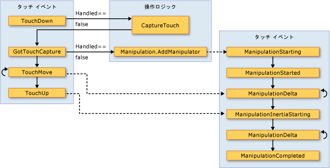

# 入力の概要Input Overview
 [!INCLUDE[TLA#tla_winclient](../../../../includes/tlasharptla-winclient-md.md)]サブシステムを提供する強力な[!INCLUDE[TLA#tla_api](../../../../includes/tlasharptla-api-md.md)]マウス、キーボード、タッチ、およびスタイラスなどのさまざまなデバイスからの入力を取得します。The [!INCLUDE[TLA#tla_winclient](../../../../includes/tlasharptla-winclient-md.md)] subsystem provides a powerful [!INCLUDE[TLA#tla_api](../../../../includes/tlasharptla-api-md.md)] for obtaining input from a variety of devices, including the mouse, keyboard, touch, and stylus. このトピックでは、[!INCLUDE[TLA2#tla_winclient](../../../../includes/tla2sharptla-winclient-md.md)] で提供されるサービスと、入力システムのアーキテクチャについて説明します。This topic describes the services provided by [!INCLUDE[TLA2#tla_winclient](../../../../includes/tla2sharptla-winclient-md.md)] and explains the architecture of the input systems.  
  
  
   
## 入力 APIInput API  
 主な入力[!INCLUDE[TLA2#tla_api](../../../../includes/tla2sharptla-api-md.md)]露出が要素の基本クラスが見つかりました: <xref:System.Windows.UIElement>、 <xref:System.Windows.ContentElement>、 <xref:System.Windows.FrameworkElement>、および<xref:System.Windows.FrameworkContentElement>です。The primary input [!INCLUDE[TLA2#tla_api](../../../../includes/tla2sharptla-api-md.md)] exposure is found on the base element classes: <xref:System.Windows.UIElement>, <xref:System.Windows.ContentElement>, <xref:System.Windows.FrameworkElement>, and <xref:System.Windows.FrameworkContentElement>.  基本要素の詳細については、「[基本要素の概要](../../../../docs/framework/wpf/advanced/base-elements-overview.md)」を参照してください。For more information about the base elements, see [Base Elements Overview](../../../../docs/framework/wpf/advanced/base-elements-overview.md).  これらのクラスは、キー操作、マウス ボタン、マウス ホイール、マウス動作、フォーカス管理、マウス キャプチャなどに関連する入力イベントの機能を提供しています。These classes provide functionality for input events related to key presses, mouse buttons, mouse wheel, mouse movement, focus management, and mouse capture, to name a few. 入力アーキテクチャでは、すべての入力イベントをサービスとして処理するのではなく、基本要素に入力 [!INCLUDE[TLA2#tla_api](../../../../includes/tla2sharptla-api-md.md)] を配置することで、UI 内の特定のオブジェクトによって入力イベントを供給し、複数の要素が入力イベントを処理できるイベント ルーティング スキームをサポートしています。By placing the input [!INCLUDE[TLA2#tla_api](../../../../includes/tla2sharptla-api-md.md)] on the base elements, rather than treating all input events as a service, the input architecture enables the input events to be sourced by a particular object in the UI, and to support an event routing scheme whereby more than one element has an opportunity to handle an input event. 多くの入力イベントには、それぞれに関連付けられたイベントのペアがあります。Many input events have a pair of events associated with them.  たとえば、イベント キーに関連付けられている、<xref:System.Windows.Input.Keyboard.KeyDown>と<xref:System.Windows.Input.Keyboard.PreviewKeyDown>イベント。For example, the key down event is associated with the <xref:System.Windows.Input.Keyboard.KeyDown> and <xref:System.Windows.Input.Keyboard.PreviewKeyDown> events.  これらのイベントの違いは、ターゲット要素にルーティングされる方法です。The difference in these events is in how they are routed to the target element.  プレビュー イベントは、ルート要素からターゲット要素へ、要素ツリーを下位に向かいます (トンネル)。Preview events tunnel down the element tree from the root element to the target element.  バブル イベントは、ターゲット要素からルート要素へ、上位に向かいます (バブル)。Bubbling events bubble up from the target element to the root element.  [!INCLUDE[TLA2#tla_winclient](../../../../includes/tla2sharptla-winclient-md.md)] のイベント ルーティングについては、この概要の後半、および「[ルーティング イベントの概要](../../../../docs/framework/wpf/advanced/routed-events-overview.md)」でさらに詳しく説明されています。Event routing in [!INCLUDE[TLA2#tla_winclient](../../../../includes/tla2sharptla-winclient-md.md)] is discussed in more detail later in this overview and in the [Routed Events Overview](../../../../docs/framework/wpf/advanced/routed-events-overview.md).  
  
### Keyboard クラスと Mouse クラスKeyboard and Mouse Classes  
 入力に加えて[!INCLUDE[TLA2#tla_api](../../../../includes/tla2sharptla-api-md.md)]基本要素のクラスで、<xref:System.Windows.Input.Keyboard>クラスと<xref:System.Windows.Input.Mouse>クラスを追加指定[!INCLUDE[TLA2#tla_api](../../../../includes/tla2sharptla-api-md.md)]キーボードとマウス入力を操作するためです。In addition to the input [!INCLUDE[TLA2#tla_api](../../../../includes/tla2sharptla-api-md.md)] on the base element classes, the <xref:System.Windows.Input.Keyboard> class and <xref:System.Windows.Input.Mouse> classes provide additional [!INCLUDE[TLA2#tla_api](../../../../includes/tla2sharptla-api-md.md)] for working with keyboard and mouse input.  
  
 入力の例については[!INCLUDE[TLA2#tla_api](../../../../includes/tla2sharptla-api-md.md)]で、<xref:System.Windows.Input.Keyboard>クラスは、<xref:System.Windows.Input.Keyboard.Modifiers%2A>プロパティが返されます、<xref:System.Windows.Input.ModifierKeys>現在、押されてと<xref:System.Windows.Input.Keyboard.IsKeyDown%2A>メソッドで、指定したキーが押されたかどうかを決定します。Examples of input [!INCLUDE[TLA2#tla_api](../../../../includes/tla2sharptla-api-md.md)] on the <xref:System.Windows.Input.Keyboard> class are the <xref:System.Windows.Input.Keyboard.Modifiers%2A> property, which returns the <xref:System.Windows.Input.ModifierKeys> currently pressed, and the <xref:System.Windows.Input.Keyboard.IsKeyDown%2A> method, which determines whether a specified key is pressed.  
  
 次の例では、<xref:System.Windows.Input.Keyboard.GetKeyStates%2A>メソッドかどうかを<xref:System.Windows.Input.Key>停止状態にします。The following example uses the <xref:System.Windows.Input.Keyboard.GetKeyStates%2A> method to determine if a <xref:System.Windows.Input.Key> is in the down state.  
  
 [!code-csharp[keyargssnippetsample#KeyEventArgsKeyBoardGetKeyStates](../../../../samples/snippets/csharp/VS_Snippets_Wpf/KeyArgsSnippetSample/CSharp/Window1.xaml.cs#keyeventargskeyboardgetkeystates)]
 [!code-vb[keyargssnippetsample#KeyEventArgsKeyBoardGetKeyStates](../../../../samples/snippets/visualbasic/VS_Snippets_Wpf/KeyArgsSnippetSample/visualbasic/window1.xaml.vb#keyeventargskeyboardgetkeystates)]  
  
 入力の例については[!INCLUDE[TLA2#tla_api](../../../../includes/tla2sharptla-api-md.md)]上、<xref:System.Windows.Input.Mouse>クラスが<xref:System.Windows.Input.Mouse.MiddleButton%2A>、マウスの中央ボタンの状態の取得元と<xref:System.Windows.Input.Mouse.DirectlyOver%2A>、経由では、マウス ポインターの要素を取得する現在します。Examples of input [!INCLUDE[TLA2#tla_api](../../../../includes/tla2sharptla-api-md.md)] on the <xref:System.Windows.Input.Mouse> class are <xref:System.Windows.Input.Mouse.MiddleButton%2A>, which obtains the state of the middle mouse button, and <xref:System.Windows.Input.Mouse.DirectlyOver%2A>, which gets the element the mouse pointer is currently over.  
  
 次の例を決定するかどうか、<xref:System.Windows.Input.Mouse.LeftButton%2A>マウスでは、<xref:System.Windows.Input.MouseButtonState.Pressed>状態です。The following example determines whether the <xref:System.Windows.Input.Mouse.LeftButton%2A> on the mouse is in the <xref:System.Windows.Input.MouseButtonState.Pressed> state.  
  
 [!code-csharp[mouserelatedsnippets#MouseRelatedSnippetsGetLeftButtonMouse](../../../../samples/snippets/csharp/VS_Snippets_Wpf/MouseRelatedSnippets/CSharp/Window1.xaml.cs#mouserelatedsnippetsgetleftbuttonmouse)]
 [!code-vb[mouserelatedsnippets#MouseRelatedSnippetsGetLeftButtonMouse](../../../../samples/snippets/visualbasic/VS_Snippets_Wpf/MouseRelatedSnippets/visualbasic/window1.xaml.vb#mouserelatedsnippetsgetleftbuttonmouse)]  
  
 <xref:System.Windows.Input.Mouse>と<xref:System.Windows.Input.Keyboard>クラスは、この概要で詳細に説明します。The <xref:System.Windows.Input.Mouse> and <xref:System.Windows.Input.Keyboard> classes are covered in more detail throughout this overview.  
  
### スタイラス入力Stylus Input  
 [!INCLUDE[TLA2#tla_winclient](../../../../includes/tla2sharptla-winclient-md.md)] サポートが統合されて、<xref:System.Windows.Input.Stylus>です。 has integrated support for the <xref:System.Windows.Input.Stylus>.  <xref:System.Windows.Input.Stylus>ペン入力が行われたでよく使用されるは、[!INCLUDE[TLA#tla_tpc](../../../../includes/tlasharptla-tpc-md.md)]です。The <xref:System.Windows.Input.Stylus> is a pen input made popular by the [!INCLUDE[TLA#tla_tpc](../../../../includes/tlasharptla-tpc-md.md)].  [!INCLUDE[TLA2#tla_winclient](../../../../includes/tla2sharptla-winclient-md.md)] アプリケーションでは、マウス [!INCLUDE[TLA2#tla_api](../../../../includes/tla2sharptla-api-md.md)] を使用して、スタイラスをマウスとして処理できますが、[!INCLUDE[TLA2#tla_winclient](../../../../includes/tla2sharptla-winclient-md.md)] では、キーボードとマウスに類似したモデルを使用するスタイラス デバイスの抽象型も公開しています。 applications can treat the stylus as a mouse by using the mouse [!INCLUDE[TLA2#tla_api](../../../../includes/tla2sharptla-api-md.md)], but [!INCLUDE[TLA2#tla_winclient](../../../../includes/tla2sharptla-winclient-md.md)] also exposes a stylus device abstraction that use a model similar to the keyboard and mouse.  スタイラス関連のすべての [!INCLUDE[TLA2#tla_api#plural](../../../../includes/tla2sharptla-apisharpplural-md.md)] に、"Stylus" という単語が含まれます。All stylus-related [!INCLUDE[TLA2#tla_api#plural](../../../../includes/tla2sharptla-apisharpplural-md.md)] contain the word "Stylus".  
  
 スタイラスはマウスとして動作できるため、マウス入力のみをサポートするアプリケーションでも、ある程度のスタイラス入力が自動的にサポートされます。Because the stylus can act as a mouse, applications that support only mouse input can still obtain some level of stylus support automatically. スタイラスがこのような手法で使用される場合、アプリケーションでは、適切なスタイラス イベントを処理する機会が与えられた後に、対応するマウス イベントを処理します。When the stylus is used in such a manner, the application is given the opportunity to handle the appropriate stylus event and then handles the corresponding mouse event. さらに、インク入力などのより高レベルなサービスも、スタイラス デバイスの抽象型を使って利用できます。In addition, higher-level services such as ink input are also available through the stylus device abstraction.  入力としてのインクの詳細については、「[インクの概要](../../../../docs/framework/wpf/advanced/getting-started-with-ink.md)」を参照してください。For more information about ink as input, see [Getting Started with Ink](../../../../docs/framework/wpf/advanced/getting-started-with-ink.md).  
  
   
## イベント ルーティングEvent Routing  
 A<xref:System.Windows.FrameworkElement>要素のツリーを形成する、コンテンツ モデル内の子要素として他の要素を含めることができます。A <xref:System.Windows.FrameworkElement> can contain other elements as child elements in its content model, forming a tree of elements.  [!INCLUDE[TLA2#tla_winclient](../../../../includes/tla2sharptla-winclient-md.md)] では、イベントを処理することで、親要素が、その子要素またはその他の子孫に命令された入力に関与できます。In [!INCLUDE[TLA2#tla_winclient](../../../../includes/tla2sharptla-winclient-md.md)], the parent element can participate in input directed to its child elements or other descendants by handing events. これは、小さいコントロールからコントロールをビルドする場合に特に役立ちます。このプロセスは "コントロール合成" または "合成" と呼ばれます。This is especially useful for building controls out of smaller controls, a process known as "control composition" or "compositing." 要素ツリー、および要素ツリーをイベント ルートに関連させる方法の詳細については、「[WPF のツリー](../../../../docs/framework/wpf/advanced/trees-in-wpf.md)」を参照してください。For more information about element trees and how element trees relate to event routes, see [Trees in WPF](../../../../docs/framework/wpf/advanced/trees-in-wpf.md).  
  
 イベント ルーティングは、ルートに沿った特定のオブジェクトや要素が、異なる要素によって供給されたイベントに、(処理を介して) 重要な応答を提供できるように、イベントを複数の要素に転送するプロセスです。Event routing is the process of forwarding events to multiple elements, so that a particular object or element along the route can choose to offer a significant response (through handling) to an event that might have been sourced by a different element.  ルーティング イベントには、直接、バブル、トンネルのいずれかのルーティング メカニズムが使用されます。Routed events use one of three routing mechanisms: direct, bubbling, and tunneling.  直接ルーティングでは、ソース要素が通知を受ける唯一の要素であり、イベントは他の要素にルーティングされません。In direct routing, the source element is the only element notified, and the event is not routed to any other elements. ただし、直接ルーティング イベントは、標準の [!INCLUDE[TLA2#tla_clr](../../../../includes/tla2sharptla-clr-md.md)] イベントではなく、ルーティング イベントにのみ存在するいくつかの追加機能を提供します。However, the direct routed event still offers some additional capabilities that are only present for routed events as opposed to standard [!INCLUDE[TLA2#tla_clr](../../../../includes/tla2sharptla-clr-md.md)] events. バブル ルーティングでは、最初にイベントの発生元である要素に通知し、次にその親要素へ、その次へと順に通知することで、要素ツリーの上位へ処理が実行されます。Bubbling works up the element tree by first notifying the element that sourced the event, then the parent element, and so on.  トンネル ルーティングでは、要素ツリーのルートから始まり、下位へと処理が実行され、元のソース要素で終了します。Tunneling starts at the root of the element tree and works down, ending with the original source element.  ルーティング イベントの詳細については、「[ルーティング イベントの概要](../../../../docs/framework/wpf/advanced/routed-events-overview.md)」を参照してください。For more information about routed events, see [Routed Events Overview](../../../../docs/framework/wpf/advanced/routed-events-overview.md).  
  
 一般に、[!INCLUDE[TLA2#tla_winclient](../../../../includes/tla2sharptla-winclient-md.md)] の入力イベントは、トンネル イベントとバブル イベントのペアで構成されます。[!INCLUDE[TLA2#tla_winclient](../../../../includes/tla2sharptla-winclient-md.md)] input events generally come in pairs that consists of a tunneling event and a bubbling event.  トンネリング イベントは、"Preview" プレフィックスでバブルリング イベントと区別されます。Tunneling events are distinguished from bubbling events with the "Preview" prefix.  たとえば、<xref:System.Windows.Input.Mouse.PreviewMouseMove>マウス移動イベントのトンネルのバージョンと<xref:System.Windows.Input.Mouse.MouseMove>バブルのバージョンは、このイベントは、します。For instance, <xref:System.Windows.Input.Mouse.PreviewMouseMove> is the tunneling version of a mouse move event and <xref:System.Windows.Input.Mouse.MouseMove> is the bubbling version of this event. このイベントのペアは、要素レベルで実装される規則であり、[!INCLUDE[TLA2#tla_winclient](../../../../includes/tla2sharptla-winclient-md.md)] イベント システムの継承機能ではありません。This event pairing is a convention that is implemented at the element level and is not an inherent capability of the [!INCLUDE[TLA2#tla_winclient](../../../../includes/tla2sharptla-winclient-md.md)] event system. 詳細については、「[ルーティング イベントの概要](../../../../docs/framework/wpf/advanced/routed-events-overview.md)」の「WPF の入力イベント」を参照してください。For details, see the WPF Input Events section in [Routed Events Overview](../../../../docs/framework/wpf/advanced/routed-events-overview.md).  
  
   
## 入力イベントの処理Handling Input Events  
 要素で入力を受け取るには、イベント ハンドラーをその特定のイベントに関連付ける必要があります。To receive input on an element, an event handler must be associated with that particular event.  [!INCLUDE[TLA2#tla_xaml](../../../../includes/tla2sharptla-xaml-md.md)] では、これは簡単です。イベントの名前を、このイベントをリッスンする要素の属性として参照します。In [!INCLUDE[TLA2#tla_xaml](../../../../includes/tla2sharptla-xaml-md.md)] this is straightforward: you reference the name of the event as an attribute of the element that will be listening for this event.  次に、属性の値を、デリゲートに基づいて、定義するイベント ハンドラーの名前に設定します。Then, you set the value of the attribute to the name of the event handler that you define, based on a delegate.  イベント ハンドラーは、c# などのコードで記述する必要があり、分離コード ファイルに含めることができます。The event handler must be written in code such as C# and can be included in a code-behind file.  
  
 キーボード イベントは、キーボード フォーカスが要素上にある状態で、オペレーティング システムがキー操作を報告すると発生します。Keyboard events occur when the operating system reports key actions that occur while keyboard focus is on an element. マウス イベントとスタイラス イベントはそれぞれ、要素に関連するポインター位置の変更を報告するイベントと、デバイス ボタンの状態の変更を報告するイベントの 2 つのカテゴリに分類されます。Mouse and stylus events each fall into two categories: events that report changes in pointer position relative to the element, and events that report changes in the state of device buttons.  
  
### キーボード入力イベントの例Keyboard Input Event Example  
 左方向キーが押されるのをリッスンする例を次に示します。The following example listens for a left arrow key press.  A<xref:System.Windows.Controls.StackPanel>作成時にが、<xref:System.Windows.Controls.Button>です。A <xref:System.Windows.Controls.StackPanel> is created that has a <xref:System.Windows.Controls.Button>.  イベント ハンドラーにアタッチされて左矢印キーを押すをリッスンするように、<xref:System.Windows.Controls.Button>インスタンス。An event handler to listen for the left arrow key press is attached to the <xref:System.Windows.Controls.Button> instance.  
  
 例の最初のセクションを作成、<xref:System.Windows.Controls.StackPanel>と<xref:System.Windows.Controls.Button>のイベント ハンドラーをアタッチし、<xref:System.Windows.UIElement.KeyDown>です。The first section of the example creates the <xref:System.Windows.Controls.StackPanel> and the <xref:System.Windows.Controls.Button> and attaches the event handler for the <xref:System.Windows.UIElement.KeyDown>.  
  
 [!code-xaml[InputOvw#Input_OvwKeyboardExampleXAML](../../../../samples/snippets/csharp/VS_Snippets_Wpf/InputOvw/CSharp/Page1.xaml#input_ovwkeyboardexamplexaml)]  
  
 [!code-csharp[InputOvw#Input_OvwKeyboardExampleUICodeBehind](../../../../samples/snippets/csharp/VS_Snippets_Wpf/InputOvw/CSharp/Page1.xaml.cs#input_ovwkeyboardexampleuicodebehind)]
 [!code-vb[InputOvw#Input_OvwKeyboardExampleUICodeBehind](../../../../samples/snippets/visualbasic/VS_Snippets_Wpf/InputOvw/VisualBasic/Page1.xaml.vb#input_ovwkeyboardexampleuicodebehind)]  
  
 2 番目のセクションは、コード内に記述され、イベント ハンドラーを定義しています。The second section is written in code and defines the event handler.  左矢印キーが押されたときと<xref:System.Windows.Controls.Button>キーボード フォーカス、ハンドラーの実行と<xref:System.Windows.Controls.Control.Background%2A>の色、<xref:System.Windows.Controls.Button>が変更されました。When the left arrow key is pressed and the <xref:System.Windows.Controls.Button> has keyboard focus, the handler runs and the <xref:System.Windows.Controls.Control.Background%2A> color of the <xref:System.Windows.Controls.Button> is changed.  場合は、キーが押されたが、左矢印キーではありません、<xref:System.Windows.Controls.Control.Background%2A>の色、<xref:System.Windows.Controls.Button>開始色に変更します。If the key is pressed, but it is not the left arrow key, the <xref:System.Windows.Controls.Control.Background%2A> color of the <xref:System.Windows.Controls.Button> is changed back to its starting color.  
  
 [!code-csharp[InputOvw#Input_OvwKeyboardExampleHandlerCodeBehind](../../../../samples/snippets/csharp/VS_Snippets_Wpf/InputOvw/CSharp/Page1.xaml.cs#input_ovwkeyboardexamplehandlercodebehind)]
 [!code-vb[InputOvw#Input_OvwKeyboardExampleHandlerCodeBehind](../../../../samples/snippets/visualbasic/VS_Snippets_Wpf/InputOvw/VisualBasic/Page1.xaml.vb#input_ovwkeyboardexamplehandlercodebehind)]  
  
### マウス入力イベントの例Mouse Input Event Example  
 次の例で、<xref:System.Windows.Controls.Control.Background%2A>の色、<xref:System.Windows.Controls.Button>が変更されると、マウス ポインターが入った、<xref:System.Windows.Controls.Button>です。In the following example, the <xref:System.Windows.Controls.Control.Background%2A> color of a <xref:System.Windows.Controls.Button> is changed when the mouse pointer enters the <xref:System.Windows.Controls.Button>.  <xref:System.Windows.Controls.Control.Background%2A>マウスから離れたときに色、復元、<xref:System.Windows.Controls.Button>です。The <xref:System.Windows.Controls.Control.Background%2A> color is restored when the mouse leaves the <xref:System.Windows.Controls.Button>.  
  
 例の最初のセクションを作成、<xref:System.Windows.Controls.StackPanel>と<xref:System.Windows.Controls.Button>を制御し、対応するイベント ハンドラーをアタッチ、<xref:System.Windows.UIElement.MouseEnter>と<xref:System.Windows.UIElement.MouseLeave>イベントを<xref:System.Windows.Controls.Button>です。The first section of the example creates the <xref:System.Windows.Controls.StackPanel> and the <xref:System.Windows.Controls.Button> control and attaches the event handlers for the <xref:System.Windows.UIElement.MouseEnter> and <xref:System.Windows.UIElement.MouseLeave> events to the <xref:System.Windows.Controls.Button>.  
  
 [!code-xaml[InputOvw#Input_OvwMouseExampleXAML](../../../../samples/snippets/csharp/VS_Snippets_Wpf/InputOvw/CSharp/Page1.xaml#input_ovwmouseexamplexaml)]  
  
 [!code-csharp[InputOvw#Input_OvwMouseExampleUICodeBehind](../../../../samples/snippets/csharp/VS_Snippets_Wpf/InputOvw/CSharp/Page1.xaml.cs#input_ovwmouseexampleuicodebehind)]
 [!code-vb[InputOvw#Input_OvwMouseExampleUICodeBehind](../../../../samples/snippets/visualbasic/VS_Snippets_Wpf/InputOvw/VisualBasic/Page1.xaml.vb#input_ovwmouseexampleuicodebehind)]  
  
 この例の 2 番目のセクションは、コード内に記述され、イベント ハンドラーを定義しています。The second section of the example is written in code and defines the event handlers.  マウスが入ったとき、 <xref:System.Windows.Controls.Button>、<xref:System.Windows.Controls.Control.Background%2A>の色、<xref:System.Windows.Controls.Button>に変更が<xref:System.Windows.Media.Brushes.SlateGray%2A>です。When the mouse enters the <xref:System.Windows.Controls.Button>, the <xref:System.Windows.Controls.Control.Background%2A> color of the <xref:System.Windows.Controls.Button> is changed to <xref:System.Windows.Media.Brushes.SlateGray%2A>.  マウスが離れるときに、 <xref:System.Windows.Controls.Button>、<xref:System.Windows.Controls.Control.Background%2A>の色、<xref:System.Windows.Controls.Button>に変更が<xref:System.Windows.Media.Brushes.AliceBlue%2A>です。When the mouse leaves the <xref:System.Windows.Controls.Button>, the <xref:System.Windows.Controls.Control.Background%2A> color of the <xref:System.Windows.Controls.Button> is changed back to <xref:System.Windows.Media.Brushes.AliceBlue%2A>.  
  
 [!code-csharp[InputOvw#Input_OvwMouseExampleEneterHandler](../../../../samples/snippets/csharp/VS_Snippets_Wpf/InputOvw/CSharp/Page1.xaml.cs#input_ovwmouseexampleeneterhandler)]
 [!code-vb[InputOvw#Input_OvwMouseExampleEneterHandler](../../../../samples/snippets/visualbasic/VS_Snippets_Wpf/InputOvw/VisualBasic/Page1.xaml.vb#input_ovwmouseexampleeneterhandler)]  
  
 [!code-csharp[InputOvw#Input_OvwMouseExampleLeaveHandler](../../../../samples/snippets/csharp/VS_Snippets_Wpf/InputOvw/CSharp/Page1.xaml.cs#input_ovwmouseexampleleavehandler)]
 [!code-vb[InputOvw#Input_OvwMouseExampleLeaveHandler](../../../../samples/snippets/visualbasic/VS_Snippets_Wpf/InputOvw/VisualBasic/Page1.xaml.vb#input_ovwmouseexampleleavehandler)]  
  
   
## テキスト入力Text Input  
 <xref:System.Windows.ContentElement.TextInput>イベントでは、デバイスに依存しない方法でテキストの入力をリッスンすることができます。The <xref:System.Windows.ContentElement.TextInput> event enables you to listen for text input in a device-independent manner. テキスト入力の主要な手段はキーボードですが、音声認識、手書き入力、およびその他の入力デバイスでもテキスト入力を生成できます。The keyboard is the primary means of text input, but speech, handwriting, and other input devices can generate text input also.  
  
 キーボード入力の[!INCLUDE[TLA2#tla_winclient](../../../../includes/tla2sharptla-winclient-md.md)]最初に、適切な送信<xref:System.Windows.ContentElement.KeyDown> / <xref:System.Windows.ContentElement.KeyUp>イベント。For keyboard input, [!INCLUDE[TLA2#tla_winclient](../../../../includes/tla2sharptla-winclient-md.md)] first sends the appropriate <xref:System.Windows.ContentElement.KeyDown>/<xref:System.Windows.ContentElement.KeyUp> events. これらのイベントが処理されないと、キーが (方向矢印などのコントロール キー) またはファンクション キーではなくテキスト、<xref:System.Windows.ContentElement.TextInput>イベントが発生します。If those events are not handled and the key is textual (rather than a control key such as directional arrows or function keys), then a <xref:System.Windows.ContentElement.TextInput> event is raised.  常に単純な一対一マッピングの間ではない<xref:System.Windows.ContentElement.KeyDown> / <xref:System.Windows.ContentElement.KeyUp>と<xref:System.Windows.ContentElement.TextInput>イベントのため、複数のキーが入力されたテキストの単一文字を生成でき、単一のキー操作は、複数の文字を生成できます文字列。There is not always a simple one-to-one mapping between <xref:System.Windows.ContentElement.KeyDown>/<xref:System.Windows.ContentElement.KeyUp> and <xref:System.Windows.ContentElement.TextInput> events because multiple keystrokes can generate a single character of text input and single keystrokes can generate multi-character strings.  これは、[!INCLUDE[TLA#tla_ime#plural](../../../../includes/tlasharptla-imesharpplural-md.md)] を使用して多くの文字をそれぞれの対応するアルファベットで生成する、中国語、日本語、韓国語のような言語の場合に、特に当てはまります。This is especially true for languages such as Chinese, Japanese, and Korean which use [!INCLUDE[TLA#tla_ime#plural](../../../../includes/tlasharptla-imesharpplural-md.md)] to generate the thousands of possible characters in their corresponding alphabets.  
  
 ときに[!INCLUDE[TLA2#tla_winclient](../../../../includes/tla2sharptla-winclient-md.md)]送信、 <xref:System.Windows.ContentElement.KeyUp> / <xref:System.Windows.ContentElement.KeyDown>イベント、<xref:System.Windows.Input.KeyEventArgs.Key%2A>に設定されている<xref:System.Windows.Input.Key.System?displayProperty=nameWithType>キーストロークの一部になる場合、<xref:System.Windows.ContentElement.TextInput>イベント (ALT キーを押しながら S キーが押された場合、たとえば)。When [!INCLUDE[TLA2#tla_winclient](../../../../includes/tla2sharptla-winclient-md.md)] sends a <xref:System.Windows.ContentElement.KeyUp>/<xref:System.Windows.ContentElement.KeyDown> event, <xref:System.Windows.Input.KeyEventArgs.Key%2A> is set to <xref:System.Windows.Input.Key.System?displayProperty=nameWithType> if the keystrokes could become part of a <xref:System.Windows.ContentElement.TextInput> event (if ALT+S is pressed, for example). これにより、コードで、<xref:System.Windows.ContentElement.KeyDown>をチェックするイベント ハンドラー<xref:System.Windows.Input.Key.System?displayProperty=nameWithType>し、見つかったで発生した後のハンドラーの処理をそのまま使用<xref:System.Windows.ContentElement.TextInput>イベント。This allows code in a <xref:System.Windows.ContentElement.KeyDown> event handler to check for <xref:System.Windows.Input.Key.System?displayProperty=nameWithType> and, if found, leave processing for the handler of the subsequently raised <xref:System.Windows.ContentElement.TextInput> event. この場合のさまざまなプロパティ、<xref:System.Windows.Input.TextCompositionEventArgs>引数を使用して、元のキー入力を確認できます。In these cases, the various properties of the <xref:System.Windows.Input.TextCompositionEventArgs> argument can be used to determine the original keystrokes. 同様に場合、[!INCLUDE[TLA2#tla_ime](../../../../includes/tla2sharptla-ime-md.md)]アクティブになっている<xref:System.Windows.Input.Key>プロパティの値を持つ<xref:System.Windows.Input.Key.ImeProcessed?displayProperty=nameWithType>、および<xref:System.Windows.Input.KeyEventArgs.ImeProcessedKey%2A>元のキーストロークやキーを提供します。Similarly, if an [!INCLUDE[TLA2#tla_ime](../../../../includes/tla2sharptla-ime-md.md)] is active, <xref:System.Windows.Input.Key> has the value of <xref:System.Windows.Input.Key.ImeProcessed?displayProperty=nameWithType>, and <xref:System.Windows.Input.KeyEventArgs.ImeProcessedKey%2A> gives the original keystroke or keystrokes.  
  
 次の例のハンドラーを定義する、<xref:System.Windows.Controls.Primitives.ButtonBase.Click>イベントとのハンドラーを<xref:System.Windows.UIElement.KeyDown>イベント。The following example defines a handler for the <xref:System.Windows.Controls.Primitives.ButtonBase.Click> event and a handler for the <xref:System.Windows.UIElement.KeyDown> event.  
  
 コードまたはマークアップの最初のセグメントでは、ユーザー インターフェイスを作成します。The first segment of code or markup creates the user interface.  
  
 [!code-xaml[InputOvw#Input_OvwTextInputXAML](../../../../samples/snippets/csharp/VS_Snippets_Wpf/InputOvw/CSharp/Page1.xaml#input_ovwtextinputxaml)]  
  
 [!code-csharp[InputOvw#Input_OvwTextInputUICodeBehind](../../../../samples/snippets/csharp/VS_Snippets_Wpf/InputOvw/CSharp/Page1.xaml.cs#input_ovwtextinputuicodebehind)]
 [!code-vb[InputOvw#Input_OvwTextInputUICodeBehind](../../../../samples/snippets/visualbasic/VS_Snippets_Wpf/InputOvw/VisualBasic/Page1.xaml.vb#input_ovwtextinputuicodebehind)]  
  
 コードの 2 つ目のセグメントには、イベント ハンドラーが含まれています。The second segment of code contains the event handlers.  
  
 [!code-csharp[InputOvw#Input_OvwTextInputHandlersCodeBehind](../../../../samples/snippets/csharp/VS_Snippets_Wpf/InputOvw/CSharp/Page1.xaml.cs#input_ovwtextinputhandlerscodebehind)]
 [!code-vb[InputOvw#Input_OvwTextInputHandlersCodeBehind](../../../../samples/snippets/visualbasic/VS_Snippets_Wpf/InputOvw/VisualBasic/Page1.xaml.vb#input_ovwtextinputhandlerscodebehind)]  
  
 入力イベントのイベントのルーティングがバブルアップため、<xref:System.Windows.Controls.StackPanel>のどの要素に関係なくキーボード フォーカスがある入力を受け取ります。Because input events bubble up the event route, the <xref:System.Windows.Controls.StackPanel> receives the input regardless of which element has keyboard focus. <xref:System.Windows.Controls.TextBox>コントロールが最初に通知し、`OnTextInputKeyDown`場合にのみ、ハンドラーが呼び出されます、<xref:System.Windows.Controls.TextBox>入力を処理できませんでした。The <xref:System.Windows.Controls.TextBox> control is notified first and the `OnTextInputKeyDown` handler is called only if the <xref:System.Windows.Controls.TextBox> did not handle the input. 場合、<xref:System.Windows.UIElement.PreviewKeyDown>の代わりにイベントを使用、<xref:System.Windows.UIElement.KeyDown>イベント、`OnTextInputKeyDown`ハンドラーが最初に呼び出されます。If the <xref:System.Windows.UIElement.PreviewKeyDown> event is used instead of the <xref:System.Windows.UIElement.KeyDown> event, the `OnTextInputKeyDown` handler is called first.  
  
 この例では、Ctrl + O キー操作とボタンのクリック イベントの、2 回の処理ロジックが記述されています。In this example, the handling logic is written two times—one time for CTRL+O, and again for button's click event. これは、入力イベントを直接処理するのではなく、コマンドを使用すると、簡略化できる場合があります。This can be simplified by using commands, instead of handling the input events directly.  コマンドについては、この概要と「[コマンド実行の概要](../../../../docs/framework/wpf/advanced/commanding-overview.md)」で説明されています。Commands are discussed in this overview and in [Commanding Overview](../../../../docs/framework/wpf/advanced/commanding-overview.md).  
  
   
## タッチおよび操作Touch and Manipulation  
 Windows 7 オペレーティング システムの新しいハードウェアと API では、アプリケーションが、複数のタッチからの入力を同時に受け取ることができる機能を提供しています。New hardware and API in the Windows 7 operating system provide applications the ability to receive input from multiple touches simultaneously. [!INCLUDE[TLA2#tla_winclient](../../../../includes/tla2sharptla-winclient-md.md)] を使用すると、タッチが行われたときにイベントを発生させることで、マウスやキーボードなどの他の入力に応答する場合と同様に、アプリケーションでタッチを検出して応答できます。 enables applications to detect and respond to touch in a manner similar to responding to other input, such as the mouse or keyboard, by raising events when touch occurs.  
  
 [!INCLUDE[TLA2#tla_winclient](../../../../includes/tla2sharptla-winclient-md.md)] では、タッチが行われると、タッチ イベントと操作イベントという 2 種類のイベントを公開します。 exposes two types of events when touch occurs: touch events and manipulation events. タッチ イベントは、タッチスクリーン上の各指とその動きについて生データを提供します。Touch events provide raw data about each finger on a touchscreen and its movement. 操作イベントは、入力を特定のアクションとして解釈します。Manipulation events interpret the input as certain actions. このセクションでは、この 2 種類のイベントについて説明します。Both types of events are discussed in this section.  
  
### 必須コンポーネントPrerequisites  
 タッチに応答するアプリケーションを開発するには、次のコンポーネントが必要です。You need the following components to develop an application that responds to touch.  
  
-   [!INCLUDE[vs_dev10_ext](../../../../includes/vs-dev10-ext-md.md)]。.  
  
-   Windows 7。Windows 7.  
  
-   Windows タッチをサポートするデバイス (タッチスクリーンなど)。A device, such as a touchscreen, that supports Windows Touch.  
  
### 用語Terminology  
 タッチについて説明するときに使用される用語を次に示します。The following terms are used when touch is discussed.  
  
-   **タッチ**は、Windows 7 で認識されるユーザー入力の種類です。**Touch** is a type of user input that is recognized by Windows 7. 通常、タッチを検知するスクリーンに指を当てると、タッチが開始されます。Usually, touch is initiated by putting fingers on a touch-sensitive screen. デバイスによって指の位置と動きがマウス入力として変換されるだけの場合、ノート PC で一般的なタッチパッドなどのデバイスでは、タッチがサポートされないことに注意してください。Note that devices such as a touchpad that is common on laptop computers do not support touch if the device merely converts the finger's position and movement as mouse input.  
  
-   **マルチタッチ**は、複数のポイントが同時に行われるときのタッチです。**Multitouch** is touch that occurs from more than one point simultaneously. Windows 7 および [!INCLUDE[TLA2#tla_winclient](../../../../includes/tla2sharptla-winclient-md.md)] では、マルチタッチをサポートします。Windows 7 and [!INCLUDE[TLA2#tla_winclient](../../../../includes/tla2sharptla-winclient-md.md)] supports multitouch. [!INCLUDE[TLA2#tla_winclient](../../../../includes/tla2sharptla-winclient-md.md)] に関するドキュメントでタッチについて説明されている場合、その概念はマルチタッチを対象とします。Whenever touch is discussed in the documentation for [!INCLUDE[TLA2#tla_winclient](../../../../includes/tla2sharptla-winclient-md.md)], the concepts apply to multitouch.  
  
-   **操作**は、タッチが、オブジェクトに適用される物理的なアクションとして解釈されるときに発生します。A **manipulation** occurs when touch is interpreted as a physical action that is applied to an object. [!INCLUDE[TLA2#tla_winclient](../../../../includes/tla2sharptla-winclient-md.md)] では、操作イベントによって、平行移動、拡大縮小、または回転の各操作として入力が解釈されます。In [!INCLUDE[TLA2#tla_winclient](../../../../includes/tla2sharptla-winclient-md.md)], manipulation events interpret input as a translation, expansion, or rotation manipulation.  
  
-   `touch device` は、タッチスクリーン上での 1 本の指など、タッチ入力を生成するデバイスを表します。A `touch device` represents a device that produces touch input, such as a single finger on a touchscreen.  
  
### タッチに応答するコントロールControls that Respond to Touch  
 次のコントロールは、スクロールされて見えないコンテンツがある場合に、コントロール上を指でドラッグするとスクロールできます。The following controls can be scrolled by dragging a finger across the control if it has content that is scrolled out of view.  
  
-   <xref:System.Windows.Controls.ComboBox>  
  
-   <xref:System.Windows.Controls.ContextMenu>  
  
-   <xref:System.Windows.Controls.DataGrid>  
  
-   <xref:System.Windows.Controls.ListBox>  
  
-   <xref:System.Windows.Controls.ListView>  
  
-   <xref:System.Windows.Controls.MenuItem>  
  
-   <xref:System.Windows.Controls.TextBox>  
  
-   <xref:System.Windows.Controls.ToolBar>  
  
-   <xref:System.Windows.Controls.TreeView>  
  
 <xref:System.Windows.Controls.ScrollViewer>定義、<xref:System.Windows.Controls.ScrollViewer.PanningMode%2A?displayProperty=nameWithType>添付プロパティが有効かどうかタッチ パンは、水平、垂直方向に、両方、またはどちらも指定することができます。The <xref:System.Windows.Controls.ScrollViewer> defines the <xref:System.Windows.Controls.ScrollViewer.PanningMode%2A?displayProperty=nameWithType> attached property that enables you to specify whether touch panning is enabled horizontally, vertically, both, or neither. <xref:System.Windows.Controls.ScrollViewer.PanningDeceleration%2A?displayProperty=nameWithType>プロパティは、どの程度の速度、スクロール速度が低下し、ユーザーはタッチ スクリーンから指を離すときを指定します。The <xref:System.Windows.Controls.ScrollViewer.PanningDeceleration%2A?displayProperty=nameWithType> property specifies how quickly the scrolling slows down when the user lifts the finger from the touchscreen. <xref:System.Windows.Controls.ScrollViewer.PanningRatio%2A?displayProperty=nameWithType>添付プロパティは、スクロール操作オフセットを変換するオフセットの比率を指定します。The <xref:System.Windows.Controls.ScrollViewer.PanningRatio%2A?displayProperty=nameWithType> attached property specifies the ratio of scrolling offset to translate manipulation offset.  
  
### タッチ イベントTouch Events  
 基本クラス、 <xref:System.Windows.UIElement>、 <xref:System.Windows.UIElement3D>、および<xref:System.Windows.ContentElement>、サブスクライブするため、アプリケーションはタッチに応答するイベントを定義します。The base classes, <xref:System.Windows.UIElement>, <xref:System.Windows.UIElement3D>, and <xref:System.Windows.ContentElement>, define events that you can subscribe to so your application will respond to touch. タッチ イベントは、アプリケーションでタッチがオブジェクトの操作以外の動作として解釈される場合に役立ちます。Touch events are useful when your application interprets touch as something other than manipulating an object. たとえば、ユーザーが 1 本以上の指を使って描画できるアプリケーションは、タッチ イベントをサブスクライブします。For example, an application that enables a user to draw with one or more fingers would subscribe to touch events.  
  
 この 3 つのクラスはすべて、定義クラスに関係なく、動作がよく似た次のイベントを定義します。All three classes define the following events, which behave similarly, regardless of the defining class.  
  
-   <xref:System.Windows.UIElement.TouchDown>  
  
-   <xref:System.Windows.UIElement.TouchMove>  
  
-   <xref:System.Windows.UIElement.TouchUp>  
  
-   <xref:System.Windows.UIElement.TouchEnter>  
  
-   <xref:System.Windows.UIElement.TouchLeave>  
  
-   <xref:System.Windows.UIElement.PreviewTouchDown>  
  
-   <xref:System.Windows.UIElement.PreviewTouchMove>  
  
-   <xref:System.Windows.UIElement.PreviewTouchUp>  
  
-   <xref:System.Windows.UIElement.GotTouchCapture>  
  
-   <xref:System.Windows.UIElement.LostTouchCapture>  
  
 キーボード イベントやマウス イベントと同様に、タッチ イベントはルーティング イベントです。Like keyboard and mouse events, the touch events are routed events. `Preview` で始まるイベントはトンネル イベントで、`Touch` で始まるイベントはバブル イベントです。The events that begin with `Preview` are tunneling events and the events that begin with `Touch` are bubbling events. ルーティング イベントの詳細については、「[ルーティング イベントの概要](../../../../docs/framework/wpf/advanced/routed-events-overview.md)」を参照してください。For more information about routed events, see [Routed Events Overview](../../../../docs/framework/wpf/advanced/routed-events-overview.md). 呼び出して、入力を任意の要素に対する相対の位置を取得するにはこれらのイベントを処理する場合、<xref:System.Windows.Input.TouchEventArgs.GetTouchPoint%2A>または<xref:System.Windows.Input.TouchEventArgs.GetIntermediateTouchPoints%2A>メソッドです。When you handle these events, you can get the position of the input, relative to any element, by calling the <xref:System.Windows.Input.TouchEventArgs.GetTouchPoint%2A> or <xref:System.Windows.Input.TouchEventArgs.GetIntermediateTouchPoints%2A> method.  
  
 タッチ イベント間の対話について理解するには、ユーザーがある要素の上に指を 1 本置き、その要素内で指を動かした後、要素から指を離すシナリオを考えてみます。To understand the interaction among the touch events, consider the scenario where a user puts one finger on an element, moves the finger in the element, and then lifts the finger from the element. 次の図は、バブル イベントの実行について示しています (わかりやすくするため、トンネル イベントは省略しています)。The following illustration shows the execution of the bubbling events (the tunneling events are omitted for simplicity).  
  
 ![タッチ イベントのシーケンス。] (../../../../docs/framework/wpf/advanced/media/ndp-touchevents.png "NDP_TouchEvents")  
タッチ イベントTouch events  
  
 次のリストに、前の図のイベントのシーケンスを示します。The following list describes the sequence of the events in the preceding illustration.  
  
1.  <xref:System.Windows.UIElement.TouchEnter>イベントを要素に、ユーザーが指を設定するときに 1 回発生します。The <xref:System.Windows.UIElement.TouchEnter> event occurs one time when the user puts a finger on the element.  
  
2.  <xref:System.Windows.UIElement.TouchDown>イベント 1 回発生します。The <xref:System.Windows.UIElement.TouchDown> event occurs one time.  
  
3.  <xref:System.Windows.UIElement.TouchMove>要素内で指を動かしたときにイベントが複数回を発生します。The <xref:System.Windows.UIElement.TouchMove> event occurs multiple times as the user moves the finger within the element.  
  
4.  <xref:System.Windows.UIElement.TouchUp>イベント、ユーザーが、要素から指を離すときに 1 回発生します。The <xref:System.Windows.UIElement.TouchUp> event occurs one time when the user lifts the finger from the element.  
  
5.  <xref:System.Windows.UIElement.TouchLeave>イベント 1 回発生します。The <xref:System.Windows.UIElement.TouchLeave> event occurs one time.  
  
 3 本以上の指を使用した場合は、それぞれの指に対してイベントが発生します。When more than two fingers are used, the events occur for each finger.  
  
### 操作イベントManipulation Events  
 アプリケーションが、オブジェクトを操作するユーザーを有効の場合、<xref:System.Windows.UIElement>クラスは、操作のイベントを定義します。For cases where an application enables a user to manipulate an object, the <xref:System.Windows.UIElement> class defines manipulation events. 単にタッチの位置を報告するタッチ イベントとは異なり、操作イベントは、入力がどのように解釈されるかを報告します。Unlike the touch events that simply report the position of touch, the manipulation events report how the input can be interpreted. 操作には、平行移動、拡大縮小、および回転の 3 種類があります。There are three types of manipulations, translation, expansion, and rotation. 次のリストでは、3 種類の操作を呼び出す方法を示します。The following list describes how to invoke the three types of manipulations.  
  
-   平行移動の操作を呼び出すには、オブジェクトの上に指を置き、タッチスクリーン上で指を動かします。Put a finger on an object and move the finger across the touchscreen to invoke a translation manipulation. 通常、この操作を行うと、オブジェクトが移動します。This usually moves the object.  
  
-   拡大縮小の操作を呼び出すには、オブジェクトの上に 2 本の指を置き、2 本の指を近づけたり離したりします。Put two fingers on an object and move the fingers closer together or farther apart from one another to invoke an expansion manipulation. 通常、この操作を行うと、オブジェクトのサイズが変更されます。This usually resizes the object.  
  
-   回転の操作を呼び出すには、オブジェクトの上に 2 本の指を置き、一方の指を中心にもう一方の指を回転させます。Put two fingers on an object and rotate the fingers around each other to invoke a rotation manipulation. 通常、この操作を行うと、オブジェクトが回転します。This usually rotates the object.  
  
 2 種類以上の操作を同時に発生させることもできます。More than one type of manipulation can occur simultaneously.  
  
 オブジェクトを操作に応答させると、オブジェクトに慣性があるように見せることができます。When you cause objects to respond to manipulations, you can have the object appear to have inertia. これにより、オブジェクトに現実の世界をシミュレートさせることができます。This can make your objects simulate the physical world. たとえば、テーブル上で書籍を押す場合、強く押すと、書籍は離した後も移動し続けます。For example, when you push a book across a table, if you push hard enough the book will continue to move after you release it. [!INCLUDE[TLA2#tla_winclient](../../../../includes/tla2sharptla-winclient-md.md)] を使用すると、ユーザーがオブジェクトから指を離した後に、操作イベントを発生させることで、この動作をシミュレートできます。 enables you to simulate this behavior by raising manipulation events after the user's fingers releases the object.  
  
 ユーザーがオブジェクトの移動、サイズ変更、および回転を実行できるアプリケーションを作成する方法は、「[チュートリアル: 初めてのタッチ アプリケーションの作成](../../../../docs/framework/wpf/advanced/walkthrough-creating-your-first-touch-application.md)」を参照してください。For information about how to create an application that enables the user to move, resize, and rotate an object, see [Walkthrough: Creating Your First Touch Application](../../../../docs/framework/wpf/advanced/walkthrough-creating-your-first-touch-application.md).  
  
 <xref:System.Windows.UIElement>次の操作イベントを定義します。The <xref:System.Windows.UIElement> defines the following manipulation events.  
  
-   <xref:System.Windows.UIElement.ManipulationStarting>  
  
-   <xref:System.Windows.UIElement.ManipulationStarted>  
  
-   <xref:System.Windows.UIElement.ManipulationDelta>  
  
-   <xref:System.Windows.UIElement.ManipulationInertiaStarting>  
  
-   <xref:System.Windows.UIElement.ManipulationCompleted>  
  
-   <xref:System.Windows.UIElement.ManipulationBoundaryFeedback>  
  
 既定では、<xref:System.Windows.UIElement>これらの操作イベントを受け取りません。By default, a <xref:System.Windows.UIElement> does not receive these manipulation events. イベントを受信する操作で、<xref:System.Windows.UIElement>設定、<xref:System.Windows.UIElement.IsManipulationEnabled%2A?displayProperty=nameWithType>に`true`です。To receive manipulation events on a <xref:System.Windows.UIElement>, set <xref:System.Windows.UIElement.IsManipulationEnabled%2A?displayProperty=nameWithType> to `true`.  
  
#### 操作イベントの実行パスThe Execution Path of Manipulation Events  
 ユーザーがオブジェクトを "スローする" シナリオを検討します。Consider a scenario where a user "throws" an object. ユーザーは、オブジェクトの上に指を置き、タッチスクリーン上で指を短い距離移動させ、オブジェクトの移動中に指を離します。The user puts a finger on the object, moves the finger across the touchscreen for a short distance, and then lifts the finger while it is moving. この結果、オブジェクトはユーザーの指の下で移動し、ユーザーが指を離した後も移動を続けます。The result of this is that the object will move under the user's finger and continue to move after the user lifts the finger.  
  
 次の図は、操作イベントの実行パスと各イベントに関する重要な情報を示しています。The following illustration shows the execution path of manipulation events and important information about each event.  
  
 ![操作イベントのシーケンス。] (../../../../docs/framework/wpf/advanced/media/ndp-manipulationevents.png "NDP_ManipulationEvents")  
操作イベントManipulation events  
  
 次のリストに、前の図のイベントのシーケンスを示します。The following list describes the sequence of the events in the preceding illustration.  
  
1.  <xref:System.Windows.UIElement.ManipulationStarting>イベント、ユーザーがオブジェクトに指を配置するときに発生します。The <xref:System.Windows.UIElement.ManipulationStarting> event occurs when the user places a finger on the object. 特に、このイベントを設定することができる、<xref:System.Windows.Input.ManipulationStartingEventArgs.ManipulationContainer%2A>プロパティです。Among other things, this event allows you to set the <xref:System.Windows.Input.ManipulationStartingEventArgs.ManipulationContainer%2A> property. 後続のイベントで操作の位置になりますに対して相対的な<xref:System.Windows.Input.ManipulationStartingEventArgs.ManipulationContainer%2A>です。In the subsequent events, the position of the manipulation will be relative to the <xref:System.Windows.Input.ManipulationStartingEventArgs.ManipulationContainer%2A>. 以外のイベントで<xref:System.Windows.UIElement.ManipulationStarting>、このプロパティは読み取り専用、ため、<xref:System.Windows.UIElement.ManipulationStarting>イベントは、このプロパティを設定するだけの時間。In events other than <xref:System.Windows.UIElement.ManipulationStarting>, this property is read-only, so the <xref:System.Windows.UIElement.ManipulationStarting> event is the only time that you can set this property.  
  
2.  <xref:System.Windows.UIElement.ManipulationStarted>イベントが次に発生します。The <xref:System.Windows.UIElement.ManipulationStarted> event occurs next. このイベントは、操作の起点を報告します。This event reports the origin of the manipulation.  
  
3.  <xref:System.Windows.UIElement.ManipulationDelta>イベントがタッチ スクリーンでユーザーの本の指移動として複数回に発生します。The <xref:System.Windows.UIElement.ManipulationDelta> event occurs multiple times as a user's fingers move on a touchscreen. <xref:System.Windows.Input.ManipulationDeltaEventArgs.DeltaManipulation%2A>のプロパティ、<xref:System.Windows.Input.ManipulationDeltaEventArgs>クラスが動き、拡張、または変換として操作を解釈するかを報告します。The <xref:System.Windows.Input.ManipulationDeltaEventArgs.DeltaManipulation%2A> property of the <xref:System.Windows.Input.ManipulationDeltaEventArgs> class reports whether the manipulation is interpreted as movement, expansion, or translation. ここで、オブジェクトを操作する作業のほとんどを実行します。This is where you perform most of the work of manipulating an object.  
  
4.  <xref:System.Windows.UIElement.ManipulationInertiaStarting>イベント、ユーザーの指オブジェクトとの接続が失われるときに発生します。The <xref:System.Windows.UIElement.ManipulationInertiaStarting> event occurs when the user's fingers lose contact with the object. このイベントでは、慣性による処理中の操作の減速を指定できます。This event enables you to specify the deceleration of the manipulations during inertia. これは、選択した場合、オブジェクトが異なる物理領域や属性をエミュレートできるようにするためです。This is so your object can emulate different physical spaces or attributes if you choose. たとえば、アプリケーションが現実の世界のアイテムを表す 2 つのオブジェクトを保持していて、一方のオブジェクトがもう一方のオブジェクトよりも重いとします。For example, suppose your application has two objects that represent items in the physical world, and one is heavier than the other. 重いオブジェクトを軽いオブジェクトよりもすばやく減速させるようにすることができます。You can make the heavier object decelerate faster than the lighter object.  
  
5.  <xref:System.Windows.UIElement.ManipulationDelta>慣性が発生すると、イベントが複数回に発生します。The <xref:System.Windows.UIElement.ManipulationDelta> event occurs multiple times as inertia occurs. このイベントは、ユーザーの指がタッチスクリーン上で移動したとき、および [!INCLUDE[TLA2#tla_winclient](../../../../includes/tla2sharptla-winclient-md.md)] が慣性による処理をシミュレートしたときに発生することに注意してください。Note that this event occurs when the user's fingers move across the touchscreen and when [!INCLUDE[TLA2#tla_winclient](../../../../includes/tla2sharptla-winclient-md.md)] simulates inertia. つまり、<xref:System.Windows.UIElement.ManipulationDelta>発生前に、と後、<xref:System.Windows.UIElement.ManipulationInertiaStarting>イベント。In other words, <xref:System.Windows.UIElement.ManipulationDelta> occurs before and after the <xref:System.Windows.UIElement.ManipulationInertiaStarting> event. <xref:System.Windows.Input.ManipulationDeltaEventArgs.IsInertial%2A?displayProperty=nameWithType>プロパティ レポートかどうか、<xref:System.Windows.UIElement.ManipulationDelta>イベントは、そのプロパティを確認し、その値に応じて、さまざまな操作を実行できるよう、慣性中に発生します。The <xref:System.Windows.Input.ManipulationDeltaEventArgs.IsInertial%2A?displayProperty=nameWithType> property reports whether the <xref:System.Windows.UIElement.ManipulationDelta> event occurs during inertia, so you can check that property and perform different actions, depending on its value.  
  
6.  <xref:System.Windows.UIElement.ManipulationCompleted>イベントが発生して、慣性の操作が終了します。The <xref:System.Windows.UIElement.ManipulationCompleted> event occurs when the manipulation and any inertia ends. 後のすべて、<xref:System.Windows.UIElement.ManipulationDelta>イベントが発生する、<xref:System.Windows.UIElement.ManipulationCompleted>操作が完了したことを通知するイベントが発生します。That is, after all the <xref:System.Windows.UIElement.ManipulationDelta> events occur, the <xref:System.Windows.UIElement.ManipulationCompleted> event occurs to signal that the manipulation is complete.  
  
 <xref:System.Windows.UIElement>も定義、<xref:System.Windows.UIElement.ManipulationBoundaryFeedback>イベント。The <xref:System.Windows.UIElement> also defines the <xref:System.Windows.UIElement.ManipulationBoundaryFeedback> event. このイベントが発生したときに、<xref:System.Windows.Input.ManipulationDeltaEventArgs.ReportBoundaryFeedback%2A>メソッドが呼び出される、<xref:System.Windows.UIElement.ManipulationDelta>イベント。This event occurs when the <xref:System.Windows.Input.ManipulationDeltaEventArgs.ReportBoundaryFeedback%2A> method is called in the <xref:System.Windows.UIElement.ManipulationDelta> event. <xref:System.Windows.UIElement.ManipulationBoundaryFeedback>イベント オブジェクトの境界に達すると、視覚的なフィードバックを提供するには、アプリケーションまたはコンポーネントを有効にします。The <xref:System.Windows.UIElement.ManipulationBoundaryFeedback> event enables applications or components to provide visual feedback when an object hits a boundary. たとえば、<xref:System.Windows.Window>クラスのハンドル、<xref:System.Windows.UIElement.ManipulationBoundaryFeedback>を若干移動の端が発生したときにウィンドウが発生するイベントです。For example, the <xref:System.Windows.Window> class handles the <xref:System.Windows.UIElement.ManipulationBoundaryFeedback> event to cause the window to slightly move when its edge is encountered.  
  
 呼び出して、操作を取り消すことができます、<xref:System.Windows.Input.ManipulationStartingEventArgs.Cancel%2A>メソッド以外の任意の操作イベントのイベント引数を<xref:System.Windows.UIElement.ManipulationBoundaryFeedback>イベント。You can cancel the manipulation by calling the <xref:System.Windows.Input.ManipulationStartingEventArgs.Cancel%2A> method on the event arguments in any manipulation event except <xref:System.Windows.UIElement.ManipulationBoundaryFeedback> event. 呼び出すと<xref:System.Windows.Input.ManipulationStartingEventArgs.Cancel%2A>操作イベントは発生しなく、およびタッチのマウス イベントが発生します。When you call <xref:System.Windows.Input.ManipulationStartingEventArgs.Cancel%2A>, the manipulation events are no longer raised and mouse events occur for touch. 次の表は、操作が取り消される時間と発生するマウス イベントとの間の関係を示しています。The following table describes the relationship between the time the manipulation is canceled and the mouse events that occur.  
  
|Cancel が呼び出されるイベントThe event that Cancel is called in|既に行われている入力に対して発生するマウス イベントThe mouse events that occur for input that already occurred|  
|----------------------------------------|-----------------------------------------------------------------|  
|<xref:System.Windows.UIElement.ManipulationStarting> および <xref:System.Windows.UIElement.ManipulationStarted><xref:System.Windows.UIElement.ManipulationStarting> and <xref:System.Windows.UIElement.ManipulationStarted>|マウス ボタンを押すイベント。Mouse down events.|  
|<xref:System.Windows.UIElement.ManipulationDelta>|マウス ボタンを押すイベントおよびマウス移動イベント。Mouse down and mouse move events.|  
|<xref:System.Windows.UIElement.ManipulationInertiaStarting> および <xref:System.Windows.UIElement.ManipulationCompleted><xref:System.Windows.UIElement.ManipulationInertiaStarting> and <xref:System.Windows.UIElement.ManipulationCompleted>|マウス ボタンを押すイベント、マウス移動イベント、およびマウス ボタンを放すイベント。Mouse down, mouse move, and mouse up events.|  
  
 呼び出す場合<xref:System.Windows.Input.ManipulationStartingEventArgs.Cancel%2A>慣性に操作がある場合、メソッドを返します`false`入力では、マウス イベントは発生しません。Note that if you call <xref:System.Windows.Input.ManipulationStartingEventArgs.Cancel%2A> when the manipulation is in inertia, the method returns `false` and the input does not raise mouse events.  
  
### タッチ イベントと操作イベントの関係The Relationship Between Touch and Manipulation Events  
 A<xref:System.Windows.UIElement>タッチ イベントを常に受信できます。A <xref:System.Windows.UIElement> can always receive touch events. ときに、<xref:System.Windows.UIElement.IsManipulationEnabled%2A>プロパティに設定されている`true`、<xref:System.Windows.UIElement>タッチと操作の両方のイベントを受け取ることができます。When the <xref:System.Windows.UIElement.IsManipulationEnabled%2A> property is set to `true`, a <xref:System.Windows.UIElement> can receive both touch and manipulation events.  場合、<xref:System.Windows.UIElement.TouchDown>イベントは処理されません (つまり、<xref:System.Windows.RoutedEventArgs.Handled%2A>プロパティは`false`)、操作のロジックは、要素にタッチをキャプチャし、操作イベントを生成します。If the <xref:System.Windows.UIElement.TouchDown> event is not handled (that is, the <xref:System.Windows.RoutedEventArgs.Handled%2A> property is `false`), the manipulation logic captures the touch to the element and generates the manipulation events. 場合、<xref:System.Windows.RoutedEventArgs.Handled%2A>プロパティに設定されている`true`で、<xref:System.Windows.UIElement.TouchDown>イベント、操作のロジックが操作イベントを生成しません。If the <xref:System.Windows.RoutedEventArgs.Handled%2A> property is set to `true` in the <xref:System.Windows.UIElement.TouchDown> event, the manipulation logic does not generate manipulation events. 次の図は、タッチ イベントと操作イベントの関係を示しています。The following illustration shows the relationship between touch events and manipulation events.  
  
   
タッチ イベントと操作イベントTouch and manipulation events  
  
 次のリストに、前の図に示したタッチ イベントと操作イベントの関係を示します。The following list describes the relationship between the touch and manipulation events that is shown in the preceding illustration.  
  
-   最初のタッチ デバイスを生成するとき、<xref:System.Windows.UIElement.TouchDown>でイベントを<xref:System.Windows.UIElement>、操作のロジックの呼び出し、<xref:System.Windows.UIElement.CaptureTouch%2A>を生成するメソッド、<xref:System.Windows.UIElement.GotTouchCapture>イベント。When the first touch device generates a <xref:System.Windows.UIElement.TouchDown> event on a <xref:System.Windows.UIElement>, the manipulation logic calls the <xref:System.Windows.UIElement.CaptureTouch%2A> method, which generates the <xref:System.Windows.UIElement.GotTouchCapture> event.  
  
-   ときに、<xref:System.Windows.UIElement.GotTouchCapture>発生すると、操作のロジックの呼び出し、<xref:System.Windows.Input.Manipulation.AddManipulator%2A?displayProperty=nameWithType>を生成するメソッド、<xref:System.Windows.UIElement.ManipulationStarting>イベント。When the <xref:System.Windows.UIElement.GotTouchCapture> occurs, the manipulation logic calls the <xref:System.Windows.Input.Manipulation.AddManipulator%2A?displayProperty=nameWithType> method, which generates the <xref:System.Windows.UIElement.ManipulationStarting> event.  
  
-   ときに、<xref:System.Windows.UIElement.TouchMove>イベントが発生する、操作のロジックを生成、<xref:System.Windows.UIElement.ManipulationDelta>する前に発生するイベント、<xref:System.Windows.UIElement.ManipulationInertiaStarting>イベント。When the <xref:System.Windows.UIElement.TouchMove> events occur, the manipulation logic generates the <xref:System.Windows.UIElement.ManipulationDelta> events that occur before the <xref:System.Windows.UIElement.ManipulationInertiaStarting> event.  
  
-   最後デバイスをタッチすると、要素を発生させます、<xref:System.Windows.UIElement.TouchUp>イベント、操作のロジックを生成、<xref:System.Windows.UIElement.ManipulationInertiaStarting>イベント。When the last touch device on the element raises the <xref:System.Windows.UIElement.TouchUp> event, the manipulation logic generates the <xref:System.Windows.UIElement.ManipulationInertiaStarting> event.  
  
   
## フォーカスFocus  
 [!INCLUDE[TLA2#tla_winclient](../../../../includes/tla2sharptla-winclient-md.md)] では、フォーカスに関してキーボード フォーカスと論理フォーカスという 2 つの主要な概念があります。There are two main concepts that pertain to focus in [!INCLUDE[TLA2#tla_winclient](../../../../includes/tla2sharptla-winclient-md.md)]: keyboard focus and logical focus.  
  
### キーボード フォーカスKeyboard Focus  
 キーボード フォーカスは、キーボード入力を受け取っている要素を参照しています。Keyboard focus refers to the element that is receiving keyboard input.  キーボード フォーカスを持つ要素は、デスクトップ全体で 1 つしかありません。There can be only one element on the whole desktop that has keyboard focus.  [!INCLUDE[TLA2#tla_winclient](../../../../includes/tla2sharptla-winclient-md.md)]、キーボード フォーカスを持つ要素がある<xref:System.Windows.IInputElement.IsKeyboardFocused%2A>'éý'`true`です。In [!INCLUDE[TLA2#tla_winclient](../../../../includes/tla2sharptla-winclient-md.md)], the element that has keyboard focus will have <xref:System.Windows.IInputElement.IsKeyboardFocused%2A> set to `true`.  静的な<xref:System.Windows.Input.Keyboard>メソッド<xref:System.Windows.Input.Keyboard.FocusedElement%2A>キーボード フォーカスが現在の要素を返します。The static <xref:System.Windows.Input.Keyboard> method <xref:System.Windows.Input.Keyboard.FocusedElement%2A> returns the element that currently has keyboard focus.  
  
 要素へのタブ移動など、特定の要素上にマウス ポインターをクリックして、キーボード フォーカスを取得することができます、<xref:System.Windows.Controls.TextBox>です。Keyboard focus can be obtained by tabbing to an element or by clicking the mouse on certain elements, such as a <xref:System.Windows.Controls.TextBox>.  キーボード フォーカスも取得できますプログラムを使用して、<xref:System.Windows.Input.Keyboard.Focus%2A>メソッドを<xref:System.Windows.Input.Keyboard>クラスです。Keyboard focus can also be obtained programmatically by using the <xref:System.Windows.Input.Keyboard.Focus%2A> method on the <xref:System.Windows.Input.Keyboard> class.  <xref:System.Windows.Input.Keyboard.Focus%2A> 指定した要素にキーボード フォーカスを試みます。<xref:System.Windows.Input.Keyboard.Focus%2A> attempts to give the specified element keyboard focus.  によって返される要素<xref:System.Windows.Input.Keyboard.Focus%2A>キーボード フォーカスされている要素です。The element returned by <xref:System.Windows.Input.Keyboard.Focus%2A> is the element that currently has keyboard focus.  
  
 キーボード フォーカスを取得する要素の順序で、<xref:System.Windows.UIElement.Focusable%2A>プロパティおよび<xref:System.Windows.UIElement.IsVisible%2A>にプロパティを設定する必要があります**true**です。In order for an element to obtain keyboard focus the <xref:System.Windows.UIElement.Focusable%2A> property and the <xref:System.Windows.UIElement.IsVisible%2A> properties must be set to **true**.  などのいくつかのクラス<xref:System.Windows.Controls.Panel>が<xref:System.Windows.UIElement.Focusable%2A>'éý'`false`既定ではそのため、しなければならない場合にこのプロパティを設定`true`する場合はその要素にフォーカスを取得できません。Some classes, such as <xref:System.Windows.Controls.Panel>, have <xref:System.Windows.UIElement.Focusable%2A> set to `false` by default; therefore, you may have to set this property to `true` if you want that element to be able to obtain focus.  
  
 次の例で<xref:System.Windows.Input.Keyboard.Focus%2A>キーボード フォーカスを設定する、<xref:System.Windows.Controls.Button>です。The following example uses <xref:System.Windows.Input.Keyboard.Focus%2A> to set keyboard focus on a <xref:System.Windows.Controls.Button>.  アプリケーションで初期フォーカスを設定することをお勧めの場所は、<xref:System.Windows.FrameworkElement.Loaded>イベント ハンドラー。The recommended place to set initial focus in an application is in the <xref:System.Windows.FrameworkElement.Loaded> event handler.  
  
 [!code-csharp[focussample#FocusSampleSetFocus](../../../../samples/snippets/csharp/VS_Snippets_Wpf/FocusSample/CSharp/Window1.xaml.cs#focussamplesetfocus)]
 [!code-vb[focussample#FocusSampleSetFocus](../../../../samples/snippets/visualbasic/VS_Snippets_Wpf/FocusSample/visualbasic/window1.xaml.vb#focussamplesetfocus)]  
  
 キーボード フォーカスの詳細については、「[フォーカスの概要](../../../../docs/framework/wpf/advanced/focus-overview.md)」を参照してください。For more information about keyboard focus, see [Focus Overview](../../../../docs/framework/wpf/advanced/focus-overview.md).  
  
### 論理フォーカスLogical Focus  
 論理フォーカスとは、<xref:System.Windows.Input.FocusManager.FocusedElement%2A?displayProperty=nameWithType>フォーカス範囲内です。Logical focus refers to the <xref:System.Windows.Input.FocusManager.FocusedElement%2A?displayProperty=nameWithType> in a focus scope.  アプリケーションでは、複数の要素が論理フォーカスを持つことがありますが、特定のフォーカス範囲で論理フォーカスを持つ要素は 1 つだけに限られます。There can be multiple elements that have logical focus in an application, but there may only be one element that has logical focus in a particular focus scope.  
  
 フォーカス範囲を追跡するコンテナー要素とは、<xref:System.Windows.Input.FocusManager.FocusedElement%2A>そのスコープ内で。A focus scope is a container element that keeps track of the <xref:System.Windows.Input.FocusManager.FocusedElement%2A> within its scope.  フォーカスがフォーカス範囲を離れると、フォーカスがある要素はキーボード フォーカスを失いますが、論理フォーカスはそのまま保持されます。When focus leaves a focus scope, the focused element will lose keyboard focus but will retain logical focus.  フォーカスがフォーカス範囲に戻ると、フォーカスがある要素はキーボード フォーカスを取得します。When focus returns to the focus scope, the focused element will obtain keyboard focus.  これにより、キーボード フォーカスを複数のフォーカス範囲間で変更できますが、フォーカスが戻ると、そのフォーカス範囲内のフォーカスのある要素がフォーカスのある要素として保持されることが保証されます。This allows for keyboard focus to be changed between multiple focus scopes but insures that the focused element within the focus scope remains the focused element when focus returns.  
  
 フォーカス範囲に要素を変換できる[!INCLUDE[TLA#tla_xaml](../../../../includes/tlasharptla-xaml-md.md)]を設定して、<xref:System.Windows.Input.FocusManager>添付プロパティ<xref:System.Windows.Input.FocusManager.IsFocusScope%2A>に`true`、またはコードを使用して添付プロパティを設定して、<xref:System.Windows.Input.FocusManager.SetIsFocusScope%2A>メソッドです。An element can be turned into a focus scope in [!INCLUDE[TLA#tla_xaml](../../../../includes/tlasharptla-xaml-md.md)] by setting the <xref:System.Windows.Input.FocusManager> attached property <xref:System.Windows.Input.FocusManager.IsFocusScope%2A> to `true`, or in code by setting the attached property by using the <xref:System.Windows.Input.FocusManager.SetIsFocusScope%2A> method.  
  
 次の例では、<xref:System.Windows.Controls.StackPanel>を設定してフォーカス スコープの中に、<xref:System.Windows.Input.FocusManager.IsFocusScope%2A>添付プロパティ。The following example makes a <xref:System.Windows.Controls.StackPanel> into a focus scope by setting the <xref:System.Windows.Input.FocusManager.IsFocusScope%2A> attached property.  
  
 [!code-xaml[MarkupSnippets#MarkupIsFocusScopeXAML](../../../../samples/snippets/csharp/VS_Snippets_Wpf/MarkupSnippets/CSharp/Window1.xaml#markupisfocusscopexaml)]  
  
 [!code-csharp[FocusSnippets#FocusSetIsFocusScope](../../../../samples/snippets/csharp/VS_Snippets_Wpf/FocusSnippets/CSharp/Window1.xaml.cs#focussetisfocusscope)]
 [!code-vb[FocusSnippets#FocusSetIsFocusScope](../../../../samples/snippets/visualbasic/VS_Snippets_Wpf/FocusSnippets/visualbasic/window1.xaml.vb#focussetisfocusscope)]  
  
 内のクラス[!INCLUDE[TLA2#tla_winclient](../../../../includes/tla2sharptla-winclient-md.md)]は既定でフォーカス範囲は<xref:System.Windows.Window>、 <xref:System.Windows.Controls.Menu>、 <xref:System.Windows.Controls.ToolBar>、および<xref:System.Windows.Controls.ContextMenu>です。Classes in [!INCLUDE[TLA2#tla_winclient](../../../../includes/tla2sharptla-winclient-md.md)] which are focus scopes by default are <xref:System.Windows.Window>, <xref:System.Windows.Controls.Menu>, <xref:System.Windows.Controls.ToolBar>, and <xref:System.Windows.Controls.ContextMenu>.  
  
 キーボード フォーカスを持つ要素には、; に属しているフォーカス範囲の論理フォーカスがあります。したがって、と共に要素にフォーカスを設定、<xref:System.Windows.Input.Keyboard.Focus%2A>メソッドを<xref:System.Windows.Input.Keyboard>キーボード フォーカスを要素と論理フォーカスを与えるにクラスまたは基本要素クラスを試みます。An element that has keyboard focus will also have logical focus for the focus scope it belongs to; therefore, setting focus on an element with the <xref:System.Windows.Input.Keyboard.Focus%2A> method on the <xref:System.Windows.Input.Keyboard> class or the base element classes will attempt to give the element keyboard focus and logical focus.  
  
 フォーカスのスコープでフォーカスのある要素を調べるには使用<xref:System.Windows.Input.FocusManager.GetFocusedElement%2A>です。To determine the focused element in a focus scope, use <xref:System.Windows.Input.FocusManager.GetFocusedElement%2A>. フォーカス スコープのフォーカスのある要素を変更するには、使用<xref:System.Windows.Input.FocusManager.SetFocusedElement%2A>です。To change the focused element for a focus scope, use <xref:System.Windows.Input.FocusManager.SetFocusedElement%2A>.  
  
 論理フォーカスの詳細については、「[フォーカスの概要](../../../../docs/framework/wpf/advanced/focus-overview.md)」を参照してください。For more information about logical focus, see [Focus Overview](../../../../docs/framework/wpf/advanced/focus-overview.md).  
  
   
## マウスの位置Mouse Position  
 [!INCLUDE[TLA2#tla_winclient](../../../../includes/tla2sharptla-winclient-md.md)] の入力 [!INCLUDE[TLA2#tla_api](../../../../includes/tla2sharptla-api-md.md)] は、座標空間に関する有益な情報を提供します。The [!INCLUDE[TLA2#tla_winclient](../../../../includes/tla2sharptla-winclient-md.md)] input [!INCLUDE[TLA2#tla_api](../../../../includes/tla2sharptla-api-md.md)] provides helpful information with regard to coordinate spaces.  たとえば、座標 `(0,0)` は左上の座標ですが、これはツリーのどの要素の左上でしょうか。For example, coordinate `(0,0)` is the upper-left coordinate, but the upper-left of which element in the tree? 入力対象の要素でしょうか。The element that is the input target? イベント ハンドラーを適用した要素でしょうか。The element you attached your event handler to? または、それ以外でしょうか。Or something else? 混乱を防ぐため、[!INCLUDE[TLA2#tla_winclient](../../../../includes/tla2sharptla-winclient-md.md)] の入力 [!INCLUDE[TLA2#tla_api](../../../../includes/tla2sharptla-api-md.md)] で、マウスを使って取得した座標を扱う場合は、座標系を指定する必要があります。To avoid confusion, the [!INCLUDE[TLA2#tla_winclient](../../../../includes/tla2sharptla-winclient-md.md)] input [!INCLUDE[TLA2#tla_api](../../../../includes/tla2sharptla-api-md.md)] requires that you specify your frame of reference when you work with coordinates obtained through the mouse. <xref:System.Windows.Input.Mouse.GetPosition%2A>メソッドは、指定した要素に相対的なマウス ポインターの座標を返します。The <xref:System.Windows.Input.Mouse.GetPosition%2A> method returns the coordinate of the mouse pointer relative to the specified element.  
  
   
## マウス キャプチャMouse Capture  
 マウス デバイスは、マウス キャプチャと呼ばれるモーダル特性を特別に備えています。Mouse devices specifically hold a modal characteristic known as mouse capture. マウス キャプチャは、ドラッグ アンド ドロップ操作が開始されたときの入力の遷移状態を保持するために使用されます。これにより、マウス ポインターの画面上の標準位置に関係する他の操作は、必ずしも発生しません。Mouse capture is used to maintain a transitional input state when a drag-and-drop operation is started, so that other operations involving the nominal on-screen position of the mouse pointer do not necessarily occur. ドラッグの間、ユーザーはドラッグ アンド ドロップを中止しない限り、クリックすることはできません。このため、マウス キャプチャはドラッグ元によって保持され、マウスを置いたときのキューの大部分は適切でなくなります。During the drag, the user cannot click without aborting the drag-and-drop, which makes most mouseover cues inappropriate while the mouse capture is held by the drag origin. 入力システムは、マウス キャプチャの状態を判断できる [!INCLUDE[TLA2#tla_api#plural](../../../../includes/tla2sharptla-apisharpplural-md.md)]、および、特定の要素に対してマウス キャプチャを実行したり、マウス キャプチャの状態をクリアしたりできる [!INCLUDE[TLA2#tla_api#plural](../../../../includes/tla2sharptla-apisharpplural-md.md)] を公開します。The input system exposes [!INCLUDE[TLA2#tla_api#plural](../../../../includes/tla2sharptla-apisharpplural-md.md)] that can determine mouse capture state, as well as [!INCLUDE[TLA2#tla_api#plural](../../../../includes/tla2sharptla-apisharpplural-md.md)] that can force mouse capture to a specific element, or clear mouse capture state. ドラッグ アンド ドロップ操作の詳細については、「[ドラッグ アンド ドロップの概要](../../../../docs/framework/wpf/advanced/drag-and-drop-overview.md)」を参照してください。For more information on drag-and-drop operations, see [Drag and Drop Overview](../../../../docs/framework/wpf/advanced/drag-and-drop-overview.md).  
  
   
## コマンドCommands  
 コマンドでは、デバイス入力よりもセマンティックなレベルの入力処理が可能です。Commands enable input handling at a more semantic level than device input.  コマンドは、`Cut`、`Copy`、`Paste`、`Open` などの簡単なディレクティブです。Commands are simple directives, such as `Cut`, `Copy`, `Paste`, or `Open`.  コマンドは、コマンド ロジックを一元管理するために役立ちます。Commands are useful for centralizing your command logic.  アクセスできるように、同じコマンド、<xref:System.Windows.Controls.Menu>の<xref:System.Windows.Controls.ToolBar>、またはキーボード ショートカットを使用します。The same command might be accessed from a <xref:System.Windows.Controls.Menu>, on a <xref:System.Windows.Controls.ToolBar>, or through a keyboard shortcut. また、コマンドでは、コマンドが使用できないときに、コントロールを無効にするための機構も提供されます。Commands also provide a mechanism for disabling controls when the command becomes unavailable.  
  
 <xref:System.Windows.Input.RoutedCommand> [!INCLUDE[TLA2#tla_winclient](../../../../includes/tla2sharptla-winclient-md.md)]の実装<xref:System.Windows.Input.ICommand>です。<xref:System.Windows.Input.RoutedCommand> is the [!INCLUDE[TLA2#tla_winclient](../../../../includes/tla2sharptla-winclient-md.md)] implementation of <xref:System.Windows.Input.ICommand>.  ときに、<xref:System.Windows.Input.RoutedCommand>が実行される、<xref:System.Windows.Input.CommandManager.PreviewExecuted>と<xref:System.Windows.Input.CommandManager.Executed>イベントは、どのトンネルと、要素ツリーを通じてバブルのようなその他の入力のコマンド ターゲットで発生します。When a <xref:System.Windows.Input.RoutedCommand> is executed, a <xref:System.Windows.Input.CommandManager.PreviewExecuted> and an <xref:System.Windows.Input.CommandManager.Executed> event are raised on the command target, which tunnel and bubble through the element tree like other input.  コマンドの対象が設定されていない場合は、キーボード フォーカスを持つ要素がコマンドの対象になります。If a command target is not set, the element with keyboard focus will be the command target.  コマンドを実行するロジックに接続されている、<xref:System.Windows.Input.CommandBinding>です。The logic that performs the command is attached to a <xref:System.Windows.Input.CommandBinding>.  ときに、<xref:System.Windows.Input.CommandManager.Executed>イベント到達、 <xref:System.Windows.Input.CommandBinding> 、特定のコマンド、<xref:System.Windows.Input.ExecutedRoutedEventHandler>上、<xref:System.Windows.Input.CommandBinding>と呼びます。When an <xref:System.Windows.Input.CommandManager.Executed> event reaches a <xref:System.Windows.Input.CommandBinding> for that specific command, the <xref:System.Windows.Input.ExecutedRoutedEventHandler> on the <xref:System.Windows.Input.CommandBinding> is called.  このハンドラーが、コマンドのアクションを実行します。This handler performs the action of the command.  
  
 コマンド実行の詳細については、「[コマンド実行の概要](../../../../docs/framework/wpf/advanced/commanding-overview.md)」を参照してください。For more information on commanding, see [Commanding Overview](../../../../docs/framework/wpf/advanced/commanding-overview.md).  
  
 [!INCLUDE[TLA2#tla_winclient](../../../../includes/tla2sharptla-winclient-md.md)] 構成される一般的なコマンドのライブラリを提供<xref:System.Windows.Input.ApplicationCommands>、 <xref:System.Windows.Input.MediaCommands>、 <xref:System.Windows.Input.ComponentCommands>、 <xref:System.Windows.Input.NavigationCommands>、および<xref:System.Windows.Documents.EditingCommands>、独自に定義することもできます。 provides a library of common commands which consists of <xref:System.Windows.Input.ApplicationCommands>, <xref:System.Windows.Input.MediaCommands>, <xref:System.Windows.Input.ComponentCommands>, <xref:System.Windows.Input.NavigationCommands>, and <xref:System.Windows.Documents.EditingCommands>, or you can define your own.  
  
 次の例を設定する方法を示しています、<xref:System.Windows.Controls.MenuItem>が呼び出さがクリックされたときにできるように、<xref:System.Windows.Input.ApplicationCommands.Paste%2A>コマンドを<xref:System.Windows.Controls.TextBox>と見なし、<xref:System.Windows.Controls.TextBox>キーボード フォーカスがあります。The following example shows how to set up a <xref:System.Windows.Controls.MenuItem> so that when it is clicked it will invoke the <xref:System.Windows.Input.ApplicationCommands.Paste%2A> command on the <xref:System.Windows.Controls.TextBox>, assuming the <xref:System.Windows.Controls.TextBox> has keyboard focus.  
  
 [!code-xaml[CommandingOverviewSnippets#CommandingOverviewSimpleCommand](../../../../samples/snippets/csharp/VS_Snippets_Wpf/CommandingOverviewSnippets/CSharp/Window1.xaml#commandingoverviewsimplecommand)]  
  
 [!code-csharp[CommandingOverviewSnippets#CommandingOverviewCommandTargetCodeBehind](../../../../samples/snippets/csharp/VS_Snippets_Wpf/CommandingOverviewSnippets/CSharp/Window1.xaml.cs#commandingoverviewcommandtargetcodebehind)]
 [!code-vb[CommandingOverviewSnippets#CommandingOverviewCommandTargetCodeBehind](../../../../samples/snippets/visualbasic/VS_Snippets_Wpf/CommandingOverviewSnippets/visualbasic/window1.xaml.vb#commandingoverviewcommandtargetcodebehind)]  
  
 [!INCLUDE[TLA2#tla_winclient](../../../../includes/tla2sharptla-winclient-md.md)] のコマンドの詳細については、「[コマンド実行の概要](../../../../docs/framework/wpf/advanced/commanding-overview.md)」を参照してください。For more information about commands in [!INCLUDE[TLA2#tla_winclient](../../../../includes/tla2sharptla-winclient-md.md)], see [Commanding Overview](../../../../docs/framework/wpf/advanced/commanding-overview.md).  
  
   
## 入力システムと基本要素The Input System and Base Elements  
 入力によって定義されたアタッチされたイベントなどのイベント、 <xref:System.Windows.Input.Mouse>、 <xref:System.Windows.Input.Keyboard>、および<xref:System.Windows.Input.Stylus>クラスは入力システムによって生成され、ヒット実行時にビジュアル ツリーをテストに基づくオブジェクト モデルの特定の位置に挿入します。Input events such as the attached events defined by the <xref:System.Windows.Input.Mouse>, <xref:System.Windows.Input.Keyboard>, and <xref:System.Windows.Input.Stylus> classes are raised by the input system and injected into a particular position in the object model based on hit testing the visual tree at run time.  
  
 各イベントを<xref:System.Windows.Input.Mouse>、 <xref:System.Windows.Input.Keyboard>、および<xref:System.Windows.Input.Stylus>添付イベントも再によって公開されている要素の基本クラスとして定義<xref:System.Windows.UIElement>と<xref:System.Windows.ContentElement>新しいルーティング イベントとして。Each of the events that <xref:System.Windows.Input.Mouse>, <xref:System.Windows.Input.Keyboard>, and <xref:System.Windows.Input.Stylus> define as an attached event is also re-exposed by the base element classes <xref:System.Windows.UIElement> and <xref:System.Windows.ContentElement> as a new routed event. 基本要素のルーティング イベントは、元の添付イベントを処理し、イベント データを再利用するクラスによって生成されます。The base element routed events are generated by classes handling the original attached event and reusing the event data.  
  
 入力イベントが、その基本要素の入力イベントの実装によって、特定のソース要素に関連付けられると、論理ツリー オブジェクトとビジュアル ツリー オブジェクトの組み合わせに基づく残りのイベント ルートを通じてルーティングされ、アプリケーション コードで処理することができます。When the input event becomes associated with a particular source element through its base element input event implementation, it can be routed through the remainder of an event route that is based on a combination of logical and visual tree objects, and be handled by application code.  これは通常、各デバイスに関連する入力イベント処理のルーティング イベントを使用する方が便利<xref:System.Windows.UIElement>と<xref:System.Windows.ContentElement>より直観的なイベント ハンドラーの構文両方で使用できるため、[!INCLUDE[TLA2#tla_xaml](../../../../includes/tla2sharptla-xaml-md.md)]およびコード。Generally, it is more convenient to handle these device-related input events using the routed events on <xref:System.Windows.UIElement> and <xref:System.Windows.ContentElement>, because you can use more intuitive event handler syntax both in [!INCLUDE[TLA2#tla_xaml](../../../../includes/tla2sharptla-xaml-md.md)] and in code. プロセスを開始した添付イベントを処理することもできますが、いくつかの問題があります。添付イベントには、基本要素クラス処理によって処理されることがマークされる可能性があり、添付イベントにハンドラーを添付するために、実際のイベント構文ではなく、アクセサー メソッドを使用する必要があります。You could choose to handle the attached event that initiated the process instead, but you would face several issues: the attached event may be marked handled by the base element class handling, and you need to use accessor methods rather than true event syntax in order to attach handlers for attached events.  
  
   
## 次の内容What's Next  
 [!INCLUDE[TLA2#tla_winclient](../../../../includes/tla2sharptla-winclient-md.md)] で入力を処理するには、さまざまな方法があります。You now have several techniques to handle input in [!INCLUDE[TLA2#tla_winclient](../../../../includes/tla2sharptla-winclient-md.md)].  また、さまざまな種類の入力イベントと、[!INCLUDE[TLA2#tla_winclient](../../../../includes/tla2sharptla-winclient-md.md)] で使用されるルーティングされたイベントの機能について、理解を深める必要もあります。You should also have an improved understanding of the various types of input events and the routed event mechanisms used by [!INCLUDE[TLA2#tla_winclient](../../../../includes/tla2sharptla-winclient-md.md)].  
  
 [!INCLUDE[TLA2#tla_winclient](../../../../includes/tla2sharptla-winclient-md.md)] のフレームワーク要素とイベントのルーティングの詳細については、他のリソースを参照することができます。Additional resources are available that explain [!INCLUDE[TLA2#tla_winclient](../../../../includes/tla2sharptla-winclient-md.md)] framework elements and event routing in more detail. 詳細については、「[コマンド実行の概要](../../../../docs/framework/wpf/advanced/commanding-overview.md)」、「[フォーカスの概要](../../../../docs/framework/wpf/advanced/focus-overview.md)」、「[基本要素の概要](../../../../docs/framework/wpf/advanced/base-elements-overview.md)」、「[WPF のツリー](../../../../docs/framework/wpf/advanced/trees-in-wpf.md)」、および「[ルーティング イベントの概要](../../../../docs/framework/wpf/advanced/routed-events-overview.md)」を参照してください。See the following overviews for more information, [Commanding Overview](../../../../docs/framework/wpf/advanced/commanding-overview.md), [Focus Overview](../../../../docs/framework/wpf/advanced/focus-overview.md), [Base Elements Overview](../../../../docs/framework/wpf/advanced/base-elements-overview.md), [Trees in WPF](../../../../docs/framework/wpf/advanced/trees-in-wpf.md), and [Routed Events Overview](../../../../docs/framework/wpf/advanced/routed-events-overview.md).  
  
## 関連項目See Also  
 [フォーカスの概要Focus Overview](../../../../docs/framework/wpf/advanced/focus-overview.md)  
 [コマンド実行の概要Commanding Overview](../../../../docs/framework/wpf/advanced/commanding-overview.md)  
 [ルーティング イベントの概要Routed Events Overview](../../../../docs/framework/wpf/advanced/routed-events-overview.md)  
 [基本要素の概要Base Elements Overview](../../../../docs/framework/wpf/advanced/base-elements-overview.md)  
 [プロパティProperties](../../../../docs/framework/wpf/advanced/properties-wpf.md)
