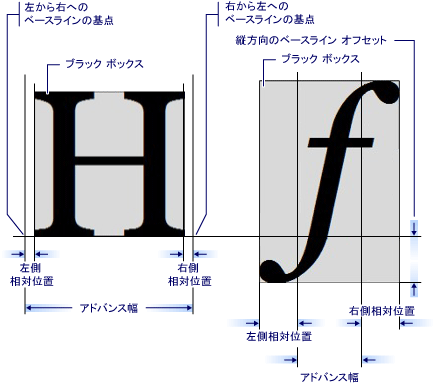

# GlyphRun オブジェクトと Glyphs 要素の概要
このトピックの内容について説明します、<xref:System.Windows.Media.GlyphRun>オブジェクトおよび<xref:System.Windows.Documents.Glyphs>要素。  
  
  
   
## GlyphRun の概要  
 [!INCLUDE[TLA#tla_winclient](../../../../includes/tlasharptla-winclient-md.md)] 直接アクセスできるグリフ レベルのマークアップを含む高度なテキストのサポートを提供<xref:System.Windows.Documents.Glyphs>をインターセプトし、テキストを書式設定後に永続化を希望するお客様向けです。 これらの機能は、下記のようなシナリオでのさまざまなテキスト レンダリング要件をサポートする不可欠なものです。  
  
1.  固定形式のドキュメントの画面表示。  
  
2.  印刷シナリオ。  
  
    -   デバイス プリンター言語としての [!INCLUDE[TLA#tla_xaml](../../../../includes/tlasharptla-xaml-md.md)]。  
  
    -   [!INCLUDE[TLA#tla_mxdw](../../../../includes/tlasharptla-mxdw-md.md)]。  
  
    -   以前のプリンター ドライバー、[!INCLUDE[TLA#tla_win32](../../../../includes/tlasharptla-win32-md.md)]アプリケーションから固定形式への出力。  
  
    -   印刷スプール形式。  
  
3.  以前のバージョンの [!INCLUDE[TLA#tla_mswin](../../../../includes/tlasharptla-mswin-md.md)] のクライアントおよびその他のコンピューティング デバイスを含む、固定形式のドキュメント表示。  
  
> [!NOTE]
>  <xref:System.Windows.Documents.Glyphs> および<xref:System.Windows.Media.GlyphRun>固定形式のドキュメントの表示と印刷のシナリオ用に設計されています。 [!INCLUDE[TLA#tla_winclient](../../../../includes/tlasharptla-winclient-md.md)] 一般的なレイアウトをいくつかの要素を提供し、[!INCLUDE[TLA#tla_ui](../../../../includes/tlasharptla-ui-md.md)]などのシナリオ<xref:System.Windows.Controls.Label>と<xref:System.Windows.Controls.TextBlock>です。 レイアウトと [!INCLUDE[TLA2#tla_ui](../../../../includes/tla2sharptla-ui-md.md)] シナリオの詳細については、[WPF のタイポグラフィ](../../../../docs/framework/wpf/advanced/typography-in-wpf.md)を参照してください。  
  
   
## GlyphRun オブジェクト  
 <xref:System.Windows.Media.GlyphRun>オブジェクトは、1 つのサイズで、1 つの描画スタイルを使用して 1 つのフォントの書体を 1 つのグリフのシーケンスを表します。  
  
 <xref:System.Windows.Media.GlyphRun> グリフなど、両方のフォントの詳細が含まれています<xref:System.Windows.Documents.Glyphs.Indices%2A>と個々 のグリフの位置。 元も含まれています。[!INCLUDE[TLA#tla_unicode](../../../../includes/tlasharptla-unicode-md.md)]コード ポイントが、実行が生成された文字のグリフのバッファー オフセットのマッピングの情報、および文字単位とグリフのフラグ。  
  
 <xref:System.Windows.Media.GlyphRun> 高度な対応しています<xref:System.Windows.FrameworkElement>、<xref:System.Windows.Documents.Glyphs>です。 <xref:System.Windows.Documents.Glyphs> 要素ツリーとで使用できます[!INCLUDE[TLA2#tla_xaml](../../../../includes/tla2sharptla-xaml-md.md)]を表すマークアップ<xref:System.Windows.Media.GlyphRun>出力します。  
  
   
## Glyphs 要素  
 <xref:System.Windows.Documents.Glyphs>要素の出力を表す、<xref:System.Windows.Media.GlyphRun>で[!INCLUDE[TLA2#tla_xaml](../../../../includes/tla2sharptla-xaml-md.md)]です。 次のマークアップの構文が記述に使用される、<xref:System.Windows.Documents.Glyphs>要素。  
  
 [!code-xaml[GlyphsOvwSample1#1](../../../../samples/snippets/csharp/VS_Snippets_Wpf/GlyphsOvwSample1/CS/default.xaml#1)]  
  
 次のプロパティの定義は、サンプルのマークアップ内の最初の 4 つの属性に対応しています。  
  
|プロパティ|説明|  
|--------------|-----------------|  
|<xref:System.Windows.Documents.Glyphs.FontUri%2A>|リソース識別子を指定します。 ファイル名、Web [!INCLUDE[TLA#tla_uri](../../../../includes/tlasharptla-uri-md.md)]、またはアプリケーションの .exe またはコンテナー リソースの参照。|  
|<xref:System.Windows.Documents.Glyphs.FontRenderingEmSize%2A>|フォント サイズを描画サーフェイスの単位で指定します (既定値は .96 インチ)。|  
|<xref:System.Windows.Documents.Glyphs.StyleSimulations%2A>|太字や斜体のスタイルのフラグを指定します。|  
|<xref:System.Windows.Documents.Glyphs.BidiLevel%2A>|双方向のレイアウト レベルを指定します。 偶数とゼロの値は左から右のレイアウトを意味し、奇数の値は右から左のレイアウトを意味します。|  
  
   
### Indices プロパティ  
 <xref:System.Windows.Documents.Glyphs.Indices%2A>プロパティは、グリフの仕様の文字列。 グリフのシーケンスが 1 つのクラスターを形成している場合、クラスター内の最初のグリフの仕様は、クラスターを形成するために組み合わせるグリフの数とコード ポイントの数の仕様によって先行されます。 <xref:System.Windows.Documents.Glyphs.Indices%2A>プロパティが 1 つの文字列で、次のプロパティを収集します。  
  
-   グリフ インデックス  
  
-   グリフのアドバンス幅  
  
-   グリフの添付ファイルのベクトルを組み合わせること  
  
-   コード ポイントからのグリフへのクラスターのマッピング  
  
-   グリフ フラグ  
  
 各グリフの仕様には、次の形式があります。  
  
 `[GlyphIndex][,[Advance][,[uOffset][,[vOffset][,[Flags]]]]]`  
  
   
## グリフのメトリック  
 他に配置する方法を指定するメトリックを定義する各グリフ<xref:System.Windows.Documents.Glyphs>です。 次の図では、2 つの異なるグリフ文字のさまざまな印刷用品質を定義しています。  
  
   
  
   
## グリフ マークアップ  
 次のコード例のさまざまなプロパティを使用する方法を示しています、<xref:System.Windows.Documents.Glyphs>内の要素[!INCLUDE[TLA2#tla_xaml](../../../../includes/tla2sharptla-xaml-md.md)]です。  
  
 [!code-xaml[GlyphsOvwSamp2#1](../../../../samples/snippets/csharp/VS_Snippets_Wpf/GlyphsOvwSamp2/CS/default.xaml#1)]  
  
## 関連項目  
 [WPF のタイポグラフィ](../../../../docs/framework/wpf/advanced/typography-in-wpf.md)  
 [WPF のドキュメント](../../../../docs/framework/wpf/advanced/documents-in-wpf.md)  
 [[テキスト]](../../../../docs/framework/wpf/advanced/optimizing-performance-text.md)
