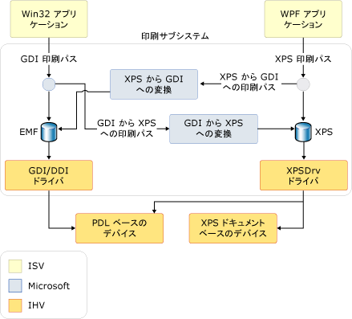

# 印刷の概要
Microsoft .NET Framework を使用するアプリケーション開発者による[!INCLUDE[TLA#tla_wpf](../../../../includes/tlasharptla-wpf-md.md)]印刷と印刷のシステム管理の豊富な新しいセットを持つ[!INCLUDE[TLA#tla_api#plural](../../../../includes/tlasharptla-apisharpplural-md.md)]します。 また、[!INCLUDE[TLA#tla_winvista](../../../../includes/tlasharptla-winvista-md.md)] によって、[!INCLUDE[TLA#tla_winforms](../../../../includes/tlasharptla-winforms-md.md)] アプリケーションを作成する開発者と、アンマネージ コードを使用する開発者も、これらの印刷システム拡張機能の一部を使用できます。 この新しい機能の中核となるのが、新しい [!INCLUDE[TLA#tla_xps](../../../../includes/tlasharptla-xps-md.md)] ファイル形式と [!INCLUDE[TLA2#tla_xps](../../../../includes/tla2sharptla-xps-md.md)] 印刷パスです。  
  
 このトピックは、次のセクションで構成されています。  
  
   
## XPS について  
 [!INCLUDE[TLA2#tla_metro](../../../../includes/tla2sharptla-metro-md.md)] は、電子ドキュメント形式、スプール ファイル形式、およびページ記述言語です。 
          [!INCLUDE[TLA#tla_xml](../../../../includes/tlasharptla-xml-md.md)]、[!INCLUDE[TLA#tla_opc](../../../../includes/tlasharptla-opc-md.md)]、その他の業界標を使用してクロス プラットフォームのドキュメントを作成する OpenDocument 形式の 1 つです。 [!INCLUDE[TLA2#tla_metro](../../../../includes/tla2sharptla-metro-md.md)] は、デジタル ドキュメントの作成、共有、印刷、表示、アーカイブを行うプロセスを簡略化します。 [!INCLUDE[TLA2#tla_metro](../../../../includes/tla2sharptla-metro-md.md)] の追加情報については、[XPS Web サイト](http://www.microsoft.com/xps)に関するページをご覧ください。  
  
 [!INCLUDE[TLA2#tla_wpf](../../../../includes/tla2sharptla-wpf-md.md)] を使用した [!INCLUDE[TLA2#tla_metro](../../../../includes/tla2sharptla-metro-md.md)] ベースのコンテンツの印刷手法のいくつかは、[プログラムによる XPS ファイルの印刷](../../../../docs/framework/wpf/advanced/how-to-programmatically-print-xps-files.md)に関するページで説明されています。 このトピックに含まれるコンテンツの確認中にこれらのサンプルを参照すると、役に立つ場合があります。 (アンマネージ コードの開発者は、ドキュメントを参照してください、 [MXDC_ESCAPE 関数](https://msdn.microsoft.com/library/windows/desktop/dd162739.aspx)です。 [!INCLUDE[TLA2#tla_winforms#initcap](../../../../includes/tla2sharptla-winformssharpinitcap-md.md)] の開発者は、<xref:System.Drawing.Printing> 名前空間の [!INCLUDE[TLA2#tla_api](../../../../includes/tla2sharptla-api-md.md)] を使用する必要があります。この名前空間は、完全な [!INCLUDE[TLA2#tla_xps](../../../../includes/tla2sharptla-xps-md.md)] 印刷パスをサポートしていませんが、ハイブリッドの GDI-XPS 印刷パスをサポートしています。 以下の**印刷パスのアーキテクチャ**をご覧ください。)  
  
   
## XPS 印刷パス  
 [!INCLUDE[TLA#tla_metro](../../../../includes/tlasharptla-metro-md.md)]印刷パスは、新しい[!INCLUDE[TLA#tla_mswin](../../../../includes/tlasharptla-mswin-md.md)]印刷を Windows アプリケーションで処理する方法を再定義する機能。 [!INCLUDE[TLA2#tla_xps](../../../../includes/tla2sharptla-xps-md.md)] は、ドキュメントのプレゼンテーション言語 (RTF など)、印刷スプーラの形式 (WMF など)、ページ記述言語 (PCL や Postscript など) に置き換えることができるため、新しい印刷パスは、アプリケーションの公開から印刷ドライバーまたはデバイスでの最終処理まで、[!INCLUDE[TLA2#tla_metro](../../../../includes/tla2sharptla-metro-md.md)] 形式を維持します。  
  
 
          [!INCLUDE[TLA2#tla_metro](../../../../includes/tla2sharptla-metro-md.md)] 印刷パスは、[!INCLUDE[TLA2#tla_metro](../../../../includes/tla2sharptla-metro-md.md)] のプリンター ドライバー モデル (XPSDrv) 上に構築されています。XPSDrv により、開発者は [!INCLUDE[TLA#tla_wys](../../../../includes/tlasharptla-wys-md.md)] の印刷、色のサポートの向上、および印刷のパフォーマンスの大幅な向上など、いくつかの利点を得られます。 (XPSDrv の詳細については、「[Windows Driver Kit (WDK)](https://msdn.microsoft.com/library/windows/hardware/ff557573.aspx)」をご覧ください。)  
  
 操作用の印刷スプーラーの[!INCLUDE[TLA2#tla_metro](../../../../includes/tla2sharptla-metro-md.md)]ドキュメントには基本的には、Windows の以前のバージョンと同じです。 ただし、既存の [!INCLUDE[TLA2#tla_metro](../../../../includes/tla2sharptla-metro-md.md)] 印刷パスに加えて [!INCLUDE[TLA2#tla_gdi](../../../../includes/tla2sharptla-gdi-md.md)] 印刷パスをサポートするように強化されました。 新しい印刷パスは、ネイティブに [!INCLUDE[TLA2#tla_metro](../../../../includes/tla2sharptla-metro-md.md)] スプール ファイルを使用します。 
          [!INCLUDE[TLA#tla_mswin](../../../../includes/tlasharptla-mswin-md.md)] の以前のバージョン向けに記述されたユーザー モードのプリンター ドライバーは引き続き機能しますが、[!INCLUDE[TLA2#tla_metro](../../../../includes/tla2sharptla-metro-md.md)] 印刷パスを使用するためには、[!INCLUDE[TLA2#tla_metro](../../../../includes/tla2sharptla-metro-md.md)] プリンター ドライバー (XPSDrv) が必要になります。  
  
 
          [!INCLUDE[TLA2#tla_metro](../../../../includes/tla2sharptla-metro-md.md)] 印刷パスには大きな利点があります。それは次のとおりです。  
  
-   [!INCLUDE[TLA2#tla_wys](../../../../includes/tla2sharptla-wys-md.md)] の印刷のサポート。  
  
-   高度なカラー プロファイルのネイティブ サポート (1 チャンネルあたり 32 ビット (bpc)、CMYK、名前付きの色、n インクなど)、および透明度とグラデーションのネイティブ サポート。  
  
-   
          [!INCLUDE[TLA2#tla_winfx](../../../../includes/tla2sharptla-winfx-md.md)] と [!INCLUDE[TLA#tla_win32](../../../../includes/tlasharptla-win32-md.md)] ベースのアプリケーションの両方における印刷パフォーマンスの向上。  
  
-   業界標準の [!INCLUDE[TLA2#tla_metro](../../../../includes/tla2sharptla-metro-md.md)] 形式。  
  
 基本的な印刷シナリオでは、ユーザー インターフェイス、構成、およびジョブの送信用の 1 つのエントリ ポイントで、簡単かつ直感的な [!INCLUDE[TLA2#tla_api](../../../../includes/tla2sharptla-api-md.md)] を使用できます。 高度なシナリオ用に、[!INCLUDE[TLA#tla_ui](../../../../includes/tlasharptla-ui-md.md)] のカスタマイズ (または [!INCLUDE[TLA2#tla_ui](../../../../includes/tla2sharptla-ui-md.md)] がまったくない)、同期または非同期の印刷、および一括印刷の機能のサポートが追加されました。 いずれのオプションでも、完全または部分的な信頼モードでの印刷のサポートを提供します。  
  
 [!INCLUDE[TLA2#tla_metro](../../../../includes/tla2sharptla-metro-md.md)] は、拡張性を考慮して設計されています。 機能拡張フレームワークを使用して、機能を [!INCLUDE[TLA2#tla_metro](../../../../includes/tla2sharptla-metro-md.md)] にモジュール形式で追加できます。 拡張機能は、次のとおりです。  
  
-   印刷スキーマ。 パブリックのスキーマは定期的に更新され、デバイスの機能を迅速に拡張することができます。 (下記の「**PrintTicket と PrintCapabilities**」をご覧ください。)  
  
-   拡張可能なフィルター パイプライン。 
          [!INCLUDE[TLA2#tla_metro](../../../../includes/tla2sharptla-metro-md.md)] プリンター ドライバー (XPSDrv) フィルター パイプラインは、[!INCLUDE[TLA2#tla_metro](../../../../includes/tla2sharptla-metro-md.md)] ドキュメントの直接的および拡張性の高い印刷を可能にするように作られています。 (参照"XPSDrv"で、 [Windows Driver Kit](https://msdn.microsoft.com/library/windows/hardware/ff557573.aspx))。  
  
### 印刷パスのアーキテクチャ  
 
          [!INCLUDE[TLA2#tla_win32](../../../../includes/tla2sharptla-win32-md.md)] および [!INCLUDE[TLA2#tla_winfx](../../../../includes/tla2sharptla-winfx-md.md)] アプリケーションはいずれも [!INCLUDE[TLA2#tla_metro](../../../../includes/tla2sharptla-metro-md.md)] をサポートします。一方、[!INCLUDE[TLA2#tla_win32](../../../../includes/tla2sharptla-win32-md.md)] および [!INCLUDE[TLA2#tla_winforms](../../../../includes/tla2sharptla-winforms-md.md)] アプリケーションは、[!INCLUDE[TLA2#tla_gdi](../../../../includes/tla2sharptla-gdi-md.md)] プリンター ドライバー (XPSDrv) 用に [!INCLUDE[TLA2#tla_metro](../../../../includes/tla2sharptla-metro-md.md)] の書式設定されたコンテンツを作成するため、[!INCLUDE[TLA2#tla_metro](../../../../includes/tla2sharptla-metro-md.md)] から [!INCLUDE[TLA2#tla_metro](../../../../includes/tla2sharptla-metro-md.md)] への変換を使用します。 これらのアプリケーションでは、[!INCLUDE[TLA2#tla_metro](../../../../includes/tla2sharptla-metro-md.md)] 印刷パスを使用する必要はなく、[!INCLUDE[TLA#tla_emf](../../../../includes/tlasharptla-emf-md.md)] ベースの印刷を引き続き使用できます。 ただし、[!INCLUDE[TLA2#tla_metro](../../../../includes/tla2sharptla-metro-md.md)] の機能と拡張機能のほとんどは、[!INCLUDE[TLA2#tla_metro](../../../../includes/tla2sharptla-metro-md.md)] 印刷パスを対象としたアプリケーション以外では使用できません。  
  
 [!INCLUDE[TLA2#tla_win32](../../../../includes/tla2sharptla-win32-md.md)] アプリケーションと [!INCLUDE[TLA2#tla_winforms](../../../../includes/tla2sharptla-winforms-md.md)] アプリケーションで XPSDrv ベースのプリンターを使用できるようにするため、[!INCLUDE[TLA2#tla_metro](../../../../includes/tla2sharptla-metro-md.md)] プリンター ドライバー (XPSDrv) は [!INCLUDE[TLA2#tla_gdi](../../../../includes/tla2sharptla-gdi-md.md)] 形式から [!INCLUDE[TLA2#tla_metro](../../../../includes/tla2sharptla-metro-md.md)] 形式への変換をサポートしています。 XPSDrv モデルには、[!INCLUDE[TLA2#tla_metro](../../../../includes/tla2sharptla-metro-md.md)] 形式から [!INCLUDE[TLA2#tla_gdi](../../../../includes/tla2sharptla-gdi-md.md)] 形式へのコンバーターも備えられています。これにより、[!INCLUDE[TLA2#tla_win32](../../../../includes/tla2sharptla-win32-md.md)] アプリケーションは [!INCLUDE[TLA2#tla_xps](../../../../includes/tla2sharptla-xps-md.md)] ドキュメントを印刷できます。 [!INCLUDE[TLA2#tla_wpf](../../../../includes/tla2sharptla-wpf-md.md)]アプリケーションへの変換[!INCLUDE[TLA2#tla_metro](../../../../includes/tla2sharptla-metro-md.md)]に[!INCLUDE[TLA2#tla_gdi](../../../../includes/tla2sharptla-gdi-md.md)]形式はによって自動的に行われます、<xref:System.Windows.Xps.XpsDocumentWriter.Write%2A>と<xref:System.Windows.Xps.XpsDocumentWriter.WriteAsync%2A>のメソッド、<xref:System.Windows.Xps.XpsDocumentWriter>書き込み操作のターゲットの印刷キューがないときにクラスXPSDrv ドライバーの場合です。 ([!INCLUDE[TLA2#tla_winforms#initcap](../../../../includes/tla2sharptla-winformssharpinitcap-md.md)] アプリケーションは [!INCLUDE[TLA2#tla_xps](../../../../includes/tla2sharptla-xps-md.md)] ドキュメントを印刷できません。)  
  
 次の図は、印刷サブシステムを示すとともに、[!INCLUDE[TLA#tla_ms](../../../../includes/tlasharptla-ms-md.md)] が提供する部分、およびソフトウェアとハードウェアのベンダーが定義する部分を定義しています。  
  
   
  
### XPS の基本的な印刷  
 [!INCLUDE[TLA2#tla_wpf](../../../../includes/tla2sharptla-wpf-md.md)] は、基本的および高度な [!INCLUDE[TLA#tla_api](../../../../includes/tlasharptla-api-md.md)] の両方を定義します。 広範な印刷のカスタマイズや完全な [!INCLUDE[TLA2#tla_metro](../../../../includes/tla2sharptla-metro-md.md)] の機能セットへのアクセスを必要としないアプリケーションでは、基本的な印刷サポートを使用できます。 基本的な印刷サポートは、最小構成を必要とし、使い慣れた [!INCLUDE[TLA2#tla_ui](../../../../includes/tla2sharptla-ui-md.md)] を特長とする印刷ダイアログ コントロールを介して公開されます。 
          [!INCLUDE[TLA2#tla_metro](../../../../includes/tla2sharptla-metro-md.md)] の機能の多くは、この簡略化された印刷モデルによって使用できます。  
  
#### PrintDialog  
 <xref:System.Windows.Controls.PrintDialog?displayProperty=nameWithType> コントロールには、[!INCLUDE[TLA2#tla_ui](../../../../includes/tla2sharptla-ui-md.md)]、構成、および [!INCLUDE[TLA2#tla_metro](../../../../includes/tla2sharptla-metro-md.md)] ジョブの送信用の 1 つのエントリ ポイントが用意されています。 コントロールのインスタンス化と使用方法については、「[方法 : 印刷ダイアログ ボックスを呼び出す](../../../../docs/framework/wpf/advanced/how-to-invoke-a-print-dialog.md)」をご覧ください。  
  
### 高度な XPS の印刷  
 
          [!INCLUDE[TLA2#tla_metro](../../../../includes/tla2sharptla-metro-md.md)] 機能の完全なセットにアクセスするには、高度な印刷の [!INCLUDE[TLA2#tla_api](../../../../includes/tla2sharptla-api-md.md)] を使用する必要があります。 いくつかの関連する [!INCLUDE[TLA2#tla_api](../../../../includes/tla2sharptla-api-md.md)] について、以下で詳しく説明します。 完全な一覧については[!INCLUDE[TLA2#tla_metro](../../../../includes/tla2sharptla-metro-md.md)]印刷パス[!INCLUDE[TLA2#tla_api#plural](../../../../includes/tla2sharptla-apisharpplural-md.md)]を参照してください、<xref:System.Windows.Xps>と<xref:System.Printing>名前空間の参照。  
  
#### PrintTicket と PrintCapabilities  
 <xref:System.Printing.PrintTicket>と<xref:System.Printing.PrintCapabilities>クラスは、詳細 foundation[!INCLUDE[TLA2#tla_metro](../../../../includes/tla2sharptla-metro-md.md)]機能します。 いずれの種類のオブジェクトも、照合順序、両面印刷、ホチキス止めなど、[!INCLUDE[TLA#tla_xml](../../../../includes/tlasharptla-xml-md.md)] 形式の印刷向け機能の構造になっています。これらの構造は、印刷スキーマによって定義されます。 <xref:System.Printing.PrintTicket> は、プリンターに印刷ジョブの処理方法を指示します。 <xref:System.Printing.PrintCapabilities> クラスは、プリンターの機能を定義します。 プリンターの機能のクエリを実行すると、プリンターのサポート機能を最大限に活用する <xref:System.Printing.PrintTicket> を作成できます。 同様に、サポートされていない機能を回避できます。  
  
 次の例は、プリンターの <xref:System.Printing.PrintCapabilities> でクエリを実行する方法と、コードを使用した <xref:System.Printing.PrintTicket> の作成方法を示しています。  
  
 [!code-cpp[xpscreate#PrinterCapabilities](../../../../samples/snippets/cpp/VS_Snippets_Wpf/XpsCreate/CPP/XpsCreate.cpp#printercapabilities)]
 [!code-csharp[xpscreate#PrinterCapabilities](../../../../samples/snippets/csharp/VS_Snippets_Wpf/XpsCreate/CSharp/XpsCreate.cs#printercapabilities)]
 [!code-vb[xpscreate#PrinterCapabilities](../../../../samples/snippets/visualbasic/VS_Snippets_Wpf/XpsCreate/visualbasic/xpscreate.vb#printercapabilities)]  
  
#### PrintServer と PrintQueue  
 <xref:System.Printing.PrintServer> クラスはネットワーク プリント サーバーを表し、<xref:System.Printing.PrintQueue> クラスはプリンターとそれに関連付けられた出力ジョブのキューを表します。 これらの [!INCLUDE[TLA2#tla_api#plural](../../../../includes/tla2sharptla-apisharpplural-md.md)] を併用すると、サーバーの印刷ジョブを高度に管理できます。 <xref:System.Printing.PrintServer>、またはその派生クラスのいずれかを使用すると、<xref:System.Printing.PrintQueue> を管理できます。 新しい印刷ジョブをキューに挿入するには、<xref:System.Printing.PrintQueue.AddJob%2A> メソッドを使用します。  
  
 次の例は、コードを使用して <xref:System.Printing.LocalPrintServer> を作成し、既定の <xref:System.Printing.PrintQueue> にアクセスする方法を示しています。  
  
 [!code-csharp[xpsprint#PrintQueueSnip](../../../../samples/snippets/csharp/VS_Snippets_Wpf/XpsPrint/CSharp/XpsPrintHelper.cs#printqueuesnip)]
 [!code-vb[xpsprint#PrintQueueSnip](../../../../samples/snippets/visualbasic/VS_Snippets_Wpf/XpsPrint/visualbasic/xpsprinthelper.vb#printqueuesnip)]  
  
#### XpsDocumentWriter  
 <xref:System.Windows.Xps.XpsDocumentWriter> を (その多くの <xref:System.Windows.Xps.XpsDocumentWriter.Write%2A> メソッドおよび <xref:System.Windows.Xps.XpsDocumentWriter.WriteAsync%2A> メソッドと共に) 使用すると、[!INCLUDE[TLA2#tla_metro](../../../../includes/tla2sharptla-metro-md.md)] ドキュメントを <xref:System.Printing.PrintQueue> に書き込むことができます。 たとえば、<xref:System.Windows.Xps.XpsDocumentWriter.Write%28System.Windows.Documents.FixedPage%2CSystem.Printing.PrintTicket%29> メソッドを使用すると、[!INCLUDE[TLA2#tla_metro](../../../../includes/tla2sharptla-metro-md.md)] ドキュメントと <xref:System.Printing.PrintTicket> を同期的に出力できます。 <xref:System.Windows.Xps.XpsDocumentWriter.WriteAsync%28System.Windows.Documents.FixedDocument%2CSystem.Printing.PrintTicket%29> メソッドを使用すると、[!INCLUDE[TLA2#tla_metro](../../../../includes/tla2sharptla-metro-md.md)] ドキュメントと <xref:System.Printing.PrintTicket> を非同期的に出力できます。  
  
 次の例は、コードを使用して <xref:System.Windows.Xps.XpsDocumentWriter> を作成する方法を示しています。  
  
 [!code-csharp[XpsPrint#PrintQueueSnip](../../../../samples/snippets/csharp/VS_Snippets_Wpf/XpsPrint/CSharp/XpsPrintHelper.cs#printqueuesnip)]
 [!code-vb[XpsPrint#PrintQueueSnip](../../../../samples/snippets/visualbasic/VS_Snippets_Wpf/XpsPrint/visualbasic/xpsprinthelper.vb#printqueuesnip)]  
  
 さらに <xref:System.Printing.PrintQueue.AddJob%2A> メソッドは印刷方法を提供します。 「[方法 : XPS ファイルをプログラムにより印刷する](../../../../docs/framework/wpf/advanced/how-to-programmatically-print-xps-files.md)」をご覧ください。 詳細について。  
  
   
## GDI 印刷パス  
 [!INCLUDE[TLA2#tla_wpf](../../../../includes/tla2sharptla-wpf-md.md)] アプリケーションはネイティブに [!INCLUDE[TLA2#tla_metro](../../../../includes/tla2sharptla-metro-md.md)] 印刷パスをサポートします。一方、[!INCLUDE[TLA2#tla_win32](../../../../includes/tla2sharptla-win32-md.md)] と [!INCLUDE[TLA2#tla_winforms](../../../../includes/tla2sharptla-winforms-md.md)] アプリケーションも一部の [!INCLUDE[TLA2#tla_metro](../../../../includes/tla2sharptla-metro-md.md)] の機能を活用できます。 
          [!INCLUDE[TLA2#tla_metro](../../../../includes/tla2sharptla-metro-md.md)] プリンター ドライバー (XPSDrv) は、[!INCLUDE[TLA2#tla_gdi](../../../../includes/tla2sharptla-gdi-md.md)] ベースの出力を [!INCLUDE[TLA2#tla_metro](../../../../includes/tla2sharptla-metro-md.md)] 形式に変換できます。 使用して高度なシナリオは、コンテンツのカスタムの変換はサポートされて、 [Microsoft XPS ドキュメント コンバーター (MXDC)](https://msdn.microsoft.com/library/windows/desktop/ff686803.aspx)です。 同様に、[!INCLUDE[TLA2#tla_wpf](../../../../includes/tla2sharptla-wpf-md.md)]に出力アプリケーションすることも、[!INCLUDE[TLA2#tla_gdi](../../../../includes/tla2sharptla-gdi-md.md)]印刷パスのいずれかを呼び出すことによって、<xref:System.Windows.Xps.XpsDocumentWriter.Write%2A>または<xref:System.Windows.Xps.XpsDocumentWriter.WriteAsync%2A>のメソッド、<xref:System.Windows.Xps.XpsDocumentWriter>印刷キューのクラス、ターゲットとして XpsDrv 以外のプリンターを指定するとします。  

          [!INCLUDE[TLA2#tla_metro](../../../../includes/tla2sharptla-metro-md.md)] の機能またはサポートを必要としないアプリケーションでは、現在の [!INCLUDE[TLA2#tla_gdi](../../../../includes/tla2sharptla-gdi-md.md)] 印刷パスは変更されません。  
  
-   参考資料について、[!INCLUDE[TLA2#tla_gdi](../../../../includes/tla2sharptla-gdi-md.md)]パスと、さまざまな印刷[!INCLUDE[TLA2#tla_metro](../../../../includes/tla2sharptla-metro-md.md)]換算オプションの場合を参照してください[Microsoft XPS ドキュメント コンバーター (MXDC)](https://msdn.microsoft.com/library/windows/desktop/ff686803.aspx)と"XPSDrv"で、 [Windows Driver Kit](https://msdn.microsoft.com/library/windows/hardware/ff557573.aspx).  
  
   
## XPSDrv ドライバー モデル  
 
          [!INCLUDE[TLA2#tla_metro](../../../../includes/tla2sharptla-metro-md.md)] 印刷パスでは、[!INCLUDE[TLA2#tla_metro](../../../../includes/tla2sharptla-metro-md.md)] 対応のプリンターまたはドライバーに出力する場合に、ネイティブの印刷スプール形式として [!INCLUDE[TLA2#tla_metro](../../../../includes/tla2sharptla-metro-md.md)] を使用すると、スプーラの効率性が高まります。 スプール処理の簡略化により、ドキュメントをスプールする前に、[!INCLUDE[TLA2#tla_emf](../../../../includes/tla2sharptla-emf-md.md)] データ ファイルなどの中間スプール ファイルを生成する必要がなくなります。 スプール ファイルのサイズを小さくすると、[!INCLUDE[TLA2#tla_metro](../../../../includes/tla2sharptla-metro-md.md)] 印刷パスのネットワーク トラフィックが減少し、印刷のパフォーマンスが向上します。  
  
 [!INCLUDE[TLA2#tla_emf](../../../../includes/tla2sharptla-emf-md.md)] は、サービスのレンダリングのために、アプリケーションの出力を [!INCLUDE[TLA2#tla_gdi](../../../../includes/tla2sharptla-gdi-md.md)] に対する一連の呼び出しとして表すクローズ形式です。 
          [!INCLUDE[TLA2#tla_emf](../../../../includes/tla2sharptla-emf-md.md)] と異なり、[!INCLUDE[TLA2#tla_metro](../../../../includes/tla2sharptla-metro-md.md)] スプール形式では、[!INCLUDE[TLA2#tla_metro](../../../../includes/tla2sharptla-metro-md.md)] ベースのプリンター ドライバー (XPSDrv) に出力する際、さらに解釈する必要なく、実際のドキュメントを表します。 ドライバーは、その形式のデータを直接操作できます。 この機能により、[!INCLUDE[TLA2#tla_emf](../../../../includes/tla2sharptla-emf-md.md)] ファイルと [!INCLUDE[TLA2#tla_gdi](../../../../includes/tla2sharptla-gdi-md.md)] ベースの印刷ドライバーを使用する際の、データと色空間の変換が必要なくなります。  
  
 同等の [!INCLUDE[TLA2#tla_metro](../../../../includes/tla2sharptla-metro-md.md)] と比較すると、[!INCLUDE[TLA2#tla_metro](../../../../includes/tla2sharptla-metro-md.md)] プリンター ドライバー (XPSDrv) を対象とする [!INCLUDE[TLA2#tla_emf](../../../../includes/tla2sharptla-emf-md.md)] ドキュメントを使用する際、通常はスプール ファイルのサイズが減少します。ただし、例外もあります。  
  
-   ベクター グラフィックが非常に複雑で、複数の階層があるか、非効率的に記述されている場合、同じグラフィックスのビットマップ形式のバージョンよりもサイズが大きくなることがあります。  
  
-   画面表示の目的で、XPS ファイルにはデバイス フォントおよびコンピューター ベースのフォントが埋め込まれます。一方、GDI のスプール ファイルにはデバイス フォントは埋め込まれません。 しかし、両方の種類のフォントがサブセット化されているため (下記参照)、プリンター ドライバーは、ファイルをプリンターに送信する前にデバイス フォントを削除することができます。  
  
 スプール サイズの削減は、いくつかのメカニズムを通じて行われます。  
  
-   **フォントのサブセット化**。 実際のドキュメント内で使用される文字のみが [!INCLUDE[TLA2#tla_metro](../../../../includes/tla2sharptla-metro-md.md)] ファイルに格納されます。  
  
-   **高度なグラフィックスのサポート**。 透過性とグラデーションのプリミティブのネイティブ サポートにより、[!INCLUDE[TLA2#tla_xps](../../../../includes/tla2sharptla-xps-md.md)] ドキュメントの内容のラスタライズを回避できます。  
  
-   **共通リソースの識別**。 複数回使用するリソース (会社のロゴを表す画像など) は共有リソースとして扱われ、一度だけ読み込まれます。  
  
-   **ZIP 圧縮**。 すべての [!INCLUDE[TLA2#tla_metro](../../../../includes/tla2sharptla-metro-md.md)] ドキュメントで ZIP 圧縮を使用します。  
  
## 関連項目  
 <xref:System.Windows.Controls.PrintDialog>  
 <xref:System.Windows.Xps.XpsDocumentWriter>  
 <xref:System.Windows.Xps.Packaging.XpsDocument>  
 <xref:System.Printing.PrintTicket>  
 <xref:System.Printing.PrintCapabilities>  
 <xref:System.Printing.PrintServer>  
 <xref:System.Printing.PrintQueue>  
 [方法トピック](../../../../docs/framework/wpf/advanced/printing-how-to-topics.md)  
 [WPF のドキュメント](../../../../docs/framework/wpf/advanced/documents-in-wpf.md)  
 [XPS](http://www.microsoft.com/xps)  
 [ドキュメントのシリアル化および保存](../../../../docs/framework/wpf/advanced/document-serialization-and-storage.md)  
 [Microsoft XPS ドキュメント コンバーター (MXDC)](https://msdn.microsoft.com/library/windows/desktop/ff686803.aspx)
