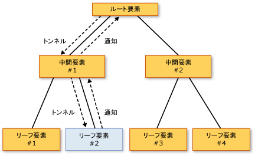

# ルーティング イベントの概要Routed Events Overview
このトピックでは、[!INCLUDE[TLA#tla_winclient](../../../../includes/tlasharptla-winclient-md.md)] でのルーティング イベントの概念について説明します。This topic describes the concept of routed events in [!INCLUDE[TLA#tla_winclient](../../../../includes/tlasharptla-winclient-md.md)]. ここでは、ルーティング イベントの用語を定義し、要素ツリーを通じたルーティング イベントのルーティング方法、ルーティング イベントの処理方法、カスタム ルーティング イベントの作成方法について説明します。The topic defines routed events terminology, describes how routed events are routed through a tree of elements, summarizes how you handle routed events, and introduces how to create your own custom routed events.
  
   
## 必須コンポーネントPrerequisites  
 ここでの説明は、[!INCLUDE[TLA#tla_clr](../../../../includes/tlasharptla-clr-md.md)]、オブジェクト指向プログラミング、ツリー形式として概念化できる [!INCLUDE[TLA2#tla_winclient](../../../../includes/tla2sharptla-winclient-md.md)] 要素間のリレーションシップに関する基礎知識を前提にしています。This topic assumes that you have basic knowledge of the [!INCLUDE[TLA#tla_clr](../../../../includes/tlasharptla-clr-md.md)] and object-oriented programming, as well as the concept of how the relationships between [!INCLUDE[TLA2#tla_winclient](../../../../includes/tla2sharptla-winclient-md.md)] elements can be conceptualized as a tree. このトピックの例に従うには、[!INCLUDE[TLA#tla_xaml](../../../../includes/tlasharptla-xaml-md.md)] について理解し、ごく基本的な [!INCLUDE[TLA2#tla_winclient](../../../../includes/tla2sharptla-winclient-md.md)] アプリケーションまたはページを作成できる必要があります。In order to follow the examples in this topic, you should also understand [!INCLUDE[TLA#tla_xaml](../../../../includes/tlasharptla-xaml-md.md)] and know how to write very basic [!INCLUDE[TLA2#tla_winclient](../../../../includes/tla2sharptla-winclient-md.md)] applications or pages. 詳細については、次を参照してください。[チュートリアル: 最初の WPF デスクトップ アプリケーション](../../../../docs/framework/wpf/getting-started/walkthrough-my-first-wpf-desktop-application.md)と[XAML の概要 (WPF)](../../../../docs/framework/wpf/advanced/xaml-overview-wpf.md)です。For more information, see [Walkthrough: My first WPF desktop application](../../../../docs/framework/wpf/getting-started/walkthrough-my-first-wpf-desktop-application.md) and [XAML Overview (WPF)](../../../../docs/framework/wpf/advanced/xaml-overview-wpf.md).  
  
   
## ルーティング イベントとはWhat Is a Routed Event?  
 ルーティング イベントについては、機能または実装の観点から考えることができます。You can think about routed events either from a functional or implementation perspective. どちらを便利と感じるかは個人によって異なるため、ここでは両方の見方を提示します。Both definitions are presented here, because some people find one or the other definition more useful.  
  
 観点を機能に置いた場合、ルーティング イベントは、イベントを生成したオブジェクト上だけでなく、要素ツリー内の複数のリスナー上でハンドラーを呼び出すことができる種類のイベントです。Functional definition: A routed event is a type of event that can invoke handlers on multiple listeners in an element tree, rather than just on the object that raised the event.  
  
 実装定義: ルーティングされたイベントは、[!INCLUDE[TLA2#tla_clr](../../../../includes/tla2sharptla-clr-md.md)]のインスタンスでバックアップされているイベント、<xref:System.Windows.RoutedEvent>クラスし、によって処理される、[!INCLUDE[TLA#tla_winclient](../../../../includes/tlasharptla-winclient-md.md)]イベント システムです。Implementation definition: A routed event is a [!INCLUDE[TLA2#tla_clr](../../../../includes/tla2sharptla-clr-md.md)] event that is backed by an instance of the <xref:System.Windows.RoutedEvent> class and is processed by the [!INCLUDE[TLA#tla_winclient](../../../../includes/tlasharptla-winclient-md.md)] event system.  
  
 一般的な [!INCLUDE[TLA2#tla_winclient](../../../../includes/tla2sharptla-winclient-md.md)] アプリケーションには、多数の要素が含まれます。A typical [!INCLUDE[TLA2#tla_winclient](../../../../includes/tla2sharptla-winclient-md.md)] application contains many elements. コードで作成したか [!INCLUDE[TLA2#tla_xaml](../../../../includes/tla2sharptla-xaml-md.md)] の宣言によって作成したかにかかわらず、これらの要素は互いに要素ツリー リレーションシップにあります。Whether created in code or declared in [!INCLUDE[TLA2#tla_xaml](../../../../includes/tla2sharptla-xaml-md.md)], these elements exist in an element tree relationship to each other. イベントのルーティングは、イベント定義に従って 2 つの方向のいずれかをたどることができますが、一般にはルーティングは発生元要素から要素ツリーに沿って "浮上" し、最終的には要素ツリーのルート (通常はページまたはウィンドウ) に到達します。The event route can travel in one of two directions depending on the event definition, but generally the route travels from the source element and then "bubbles" upward through the element tree until it reaches the element tree root (typically a page or a window). このバブル (浮上) の概念は、DHTML オブジェクト モデルで使用される概念と似ています。This bubbling concept might be familiar to you if you have worked with the DHTML object model previously.  
  
 たとえば、次のような単純な要素ツリーがあるとします。Consider the following simple element tree:  
  
 [!code-xaml[EventOvwSupport#GroupButton](../../../../samples/snippets/csharp/VS_Snippets_Wpf/EventOvwSupport/CSharp/default.xaml#groupbutton)]  
  
 この要素ツリーでは、次のようなものが生成されます。This element tree produces something like the following:  
  
 ![[Yes]、[No]、[Cancel] ボタン](../../../../docs/framework/wpf/advanced/media/routedevent-ovw-1.gif "RoutedEvent_ovw_1")  
  
 この簡素化された要素のツリーのソースで、<xref:System.Windows.Controls.Primitives.ButtonBase.Click>イベントは、のいずれか、<xref:System.Windows.Controls.Button>要素、およびどちら<xref:System.Windows.Controls.Button>がクリックされたをイベントを処理する機会を持つ最初の要素。In this simplified element tree, the source of a <xref:System.Windows.Controls.Primitives.ButtonBase.Click> event is one of the <xref:System.Windows.Controls.Button> elements, and whichever <xref:System.Windows.Controls.Button> was clicked is the first element that has the opportunity to handle the event. ハンドラーが添付されていない場合は、<xref:System.Windows.Controls.Button>イベントのバブルが上方向にし、イベントに対して、<xref:System.Windows.Controls.Button>要素ツリーで、これは親、<xref:System.Windows.Controls.StackPanel>です。But if no handler attached to the <xref:System.Windows.Controls.Button> acts on the event, then the event will bubble upwards to the <xref:System.Windows.Controls.Button> parent in the element tree, which is the <xref:System.Windows.Controls.StackPanel>. イベント バブル可能性のある、 <xref:System.Windows.Controls.Border>、し、以降の (表示されない) 要素ツリーのページのルートにします。Potentially, the event bubbles to <xref:System.Windows.Controls.Border>, and then beyond to the page root of the element tree (not shown).  
  
 このイベントのルーティング言い換えれば、<xref:System.Windows.Controls.Primitives.ButtonBase.Click>イベントは。In other words, the event route for this <xref:System.Windows.Controls.Primitives.ButtonBase.Click> event is:  
  
 Button-->StackPanel-->Border-->...Button-->StackPanel-->Border-->...  
  
### ルーティング イベントのトップレベルのシナリオTop-level Scenarios for Routed Events  
 ルーティング イベントの概念が生まれる契機となったシナリオと、このシナリオに通常の [!INCLUDE[TLA2#tla_clr](../../../../includes/tla2sharptla-clr-md.md)] イベントが適していない理由について簡単に説明します。The following is a brief summary of the scenarios that motivated the routed event concept, and why a typical [!INCLUDE[TLA2#tla_clr](../../../../includes/tla2sharptla-clr-md.md)] event was not adequate for these scenarios:  
  
 **コントロールの複合とカプセル化:** [!INCLUDE[TLA2#tla_winclient](../../../../includes/tla2sharptla-winclient-md.md)] のさまざまなコントロールには、多機能のコンテンツ モデルが採用されています。**Control composition and encapsulation:** Various controls in [!INCLUDE[TLA2#tla_winclient](../../../../includes/tla2sharptla-winclient-md.md)] have a rich content model. たとえば、内のイメージを配置することができます、<xref:System.Windows.Controls.Button>ボタンのビジュアル ツリーを効果的に拡張します。For example, you can place an image inside of a <xref:System.Windows.Controls.Button>, which effectively extends the visual tree of the button. ただし、追加したイメージに応答するためのボタンの原因となる、ヒット テストの動作が中断する必要がありますされません、<xref:System.Windows.Controls.Primitives.ButtonBase.Click>ピクセル イメージの一部では技術的には、ユーザーがクリックした場合でも、そのコンテンツのです。However, the added image must not break the hit-testing behavior that causes a button to respond to a <xref:System.Windows.Controls.Primitives.ButtonBase.Click> of its content, even if the user clicks on pixels that are technically part of the image.  
  
 **単一のハンドラー アタッチ ポイント:** [!INCLUDE[TLA#tla_winforms](../../../../includes/tlasharptla-winforms-md.md)]では、複数の要素から発生する可能性があるイベントを処理するために同じハンドラーを複数回アタッチする必要があります。**Singular handler attachment points:** In [!INCLUDE[TLA#tla_winforms](../../../../includes/tlasharptla-winforms-md.md)], you would have to attach the same handler multiple times to process events that could be raised from multiple elements. ルーティング イベントを使用すると、前の例に示したとおり、ハンドラーを一度だけアタッチし、必要に応じてハンドラーのロジックを使用してイベントの発生元を特定することができます。Routed events enable you to attach that handler only once, as was shown in the previous example, and use handler logic to determine where the event came from if necessary. たとえば、前に示した [!INCLUDE[TLA2#tla_xaml](../../../../includes/tla2sharptla-xaml-md.md)] では次のようなハンドラーを使用します。For instance, this might be the handler for the previously shown [!INCLUDE[TLA2#tla_xaml](../../../../includes/tla2sharptla-xaml-md.md)]:  
  
 [!code-csharp[EventOvwSupport#GroupButtonCodeBehind](../../../../samples/snippets/csharp/VS_Snippets_Wpf/EventOvwSupport/CSharp/default.xaml.cs#groupbuttoncodebehind)]
 [!code-vb[EventOvwSupport#GroupButtonCodeBehind](../../../../samples/snippets/visualbasic/VS_Snippets_Wpf/EventOvwSupport/visualbasic/default.xaml.vb#groupbuttoncodebehind)]  
  
 **クラス処理:** ルーティング イベントでは、クラスに定義した静的ハンドラーを使用できます。**Class handling:** Routed events permit a static handler that is defined by the class. このクラス ハンドラーでは、アタッチされたどのインスタンス ハンドラーよりも先にイベントを処理できます。This class handler has the opportunity to handle an event before any attached instance handlers can.  
  
 **リフレクションを使用しないイベント参照:** 特定のコードやマークアップのテクニックでは、特定のイベントを識別する機能が必要とされます。**Referencing an event without reflection:** Certain code and markup techniques require a way to identify a specific event. ルーティング イベントを作成、<xref:System.Windows.RoutedEvent>フィールドは静的であるか、ランタイムのリフレクションを必要としない信頼性の高いイベントの識別方法を提供する、識別子として。A routed event creates a <xref:System.Windows.RoutedEvent> field as an identifier, which provides a robust event identification technique that does not require static or run-time reflection.  
  
### ルーティング イベントの実装方法How Routed Events Are Implemented  
 ルーティングされたイベントは、[!INCLUDE[TLA2#tla_clr](../../../../includes/tla2sharptla-clr-md.md)]のインスタンスでバックアップされているイベント、<xref:System.Windows.RoutedEvent>クラス登録されると、[!INCLUDE[TLA2#tla_winclient](../../../../includes/tla2sharptla-winclient-md.md)]イベント システムです。A routed event is a [!INCLUDE[TLA2#tla_clr](../../../../includes/tla2sharptla-clr-md.md)] event that is backed by an instance of the <xref:System.Windows.RoutedEvent> class and registered with the [!INCLUDE[TLA2#tla_winclient](../../../../includes/tla2sharptla-winclient-md.md)] event system. <xref:System.Windows.RoutedEvent>として登録から取得したインスタンスが保持される通常、 `public` `static` `readonly`クラスを登録し、したがって"所有"するルーティング イベントのフィールド メンバーです。The <xref:System.Windows.RoutedEvent> instance obtained from registration is typically retained as a `public` `static` `readonly` field member of the class that registers and thus "owns" the routed event. 一意の名前を持つ [!INCLUDE[TLA2#tla_clr](../../../../includes/tla2sharptla-clr-md.md)] イベント ("ラッパー" イベントとも呼ばれます) への接続は、[!INCLUDE[TLA2#tla_clr](../../../../includes/tla2sharptla-clr-md.md)] イベントの `add` 実装と `remove` 実装をオーバーライドすることにより得られます。The connection to the identically named [!INCLUDE[TLA2#tla_clr](../../../../includes/tla2sharptla-clr-md.md)] event (which is sometimes termed the "wrapper" event) is accomplished by overriding the `add` and `remove` implementations for the [!INCLUDE[TLA2#tla_clr](../../../../includes/tla2sharptla-clr-md.md)] event. 通常、`add` と `remove` は、暗黙の既定のままにされ、そのイベントのハンドラーの追加や削除に言語固有の適切なイベント構文が使用されます。Ordinarily, the `add` and `remove` are left as an implicit default that uses the appropriate language-specific event syntax for adding and removing handlers of that event. ルーティング イベントのバッキングと接続のメカニズムが概念的には、依存関係プロパティがに似ていますが、[!INCLUDE[TLA2#tla_clr](../../../../includes/tla2sharptla-clr-md.md)]補助されているプロパティ、<xref:System.Windows.DependencyProperty>クラス登録されると、[!INCLUDE[TLA2#tla_winclient](../../../../includes/tla2sharptla-winclient-md.md)]プロパティ システムです。The routed event backing and connection mechanism is conceptually similar to how a dependency property is a [!INCLUDE[TLA2#tla_clr](../../../../includes/tla2sharptla-clr-md.md)] property that is backed by the <xref:System.Windows.DependencyProperty> class and registered with the [!INCLUDE[TLA2#tla_winclient](../../../../includes/tla2sharptla-winclient-md.md)] property system.  
  
 次の例は、ユーザー定義の宣言を示しています`Tap`ルーティング イベントを登録およびの露出を含む、<xref:System.Windows.RoutedEvent>識別子フィールドおよび`add`と`remove`の実装、 `Tap` 。[!INCLUDE[TLA2#tla_clr](../../../../includes/tla2sharptla-clr-md.md)]イベント。The following example shows the declaration for a custom `Tap` routed event, including the registration and exposure of the <xref:System.Windows.RoutedEvent> identifier field and the `add` and `remove` implementations for the `Tap` [!INCLUDE[TLA2#tla_clr](../../../../includes/tla2sharptla-clr-md.md)] event.  
  
 [!code-csharp[RoutedEventCustom#AddRemoveHandler](../../../../samples/snippets/csharp/VS_Snippets_Wpf/RoutedEventCustom/CSharp/SDKSampleLibrary/class1.cs#addremovehandler)]
 [!code-vb[RoutedEventCustom#AddRemoveHandler](../../../../samples/snippets/visualbasic/VS_Snippets_Wpf/RoutedEventCustom/VB/SDKSampleLibrary/Class1.vb#addremovehandler)]  
  
### ルーティング イベント ハンドラーと XAMLRouted Event Handlers and XAML  
 [!INCLUDE[TLA2#tla_xaml](../../../../includes/tla2sharptla-xaml-md.md)] を使用してイベントのハンドラーを追加するには、イベント リスナーである要素の属性としてイベント名を宣言します。To add a handler for an event using [!INCLUDE[TLA2#tla_xaml](../../../../includes/tla2sharptla-xaml-md.md)], you declare the event name as an attribute on the element that is an event listener. 属性の値は、実装したハンドラー メソッドの名前です。このメソッドは、分離コード ファイルの部分クラス内に存在する必要があります。The value of the attribute is the name of your implemented handler method, which must exist in the partial class of the code-behind file.  
  
 [!code-xaml[EventOvwSupport#SimplestSyntax](../../../../samples/snippets/csharp/VS_Snippets_Wpf/EventOvwSupport/CSharp/default.xaml#simplestsyntax)]  
  
 標準の [!INCLUDE[TLA2#tla_clr](../../../../includes/tla2sharptla-clr-md.md)] イベント ハンドラーを追加する [!INCLUDE[TLA2#tla_xaml](../../../../includes/tla2sharptla-xaml-md.md)] 構文は、ルーティング イベント ハンドラーを追加する構文と同じです。これは、実際にはハンドラーを [!INCLUDE[TLA2#tla_clr](../../../../includes/tla2sharptla-clr-md.md)] イベント ラッパーに追加しているためです。このラッパーの内部にルーティング イベント実装が存在します。The [!INCLUDE[TLA2#tla_xaml](../../../../includes/tla2sharptla-xaml-md.md)] syntax for adding standard [!INCLUDE[TLA2#tla_clr](../../../../includes/tla2sharptla-clr-md.md)] event handlers is the same for adding routed event handlers, because you are really adding handlers to the [!INCLUDE[TLA2#tla_clr](../../../../includes/tla2sharptla-clr-md.md)] event wrapper, which has a routed event implementation underneath. イベント ハンドラーを[!INCLUDE[TLA2#tla_xaml](../../../../includes/tla2sharptla-xaml-md.md)] で追加する方法の詳細については、「[XAML の概要 (WPF)](../../../../docs/framework/wpf/advanced/xaml-overview-wpf.md)」を参照してください。For more information about adding event handlers in [!INCLUDE[TLA2#tla_xaml](../../../../includes/tla2sharptla-xaml-md.md)], see [XAML Overview (WPF)](../../../../docs/framework/wpf/advanced/xaml-overview-wpf.md).  
  
   
## ルーティング方法Routing Strategies  
 ルーティング イベントは、3 つのルーティング方法のいずれかを使用します。Routed events use one of three routing strategies:  
  
-   **バブル:** イベント ソースのイベント ハンドラーが呼び出されます。**Bubbling:** Event handlers on the event source are invoked. ルーティング イベントは、次に、要素ツリー ルートに到達するまで、連続する親要素にルーティングします。The routed event then routes to successive parent elements until reaching the element tree root. ほとんどのルーティング イベントでは、このバブル ルーティング方法を使用します。Most routed events use the bubbling routing strategy. バブル ルーティング イベントは、一般に個別のコントロールまたはその他の UI 要素からの入力や状態変化を報告するために使用されます。Bubbling routed events are generally used to report input or state changes from distinct controls or other UI elements.  
  
-   **直接:** ソース要素自体のみに、応答としてハンドラーを呼び出す機会が与えられます。**Direct:** Only the source element itself is given the opportunity to invoke handlers in response. これは、[!INCLUDE[TLA#tla_winforms](../../../../includes/tlasharptla-winforms-md.md)] がイベントに使用する "ルーティング" と似ています。This is analogous to the "routing" that [!INCLUDE[TLA#tla_winforms](../../../../includes/tlasharptla-winforms-md.md)] uses for events. ただし、標準とは異なり[!INCLUDE[TLA2#tla_clr](../../../../includes/tla2sharptla-clr-md.md)]イベント、クラス処理をサポートするルーティング イベントを直接 (クラス処理は次のセクションで説明されている) で使用できると<xref:System.Windows.EventSetter>と<xref:System.Windows.EventTrigger>です。However, unlike a standard [!INCLUDE[TLA2#tla_clr](../../../../includes/tla2sharptla-clr-md.md)] event, direct routed events support class handling (class handling is explained in an upcoming section) and can be used by <xref:System.Windows.EventSetter> and <xref:System.Windows.EventTrigger>.  
  
-   **トンネル:**  要素ツリー ルートのイベント ハンドラーが最初に呼び出されます。**Tunneling:** Initially, event handlers at the element tree root are invoked. ルーティング イベントは、次に、経路沿いにルーティング イベント ソース (ルーティング イベントを発生させた要素) のノード要素まで、連続する子要素間の経路をたどります。The routed event then travels a route through successive child elements along the route, towards the node element that is the routed event source (the element that raised the routed event). 多くの場合にトンネル ルーティング イベントは、コントロールの複合部分として使用または処理されます。たとえば、複合部分で発生したイベントは、完全なコントロールに固有のイベントによって意図的に抑止されるか置き換えられます。Tunneling routed events are often used or handled as part of the compositing for a control, such that events from composite parts can be deliberately suppressed or replaced by events that are specific to the complete control. 多くの場合、[!INCLUDE[TLA2#tla_winclient](../../../../includes/tla2sharptla-winclient-md.md)] から提供される入力イベントはトンネルとバブルのペアとして実装されます。Input events provided in [!INCLUDE[TLA2#tla_winclient](../../../../includes/tla2sharptla-winclient-md.md)] often come implemented as a tunneling/bubbling pair. トンネル イベントは、このペアに使用される名前付け規則から、プレビュー イベントと呼ばれることもあります。Tunneling events are also sometimes referred to as Preview events, because of a naming convention that is used for the pairs.  
  
   
## ルーティング イベントを使用する理由Why Use Routed Events?  
 アプリケーションを開発するときに、処理するイベントがルーティング イベントとして実装されているかどうかを常に確認する必要はありません。As an application developer, you do not always need to know or care that the event you are handling is implemented as a routed event. ルーティング イベントの動作は独特ですが、イベントを発生元の要素で処理する限り、動作はあまり表面には見えません。Routed events have special behavior, but that behavior is largely invisible if you are handling an event on the element where it is raised.  
  
 ルーティング イベントが効果を発揮するのは、共通ハンドラーを共通ルートに定義する、独自のコントロールを複合化する、カスタム コントロール クラスを定義するなどの、特定のシナリオの場合です。Where routed events become powerful is if you use any of the suggested scenarios: defining common handlers at a common root, compositing your own control, or defining your own custom control class.  
  
 ルーティング イベント リスナーとルーティング イベント ソースは、階層内で共通イベントを共有する必要はありません。Routed event listeners and routed event sources do not need to share a common event in their hierarchy. どの<xref:System.Windows.UIElement>または<xref:System.Windows.ContentElement>ルーティング イベントのイベント リスナーを指定できます。Any <xref:System.Windows.UIElement> or <xref:System.Windows.ContentElement> can be an event listener for any routed event. したがって、ワーキング [!INCLUDE[TLA2#tla_api](../../../../includes/tla2sharptla-api-md.md)] セットで使用可能なすべてのルーティング イベントを概念的 "インターフェイス" として使用できます。これにより、アプリケーション内の異なる要素間でイベント情報を交換できます。Therefore, you can use the full set of routed events available throughout the working [!INCLUDE[TLA2#tla_api](../../../../includes/tla2sharptla-api-md.md)] set as a conceptual "interface" whereby disparate elements in the application can exchange event information. ルーティング イベントのこの "インターフェイス" 概念は、特に入力イベントに当てはまります。This "interface" concept for routed events is particularly applicable for input events.  
  
 また、ルーティング イベントは、要素ツリー間の通信にも使用できます。これは、イベントのイベント データが経路上の各要素に永続的に保持されるためです。Routed events can also be used to communicate through the element tree, because the event data for the event is perpetuated to each element in the route. ある要素でイベント データの一部を変更した場合、この変更は経路上の次の要素で使用できます。One element could change something in the event data, and that change would be available to the next element in the route.  
  
 ルーティングの面以外でも、特定の [!INCLUDE[TLA2#tla_winclient](../../../../includes/tla2sharptla-winclient-md.md)] イベントを標準の [!INCLUDE[TLA2#tla_clr](../../../../includes/tla2sharptla-clr-md.md)] イベントではなくルーティング イベントとして実装する理由が他に 2 つあります。Other than the routing aspect, there are two other reasons that any given [!INCLUDE[TLA2#tla_winclient](../../../../includes/tla2sharptla-winclient-md.md)] event might be implemented as a routed event instead of a standard [!INCLUDE[TLA2#tla_clr](../../../../includes/tla2sharptla-clr-md.md)] event. 独自のイベントを実装している場合は、次の原則も考慮します。If you are implementing your own events, you might also consider these principles:  
  
-   特定[!INCLUDE[TLA2#tla_winclient](../../../../includes/tla2sharptla-winclient-md.md)]などのスタイルとテンプレートの機能<xref:System.Windows.EventSetter>と<xref:System.Windows.EventTrigger>ルーティング イベントに参照されているイベントを必要とします。Certain [!INCLUDE[TLA2#tla_winclient](../../../../includes/tla2sharptla-winclient-md.md)] styling and templating features such as <xref:System.Windows.EventSetter> and <xref:System.Windows.EventTrigger> require the referenced event to be a routed event. これは、前に説明したイベント識別子シナリオです。This is the event identifier scenario mentioned earlier.  
  
-   ルーティング イベントは、クラス処理機構をサポートしています。この機構により、クラスに静的メソッドを指定して、登録されたインスタンス ハンドラーがルーティング イベントにアクセスする前にこの静的メソッドでイベントを処理することができます。Routed events support a class handling mechanism whereby the class can specify static methods that have the opportunity to handle routed events before any registered instance handlers can access them. インスタンスでのイベント処理によって誤って抑止されずにイベント駆動のクラス動作を適用できるため、これはコントロールをデザインするときに便利です。This is very useful in control design, because your class can enforce event-driven class behaviors that cannot be accidentally suppressed by handling an event on an instance.  
  
 前に示した一連の考慮事項については、このトピックのセクションで個別に説明します。Each of the above considerations is discussed in a separate section of this topic.  
  
   
## ルーティング イベントのイベント ハンドラーの追加と実装Adding and Implementing an Event Handler for a Routed Event  
 [!INCLUDE[TLA2#tla_xaml](../../../../includes/tla2sharptla-xaml-md.md)] でイベント ハンドラーを追加するには、次の例に示すように、単にイベント名を要素に属性として追加し、属性の値として、適切なデリゲートを実装するイベント ハンドラーの名前を設定します。To add an event handler in [!INCLUDE[TLA2#tla_xaml](../../../../includes/tla2sharptla-xaml-md.md)], you simply add the event name to an element as an attribute and set the attribute value as the name of the event handler that implements an appropriate delegate, as in the following example.  
  
 [!code-xaml[EventOvwSupport#SimplestSyntax](../../../../samples/snippets/csharp/VS_Snippets_Wpf/EventOvwSupport/CSharp/default.xaml#simplestsyntax)]  
  
 `b1SetColor` 処理するコードを含む実装されたハンドラーの名前を指定します、<xref:System.Windows.Controls.Primitives.ButtonBase.Click>イベント。`b1SetColor` is the name of the implemented handler that contains the code that handles the <xref:System.Windows.Controls.Primitives.ButtonBase.Click> event. `b1SetColor` 同じシグネチャを持つ必要があります、<xref:System.Windows.RoutedEventHandler>イベント ハンドラー デリゲートであるデリゲートを<xref:System.Windows.Controls.Primitives.ButtonBase.Click>イベント。`b1SetColor` must have the same signature as the <xref:System.Windows.RoutedEventHandler> delegate, which is the event handler delegate for the <xref:System.Windows.Controls.Primitives.ButtonBase.Click> event. すべてのルーティング イベント ハンドラー デリゲートの 1 番目のパラメーターでは、イベント ハンドラーの追加先の要素を指定し、2 番目のパラメーターでは、イベントのデータを指定します。The first parameter of all routed event handler delegates specifies the element to which the event handler is added, and the second parameter specifies the data for the event.  
  
[!code-csharp[EventOvwSupport#SimpleHandlerA](../../../../samples/snippets/csharp/VS_Snippets_Wpf/EventOvwSupport/CSharp/default.xaml.cs#simplehandlera)]
[!code-vb[EventOvwSupport#SimpleHandlerA](../../../../samples/snippets/visualbasic/VS_Snippets_Wpf/EventOvwSupport/visualbasic/default.xaml.vb#simplehandlera)]  
  
 <xref:System.Windows.RoutedEventHandler> 基本的なルーティングされたイベント ハンドラーのデリゲート。<xref:System.Windows.RoutedEventHandler> is the basic routed event handler delegate. 特定のコントロールやシナリオに特化したルーティング イベントの場合、ルーティング イベント ハンドラーに使用するデリゲートも、より特化したものとなることがあるため、特別なイベント データを転送できます。For routed events that are specialized for certain controls or scenarios, the delegates to use for the routed event handlers also might become more specialized, so that they can transmit specialized event data. たとえば、一般的な入力のシナリオでは、可能性がありますを処理する、<xref:System.Windows.UIElement.DragEnter>ルーティングされたイベント。For instance, in a common input scenario, you might handle a <xref:System.Windows.UIElement.DragEnter> routed event. ハンドラーを実装する必要があります、<xref:System.Windows.DragEventHandler>を委任します。Your handler should implement the <xref:System.Windows.DragEventHandler> delegate. 最も固有のデリゲートを使用すると、処理することができます、<xref:System.Windows.DragEventArgs>ハンドラーと読み、<xref:System.Windows.DragEventArgs.Data%2A>プロパティで、ドラッグ操作のクリップボードのペイロードが含まれています。By using the most specific delegate, you can process the <xref:System.Windows.DragEventArgs> in the handler and read the <xref:System.Windows.DragEventArgs.Data%2A> property, which contains the clipboard payload of the drag operation.  
  
 [!INCLUDE[TLA2#tla_xaml](../../../../includes/tla2sharptla-xaml-md.md)] を使用してイベント ハンドラーを要素に追加する方法の詳細な例については、「[ルーティング イベントを処理する](../../../../docs/framework/wpf/advanced/how-to-handle-a-routed-event.md)」を参照してください。For a complete example of how to add an event handler to an element using [!INCLUDE[TLA2#tla_xaml](../../../../includes/tla2sharptla-xaml-md.md)], see [Handle a Routed Event](../../../../docs/framework/wpf/advanced/how-to-handle-a-routed-event.md).  
  
 コードで作成されたアプリケーションでルーティング イベントのハンドラーを追加するのは簡単です。Adding a handler for a routed event in an application that is created in code is straightforward. ルーティング イベント ハンドラーは、ヘルパー メソッドを常に追加する<xref:System.Windows.UIElement.AddHandler%2A>(同じメソッドを呼び出す既存のバックアップである`add`)。ただし、一般に既存の [!INCLUDE[TLA2#tla_winclient](../../../../includes/tla2sharptla-winclient-md.md)] ルーティング イベントは `add` と `remove` のロジックのサポート実装を持つため、言語固有のイベント構文でルーティング イベントにハンドラーを追加できます。ヘルパー メソッドを使用するよりも、この構文の方がわかりやすく処理できます。Routed event handlers can always be added through a helper method <xref:System.Windows.UIElement.AddHandler%2A> (which is the same method that the existing backing calls for `add`.) However, existing [!INCLUDE[TLA2#tla_winclient](../../../../includes/tla2sharptla-winclient-md.md)] routed events generally have backing implementations of `add` and `remove` logic that allow the handlers for routed events to be added by a language-specific event syntax, which is more intuitive syntax than the helper method. ヘルパー メソッドの使用例を次に示します。The following is an example usage of the helper method:  
  
 [!code-csharp[EventOvwSupport#AddHandlerCode](../../../../samples/snippets/csharp/VS_Snippets_Wpf/EventOvwSupport/CSharp/default.xaml.cs#addhandlercode)]
 [!code-vb[EventOvwSupport#AddHandlerCode](../../../../samples/snippets/visualbasic/VS_Snippets_Wpf/EventOvwSupport/visualbasic/default.xaml.vb#addhandlercode)]  
  
 [次へ] の例は、c# 演算子の構文 (Visual Basic の逆参照の処理により若干異なる演算子の構文があります):The next example shows the C# operator syntax (Visual Basic has slightly different operator syntax because of its handling of dereferencing):  
  
 [!code-csharp[EventOvwSupport#AddHandlerPlusEquals](../../../../samples/snippets/csharp/VS_Snippets_Wpf/EventOvwSupport/CSharp/default.xaml.cs#addhandlerplusequals)]
 [!code-vb[EventOvwSupport#AddHandlerPlusEquals](../../../../samples/snippets/visualbasic/VS_Snippets_Wpf/EventOvwSupport/visualbasic/default.xaml.vb#addhandlerplusequals)]  
  
 コードでイベント ハンドラーを追加する方法の例については、「[コードを使用してイベント ハンドラーを追加する](../../../../docs/framework/wpf/advanced/how-to-add-an-event-handler-using-code.md)」を参照してください。For an example of how to add an event handler in code, see [Add an Event Handler Using Code](../../../../docs/framework/wpf/advanced/how-to-add-an-event-handler-using-code.md).  
  
 Visual Basic を使用している場合は、使用することも、`Handles`ハンドラーを追加するハンドラーの宣言の一部としてキーワード。If you are using Visual Basic, you can also use the `Handles` keyword to add handlers as part of the handler declarations. 詳細については、「[Visual Basic と WPF のイベント処理](../../../../docs/framework/wpf/advanced/visual-basic-and-wpf-event-handling.md)」を参照してください。For more information, see [Visual Basic and WPF Event Handling](../../../../docs/framework/wpf/advanced/visual-basic-and-wpf-event-handling.md).  
  
   
### 処理済みの概念The Concept of Handled  
 すべてのルーティング イベントを共有共通イベント データの基本クラス、<xref:System.Windows.RoutedEventArgs>です。All routed events share a common event data base class, <xref:System.Windows.RoutedEventArgs>. <xref:System.Windows.RoutedEventArgs> 定義、<xref:System.Windows.RoutedEventArgs.Handled%2A>プロパティで、ブール値を取得します。<xref:System.Windows.RoutedEventArgs> defines the <xref:System.Windows.RoutedEventArgs.Handled%2A> property, which takes a Boolean value. 目的、<xref:System.Windows.RoutedEventArgs.Handled%2A>プロパティがいずれかのイベント ハンドラーとしてルーティング イベントをマークする経路を有効にするのには*処理*の値を設定して<xref:System.Windows.RoutedEventArgs.Handled%2A>に`true`です。The purpose of the <xref:System.Windows.RoutedEventArgs.Handled%2A> property is to enable any event handler along the route to mark the routed event as *handled*, by setting the value of <xref:System.Windows.RoutedEventArgs.Handled%2A> to `true`. 経路上の 1 つの要素のハンドラーで処理された後、共有イベント データが経路上の各リスナーに再び報告されます。After being processed by the handler at one element along the route, the shared event data is again reported to each listener along the route.  
  
 値<xref:System.Windows.RoutedEventArgs.Handled%2A>に影響を与えますルーティング イベントが報告されるか、やり取りする際の処理方法をさらに、ルート。The value of <xref:System.Windows.RoutedEventArgs.Handled%2A> affects how a routed event is reported or processed as it travels further along the route. 場合<xref:System.Windows.RoutedEventArgs.Handled%2A>は`true`イベントのデータ、ルーティングされたイベントを他の要素にルーティングされたイベントをリッスンするハンドラーを一般に不要になったが呼び出されるに特定のイベント インスタンスをします。If <xref:System.Windows.RoutedEventArgs.Handled%2A> is `true` in the event data for a routed event, then handlers that listen for that routed event on other elements are generally no longer invoked for that particular event instance. これは、[!INCLUDE[TLA2#tla_xaml](../../../../includes/tla2sharptla-xaml-md.md)] でアタッチされたハンドラーの場合も、`+=` や `Handles` など、言語固有のイベント ハンドラー アタッチ構文によって追加されたハンドラーの場合も同様です。This is true both for handlers attached in [!INCLUDE[TLA2#tla_xaml](../../../../includes/tla2sharptla-xaml-md.md)] and for handlers added by language-specific event handler attachment syntaxes such as `+=` or `Handles`. ハンドラーの最も一般的なシナリオ用には、イベントを設定して処理済みとしてマーク<xref:System.Windows.RoutedEventArgs.Handled%2A>に`true`は「停止」トンネリングのルートまたはバブルのルートのいずれかのおよびルートの時点で、クラス ハンドラーによって処理されるすべてのイベントのルーティングします。For most common handler scenarios, marking an event as handled by setting <xref:System.Windows.RoutedEventArgs.Handled%2A> to `true` will "stop" routing for either a tunneling route or a bubbling route, and also for any event that is handled at a point in the route by a class handler.  
  
 ただし、それによりリスナーも実行できますハンドラー ルーティングされたイベントに応答"handledEventsToo"メカニズムは、<xref:System.Windows.RoutedEventArgs.Handled%2A>は`true`イベント データ。However, there is a "handledEventsToo" mechanism whereby listeners can still run handlers in response to routed events where <xref:System.Windows.RoutedEventArgs.Handled%2A> is `true` in the event data. つまり、イベント データを処理済みとしてマークしてもイベントのルーティングは完全には停止されません。In other words, the event route is not truly stopped by marking the event data as handled. コード、またはでのみ handledEventsToo メカニズムを使用することができます、 <xref:System.Windows.EventSetter>:You can only use the handledEventsToo mechanism in code, or in an <xref:System.Windows.EventSetter>:  
  
-   コードでは、一般的な動作する言語固有のイベントの構文を使用する代わりに[!INCLUDE[TLA2#tla_clr](../../../../includes/tla2sharptla-clr-md.md)]発生するイベントを呼び出す、[!INCLUDE[TLA2#tla_winclient](../../../../includes/tla2sharptla-winclient-md.md)]メソッド<xref:System.Windows.UIElement.AddHandler%28System.Windows.RoutedEvent%2CSystem.Delegate%2CSystem.Boolean%29>ハンドラーを追加します。In code, instead of using a language-specific event syntax that works for general [!INCLUDE[TLA2#tla_clr](../../../../includes/tla2sharptla-clr-md.md)] events, call the [!INCLUDE[TLA2#tla_winclient](../../../../includes/tla2sharptla-winclient-md.md)] method <xref:System.Windows.UIElement.AddHandler%28System.Windows.RoutedEvent%2CSystem.Delegate%2CSystem.Boolean%29> to add your handler. `handledEventsToo` の値として `true` を指定します。Specify the value of `handledEventsToo` as `true`.  
  
-   <xref:System.Windows.EventSetter>、設定、<xref:System.Windows.EventSetter.HandledEventsToo%2A>する属性を`true`です。In an <xref:System.Windows.EventSetter>, set the <xref:System.Windows.EventSetter.HandledEventsToo%2A> attribute to be `true`.  
  
 動作に加えてを<xref:System.Windows.RoutedEventArgs.Handled%2A>状態での概念のルーティング イベントを生成<xref:System.Windows.RoutedEventArgs.Handled%2A>のイベント ハンドラーのコードを記述し、アプリケーションを設計する必要がある方法に影響を与えます。In addition to the behavior that <xref:System.Windows.RoutedEventArgs.Handled%2A> state produces in routed events, the concept of <xref:System.Windows.RoutedEventArgs.Handled%2A> has implications for how you should design your application and write the event handler code. 考えることができます<xref:System.Windows.RoutedEventArgs.Handled%2A>としてルーティング イベントによって公開される単純なプロトコルです。You can conceptualize <xref:System.Windows.RoutedEventArgs.Handled%2A> as being a simple protocol that is exposed by routed events. しかし、方法の概念デザインまでは正確に、このプロトコルを使用する方法の値<xref:System.Windows.RoutedEventArgs.Handled%2A>使用するためのとおりです。Exactly how you use this protocol is up to you, but the conceptual design for how the value of <xref:System.Windows.RoutedEventArgs.Handled%2A> is intended to be used is as follows:  
  
-   ルーティング イベントが処理済みとしてマークされている場合、このイベントを経路上の他の要素でもう一度処理する必要はありません。If a routed event is marked as handled, then it does not need to be handled again by other elements along that route.  
  
-   ルーティング イベントが処理済みとマークされていないかどうかは、経路以前が他のリスナーは、ハンドラー、またはイベント データを操作し、設定が登録されている選択されたハンドラーを登録するいずれかを選択した<xref:System.Windows.RoutedEventArgs.Handled%2A>に`true`です。If a routed event is not marked as handled, then other listeners that were earlier along the route have chosen either not to register a handler, or the handlers that were registered chose not to manipulate the event data and set <xref:System.Windows.RoutedEventArgs.Handled%2A> to `true`. (または、現在のリスナーが経路上の出発点である可能性もあります)。現在のリスナーのハンドラーでは、次の 3 つのアクションを選択できます。(Or, it is of course possible that the current listener is the first point in the route.) Handlers on the current listener now have three possible courses of action:  
  
    -   アクションをまったく行いません。イベントは未処理のまま、次のリスナーにルーティングされます。Take no action at all; the event remains unhandled, and the event routes to the next listener.  
  
    -   イベントに応答してコードを実行しますが、実行したアクションはイベントを処理済みとしてマークするのに十分とは確定されません。Execute code in response to the event, but make the determination that the action taken was not substantial enough to warrant marking the event as handled. イベントは次のリスナーにルーティングされます。The event routes to the next listener.  
  
    -   イベントに応答してコードを実行します。Execute code in response to the event. 実行したアクションはイベントを処理済みとしてマークするのに十分と考えられるため、ハンドラーに渡されたイベント データでイベントを処理済みとしてマークします。Mark the event as handled in the event data passed to the handler, because the action taken was deemed substantial enough to warrant marking as handled. イベントは、次のリスナーにまだルーティング<xref:System.Windows.RoutedEventArgs.Handled%2A> = `true` 、イベント データだけで`handledEventsToo`リスナーには、さらにハンドラーを呼び出すことです。The event still routes to the next listener, but with <xref:System.Windows.RoutedEventArgs.Handled%2A>=`true` in its event data, so only `handledEventsToo` listeners have the opportunity to invoke further handlers.  
  
 既に説明したルーティングの動作を使用してこの概念的なデザインがより強化: が難しくなります (ただし、引き続き可能なコードやスタイルでルート上の以前のハンドラーが既にを設定した場合でも起動されるルーティングイベントのハンドラーをアタッチする<xref:System.Windows.RoutedEventArgs.Handled%2A>に`true`です。This conceptual design is reinforced by the routing behavior mentioned earlier: it is more difficult (although still possible in code or styles) to attach handlers for routed events that are invoked even if a previous handler along the route has already set <xref:System.Windows.RoutedEventArgs.Handled%2A> to `true`.  
  
 詳細については<xref:System.Windows.RoutedEventArgs.Handled%2A>、クラス処理のルーティング イベント、およびとしてルーティング イベントをマークすることがに関する推奨事項についての適切な<xref:System.Windows.RoutedEventArgs.Handled%2A>を参照してください[Handled、クラス処理とルーティング イベントをマーク](../../../../docs/framework/wpf/advanced/marking-routed-events-as-handled-and-class-handling.md)です。For more information about <xref:System.Windows.RoutedEventArgs.Handled%2A>, class handling of routed events, and recommendations about when it is appropriate to mark a routed event as <xref:System.Windows.RoutedEventArgs.Handled%2A>, see [Marking Routed Events as Handled, and Class Handling](../../../../docs/framework/wpf/advanced/marking-routed-events-as-handled-and-class-handling.md).  
  
 アプリケーションでは、バブル ルーティング イベントを発生元のオブジェクトで処理するのが一般的であり、イベントのルーティング特性についてはまったく考慮されません。In applications, it is quite common to just handle a bubbling routed event on the object that raised it, and not be concerned with the event's routing characteristics at all. ただし、その場合でも、イベント データでルーティング イベントを処理済みとしてマークすることをお勧めします。そうすれば、要素ツリーの後方にある要素でそれと同じルーティング イベントにハンドラーがアタッチされている場合に起こりうる、予期しない副作用を回避できます。However, it is still a good practice to mark the routed event as handled in the event data, to prevent unanticipated side effects just in case an element that is further up the element tree also has a handler attached for that same routed event.  
  
   
## クラス ハンドラーClass Handlers  
 いくつかの方法で派生するクラスを定義するかどうかは<xref:System.Windows.DependencyObject>も定義し、ルーティングされたイベント クラスのイベントの宣言または継承されたメンバーであるため、クラス ハンドラーをアタッチできます。If you are defining a class that derives in some way from <xref:System.Windows.DependencyObject>, you can also define and attach a class handler for a routed event that is a declared or inherited event member of your class. ルーティング イベントが経路上の要素インスタンスに到達すると、クラスのインスタンスにアタッチされたどのインスタンス リスナー ハンドラーよりも先に、クラス ハンドラーが呼び出されます。Class handlers are invoked before any instance listener handlers that are attached to an instance of that class, whenever a routed event reaches an element instance in its route.  
  
 一部の [!INCLUDE[TLA2#tla_winclient](../../../../includes/tla2sharptla-winclient-md.md)] コントロールには、特定のルーティング イベントに対する固有のクラス処理が存在します。Some [!INCLUDE[TLA2#tla_winclient](../../../../includes/tla2sharptla-winclient-md.md)] controls have inherent class handling for certain routed events. このため、ルーティング イベントが発生していないように見えても、実際にはクラス処理されている場合があります。また、特定の手法を使用した場合、インスタンス ハンドラーでも処理される可能性があります。This might give the outward appearance that the routed event is not ever raised, but in reality it is being class handled, and the routed event can potentially still be handled by your instance handlers if you use certain techniques. また、多くの基底クラスとコントロールからは、クラス処理の動作を無視するために使用できる仮想メソッドが提供されています。Also, many base classes and controls expose virtual methods that can be used to override class handling behavior. 望ましくないクラス処理の回避方法とカスタム クラスを使った独自のクラス処理定義方法の詳細については、「[ルーティング イベントの処理済みとしてのマーキング、およびクラス処理](../../../../docs/framework/wpf/advanced/marking-routed-events-as-handled-and-class-handling.md)」を参照してください。For more information both on how to work around undesired class handling and on defining your own class handling in a custom class, see [Marking Routed Events as Handled, and Class Handling](../../../../docs/framework/wpf/advanced/marking-routed-events-as-handled-and-class-handling.md).  
  
   
## WPF の添付イベントAttached Events in WPF  
 [!INCLUDE[TLA2#tla_xaml](../../../../includes/tla2sharptla-xaml-md.md)] 言語は、*添付イベント*と呼ばれる特殊な種類のイベントも定義します。The [!INCLUDE[TLA2#tla_xaml](../../../../includes/tla2sharptla-xaml-md.md)] language also defines a special type of event called an *attached event*. 添付イベントを使用して、任意の要素に特定のイベントのハンドラーを追加できます。An attached event enables you to add a handler for a particular event to an arbitrary element. イベントを処理する要素が添付イベントを定義または継承する必要はありません。また、イベントを発生させる可能性のあるオブジェクトでも、インスタンスを処理する添付先でも、そのイベントを定義したりクラス メンバーとして "所有" したりする必要はありません。The element handling the event need not define or inherit the attached event, and neither the object potentially raising the event nor the destination handling instance must define or otherwise "own" that event as a class member.  
  
 [!INCLUDE[TLA2#tla_winclient](../../../../includes/tla2sharptla-winclient-md.md)] 入力システムでは、添付イベントを多用します。The [!INCLUDE[TLA2#tla_winclient](../../../../includes/tla2sharptla-winclient-md.md)] input system uses attached events extensively. ただし、ほとんどすべての添付イベントは基本要素間で転送されます。However, nearly all of these attached events are forwarded through base elements. 入力イベントは、基本要素クラスのメンバーである、非添付のルーティング イベントに等しいものとして表されます。The input events then appear as equivalent non-attached routed events that are members of the base element class. 添付イベントが、基になる、<xref:System.Windows.Input.Mouse.MouseDown?displayProperty=nameWithType>より簡単に処理できる、特定の<xref:System.Windows.UIElement>を使用して<xref:System.Windows.UIElement.MouseDown>を<xref:System.Windows.UIElement>添付イベントの構文を使用するか、処理するのではなくで[!INCLUDE[TLA2#tla_xaml](../../../../includes/tla2sharptla-xaml-md.md)]またはコード。For instance, the underlying attached event <xref:System.Windows.Input.Mouse.MouseDown?displayProperty=nameWithType> can more easily be handled on any given <xref:System.Windows.UIElement> by using <xref:System.Windows.UIElement.MouseDown> on that <xref:System.Windows.UIElement> rather than dealing with attached event syntax either in [!INCLUDE[TLA2#tla_xaml](../../../../includes/tla2sharptla-xaml-md.md)] or code.  
  
 [!INCLUDE[TLA2#tla_winclient](../../../../includes/tla2sharptla-winclient-md.md)] の添付イベントの詳細については、「[添付イベントの概要](../../../../docs/framework/wpf/advanced/attached-events-overview.md)」を参照してください。For more information about attached events in [!INCLUDE[TLA2#tla_winclient](../../../../includes/tla2sharptla-winclient-md.md)], see [Attached Events Overview](../../../../docs/framework/wpf/advanced/attached-events-overview.md).  
  
   
## XAML の修飾イベント名Qualified Event Names in XAML  
 *typename*.*eventname* 添付イベント構文に似ているが厳密に言えば添付イベントの使用方法ではない、もう 1 つの構文使用方法では、子要素で発生したルーティング イベントのハンドラーをアタッチします。Another syntax usage that resembles *typename*.*eventname* attached event syntax but is not strictly speaking an attached event usage is when you attach handlers for routed events that are raised by child elements. 対応するルーティング イベントが共通の親要素にメンバーとして含まれない場合でも、共通の親要素にハンドラーをアタッチしてイベントのルーティングを利用します。You attach the handlers to a common parent, to take advantage of event routing, even though the common parent might not have the relevant routed event as a member. 次の例をもう一度検討します。Consider this example again:  
  
 [!code-xaml[EventOvwSupport#GroupButton](../../../../samples/snippets/csharp/VS_Snippets_Wpf/EventOvwSupport/CSharp/default.xaml#groupbutton)]  
  
 ここでは、ハンドラーが追加された、親要素リスナーは、<xref:System.Windows.Controls.StackPanel>です。Here, the parent element listener where the handler is added is a <xref:System.Windows.Controls.StackPanel>. ただし、宣言されたがによって発生するルーティング イベントのハンドラーを追加している、<xref:System.Windows.Controls.Button>クラス (<xref:System.Windows.Controls.Primitives.ButtonBase>を使用できますが、実際には、<xref:System.Windows.Controls.Button>継承によって)。However, it is adding a handler for a routed event that was declared and will be raised by the <xref:System.Windows.Controls.Button> class (<xref:System.Windows.Controls.Primitives.ButtonBase> actually, but available to <xref:System.Windows.Controls.Button> through inheritance). <xref:System.Windows.Controls.Button> "所有"するが、イベントのいずれかに接続するルーティング イベントのルーティング イベントのシステム許可ハンドラー<xref:System.Windows.UIElement>または<xref:System.Windows.ContentElement>のリスナーをアタッチでしたそれ以外の場合のインスタンスのリスナーを[!INCLUDE[TLA#tla_clr](../../../../includes/tlasharptla-clr-md.md)]イベント。<xref:System.Windows.Controls.Button> "owns" the event, but the routed event system permits handlers for any routed event to be attached to any <xref:System.Windows.UIElement> or <xref:System.Windows.ContentElement> instance listener that could otherwise attach listeners for a [!INCLUDE[TLA#tla_clr](../../../../includes/tlasharptla-clr-md.md)] event. これらの修飾イベント属性名の既定の xmlns 名前空間は、通常、既定の [!INCLUDE[TLA2#tla_winclient](../../../../includes/tla2sharptla-winclient-md.md)] xmlns 名前空間ですが、カスタム ルーティング イベント用のプレフィックスを持つ名前空間を指定することもできます。The default xmlns namespace for these qualified event attribute names is typically the default [!INCLUDE[TLA2#tla_winclient](../../../../includes/tla2sharptla-winclient-md.md)] xmlns namespace, but you can also specify prefixed namespaces for custom routed events. xmlns の詳細については、「[XAML 名前空間および WPF XAML の名前空間の割り当て](../../../../docs/framework/wpf/advanced/xaml-namespaces-and-namespace-mapping-for-wpf-xaml.md)」を参照してください。For more information about xmlns, see [XAML Namespaces and Namespace Mapping for WPF XAML](../../../../docs/framework/wpf/advanced/xaml-namespaces-and-namespace-mapping-for-wpf-xaml.md).  
  
   
## WPF の入力イベントWPF Input Events  
 [!INCLUDE[TLA2#tla_winclient](../../../../includes/tla2sharptla-winclient-md.md)] プラットフォームにおけるルーティング イベントの主な使用例として、入力イベントがあります。One frequent application of routed events within the [!INCLUDE[TLA2#tla_winclient](../../../../includes/tla2sharptla-winclient-md.md)] platform is for input events. [!INCLUDE[TLA2#tla_winclient](../../../../includes/tla2sharptla-winclient-md.md)] では、トンネル ルーティング イベントの名前に "Preview" をプレフィックスとして付加するのが慣例です。In [!INCLUDE[TLA2#tla_winclient](../../../../includes/tla2sharptla-winclient-md.md)], tunneling routed events names are prefixed with the word "Preview" by convention. 入力イベントは、多くの場合、バブル イベントとトンネル イベントがペアになって構成されます。Input events often come in pairs, with one being the bubbling event and the other being the tunneling event. たとえば、<xref:System.Windows.ContentElement.KeyDown>イベントおよび<xref:System.Windows.ContentElement.PreviewKeyDown>イベント以前のバブルの入力イベントの中で、同じシグネチャがあるし、入力イベントのトンネリング後者されています。For example, the <xref:System.Windows.ContentElement.KeyDown> event and the <xref:System.Windows.ContentElement.PreviewKeyDown> event have the same signature, with the former being the bubbling input event and the latter being the tunneling input event. 入力イベントによっては、バブル形式だけ、または直接ルーティング形式だけを持つ場合もあります。Occasionally, input events only have a bubbling version, or perhaps only a direct routed version. このドキュメント内のルーティング イベントに関するトピックでは、他のルーティング方法を使用する類似ルーティング イベントがある場合は相互参照を示します。またマネージ リファレンス ページでは、各ルーティング イベントのルーティング方法について説明します。In the documentation, routed event topics cross-reference similar routed events with alternative routing strategies if such routed events exist, and sections in the managed reference pages clarify the routing strategy of each routed event.  
  
 ペアになった [!INCLUDE[TLA2#tla_winclient](../../../../includes/tla2sharptla-winclient-md.md)] 入力イベントを実装する場合、マウス ボタンを押すなどの入力による 1 つのユーザー操作で、ペアになった両方のルーティング イベントが順次発生するようにします。[!INCLUDE[TLA2#tla_winclient](../../../../includes/tla2sharptla-winclient-md.md)] input events that come in pairs are implemented so that a single user action from input, such as a mouse button press, will raise both routed events of the pair in sequence. まず、トンネル イベントが発生し、その経路をたどります。First, the tunneling event is raised and travels its route. 次に、バブル イベントが発生し、その経路をたどります。Then the bubbling event is raised and travels its route. 2 つのイベントが文字どおりために、同じイベント データ インスタンスが共有、<xref:System.Windows.UIElement.RaiseEvent%2A>バブルのイベントを発生させる、実装するクラスのメソッド呼び出しは、トンネル イベントからイベント データを受信し、新しい発生したイベントでそれを再利用します。The two events literally share the same event data instance, because the <xref:System.Windows.UIElement.RaiseEvent%2A> method call in the implementing class that raises the bubbling event listens for the event data from the tunneling event and reuses it in the new raised event. トンネル イベントのハンドラーを持つリスナーは、ルーティング イベントを処理済みとしてマークする機会を最初に与えられます (最初がクラス ハンドラーで、その次がインスタンス ハンドラーです)。Listeners with handlers for the tunneling event have the first opportunity to mark the routed event handled (class handlers first, then instance handlers). トンネル経路上の要素がルーティング イベントを処理済みとしてマークした場合、処理済みイベントのデータがバブル イベントに送信され、同等のバブル入力イベントにアタッチされた標準のハンドラーは呼び出されません。If an element along the tunneling route marked the routed event as handled, the already-handled event data is sent on for the bubbling event, and typical handlers attached for the equivalent bubbling input events will not be invoked. 外部からは、処理済みのバブル イベントが発生しなかったように見えます。To outward appearances it will be as if the handled bubbling event has not even been raised. この処理動作が便利なのは、コントロールの複合化の場合です。この場合、すべてのヒット テスト ベースの入力イベントまたはフォーカス ベースの入力イベントが、コントロールの複合部分ではなく最終的なコントロールから報告される必要があるためです。This handling behavior is useful for control compositing, where you might want all hit-test based input events or focus-based input events to be reported by your final control, rather than its composite parts. 最終的なコントロール要素は、複合のルート近くにあるため、トンネル イベントを最初にクラス処理し、コントロール クラスをサポートするコードの一部としてそのルーティング イベントをコントロール固有のイベントで "置き換える" 機会があります。The final control element is closer to the root in the compositing, and therefore has the opportunity to class handle the tunneling event first and perhaps to "replace" that routed event with a more control-specific event, as part of the code that backs the control class.  
  
 入力イベント処理のしくみを説明するため、次の入力イベント例について考えます。As an illustration of how input event processing works, consider the following input event example. 次のツリー図の `leaf element #2` は、`PreviewMouseDown` と `MouseDown` の両方のイベントの発生元です。In the following tree illustration, `leaf element #2` is the source of both a `PreviewMouseDown` and then a `MouseDown` event.  
  
   
入力イベントのバブルとトンネルInput Event Bubbling and Tunneling  
  
 次の順序でイベントが処理されます。The order of event processing is as follows:  
  
1.  ルート要素の `PreviewMouseDown` (トンネル)。`PreviewMouseDown` (tunnel) on root element.  
  
2.  中間要素 #1 の `PreviewMouseDown` (トンネル)。`PreviewMouseDown` (tunnel) on intermediate element #1.  
  
3.  ソース要素 #2 の `PreviewMouseDown` (トンネル)。`PreviewMouseDown` (tunnel) on source element #2.  
  
4.  ソース要素 #2 の `MouseDown` (バブル)。`MouseDown` (bubble) on source element #2.  
  
5.  中間要素 #1 の `MouseDown` (バブル)。`MouseDown` (bubble) on intermediate element #1.  
  
6.  ルート要素の `MouseDown` (バブル)。`MouseDown` (bubble) on root element.  
  
 ルーティング イベント ハンドラー デリゲートは、2 つのオブジェクトへの参照を提供します。その 2 つは、イベントを発生したオブジェクトと、ハンドラーが呼び出されたオブジェクトです。A routed event handler delegate provides references to two objects: the object that raised the event and the object where the handler was invoked. ハンドラーが呼び出されたオブジェクトは、`sender` パラメーターによって報告されるオブジェクトです。The object where the handler was invoked is the object reported by the `sender` parameter. イベントが発生した最初のオブジェクトがによって報告された、<xref:System.Windows.RoutedEventArgs.Source%2A>イベント データのプロパティです。The object where the event was first raised is reported by the <xref:System.Windows.RoutedEventArgs.Source%2A> property in the event data. ルーティングされたイベントは引き続き発生し、場合、同一のオブジェクトによって処理される`sender`と<xref:System.Windows.RoutedEventArgs.Source%2A>(これは、手順 3. および 4. の例の一覧をイベント処理の場合) は同一です。A routed event can still be raised and handled by the same object, in which case `sender` and <xref:System.Windows.RoutedEventArgs.Source%2A> are identical (this is the case with Steps 3 and 4 in the event processing example list).  
  
 トンネリングしているためバブル、親要素が入力イベントを受信場所、<xref:System.Windows.RoutedEventArgs.Source%2A>要素の子の 1 つです。Because of tunneling and bubbling, parent elements receive input events where the <xref:System.Windows.RoutedEventArgs.Source%2A> is one of their child elements. ソース要素を把握する必要があるを場合にアクセスして、ソース要素を識別できます、<xref:System.Windows.RoutedEventArgs.Source%2A>プロパティです。When it is important to know what the source element is, you can identify the source element by accessing the <xref:System.Windows.RoutedEventArgs.Source%2A> property.  
  
 通常、入力イベントがマークされると<xref:System.Windows.RoutedEventArgs.Handled%2A>、さらに、ハンドラーは呼び出されません。Usually, once the input event is marked <xref:System.Windows.RoutedEventArgs.Handled%2A>, further handlers are not invoked. 一般に、入力イベントが意味することをアプリケーション固有の方法で論理処理するハンドラーが呼び出されたら、直ちに入力イベントを処理済みとしてマークする必要があります。Typically, you should mark input events as handled as soon as a handler is invoked that addresses your application-specific logical handling of the meaning of the input event.  
  
 例外に関する一般的なこのステートメントを<xref:System.Windows.RoutedEventArgs.Handled%2A>状態が意図的に無視する登録されているイベント ハンドラーの入力を<xref:System.Windows.RoutedEventArgs.Handled%2A>かルート上、イベント データの状態も呼び出されます。The exception to this general statement about <xref:System.Windows.RoutedEventArgs.Handled%2A> state is that input event handlers that are registered to deliberately ignore <xref:System.Windows.RoutedEventArgs.Handled%2A> state of the event data would still be invoked along either route. 詳細については、「[プレビュー イベント](../../../../docs/framework/wpf/advanced/preview-events.md)」または「[ルーティング イベントの処理済みとしてのマーキング、およびクラス処理](../../../../docs/framework/wpf/advanced/marking-routed-events-as-handled-and-class-handling.md)」を参照してください。For more information, see [Preview Events](../../../../docs/framework/wpf/advanced/preview-events.md) or [Marking Routed Events as Handled, and Class Handling](../../../../docs/framework/wpf/advanced/marking-routed-events-as-handled-and-class-handling.md).  
  
 トンネル イベントとバブル イベント間の共有イベント データ モデルの概念も、トンネル イベントとバブル イベントの順次発生の概念も、すべてのルーティング イベントに当てはまるとは限りません。The shared event data model between tunneling and bubbling events, and the sequential raising of first tunneling then bubbling events, is not a concept that is generally true for all routed events. そうした動作は、ペアになった入力イベントを [!INCLUDE[TLA2#tla_winclient](../../../../includes/tla2sharptla-winclient-md.md)] 入力デバイスがどのように発生させ接続するよう選択するかによって、個別に実装されます。That behavior is specifically implemented by how [!INCLUDE[TLA2#tla_winclient](../../../../includes/tla2sharptla-winclient-md.md)] input devices choose to raise and connect the input event pairs. 独自の入力イベントの実装は高度なシナリオですが、独自の入力イベントでそうしたモデルを採用することもできます。Implementing your own input events is an advanced scenario, but you might choose to follow that model for your own input events also.  
  
 一部のクラスでは、特定の入力イベントをクラス処理します。通常、その目的は、ユーザーによる特定の入力イベントの意味をそのコントロール内で再定義して、新しいイベントを発生させることです。Certain classes choose to class-handle certain input events, usually with the intent of redefining what a particular user-driven input event means within that control and raising a new event. 詳細については、「[ルーティング イベントの処理済みとしてのマーキング、およびクラス処理](../../../../docs/framework/wpf/advanced/marking-routed-events-as-handled-and-class-handling.md)」を参照してください。For more information, see [Marking Routed Events as Handled, and Class Handling](../../../../docs/framework/wpf/advanced/marking-routed-events-as-handled-and-class-handling.md).  
  
 入力と一般的なアプリケーション シナリオにおける入力とイベントの対話方法の詳細については、「[入力の概要](../../../../docs/framework/wpf/advanced/input-overview.md)」を参照してください。For more information on input and how input and events interact in typical application scenarios, see [Input Overview](../../../../docs/framework/wpf/advanced/input-overview.md).  
  
   
## EventSetter と EventTriggerEventSetters and EventTriggers  
 スタイルで、いくつかの事前宣言を含めることができます[!INCLUDE[TLA2#tla_xaml](../../../../includes/tla2sharptla-xaml-md.md)]イベントを使用して、マークアップの構文を処理する<xref:System.Windows.EventSetter>です。In styles, you can include some pre-declared [!INCLUDE[TLA2#tla_xaml](../../../../includes/tla2sharptla-xaml-md.md)] event handling syntax in the markup by using an <xref:System.Windows.EventSetter>. そのスタイルを適用すると、参照されているハンドラーが、スタイルが適用されるインスタンスに追加されます。When the style is applied, the referenced handler is added to the styled instance. 宣言することができます、<xref:System.Windows.EventSetter>ルーティングされたイベントに対してのみです。You can declare an <xref:System.Windows.EventSetter> only for a routed event. 次に例を示します。The following is an example. ここで参照されている `b1SetColor` メソッドは、分離コード ファイル内にあります。Note that the `b1SetColor` method referenced here is in a code-behind file.  
  
 [!code-xaml[EventOvwSupport#XAML2](../../../../samples/snippets/csharp/VS_Snippets_Wpf/EventOvwSupport/CSharp/page2.xaml#xaml2)]  
  
 ここで得られる利点は、スタイルが多くのアプリケーション内のいずれかのボタンに適用できるその他の情報が含まれる可能性があるを使用して、<xref:System.Windows.EventSetter>そのスタイルの一部であるマークアップ レベルであってもコードの再利用を昇格します。The advantage gained here is that the style is likely to contain a great deal of other information that could apply to any button in your application, and having the <xref:System.Windows.EventSetter> be part of that style promotes code reuse even at the markup level. また、<xref:System.Windows.EventSetter>ハンドラーをさらに一歩一般的なアプリケーションとページ マークアップから離れた場所のメソッド名を抽象化します。Also, an <xref:System.Windows.EventSetter> abstracts method names for handlers one step further away from the general application and page markup.  
  
 別の特殊な構文をルーティングされたイベントおよびアニメーションの機能を組み合わせた[!INCLUDE[TLA2#tla_winclient](../../../../includes/tla2sharptla-winclient-md.md)]は、<xref:System.Windows.EventTrigger>です。Another specialized syntax that combines the routed event and animation features of [!INCLUDE[TLA2#tla_winclient](../../../../includes/tla2sharptla-winclient-md.md)] is an <xref:System.Windows.EventTrigger>. 同様に<xref:System.Windows.EventSetter>、ルーティングされたイベントのみに使用できる、<xref:System.Windows.EventTrigger>です。As with <xref:System.Windows.EventSetter>, only routed events may be used for an <xref:System.Windows.EventTrigger>. 通常、 <xref:System.Windows.EventTrigger> 、スタイルの一部として宣言されてが、<xref:System.Windows.EventTrigger>宣言することもページ レベルの要素の一部として、<xref:System.Windows.FrameworkElement.Triggers%2A>コレクション、または、<xref:System.Windows.Controls.ControlTemplate>です。Typically, an <xref:System.Windows.EventTrigger> is declared as part of a style, but an <xref:System.Windows.EventTrigger> can also be declared on page-level elements as part of the <xref:System.Windows.FrameworkElement.Triggers%2A> collection, or in a <xref:System.Windows.Controls.ControlTemplate>. <xref:System.Windows.EventTrigger>を指定することができます、<xref:System.Windows.Media.Animation.Storyboard>ルーティング イベントに達するたびに、そのルート上で要素を実行することを宣言、<xref:System.Windows.EventTrigger>そのイベント。An <xref:System.Windows.EventTrigger> enables you to specify a <xref:System.Windows.Media.Animation.Storyboard> that runs whenever a routed event reaches an element in its route that declares an <xref:System.Windows.EventTrigger> for that event. 利点、<xref:System.Windows.EventTrigger>だけイベントを処理し、原因で開始するように既存のストーリー ボードは、<xref:System.Windows.EventTrigger>ストーリー ボードとその実行時動作の制御が向上します。The advantage of an <xref:System.Windows.EventTrigger> over just handling the event and causing it to start an existing storyboard is that an <xref:System.Windows.EventTrigger> provides better control over the storyboard and its run-time behavior. 詳細については、「[開始後のストーリーボードをイベント トリガーを使用して制御する](../../../../docs/framework/wpf/graphics-multimedia/how-to-use-event-triggers-to-control-a-storyboard-after-it-starts.md)」を参照してください。For more information, see [Use Event Triggers to Control a Storyboard After It Starts](../../../../docs/framework/wpf/graphics-multimedia/how-to-use-event-triggers-to-control-a-storyboard-after-it-starts.md).  
  
   
## ルーティング イベントの詳細More About Routed Events  
 このトピックの主な目的は、ルーティング イベントの基本概念を説明し、さまざまな基本要素や基本コントロール内の既存のルーティング イベントに応答する方法とタイミングについて解説することです。This topic mainly discusses routed events from the perspective of describing the basic concepts and offering guidance on how and when to respond to the routed events that are already present in the various base elements and controls. しかし、独自のルーティング イベントを、特殊なイベント データ クラスやデリゲートなど、必要な支援機能すべてと共に、カスタム クラスに作成することもできます。However, you can create your own routed event on your custom class along with all the necessary support, such as specialized event data classes and delegates. ルーティング イベントの所有者が任意のクラスを指定できますが、ルーティング イベントをによって発生したし、して処理する必要があります<xref:System.Windows.UIElement>または<xref:System.Windows.ContentElement>便利にするためにクラスを派生します。The routed event owner can be any class, but routed events must be raised by and handled by <xref:System.Windows.UIElement> or <xref:System.Windows.ContentElement> derived classes in order to be useful. カスタム イベントの詳細については、「[カスタム ルーティング イベントを作成する](../../../../docs/framework/wpf/advanced/how-to-create-a-custom-routed-event.md)」を参照してください。For more information about custom events, see [Create a Custom Routed Event](../../../../docs/framework/wpf/advanced/how-to-create-a-custom-routed-event.md).  
  
## 関連項目See Also  
 <xref:System.Windows.EventManager>  
 <xref:System.Windows.RoutedEvent>  
 <xref:System.Windows.RoutedEventArgs>  
 [ルーティング イベントの処理済みとしてのマーキング、およびクラス処理Marking Routed Events as Handled, and Class Handling](../../../../docs/framework/wpf/advanced/marking-routed-events-as-handled-and-class-handling.md)  
 [入力の概要Input Overview](../../../../docs/framework/wpf/advanced/input-overview.md)  
 [コマンド実行の概要Commanding Overview](../../../../docs/framework/wpf/advanced/commanding-overview.md)  
 [カスタム依存関係プロパティCustom Dependency Properties](../../../../docs/framework/wpf/advanced/custom-dependency-properties.md)  
 [WPF のツリーTrees in WPF](../../../../docs/framework/wpf/advanced/trees-in-wpf.md)  
 [弱いイベント パターンWeak Event Patterns](../../../../docs/framework/wpf/advanced/weak-event-patterns.md)
