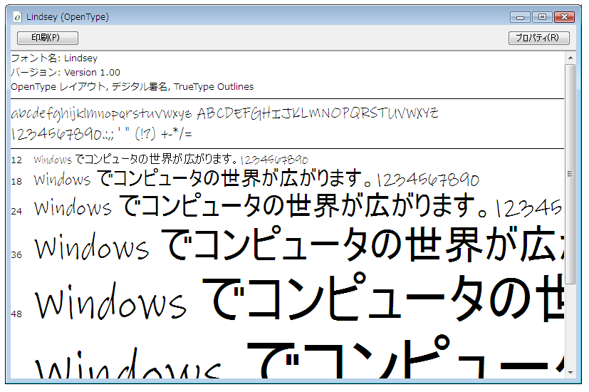

# OpenType フォント パックのサンプルSample OpenType Font Pack
このトピックでは、[!INCLUDE[TLA2#tla_wcsdk](../../../../includes/tla2sharptla-wcsdk-md.md)] で配布されている [!INCLUDE[TLA#tla_opentype](../../../../includes/tlasharptla-opentype-md.md)] フォントのサンプルの概要を説明します。This topic provides an overview of the sample [!INCLUDE[TLA#tla_opentype](../../../../includes/tlasharptla-opentype-md.md)] fonts that are distributed with the [!INCLUDE[TLA2#tla_wcsdk](../../../../includes/tla2sharptla-wcsdk-md.md)]. サンプル フォントは、[!INCLUDE[TLA#tla_winclient](../../../../includes/tlasharptla-winclient-md.md)] アプリケーションで使用可能な拡張 [!INCLUDE[TLA#tla_opentype](../../../../includes/tlasharptla-opentype-md.md)] 機能をサポートしています。The sample fonts support extended [!INCLUDE[TLA#tla_opentype](../../../../includes/tlasharptla-opentype-md.md)] features that can be used by [!INCLUDE[TLA#tla_winclient](../../../../includes/tlasharptla-winclient-md.md)] applications.  
  
  
   
## OpenType フォント パックのフォントFonts in the OpenType Font Pack  
 [!INCLUDE[TLA2#tla_wcsdk](../../../../includes/tla2sharptla-wcsdk-md.md)] には、[!INCLUDE[TLA#tla_winclient](../../../../includes/tlasharptla-winclient-md.md)] アプリケーションの作成に使用できる [!INCLUDE[TLA#tla_opentype](../../../../includes/tlasharptla-opentype-md.md)] フォント サンプルのセットが用意されています。The [!INCLUDE[TLA2#tla_wcsdk](../../../../includes/tla2sharptla-wcsdk-md.md)] provides a set of sample [!INCLUDE[TLA#tla_opentype](../../../../includes/tlasharptla-opentype-md.md)] fonts that you can use in creating [!INCLUDE[TLA#tla_winclient](../../../../includes/tlasharptla-winclient-md.md)] applications. サンプル フォントは、Ascender Corporation のライセンスを受けて提供されています。The sample fonts are supplied under license from Ascender Corporation. これらのフォントには、[!INCLUDE[TLA#tla_opentype](../../../../includes/tlasharptla-opentype-md.md)] フォーマットで定義されている機能全体のサブセットだけが実装されています。These fonts implement only a subset of the total features defined by the [!INCLUDE[TLA#tla_opentype](../../../../includes/tlasharptla-opentype-md.md)] format. サンプルの [!INCLUDE[TLA#tla_opentype](../../../../includes/tlasharptla-opentype-md.md)] フォント名の一覧を次の表に示します。The following table lists the names of the sample [!INCLUDE[TLA#tla_opentype](../../../../includes/tlasharptla-opentype-md.md)] fonts.  
  
|**Name****Name**|**ファイル****File**|  
|--------------|--------------|  
|KootenayKootenay|Kooten.ttfKooten.ttf|  
|LindseyLindsey|Linds.ttfLinds.ttf|  
|MiramonteMiramonte|Miramo.ttfMiramo.ttf|  
|Miramonte BoldMiramonte Bold|Miramob.ttfMiramob.ttf|  
|PericlesPericles|Peric.ttfPeric.ttf|  
|Pericles LightPericles Light|Pericl.ttfPericl.ttf|  
|PescaderoPescadero|Pesca.ttfPesca.ttf|  
|Pescadero BoldPescadero Bold|Pescab.ttfPescab.ttf|  
  
 次の図は [!INCLUDE[TLA#tla_opentype](../../../../includes/tlasharptla-opentype-md.md)] フォントのサンプルが、どのように表示されるかを示しています。The following illustration shows what the sample [!INCLUDE[TLA#tla_opentype](../../../../includes/tlasharptla-opentype-md.md)] fonts look like.  
  
   
OpenType フォント パックのフォントFonts in the OpenType Font Pack  
  
 サンプル フォントは、Ascender Corporation のライセンスを受けて提供されています。The sample fonts are supplied under license from Ascender Corporation. Ascender は、高度なフォント製品を提供する企業です。Ascender is a provider of advanced font products. サンプル フォントの拡張版またはカスタム版のライセンスを受けるには、[Ascender Corporation の Web サイト](http://go.microsoft.com/fwlink/?LinkId=182627)を参照してください。To license extended or custom versions of the sample fonts, see [Ascender Corporation's Web site](http://go.microsoft.com/fwlink/?LinkId=182627).  
  
> [!NOTE]
>  アプリケーションに埋め込む、または別の方法で再頒布するフォントについて、必要なライセンス権限を取得することは、開発者であるユーザーの責任で行ってください。As a developer it is your responsibility to ensure that you have the required license rights for any font you embed within an application or otherwise redistribute.  
  
   
## フォントのインストールInstalling the Fonts  
 サンプルの [!INCLUDE[TLA#tla_opentype](../../../../includes/tlasharptla-opentype-md.md)] フォントを、既定の [!INCLUDE[TLA#tla_mswin](../../../../includes/tlasharptla-mswin-md.md)] フォント ディレクトリである **\WINDOWS\Fonts** にインストールできます。You have the option of installing the sample [!INCLUDE[TLA#tla_opentype](../../../../includes/tlasharptla-opentype-md.md)] fonts to the default [!INCLUDE[TLA#tla_mswin](../../../../includes/tlasharptla-mswin-md.md)] Fonts directory, **\WINDOWS\Fonts**. フォントをインストールするには、コントロール パネルの [フォント] を使用します。Use the Fonts control panel to install the fonts. これらのフォントをコンピューターにインストールすると、既定の [!INCLUDE[TLA#tla_mswin](../../../../includes/tlasharptla-mswin-md.md)] フォントを参照するすべてのアプリケーションからアクセスできるようになります。Once these fonts are on your computer, they are accessible to all applications that reference default [!INCLUDE[TLA#tla_mswin](../../../../includes/tlasharptla-mswin-md.md)] fonts. フォント ファイルをダブルクリックして、各フォントの文字を異なるいくつかのフォント サイズで表示できます。You can display a representative set of characters in several font sizes by doubling-clicking the font file. 次のスクリーン ショットは、Lindsey フォント ファイル (Linds.ttf) を表示したものです。The following screenshot shows the Lindsey font file, Linds.ttf.  
  
 ![Lindsey フォント &#40;OpenType&#41;] (../../../../docs/framework/wpf/advanced/media/typographyinwpf-04.png "TypographyInWPF_04")  
Lindsey フォントの表示Displaying the Lindsey font  
  
   
## フォントの使用Using the Fonts  
 アプリケーションでフォントを使用するには、2 とおりの方法があります。There are two ways that you can use fonts in your application. アセンブリ内にリソースとして埋め込まれていないプロジェクト コンテンツ項目として、フォントをアプリケーションに追加できます。You can add fonts to your application as project content items that are not embedded as resources within an assembly. あるいは、アプリケーションのアセンブリ ファイル内に埋め込まれたプロジェクト リソース項目として、フォントをアプリケーションに追加できます。Alternatively, you can add fonts to your application as project resource items that are embedded within the application's assembly files. 詳細については、「[アプリケーションでのフォントのパッケージング](../../../../docs/framework/wpf/advanced/packaging-fonts-with-applications.md)」を参照してください。For more information, see [Packaging Fonts with Applications](../../../../docs/framework/wpf/advanced/packaging-fonts-with-applications.md).  
  
## 参照See Also  
 <xref:System.Windows.Documents.Typography>  
 [OpenType フォントの機能OpenType Font Features](../../../../docs/framework/wpf/advanced/opentype-font-features.md)  
 [アプリケーションでのフォントのパッケージングPackaging Fonts with Applications](../../../../docs/framework/wpf/advanced/packaging-fonts-with-applications.md)
