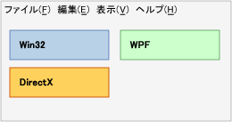
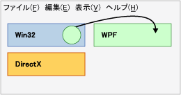
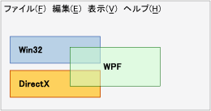
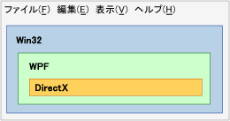
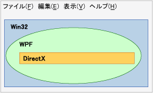

# 技術領域の概要
、WPF、Win32、または DirectX、などのアプリケーションで複数のプレゼンテーション テクノロジが使用されている場合、共通のトップレベル ウィンドウ内の表示領域を共有する必要があります。 このトピックでは、プレゼンテーション層と、WPF の相互運用アプリケーションへの入力は影響を与える問題について説明します。  
  
## 領域  
 最上位レベルのウィンドウ内には、次の相互運用アプリケーションのテクノロジのいずれかを構成する各 HWND 領域を持つ独自 (「空域」とも呼ばれます) を考えることができます。 ウィンドウ内の各ピクセルは、その HWND の領域を構成する 1 つだけの HWND に属しています。 (厳密には、複数の 1 つである[!INCLUDE[TLA2#tla_winclient](../../../../includes/tla2sharptla-winclient-md.md)]領域の 1 つ以上を使用する必要がある場合[!INCLUDE[TLA2#tla_winclient](../../../../includes/tla2sharptla-winclient-md.md)]HWND をこの説明の目的で、すれば、1 つだけですが)。 領域は、すべての層またはアプリケーションの有効期間中にそのピクセルの上をレンダリングしようとする他のウィンドウは、同じレンダリング レベル テクノロジの一部である必要がありますを意味します。 レンダリングしようとしています。[!INCLUDE[TLA2#tla_winclient](../../../../includes/tla2sharptla-winclient-md.md)]経由でピクセル[!INCLUDE[TLA2#tla_win32](../../../../includes/tla2sharptla-win32-md.md)]、望ましくない結果につながると相互運用を可能な限り許可されていない[!INCLUDE[TLA2#tla_api#plural](../../../../includes/tla2sharptla-apisharpplural-md.md)]です。  
  
### 領域の例  
 次の図に、アプリケーションが混在している[!INCLUDE[TLA2#tla_win32](../../../../includes/tla2sharptla-win32-md.md)]、 [!INCLUDE[TLA2#tla_dx](../../../../includes/tla2sharptla-dx-md.md)]、および[!INCLUDE[TLA2#tla_winclient](../../../../includes/tla2sharptla-winclient-md.md)]です。 各テクノロジ (ピクセル単位) の独自、重複しない別々 のセットを使用して、領域の問題はありません。  
  
   
  
 このアプリケーションがこれら 3 つの領域の上にレンダリングしようとするアニメーションを作成する、マウス ポインターの位置を使用するとします。 テクノロジは、アニメーション自体の原因に関係なくそのテクノロジが、その他の 2 つの領域に違反します。 次の図は、Win32 領域 WPF 円を表示するためにしようとします。  
  
   
  
 別の違反は、透過性/アルファ ブレンドさまざまなテクノロジを使用しようとするかどうかです。  次の図に、 [!INCLUDE[TLA2#tla_winclient](../../../../includes/tla2sharptla-winclient-md.md)]  ボックスに違反しています、[!INCLUDE[TLA2#tla_win32](../../../../includes/tla2sharptla-win32-md.md)]と[!INCLUDE[TLA2#tla_dx](../../../../includes/tla2sharptla-dx-md.md)]領域。 にピクセル[!INCLUDE[TLA2#tla_winclient](../../../../includes/tla2sharptla-winclient-md.md)]半透明ボックスが所有する共同で両方[!INCLUDE[TLA2#tla_dx](../../../../includes/tla2sharptla-dx-md.md)]と[!INCLUDE[TLA2#tla_winclient](../../../../includes/tla2sharptla-winclient-md.md)]、それが不可能です。  このため、別の違反は、これをビルドできません。  
  
   
  
 前の 3 つの例に使用される四角形の領域が、別の図形が可能です。  たとえば、地域、穴ことができます。 次の図は、[!INCLUDE[TLA2#tla_win32](../../../../includes/tla2sharptla-win32-md.md)]領域のサイズは、この四角形の穴を[!INCLUDE[TLA2#tla_winclient](../../../../includes/tla2sharptla-winclient-md.md)]と[!INCLUDE[TLA2#tla_dx](../../../../includes/tla2sharptla-dx-md.md)]の地域の結合します。  
  
   
  
 領域を完全に四角形以外にすることはできますがない図形や、 [!INCLUDE[TLA2#tla_win32](../../../../includes/tla2sharptla-win32-md.md)] HRGN (リージョン)。  
  
   
  
## 透過性と最上位のウィンドウ  
 Windows のウィンドウ マネージャーが本当にのみ処理[!INCLUDE[TLA2#tla_win32](../../../../includes/tla2sharptla-win32-md.md)]Hwnd です。 そのため、すべて[!INCLUDE[TLA2#tla_winclient](../../../../includes/tla2sharptla-winclient-md.md)] <xref:System.Windows.Window> HWND がします。 <xref:System.Windows.Window> HWND は、HWND の一般的な規則で従う必要があります。 その HWND 内[!INCLUDE[TLA2#tla_winclient](../../../../includes/tla2sharptla-winclient-md.md)]コード実行できるあらゆる全体的な[!INCLUDE[TLA2#tla_winclient](../../../../includes/tla2sharptla-winclient-md.md)][!INCLUDE[TLA2#tla_api#plural](../../../../includes/tla2sharptla-apisharpplural-md.md)]をサポートします。 デスクトップで、その他の Hwnd とのやり取りの[!INCLUDE[TLA2#tla_winclient](../../../../includes/tla2sharptla-winclient-md.md)]に従う必要があります[!INCLUDE[TLA2#tla_win32](../../../../includes/tla2sharptla-win32-md.md)]処理とルールを表示します。  [!INCLUDE[TLA2#tla_winclient](../../../../includes/tla2sharptla-winclient-md.md)] 使用して、四角形以外の windows をサポートしている[!INCLUDE[TLA2#tla_win32](../../../../includes/tla2sharptla-win32-md.md)] [!INCLUDE[TLA2#tla_api#plural](../../../../includes/tla2sharptla-apisharpplural-md.md)]— HRGNs 四角形以外の windows、およびピクセルごとの alpha 用レイヤード ウィンドウです。  
  
 定数のアルファおよびカラー キーがサポートされていません。  [!INCLUDE[TLA2#tla_win32](../../../../includes/tla2sharptla-win32-md.md)] レイヤード ウィンドウの機能は、プラットフォームによって異なります。  
  
 レイヤード ウィンドウを行えるウィンドウ全体半透明 (半透明) ウィンドウ内のすべてのピクセルに適用するアルファ値を指定しています。  ([!INCLUDE[TLA2#tla_win32](../../../../includes/tla2sharptla-win32-md.md)]実際サポート ピクセルごとのアルファがこのモードですべての子を描画する必要があるために、実用的なプログラムで使用する非常に困難 HWND 自分で、ダイアログ ボックスおよびドロップダウン リストを含む)。  
  
 [!INCLUDE[TLA2#tla_winclient](../../../../includes/tla2sharptla-winclient-md.md)] HRGNs; をサポートしていますただし、マネージいいえ[!INCLUDE[TLA2#tla_api#plural](../../../../includes/tla2sharptla-apisharpplural-md.md)]この機能のためです。 プラットフォームを使用する呼び出しと<xref:System.Windows.Interop.HwndSource>を呼び出して、関連する[!INCLUDE[TLA2#tla_win32](../../../../includes/tla2sharptla-win32-md.md)][!INCLUDE[TLA2#tla_api#plural](../../../../includes/tla2sharptla-apisharpplural-md.md)]です。 詳細については、次を参照してください。[マネージ コードからネイティブ関数を呼び出して](/cpp/dotnet/calling-native-functions-from-managed-code)です。  
  
 [!INCLUDE[TLA2#tla_winclient](../../../../includes/tla2sharptla-winclient-md.md)] レイヤード ウィンドウでは、さまざまなオペレーティング システムで異なる機能があります。 これは、ため[!INCLUDE[TLA2#tla_winclient](../../../../includes/tla2sharptla-winclient-md.md)]を使用して[!INCLUDE[TLA2#tla_dx](../../../../includes/tla2sharptla-dx-md.md)]、表示するレイヤード ウィンドウが、主に用に設計された、[!INCLUDE[TLA2#tla_gdi](../../../../includes/tla2sharptla-gdi-md.md)]レンダリングできません[!INCLUDE[TLA2#tla_dx](../../../../includes/tla2sharptla-dx-md.md)]レンダリングします。  
  
-   [!INCLUDE[TLA2#tla_winclient](../../../../includes/tla2sharptla-winclient-md.md)] サポートするハードウェア アクセラレータ レイヤー上の windows[!INCLUDE[TLA#tla_longhorn](../../../../includes/tlasharptla-longhorn-md.md)]およびそれ以降。 ハードウェア アクセラレータ レイヤー上の windows[!INCLUDE[TLA2#tla_winxp](../../../../includes/tla2sharptla-winxp-md.md)]からのサポートを必要と[!INCLUDE[TLA#tla_dx](../../../../includes/tlasharptla-dx-md.md)]機能のバージョンによって異なりますので、[!INCLUDE[TLA#tla_dx](../../../../includes/tlasharptla-dx-md.md)]そのコンピューターにします。  
  
-   [!INCLUDE[TLA2#tla_winclient](../../../../includes/tla2sharptla-winclient-md.md)] 透明色キーはサポートしません[!INCLUDE[TLA2#tla_winclient](../../../../includes/tla2sharptla-winclient-md.md)]ハードウェア アクセラレータによるレンダリングは、特に場合、要求された正確な色を表示するためには保証できません。  
  
-   アプリケーションが実行されている場合[!INCLUDE[TLA2#tla_winxp](../../../../includes/tla2sharptla-winxp-md.md)]、レイヤード ウィンドウの上に[!INCLUDE[TLA2#tla_dx](../../../../includes/tla2sharptla-dx-md.md)]画面がちらつく場合に、[!INCLUDE[TLA2#tla_dx](../../../../includes/tla2sharptla-dx-md.md)]アプリケーションが表示されます。  (実際のレンダリング シーケンスは[!INCLUDE[TLA#tla_gdi](../../../../includes/tlasharptla-gdi-md.md)]し、階層化 ウィンドウを非表示に[!INCLUDE[TLA2#tla_dx](../../../../includes/tla2sharptla-dx-md.md)]を描画すると、し[!INCLUDE[TLA#tla_gdi](../../../../includes/tlasharptla-gdi-md.md)]レイヤード ウィンドウを戻します)。  非[!INCLUDE[TLA2#tla_winclient](../../../../includes/tla2sharptla-winclient-md.md)]レイヤード ウィンドウにもこの制限があります。  
  
## 関連項目  
 [WPF と Win32 の相互運用性](../../../../docs/framework/wpf/advanced/wpf-and-win32-interoperation.md)  
 [チュートリアル: Win32 での WPF クロックのホスト](../../../../docs/framework/wpf/advanced/walkthrough-hosting-a-wpf-clock-in-win32.md)  
 [WPF での Win32 コンテンツのホスト](../../../../docs/framework/wpf/advanced/hosting-win32-content-in-wpf.md)
