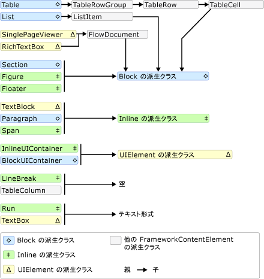
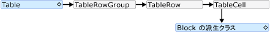
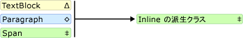

# TextElement コンテンツ モデルの概要TextElement Content Model Overview
このコンテンツ モデルの概要で説明するサポートされているコンテンツを<xref:System.Windows.Documents.TextElement>です。This content model overview describes the supported content for a <xref:System.Windows.Documents.TextElement>. <xref:System.Windows.Documents.Paragraph>クラスは、型の<xref:System.Windows.Documents.TextElement>します。The <xref:System.Windows.Documents.Paragraph> class is a type of <xref:System.Windows.Documents.TextElement>. コンテンツ モデルは、他のオブジェクトや要素に含めることのできるオブジェクトや要素を記述します。A content model describes what objects/elements can be contained in others. この概要から派生したオブジェクトに使用されるコンテンツ モデルの概要を示します<xref:System.Windows.Documents.TextElement>です。This overview summarizes the content model used for objects derived from <xref:System.Windows.Documents.TextElement>. 詳細については、次を参照してください。[フロー ドキュメントの概要](../../../../docs/framework/wpf/advanced/flow-document-overview.md)です。For more information, see [Flow Document Overview](../../../../docs/framework/wpf/advanced/flow-document-overview.md).  
  
  
   
## コンテンツ モデルの図Content Model Diagram  
 派生したクラスの次の図に、コンテンツ モデルをまとめたもの<xref:System.Windows.Documents.TextElement>だけでなく他の方法ではない`TextElement`クラスのこのモデルに適合します。The following diagram summarizes the content model for classes derived from <xref:System.Windows.Documents.TextElement> as well as how other non- `TextElement` classes fit into this model.  
  
 ![図: フロー コンテンツ コンテインメント スキーマ] (../../../../docs/framework/wpf/advanced/media/flow-content-schema.png "Flow_Content_Schema")  
  
 前の図からわかるように、許容される要素の子は必ずしもによって決定されませんからクラスを派生するかどうか、<xref:System.Windows.Documents.Block>クラスまたは<xref:System.Windows.Documents.Inline>クラスです。As can be seen from the preceding diagram, the children allowed for an element are not necessarily determined by whether a class is derived from the <xref:System.Windows.Documents.Block> class or an <xref:System.Windows.Documents.Inline> class. たとえば、 <xref:System.Windows.Documents.Span> (、 <xref:System.Windows.Documents.Inline>-派生クラス) しか持てない<xref:System.Windows.Documents.Inline>子要素が、 <xref:System.Windows.Documents.Figure> (も、 <xref:System.Windows.Documents.Inline>-派生クラス) しか持てない<xref:System.Windows.Documents.Block>子要素です。For example, a <xref:System.Windows.Documents.Span> (an <xref:System.Windows.Documents.Inline>-derived class) can only have <xref:System.Windows.Documents.Inline> child elements, but a <xref:System.Windows.Documents.Figure> (also an <xref:System.Windows.Documents.Inline>-derived class) can only have <xref:System.Windows.Documents.Block> child elements. そのため、どの要素を別の要素に含めることができるかをすばやく判断するには、図が役立ちます。Therefore, a diagram is useful for quickly determining what element can be contained in another. たとえば、みましょう図を使用して、フロー コンテンツを構築する方法を決定する<xref:System.Windows.Controls.RichTextBox>です。As an example, let's use the diagram to determine how to construct the flow content of a <xref:System.Windows.Controls.RichTextBox>.  
  
1.  A<xref:System.Windows.Controls.RichTextBox>含める必要があります、<xref:System.Windows.Documents.FlowDocument>をさらに含んでいる必要があります、 <xref:System.Windows.Documents.Block>-派生オブジェクト。A <xref:System.Windows.Controls.RichTextBox> must contain a <xref:System.Windows.Documents.FlowDocument> which in turn must contain a <xref:System.Windows.Documents.Block>-derived object. 上の図に対応するセグメントを次に示します。The following is the corresponding segment from the preceding diagram.  
  
     ![図: RichTextBox コンテインメント規則] (../../../../docs/framework/wpf/advanced/media/flow-ovw-schemawalkthrough1.png "Flow_Ovw_SchemaWalkThrough1")  
  
     この段階では、マークアップは次のようになります。Thus far, this is what the markup might look like.  
  
     [!code-xaml[FlowOvwSnippets_snip#SchemaWalkThrough1](../../../../samples/snippets/csharp/VS_Snippets_Wpf/FlowOvwSnippets_snip/CS/MiscSnippets.xaml#schemawalkthrough1)]  
  
2.  に従って、ダイアグラムは、いくつか<xref:System.Windows.Documents.Block>などから選択する要素<xref:System.Windows.Documents.Paragraph>、 <xref:System.Windows.Documents.Section>、 <xref:System.Windows.Documents.Table>、 <xref:System.Windows.Documents.List>、および<xref:System.Windows.Documents.BlockUIContainer>(図でのブロックから派生したクラスを参照してください)。According to the diagram, there are several <xref:System.Windows.Documents.Block> elements to choose from including <xref:System.Windows.Documents.Paragraph>, <xref:System.Windows.Documents.Section>, <xref:System.Windows.Documents.Table>, <xref:System.Windows.Documents.List>, and <xref:System.Windows.Documents.BlockUIContainer> (see Block-derived classes in the preceding diagram). たいと、<xref:System.Windows.Documents.Table>です。Let's say we want a <xref:System.Windows.Documents.Table>. 前の図では、に従って、<xref:System.Windows.Documents.Table>が含まれています、<xref:System.Windows.Documents.TableRowGroup>を含む<xref:System.Windows.Documents.TableRow>要素で、含める<xref:System.Windows.Documents.TableCell>要素が含まれている、 <xref:System.Windows.Documents.Block>-派生オブジェクト。According to the preceding diagram, a <xref:System.Windows.Documents.Table> contains a <xref:System.Windows.Documents.TableRowGroup> containing <xref:System.Windows.Documents.TableRow> elements, which contain <xref:System.Windows.Documents.TableCell> elements which contain a <xref:System.Windows.Documents.Block>-derived object. 次に、対応するセグメントの<xref:System.Windows.Documents.Table>上の図から取得します。The following is the corresponding segment for <xref:System.Windows.Documents.Table> taken from the preceding diagram.  
  
     ![図: Table の親/子スキーマ] (../../../../docs/framework/wpf/advanced/media/flow-ovw-schemawalkthrough2.png "Flow_Ovw_SchemaWalkThrough2")  
  
     対応するマークアップは次のとおりです。The following is the corresponding markup.  
  
     [!code-xaml[FlowOvwSnippets_snip#SchemaWalkThrough2](../../../../samples/snippets/csharp/VS_Snippets_Wpf/FlowOvwSnippets_snip/CS/MiscSnippets.xaml#schemawalkthrough2)]  
  
3.  ここでも、1 つまたは複数<xref:System.Windows.Documents.Block>下にある要素が必要になる、<xref:System.Windows.Documents.TableCell>です。Again, one or more <xref:System.Windows.Documents.Block> elements are required underneath a <xref:System.Windows.Documents.TableCell>. 簡単にするために、セル内にいくつかのテキストを配置することにします。To make it simple, let's place some text inside the cell. これにを使用して、<xref:System.Windows.Documents.Paragraph>で、<xref:System.Windows.Documents.Run>要素。We can do this using a <xref:System.Windows.Documents.Paragraph> with a <xref:System.Windows.Documents.Run> element. 対応することを示すダイアグラムからセグメントを次に示します、<xref:System.Windows.Documents.Paragraph>かかることができます、<xref:System.Windows.Documents.Inline>要素とする、 <xref:System.Windows.Documents.Run> (、<xref:System.Windows.Documents.Inline>要素) プレーン テキストのみを取得できます。The following is the corresponding segments from the diagram showing that a <xref:System.Windows.Documents.Paragraph> can take an <xref:System.Windows.Documents.Inline> element and that a <xref:System.Windows.Documents.Run> (an <xref:System.Windows.Documents.Inline> element) can only take plain text.  
  
     ![図: Paragraph の親/子スキーマ] (../../../../docs/framework/wpf/advanced/media/flow-ovw-schemawalkthrough3.png "Flow_Ovw_SchemaWalkThrough3")  
  
     ![図: Run の親/子スキーマ] (../../../../docs/framework/wpf/advanced/media/flow-ovw-schemawalkthrough4.png "Flow_Ovw_SchemaWalkThrough4")  
  
 例全体をマークアップで次に示します。The following is the entire example in markup.  
  
 [!code-xaml[FlowOvwSnippets_snip#SchemaExampleWholePage](../../../../samples/snippets/csharp/VS_Snippets_Wpf/FlowOvwSnippets_snip/CS/SchemaExample.xaml#schemaexamplewholepage)]  
  
   
## TextElement のコンテンツをプログラムで操作するWorking with TextElement Content Programmatically  
 内容、<xref:System.Windows.Documents.TextElement>コレクションの内容をプログラムで操作するため、作成されて<xref:System.Windows.Documents.TextElement>オブジェクトは、これらのコレクションで作業して行われます。The contents of a <xref:System.Windows.Documents.TextElement> is made up by collections and so programmatically manipulating the contents of <xref:System.Windows.Documents.TextElement> objects is done by working with these collections. 使用される 3 つの異なるコレクションがある<xref:System.Windows.Documents.TextElement>-派生クラス。There are three different collections used by <xref:System.Windows.Documents.TextElement> -derived classes:  
  
-   <xref:System.Windows.Documents.InlineCollection>: のコレクションを表します<xref:System.Windows.Documents.Inline>要素。<xref:System.Windows.Documents.InlineCollection>: Represents a collection of <xref:System.Windows.Documents.Inline> elements. <xref:System.Windows.Documents.InlineCollection> 許容される子コンテンツを定義、 <xref:System.Windows.Documents.Paragraph>、 <xref:System.Windows.Documents.Span>、および<xref:System.Windows.Controls.TextBlock>要素。<xref:System.Windows.Documents.InlineCollection> defines the allowable child content of the <xref:System.Windows.Documents.Paragraph>, <xref:System.Windows.Documents.Span>, and <xref:System.Windows.Controls.TextBlock> elements.  
  
-   <xref:System.Windows.Documents.BlockCollection>: のコレクションを表します<xref:System.Windows.Documents.Block>要素。<xref:System.Windows.Documents.BlockCollection>: Represents a collection of <xref:System.Windows.Documents.Block> elements. <xref:System.Windows.Documents.BlockCollection> は <xref:System.Windows.Documents.FlowDocument>、<xref:System.Windows.Documents.Section>、<xref:System.Windows.Documents.ListItem>、<xref:System.Windows.Documents.TableCell>、<xref:System.Windows.Documents.Floater>、<xref:System.Windows.Documents.Figure> 要素で許容される子コンテンツを定義します。<xref:System.Windows.Documents.BlockCollection> defines the allowable child content of the <xref:System.Windows.Documents.FlowDocument>, <xref:System.Windows.Documents.Section>, <xref:System.Windows.Documents.ListItem>, <xref:System.Windows.Documents.TableCell>, <xref:System.Windows.Documents.Floater>, and <xref:System.Windows.Documents.Figure> elements.  
  
-   <xref:System.Windows.Documents.ListItemCollection>: フロー コンテンツ要素を表す、順序付けられたで特定のコンテンツ項目または順序付けられていない<xref:System.Windows.Documents.List>です。<xref:System.Windows.Documents.ListItemCollection>: A flow content element that represents a particular content item in an ordered or unordered <xref:System.Windows.Documents.List>.  
  
 操作することができます (追加または項目を削除する) のそれぞれのプロパティを使用してこれらのコレクションから**インライン**、**ブロック**、および**Listitem**です。You can manipulate (add or remove items) from these collections using the respective properties of **Inlines**, **Blocks**, and **ListItems**. 次の例の Span を使用して、内容を操作する方法を示して、**インライン**プロパティです。The following examples show how to manipulate the contents of a Span using the **Inlines** property.  
  
> [!NOTE]
>  Table では、コンテンツの操作にいくつかのコレクションが使用されますが、これらのコレクションについてはここでは取り上げません。Table uses several collections to manipulate its contents, but they are not covered here. 詳細については、次を参照してください。[テーブルの概要](../../../../docs/framework/wpf/advanced/table-overview.md)です。For more information, see [Table Overview](../../../../docs/framework/wpf/advanced/table-overview.md).  
  
 次の例は、新しい作成<xref:System.Windows.Documents.Span>オブジェクト、および、使用、`Add`のコンテンツの子として 2 つのテキストを追加するメソッドの実行、<xref:System.Windows.Documents.Span>です。The following example creates a new <xref:System.Windows.Documents.Span> object, and then uses the `Add` method to add two text runs as content children of the <xref:System.Windows.Documents.Span>.  
  
 [!code-csharp[SpanSnippets#_SpanInlinesAdd](../../../../samples/snippets/csharp/VS_Snippets_Wpf/SpanSnippets/CSharp/Window1.xaml.cs#_spaninlinesadd)]
 [!code-vb[SpanSnippets#_SpanInlinesAdd](../../../../samples/snippets/visualbasic/VS_Snippets_Wpf/SpanSnippets/visualbasic/window1.xaml.vb#_spaninlinesadd)]  
  
 次の例は、新しい作成<xref:System.Windows.Documents.Run>要素の先頭に挿入し、<xref:System.Windows.Documents.Span>です。The following example creates a new <xref:System.Windows.Documents.Run> element and inserts it at the beginning of the <xref:System.Windows.Documents.Span>.  
  
 [!code-csharp[SpanSnippets#_SpanInlinesInsert](../../../../samples/snippets/csharp/VS_Snippets_Wpf/SpanSnippets/CSharp/Window1.xaml.cs#_spaninlinesinsert)]
 [!code-vb[SpanSnippets#_SpanInlinesInsert](../../../../samples/snippets/visualbasic/VS_Snippets_Wpf/SpanSnippets/visualbasic/window1.xaml.vb#_spaninlinesinsert)]  
  
 次の例の最後の削除<xref:System.Windows.Documents.Inline>内の要素、<xref:System.Windows.Documents.Span>です。The following example deletes the last <xref:System.Windows.Documents.Inline> element in the <xref:System.Windows.Documents.Span>.  
  
 [!code-csharp[SpanSnippets#_SpanInlinesRemoveLast](../../../../samples/snippets/csharp/VS_Snippets_Wpf/SpanSnippets/CSharp/Window1.xaml.cs#_spaninlinesremovelast)]
 [!code-vb[SpanSnippets#_SpanInlinesRemoveLast](../../../../samples/snippets/visualbasic/VS_Snippets_Wpf/SpanSnippets/visualbasic/window1.xaml.vb#_spaninlinesremovelast)]  
  
 次の例では、すべての内容を消去 (<xref:System.Windows.Documents.Inline>要素) から、<xref:System.Windows.Documents.Span>です。The following example clears all of the contents (<xref:System.Windows.Documents.Inline> elements) from the <xref:System.Windows.Documents.Span>.  
  
 [!code-csharp[SpanSnippets#_SpanInlinesClear](../../../../samples/snippets/csharp/VS_Snippets_Wpf/SpanSnippets/CSharp/Window1.xaml.cs#_spaninlinesclear)]
 [!code-vb[SpanSnippets#_SpanInlinesClear](../../../../samples/snippets/visualbasic/VS_Snippets_Wpf/SpanSnippets/visualbasic/window1.xaml.vb#_spaninlinesclear)]  
  
   
## このコンテンツ モデルを共有する種類Types That Share This Content Model  
 次の型から継承、<xref:System.Windows.Documents.TextElement>クラスし、この概要で説明されているコンテンツを表示するために使用する可能性があります。The following types inherit from the <xref:System.Windows.Documents.TextElement> class and may be used to display the content described in this overview.  
  
 <xref:System.Windows.Documents.Bold>, <xref:System.Windows.Documents.Figure>, <xref:System.Windows.Documents.Floater>, <xref:System.Windows.Documents.Hyperlink>, <xref:System.Windows.Documents.InlineUIContainer>, <xref:System.Windows.Documents.Italic>, <xref:System.Windows.Documents.LineBreak>, <xref:System.Windows.Documents.List>, <xref:System.Windows.Documents.ListItem>, <xref:System.Windows.Documents.Paragraph>, <xref:System.Windows.Documents.Run>, <xref:System.Windows.Documents.Section>, <xref:System.Windows.Documents.Span>, <xref:System.Windows.Documents.Table>, <xref:System.Windows.Documents.Underline>.<xref:System.Windows.Documents.Bold>, <xref:System.Windows.Documents.Figure>, <xref:System.Windows.Documents.Floater>, <xref:System.Windows.Documents.Hyperlink>, <xref:System.Windows.Documents.InlineUIContainer>, <xref:System.Windows.Documents.Italic>, <xref:System.Windows.Documents.LineBreak>, <xref:System.Windows.Documents.List>, <xref:System.Windows.Documents.ListItem>, <xref:System.Windows.Documents.Paragraph>, <xref:System.Windows.Documents.Run>, <xref:System.Windows.Documents.Section>, <xref:System.Windows.Documents.Span>, <xref:System.Windows.Documents.Table>, <xref:System.Windows.Documents.Underline>.  
  
 この一覧にと共に配布非抽象型のみが含まれることに注意してください、[!INCLUDE[TLA2#tla_winfxsdk](../../../../includes/tla2sharptla-winfxsdk-md.md)]です。Note that this list only includes nonabstract types distributed with the [!INCLUDE[TLA2#tla_winfxsdk](../../../../includes/tla2sharptla-winfxsdk-md.md)]. 継承する他の種類を使用することがあります<xref:System.Windows.Documents.TextElement>です。You may use other types that inherit from <xref:System.Windows.Documents.TextElement>.  
  
   
## TextElement オブジェクトを含むことのできる型Types That Can Contain TextElement Objects  
 参照してください[WPF コンテンツ モデル](../../../../docs/framework/wpf/controls/wpf-content-model.md)です。See [WPF Content Model](../../../../docs/framework/wpf/controls/wpf-content-model.md).  
  
## 関連項目See Also  
 [Blocks プロパティを介して FlowDocument を操作するManipulate a FlowDocument through the Blocks Property](../../../../docs/framework/wpf/advanced/how-to-manipulate-a-flowdocument-through-the-blocks-property.md)  
 [Blocks プロパティを介してフロー コンテンツ要素を操作するManipulate Flow Content Elements through the Blocks Property](../../../../docs/framework/wpf/advanced/how-to-manipulate-flow-content-elements-through-the-blocks-property.md)  
 [Blocks プロパティを介して FlowDocument を操作するManipulate a FlowDocument through the Blocks Property](../../../../docs/framework/wpf/advanced/how-to-manipulate-a-flowdocument-through-the-blocks-property.md)  
 [Columns プロパティによってテーブルの列を操作するManipulate a Table's Columns through the Columns Property](../../../../docs/framework/wpf/advanced/how-to-manipulate-table-columns-through-the-columns-property.md)  
 [RowGroups プロパティを介してテーブルの行グループを操作するManipulate a Table's Row Groups through the RowGroups Property](../../../../docs/framework/wpf/advanced/how-to-manipulate-table-row-groups-through-the-rowgroups-property.md)
