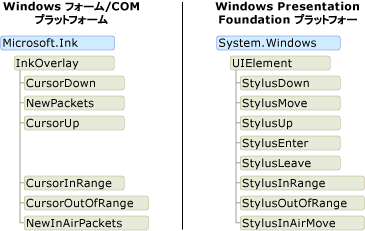
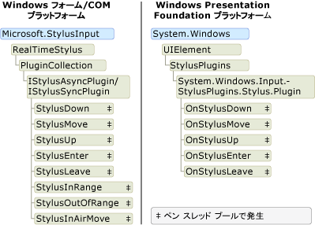

# インク オブジェクト モデル : Windows フォームおよび COM と WPF の比較
基本的に、デジタル インクをサポートするプラットフォームは、Tablet PC Windows フォーム プラットフォーム、Tablet PC COM プラットフォーム、および [!INCLUDE[TLA#tla_wpf](../../../../includes/tlasharptla-wpf-md.md)] プラットフォームの 3 つです。  Windows フォームと COM プラットフォームは同じようなオブジェクト モデルを共有しますが、[!INCLUDE[TLA2#tla_wpf](../../../../includes/tla2sharptla-wpf-md.md)] プラットフォームのオブジェクト モデルは大きく異なります。  ここでは、一方のオブジェクト モデルを操作したことがある開発者が他方のオブジェクト モデルをよりよく理解できるように、その違いについて大まかに説明します。  
  
## アプリケーションでのインクの有効化  
 3 つのすべてのプラットフォームには、アプリケーションがタブレット ペンから入力を受け取ることができるようにするオブジェクトおよびコントロールが付属しています。  Windows フォームおよび COM プラットフォームには、<xref:Microsoft.Ink.InkPicture>、<xref:Microsoft.Ink.InkEdit>、<xref:Microsoft.Ink.InkOverlay>、および <xref:Microsoft.Ink.InkCollector> クラスが付属しています。  <xref:Microsoft.Ink.InkPicture> および <xref:Microsoft.Ink.InkEdit> は、インクを収集するためにアプリケーションに追加できるコントロールです。  <xref:Microsoft.Ink.InkOverlay> および <xref:Microsoft.Ink.InkCollector> は、ウィンドウおよびカスタム コントロールをインク対応にするために既存のウィンドウに結合できます。  
  
 WPF プラットフォームには、<xref:System.Windows.Controls.InkCanvas> コントロールが含まれています。  <xref:System.Windows.Controls.InkCanvas> をアプリケーションに追加して、インクの収集を直ちに開始することができます。  <xref:System.Windows.Controls.InkCanvas> を使用すると、ユーザーはインクのコピー、選択、およびサイズ変更を実行できます。  他のコントロールを <xref:System.Windows.Controls.InkCanvas> に追加すると、ユーザーはそれらのコントロールに対して手書きを行うことができます。  <xref:System.Windows.Controls.InkPresenter> を追加してスタイラス ポイントを収集することで、インク対応カスタム コントロールを作成できます。  
  
 アプリケーションでのインクの有効化に関する詳細の参照先を次の表に示します。  
  
|目的|WPF プラットフォームの場合|Windows フォームおよび COM プラットフォームの場合|  
|--------|---------------------|-------------------------------------|  
|アプリケーションへのインク対応コントロールの追加|「[インクの概要](../../../../docs/framework/wpf/advanced/getting-started-with-ink.md)」を参照してください。|「[Auto Claims Form Sample](http://msdn.microsoft.com/ja-jp/bec4333a-62ca-4254-a39b-04bc2c556992)」を参照してください。|  
|カスタム コントロールでのインクの有効化|「[インク入力コントロールの作成](../../../../docs/framework/wpf/advanced/creating-an-ink-input-control.md)」を参照してください。|「[Ink Clipboard Sample](http://msdn.microsoft.com/ja-jp/a0c42f1c-543d-44f8-83d9-fe810de410ff)」を参照してください。|  
  
## インク データ  
 Windows フォームおよび COM プラットフォームでは、<xref:Microsoft.Ink.InkCollector>、<xref:Microsoft.Ink.InkOverlay>、<xref:Microsoft.Ink.InkEdit>、および <xref:Microsoft.Ink.InkPicture> がそれぞれ <xref:Microsoft.Ink.Ink?displayProperty=fullName> オブジェクトを公開します。  <xref:Microsoft.Ink.Ink> オブジェクトは 1 つ以上の <xref:Microsoft.Ink.Stroke?displayProperty=fullName> オブジェクトのデータを格納し、これらのストロークを管理および操作するための共通のメソッドとプロパティを公開します。  <xref:Microsoft.Ink.Ink> オブジェクトは、そのオブジェクト内のストロークの有効期間を管理し、所有するストロークを作成および削除します。  各 <xref:Microsoft.Ink.Stroke> には、その親 <xref:Microsoft.Ink.Ink> オブジェクト内で一意の識別子があります。  
  
 WPF プラットフォームでは、<xref:System.Windows.Ink.Stroke?displayProperty=fullName> クラスがその有効期間を所有および管理します。  <xref:System.Windows.Ink.Stroke> オブジェクトのグループを <xref:System.Windows.Ink.StrokeCollection> 内に収集できます。このコレクションは、インクのヒット テスト、消去、変換、シリアル化などの一般的なインク データ管理操作のためのメソッドを提供します。  <xref:System.Windows.Ink.Stroke> は、どの時点でも 0 個以上の <xref:System.Windows.Ink.StrokeCollection> オブジェクトに属することができます。  <xref:System.Windows.Controls.InkCanvas> および <xref:System.Windows.Controls.InkPresenter> には、<xref:Microsoft.Ink.Ink?displayProperty=fullName> オブジェクトではなく <xref:System.Windows.Ink.StrokeCollection?displayProperty=fullName> が含まれます。  
  
 次の 1 組の図で、インク データのオブジェクト モデルを比較します。  Windows フォームおよび COM プラットフォームでは、<xref:Microsoft.Ink.Ink?displayProperty=fullName> オブジェクトが <xref:Microsoft.Ink.Stroke?displayProperty=fullName> オブジェクトの有効期間を制限し、スタイラス パケットが個別のストロークに属しています。  次の図に示すように、複数のストロークが 1 つの <xref:Microsoft.Ink.DrawingAttributes?displayProperty=fullName> オブジェクトを参照することができます。  
  
   
  
 [!INCLUDE[TLA2#tla_winclient](../../../../includes/tla2sharptla-winclient-md.md)] では、各 <xref:System.Windows.Ink.Stroke?displayProperty=fullName> は、参照される限り存在する共通言語ランタイム オブジェクトです。  各 <xref:System.Windows.Ink.Stroke> は <xref:System.Windows.Input.StylusPointCollection> および <xref:System.Windows.Ink.DrawingAttributes?displayProperty=fullName> オブジェクトを参照します。これらのオブジェクトも共通言語ランタイム オブジェクトです。  
  
   
  
 次の表では、[!INCLUDE[TLA2#tla_wpf](../../../../includes/tla2sharptla-wpf-md.md)] プラットフォームと Windows フォームおよび COM プラットフォームで、いくつかの共通のタスクを実行する方法を比較します。  
  
|タスク|Windows Presentation Foundation|Windows フォームおよび COM|  
|---------|-------------------------------------|-------------------------|  
|インクの保存|<xref:System.Windows.Ink.StrokeCollection.Save%2A>|<xref:Microsoft.Ink.Ink.Save%2A>|  
|インクの読み込み|<xref:System.Windows.Ink.StrokeCollection.%23ctor%28System.IO.Stream%29?displayProperty=fullName> コンストラクターで <xref:System.Windows.Ink.StrokeCollection> を作成します。|[M:Microsoft.Ink.Ink.Load\(System.Byte\<xref:Microsoft.Ink.Ink.Load%2A>|  
|ヒット テスト|<xref:System.Windows.Ink.StrokeCollection.HitTest%2A>|<xref:Microsoft.Ink.Ink.HitTest%2A>|  
|インクのコピー|<xref:System.Windows.Controls.InkCanvas.CopySelection%2A>|<xref:Microsoft.Ink.Ink.ClipboardCopy%2A>|  
|インクの貼り付け|<xref:System.Windows.Controls.InkCanvas.Paste%2A>|<xref:Microsoft.Ink.Ink.ClipboardPaste%2A>|  
|ストロークのコレクションのカスタム プロパティへのアクセス|<xref:System.Windows.Ink.StrokeCollection.AddPropertyData%2A> \(プロパティは内部的に格納され、<xref:System.Windows.Ink.StrokeCollection.AddPropertyData%2A>、<xref:System.Windows.Ink.StrokeCollection.RemovePropertyData%2A>、および <xref:System.Windows.Ink.StrokeCollection.ContainsPropertyData%2A> をとおしてアクセスされます。\)|<xref:Microsoft.Ink.Ink.ExtendedProperties%2A> を使用します。|  
  
### プラットフォーム間でのインクの共有  
 各プラットフォームでインク データのオブジェクト モデルは異なりますが、プラットフォーム間でのデータの共有は非常に簡単です。  Windows フォーム アプリケーションのインクを保存して Windows Presentation Foundation アプリケーションに読み込む方法を次の例に示します。  
  
 [!code-csharp[WinFormWPFInk#UsingWinforms](../../../../samples/snippets/csharp/VS_Snippets_Wpf/WinformWPFInk/CSharp/Program.cs#usingwinforms)]
 [!code-vb[WinFormWPFInk#UsingWinforms](../../../../samples/snippets/visualbasic/VS_Snippets_Wpf/WinformWPFInk/VisualBasic/Module1.vb#usingwinforms)]  
[!code-csharp[WinFormWPFInk#SaveWinforms](../../../../samples/snippets/csharp/VS_Snippets_Wpf/WinformWPFInk/CSharp/Program.cs#savewinforms)]
[!code-vb[WinFormWPFInk#SaveWinforms](../../../../samples/snippets/visualbasic/VS_Snippets_Wpf/WinformWPFInk/VisualBasic/Module1.vb#savewinforms)]  
  
 [!code-csharp[WinFormWPFInk#UsingWPF](../../../../samples/snippets/csharp/VS_Snippets_Wpf/WinformWPFInk/CSharp/Program.cs#usingwpf)]
 [!code-vb[WinFormWPFInk#UsingWPF](../../../../samples/snippets/visualbasic/VS_Snippets_Wpf/WinformWPFInk/VisualBasic/Module1.vb#usingwpf)]  
[!code-csharp[WinFormWPFInk#LoadWPF](../../../../samples/snippets/csharp/VS_Snippets_Wpf/WinformWPFInk/CSharp/Program.cs#loadwpf)]
[!code-vb[WinFormWPFInk#LoadWPF](../../../../samples/snippets/visualbasic/VS_Snippets_Wpf/WinformWPFInk/VisualBasic/Module1.vb#loadwpf)]  
  
 Windows Presentation Foundation アプリケーションのインクを保存して Windows フォーム アプリケーションに読み込む方法を次の例に示します。  
  
 [!code-csharp[WinFormWPFInk#UsingWPF](../../../../samples/snippets/csharp/VS_Snippets_Wpf/WinformWPFInk/CSharp/Program.cs#usingwpf)]
 [!code-vb[WinFormWPFInk#UsingWPF](../../../../samples/snippets/visualbasic/VS_Snippets_Wpf/WinformWPFInk/VisualBasic/Module1.vb#usingwpf)]  
[!code-csharp[WinFormWPFInk#SaveWPF](../../../../samples/snippets/csharp/VS_Snippets_Wpf/WinformWPFInk/CSharp/Program.cs#savewpf)]
[!code-vb[WinFormWPFInk#SaveWPF](../../../../samples/snippets/visualbasic/VS_Snippets_Wpf/WinformWPFInk/VisualBasic/Module1.vb#savewpf)]  
  
 [!code-csharp[WinFormWPFInk#UsingWinforms](../../../../samples/snippets/csharp/VS_Snippets_Wpf/WinformWPFInk/CSharp/Program.cs#usingwinforms)]
 [!code-vb[WinFormWPFInk#UsingWinforms](../../../../samples/snippets/visualbasic/VS_Snippets_Wpf/WinformWPFInk/VisualBasic/Module1.vb#usingwinforms)]  
[!code-csharp[WinFormWPFInk#LoadWinforms](../../../../samples/snippets/csharp/VS_Snippets_Wpf/WinformWPFInk/CSharp/Program.cs#loadwinforms)]
[!code-vb[WinFormWPFInk#LoadWinforms](../../../../samples/snippets/visualbasic/VS_Snippets_Wpf/WinformWPFInk/VisualBasic/Module1.vb#loadwinforms)]  
  
## タブレット ペンからのイベント  
 Windows フォームおよび COM プラットフォームの <xref:Microsoft.Ink.InkOverlay>、<xref:Microsoft.Ink.InkCollector>、および <xref:Microsoft.Ink.InkPicture> は、ユーザーがペン データを入力するとイベントを受信します。  <xref:Microsoft.Ink.InkOverlay> または <xref:Microsoft.Ink.InkCollector> はウィンドウまたはコントロールに結合され、タブレット入力データによって発生するイベントにサブスクライブできます。  このようなイベントが発生するスレッドは、イベントがペン、マウス、またはプログラムのいずれの方法で発生するかによって異なります。  これらのイベントに関するスレッド処理の詳細については、「[General Threading Considerations](http://msdn.microsoft.com/ja-jp/cf35724f-5f80-4b3e-992a-a9d5ea99aae9)」および「[Threads on Which an Event Can Fire](http://msdn.microsoft.com/ja-jp/d1a5ab9b-d474-4ed7-9aa8-b5bdb771934f)」を参照してください。  
  
 Windows Presentation Foundation プラットフォームでは、<xref:System.Windows.UIElement> クラスにペン入力のイベントがあります。  これは、すべてのコントロールがスタイラス イベントの完全なセットを公開することを意味します。  スタイラス イベントはトンネル イベントとバブル イベントのペアを含み、常にアプリケーション スレッドで発生します。  詳細については、「[ルーティング イベントの概要](../../../../docs/framework/wpf/advanced/routed-events-overview.md)」を参照してください。  
  
 次の図で、スタイラス イベントを発生させるクラスのオブジェクト モデルを比較します。  Windows Presentation Foundation オブジェクト モデルはバブル イベントのみを示し、対応するトンネル イベントは示していません。  
  
   
  
## ペン データ  
 3 つのすべてのプラットフォームで、タブレット ペンからのデータを途中受信および操作する方法が用意されています。  Windows フォームおよび COM プラットフォームでは、これを行うために、<xref:Microsoft.StylusInput.RealTimeStylus> を作成してウィンドウまたはコントロールと結合し、<xref:Microsoft.StylusInput.IStylusSyncPlugin> または <xref:Microsoft.StylusInput.IStylusAsyncPlugin> インターフェイスを実装するクラスを作成します。  次に、カスタム プラグインが <xref:Microsoft.StylusInput.RealTimeStylus> のプラグイン コレクションに追加されます。  このオブジェクト モデルの詳細については、「[Architecture of the StylusInput APIs](http://msdn.microsoft.com/ja-jp/88bab0ab-df9f-4813-9a9f-9a137813f0b4)」を参照してください。  
  
 [!INCLUDE[TLA2#tla_wpf](../../../../includes/tla2sharptla-wpf-md.md)] プラットフォームでは、<xref:System.Windows.UIElement> クラスによって、<xref:Microsoft.StylusInput.RealTimeStylus> と似た設計のプラグインのコレクションが公開されます。  ペン データを途中受信するには、<xref:System.Windows.Input.StylusPlugIns.StylusPlugIn> を継承するクラスを作成し、オブジェクトを <xref:System.Windows.UIElement> の <xref:System.Windows.UIElement.StylusPlugIns%2A> コレクションに追加します。  この操作の詳細については、「[スタイラスからの入力のインターセプト](../../../../docs/framework/wpf/advanced/intercepting-input-from-the-stylus.md)」を参照してください。  
  
 すべてのプラットフォームで、スレッド プールがスタイラス イベントを介してインク データを受信し、アプリケーション スレッドに送信します。  COM プラットフォームおよび Windows プラットフォームでのスレッド処理の詳細については、「[Threading Considerations for the StylusInput APIs](http://msdn.microsoft.com/ja-jp/5d98768a-c60b-4bb0-8640-9bf38254d41f)」を参照してください。  Windows Presentation Foundation でのスレッド処理の詳細については、「[インク スレッド モデル](../../../../docs/framework/wpf/advanced/the-ink-threading-model.md)」を参照してください。  
  
 次の図で、ペン スレッド プールでペン データを受信するクラスのオブジェクト モデルを比較します。  
  
 