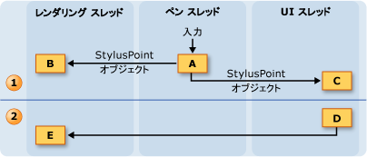
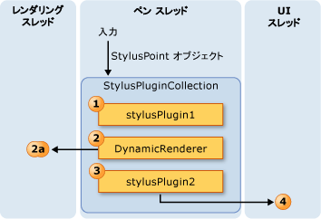

# インク スレッド モデルThe Ink Threading Model
Tablet PC 上のインクの利点の 1 つは、ことが多くように感じますが書き込みと用紙と正規ペンでです。One of the benefits of ink on a Tablet PC is that it feels a lot like writing with a regular pen and paper.  これを行うには、タブレット ペンは、速度が大幅に高くマウスは、ユーザーの書き込みとインクをレンダリングよりも入力データを収集します。To accomplish this, the tablet pen collects input data at a much higher rate than a mouse does and renders the ink as the user writes.  アプリケーションのユーザー インターフェイス (UI) スレッドではありませんペンのデータとレンダリング インクを収集するための十分なブロックになることができます。The application's user interface (UI) thread is not sufficient for collecting pen data and rendering ink, because it can become blocked.  これを解決するために、[!INCLUDE[TLA2#tla_winclient](../../../../includes/tla2sharptla-winclient-md.md)]アプリケーションが、ユーザーがインクを書き込む場合に、追加の 2 つのスレッドを使用します。To solve this, a [!INCLUDE[TLA2#tla_winclient](../../../../includes/tla2sharptla-winclient-md.md)] application uses two additional threads when a user writes ink.  
  
 次の一覧には、収集およびデジタル インクをレンダリングに関係するスレッドについて説明します。The following list describes the threads that take part in collecting and rendering digital ink:  
  
-   ペンのスレッドのスタイラスからの入力を受け取るスレッドです。Pen thread - the thread that takes input from the stylus.  (実際には、スレッド プールでは、これは、このトピックでは、ペン スレッドとして)。(In reality, this is a thread pool, but this topic refers to it as a pen thread.)  
  
-   アプリケーション ユーザー インターフェイス スレッドのアプリケーションのユーザー インターフェイスを制御するスレッド。Application user interface thread - the thread that controls the user interface of the application.  
  
-   動的なレンダリング スレッドに対し、ユーザーのインクをレンダリングするスレッドがストロークを描画します。Dynamic rendering thread - the thread that renders the ink while the user draws a stroke. ウィンドウ Presentation Foundation で説明したように、動的なレンダリング スレッドは、アプリケーションの場合は、他の UI 要素を描画するスレッドとは異なる[スレッド モデル](../../../../docs/framework/wpf/advanced/threading-model.md)です。The dynamic rendering thread is different than the thread that renders other UI elements for the application, as mentioned in Window Presentation Foundation [Threading Model](../../../../docs/framework/wpf/advanced/threading-model.md).  
  
 インクのモデルは、同じアプリケーションを使用しているかどうか、<xref:System.Windows.Controls.InkCanvas>またはカスタム コントロールでのような[インク入力コントロールを作成する](../../../../docs/framework/wpf/advanced/creating-an-ink-input-control.md)です。The inking model is the same whether the application uses the <xref:System.Windows.Controls.InkCanvas> or a custom control similar to the one in [Creating an Ink Input Control](../../../../docs/framework/wpf/advanced/creating-an-ink-input-control.md).  このトピックの観点でスレッド処理について説明しますが、 <xref:System.Windows.Controls.InkCanvas>、カスタム コントロールを作成するときに、同じ概念が適用されます。Although this topic discusses threading in terms of the <xref:System.Windows.Controls.InkCanvas>, the same concepts apply when you create a custom control.  
  
## スレッド処理の概要Threading Overview  
 次の図は、ユーザーがストロークを描画するときに、スレッディング モデルを示します。The following diagram illustrates the threading model when a user draws a stroke:  
  
 ![ストローク描画中のスレッド モデルです。] (../../../../docs/framework/wpf/advanced/media/inkthreading-drawingink.png "InkThreading_DrawingInk")  
  
1.  ユーザーがストロークを描画中に発生するアクションActions occurring while the user draws the stroke  
  
    1.  ユーザーがストロークを描画、スタイラス ポイントは、ペン スレッド上で提供されます。When the user draws a stroke, the stylus points come in on the pen thread.  スタイラス プラグインを含む、<xref:System.Windows.Input.StylusPlugIns.DynamicRenderer>は、ペンのスレッドでスタイラス ポイントを使用し、前にそれらを変更する可能性が高く、<xref:System.Windows.Controls.InkCanvas>受信します。Stylus plug-ins, including the <xref:System.Windows.Input.StylusPlugIns.DynamicRenderer>, accept the stylus points on the pen thread and have the chance to modify them before the <xref:System.Windows.Controls.InkCanvas> receives them.  
  
    2.  <xref:System.Windows.Input.StylusPlugIns.DynamicRenderer>動的レンダリング スレッドでスタイラス ポイントを表示します。The <xref:System.Windows.Input.StylusPlugIns.DynamicRenderer> renders the stylus points on the dynamic rendering thread. これは、前の手順と同時に発生します。This happens at the same time as the previous step.  
  
    3.  <xref:System.Windows.Controls.InkCanvas> UI スレッドでスタイラス ポイントを受信します。The <xref:System.Windows.Controls.InkCanvas> receives the stylus points on the UI thread.  
  
2.  ユーザーがストロークを終了した後に発生するアクションActions occurring after the user ends the stroke  
  
    1.  ユーザーがストロークを描画を終了するときに、<xref:System.Windows.Controls.InkCanvas>を作成、<xref:System.Windows.Ink.Stroke>オブジェクトを追加して、 <xref:System.Windows.Controls.InkPresenter>、静的にレンダリングします。When the user finishes drawing the stroke, the <xref:System.Windows.Controls.InkCanvas> creates a <xref:System.Windows.Ink.Stroke> object and adds it to the <xref:System.Windows.Controls.InkPresenter>, which statically renders it.  
  
    2.  UI スレッドのアラート、<xref:System.Windows.Input.StylusPlugIns.DynamicRenderer>線が表示される静的にするため、<xref:System.Windows.Input.StylusPlugIns.DynamicRenderer>ストロークのビジュアル表現を削除します。The UI thread alerts the <xref:System.Windows.Input.StylusPlugIns.DynamicRenderer> that the stroke is statically rendered, so the <xref:System.Windows.Input.StylusPlugIns.DynamicRenderer> removes its visual representation of the stroke.  
  
## スタイラス プラグインとインクの収集Ink collection and Stylus Plug-ins  
 各<xref:System.Windows.UIElement>が、<xref:System.Windows.Input.StylusPlugIns.StylusPlugInCollection>です。Each <xref:System.Windows.UIElement> has a <xref:System.Windows.Input.StylusPlugIns.StylusPlugInCollection>.  <xref:System.Windows.Input.StylusPlugIns.StylusPlugIn>内のオブジェクト、<xref:System.Windows.Input.StylusPlugIns.StylusPlugInCollection>受信およびペン スレッド上のスタイラス ポイントを変更することができます。The <xref:System.Windows.Input.StylusPlugIns.StylusPlugIn> objects in the <xref:System.Windows.Input.StylusPlugIns.StylusPlugInCollection> receive and can modify the stylus points on the pen thread. <xref:System.Windows.Input.StylusPlugIns.StylusPlugIn>オブジェクトを受け取るスタイラス ポイント順に従って、<xref:System.Windows.Input.StylusPlugIns.StylusPlugInCollection>です。The <xref:System.Windows.Input.StylusPlugIns.StylusPlugIn> objects receive the stylus points according to their order in the <xref:System.Windows.Input.StylusPlugIns.StylusPlugInCollection>.  
  
 次の図は、仮想的な状況を示しています。 ここで、<xref:System.Windows.UIElement.StylusPlugIns%2A>のコレクション、<xref:System.Windows.UIElement>が含まれています`stylusPlugin1`、 <xref:System.Windows.Input.StylusPlugIns.DynamicRenderer>、および`stylusPlugin2`点で、注文します。The following diagram illustrates the hypothetical situation where the <xref:System.Windows.UIElement.StylusPlugIns%2A> collection of a <xref:System.Windows.UIElement> contains `stylusPlugin1`, a <xref:System.Windows.Input.StylusPlugIns.DynamicRenderer>, and `stylusPlugin2`, in that order.  
  
 ![スタイラス プラグインの順序では、出力に影響します。] (../../../../docs/framework/wpf/advanced/media/inkthreading-pluginorder.png "InkThreading_PluginOrder")  
  
 上の図に、次の動作が行わをれます。In the previous diagram, the following behavior takes place:  
  
1.  `StylusPlugin1`x の値を変更し、y です。`StylusPlugin1` modifies the values for x and y.  
  
2.  <xref:System.Windows.Input.StylusPlugIns.DynamicRenderer>スタイラスの更新ポイントを受信し、動的なレンダリング スレッドでそれらを表示します。<xref:System.Windows.Input.StylusPlugIns.DynamicRenderer> receives the modified stylus points and renders them on the dynamic rendering thread.  
  
3.  `StylusPlugin2`スタイラスの更新ポイントを受信し、さらに x の値を変更し、y です。`StylusPlugin2` receives the modified stylus points and further modifies the values for x and y.  
  
4.  アプリケーションでは、スタイラス ポイントを収集し、ユーザーがストロークを完了すると、静的にストロークを描画します。The application collects the stylus points, and, when the user finishes the stroke, statically renders the stroke.  
  
 仮定します`stylusPlugin1`四角形にスタイラスのポイントを制限し、`stylusPlugin2`右側にスタイラスのポイントに変換します。Suppose that `stylusPlugin1` restricts the stylus points to a rectangle and `stylusPlugin2` translates the stylus points to the right.  上記のシナリオでは、<xref:System.Windows.Input.StylusPlugIns.DynamicRenderer>が制限されたスタイラス ポイントが、翻訳済みのスタイラス点ではないです。In the previous scenario, the <xref:System.Windows.Input.StylusPlugIns.DynamicRenderer> receives the restricted stylus points, but not the translated stylus points.  ユーザーがストロークを描画、ストロークは、四角形の境界内でレンダリングされますが、ユーザーがペンを持ち上げるまでに翻訳する線が表示されません。When the user draws the stroke, the stroke is rendered within the bounds of the rectangle, but the stroke doesn't appear to be translated until the user lifts the pen.  
  
### スタイラスの UI スレッドでプラグインを使用して操作を実行します。Performing operations with a Stylus Plug-in on the UI thread  
 ペンのスレッドでは、正確なヒット テストを実行できない、ためにによっては、いくつかの要素がスタイラス入力用の他の要素を受け取ることがあります。Because accurate hit-testing cannot be performed on the pen thread, some elements might occasionally receive stylus input intended for other elements. サブスクライブしで操作を実行する操作を実行する前に、入力が正しく回送されたことを確認する必要がある場合、 <xref:System.Windows.Input.StylusPlugIns.StylusPlugIn.OnStylusDownProcessed%2A>、 <xref:System.Windows.Input.StylusPlugIns.StylusPlugIn.OnStylusMoveProcessed%2A>、または<xref:System.Windows.Input.StylusPlugIns.StylusPlugIn.OnStylusUpProcessed%2A>メソッドです。If you need to make sure the input was routed correctly before performing an operation, subscribe to and perform the operation in the <xref:System.Windows.Input.StylusPlugIns.StylusPlugIn.OnStylusDownProcessed%2A>, <xref:System.Windows.Input.StylusPlugIns.StylusPlugIn.OnStylusMoveProcessed%2A>, or <xref:System.Windows.Input.StylusPlugIns.StylusPlugIn.OnStylusUpProcessed%2A> method. これらのメソッドは、正確なヒット テストが実行された後に、アプリケーションのスレッドによって呼び出されます。These methods are invoked by the application thread after accurate hit-testing has been performed. これらのメソッドをサブスクライブする、<xref:System.Windows.Input.StylusPlugIns.RawStylusInput.NotifyWhenProcessed%2A>ペンのスレッドで使用されるメソッドのメソッドです。To subscribe to these methods, call the <xref:System.Windows.Input.StylusPlugIns.RawStylusInput.NotifyWhenProcessed%2A> method in the method that occurs on the pen thread.  
  
 次の図は、ペン スレッドとのスタイラス イベントに関して UI スレッド間のリレーションシップ、<xref:System.Windows.Input.StylusPlugIns.StylusPlugIn>です。The following diagram illustrates the relationship between the pen thread and UI thread with respect to the stylus events of a <xref:System.Windows.Input.StylusPlugIns.StylusPlugIn>.  
  
 ![インク スレッド処理モデル &#40;です。UI およびペン &#41;] (../../../../docs/framework/wpf/advanced/media/inkthreading-plugincallbacks.png "InkThreading_PluginCallbacks")  
  
## インクをレンダリングRendering Ink  
 ユーザーがストロークを描画と<xref:System.Windows.Input.StylusPlugIns.DynamicRenderer>"をフローする"、ペンから UI スレッドがビジー状態である場合でも、インクが表示されるように、別のスレッド上のインクをレンダリングします。As the user draws a stroke, <xref:System.Windows.Input.StylusPlugIns.DynamicRenderer> renders the ink on a separate thread so the ink appears to "flow" from the pen even when the UI thread is busy.  <xref:System.Windows.Input.StylusPlugIns.DynamicRenderer>スタイラス ポイントを収集するように、動的なレンダリング スレッドでビジュアル ツリーを構築します。The <xref:System.Windows.Input.StylusPlugIns.DynamicRenderer> builds a visual tree on the dynamic rendering thread as it collects stylus points.  ユーザーがストロークを完了すると、<xref:System.Windows.Input.StylusPlugIns.DynamicRenderer>アプリケーションが実行すると、次の表示パスに通知するように要求します。When the user finishes the stroke, the <xref:System.Windows.Input.StylusPlugIns.DynamicRenderer> asks to be notified when the application does the next rendering pass.  アプリケーションが、次のレンダリング パスが完了した後、<xref:System.Windows.Input.StylusPlugIns.DynamicRenderer>そのビジュアル ツリーをクリーンアップします。After the application completes the next rendering pass, the <xref:System.Windows.Input.StylusPlugIns.DynamicRenderer> cleans up its visual tree.  次の図は、このプロセスを示しています。The following diagram illustrates this process.  
  
   
  
1.  ユーザーがストロークを開始します。The user begins the stroke.  
  
    1.  <xref:System.Windows.Input.StylusPlugIns.DynamicRenderer>ビジュアル ツリーを作成します。The <xref:System.Windows.Input.StylusPlugIns.DynamicRenderer> creates the visual tree.  
  
2.  ユーザーがストロークを描画します。The user is drawing the stroke.  
  
    1.  <xref:System.Windows.Input.StylusPlugIns.DynamicRenderer>ビジュアル ツリーを構築します。The <xref:System.Windows.Input.StylusPlugIns.DynamicRenderer> builds the visual tree.  
  
3.  ユーザーがストロークを終了します。The user ends the stroke.  
  
    1.  <xref:System.Windows.Controls.InkPresenter>ストロークをそのビジュアル ツリーに追加します。The <xref:System.Windows.Controls.InkPresenter> adds the stroke to its visual tree.  
  
    2.  メディアの統合レイヤー (数 600万個) は、静的にストロークを描画します。The Media Integration Layer (MIL) statically renders the strokes.  
  
    3.  <xref:System.Windows.Input.StylusPlugIns.DynamicRenderer>のビジュアルをクリーンアップします。The <xref:System.Windows.Input.StylusPlugIns.DynamicRenderer> cleans up the visuals.
