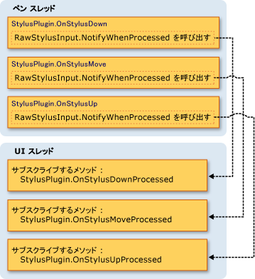
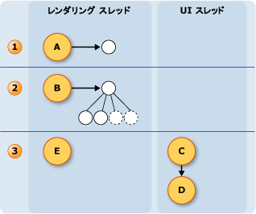

# インク スレッド モデル
Tablet PC 上のインクの利点の 1 つは、ことが多くように感じますが書き込みと用紙と正規ペンでです。  これを行うには、タブレット ペンは、速度が大幅に高くマウスは、ユーザーの書き込みとインクをレンダリングよりも入力データを収集します。  アプリケーションのユーザー インターフェイス (UI) スレッドではありませんペンのデータとレンダリング インクを収集するための十分なブロックになることができます。  これを解決するために、[!INCLUDE[TLA2#tla_winclient](../../../../includes/tla2sharptla-winclient-md.md)]アプリケーションが、ユーザーがインクを書き込む場合に、追加の 2 つのスレッドを使用します。  
  
 次の一覧には、収集およびデジタル インクをレンダリングに関係するスレッドについて説明します。  
  
-   ペンのスレッドのスタイラスからの入力を受け取るスレッドです。  (実際には、スレッド プールでは、これは、このトピックでは、ペン スレッドとして)。  
  
-   アプリケーション ユーザー インターフェイス スレッドのアプリケーションのユーザー インターフェイスを制御するスレッド。  
  
-   動的なレンダリング スレッドに対し、ユーザーのインクをレンダリングするスレッドがストロークを描画します。 ウィンドウ Presentation Foundation で説明したように、動的なレンダリング スレッドは、アプリケーションの場合は、他の UI 要素を描画するスレッドとは異なる[スレッド モデル](../../../../docs/framework/wpf/advanced/threading-model.md)です。  
  
 インクのモデルは、同じアプリケーションを使用しているかどうか、<xref:System.Windows.Controls.InkCanvas>またはカスタム コントロールでのような[インク入力コントロールを作成する](../../../../docs/framework/wpf/advanced/creating-an-ink-input-control.md)です。  このトピックの観点でスレッド処理について説明しますが、 <xref:System.Windows.Controls.InkCanvas>、カスタム コントロールを作成するときに、同じ概念が適用されます。  
  
## スレッド処理の概要  
 次の図は、ユーザーがストロークを描画するときに、スレッディング モデルを示します。  
  
 ![ストローク描画中のスレッド モデルです。] (../../../../docs/framework/wpf/advanced/media/inkthreading-drawingink.png "InkThreading_DrawingInk")  
  
1.  ユーザーがストロークを描画中に発生するアクション  
  
    1.  ユーザーがストロークを描画、スタイラス ポイントは、ペン スレッド上で提供されます。  スタイラス プラグインを含む、<xref:System.Windows.Input.StylusPlugIns.DynamicRenderer>は、ペンのスレッドでスタイラス ポイントを使用し、前にそれらを変更する可能性が高く、<xref:System.Windows.Controls.InkCanvas>受信します。  
  
    2.  <xref:System.Windows.Input.StylusPlugIns.DynamicRenderer>動的レンダリング スレッドでスタイラス ポイントを表示します。 これは、前の手順と同時に発生します。  
  
    3.  <xref:System.Windows.Controls.InkCanvas> UI スレッドでスタイラス ポイントを受信します。  
  
2.  ユーザーがストロークを終了した後に発生するアクション  
  
    1.  ユーザーがストロークを描画を終了するときに、<xref:System.Windows.Controls.InkCanvas>を作成、<xref:System.Windows.Ink.Stroke>オブジェクトを追加して、 <xref:System.Windows.Controls.InkPresenter>、静的にレンダリングします。  
  
    2.  UI スレッドのアラート、<xref:System.Windows.Input.StylusPlugIns.DynamicRenderer>線が表示される静的にするため、<xref:System.Windows.Input.StylusPlugIns.DynamicRenderer>ストロークのビジュアル表現を削除します。  
  
## スタイラス プラグインとインクの収集  
 各<xref:System.Windows.UIElement>が、<xref:System.Windows.Input.StylusPlugIns.StylusPlugInCollection>です。  <xref:System.Windows.Input.StylusPlugIns.StylusPlugIn>内のオブジェクト、<xref:System.Windows.Input.StylusPlugIns.StylusPlugInCollection>受信およびペン スレッド上のスタイラス ポイントを変更することができます。 <xref:System.Windows.Input.StylusPlugIns.StylusPlugIn>オブジェクトを受け取るスタイラス ポイント順に従って、<xref:System.Windows.Input.StylusPlugIns.StylusPlugInCollection>です。  
  
 次の図は、仮想的な状況を示しています。 ここで、<xref:System.Windows.UIElement.StylusPlugIns%2A>のコレクション、<xref:System.Windows.UIElement>が含まれています`stylusPlugin1`、 <xref:System.Windows.Input.StylusPlugIns.DynamicRenderer>、および`stylusPlugin2`点で、注文します。  
  
 ![スタイラス プラグインの順序では、出力に影響します。] (../../../../docs/framework/wpf/advanced/media/inkthreading-pluginorder.png "InkThreading_PluginOrder")  
  
 上の図に、次の動作が行わをれます。  
  
1.  `StylusPlugin1` x の値を変更し、y です。  
  
2.  <xref:System.Windows.Input.StylusPlugIns.DynamicRenderer> スタイラスの更新ポイントを受信し、動的なレンダリング スレッドでそれらを表示します。  
  
3.  `StylusPlugin2` スタイラスの更新ポイントを受信し、さらに x の値を変更し、y です。  
  
4.  アプリケーションでは、スタイラス ポイントを収集し、ユーザーがストロークを完了すると、静的にストロークを描画します。  
  
 仮定します`stylusPlugin1`四角形にスタイラスのポイントを制限し、`stylusPlugin2`右側にスタイラスのポイントに変換します。  上記のシナリオでは、<xref:System.Windows.Input.StylusPlugIns.DynamicRenderer>が制限されたスタイラス ポイントが、翻訳済みのスタイラス点ではないです。  ユーザーがストロークを描画、ストロークは、四角形の境界内でレンダリングされますが、ユーザーがペンを持ち上げるまでに翻訳する線が表示されません。  
  
### スタイラスの UI スレッドでプラグインを使用して操作を実行します。  
 ペンのスレッドでは、正確なヒット テストを実行できない、ためにによっては、いくつかの要素がスタイラス入力用の他の要素を受け取ることがあります。 サブスクライブしで操作を実行する操作を実行する前に、入力が正しく回送されたことを確認する必要がある場合、 <xref:System.Windows.Input.StylusPlugIns.StylusPlugIn.OnStylusDownProcessed%2A>、 <xref:System.Windows.Input.StylusPlugIns.StylusPlugIn.OnStylusMoveProcessed%2A>、または<xref:System.Windows.Input.StylusPlugIns.StylusPlugIn.OnStylusUpProcessed%2A>メソッドです。 これらのメソッドは、正確なヒット テストが実行された後に、アプリケーションのスレッドによって呼び出されます。 これらのメソッドをサブスクライブする、<xref:System.Windows.Input.StylusPlugIns.RawStylusInput.NotifyWhenProcessed%2A>ペンのスレッドで使用されるメソッドのメソッドです。  
  
 次の図は、ペン スレッドとのスタイラス イベントに関して UI スレッド間のリレーションシップ、<xref:System.Windows.Input.StylusPlugIns.StylusPlugIn>です。  
  
   
  
## インクをレンダリング  
 ユーザーがストロークを描画と<xref:System.Windows.Input.StylusPlugIns.DynamicRenderer>"をフローする"、ペンから UI スレッドがビジー状態である場合でも、インクが表示されるように、別のスレッド上のインクをレンダリングします。  <xref:System.Windows.Input.StylusPlugIns.DynamicRenderer>スタイラス ポイントを収集するように、動的なレンダリング スレッドでビジュアル ツリーを構築します。  ユーザーがストロークを完了すると、<xref:System.Windows.Input.StylusPlugIns.DynamicRenderer>アプリケーションが実行すると、次の表示パスに通知するように要求します。  アプリケーションが、次のレンダリング パスが完了した後、<xref:System.Windows.Input.StylusPlugIns.DynamicRenderer>そのビジュアル ツリーをクリーンアップします。  次の図は、このプロセスを示しています。  
  
   
  
1.  ユーザーがストロークを開始します。  
  
    1.  <xref:System.Windows.Input.StylusPlugIns.DynamicRenderer>ビジュアル ツリーを作成します。  
  
2.  ユーザーがストロークを描画します。  
  
    1.  <xref:System.Windows.Input.StylusPlugIns.DynamicRenderer>ビジュアル ツリーを構築します。  
  
3.  ユーザーがストロークを終了します。  
  
    1.  <xref:System.Windows.Controls.InkPresenter>ストロークをそのビジュアル ツリーに追加します。  
  
    2.  メディアの統合レイヤー (数 600万個) は、静的にストロークを描画します。  
  
    3.  <xref:System.Windows.Input.StylusPlugIns.DynamicRenderer>のビジュアルをクリーンアップします。
